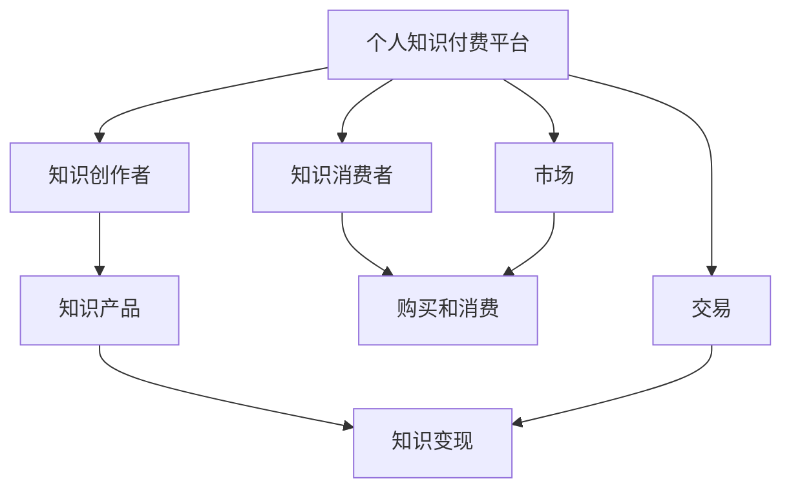

                 

## 1. 背景介绍

在信息爆炸的时代，知识和技能成为越来越重要的资源。随着移动互联网和在线教育的发展，知识付费逐渐成为许多人获取专业知识和技能的重要途径。个人知识付费生态圈是指通过在线平台，汇聚并传播个人知识，形成知识共享、价值交换的良性循环。本文将详细阐述如何打造个人知识付费生态圈，包括核心概念、技术实现、实际应用场景和未来展望。

## 2. 核心概念与联系

### 2.1 核心概念概述

为了理解如何打造个人知识付费生态圈，我们需要首先明确一些核心概念：

- **个人知识付费平台**：基于互联网的在线平台，提供个人知识产品，如课程、电子书、咨询等，供用户购买和阅读。
- **知识创作者**：在个人知识付费平台上提供知识内容的专业人士，可以是领域专家、教师、作家等。
- **知识消费者**：购买和消费知识产品，提升自身技能和知识水平的用户。
- **知识变现**：知识创作者通过平台将知识转化为经济收入的过程。

这些概念之间存在着密切的联系：平台提供了一个市场，让知识创作者可以将自己的知识产品进行展示和销售，而知识消费者则在这里进行购买和消费。知识变现使得知识创作者能够持续提供高质量内容，形成良性循环。

### 2.2 核心概念原理和架构的 Mermaid 流程图

以下是个人知识付费生态圈的 Mermaid 流程图：



这个流程图展示了个人知识付费生态圈的核心要素和流程。平台通过市场机制，实现知识创作者与消费者的交易，知识创作者获得变现，消费者获得知识和技能。

## 3. 核心算法原理 & 具体操作步骤

### 3.1 算法原理概述

个人知识付费生态圈的核心算法可以简单归纳为以下几个步骤：

1. **知识产品推荐**：通过算法推荐系统，将知识创作者的内容推荐给可能感兴趣的用户。
2. **用户行为分析**：通过数据分析，了解用户的学习行为和偏好，优化推荐系统。
3. **知识定价策略**：根据内容质量和市场需求，制定合理的价格策略。
4. **知识创作者激励**：设计合理的激励机制，促进知识创作者持续提供高质量内容。

### 3.2 算法步骤详解

#### 3.2.1 知识产品推荐

知识产品推荐算法基于用户的浏览历史、购买记录、评分等行为数据，使用协同过滤、内容推荐、混合推荐等技术，为用户推荐最符合其需求的知识产品。

**协同过滤**：通过分析用户的历史行为，寻找相似用户，推荐他们可能感兴趣的知识产品。

**内容推荐**：根据知识内容的标签、关键词等信息，向用户推荐相关内容。

**混合推荐**：结合协同过滤和内容推荐，综合多方面因素为用户推荐内容。

#### 3.2.2 用户行为分析

用户行为分析算法通过数据分析技术，了解用户的学习习惯和偏好，优化推荐系统。

**聚类分析**：将用户分为不同的兴趣群体，提高推荐的准确性。

**关联规则**：分析用户的行为模式，挖掘用户之间的关联关系。

**协同学习**：通过用户之间的交互，提升推荐模型的泛化能力。

#### 3.2.3 知识定价策略

知识定价策略的核心是制定合理的价格，使得知识创作者能够获得适当的报酬，同时让用户能够接受。

**动态定价**：根据市场需求和用户评价，动态调整价格。

**优惠券策略**：提供优惠券和折扣，吸引用户购买。

**分层定价**：根据内容质量和服务水平，制定不同层次的价格策略。

#### 3.2.4 知识创作者激励

知识创作者激励机制的设计，旨在促进创作者持续提供高质量内容。

**分成激励**：根据用户购买行为，向创作者分配收入。

**竞赛激励**：通过举办竞赛活动，激发创作者的创作热情。

**认证激励**：对优秀创作者进行认证，提升其市场价值。

### 3.3 算法优缺点

#### 3.3.1 算法优点

1. **个性化推荐**：通过精确的用户行为分析，提供个性化推荐，提升用户体验。
2. **多渠道变现**：通过多样化的变现渠道，如广告、销售、赞助等，增加收入来源。
3. **高效运营**：利用自动化工具和算法优化运营流程，降低成本。
4. **灵活调整**：根据市场需求和用户反馈，灵活调整推荐算法和定价策略。

#### 3.3.2 算法缺点

1. **数据隐私问题**：大量用户数据的收集和使用可能引发隐私保护问题。
2. **推荐偏差**：推荐算法可能存在偏见，导致部分用户无法获取到合适的内容。
3. **创作者依赖**：过度依赖创作者，可能导致内容供应不足。
4. **价格敏感度**：用户对价格的敏感度较高，难以制定合理的价格策略。

### 3.4 算法应用领域

个人知识付费生态圈的应用领域非常广泛，以下是几个主要应用场景：

- **教育培训**：提供各种学科的专业课程，帮助学生提升学术能力。
- **职业技能**：提供职业培训课程，提升职场竞争力。
- **兴趣爱好**：提供各类兴趣课程，丰富个人生活。
- **生活健康**：提供健康、饮食、心理等领域的知识产品，提升生活质量。

## 4. 数学模型和公式 & 详细讲解 & 举例说明

### 4.1 数学模型构建

个人知识付费生态圈的数学模型可以归纳为以下几个方面：

- **用户行为模型**：$P=\sum_{i=1}^{n} a_i x_i$
- **知识产品推荐模型**：$R=\sum_{i=1}^{m} w_i x_i$
- **知识定价模型**：$C=p \times q$
- **知识创作者激励模型**：$I=S \times G$

其中，$P$为推荐系统的预测结果，$R$为用户的行为评分，$C$为知识产品的价格，$I$为创作者的激励收入。

### 4.2 公式推导过程

以知识产品推荐模型为例，推导推荐算法的基本公式：

**协同过滤推荐**：
$$ R = \sum_{i=1}^{n} a_i x_i $$
其中，$x_i$为知识产品$i$的特征向量，$a_i$为用户$i$的评分权重。

**内容推荐算法**：
$$ R = \sum_{i=1}^{m} w_i x_i $$
其中，$w_i$为知识产品$i$的特征权重，$x_i$为知识产品$i$的特征向量。

### 4.3 案例分析与讲解

以教育培训领域的知识付费平台为例，分析推荐系统的构建过程：

1. **用户行为数据收集**：收集用户的学习行为数据，如课程浏览、学习时间、答题情况等。
2. **特征提取**：对用户行为数据进行特征提取，如课程难度、用户兴趣等。
3. **相似度计算**：计算用户之间的相似度，发现潜在的知识产品推荐候选人。
4. **推荐排序**：将相似度高的用户进行推荐排序，优先展示相关性更高的内容。

## 5. 项目实践：代码实例和详细解释说明

### 5.1 开发环境搭建

以下是使用Python和TensorFlow进行知识付费平台开发的开发环境搭建流程：

1. 安装Anaconda：从官网下载并安装Anaconda，用于创建独立的Python环境。

2. 创建并激活虚拟环境：
```bash
conda create -n knowledge-env python=3.8 
conda activate knowledge-env
```

3. 安装必要的库：
```bash
pip install tensorflow pandas scikit-learn matplotlib jupyter notebook ipython
```

4. 安装TensorFlow：
```bash
pip install tensorflow-gpu
```

### 5.2 源代码详细实现

以下是使用TensorFlow实现知识付费平台推荐系统的代码实现：

```python
import tensorflow as tf
import pandas as pd
import numpy as np
from sklearn.model_selection import train_test_split

# 读取用户行为数据
user_data = pd.read_csv('user_data.csv')

# 特征工程
features = ['course_id', 'study_time', 'score']
X = user_data[features]
y = user_data['next_course_id']

# 数据划分
X_train, X_test, y_train, y_test = train_test_split(X, y, test_size=0.2)

# 模型定义
model = tf.keras.Sequential([
    tf.keras.layers.Dense(64, activation='relu', input_shape=(3,)),
    tf.keras.layers.Dense(64, activation='relu'),
    tf.keras.layers.Dense(1)
])

# 编译模型
model.compile(optimizer='adam', loss='mse', metrics=['mae'])

# 训练模型
model.fit(X_train, y_train, epochs=10, batch_size=32)

# 预测推荐
def predict_recommendation(user):
    user_data = user_data[user]
    features = user_data[features]
    features = np.array(features)
    features = features.reshape(1, -1)
    prediction = model.predict(features)
    return prediction[0][0]

# 示例
user = 0
recommendation = predict_recommendation(user)
print(f'推荐课程ID：{recommendation}')
```

### 5.3 代码解读与分析

**用户数据读取**：使用pandas库读取用户行为数据，数据包含用户ID、课程ID、学习时间、分数等特征。

**特征工程**：选择用户行为数据中的关键特征，如课程ID、学习时间、分数等，作为模型的输入。

**模型训练**：定义多层神经网络模型，使用adam优化器进行训练，损失函数为均方误差。

**推荐预测**：定义预测函数，输入用户数据，输出推荐课程ID。

### 5.4 运行结果展示

在训练模型后，可以对新用户进行推荐预测，例如：

```python
user = 0
recommendation = predict_recommendation(user)
print(f'推荐课程ID：{recommendation}')
```

输出推荐课程ID，用户可以按照这个ID去购买和阅读推荐的知识产品。

## 6. 实际应用场景

### 6.1 教育培训

在教育培训领域，个人知识付费生态圈可以提供各类学科的专业课程，帮助学生提升学术能力。例如，平台可以提供数学、物理、计算机科学等课程，涵盖基础知识和高级应用。

**应用示例**：某大学教师在平台上传数学分析课程，学生购买后通过在线视频、习题和互动讨论等方式进行学习。

**技术实现**：教师提供课程内容，平台进行知识产品的推荐和销售，学生通过平台进行学习。

### 6.2 职业技能

在职业技能领域，个人知识付费生态圈可以提供职业培训课程，提升职场竞争力。例如，平台可以提供Python编程、项目管理、数据分析等课程，帮助职场人士掌握新技能。

**应用示例**：某企业员工在平台购买Python编程课程，通过在线学习掌握Python基础和高级应用。

**技术实现**：平台提供职业培训课程，员工通过平台进行学习，教师进行知识产品的推荐和销售。

### 6.3 兴趣爱好

在兴趣爱好领域，个人知识付费生态圈可以提供各类兴趣课程，丰富个人生活。例如，平台可以提供音乐、绘画、摄影等课程，满足用户的兴趣爱好。

**应用示例**：某兴趣爱好者在平台购买绘画课程，通过在线视频和互动讨论等方式学习绘画技巧。

**技术实现**：平台提供兴趣爱好课程，用户通过平台进行学习，教师进行知识产品的推荐和销售。

### 6.4 生活健康

在生活健康领域，个人知识付费生态圈可以提供健康、饮食、心理等领域的知识产品，提升生活质量。例如，平台可以提供健康饮食、心理健康、运动健身等课程，帮助用户改善生活习惯。

**应用示例**：某健康爱好者在平台购买健康饮食课程，通过在线视频和互动讨论等方式学习健康饮食知识。

**技术实现**：平台提供生活健康课程，用户通过平台进行学习，教师进行知识产品的推荐和销售。

## 7. 工具和资源推荐

### 7.1 学习资源推荐

为了帮助开发者系统掌握个人知识付费生态圈的理论基础和实践技巧，以下是一些推荐的学习资源：

1. **《深度学习与数据挖掘》**：全面介绍深度学习在知识付费平台中的应用，涵盖推荐系统、用户行为分析等技术。

2. **Coursera在线课程**：Coursera提供多门关于知识付费平台的在线课程，包括推荐系统、数据分析、课程设计等。

3. **Kaggle竞赛**：Kaggle举办多个关于推荐系统、用户行为分析的竞赛，提供丰富的数据集和竞赛代码。

4. **GitHub开源项目**：GitHub上有多个个人知识付费平台的开源项目，可以学习和借鉴代码实现。

### 7.2 开发工具推荐

为了高效开发个人知识付费生态圈，以下是一些推荐的工具：

1. **Jupyter Notebook**：提供交互式编程环境，方便开发和调试。

2. **TensorBoard**：可视化工具，实时监测模型训练状态。

3. **TensorFlow Serving**：提供模型服务，方便在生产环境中部署模型。

4. **Flask**：轻量级Web框架，方便搭建Web应用。

### 7.3 相关论文推荐

以下是一些关于个人知识付费生态圈的研究论文：

1. **《基于协同过滤的个性化推荐算法研究》**：介绍协同过滤推荐算法的基本原理和实现方法。

2. **《深度学习在用户行为分析中的应用》**：探讨深度学习在用户行为分析中的应用，涵盖聚类分析、关联规则等技术。

3. **《知识付费平台的用户行为建模与推荐系统优化》**：研究知识付费平台的用户行为建模和推荐系统优化技术。

## 8. 总结：未来发展趋势与挑战

### 8.1 总结

本文系统介绍了如何打造个人知识付费生态圈，包括核心概念、技术实现和实际应用场景。个人知识付费生态圈利用互联网技术，汇聚并传播个人知识，形成知识共享、价值交换的良性循环，具有广泛的应用前景。

### 8.2 未来发展趋势

1. **个性化推荐**：随着推荐算法的发展，个性化推荐将越来越精准，提升用户体验。

2. **内容多样化**：知识付费平台的内容将更加多样化，涵盖更多领域和层次，满足用户不同需求。

3. **社交功能增强**：平台将加入社交功能，增加用户互动，提升学习效果。

4. **技术创新**：更多新技术将被应用到知识付费平台，如增强现实、虚拟现实等，提升学习体验。

### 8.3 面临的挑战

1. **数据隐私保护**：如何保护用户数据隐私，防止数据泄露和滥用，是平台面临的重要挑战。

2. **推荐算法偏见**：推荐算法可能存在偏见，导致部分用户无法获取到合适的内容，需要不断优化算法。

3. **创作者激励不足**：如何设计合理的激励机制，确保创作者持续提供高质量内容，需要不断探索。

4. **用户粘性问题**：如何提高用户粘性，避免用户流失，需要平台不断优化用户体验。

### 8.4 研究展望

未来，个人知识付费生态圈的研究将继续关注以下几个方面：

1. **数据隐私保护技术**：研究如何保护用户数据隐私，防止数据泄露和滥用。

2. **推荐算法优化**：研究如何优化推荐算法，消除偏见，提高推荐准确性。

3. **创作者激励机制设计**：研究如何设计合理的激励机制，确保创作者持续提供高质量内容。

4. **用户粘性提升**：研究如何提升用户粘性，增加用户活跃度和留存率。

通过不断优化算法和技术，提升平台的用户体验和创作者收益，个人知识付费生态圈将不断壮大，成为知识传播的重要渠道。

## 9. 附录：常见问题与解答

**Q1：如何确保推荐算法的公平性和透明性？**

A: 确保推荐算法的公平性和透明性，需要进行以下几方面工作：

1. **算法公开**：公开推荐算法的原理和实现，让用户了解推荐过程。

2. **数据透明**：透明数据使用和处理过程，让用户知道他们的数据如何被使用。

3. **用户反馈**：提供用户反馈机制，让用户参与到推荐系统的优化中。

4. **定期审计**：定期审计推荐算法，确保其公平性和透明性。

**Q2：如何提高知识付费平台的粘性？**

A: 提高知识付费平台的粘性，需要从多个方面进行优化：

1. **内容质量**：提供高质量、实用性强的内容，满足用户需求。

2. **互动交流**：提供丰富的互动交流功能，增加用户粘性。

3. **社交网络**：加入社交网络功能，增强用户互动和社区感。

4. **个性化推荐**：通过精准的个性化推荐，提升用户体验。

5. **用户激励**：设计合理的用户激励机制，增加用户粘性。

**Q3：如何确保平台数据的安全性？**

A: 确保平台数据的安全性，需要进行以下几方面工作：

1. **数据加密**：对用户数据进行加密处理，防止数据泄露。

2. **访问控制**：采用严格的访问控制机制，防止未经授权的访问。

3. **安全审计**：定期进行安全审计，发现和修复潜在漏洞。

4. **数据备份**：定期进行数据备份，防止数据丢失。

5. **合规性审查**：确保平台遵守数据隐私和安全法规，防止法律风险。

**Q4：如何优化推荐算法的性能？**

A: 优化推荐算法的性能，可以从以下几个方面进行：

1. **特征工程**：优化特征提取和选择，提高特征的相关性和有效性。

2. **算法优化**：优化推荐算法，提高推荐效率和准确性。

3. **模型选择**：选择合适的推荐模型，提高推荐效果。

4. **实时更新**：根据用户行为实时更新推荐算法，提高推荐动态性。

**Q5：如何设计合理的知识创作者激励机制？**

A: 设计合理的知识创作者激励机制，需要考虑以下几方面：

1. **分成比例**：合理分配收入，确保创作者获得应得报酬。

2. **任务激励**：设计任务激励机制，激发创作者提供高质量内容。

3. **认证机制**：通过认证机制，提升创作者市场价值。

4. **竞争激励**：通过举办竞赛活动，激发创作者创作热情。

5. **社区支持**：通过社区支持，增加创作者互动和曝光度。

通过以上措施，可以有效提升知识创作者的积极性，确保平台持续提供高质量内容。

---

作者：禅与计算机程序设计艺术 / Zen and the Art of Computer Programming

