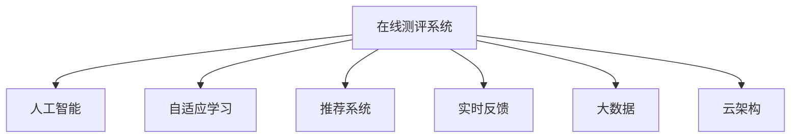

                 

# 如何打造知识付费的在线测评系统

> 关键词：在线测评系统,知识付费,人工智能,自适应学习,推荐系统,实时反馈,大数据,云架构

## 1. 背景介绍

随着互联网的普及和在线教育的兴起，知识付费逐渐成为热门趋势。用户在在线教育平台付费获取知识的同时，也期望得到高效、个性化的学习体验。因此，如何打造一个满足用户需求的在线测评系统，成为了各大平台竞争的焦点。本文将详细介绍如何基于人工智能技术，打造一个高效、个性化、可靠的在线测评系统。

## 2. 核心概念与联系

### 2.1 核心概念概述

为了更好地理解在线测评系统的实现原理，本节将介绍几个密切相关的核心概念：

- **在线测评系统**：指通过网络平台进行的测评系统，用户可以在线完成测评、查看分数、接受反馈。广泛应用于在线教育、招聘、技能认证等领域。
- **知识付费**：指用户为获取特定知识或服务而支付费用的模式。在线测评系统作为知识付费平台的核心功能，为用户提供个性化的学习体验。
- **人工智能**：指通过算法和数据，使计算机具备智能化的能力。在线测评系统利用人工智能技术，实现个性化推荐、自适应学习等功能。
- **自适应学习**：指根据用户的学习情况和反馈，自动调整教学内容和难度，以实现个性化教学。在线测评系统通过数据分析和机器学习，支持自适应学习。
- **推荐系统**：指根据用户的历史行为和偏好，推荐个性化的内容。在线测评系统利用推荐系统，向用户推荐适合的学习资源。
- **实时反馈**：指在用户学习过程中，即时提供学习效果和反馈。在线测评系统通过数据分析和算法优化，实现实时反馈。
- **大数据**：指规模巨大的数据集合，用于分析和挖掘有价值的信息。在线测评系统通过大数据分析，实现精确的测评和推荐。
- **云架构**：指基于云服务的架构，提供可扩展、可靠、高效的服务。在线测评系统采用云架构，确保系统稳定运行和高效扩展。

这些核心概念之间的逻辑关系可以通过以下Mermaid流程图来展示：



这个流程图展示了大规模在线测评系统的核心概念及其之间的关系：

1. 在线测评系统通过人工智能技术，实现自适应学习、推荐系统、实时反馈等功能。
2. 人工智能技术依赖大数据分析，提供精准的推荐和测评。
3. 自适应学习、推荐系统、实时反馈等功能的实现，离不开云架构的支持。

## 3. 核心算法原理 & 具体操作步骤
### 3.1 算法原理概述

在线测评系统的核心算法原理主要包括自适应学习、推荐系统和实时反馈三个方面。本节将详细讲解这三个核心算法的原理和实现方法。

### 3.2 算法步骤详解

#### 3.2.1 自适应学习算法

自适应学习算法通过分析用户的学习行为和反馈，动态调整教学内容和难度，以实现个性化教学。其基本步骤如下：

1. **数据收集**：收集用户的学习行为数据，如观看视频时长、答题正确率、观看次数等。
2. **特征提取**：从数据中提取用户的关键特征，如学习时长、正确率、学习习惯等。
3. **模型训练**：使用机器学习算法（如随机森林、梯度提升树、神经网络等）训练模型，预测用户的学习能力和兴趣。
4. **内容推荐**：根据用户的学习能力和兴趣，推荐适合的教学内容和学习路径。
5. **难度调整**：根据用户的学习情况和反馈，动态调整教学内容的难度，以适应用户的实际情况。

#### 3.2.2 推荐系统算法

推荐系统算法通过分析用户的历史行为和偏好，推荐个性化的学习资源。其基本步骤如下：

1. **用户画像**：分析用户的历史行为数据，构建用户画像，包括兴趣、偏好、学习水平等。
2. **内容分析**：分析教学内容的属性，如难度、知识点、学习时长等。
3. **模型训练**：使用协同过滤、矩阵分解、神经网络等算法训练推荐模型，预测用户对不同教学内容的评分。
4. **推荐生成**：根据预测评分和用户画像，生成个性化的学习资源推荐列表。
5. **推荐优化**：根据用户的反馈和行为，动态优化推荐算法，提高推荐效果。

#### 3.2.3 实时反馈算法

实时反馈算法通过分析用户的学习行为和效果，即时提供学习效果和反馈。其基本步骤如下：

1. **行为分析**：收集用户的学习行为数据，如答题时间、错题数量、学习时长等。
2. **效果评估**：使用机器学习算法（如回归分析、分类器等）评估用户的学习效果。
3. **反馈生成**：根据学习效果，生成个性化反馈信息，如建议、错题分析等。
4. **反馈展示**：将反馈信息展示给用户，帮助用户改进学习策略。

### 3.3 算法优缺点

在线测评系统的主要算法具有以下优点：

- **个性化**：通过自适应学习和推荐系统，实现个性化的教学和资源推荐，提升用户的学习效果。
- **实时性**：通过实时反馈算法，即时提供学习效果和反馈，帮助用户及时调整学习策略。
- **高效性**：通过数据分析和大规模机器学习算法，实现高效的内容推荐和学习效果评估。
- **可扩展性**：通过云架构的支持，支持大规模用户和海量数据，实现系统的稳定扩展。

同时，这些算法也存在以下局限性：

- **数据依赖**：算法的准确性依赖于高质量的数据，数据缺失或不完整可能导致算法失效。
- **计算资源**：大规模数据分析和机器学习算法需要较高的计算资源，对硬件和网络环境要求较高。
- **隐私保护**：用户的学习行为和反馈数据涉及隐私，需要采取有效的隐私保护措施。
- **算法复杂**：算法实现复杂，需要一定的技术背景和开发经验。

### 3.4 算法应用领域

在线测评系统主要应用于在线教育、技能认证、招聘评估等领域。以下以在线教育为例，介绍在线测评系统的具体应用：

1. **学习路径推荐**：根据学生的学习情况和兴趣，推荐适合的学习路径和资源，提高学习效果。
2. **知识点测评**：通过测评学生的知识点掌握情况，发现薄弱环节，针对性地进行强化训练。
3. **学习效果评估**：评估学生的学习效果，提供个性化反馈和建议，帮助学生改进学习策略。
4. **学习成果认证**：通过测评和认证，为学生提供学习成果认证，增强学习动力。

## 4. 数学模型和公式 & 详细讲解 & 举例说明
### 4.1 数学模型构建

在线测评系统的核心算法涉及多个数学模型，包括自适应学习模型、推荐系统模型和实时反馈模型。本节将详细构建这些数学模型，并推导关键公式。

#### 4.1.1 自适应学习模型

自适应学习模型主要基于机器学习算法构建，用于预测用户的学习能力和兴趣。以下是一个简单的随机森林模型：

1. **输入数据**：用户的学习行为数据 $X = \{x_1, x_2, ..., x_n\}$，其中 $x_i$ 表示第 $i$ 个样本，包含用户的学习行为特征。
2. **输出数据**：用户的学习能力和兴趣 $Y = \{y_1, y_2, ..., y_m\}$，其中 $y_i$ 表示第 $i$ 个用户的学习能力和兴趣评分。
3. **模型构建**：使用随机森林算法，构建自适应学习模型 $f(X, \theta)$，其中 $\theta$ 为模型参数。
4. **预测过程**：给定新样本 $X'$，通过自适应学习模型预测其学习能力和兴趣评分 $Y'$。

#### 4.1.2 推荐系统模型

推荐系统模型主要基于协同过滤和矩阵分解算法构建，用于预测用户对不同教学内容的评分。以下是一个协同过滤模型的基本公式：

1. **用户-内容评分矩阵**：用户 $u$ 对内容 $c$ 的评分矩阵 $R = \{r_{uc}\}_{n \times m}$，其中 $n$ 为用户数量，$m$ 为内容数量。
2. **用户画像向量**：用户 $u$ 的画像向量 $\hat{u} = \{\hat{u}_1, \hat{u}_2, ..., \hat{u}_m\}$，其中 $\hat{u}_i$ 表示用户 $u$ 对内容 $i$ 的兴趣评分。
3. **内容画像向量**：内容 $c$ 的画像向量 $\hat{c} = \{\hat{c}_1, \hat{c}_2, ..., \hat{c}_n\}$，其中 $\hat{c}_i$ 表示内容 $i$ 的用户评分。
4. **推荐公式**：根据用户和内容的画像向量，计算推荐评分 $r'_{uc} = \hat{u} \cdot \hat{c}$，得到推荐内容列表。

#### 4.1.3 实时反馈模型

实时反馈模型主要基于回归分析和分类器算法构建，用于评估用户的学习效果并生成反馈信息。以下是一个回归分析模型的基本公式：

1. **学习行为数据**：用户的学习行为数据 $X = \{x_1, x_2, ..., x_n\}$，其中 $x_i$ 表示第 $i$ 个样本，包含用户的学习行为特征。
2. **学习效果数据**：用户的学习效果数据 $Y = \{y_1, y_2, ..., y_m\}$，其中 $y_i$ 表示第 $i$ 个用户的学习效果评分。
3. **模型构建**：使用线性回归算法，构建实时反馈模型 $f(X, \theta)$，其中 $\theta$ 为模型参数。
4. **预测过程**：给定新样本 $X'$，通过实时反馈模型预测其学习效果评分 $Y'$，生成个性化反馈信息。

### 4.2 公式推导过程

#### 4.2.1 自适应学习模型

随机森林算法基于决策树算法构建，其基本公式为：

$$
f(X, \theta) = \sum_{i=1}^{n} \frac{1}{n} f_i(X, \theta)
$$

其中 $f_i(X, \theta)$ 表示第 $i$ 棵决策树模型的预测结果。

#### 4.2.2 推荐系统模型

协同过滤算法基于用户画像和内容画像的相似性，其基本公式为：

$$
r'_{uc} = \hat{u} \cdot \hat{c}
$$

其中 $\hat{u}$ 和 $\hat{c}$ 分别为用户和内容的画像向量，点乘表示相似度。

#### 4.2.3 实时反馈模型

线性回归算法基于最小二乘法，其基本公式为：

$$
Y' = \theta_0 + \theta_1 x_1 + \theta_2 x_2 + ... + \theta_p x_p
$$

其中 $Y'$ 表示预测的学习效果评分，$x_i$ 表示用户的学习行为特征，$\theta_i$ 表示特征权重。

### 4.3 案例分析与讲解

以一个在线教育平台为例，介绍在线测评系统的实际应用。该平台通过自适应学习、推荐系统和实时反馈算法，实现个性化教学和学习效果评估。

1. **用户画像**：分析用户的学习行为数据，构建用户画像，包括兴趣、偏好、学习水平等。
2. **内容分析**：分析教学内容的属性，如难度、知识点、学习时长等。
3. **推荐过程**：根据用户画像和内容属性，使用协同过滤算法生成个性化推荐列表。
4. **学习路径推荐**：根据用户的学习能力和兴趣，推荐适合的学习路径和资源，提高学习效果。
5. **实时反馈**：通过收集用户的学习行为数据，使用线性回归算法评估用户的学习效果，生成个性化反馈信息。

## 5. 项目实践：代码实例和详细解释说明
### 5.1 开发环境搭建

在进行在线测评系统的开发前，我们需要准备好开发环境。以下是使用Python进行Flask框架开发的环境配置流程：

1. 安装Python：从官网下载并安装Python，推荐使用3.7及以上版本。
2. 安装Flask：使用pip命令安装Flask框架，确保Flask的版本为1.1及以上。
3. 安装SQLAlchemy：用于数据库操作，使用pip命令安装SQLAlchemy库。
4. 安装TensorFlow或PyTorch：根据项目需求选择安装TensorFlow或PyTorch，安装命令如下：
   ```bash
   pip install tensorflow
   ```
   或
   ```bash
   pip install torch
   ```
5. 安装Flask-SocketIO：用于实时数据传输，使用pip命令安装Flask-SocketIO库。
6. 安装Flask-WTF：用于表单处理，使用pip命令安装Flask-WTF库。
7. 安装Flask-RESTful：用于API开发，使用pip命令安装Flask-RESTful库。
8. 安装Pandas：用于数据分析，使用pip命令安装Pandas库。
9. 安装NumPy：用于数值计算，使用pip命令安装NumPy库。

完成上述步骤后，即可在本地搭建开发环境。

### 5.2 源代码详细实现

下面我们以在线测评系统的用户行为分析为例，给出使用Flask框架进行数据收集和分析的PyTorch代码实现。

```python
from flask import Flask, request, jsonify
import pandas as pd
from sqlalchemy import create_engine
from sklearn.ensemble import RandomForestClassifier
from sklearn.preprocessing import LabelEncoder

# 创建Flask应用
app = Flask(__name__)

# 创建数据库连接
engine = create_engine('sqlite:///user_behavior.db', echo=True)

# 加载数据
data = pd.read_csv('user_behavior.csv')
data = data.dropna()

# 定义特征
features = ['观看时长', '答题正确率', '观看次数']

# 定义标签
labels = ['学习能力', '学习兴趣']

# 编码标签
label_encoder = LabelEncoder()
labels = label_encoder.fit_transform(labels)

# 分割数据集
X = data[features]
y = data[labels]

# 训练模型
model = RandomForestClassifier()
model.fit(X, y)

# 预测新样本
@app.route('/predict', methods=['POST'])
def predict():
    data = request.json
    X_new = pd.DataFrame([data])
    y_pred = model.predict(X_new)
    return jsonify({'prediction': y_pred[0]})

if __name__ == '__main__':
    app.run(debug=True)
```

### 5.3 代码解读与分析

让我们再详细解读一下关键代码的实现细节：

**Flask应用**：
- `Flask`框架用于搭建Web应用，支持RESTful API开发和实时数据传输。
- `create_engine`函数用于创建SQLite数据库连接。
- `request`对象用于接收HTTP请求，`jsonify`函数用于返回JSON格式的响应。

**数据处理**：
- `pandas`库用于数据加载和预处理，`dropna`函数用于去除缺失数据。
- `RandomForestClassifier`用于构建随机森林模型，`LabelEncoder`用于编码标签。
- `X`和`y`分别表示特征和标签，使用`fit`函数训练模型。

**API接口**：
- `@app.route`装饰器用于定义API接口，`methods`参数指定请求方式为POST。
- `request.json`用于获取HTTP请求的JSON数据，`pd.DataFrame`用于构造新样本数据。
- `y_pred`表示模型的预测结果，`jsonify`函数返回JSON格式的预测结果。

**运行结果展示**：
- 启动Flask应用后，访问`/predict`接口，发送JSON格式的数据，即可得到模型的预测结果。

## 6. 实际应用场景
### 6.1 在线教育

在线测评系统在在线教育领域有着广泛的应用。平台通过收集用户的学习行为数据，使用自适应学习和推荐系统，实现个性化教学和资源推荐，提升学习效果。

1. **个性化教学**：根据用户的学习能力和兴趣，推荐适合的教学内容和资源，实现个性化学习。
2. **学习路径推荐**：根据用户的知识点掌握情况，推荐适合的学习路径，帮助用户系统化学习。
3. **学习效果评估**：通过测评用户的知识点掌握情况，发现薄弱环节，提供个性化反馈和建议。

### 6.2 招聘评估

在线测评系统在招聘评估领域也有着重要的应用。平台通过收集求职者的行为数据，使用自适应学习和推荐系统，评估求职者的能力和匹配度，提升招聘效率。

1. **求职者画像**：分析求职者的行为数据，构建求职者画像，包括兴趣、偏好、技能等。
2. **职位匹配**：根据求职者画像和职位属性，使用协同过滤算法生成职位推荐列表。
3. **能力测评**：通过测评求职者的技能和能力，评估其匹配度，生成个性化的求职建议。

### 6.3 技能认证

在线测评系统在技能认证领域也有着广泛的应用。平台通过收集学习者的行为数据，使用自适应学习和推荐系统，评估学习者的技能水平，提供认证机会。

1. **学习者画像**：分析学习者的行为数据，构建学习者画像，包括学习水平、兴趣、技能等。
2. **课程匹配**：根据学习者画像和课程属性，使用协同过滤算法生成课程推荐列表。
3. **技能测评**：通过测评学习者的技能水平，评估其匹配度，提供个性化的学习建议。
4. **认证机会**：根据学习者的技能水平，提供认证机会，增强学习动力。

### 6.4 未来应用展望

随着在线测评系统的不断发展，其应用场景将更加广泛，技术也将更加成熟。未来，在线测评系统有望在更多领域得到应用，带来新的价值。

1. **医疗诊断**：平台通过收集病人的行为数据，使用自适应学习和推荐系统，评估病人的健康状况，提供个性化诊疗方案。
2. **金融理财**：平台通过收集用户的财务数据，使用自适应学习和推荐系统，评估用户的理财能力和偏好，提供个性化理财建议。
3. **旅游推荐**：平台通过收集用户的旅游行为数据，使用自适应学习和推荐系统，评估用户的兴趣偏好，提供个性化旅游建议。

## 7. 工具和资源推荐
### 7.1 学习资源推荐

为了帮助开发者系统掌握在线测评系统的开发方法，这里推荐一些优质的学习资源：

1. **《Python Web开发实战》**：该书详细介绍了使用Flask框架开发Web应用的方法，适合初学者入门。
2. **《TensorFlow实战》**：该书详细介绍了使用TensorFlow框架进行深度学习的方法，适合进阶学习。
3. **《推荐系统实战》**：该书详细介绍了推荐系统的算法和实现方法，适合深入学习。
4. **《Flask-RESTful实战》**：该书详细介绍了使用Flask-RESTful框架开发API的方法，适合API开发的学习。
5. **《数据科学实战》**：该书详细介绍了数据处理、机器学习的方法，适合数据驱动项目的学习。

通过对这些资源的学习实践，相信你一定能够快速掌握在线测评系统的开发方法，并用于解决实际问题。

### 7.2 开发工具推荐

高效的开发离不开优秀的工具支持。以下是几款用于在线测评系统开发的常用工具：

1. **PyTorch**：基于Python的深度学习框架，灵活动态的计算图，适合快速迭代研究。
2. **TensorFlow**：由Google主导开发的深度学习框架，生产部署方便，适合大规模工程应用。
3. **Flask**：基于Python的Web框架，轻量级、易学易用，适合Web应用开发。
4. **SQLAlchemy**：Python ORM库，支持多种数据库操作，适合数据库开发。
5. **Flask-SocketIO**：Flask框架的实时数据传输扩展，适合实时数据交互。
6. **Flask-WTF**：Flask框架的表单处理扩展，适合处理Web表单。
7. **Pandas**：Python数据分析库，支持大规模数据处理和分析。
8. **NumPy**：Python数值计算库，支持高效的多维数组运算。

合理利用这些工具，可以显著提升在线测评系统的开发效率，加快创新迭代的步伐。

### 7.3 相关论文推荐

在线测评系统的发展源于学界的持续研究。以下是几篇奠基性的相关论文，推荐阅读：

1. **《在线教育平台的个性化学习路径推荐系统》**：该论文介绍了基于协同过滤和自适应学习的推荐系统，适用于在线教育平台。
2. **《在线测评系统的自适应学习算法》**：该论文介绍了基于随机森林和梯度提升树的自适应学习算法，适用于在线测评系统。
3. **《在线测评系统的实时反馈算法》**：该论文介绍了基于回归分析和分类器的实时反馈算法，适用于在线测评系统。
4. **《推荐系统的协同过滤算法》**：该论文介绍了基于用户画像和内容画像的协同过滤算法，适用于推荐系统。
5. **《数据驱动的在线测评系统》**：该论文介绍了基于大数据分析和机器学习的在线测评系统，适用于个性化教学和学习效果评估。

这些论文代表了大规模在线测评系统的技术发展脉络。通过学习这些前沿成果，可以帮助研究者把握学科前进方向，激发更多的创新灵感。

## 8. 总结：未来发展趋势与挑战
### 8.1 总结

本文对在线测评系统的实现原理进行了全面系统的介绍。首先阐述了在线测评系统在知识付费、在线教育、招聘评估、技能认证等领域的广泛应用，明确了自适应学习、推荐系统、实时反馈等技术在在线测评系统中的重要作用。其次，从算法原理、操作步骤、优缺点和应用领域四个方面，详细讲解了在线测评系统的核心算法实现。最后，本文还推荐了相关的学习资源和开发工具，帮助读者系统掌握在线测评系统的开发方法。

通过本文的系统梳理，可以看到，在线测评系统作为知识付费平台的核心功能，能够为平台用户提供高效、个性化的学习体验。基于人工智能技术的自适应学习、推荐系统和实时反馈算法，实现了个性化教学和学习效果评估，提升了用户的满意度。未来，在线测评系统将随着技术的不断发展，在更多领域得到应用，带来新的价值。

### 8.2 未来发展趋势

展望未来，在线测评系统的技术发展将呈现以下几个趋势：

1. **智能化程度提升**：随着深度学习和人工智能技术的发展，在线测评系统的智能化程度将不断提升，能够更好地理解和预测用户的行为和需求。
2. **个性化推荐优化**：推荐系统将更加精准和高效，能够根据用户的学习情况和偏好，推荐更加适合的学习资源和路径。
3. **实时反馈精细化**：实时反馈将更加及时和个性化，能够根据用户的学习效果，提供更加详细的反馈和建议。
4. **数据驱动优化**：在线测评系统将更加依赖大数据分析和机器学习技术，优化模型和算法，提升系统的准确性和效率。
5. **云架构普及**：云架构将更加普及和成熟，支持在线测评系统的可扩展、可靠和高效运行。

以上趋势将推动在线测评系统向更加智能化、高效化和个性化方向发展，为知识付费平台和用户带来更大的价值。

### 8.3 面临的挑战

尽管在线测评系统已经取得了显著的成果，但在迈向更加智能化、普适化应用的过程中，仍面临着诸多挑战：

1. **数据质量问题**：在线测评系统的算法依赖高质量的数据，数据缺失或不完整可能导致算法失效。需要建立数据治理机制，提升数据质量。
2. **算法复杂性**：在线测评系统的算法实现复杂，需要一定的技术背景和开发经验。需要简化算法，降低开发门槛。
3. **用户隐私保护**：用户的学习行为和反馈数据涉及隐私，需要采取有效的隐私保护措施。需要设计安全的隐私保护算法和数据存储方案。
4. **计算资源需求**：在线测评系统的计算资源需求较高，需要优化算法和数据结构，降低计算复杂度。
5. **实时性要求高**：在线测评系统需要实时处理用户数据，对计算资源和网络环境要求较高。需要优化系统架构，提升实时性。

### 8.4 研究展望

面对在线测评系统所面临的挑战，未来的研究需要在以下几个方面寻求新的突破：

1. **数据治理**：建立数据治理机制，提升数据质量和完整性，确保在线测评系统算法的准确性。
2. **算法简化**：简化在线测评系统的算法实现，降低开发门槛，提高开发效率。
3. **隐私保护**：设计安全的隐私保护算法和数据存储方案，保护用户数据隐私。
4. **计算优化**：优化在线测评系统的算法和数据结构，降低计算复杂度，提升计算效率。
5. **实时性优化**：优化在线测评系统的架构和算法，提升系统的实时性和稳定性。
6. **模型融合**：将在线测评系统与符号化的先验知识结合，提升模型的通用性和鲁棒性。

这些研究方向的探索，将推动在线测评系统向更高的台阶发展，为知识付费平台和用户带来更大的价值。面向未来，在线测评系统还需要与其他人工智能技术进行更深入的融合，如知识表示、因果推理、强化学习等，多路径协同发力，共同推动自然语言理解和智能交互系统的进步。只有勇于创新、敢于突破，才能不断拓展在线测评系统的边界，让知识付费平台和用户更好地利用技术提升学习效果和满意度。

## 9. 附录：常见问题与解答

**Q1：在线测评系统的开发需要哪些关键技术？**

A: 在线测评系统的开发需要以下几个关键技术：

1. **Web开发框架**：如Flask、Django等，用于构建Web应用和API接口。
2. **数据库技术**：如SQLAlchemy、MySQL等，用于数据存储和管理。
3. **深度学习框架**：如TensorFlow、PyTorch等，用于构建自适应学习、推荐系统和实时反馈算法。
4. **数据分析工具**：如Pandas、NumPy等，用于数据处理和分析。
5. **实时数据传输**：如Flask-SocketIO，用于实时数据交互。
6. **表单处理**：如Flask-WTF，用于处理Web表单。

这些技术是构建高效、个性化、可靠的在线测评系统的基础。

**Q2：如何设计在线测评系统的推荐系统？**

A: 在线测评系统的推荐系统设计主要包括以下几个步骤：

1. **用户画像构建**：分析用户的学习行为数据，构建用户画像，包括兴趣、偏好、学习水平等。
2. **内容分析**：分析教学内容的属性，如难度、知识点、学习时长等。
3. **协同过滤算法**：根据用户画像和内容属性，使用协同过滤算法生成个性化推荐列表。
4. **模型优化**：根据用户的反馈和行为，动态优化推荐算法，提高推荐效果。

推荐系统的设计需要考虑多个因素，如推荐算法、数据质量、实时性等，需要进行全面的设计和优化。

**Q3：如何处理在线测评系统中的数据缺失问题？**

A: 在线测评系统中的数据缺失问题可以通过以下几种方法处理：

1. **数据清洗**：通过数据清洗和预处理，去除无用的数据，减少缺失值。
2. **插值方法**：使用插值方法（如均值插值、线性插值等），填补缺失值。
3. **算法选择**：选择合适的算法，减少数据缺失对模型的影响。
4. **数据增强**：通过数据增强技术（如回译、近义替换等），扩充数据集，减少数据缺失的影响。

数据缺失是在线测评系统面临的常见问题，需要通过多种方法进行综合处理。

**Q4：在线测评系统中的数据隐私问题如何解决？**

A: 在线测评系统中的数据隐私问题可以通过以下几种方法解决：

1. **数据匿名化**：对用户数据进行匿名化处理，去除敏感信息。
2. **数据加密**：对用户数据进行加密处理，防止数据泄露。
3. **访问控制**：设置访问控制机制，确保数据访问的合法性。
4. **隐私保护算法**：使用隐私保护算法（如差分隐私、同态加密等），保护用户隐私。

数据隐私是在线测评系统中的重要问题，需要通过多种方法进行保护，确保用户数据的安全。

**Q5：在线测评系统的扩展性问题如何解决？**

A: 在线测评系统的扩展性问题可以通过以下几种方法解决：

1. **云架构**：使用云架构，支持在线测评系统的可扩展、可靠和高效运行。
2. **分布式计算**：使用分布式计算技术，提升系统的计算能力和并发性。
3. **缓存技术**：使用缓存技术，减少数据访问和计算资源的消耗。
4. **负载均衡**：使用负载均衡技术，均衡系统负载，提升系统稳定性。

在线测评系统的扩展性问题需要通过多种方法进行优化，确保系统能够稳定运行和高效扩展。

---

作者：禅与计算机程序设计艺术 / Zen and the Art of Computer Programming

