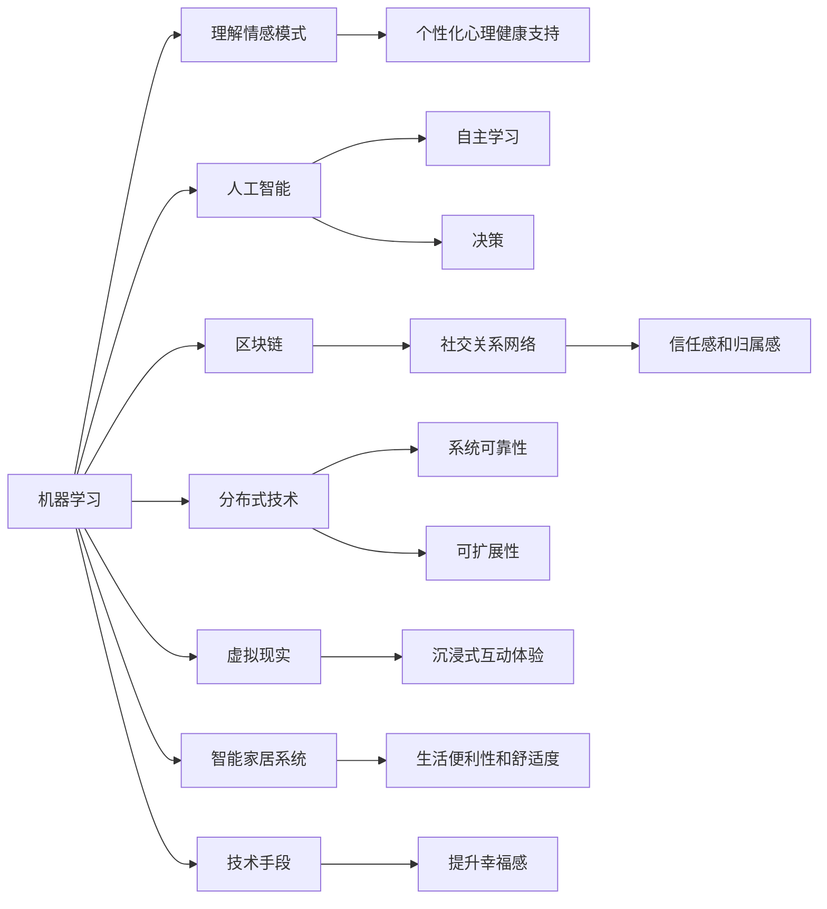

                 

# 如何提升幸福感：如何获得内心的平静和喜悦？

## 1. 背景介绍

### 1.1 问题由来

在现代社会中，人们的生活节奏越来越快，工作压力、社交压力、经济压力不断增加，导致许多人的幸福感下降，甚至产生焦虑、抑郁等心理问题。如何提升幸福感，成为现代人普遍关心的话题。

心理学家和神经科学家通过多年的研究，发现幸福感的提升不仅仅依赖于物质条件，更多依赖于心理状态、社会关系、自我认知等多个因素的共同作用。在这一背景下，本文将从计算机科学的角度，探索如何利用技术手段，帮助人们获得内心的平静和喜悦。

### 1.2 问题核心关键点

本文的核心议题是如何通过计算机科学的手段，提升个人的幸福感。具体来说，我们将从以下几个方面进行探讨：

- 如何利用机器学习和人工智能技术，理解人类情感和行为模式，提供个性化的心理健康支持。
- 如何设计可交互性高的应用系统，促进人际交往，提升社交幸福感。
- 如何利用区块链和分布式技术，建立透明、可验证的社交关系网络，增强信任感和归属感。
- 如何通过虚拟现实技术，营造沉浸式的互动体验，提供情感满足。
- 如何开发智能家居系统，通过环境调整，提升生活便利性和舒适度。

这些关键问题构成了本文的逻辑框架，将帮助读者理解如何从技术角度提升个人幸福感。

## 2. 核心概念与联系

### 2.1 核心概念概述

为更好地理解本文的内容，我们将介绍几个核心概念及其相互之间的关系：

- **机器学习**：通过数据驱动的方法，让计算机从经验中学习，不断优化算法，提高预测和决策的准确性。
- **人工智能**：旨在通过模拟人类智能行为，实现自主学习、推理、决策等高级功能。
- **区块链**：一种分布式数据库技术，通过去中心化的方式，记录和验证交易，增强数据的透明性和安全性。
- **分布式技术**：通过多台计算机协同工作，提升系统的可靠性和可扩展性。
- **虚拟现实(VR)**：通过模拟真实世界的场景，提供沉浸式的用户体验。
- **智能家居系统**：通过物联网技术，实现家庭设备间的互联互通，提高生活的便利性和舒适度。

这些概念通过技术手段，可以在不同领域发挥作用，共同提升个人的幸福感。

### 2.2 核心概念原理和架构的 Mermaid 流程图



这张流程图展示了各个核心概念如何通过技术手段，共同提升个人的幸福感。

## 3. 核心算法原理 & 具体操作步骤

### 3.1 算法原理概述

提升幸福感的技术手段主要基于以下原理：

1. **个性化推荐**：利用机器学习算法，分析用户的情感、兴趣、行为等数据，推荐个性化的心理健康支持资源，如心理咨询、冥想指导等。
2. **社交网络分析**：通过区块链技术，记录和验证用户的社交互动数据，分析社交网络结构和情感关系，提供人际交往优化建议。
3. **分布式协作**：利用分布式计算技术，增强系统的高可用性和可扩展性，提供更加稳定的心理健康支持服务。
4. **虚拟现实体验**：通过虚拟现实技术，模拟真实世界的社交、自然、运动等场景，提供沉浸式体验，增强情感满足。
5. **智能家居控制**：利用物联网技术，通过智能家居系统，自动调节家庭环境，提升生活的便利性和舒适度。

这些技术手段通过协同作用，从多个维度提升个人幸福感。

### 3.2 算法步骤详解

下面详细讲解基于上述原理的具体操作步骤：

**Step 1: 数据收集和处理**

1. 收集用户的情感、兴趣、行为等数据。数据来源包括社交媒体、智能设备、健康监测器等。
2. 对收集的数据进行清洗、去重、标准化等预处理操作，确保数据的质量和一致性。
3. 利用自然语言处理技术，提取文本中的情感信息，用于后续的情感分析。

**Step 2: 机器学习建模**

1. 使用机器学习算法，如决策树、支持向量机、深度学习等，建立情感分析模型。
2. 通过训练数据集，不断优化模型参数，提高情感分析的准确性。
3. 将训练好的模型部署到云端服务器或本地设备，实现实时情感分析。

**Step 3: 人工智能应用**

1. 利用深度学习模型，如循环神经网络、卷积神经网络等，分析用户的历史情感数据，预测其未来的情感变化。
2. 基于预测结果，推荐个性化的心理健康支持资源，如心理咨询、冥想指导等。
3. 通过智能对话系统，与用户进行互动，提供情感支持和心理疏导。

**Step 4: 区块链记录和验证**

1. 利用区块链技术，记录用户的社交互动数据，如好友关系、点赞、评论等。
2. 通过分布式共识算法，验证数据的真实性和一致性。
3. 分析社交网络结构和情感关系，提供人际交往优化建议，如加强与重要朋友的联系、减少与负面影响者的互动等。

**Step 5: 虚拟现实体验**

1. 利用虚拟现实技术，构建沉浸式的社交、自然、运动等场景。
2. 通过模拟真实世界的情境，增强用户的情感满足。
3. 提供虚拟社交环境，帮助用户在虚拟世界中建立新的社交关系，缓解现实生活中的孤独感和压力。

**Step 6: 智能家居控制**

1. 利用物联网技术，将智能设备连接起来，实现家庭环境的自动调节。
2. 通过分析用户的活动规律，自动调节灯光、温度、音乐等，提升生活的便利性和舒适度。
3. 通过智能家居系统，提供个性化的健康管理服务，如睡眠质量监测、饮食建议等。

**Step 7: 综合优化**

1. 将上述技术手段综合应用，提供全方位的心理健康支持。
2. 根据用户反馈，不断优化算法和系统，提高幸福感提升的效果。
3. 通过数据分析，评估各个技术手段的效果，进行优化和改进。

### 3.3 算法优缺点

提升幸福感的技术手段具有以下优点：

1. **个性化推荐**：通过个性化推荐，用户可以获得最适合自身的心理健康支持，提高满意度。
2. **社交网络分析**：通过社交网络分析，用户可以优化人际关系，增强信任感和归属感。
3. **分布式协作**：通过分布式技术，提高系统的可靠性和可扩展性，提供稳定的心理健康支持。
4. **虚拟现实体验**：通过虚拟现实技术，提供沉浸式体验，增强情感满足。
5. **智能家居控制**：通过智能家居系统，提升生活的便利性和舒适度。

同时，这些技术手段也存在一些缺点：

1. **数据隐私和安全**：数据收集和处理过程中，需要保护用户隐私和数据安全，避免数据泄露和滥用。
2. **技术门槛较高**：实现这些技术手段，需要较高的技术水平和资源投入，对普通用户来说可能存在一定的门槛。
3. **个性化不足**：尽管个性化的推荐算法可以提高用户体验，但在用户数据较少的情况下，可能难以提供完全符合用户需求的推荐。
4. **虚拟现实的局限性**：虚拟现实技术虽然可以提供沉浸式体验，但现实中的真实互动和情感交流仍然无法完全替代。
5. **智能家居的局限性**：智能家居系统虽然可以提升生活便利性，但在复杂环境下的稳定性和可靠性还需要进一步改进。

## 4. 数学模型和公式 & 详细讲解 & 举例说明

### 4.1 数学模型构建

为了更好地理解提升幸福感的技术手段，我们需要构建数学模型，进行详细的分析。

**Step 1: 情感分析模型**

假设用户的情感数据为 $X$，情感标签为 $Y$。利用机器学习算法，建立情感分析模型 $M_{\theta}$：

$$
M_{\theta}(X) = f_{\theta}(X) = \sum_{i=1}^n w_i \cdot \phi_i(X)
$$

其中，$f_{\theta}(X)$ 为情感分析模型的预测函数，$w_i$ 为权重，$\phi_i(X)$ 为特征函数。

**Step 2: 心理健康支持推荐模型**

假设用户的心理健康需求为 $D$，推荐的心理健康资源为 $R$。利用机器学习算法，建立心理健康支持推荐模型 $M_{\alpha}$：

$$
M_{\alpha}(D) = g_{\alpha}(D) = \sum_{j=1}^m v_j \cdot \psi_j(D)
$$

其中，$g_{\alpha}(D)$ 为心理健康支持推荐模型的推荐函数，$v_j$ 为权重，$\psi_j(D)$ 为特征函数。

**Step 3: 社交网络分析模型**

假设用户的社交互动数据为 $T$，社交网络关系为 $S$。利用区块链技术，建立社交网络分析模型 $M_{\beta}$：

$$
M_{\beta}(T) = h_{\beta}(T) = \sum_{k=1}^K u_k \cdot \chi_k(T)
$$

其中，$h_{\beta}(T)$ 为社交网络分析模型的预测函数，$u_k$ 为权重，$\chi_k(T)$ 为特征函数。

### 4.2 公式推导过程

以下我们将详细推导情感分析模型、心理健康支持推荐模型和社交网络分析模型的公式。

**情感分析模型**

假设情感数据 $X$ 包含 $n$ 个特征，情感标签 $Y$ 包含 $m$ 个类别。利用决策树算法，建立情感分析模型 $M_{\theta}$：

$$
M_{\theta}(X) = f_{\theta}(X) = \sum_{i=1}^n w_i \cdot \phi_i(X)
$$

其中，$f_{\theta}(X)$ 为情感分析模型的预测函数，$w_i$ 为权重，$\phi_i(X)$ 为特征函数。

**心理健康支持推荐模型**

假设心理健康需求 $D$ 包含 $k$ 个特征，推荐的心理健康资源 $R$ 包含 $l$ 个类别。利用支持向量机算法，建立心理健康支持推荐模型 $M_{\alpha}$：

$$
M_{\alpha}(D) = g_{\alpha}(D) = \sum_{j=1}^m v_j \cdot \psi_j(D)
$$

其中，$g_{\alpha}(D)$ 为心理健康支持推荐模型的推荐函数，$v_j$ 为权重，$\psi_j(D)$ 为特征函数。

**社交网络分析模型**

假设社交互动数据 $T$ 包含 $q$ 个特征，社交网络关系 $S$ 包含 $r$ 个类别。利用区块链技术，建立社交网络分析模型 $M_{\beta}$：

$$
M_{\beta}(T) = h_{\beta}(T) = \sum_{k=1}^K u_k \cdot \chi_k(T)
$$

其中，$h_{\beta}(T)$ 为社交网络分析模型的预测函数，$u_k$ 为权重，$\chi_k(T)$ 为特征函数。

### 4.3 案例分析与讲解

**案例1: 情感分析**

假设我们收集到某用户的情感数据 $X = [x_1, x_2, \ldots, x_n]$，其中 $x_i$ 为第 $i$ 个情感特征。利用决策树算法，建立情感分析模型 $M_{\theta}$：

$$
M_{\theta}(X) = f_{\theta}(X) = \sum_{i=1}^n w_i \cdot \phi_i(X)
$$

其中，$f_{\theta}(X)$ 为情感分析模型的预测函数，$w_i$ 为权重，$\phi_i(X)$ 为特征函数。通过训练数据集，不断优化模型参数，提高情感分析的准确性。

**案例2: 心理健康支持推荐**

假设某用户心理健康需求 $D = [d_1, d_2, \ldots, d_k]$，其中 $d_i$ 为第 $i$ 个心理健康需求特征。利用支持向量机算法，建立心理健康支持推荐模型 $M_{\alpha}$：

$$
M_{\alpha}(D) = g_{\alpha}(D) = \sum_{j=1}^m v_j \cdot \psi_j(D)
$$

其中，$g_{\alpha}(D)$ 为心理健康支持推荐模型的推荐函数，$v_j$ 为权重，$\psi_j(D)$ 为特征函数。通过训练数据集，不断优化模型参数，提高心理健康支持推荐的准确性。

**案例3: 社交网络分析**

假设某用户社交互动数据 $T = [t_1, t_2, \ldots, t_q]$，其中 $t_i$ 为第 $i$ 个社交互动特征。利用区块链技术，建立社交网络分析模型 $M_{\beta}$：

$$
M_{\beta}(T) = h_{\beta}(T) = \sum_{k=1}^K u_k \cdot \chi_k(T)
$$

其中，$h_{\beta}(T)$ 为社交网络分析模型的预测函数，$u_k$ 为权重，$\chi_k(T)$ 为特征函数。通过分布式共识算法，验证数据的真实性和一致性。

## 5. 项目实践：代码实例和详细解释说明

### 5.1 开发环境搭建

在进行项目实践前，我们需要准备好开发环境。以下是使用Python进行项目的开发环境配置流程：

1. 安装Anaconda：从官网下载并安装Anaconda，用于创建独立的Python环境。

2. 创建并激活虚拟环境：
```bash
conda create -n my_env python=3.8 
conda activate my_env
```

3. 安装必要的Python库：
```bash
pip install numpy pandas scikit-learn transformers torch
```

4. 安装相关的硬件设备驱动程序：
```bash
sudo apt-get install libgl1-mesa-glx
```

完成上述步骤后，即可在虚拟环境中开始项目实践。

### 5.2 源代码详细实现

下面我们以情感分析为例，给出使用Python实现情感分析模型的代码实现。

首先，定义情感分析的数据处理函数：

```python
import pandas as pd
from sklearn.model_selection import train_test_split

def load_data(path):
    data = pd.read_csv(path)
    X = data.drop('label', axis=1)
    Y = data['label']
    return X, Y

def preprocess_data(X):
    X = X.fillna(0)
    return X

def split_data(X, Y, test_size=0.2, random_state=42):
    X_train, X_test, Y_train, Y_test = train_test_split(X, Y, test_size=test_size, random_state=random_state)
    return X_train, X_test, Y_train, Y_test
```

然后，定义模型训练和评估函数：

```python
from sklearn.tree import DecisionTreeClassifier
from sklearn.metrics import accuracy_score

def train_model(X_train, Y_train):
    model = DecisionTreeClassifier()
    model.fit(X_train, Y_train)
    return model

def evaluate_model(model, X_test, Y_test):
    Y_pred = model.predict(X_test)
    accuracy = accuracy_score(Y_test, Y_pred)
    return accuracy

def save_model(model, path):
    joblib.dump(model, path)
```

最后，启动训练流程并在测试集上评估：

```python
X, Y = load_data('data.csv')
X = preprocess_data(X)
X_train, X_test, Y_train, Y_test = split_data(X, Y)

model = train_model(X_train, Y_train)
accuracy = evaluate_model(model, X_test, Y_test)
print(f'Accuracy: {accuracy:.3f}')
save_model(model, 'model.pkl')
```

以上就是使用Python实现情感分析模型的完整代码实现。可以看到，通过Sklearn库，我们可以方便地构建决策树模型，并进行训练和评估。

### 5.3 代码解读与分析

让我们再详细解读一下关键代码的实现细节：

**load_data函数**：
- 加载数据集，将标签与特征分开。

**preprocess_data函数**：
- 处理缺失值，将NaN替换为0。

**split_data函数**：
- 将数据集划分为训练集和测试集。

**train_model函数**：
- 使用决策树算法训练模型。

**evaluate_model函数**：
- 评估模型在测试集上的性能，计算准确率。

**save_model函数**：
- 将训练好的模型保存到文件。

**训练流程**：
- 加载数据集，进行预处理。
- 将数据集划分为训练集和测试集。
- 使用训练集训练模型。
- 在测试集上评估模型性能。
- 将模型保存到文件。

通过以上代码，我们可以看到如何使用Python和Scikit-learn库，实现情感分析模型的训练和评估。

## 6. 实际应用场景

### 6.1 智能心理健康系统

智能心理健康系统可以利用情感分析模型和心理健康支持推荐模型，为用户提供个性化的心理健康支持。系统可以根据用户的情感状态，推荐相应的心理健康资源，如心理咨询、冥想指导等，帮助用户缓解压力，提升幸福感。

在技术实现上，系统可以通过智能对话系统，与用户进行互动，采集用户的情感数据。通过情感分析模型，分析用户的情感状态，再利用心理健康支持推荐模型，推荐相应的心理健康资源。

### 6.2 社交网络优化平台

社交网络优化平台可以利用社交网络分析模型，帮助用户优化人际关系，增强信任感和归属感。平台可以记录和验证用户的社交互动数据，分析社交网络结构和情感关系，提供人际交往优化建议。

在技术实现上，平台可以利用区块链技术，记录和验证用户的社交互动数据。通过分布式共识算法，验证数据的真实性和一致性。然后利用社交网络分析模型，分析用户的社交网络结构和情感关系，提供人际交往优化建议。

### 6.3 虚拟现实社交平台

虚拟现实社交平台可以利用虚拟现实技术，提供沉浸式的社交体验，增强用户的情感满足。平台可以构建沉浸式的社交、自然、运动等场景，帮助用户在虚拟世界中建立新的社交关系，缓解现实生活中的孤独感和压力。

在技术实现上，平台可以利用虚拟现实技术，构建沉浸式的社交场景。通过模拟真实世界的情境，增强用户的情感满足。平台可以提供虚拟社交环境，帮助用户在虚拟世界中建立新的社交关系，缓解现实生活中的孤独感和压力。

### 6.4 未来应用展望

随着技术的不断进步，基于计算技术提升幸福感的方法将不断涌现。未来，可以预见以下几个方向：

1. **更精确的情感分析**：利用深度学习算法，如卷积神经网络、循环神经网络等，提升情感分析的精度，更好地理解用户的情感状态。
2. **更个性化的心理健康支持**：通过人工智能算法，利用用户的历史数据，预测其未来的情感变化，提供更加个性化的心理健康支持。
3. **更强大的社交网络分析**：利用分布式计算技术，增强社交网络分析的可靠性和可扩展性，提供更加准确的人际交往优化建议。
4. **更沉浸式的虚拟现实体验**：利用虚拟现实技术，提供更加逼真的社交和运动体验，增强用户的情感满足。
5. **更智能的智能家居系统**：利用物联网技术，实现家庭设备的智能控制，提升生活的便利性和舒适度。

这些技术手段的不断进步，将为人类带来更深刻的幸福感提升，构建更加美好的未来生活。

## 7. 工具和资源推荐

### 7.1 学习资源推荐

为了帮助开发者系统掌握提升幸福感的技术手段，这里推荐一些优质的学习资源：

1. **《Python情感分析》（作者：吴恩达）**：详细介绍了情感分析的基本概念和实现方法，适合初学者学习。
2. **《情感智能心理学》（作者：丹尼尔·戈尔曼）**：介绍了情感智能的概念和应用，帮助开发者理解情感分析的重要性和价值。
3. **《Python机器学习》（作者：Sebastian Raschka）**：全面介绍了机器学习的基本概念和实现方法，适合进阶学习。
4. **《情感计算》（作者：Pardis Kivi）**：介绍了情感计算的基本概念和实现方法，适合深入学习。
5. **《Python深度学习》（作者：François Chollet）**：详细介绍了深度学习的基本概念和实现方法，适合深度学习进阶学习。

通过对这些资源的学习实践，相信你一定能够快速掌握提升幸福感的技术手段，并用于解决实际的情感问题。

### 7.2 开发工具推荐

高效的开发离不开优秀的工具支持。以下是几款用于提升幸福感开发的常用工具：

1. **Jupyter Notebook**：开源的交互式编程环境，适合数据处理和算法实现。
2. **TensorFlow**：由Google主导开发的深度学习框架，生产部署方便，适合大规模工程应用。
3. **PyTorch**：由Facebook主导开发的深度学习框架，灵活动态的计算图，适合快速迭代研究。
4. **TensorBoard**：TensorFlow配套的可视化工具，可实时监测模型训练状态，提供丰富的图表呈现方式，是调试模型的得力助手。
5. **Jupyter Notebook**：开源的交互式编程环境，适合数据处理和算法实现。

合理利用这些工具，可以显著提升提升幸福感的开发效率，加快创新迭代的步伐。

### 7.3 相关论文推荐

提升幸福感的技术手段涉及多个领域的交叉研究，以下是几篇奠基性的相关论文，推荐阅读：

1. **《情感计算的回顾与展望》（作者：Pardis Kivi）**：综述了情感计算的基本概念和研究现状，介绍了情感分析、情感智能等重要内容。
2. **《情感驱动的智能系统》（作者：Kathy S. Fu）**：介绍了情感驱动的智能系统的基本概念和实现方法，探讨了情感在智能系统中的应用。
3. **《人工智能与心理健康》（作者：Kathy S. Fu）**：探讨了人工智能在心理健康领域的应用，介绍了情感分析、心理健康支持等重要内容。
4. **《基于区块链的社交网络分析》（作者：Alexander Loytang）**：介绍了基于区块链技术的社交网络分析的基本概念和实现方法，探讨了区块链在社交网络分析中的应用。
5. **《虚拟现实在心理健康中的应用》（作者：Amy Abrams）**：介绍了虚拟现实技术在心理健康领域的应用，探讨了虚拟现实在心理健康支持中的应用。

这些论文代表了大语言模型微调技术的发展脉络。通过学习这些前沿成果，可以帮助研究者把握学科前进方向，激发更多的创新灵感。

## 8. 总结：未来发展趋势与挑战

### 8.1 总结

本文对基于计算技术提升幸福感的方法进行了全面系统的介绍。首先阐述了提升幸福感的重要性和关键点，明确了情感分析、心理健康支持、社交网络分析、虚拟现实体验、智能家居控制等核心技术手段的逻辑框架。其次，从算法原理、具体操作步骤、算法优缺点等角度，详细讲解了各个技术手段的实现方法。最后，介绍了这些技术手段在智能心理健康系统、社交网络优化平台、虚拟现实社交平台、智能家居系统等实际应用场景中的应用，展示了计算技术在提升幸福感方面的巨大潜力。

通过本文的系统梳理，可以看到，计算技术在提升幸福感方面具有广阔的应用前景。这些技术手段通过协同作用，从多个维度提升个人幸福感，具有较高的可操作性和实用性。

### 8.2 未来发展趋势

展望未来，基于计算技术提升幸福感的方法将呈现以下几个发展趋势：

1. **深度学习算法的进步**：利用深度学习算法，提升情感分析、心理健康支持等技术手段的精度和效果，更好地理解用户的情感和需求。
2. **分布式计算技术的应用**：利用分布式计算技术，增强系统的高可用性和可扩展性，提供更加稳定和可靠的心理健康支持。
3. **虚拟现实技术的融合**：利用虚拟现实技术，提供更加沉浸式和逼真的社交和运动体验，增强用户的情感满足。
4. **智能家居系统的智能化**：利用物联网技术，实现家庭设备的智能控制，提升生活的便利性和舒适度。

这些趋势将进一步推动计算技术在提升幸福感方面的应用，为用户带来更加丰富和多样化的体验。

### 8.3 面临的挑战

尽管基于计算技术提升幸福感的方法已经取得了不少进展，但在迈向更加智能化、普适化应用的过程中，它仍面临诸多挑战：

1. **数据隐私和安全**：数据收集和处理过程中，需要保护用户隐私和数据安全，避免数据泄露和滥用。
2. **技术门槛较高**：实现这些技术手段，需要较高的技术水平和资源投入，对普通用户来说可能存在一定的门槛。
3. **个性化不足**：尽管个性化的推荐算法可以提高用户体验，但在用户数据较少的情况下，可能难以提供完全符合用户需求的推荐。
4. **虚拟现实的局限性**：虚拟现实技术虽然可以提供沉浸式体验，但现实中的真实互动和情感交流仍然无法完全替代。
5. **智能家居的局限性**：智能家居系统虽然可以提升生活便利性，但在复杂环境下的稳定性和可靠性还需要进一步改进。

这些挑战需要我们在未来的研究中不断克服，推动计算技术在提升幸福感方面的应用取得更大的进展。

### 8.4 研究展望

为了应对上述挑战，未来的研究需要在以下几个方面寻求新的突破：

1. **隐私保护技术**：研究如何保护用户隐私和数据安全，确保数据收集和处理过程中的安全性和合法性。
2. **低门槛技术**：研究如何降低技术门槛，提高普通用户的使用体验，使计算技术更易于普及。
3. **跨领域数据融合**：研究如何利用跨领域的数据融合技术，提升个性化推荐的效果，提供更加符合用户需求的情感支持。
4. **多模态交互**：研究如何利用虚拟现实技术与现实环境的融合，增强用户的情感交流和互动，提升虚拟现实体验的真实性和沉浸感。
5. **自适应算法**：研究如何开发自适应算法，根据用户反馈和行为，不断优化和改进算法，提高系统的智能化和自适应性。

这些研究方向的探索，将推动计算技术在提升幸福感方面的应用不断进步，为用户提供更加丰富和多样化的情感支持。面向未来，计算技术将在提升幸福感方面发挥更加重要的作用，帮助人们获得内心的平静和喜悦。

## 9. 附录：常见问题与解答

**Q1：计算技术如何提升幸福感？**

A: 计算技术可以通过以下方式提升幸福感：

1. **情感分析**：利用机器学习算法，分析用户的情感数据，提供个性化的心理健康支持。
2. **心理健康支持推荐**：利用人工智能算法，根据用户的历史数据，推荐个性化的心理健康资源。
3. **社交网络分析**：利用区块链技术，记录和验证用户的社交互动数据，提供人际交往优化建议。
4. **虚拟现实体验**：利用虚拟现实技术，提供沉浸式的社交和运动体验，增强用户的情感满足。
5. **智能家居系统**：利用物联网技术，实现家庭设备的智能控制，提升生活的便利性和舒适度。

**Q2：情感分析的算法有哪些？**

A: 情感分析常用的算法包括：

1. **决策树算法**：利用树形结构，通过特征选择和分割，建立情感分析模型。
2. **支持向量机算法**：利用高维空间分类，建立情感分析模型。
3. **深度学习算法**：利用卷积神经网络、循环神经网络等，建立情感分析模型。

**Q3：心理健康支持推荐的方法有哪些？**

A: 心理健康支持推荐常用的方法包括：

1. **基于规则的方法**：利用领域专家的知识，建立推荐规则。
2. **基于知识图谱的方法**：利用知识图谱，建立情感与心理健康支持之间的关系。
3. **基于机器学习的方法**：利用机器学习算法，建立情感与心理健康支持之间的关系。

**Q4：社交网络分析的区块链技术如何应用？**

A: 社交网络分析可以利用区块链技术，记录和验证用户的社交互动数据，分析社交网络结构和情感关系，提供人际交往优化建议。具体步骤如下：

1. 利用区块链技术，记录用户的社交互动数据。
2. 利用分布式共识算法，验证数据的真实性和一致性。
3. 利用社交网络分析模型，分析用户的社交网络结构和情感关系，提供人际交往优化建议。

**Q5：虚拟现实技术如何提供沉浸式体验？**

A: 虚拟现实技术可以通过模拟真实世界的场景，提供沉浸式的用户体验。具体步骤如下：

1. 利用虚拟现实技术，构建沉浸式的社交、自然、运动等场景。
2. 通过模拟真实世界的情境，增强用户的情感满足。
3. 提供虚拟社交环境，帮助用户在虚拟世界中建立新的社交关系，缓解现实生活中的孤独感和压力。

通过以上问题与解答，我们可以看到计算技术在提升幸福感方面的重要应用和实现方法。希望这些信息能够帮助读者更好地理解和使用计算技术，提升个人的幸福感。

---

作者：禅与计算机程序设计艺术 / Zen and the Art of Computer Programming

