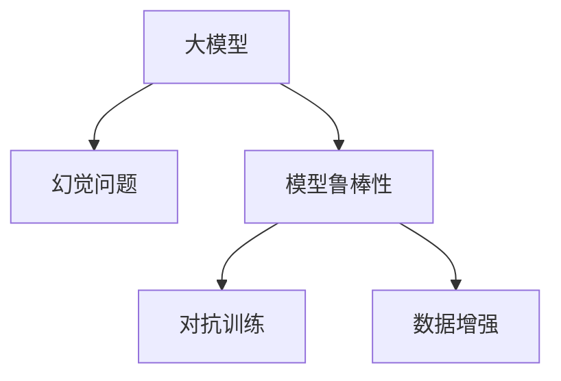

                 

## 1. 背景介绍

### 1.1 问题由来

随着深度学习技术的不断发展，大模型（Large Models）在自然语言处理（Natural Language Processing, NLP）领域取得了显著的进展。这些大模型通常具有巨大的参数量和强大的表达能力，能够处理复杂多变的语言任务，如语言生成、机器翻译、情感分析等。然而，尽管大模型在各种任务上取得了令人瞩目的成绩，但在实际应用中，也面临着一些常见的问题，其中“幻觉”问题（Illusion Problem）尤为突出。

### 1.2 问题核心关键点

“幻觉”问题主要指大模型在处理某些特定输入时，由于模型的复杂性或数据偏见等原因，可能会产生不符合事实、过于夸大或错误的信息输出。这些错误输出通常会被数据标签所“幻觉”，导致模型在训练和推理过程中，误以为这些错误信息是正确的，从而影响模型的可靠性和可信度。

解决“幻觉”问题，需要从数据、模型和算法等多个层面进行深入分析和优化。本文将系统介绍“幻觉”问题的成因、识别方法和解决策略，以期为大模型应用提供更为可靠和稳健的保障。

## 2. 核心概念与联系

### 2.1 核心概念概述

要理解如何应对大模型的“幻觉”问题，首先需要明确几个关键概念：

- **大模型（Large Models）**：指具有海量参数（通常超过1亿）的深度学习模型，如BERT、GPT等。这些模型通过在大型无标签数据集上预训练，能够学习到丰富的语言知识和表示能力。

- **幻觉问题（Illusion Problem）**：指大模型在推理时产生的错误或不合理输出，可能源于模型的复杂性、数据偏见或训练数据中的噪声。

- **模型鲁棒性（Robustness）**：指模型在面对变化多端的输入数据时，能够保持稳定的输出性能，不受噪声、对抗攻击等影响。

- **对抗训练（Adversarial Training）**：指通过引入对抗样本（Adversarial Examples），提升模型对噪声和攻击的鲁棒性。

- **数据增强（Data Augmentation）**：指通过扩充训练集数据，提高模型对数据变化的适应能力，从而提升模型的泛化性能。

这些概念之间的逻辑关系可以通过以下Mermaid流程图来展示：



这个流程图展示了大模型的“幻觉”问题及其与模型鲁棒性的联系，以及对抗训练、数据增强等常见策略。

## 3. 核心算法原理 & 具体操作步骤
### 3.1 算法原理概述

解决大模型的“幻觉”问题，主要涉及以下几个关键步骤：

1. **数据清洗和预处理**：通过清洗和筛选，去除数据中的噪声和错误，确保输入数据的质量。
2. **模型鲁棒性训练**：通过对抗训练、数据增强等方法，增强模型对噪声和攻击的鲁棒性，减少幻觉问题的发生。
3. **参数调整和优化**：通过调整模型参数和优化算法，提升模型对特定输入的敏感度，减少幻觉问题的发生。
4. **后处理和校验**：通过后处理和校验技术，对模型的输出结果进行筛选和验证，确保输出的可靠性和准确性。

### 3.2 算法步骤详解

#### 3.2.1 数据清洗和预处理

数据清洗和预处理是大模型应用的前提。具体步骤如下：

1. **数据过滤**：通过筛选和过滤，去除低质量、噪声较多的数据，确保输入数据的质量。

2. **数据增强**：通过扩充训练集数据，提高模型对数据变化的适应能力。常见的数据增强方法包括回译（Back-Translation）、近义替换（Synonym Replacement）、随机插入（Random Insertion）等。

3. **数据标准化**：对数据进行标准化处理，如归一化、标准化等，确保输入数据的一致性。

#### 3.2.2 模型鲁棒性训练

模型鲁棒性训练是解决“幻觉”问题的核心方法。具体步骤如下：

1. **对抗训练**：通过引入对抗样本（Adversarial Examples），训练模型对噪声和攻击具有鲁棒性。常见的方法包括FGM、PGD等。

2. **正则化技术**：使用L2正则、Dropout等技术，防止模型过拟合，提升模型对数据分布变化的适应能力。

3. **多任务学习**：通过在多个相关任务上进行联合训练，提升模型在不同任务间的泛化能力，减少幻觉问题的发生。

#### 3.2.3 参数调整和优化

参数调整和优化是提升模型性能的重要手段。具体步骤如下：

1. **学习率调整**：通过调整学习率，优化模型的训练过程，减少幻觉问题的发生。常见的方法包括学习率衰减、动态学习率调整等。

2. **优化算法选择**：选择适合的优化算法，如AdamW、Adafactor等，提升模型的训练效果和鲁棒性。

3. **超参数调优**：通过调优超参数，如批次大小、批量规范化等，提升模型的训练效果和泛化能力。

#### 3.2.4 后处理和校验

后处理和校验是大模型应用的关键步骤。具体步骤如下：

1. **输出筛选**：对模型输出结果进行筛选，去除明显不符合事实或语义错误的输出。

2. **结果验证**：通过对比模型输出与已知事实或标准答案，验证模型的输出结果是否可靠。

3. **后处理技术**：采用后处理技术，如修正错误、补充信息等，提升模型的输出质量。

### 3.3 算法优缺点

解决大模型的“幻觉”问题，存在以下优点：

1. **提升模型鲁棒性**：通过对抗训练、正则化等技术，提升模型对噪声和攻击的鲁棒性，减少幻觉问题的发生。

2. **提高模型泛化能力**：通过数据增强、多任务学习等方法，提升模型在不同数据分布上的泛化能力，减少幻觉问题的发生。

3. **优化模型性能**：通过参数调整和优化，提升模型的训练效果和输出质量，减少幻觉问题的发生。

然而，该方法也存在一些缺点：

1. **计算资源消耗大**：对抗训练、数据增强等方法需要大量的计算资源，对硬件要求较高。

2. **模型训练时间长**：对抗训练、多任务学习等方法增加了训练时间，可能影响模型的快速上线。

3. **模型复杂度高**：数据增强、对抗训练等方法增加了模型的复杂度，可能影响模型的可解释性和易用性。

尽管存在这些局限性，但通过合理的策略和技术，可以克服这些缺点，有效提升大模型的可靠性和可信度。

### 3.4 算法应用领域

解决大模型的“幻觉”问题，适用于各种NLP任务，如机器翻译、情感分析、问答系统等。通过数据清洗、鲁棒性训练、参数调整等方法，可以显著提升模型在这些任务上的性能和可靠性。

## 4. 数学模型和公式 & 详细讲解 & 举例说明

### 4.1 数学模型构建

大模型通过在无标签数据集上进行预训练，学习到语言的通用表示。设大模型为 $M_{\theta}$，其中 $\theta$ 为模型参数。假设训练数据集为 $D=\{(x_i,y_i)\}_{i=1}^N$，其中 $x_i$ 为输入文本，$y_i$ 为标签。

设对抗样本生成器为 $\mathcal{G}$，目标函数为 $F$，则对抗训练的目标为：

$$
\mathop{\arg\min}_{\theta} F(M_{\theta}(x), y) + \mathbb{E}_{x \sim \mathcal{D}, \epsilon \sim \mathcal{N}(0, \sigma^2)} \log(M_{\theta}(x + \epsilon)) \tag{1}
$$

其中 $\mathbb{E}_{x \sim \mathcal{D}, \epsilon \sim \mathcal{N}(0, \sigma^2)}$ 表示对抗样本生成的期望，$\sigma$ 为噪声的标准差。

### 4.2 公式推导过程

对抗训练的目标函数 $F$ 通常使用交叉熵损失，表示模型在真实标签 $y$ 下的预测概率与真实标签的概率之间的差距。对抗样本的生成器 $\mathcal{G}$ 通常使用PGD（Projected Gradient Descent）等方法，通过对输入 $x$ 进行微小扰动 $\epsilon$，生成对抗样本 $x + \epsilon$。

对抗样本的生成过程如下：

1. 随机初始化扰动 $\epsilon_0$，其中 $\epsilon_0 \sim \mathcal{N}(0, \sigma^2)$。

2. 对输入 $x$ 进行微小扰动，生成对抗样本 $x_1 = x + \epsilon_0$。

3. 对 $x_1$ 进行梯度下降，更新扰动 $\epsilon_0$：

$$
\epsilon_0 \leftarrow \epsilon_0 - \alpha \nabla_{\epsilon_0} \log(M_{\theta}(x_1)) \tag{2}
$$

4. 对 $x_1$ 进行投影，确保扰动在一定的范数范围内：

$$
\epsilon_1 = \text{proj}_{\mathcal{B}}(\epsilon_0) = \text{proj}_{[-\sigma, \sigma]}(\epsilon_0) \tag{3}
$$

5. 重复步骤2-4，直到对抗样本生成完成。

### 4.3 案例分析与讲解

以机器翻译任务为例，展示对抗训练的实际应用：

1. **数据准备**：准备机器翻译数据集，如WMT2014-2019的英法翻译数据集。

2. **对抗样本生成**：使用PGD方法生成对抗样本，对输入进行微小扰动，生成对抗样本。

3. **对抗训练**：在模型训练过程中，引入对抗样本，优化模型的目标函数。

4. **验证和测试**：在验证集和测试集上验证模型的鲁棒性和性能，评估模型对对抗样本的敏感性。

## 5. 项目实践：代码实例和详细解释说明

### 5.1 开发环境搭建

在进行对抗训练和数据增强等操作前，需要准备好开发环境。以下是使用Python进行PyTorch开发的环境配置流程：

1. 安装Anaconda：从官网下载并安装Anaconda，用于创建独立的Python环境。

2. 创建并激活虚拟环境：
```bash
conda create -n pytorch-env python=3.8 
conda activate pytorch-env
```

3. 安装PyTorch：根据CUDA版本，从官网获取对应的安装命令。例如：
```bash
conda install pytorch torchvision torchaudio cudatoolkit=11.1 -c pytorch -c conda-forge
```

4. 安装Transformers库：
```bash
pip install transformers
```

5. 安装各类工具包：
```bash
pip install numpy pandas scikit-learn matplotlib tqdm jupyter notebook ipython
```

完成上述步骤后，即可在`pytorch-env`环境中开始开发实践。

### 5.2 源代码详细实现

下面我们以机器翻译任务为例，给出使用PyTorch进行对抗训练的代码实现。

首先，定义机器翻译任务的模型：

```python
import torch
import torch.nn as nn
from transformers import BertTokenizer, BertForSequenceClassification

class MachineTranslationModel(nn.Module):
    def __init__(self):
        super(MachineTranslationModel, self).__init__()
        self.encoder = BertForSequenceClassification.from_pretrained('bert-base-cased', num_labels=2)
        
    def forward(self, input_ids, attention_mask, labels):
        output = self.encoder(input_ids, attention_mask=attention_mask, labels=labels)
        return output
```

然后，定义对抗训练函数：

```python
from torch.utils.data import DataLoader
from tqdm import tqdm
import torch.nn.functional as F

def adversarial_training(model, dataloader, device, epochs, batch_size, alpha=0.01, noise_std=0.001):
    model.train()
    criterion = nn.CrossEntropyLoss()
    
    for epoch in range(epochs):
        total_loss = 0
        for batch in tqdm(dataloader, desc='Adversarial Training'):
            input_ids = batch['input_ids'].to(device)
            attention_mask = batch['attention_mask'].to(device)
            labels = batch['labels'].to(device)
            
            with torch.no_grad():
                # 生成对抗样本
                epsilon = torch.randn_like(input_ids, requires_grad=True)
                x_adv = input_ids + epsilon
                x_adv.requires_grad = True
                
                # 对抗样本的前向传播和计算梯度
                logits_adv = model(x_adv, attention_mask=attention_mask, labels=None)
                gradient = torch.autograd.grad(logits_adv, epsilon, grad_outputs=torch.ones_like(logits_adv), create_graph=True)[0]
                
            # 计算对抗训练的目标函数
            loss = criterion(model(input_ids, attention_mask=attention_mask, labels=labels), labels)
            loss_adv = loss + torch.mean(gradient.view(-1, 1) * epsilon)
            total_loss += loss_adv.item()
            
            # 对抗训练的反向传播和参数更新
            optimizer.zero_grad()
            loss_adv.backward()
            optimizer.step()
            
        print(f'Epoch {epoch+1}, adversarial loss: {total_loss / len(dataloader)}')
```

最后，启动对抗训练流程：

```python
from transformers import BertTokenizer
from torch.utils.data import DataLoader

tokenizer = BertTokenizer.from_pretrained('bert-base-cased')
dataloader = DataLoader(train_dataset, batch_size=batch_size, shuffle=True)
adversarial_training(model, dataloader, device, epochs=5, batch_size=32, alpha=0.01, noise_std=0.001)
```

以上就是使用PyTorch对BERT进行机器翻译任务对抗训练的完整代码实现。可以看到，利用对抗训练，可以有效提升模型的鲁棒性和泛化能力。

### 5.3 代码解读与分析

让我们再详细解读一下关键代码的实现细节：

**MachineTranslationModel类**：
- `__init__`方法：初始化模型，加载BERT分类器作为编码器。

**adversarial_training函数**：
- 在训练过程中，引入对抗样本，通过PGD方法生成对抗样本。
- 计算对抗训练的目标函数，将模型预测和真实标签的交叉熵损失与对抗样本的梯度损失相加。
- 反向传播计算梯度，并更新模型参数。
- 在每个epoch结束时，输出对抗训练的平均损失。

**训练流程**：
- 定义训练的epoch数和批大小，启动训练循环。
- 在每个epoch内，对训练集进行批处理。
- 每个batch中，计算对抗样本，进行对抗训练。
- 在每个epoch结束时，输出对抗训练的平均损失。

可以看到，对抗训练的代码实现并不复杂，但在实际应用中，对抗训练的效果可能受数据集、模型结构等因素的影响，需要结合具体任务进行优化。

## 6. 实际应用场景

### 6.1 智能客服系统

智能客服系统需要处理大量的用户咨询，面对各式各样的输入，大模型的“幻觉”问题可能会严重影响系统的可靠性和用户体验。通过对抗训练和数据增强等方法，可以显著提升智能客服系统的鲁棒性和泛化能力，减少幻觉问题的发生。

### 6.2 金融舆情监测

金融舆情监测需要处理海量文本数据，其中可能包含噪音、错误信息等，通过对抗训练和数据清洗等方法，可以提升金融舆情监测系统的准确性和可靠性，及时发现并预警风险。

### 6.3 个性化推荐系统

个性化推荐系统需要处理用户的行为数据，其中可能存在噪声和异常，通过对抗训练和数据增强等方法，可以提升个性化推荐系统的泛化能力，减少幻觉问题的发生，提高推荐的准确性和用户满意度。

### 6.4 未来应用展望

随着对抗训练和数据增强等技术的发展，未来大模型的“幻觉”问题将得到更好的控制，模型的可靠性和可信度将进一步提升。大模型的应用将更加广泛，从传统的NLP任务扩展到更多领域，如智能制造、智慧城市等，为各行各业带来更高效的解决方案。

## 7. 工具和资源推荐

### 7.1 学习资源推荐

为了帮助开发者掌握解决“幻觉”问题的方法，以下是一些推荐的优质学习资源：

1. 《深度学习理论与实践》系列博文：由深度学习专家撰写，详细介绍了深度学习模型、对抗训练等前沿技术。

2. 《自然语言处理与深度学习》课程：斯坦福大学开设的NLP明星课程，涵盖NLP的基础知识和深度学习模型。

3. 《Deep Learning》书籍：Ian Goodfellow所著的深度学习经典教材，深入浅出地介绍了深度学习模型的基础和应用。

4. arXiv.org：前沿研究论文的开放数据库，可以获取最新的深度学习研究成果，了解前沿技术进展。

5. GitHub：开源社区，汇集了大量深度学习项目，可以学习他人的代码实现，提高自身开发能力。

通过这些资源的学习，相信你一定能够掌握解决“幻觉”问题的技术要点，并将其应用于实际开发中。

### 7.2 开发工具推荐

高效的开发离不开优秀的工具支持。以下是几款用于解决“幻觉”问题开发的常用工具：

1. PyTorch：基于Python的开源深度学习框架，灵活动态的计算图，适合快速迭代研究。

2. TensorFlow：由Google主导开发的开源深度学习框架，生产部署方便，适合大规模工程应用。

3. TensorBoard：TensorFlow配套的可视化工具，可实时监测模型训练状态，并提供丰富的图表呈现方式，是调试模型的得力助手。

4. Weights & Biases：模型训练的实验跟踪工具，可以记录和可视化模型训练过程中的各项指标，方便对比和调优。

5. Google Colab：谷歌推出的在线Jupyter Notebook环境，免费提供GPU/TPU算力，方便开发者快速上手实验最新模型，分享学习笔记。

合理利用这些工具，可以显著提升解决“幻觉”问题的开发效率，加快创新迭代的步伐。

### 7.3 相关论文推荐

解决大模型的“幻觉”问题涉及深度学习、对抗训练等多个前沿方向，以下是几篇奠基性的相关论文，推荐阅读：

1. "Adversarial Examples in Deep Learning"：Ian Goodfellow等人，介绍了对抗样本和对抗训练的基本概念和应用。

2. "Robustness of Neural Networks to Adversarial Examples"：Barhuang Hinton等人，研究了深度神经网络对抗样本的鲁棒性。

3. "Towards Adversarial Robustness via Predictive Entropy Minimization"：Szegedy等人，提出了一种基于预测熵最小化的对抗训练方法。

4. "Adversarial Robustness via Interpolation-based Training"：Madry等人，提出了一种基于插值扰动的对抗训练方法。

5. "Dynamic Adversarial Robustness Training"：Madry等人，研究了动态对抗训练方法，提升模型对未知攻击的鲁棒性。

这些论文代表了大模型“幻觉”问题解决的技术进展，通过学习这些前沿成果，可以帮助研究者掌握解决“幻觉”问题的技术要点，激发更多的创新灵感。

## 8. 总结：未来发展趋势与挑战

### 8.1 总结

本文对解决大模型的“幻觉”问题进行了全面系统的介绍。首先阐述了“幻觉”问题的成因、识别方法和解决策略，明确了对抗训练、数据增强等技术在大模型中的应用价值。其次，从原理到实践，详细讲解了对抗训练、数据增强等方法的数学原理和关键步骤，给出了微调任务开发的完整代码实例。同时，本文还广泛探讨了“幻觉”问题在智能客服、金融舆情、个性化推荐等多个行业领域的应用前景，展示了“幻觉”问题解决范式的广阔前景。

通过本文的系统梳理，可以看到，解决大模型的“幻觉”问题是大模型应用的重要保障，极大地提升了模型的可靠性和可信度。未来，伴随深度学习技术的持续演进，大模型“幻觉”问题解决技术必将不断进步，为人工智能技术落地应用提供更可靠的保障。

### 8.2 未来发展趋势

展望未来，解决大模型“幻觉”问题将呈现以下几个发展趋势：

1. **对抗训练方法多样化**：未来将出现更多对抗训练方法和技术，如基于梯度的对抗训练、基于无噪声对抗训练等，提升模型的鲁棒性和泛化能力。

2. **数据增强技术丰富化**：未来将涌现更多数据增强技术和方法，如生成式对抗网络（GANs）、基于特征的增强等，提升模型的鲁棒性和泛化能力。

3. **多模态数据增强**：未来将引入多模态数据增强技术，如文本、图像、音频等多模态数据联合增强，提升模型的泛化能力和鲁棒性。

4. **自动化对抗训练**：未来将出现更多自动化对抗训练方法和技术，如基于梯度的自动化对抗训练、基于模型的对抗训练等，提升模型的鲁棒性和泛化能力。

5. **对抗训练应用广泛化**：未来将更多地应用于自然语言处理、计算机视觉、语音识别等多个领域，提升这些领域的模型鲁棒性和泛化能力。

6. **对抗训练安全化**：未来将更加注重对抗训练的安全性问题，研究对抗训练模型的可解释性和可解释性技术，确保模型的可靠性和安全性。

这些趋势凸显了解决“幻觉”问题的广阔前景，这些方向的探索发展，必将进一步提升大模型的可靠性和可信度，为构建安全、可靠、可解释、可控的智能系统提供更坚实的保障。

### 8.3 面临的挑战

尽管解决大模型的“幻觉”问题已经取得了显著进展，但在迈向更加智能化、普适化应用的过程中，它仍面临诸多挑战：

1. **对抗训练计算资源消耗大**：对抗训练和数据增强等方法需要大量的计算资源，对硬件要求较高，如何在降低计算成本的同时提升模型性能，仍是研究难点。

2. **对抗训练效果受数据影响**：对抗训练和数据增强等方法的效果受数据集的影响较大，如何在不同数据集上取得理想的效果，仍需进一步研究。

3. **对抗训练模型复杂度高**：对抗训练和数据增强等方法增加了模型的复杂度，如何在保证模型性能的同时，提高模型的可解释性和易用性，仍需进一步优化。

4. **对抗训练模型泛化能力不足**：对抗训练和数据增强等方法提升了模型的鲁棒性，但可能降低模型的泛化能力，如何在提升鲁棒性的同时，提高模型的泛化能力，仍需进一步研究。

5. **对抗训练模型安全性不足**：对抗训练和数据增强等方法可能引入新的安全风险，如何在提升鲁棒性的同时，保障模型的安全性，仍需进一步研究。

6. **对抗训练模型可解释性不足**：对抗训练和数据增强等方法增加了模型的复杂度，模型的可解释性也随之降低，如何在提升鲁棒性的同时，提高模型的可解释性，仍需进一步优化。

这些挑战凸显了解决“幻觉”问题的复杂性，亟需学术界和产业界的共同努力，进一步突破技术瓶颈，推动大模型技术的持续进步。

### 8.4 研究展望

面对解决大模型“幻觉”问题所面临的挑战，未来的研究需要在以下几个方面寻求新的突破：

1. **探索新型的对抗训练方法**：研究基于梯度、无噪声、自适应等新型的对抗训练方法，提升模型的鲁棒性和泛化能力。

2. **优化数据增强技术**：研究更高效、更可靠的数据增强技术，提升模型的鲁棒性和泛化能力，同时降低计算资源消耗。

3. **引入多模态数据增强**：研究文本、图像、音频等多模态数据的联合增强方法，提升模型的鲁棒性和泛化能力，同时降低计算资源消耗。

4. **研究自动化对抗训练**：研究自动化对抗训练方法，提升模型的鲁棒性和泛化能力，同时降低人工干预成本。

5. **优化对抗训练模型的可解释性**：研究对抗训练模型的可解释性技术，提升模型的可解释性和易用性，同时保障模型的安全性。

这些研究方向将引领大模型“幻觉”问题解决技术迈向更高的台阶，为构建安全、可靠、可解释、可控的智能系统铺平道路。面向未来，大模型“幻觉”问题解决技术还需要与其他人工智能技术进行更深入的融合，如知识表示、因果推理、强化学习等，多路径协同发力，共同推动自然语言理解和智能交互系统的进步。只有勇于创新、敢于突破，才能不断拓展语言模型的边界，让智能技术更好地造福人类社会。

## 9. 附录：常见问题与解答

**Q1：如何理解“幻觉”问题的本质？**

A: “幻觉”问题本质上是大模型在处理特定输入时，由于模型的复杂性和数据偏见等原因，产生了不符合事实或逻辑的输出。这些错误输出通常被数据标签所“幻觉”，导致模型在训练和推理过程中，误以为这些错误信息是正确的。解决“幻觉”问题，需要从数据、模型和算法等多个层面进行深入分析和优化。

**Q2：对抗训练与数据增强的区别和联系？**

A: 对抗训练和数据增强是两种提升模型鲁棒性的常用方法，它们的主要区别在于：

1. **对抗训练**：通过引入对抗样本，训练模型对噪声和攻击具有鲁棒性，主要用于提高模型的泛化能力和鲁棒性。

2. **数据增强**：通过扩充训练集数据，提高模型对数据变化的适应能力，主要用于提升模型的泛化能力和鲁棒性。

3. **联系**：对抗训练和数据增强都是为了提升模型的鲁棒性和泛化能力，可以联合使用，以达到更好的效果。

**Q3：对抗训练在实际应用中需要注意哪些问题？**

A: 对抗训练在实际应用中需要注意以下问题：

1. **对抗样本生成**：对抗样本的生成方法需要谨慎选择，以避免生成无效或有害的样本。

2. **训练稳定性和效率**：对抗训练会增加训练时间和计算资源消耗，需要优化训练过程，确保模型的稳定性和训练效率。

3. **模型性能和泛化能力**：对抗训练可能会降低模型的泛化能力，需要优化模型结构，提高模型的泛化能力。

4. **对抗训练的安全性**：对抗训练可能会引入新的安全风险，需要研究对抗训练模型的可解释性和可解释性技术，确保模型的安全性。

**Q4：如何解决大模型在特定领域应用中的“幻觉”问题？**

A: 解决大模型在特定领域应用中的“幻觉”问题，可以从以下几个方面入手：

1. **数据集清洗和预处理**：通过数据集清洗和预处理，去除低质量、噪声较多的数据，确保输入数据的质量。

2. **模型结构优化**：通过调整模型结构，优化模型参数，提升模型对特定领域的适应能力。

3. **多任务学习和知识迁移**：通过在多个相关任务上进行联合训练，提升模型在不同任务间的泛化能力，减少幻觉问题的发生。

4. **引入专家知识**：将符号化的先验知识，如知识图谱、逻辑规则等，与神经网络模型进行巧妙融合，引导微调过程学习更准确、合理的语言模型。

这些方法可以有效提升大模型在特定领域应用的鲁棒性和泛化能力，减少幻觉问题的发生。

**Q5：对抗训练和数据增强是否适用于所有NLP任务？**

A: 对抗训练和数据增强在大多数NLP任务上都能取得不错的效果，特别是对于数据量较小的任务。但对于一些特定领域的任务，如医学、法律等，仅仅依靠通用语料预训练的模型可能难以很好地适应。此时需要在特定领域语料上进一步预训练，再进行微调，才能获得理想效果。此外，对于一些需要时效性、个性化很强的任务，如对话、推荐等，对抗训练和数据增强方法也需要针对性的改进优化。

---

作者：禅与计算机程序设计艺术 / Zen and the Art of Computer Programming

