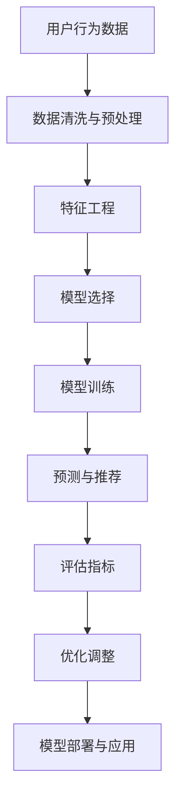

                 

# 如何进行有效的用户行为分析

> 关键词：用户行为分析, 数据处理, 机器学习, 预测模型, 特征工程, 模型选择, 评估指标

## 1. 背景介绍

在互联网时代，用户行为分析已成为企业竞争力的重要组成部分。无论是电商平台、社交网络、在线教育，还是新闻媒体，精准的用户行为分析都能带来显著的商业价值。通过分析用户行为，企业可以洞察用户需求、优化产品功能、提升用户体验，并制定更有效的营销策略。然而，用户行为数据往往规模庞大、结构复杂，如何从海量数据中提取有价值的洞察，是一个值得深入探讨的问题。

本文将围绕用户行为分析的理论与实践展开，重点介绍如何利用机器学习算法进行用户行为预测和个性化推荐。通过系统化的学习路径和详细的技术指导，希望为读者提供完整的解决方案，帮助企业解锁用户行为分析的奥秘。

## 2. 核心概念与联系

### 2.1 核心概念概述

在用户行为分析中，我们通常会接触到以下核心概念：

- **用户行为数据**：包括用户在网站、应用、广告等平台上的所有互动行为，如点击、浏览、购买、评价、分享等。
- **用户画像**：通过对用户行为数据的综合分析，构建出详细的用户画像，包括用户的兴趣、需求、偏好等信息。
- **用户行为模型**：利用机器学习模型，从用户行为数据中学习用户的行为模式和规律，实现用户行为预测和个性化推荐。
- **预测模型**：能够根据已知数据预测未知用户行为，包括购买、流失、流失等。
- **推荐算法**：通过用户画像和预测模型，为不同用户推荐个性化产品或服务。
- **特征工程**：提取、选择和构造输入特征，以提高模型的预测能力和泛化能力。
- **模型选择与调参**：选择合适的算法和模型，并通过交叉验证、网格搜索等方法进行参数优化。
- **评估指标**：用于衡量模型性能的指标，如准确率、召回率、F1分数、ROC曲线等。

这些核心概念之间紧密联系，共同构成了用户行为分析的技术框架。通过理解这些概念，我们可以更好地把握用户行为分析的流程和方法。

### 2.2 核心概念原理和架构的 Mermaid 流程图



上述流程图展示了用户行为分析的全流程。首先，通过收集和预处理用户行为数据，提取有意义的特征；然后，选择合适的机器学习模型，并对其进行训练和调参；最后，利用训练好的模型进行预测和推荐，并通过评估指标进行性能优化。

## 3. 核心算法原理 & 具体操作步骤

### 3.1 算法原理概述

用户行为分析的核心在于从用户行为数据中学习用户的行为模式，从而预测用户未来的行为或进行个性化推荐。通常，这一过程包括以下步骤：

1. **数据收集**：从多个渠道收集用户行为数据，如网站点击、应用使用、广告曝光等。
2. **数据清洗与预处理**：处理缺失值、异常值，进行归一化、去噪等操作。
3. **特征工程**：提取、选择和构造输入特征，以提高模型的预测能力和泛化能力。
4. **模型选择与调参**：选择合适的算法和模型，并通过交叉验证、网格搜索等方法进行参数优化。
5. **模型训练**：使用历史数据对模型进行训练。
6. **预测与推荐**：利用训练好的模型对新用户行为进行预测，并根据预测结果进行个性化推荐。
7. **评估与优化**：通过评估指标评估模型性能，根据评估结果进行模型优化。

### 3.2 算法步骤详解

#### 3.2.1 数据收集

用户行为数据的来源通常包括：

- 网站和应用日志：记录用户的访问路径、页面停留时间、点击操作等。
- 广告曝光记录：记录用户对广告的曝光、点击、转化等信息。
- 用户互动数据：记录用户在社交网络、论坛、评论区等平台上的互动行为。
- 交易记录：记录用户在电商平台的购买、退款、评价等信息。

#### 3.2.2 数据清洗与预处理

用户行为数据往往存在缺失值、异常值等问题。预处理阶段需要：

- **数据清洗**：处理缺失值、重复记录、异常值等。
- **数据归一化**：将不同量级的特征缩放到一个合理的范围内，便于模型训练。
- **数据去噪**：去除噪声和干扰因素，提高数据质量。

#### 3.2.3 特征工程

特征工程是用户行为分析中至关重要的一步，直接影响模型的预测能力。常见的特征工程方法包括：

- **时间特征**：包括时间戳、日、周、月、年等时间特征。
- **用户特征**：如用户ID、设备类型、地区、年龄、性别等。
- **行为特征**：如点击次数、停留时间、购买频率等。
- **事件特征**：如广告曝光、页面浏览、搜索等。

#### 3.2.4 模型选择与调参

选择合适的模型和算法是用户行为分析的关键。常用的模型包括：

- **决策树**：简单直观，适合处理离散型特征。
- **随机森林**：基于决策树的集成学习，泛化能力强。
- **线性回归**：适用于连续型数据的预测。
- **逻辑回归**：适用于二分类问题。
- **支持向量机**：适合处理高维数据和非线性关系。
- **深度学习模型**：如神经网络、卷积神经网络(CNN)、循环神经网络(RNN)等，适用于复杂特征的提取和处理。

模型选择后，需要进行参数调优。常用的调参方法包括：

- **网格搜索**：穷举所有可能的参数组合，选择最优的参数。
- **随机搜索**：随机选择一组参数进行试验，逐步优化参数。
- **贝叶斯优化**：基于贝叶斯理论，快速收敛到最优参数。

#### 3.2.5 模型训练

模型训练是用户行为分析的核心步骤。训练阶段需要：

- **划分数据集**：将数据集划分为训练集、验证集和测试集。
- **训练模型**：使用训练集数据训练模型，优化模型参数。
- **验证模型**：使用验证集数据评估模型性能，防止过拟合。
- **模型调优**：根据验证集结果，调整模型参数和超参数。

#### 3.2.6 预测与推荐

预测阶段需要：

- **特征提取**：从新数据中提取与训练时相同的特征。
- **模型预测**：使用训练好的模型对新数据进行预测。
- **推荐算法**：根据预测结果，生成个性化的推荐结果。

#### 3.2.7 评估与优化

评估阶段需要：

- **评估指标**：如准确率、召回率、F1分数、ROC曲线等。
- **模型优化**：根据评估结果，优化模型和特征工程。
- **模型部署**：将训练好的模型部署到生产环境，进行实时预测和推荐。

### 3.3 算法优缺点

#### 3.3.1 优点

1. **数据利用率高**：利用机器学习算法，可以从海量用户行为数据中提取有价值的洞察。
2. **预测能力强**：通过训练好的模型，可以对用户行为进行精准预测。
3. **个性化推荐**：根据用户画像和预测结果，进行个性化推荐，提高用户体验。
4. **可解释性强**：模型通过特征工程和训练过程，能够解释用户行为的根本原因。

#### 3.3.2 缺点

1. **数据依赖性高**：用户行为分析依赖于高质量的数据，数据偏差可能导致模型性能下降。
2. **模型复杂度高**：深度学习模型复杂度高，需要大量的计算资源和时间。
3. **特征工程挑战**：特征工程需要丰富的经验和专业知识，设计不当可能导致模型效果差。
4. **模型易受攻击**：用户行为数据可能包含敏感信息，模型易受到攻击和滥用。

### 3.4 算法应用领域

用户行为分析在多个领域有广泛的应用，包括：

- **电商领域**：通过分析用户购买行为，进行个性化推荐、库存管理、客户流失预测等。
- **社交网络**：通过分析用户互动行为，进行好友推荐、内容推荐、广告投放等。
- **在线教育**：通过分析用户学习行为，进行课程推荐、学习路径优化、学习效果评估等。
- **新闻媒体**：通过分析用户阅读行为，进行文章推荐、广告投放、内容优化等。
- **金融领域**：通过分析用户交易行为，进行风险评估、反欺诈、投资推荐等。

## 4. 数学模型和公式 & 详细讲解 & 举例说明

### 4.1 数学模型构建

用户行为分析的数学模型通常包括：

- **回归模型**：用于预测连续型数据的模型，如线性回归、多项式回归、决策树回归等。
- **分类模型**：用于预测离散型数据的模型，如逻辑回归、决策树分类、支持向量机等。
- **聚类模型**：用于用户分群，发现用户行为模式的模型，如K-means、层次聚类等。
- **关联规则模型**：用于发现用户行为之间的关联，如Apriori算法、FP-growth算法等。

### 4.2 公式推导过程

以线性回归模型为例，其公式推导如下：

$$
y = \beta_0 + \beta_1 x_1 + \beta_2 x_2 + \cdots + \beta_n x_n + \epsilon
$$

其中，$y$ 为预测值，$\beta_0$ 为截距，$\beta_1$、$\beta_2$ 等为回归系数，$x_1$、$x_2$ 等为自变量，$\epsilon$ 为误差项。

线性回归模型的训练过程如下：

1. **最小二乘法**：通过最小化误差项 $\epsilon$ 的平方和，求得最优的回归系数。
2. **梯度下降法**：通过计算梯度，逐步更新回归系数，最小化误差项。

### 4.3 案例分析与讲解

以电商领域的用户流失预测为例，其预测模型如下：

1. **特征工程**：提取用户行为特征，如购买次数、购买金额、退货次数、页面停留时间等。
2. **模型选择**：选择逻辑回归模型。
3. **模型训练**：使用历史用户数据，训练逻辑回归模型。
4. **模型评估**：使用测试集数据，评估模型性能。
5. **模型优化**：根据评估结果，调整模型参数和特征工程。
6. **预测与推荐**：根据新用户数据，进行流失预测和个性化推荐。

## 5. 项目实践：代码实例和详细解释说明

### 5.1 开发环境搭建

用户行为分析的项目实践需要以下开发环境：

1. **Python**：安装Python 3.x版本，建议使用Anaconda环境。
2. **Pandas**：用于数据处理和分析。
3. **NumPy**：用于数学计算和数组操作。
4. **Scikit-learn**：用于机器学习模型训练和评估。
5. **Matplotlib**：用于数据可视化。
6. **Jupyter Notebook**：用于交互式开发和实验。

### 5.2 源代码详细实现

以下是一个简单的电商用户流失预测的Python代码实现：

```python
import pandas as pd
from sklearn.linear_model import LogisticRegression
from sklearn.model_selection import train_test_split
from sklearn.metrics import roc_auc_score

# 读取数据
data = pd.read_csv('user_behavior.csv')

# 数据清洗与预处理
data.dropna(inplace=True)
data = data.drop_duplicates()

# 特征工程
X = data[['purchase_count', 'purchase_amount', 'return_count', 'pageStayTime']]
y = data['churn']

# 划分数据集
X_train, X_test, y_train, y_test = train_test_split(X, y, test_size=0.2, random_state=42)

# 模型训练
model = LogisticRegression()
model.fit(X_train, y_train)

# 模型评估
y_pred = model.predict_proba(X_test)[:, 1]
auc_score = roc_auc_score(y_test, y_pred)
print('AUC Score:', auc_score)

# 模型预测
new_data = pd.read_csv('new_user_behavior.csv')
y_pred = model.predict_proba(new_data)[:, 1]
print('Predictions:', y_pred)
```

### 5.3 代码解读与分析

上述代码实现了简单的电商用户流失预测过程。

1. **数据读取**：使用Pandas库读取用户行为数据。
2. **数据清洗**：使用dropna()和drop_duplicates()方法处理缺失值和重复记录。
3. **特征提取**：提取与用户流失相关的行为特征，如购买次数、购买金额、退货次数、页面停留时间等。
4. **数据划分**：将数据集划分为训练集和测试集。
5. **模型训练**：使用Logistic回归模型训练用户流失预测模型。
6. **模型评估**：使用ROC曲线下的面积(AUC Score)评估模型性能。
7. **模型预测**：对新用户行为进行预测，生成预测结果。

## 6. 实际应用场景

### 6.1 电商领域

在电商领域，用户行为分析的应用包括：

- **个性化推荐**：根据用户历史购买行为，推荐相关商品。
- **库存管理**：预测用户购买意愿，优化库存水平。
- **客户流失预测**：识别可能流失的用户，进行客户挽留。
- **用户分群**：根据用户行为特征，进行用户分群和精准营销。

### 6.2 社交网络

在社交网络领域，用户行为分析的应用包括：

- **好友推荐**：根据用户互动行为，推荐新好友。
- **内容推荐**：根据用户阅读和互动行为，推荐相关内容。
- **广告投放**：根据用户行为特征，进行精准广告投放。
- **用户分群**：发现兴趣相似的用户群体，进行个性化服务。

### 6.3 在线教育

在在线教育领域，用户行为分析的应用包括：

- **课程推荐**：根据用户学习行为，推荐相关课程。
- **学习路径优化**：根据用户学习进度和兴趣，优化学习路径。
- **学习效果评估**：分析用户学习行为，评估学习效果。
- **个性化学习**：根据用户学习行为，进行个性化学习计划设计。

## 7. 工具和资源推荐

### 7.1 学习资源推荐

为了帮助读者系统掌握用户行为分析的理论与实践，以下是几本推荐的书籍和资源：

1. **《Python数据分析实战》**：详细介绍Pandas库的使用，适合初学者。
2. **《机器学习实战》**：讲解常用的机器学习算法，适合进一步学习。
3. **《深度学习入门》**：讲解深度学习模型的构建和训练，适合有一定基础的读者。
4. **Kaggle**：提供大量的数据集和比赛，适合实践和竞赛。
5. **Coursera**：提供多门数据分析和机器学习的课程，适合在线学习。

### 7.2 开发工具推荐

常用的用户行为分析开发工具包括：

1. **Pandas**：用于数据处理和分析，功能强大且易于使用。
2. **Scikit-learn**：用于机器学习模型训练和评估，适合常见的数据集和模型。
3. **TensorFlow**：用于深度学习模型的构建和训练，适合大规模数据集和复杂模型。
4. **Keras**：基于TensorFlow的高层API，简化深度学习模型的开发。
5. **Jupyter Notebook**：用于交互式开发和实验，适合数据分析和模型训练。

### 7.3 相关论文推荐

用户行为分析的研究涉及多个领域，以下是几篇推荐的研究论文：

1. **《User Behavior Prediction with Deep Learning Models》**：介绍深度学习在用户行为预测中的应用。
2. **《A Survey of User Behavior Modeling for Recommendation Systems》**：综述用户行为建模在推荐系统中的应用。
3. **《Feature Engineering for User Behavior Prediction》**：讲解用户行为预测中的特征工程方法。
4. **《Personalized Recommendation Systems》**：介绍个性化推荐系统的构建方法。

## 8. 总结：未来发展趋势与挑战

### 8.1 研究成果总结

用户行为分析在多个领域展现了强大的应用潜力，通过机器学习算法，能够从用户行为数据中提取有价值的洞察，提升决策效果和用户体验。未来，随着数据量的增加和技术的进步，用户行为分析将进一步普及和深入。

### 8.2 未来发展趋势

用户行为分析的未来发展趋势包括：

1. **深度学习模型**：深度学习模型能够处理复杂的用户行为数据，提升预测和推荐效果。
2. **在线学习**：在线学习模型能够实时更新模型参数，适应数据分布的变化。
3. **多模态分析**：结合用户的多模态数据（如行为数据、语音数据、图像数据等），进行更全面的用户画像分析。
4. **个性化推荐**：通过用户行为分析，实现更精准、个性化的推荐，提升用户体验。
5. **自动化调参**：利用自动化调参技术，优化模型参数，提高模型效果。
6. **解释性模型**：通过可解释性模型，解释模型的决策过程，提升模型透明度和可信度。

### 8.3 面临的挑战

用户行为分析在发展过程中仍面临一些挑战：

1. **数据隐私**：用户行为数据可能包含敏感信息，需要考虑数据隐私和安全性问题。
2. **数据偏差**：用户行为数据可能存在偏差，导致模型预测效果差。
3. **模型复杂度**：深度学习模型复杂度高，需要大量的计算资源和时间。
4. **特征工程**：特征工程需要丰富的经验和专业知识，设计不当可能导致模型效果差。
5. **模型鲁棒性**：用户行为模型可能受到噪声和异常值的影响，需要提高模型鲁棒性。

### 8.4 研究展望

面对用户行为分析所面临的挑战，未来的研究方向包括：

1. **自动化特征工程**：开发自动化特征工程技术，减少特征工程的时间和成本。
2. **轻量级模型**：研究轻量级模型，提高模型的推理速度和资源利用率。
3. **模型解释性**：开发可解释性模型，提高模型的透明度和可信度。
4. **跨模态分析**：研究跨模态数据融合技术，提升用户行为分析的效果。
5. **模型公平性**：研究模型公平性问题，确保模型决策的公正性和透明性。
6. **实时分析**：研究实时数据分析技术，提升用户行为分析的响应速度。

通过不断探索和创新，相信用户行为分析技术将在未来取得更大的突破，为各行业的智能化转型提供有力支撑。

## 9. 附录：常见问题与解答

### 9.1 Q1：用户行为分析的流程是怎样的？

A: 用户行为分析的流程包括数据收集、数据清洗与预处理、特征工程、模型选择与调参、模型训练、预测与推荐、评估与优化、模型部署与应用。

### 9.2 Q2：如何进行特征工程？

A: 特征工程包括特征提取、特征选择和特征构造。常用的特征工程方法包括时间特征、用户特征、行为特征、事件特征等。

### 9.3 Q3：如何选择和调参模型？

A: 选择合适的模型和算法需要考虑数据类型、预测目标和计算资源等因素。常用的调参方法包括网格搜索、随机搜索和贝叶斯优化。

### 9.4 Q4：如何进行模型评估？

A: 模型评估需要选择合适的评估指标，如准确率、召回率、F1分数、ROC曲线等。

### 9.5 Q5：用户行为分析有哪些应用场景？

A: 用户行为分析在电商、社交网络、在线教育、新闻媒体、金融等领域有广泛的应用，包括个性化推荐、库存管理、客户挽留、好友推荐、内容推荐等。

---

作者：禅与计算机程序设计艺术 / Zen and the Art of Computer Programming

