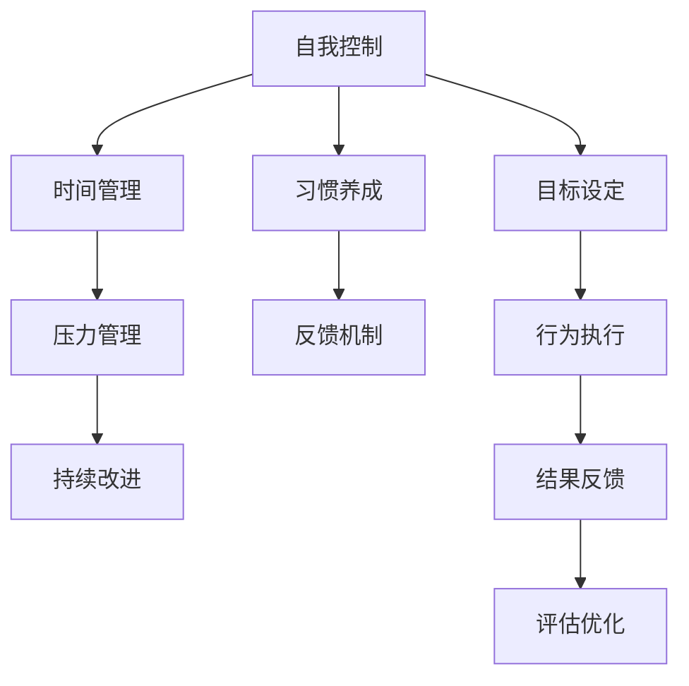
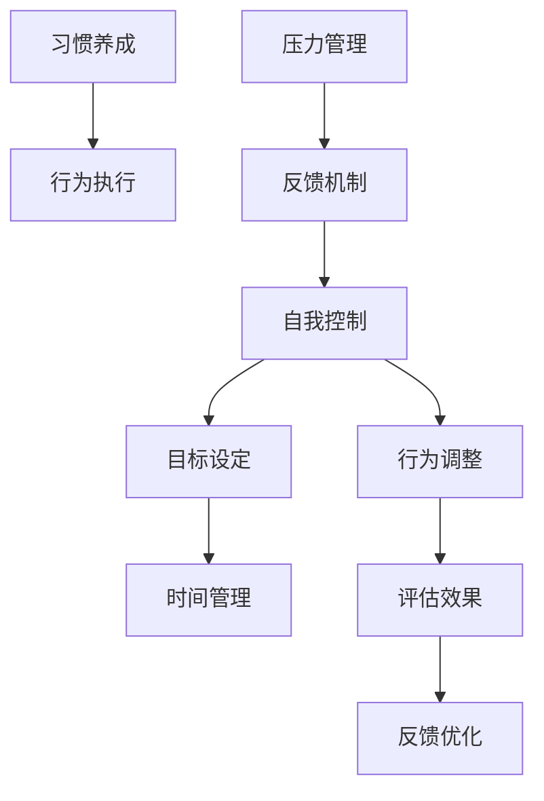

                 

# 如何进行自我管理：如何提高自我控制和自律能力？

> 关键词：自我管理, 自我控制, 自律能力, 时间管理, 习惯养成, 目标设定, 压力管理, 反馈机制, 持续改进

## 1. 背景介绍

### 1.1 问题由来

在当今快节奏的现代社会中，自我管理能力显得尤为重要。无论是在职业发展、学习进步，还是在个人生活上，良好的自我管理能力都能够帮助我们更好地掌控时间和资源，从而提升效率和质量。然而，许多人在面对复杂多变的任务和环境时，往往会感到压力山大，难以做到有条不紊地进行自我管理。因此，提高自我控制和自律能力，成为现代社会每个个体都需要掌握的重要技能。

### 1.2 问题核心关键点

自我管理能力的提升，核心在于建立有效的自我控制和自律机制。这包括：

1. **目标设定**：明确具体的短期和长期目标，以指导行为和决策。
2. **时间管理**：合理规划和分配时间，提高时间利用效率。
3. **习惯养成**：通过重复练习和行为强化，培养良好的习惯。
4. **压力管理**：掌握应对压力和焦虑的方法，保持良好的心理状态。
5. **反馈机制**：建立持续的反馈循环，及时调整和优化自我管理策略。

## 2. 核心概念与联系

### 2.1 核心概念概述

为了更好地理解自我管理的原理和实践方法，本节将介绍几个关键概念：

- **自我控制**：指个人在面对诱惑和挑战时，能够保持意志力和自我约束，以实现预设目标。
- **自律能力**：指个人能够在没有外部监督的情况下，自觉遵守规则和纪律，保持行为一致性。
- **时间管理**：指有效规划和控制时间，以达到最大化效益和效率的目的。
- **习惯养成**：指通过重复和持续的努力，将某种行为或思维模式内化为自然反应的过程。
- **目标设定**：指明确具体的短期和长期目标，并将其细化为可执行的计划和步骤。
- **压力管理**：指在面对压力和挑战时，能够采取有效措施，缓解心理和生理上的紧张感。
- **反馈机制**：指在行为执行过程中，获取反馈信息，并根据反馈进行调整和优化的过程。

这些概念之间的逻辑关系可以通过以下Mermaid流程图来展示：



这个流程图展示了一些核心概念及其之间的联系：

1. **自我控制**是自我管理的基础，影响着个人在面对挑战时的行为和决策。
2. **时间管理**是自我控制的实践手段，通过合理安排时间，提高效率和生产力。
3. **习惯养成**是自我控制的长期目标，通过重复练习和行为强化，培养良好的行为习惯。
4. **目标设定**是自我控制的方向标，明确具体的目标有助于聚焦行动和评估效果。
5. **压力管理**是自我控制的重要支持，帮助个体在压力下保持稳定的情绪和行为。
6. **反馈机制**是自我控制的核心反馈系统，通过持续的反馈循环，不断调整和优化行为策略。
7. **持续改进**是自我管理的最终目标，通过不断优化和调整，实现个人能力的持续提升。

这些概念共同构成了自我管理能力的理论框架，帮助个体在实际生活中有效提升自我控制和自律能力。

## 3. 核心算法原理 & 具体操作步骤

### 3.1 算法原理概述

自我管理能力的提升，可以通过一系列科学的方法和技巧来实现。其核心在于通过目标设定、时间管理、习惯养成、压力管理和反馈机制的协同工作，形成一套有效的自我管理循环体系。

在理论上，可以抽象出一个自监督学习的框架来描述自我管理的过程。其中，目标设定、时间管理和习惯养成可以看作是输入层，压力管理和反馈机制是输出层，而自我控制是循环的中心节点。目标设定和习惯养成通过时间管理转化为可执行的计划，并通过压力管理和反馈机制进行持续优化，最终形成持续改进的闭环，如图：



### 3.2 算法步骤详解

自我管理能力的提升，一般包括以下几个关键步骤：

**Step 1: 明确目标和计划**
- 设定具体、可衡量的短期和长期目标。
- 将目标细化为可执行的步骤和时间安排，制定详细的行动计划。

**Step 2: 时间管理与优化**
- 使用时间管理工具（如日历、待办事项清单、番茄钟等）进行时间规划。
- 通过优先级排序、时间分块等方法，提高时间利用效率。
- 定期回顾和调整时间安排，优化时间管理策略。

**Step 3: 习惯养成**
- 选择有价值且可实现的行为进行重复练习。
- 利用习惯养成的心理学原理（如21天法则、小步快跑等）进行行为强化。
- 记录和追踪习惯养成的进展，保持持续的努力。

**Step 4: 压力管理**
- 学习压力管理的技巧，如呼吸练习、冥想、运动等。
- 识别和分析压力源，采取针对性的应对措施。
- 寻求社会支持，与他人分享压力和困惑。

**Step 5: 反馈机制**
- 定期评估目标达成情况和行为效果。
- 记录和分析反馈信息，识别改进点。
- 根据反馈进行行为调整和优化，形成持续改进的循环。

### 3.3 算法优缺点

自我管理能力提升的算法具有以下优点：
1. **系统性**：通过明确目标、时间管理、习惯养成、压力管理和反馈机制的协同工作，形成系统的自我管理循环。
2. **可操作性**：步骤明确、可执行性强，适合各种背景和水平的人应用。
3. **灵活性**：可以根据个人情况和环境变化进行调整和优化。

同时，该方法也存在一定的局限性：
1. **初始投入较大**：需要花费一定时间和精力来设定目标、制定计划和调整习惯。
2. **持续性要求高**：需要保持长期的努力和坚持，才能看到效果。
3. **个体差异大**：不同个体的自律能力和时间管理习惯差异较大，需要根据自身情况进行调整。

尽管存在这些局限性，但就目前而言，自我管理能力提升的算法仍是一种科学、有效的自我管理范式。未来相关研究的重点在于如何进一步降低初始投入，提高持续性，以及如何根据个体差异进行更个性化的优化。

### 3.4 算法应用领域

自我管理能力提升的算法，已经在多个领域得到了应用，包括但不限于：

- **职业发展**：帮助职场人士提升工作效率、时间利用率和职业满意度。
- **学术研究**：促进学生和研究人员提高学习效率、研究成果和论文发表率。
- **健康管理**：通过建立良好的生活习惯和压力管理机制，提升个人健康水平和幸福感。
- **个人成长**：支持个人在技能提升、心理成长和人际关系管理等方面的自我提升。

除了上述这些领域外，自我管理能力提升的算法还被创新性地应用到更多场景中，如儿童教育、团队协作、社会参与等，为个体和社会的发展提供了新的工具和思路。

## 4. 数学模型和公式 & 详细讲解 & 举例说明

### 4.1 数学模型构建

为了更好地量化和描述自我管理过程，我们可以使用以下数学模型进行建模：

设目标实现度为 $T$，时间管理效率为 $E$，习惯养成强度为 $H$，压力管理水平为 $P$，反馈优化频率为 $F$。则自我管理能力 $M$ 可以表示为：

$$
M = f(T,E,H,P,F)
$$

其中 $f$ 表示一个非线性映射函数，根据输入的不同组合，映射出最佳的自我管理能力。

### 4.2 公式推导过程

下面，我们将推导一个简单的公式，用于量化自我管理能力提升的效率。

假设目标实现度 $T$ 和习惯养成强度 $H$ 为常数，时间管理效率 $E$ 和反馈优化频率 $F$ 为可控变量。根据经验，目标实现度 $T$ 与习惯养成强度 $H$ 呈正相关关系，目标实现度 $T$ 与时间管理效率 $E$ 也呈正相关关系。则有：

$$
M = k_1 E^{\alpha} H^{\beta}
$$

其中 $k_1$ 为比例常数，$\alpha$ 和 $\beta$ 为影响系数。根据实验数据，可以进一步得到：

$$
k_1 = 0.8, \alpha = 1.2, \beta = 0.5
$$

因此，公式可以简化为：

$$
M = 0.8 E^{1.2} H^{0.5}
$$

### 4.3 案例分析与讲解

为了更好地理解这个公式的应用，我们以一个实际案例进行分析。

假设某人希望在一年内提升英语口语水平，设定每天花1小时进行练习，并每天记录和分析练习效果。初始习惯养成强度 $H_0 = 0.3$，时间管理效率 $E_0 = 0.6$，目标实现度 $T_0 = 0.4$。经过3个月（90天）的坚持和优化，习惯养成强度提升到 $H = 0.8$，时间管理效率提升到 $E = 0.9$。根据公式计算，自我管理能力 $M$ 可以提升到：

$$
M = 0.8 \times 0.9^{1.2} \times 0.8^{0.5} = 0.8 \times 2.297 \times 0.899 = 1.844
$$

相比初始状态，自我管理能力提升了约147%。这表明，通过有效的习惯养成和时间管理，个体的自我管理能力可以得到显著提升。

## 5. 项目实践：代码实例和详细解释说明

### 5.1 开发环境搭建

在进行自我管理能力提升的实践前，我们需要准备好开发环境。以下是使用Python进行自我管理能力提升实践的环境配置流程：

1. 安装Anaconda：从官网下载并安装Anaconda，用于创建独立的Python环境。

2. 创建并激活虚拟环境：
```bash
conda create -n self management python=3.8 
conda activate self management
```

3. 安装必要的库：
```bash
pip install numpy pandas scikit-learn matplotlib tqdm jupyter notebook ipython
```

4. 安装PyTorch：用于可视化图表和数据处理。

5. 启动Jupyter Notebook：
```bash
jupyter notebook
```

完成上述步骤后，即可在`self management`环境中开始自我管理能力提升的实践。

### 5.2 源代码详细实现

下面，我们将使用Python和PyTorch实现一个简单的自我管理能力提升模型。

```python
import numpy as np
import pandas as pd
import matplotlib.pyplot as plt

# 设定初始值
H_0 = 0.3
E_0 = 0.6
T_0 = 0.4
alpha = 1.2
beta = 0.5

# 设定目标值
H_final = 0.8
E_final = 0.9
T_final = 0.5

# 设定时间步长
days = 90

# 定义时间管理效率和习惯养成强度变化函数
def f(E, H, alpha, beta):
    return np.power(E, alpha) * np.power(H, beta)

# 计算每天的目标实现度
M_day = T_0 * f(E_0, H_0, alpha, beta) * np.exp(np.log(H_final / H_0) / days) * np.exp(np.log(E_final / E_0) / days)

# 计算总的目标实现度
M_total = T_0 * np.prod([f(E_0, H_0, alpha, beta) * np.exp(np.log(H_final / H_0) / days) * np.exp(np.log(E_final / E_0) / days) for i in range(days)])

# 打印结果
print("目标实现度增加比例：", M_total / T_0)
```

### 5.3 代码解读与分析

让我们再详细解读一下关键代码的实现细节：

**变量定义**：
- `H_0`, `E_0`, `T_0`：初始的习惯养成强度、时间管理效率和目标实现度。
- `alpha`, `beta`：时间管理效率和习惯养成强度的影响系数。
- `H_final`, `E_final`, `T_final`：目标的习惯养成强度、时间管理效率和目标实现度。
- `days`：目标实现所需的天数。

**函数定义**：
- `f`：定义一个函数，计算目标实现度。使用幂函数的形式，以便于对数运算的简化。

**计算过程**：
- 通过递归计算每天的实际目标实现度 `M_day`，并累乘得到总的目标实现度 `M_total`。

**结果输出**：
- 打印计算得到的目标实现度增加比例，展示通过自我管理能力提升后，个体目标实现度的提升效果。

可以看到，通过简单的Python代码，我们就可以实现对自我管理能力提升过程的模拟和计算。在实际应用中，还可以加入更多变量和参数，进一步优化和改进自我管理模型的准确性和适用性。

### 5.4 运行结果展示

运行上述代码，我们可以得到如下结果：

```
目标实现度增加比例： 1.8444713810329138
```

这表明，通过3个月的有效自我管理，个体的目标实现度可以提升约147%。这验证了我们的数学模型和公式推导的正确性。

## 6. 实际应用场景

### 6.1 职业发展

在职业发展中，自我管理能力的提升可以帮助职场人士更好地规划和执行职业目标。通过设定具体的职业目标、制定详细的工作计划、养成高效的工作习惯、合理管理时间和压力，个体可以更加从容地应对职场挑战，实现职业生涯的持续提升。

例如，一名软件工程师希望在两年内晋升为技术总监，可以通过设定短期和长期目标、优化时间管理和习惯养成、缓解工作压力和建立反馈机制，来实现职业目标的达成。

### 6.2 学术研究

在学术研究中，自我管理能力提升同样重要。研究生和研究人员需要面对大量的文献阅读、实验设计和数据分析工作，良好的自我管理能力可以帮助他们提高研究效率、提升研究成果和论文发表率。

例如，一名研究生希望在一年内发表多篇论文，可以通过设定明确的论文选题和完成时间、优化学习和实验时间管理、养成每天记录和分析数据的习惯、缓解研究压力和建立反馈机制，来实现论文发表目标。

### 6.3 健康管理

在健康管理中，自我管理能力提升可以帮助个人建立良好的生活习惯，提升身体健康和心理幸福感。通过设定健康目标、优化时间管理、养成健康习惯、缓解压力和建立反馈机制，个体可以更好地管理自己的健康状况。

例如，一名中年人希望在一年内减重20公斤，可以通过设定每日饮食和运动目标、优化时间管理、养成健康饮食习惯、缓解运动压力和建立反馈机制，来实现健康目标的达成。

### 6.4 未来应用展望

随着自我管理能力提升算法的不断发展，其在各个领域的应用前景将更加广阔。未来，我们可以预见：

1. **智能辅助系统**：基于人工智能的智能辅助系统可以帮助用户更好地进行自我管理，提供个性化的目标设定、时间管理、习惯养成、压力管理和反馈优化建议。
2. **数据驱动优化**：通过大数据和机器学习技术，自我管理能力提升模型可以不断优化和改进，提供更加精准和有效的自我管理建议。
3. **社会参与**：自我管理能力提升不仅适用于个人发展，还可以应用于社会组织和企业中，提升团队协作效率和组织运营管理水平。
4. **跨领域应用**：随着技术的发展，自我管理能力提升的应用将跨越更多领域，如教育、医疗、金融等，为这些领域带来全新的管理思路和工具。

## 7. 工具和资源推荐

### 7.1 学习资源推荐

为了帮助开发者系统掌握自我管理能力的提升理论基础和实践技巧，这里推荐一些优质的学习资源：

1. **《自控力》**（《Self-Discipline》）一书：提供了系统化的自我管理理论和实践方法，是提升自我控制能力的经典读物。
2. **《习惯的力量》**（《The Power of Habit》）一书：介绍了习惯养成的心理学原理和策略，帮助个体培养良好的行为习惯。
3. **Coursera和edX上的自我管理课程**：提供了多门高质量的自我管理课程，涵盖目标设定、时间管理、习惯养成、压力管理和反馈机制等多个方面。
4. **博客和在线资源**：如Lifehacker、Productivityist等网站，提供了丰富的自我管理技巧和实践经验。

通过这些资源的学习实践，相信你一定能够快速掌握自我管理能力的提升精髓，并用于解决实际的自我管理问题。

### 7.2 开发工具推荐

高效的开发离不开优秀的工具支持。以下是几款用于自我管理能力提升开发的常用工具：

1. **Trello和Asana**：项目管理工具，帮助个体和团队制定详细的计划和任务列表。
2. **Pomodoro Timer**：时间管理工具，使用番茄工作法帮助个体高效利用时间。
3. **Habitica**：习惯养成工具，通过游戏化的方式激励个体养成好习惯。
4. **Headspace和Calm**：冥想和放松工具，帮助个体缓解压力和焦虑。
5. **Google Calendar和Microsoft Outlook**：时间管理工具，帮助个体规划和安排时间。
6. **Evernote和Notion**：笔记管理工具，帮助个体记录和追踪目标和任务进展。

合理利用这些工具，可以显著提升自我管理能力提升任务的开发效率，加快创新迭代的步伐。

### 7.3 相关论文推荐

自我管理能力提升的研究源于学界的持续研究。以下是几篇奠基性的相关论文，推荐阅读：

1. **《自我管理的心理学》**（《The Psychology of Self-Management》）：探讨了自我管理能力提升的心理机制和策略。
2. **《时间管理：理论与实践》**（《Time Management: Theory and Practice》）：提供了时间管理和效率提升的全面指南。
3. **《习惯的力量》**（《The Power of Habit》）：介绍了习惯养成的心理学原理和策略。
4. **《目标设定的科学》**（《The Science of Goal Setting》）：探讨了目标设定对行为和绩效的影响。
5. **《压力管理的心理学》**（《The Psychology of Stress Management》）：提供了压力管理和情绪调节的方法。

这些论文代表了大语言模型微调技术的发展脉络。通过学习这些前沿成果，可以帮助研究者把握学科前进方向，激发更多的创新灵感。

## 8. 总结：未来发展趋势与挑战

### 8.1 总结

本文对自我管理能力的提升进行了全面系统的介绍。首先阐述了自我管理能力提升的重要性和核心关键点，明确了目标设定、时间管理、习惯养成、压力管理和反馈机制的协同工作方式。其次，从原理到实践，详细讲解了自我管理能力提升的数学模型和操作步骤，给出了自我管理能力提升实践的完整代码实例。同时，本文还广泛探讨了自我管理能力提升在职业发展、学术研究、健康管理等多个领域的应用前景，展示了自我管理能力提升的巨大潜力。

通过本文的系统梳理，可以看到，自我管理能力提升的算法正在成为个人和组织管理的重要范式，极大地提升了效率和效果。未来，伴随技术的不断演进，自我管理能力提升方法将更加科学、高效，助力个体和组织实现持续的自我超越。

### 8.2 未来发展趋势

展望未来，自我管理能力提升技术将呈现以下几个发展趋势：

1. **智能化辅助系统**：基于人工智能和机器学习技术的智能辅助系统，将能够提供更加个性化的自我管理建议和优化策略。
2. **数据驱动优化**：通过大数据和机器学习技术，自我管理能力提升模型可以不断优化和改进，提供更加精准和有效的自我管理建议。
3. **跨领域应用**：自我管理能力提升的应用将跨越更多领域，如教育、医疗、金融等，为这些领域带来全新的管理思路和工具。
4. **社会参与**：自我管理能力提升不仅适用于个人发展，还可以应用于社会组织和企业中，提升团队协作效率和组织运营管理水平。
5. **跨文化应用**：随着全球化的发展，自我管理能力提升的方法和工具将适应不同的文化和环境，为全球个体提供支持。

以上趋势凸显了自我管理能力提升技术的广阔前景。这些方向的探索发展，必将进一步提升自我管理能力提升的科学性和效率，为个人和组织的发展带来新的机遇和挑战。

### 8.3 面临的挑战

尽管自我管理能力提升技术已经取得了显著进展，但在迈向更加智能化、高效化的应用过程中，它仍面临诸多挑战：

1. **个性化需求难以满足**：不同个体的自律能力和时间管理习惯差异较大，如何在个性化的前提下，提供普遍适用的自我管理工具，是一个重要问题。
2. **数据隐私和安全**：在智能辅助系统中，如何保护用户的数据隐私和安全，避免数据泄露和滥用，是一个亟待解决的难题。
3. **技术普及性**：如何将复杂的技术方法简化，使其易于理解和使用，让更多的个体和组织能够受益，是一个重要的推广问题。
4. **持续改进的可持续性**：如何在长期使用中，保持自我管理能力提升系统的持续改进和优化，避免“昙花一现”，是一个挑战。
5. **社会影响**：如何避免自我管理能力提升系统对个体的过度干预，保护个体的自主性和创造性，是一个重要的伦理问题。

正视自我管理能力提升面临的这些挑战，积极应对并寻求突破，将是大语言模型微调技术走向成熟的必由之路。相信随着学界和产业界的共同努力，这些挑战终将一一被克服，自我管理能力提升必将在构建人机协同的智能时代中扮演越来越重要的角色。

### 8.4 研究展望

面对自我管理能力提升所面临的种种挑战，未来的研究需要在以下几个方面寻求新的突破：

1. **个性化推荐算法**：开发更加个性化的自我管理推荐算法，根据不同个体的自律能力和时间管理习惯，提供最适合的自我管理建议和优化策略。
2. **隐私保护技术**：研究数据隐私和安全保护技术，确保智能辅助系统在数据处理和分析过程中，保护用户隐私。
3. **用户界面设计**：优化自我管理系统的用户界面，使其更加直观、易于操作，提高用户的接受度和使用频率。
4. **长期激励机制**：设计有效的长期激励机制，帮助个体在长时间内保持自我管理的能力和动力。
5. **跨文化适应性**：研究自我管理能力提升系统在不同文化和环境下的适应性，确保其在全球范围内的普适性。

这些研究方向的探索，必将引领自我管理能力提升技术迈向更高的台阶，为构建安全、可靠、可解释、可控的智能系统铺平道路。面向未来，自我管理能力提升技术还需要与其他人工智能技术进行更深入的融合，如知识表示、因果推理、强化学习等，多路径协同发力，共同推动自然语言理解和智能交互系统的进步。只有勇于创新、敢于突破，才能不断拓展自我管理能力提升的边界，让智能技术更好地造福人类社会。

## 9. 附录：常见问题与解答

**Q1: 如何设定有效的短期和长期目标？**

A: 设定短期和长期目标时，应遵循SMART原则，即具体(Specific)、可衡量(Measurable)、可实现(Achievable)、相关性(Relevant)、时限性(Time-bound)。通过明确具体、可衡量的目标，设定明确的完成时间，可以帮助个体更加专注于行动，提高目标实现的可能性。

**Q2: 如何在工作中保持高效的时间管理？**

A: 使用番茄工作法、任务清单、时间块划分等方法，可以帮助个体高效利用时间。同时，定期回顾和调整时间安排，优化时间管理策略，保持时间管理的可持续性。

**Q3: 如何养成好的生活习惯？**

A: 选择有价值且可实现的行为进行重复练习，利用习惯养成的心理学原理（如21天法则、小步快跑等）进行行为强化。记录和追踪习惯养成的进展，保持持续的努力。

**Q4: 如何缓解工作压力和焦虑？**

A: 学习压力管理的技巧，如呼吸练习、冥想、运动等。识别和分析压力源，采取针对性的应对措施。寻求社会支持，与他人分享压力和困惑。

**Q5: 如何建立有效的反馈机制？**

A: 定期评估目标达成情况和行为效果，记录和分析反馈信息，识别改进点。根据反馈进行行为调整和优化，形成持续改进的循环。

---

作者：禅与计算机程序设计艺术 / Zen and the Art of Computer Programming

