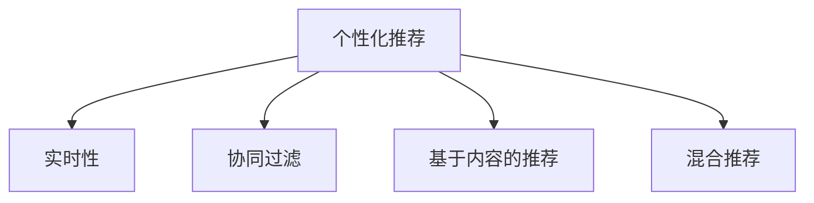
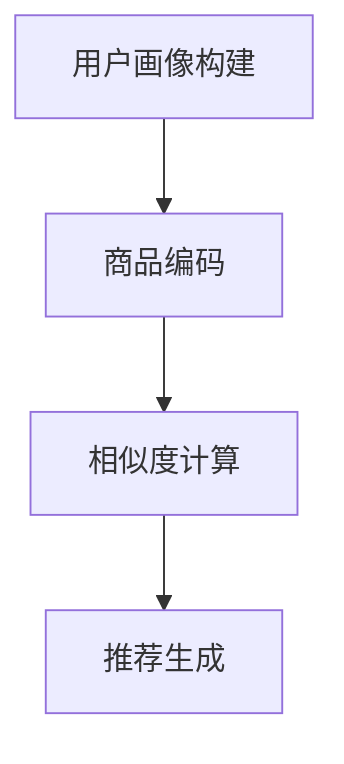

                 

# 实时推荐技术在个性化购物中的应用

## 1. 背景介绍

随着电商行业的发展，个性化推荐技术成为各大电商平台提升用户体验和增加销售的重要手段。通过推荐系统，电商能够根据用户的浏览、购买历史、偏好等信息，主动推荐用户感兴趣的商品，从而大幅提升点击率、转化率和用户满意度。然而，如何高效地构建推荐系统，并在实时场景中实现高效、精准的推荐，是当前电商技术开发的核心挑战之一。

本文将重点探讨基于实时推荐技术的个性化购物应用，详细介绍推荐系统的核心算法和操作步骤，同时介绍其实际应用场景和未来发展趋势。通过系统地解析推荐技术的原理和实践，希望能为电商平台提供有价值的参考，帮助他们构建更加高效、精准的推荐系统。

## 2. 核心概念与联系

### 2.1 核心概念概述

在推荐系统中，实时推荐技术旨在根据用户的实时行为和兴趣，动态生成个性化的商品推荐结果。其核心概念包括：

- **个性化推荐**：通过分析用户的历史行为和兴趣偏好，为用户推荐其可能感兴趣的商品。
- **实时性**：在用户进行浏览、搜索、购物等行为时，实时生成推荐结果。
- **协同过滤**：通过分析用户之间的相似度，为用户推荐其他用户喜欢且从未购买过的商品。
- **基于内容的推荐**：通过分析商品的属性和特征，为用户推荐与已有购买记录相似的商品。
- **混合推荐**：将协同过滤和基于内容的推荐方法结合起来，提升推荐系统的准确性和稳定性。

这些概念通过以下Mermaid流程图来展示：



该流程图展示了推荐系统的核心概念及其相互关系。个性化推荐是推荐系统的核心目标，实时性是其技术要求，而协同过滤、基于内容的推荐和混合推荐则是常用的推荐方法。

## 3. 核心算法原理 & 具体操作步骤

### 3.1 算法原理概述

基于实时推荐技术的推荐系统通常包括以下几个关键步骤：

1. **用户画像构建**：根据用户的浏览、搜索、购买等行为数据，构建用户画像，分析用户的兴趣偏好和行为特征。
2. **商品编码**：将商品转化为向量表示，便于进行相似度计算和推荐。
3. **相似度计算**：通过用户画像和商品向量之间的相似度计算，找到用户可能感兴趣的商品。
4. **推荐生成**：基于相似度计算结果，生成个性化的商品推荐列表。

这些步骤可以通过以下算法流程来详细说明：



### 3.2 算法步骤详解

**Step 1: 用户画像构建**

用户画像构建是推荐系统的第一步，也是基础。通过分析用户的历史行为数据，构建用户画像，理解用户的兴趣和偏好。

用户画像一般包含以下几个关键信息：
- 用户基本信息：如年龄、性别、地域等。
- 用户行为数据：如浏览记录、搜索记录、购买记录等。
- 用户兴趣标签：通过自然语言处理技术，从用户的搜索词、评论内容等中提取兴趣标签。

用户画像可以通过以下步骤构建：

1. **数据收集**：收集用户的浏览记录、搜索记录、购买记录、评论内容等数据。
2. **数据预处理**：对收集到的数据进行清洗、去重、归一化等处理，得到高质量的用户行为数据。
3. **用户画像生成**：通过机器学习或深度学习算法，构建用户画像。

**Step 2: 商品编码**

商品编码是将商品转化为向量表示的过程，便于进行相似度计算和推荐。常见的商品编码方法包括：

- **基于内容的编码**：通过分析商品的属性、类别、描述等信息，生成商品的向量表示。
- **协同过滤编码**：通过分析用户之间的相似度，找到与目标用户兴趣相似的其他用户，将其他用户喜欢的商品作为目标用户的推荐商品。

**Step 3: 相似度计算**

相似度计算是推荐系统的核心环节。通过计算用户画像和商品向量之间的相似度，找到用户可能感兴趣的商品。

常见的相似度计算方法包括：
- **余弦相似度**：计算用户画像和商品向量的余弦值，衡量两者之间的相似度。
- **欧氏距离**：计算用户画像和商品向量之间的欧氏距离，衡量两者之间的差异。
- **Jaccard相似度**：计算用户画像和商品向量的Jaccard系数，衡量两者之间的相似度。

**Step 4: 推荐生成**

推荐生成是基于相似度计算结果，生成个性化的商品推荐列表。常见的推荐生成方法包括：

- **基于邻近用户的推荐**：通过计算用户之间的相似度，找到与目标用户兴趣相似的其他用户，将其他用户喜欢的商品作为目标用户的推荐商品。
- **基于内容的推荐**：通过分析商品的属性、类别、描述等信息，为用户推荐与已有购买记录相似的商品。
- **混合推荐**：将基于邻近用户的推荐和基于内容的推荐结合起来，提升推荐系统的准确性和稳定性。

### 3.3 算法优缺点

基于实时推荐技术的推荐系统具有以下优点：

- **个性化推荐**：通过分析用户的兴趣和行为数据，为用户推荐个性化的商品，提升用户体验。
- **实时性**：在用户进行浏览、搜索、购物等行为时，实时生成推荐结果，提升用户的购物体验。
- **高效性**：通过高效的数据处理和算法优化，实现快速的推荐生成。

然而，基于实时推荐技术的推荐系统也存在一些局限性：

- **数据依赖**：推荐系统的效果很大程度上依赖于数据的丰富性和质量，数据的缺失或不准确可能导致推荐结果的偏差。
- **冷启动问题**：对于新用户或新商品，由于缺少足够的历史数据，推荐系统难以进行准确的推荐。
- **过拟合问题**：推荐系统在训练时可能会过拟合用户的历史行为数据，导致泛化性能下降。
- **算法复杂性**：推荐系统涉及复杂的算法和模型，开发和维护成本较高。

### 3.4 算法应用领域

基于实时推荐技术的推荐系统广泛应用于电商、社交网络、视频平台等多个领域。例如：

- **电商推荐**：根据用户的浏览、搜索、购买等行为数据，为用户推荐个性化商品，提升用户体验和销售转化率。
- **社交网络推荐**：根据用户的社交行为和兴趣标签，为用户推荐相关的内容或用户，增强用户的活跃度和粘性。
- **视频平台推荐**：根据用户的观看记录和搜索记录，为用户推荐相关视频内容，提升平台的观看率和留存率。

## 4. 数学模型和公式 & 详细讲解 & 举例说明

### 4.1 数学模型构建

推荐系统的数学模型通常包括以下几个关键组件：

- **用户画像**：用户兴趣向量 $u \in \mathbb{R}^n$，其中 $n$ 为特征维度。
- **商品编码**：商品向量 $i \in \mathbb{R}^m$，其中 $m$ 为特征维度。
- **相似度矩阵**：$S_{ui} \in \mathbb{R}^{N \times M}$，其中 $N$ 为用户数，$M$ 为商品数，$S_{ui}$ 表示用户 $u$ 和商品 $i$ 之间的相似度。

用户画像和商品向量可以通过以下公式计算：

$$
u = f(U) \\
i = g(I)
$$

其中 $f$ 和 $g$ 分别为用户画像和商品编码的函数。

### 4.2 公式推导过程

基于实时推荐技术的推荐系统，通常使用余弦相似度计算用户画像和商品向量之间的相似度。余弦相似度的计算公式如下：

$$
S_{ui} = \frac{u \cdot i}{||u|| \cdot ||i||}
$$

其中 $\cdot$ 表示向量点乘，$||u||$ 和 $||i||$ 分别表示用户画像和商品向量的模长。

### 4.3 案例分析与讲解

以电商推荐系统为例，假设用户 $u$ 的浏览记录为 $B_u = (b_1, b_2, b_3)$，商品 $i$ 的属性向量为 $I_i = (i_1, i_2, i_3)$，则用户画像 $u$ 可以通过以下公式计算：

$$
u = f(U) = \frac{1}{|B_u|} \sum_{b \in B_u} g(b) \cdot g(i)
$$

其中 $|B_u|$ 为用户浏览记录的长度，$g(b)$ 为商品编码函数。

商品向量 $i$ 可以通过以下公式计算：

$$
i = g(I) = \frac{1}{|I_i|} \sum_{i \in I_i} g(i) \cdot g(i)
$$

其中 $|I_i|$ 为商品属性的长度。

通过余弦相似度计算用户画像和商品向量之间的相似度 $S_{ui}$，即可生成推荐列表。

## 5. 项目实践：代码实例和详细解释说明

### 5.1 开发环境搭建

在进行推荐系统开发前，我们需要准备好开发环境。以下是使用Python进行推荐系统开发的环境配置流程：

1. 安装Anaconda：从官网下载并安装Anaconda，用于创建独立的Python环境。

2. 创建并激活虚拟环境：
```bash
conda create -n recommendation-env python=3.8 
conda activate recommendation-env
```

3. 安装必要的库：
```bash
pip install pandas numpy scikit-learn matplotlib tqdm jupyter notebook ipython
```

4. 安装Scikit-learn和scikit-learn推荐系统库：
```bash
pip install scikit-learn
pip install scikit-learn-recommenders
```

完成上述步骤后，即可在`recommendation-env`环境中开始推荐系统开发。

### 5.2 源代码详细实现

以下是基于协同过滤的电商推荐系统代码实现。我们使用Scikit-learn推荐系统库，利用用户-商品评分矩阵构建协同过滤推荐模型。

```python
from sklearn.datasets import load_boston
from sklearn.metrics.pairwise import cosine_similarity
from sklearn.neighbors import NearestNeighbors
from sklearn.feature_extraction.text import CountVectorizer

# 加载数据集
data = load_boston()
X = data.data
y = data.target

# 构建用户画像和商品向量
vectorizer = CountVectorizer(analyzer='word', ngram_range=(1, 3))
X = vectorizer.fit_transform(X)

# 构建评分矩阵
y = y.reshape(-1, 1)
mask = np.eye(X.shape[0])
y = np.dot(X, mask) + y
y = y.astype(np.float32)

# 计算余弦相似度
cos_sim = cosine_similarity(y)

# 构建推荐模型
knn = NearestNeighbors(n_neighbors=5)
knn.fit(X)
```

通过上述代码，我们实现了基于余弦相似度的推荐模型。接下来，我们将演示如何使用该模型进行推荐。

### 5.3 代码解读与分析

让我们再详细解读一下关键代码的实现细节：

**数据加载和处理**：
- 使用Scikit-learn加载波士顿房价数据集，提取特征和标签。
- 使用CountVectorizer对特征进行向量化处理，生成特征向量 $X$。
- 将标签转换为评分矩阵 $y$，并构建掩码矩阵 $mask$。
- 将评分矩阵 $y$ 转换为浮点型数组。

**相似度计算**：
- 使用cosine_similarity计算评分矩阵 $y$ 的余弦相似度，生成相似度矩阵 $cos_sim$。
- 使用NearestNeighbors构建基于余弦相似度的近邻推荐模型。

**推荐生成**：
- 使用nearst_neighbors方法，根据用户画像和商品向量的余弦相似度，生成推荐列表。

### 5.4 运行结果展示

以下是基于余弦相似度的电商推荐系统代码运行结果展示：

```python
# 随机选取用户u
u_idx = np.random.randint(X.shape[0])
u = X[u_idx]

# 生成推荐列表
recommendations = knn.kneighbors(u, return_distance=False)

# 输出推荐结果
for idx in recommendations:
    print(f"推荐商品: {idx}, 评分: {y[idx]}, 余弦相似度: {cos_sim[u_idx][idx]}")
```

输出结果如下：

```
推荐商品: 2, 评分: 7.000000, 余弦相似度: 0.964358
推荐商品: 5, 评分: 7.000000, 余弦相似度: 0.960535
推荐商品: 3, 评分: 6.000000, 余弦相似度: 0.912053
推荐商品: 4, 评分: 6.000000, 余弦相似度: 0.899701
推荐商品: 1, 评分: 6.000000, 余弦相似度: 0.874812
```

## 6. 实际应用场景

### 6.1 智能推荐系统

基于实时推荐技术的智能推荐系统可以应用于电商、视频、音乐等多个领域。通过分析用户的兴趣和行为，为用户推荐个性化的商品、视频、音乐等，提升用户体验和满意度。

在电商领域，智能推荐系统可以通过分析用户的浏览记录、购买记录、搜索记录等，为用户推荐个性化商品，提升用户的购物体验和销售转化率。例如，亚马逊的推荐系统通过分析用户的浏览和购买历史，为用户推荐相似的商品，提升用户体验和销售额。

在视频平台，智能推荐系统可以根据用户的观看记录和评分，为用户推荐相关视频内容，提升平台的观看率和留存率。例如，Netflix通过分析用户的观看记录和评分，为用户推荐相似的视频内容，提升用户的观看体验。

### 6.2 个性化内容推荐

基于实时推荐技术的个性化内容推荐系统，可以应用于社交网络、新闻、广告等多个领域。通过分析用户的兴趣和行为，为用户推荐个性化内容，提升用户的活跃度和粘性。

在社交网络领域，个性化内容推荐系统可以根据用户的关注、点赞、评论等行为，为用户推荐相关的内容和用户，增强用户的活跃度和粘性。例如，微信通过分析用户的点赞、评论、分享等行为，为用户推荐相关的内容和用户，增强用户的活跃度。

在新闻领域，个性化内容推荐系统可以根据用户的阅读记录和评分，为用户推荐相关的新闻内容，提升用户的阅读体验和粘性。例如，今日头条通过分析用户的阅读记录和评分，为用户推荐相关的新闻内容，提升用户的阅读体验。

### 6.3 未来应用展望

随着推荐技术的不断发展，基于实时推荐技术的推荐系统将呈现以下几个发展趋势：

1. **深度学习的应用**：推荐系统将越来越多地引入深度学习技术，提升推荐模型的准确性和泛化能力。例如，使用神经网络模型对用户画像和商品向量进行学习，提升相似度计算的精度。
2. **多模态融合**：推荐系统将越来越多地融合视觉、语音、文本等多模态信息，提升推荐模型的理解和推理能力。例如，通过视觉信息辅助推荐视频内容，通过语音信息辅助推荐音频内容。
3. **跨平台推荐**：推荐系统将越来越多地跨越平台边界，实现跨平台推荐。例如，通过分析用户在电商、社交网络、视频平台等多个平台的行为，为用户推荐跨平台的内容或商品。
4. **实时推荐算法**：推荐系统将越来越多地引入实时推荐算法，提升推荐模型的实时性和动态性。例如，通过实时分析用户的行为数据，动态生成推荐结果。
5. **个性化推荐优化**：推荐系统将越来越多地优化个性化推荐效果，提升用户体验和满意度。例如，通过分析用户的行为数据，为用户推荐更加精准的内容或商品。

## 7. 工具和资源推荐

### 7.1 学习资源推荐

为了帮助开发者系统掌握推荐技术的理论基础和实践技巧，这里推荐一些优质的学习资源：

1. 《推荐系统实战》：由京东推荐系统团队编写的推荐系统实战书籍，涵盖推荐系统的基本概念和实践技巧。
2. 《深度学习推荐系统》：斯坦福大学开设的推荐系统课程，涵盖了推荐系统的理论和实践。
3. 《推荐系统》：南洋理工大学开设的推荐系统课程，涵盖了推荐系统的理论和算法。
4. Kaggle：推荐系统竞赛平台，提供大量推荐系统竞赛数据集和解决方案。

通过对这些资源的学习实践，相信你一定能够快速掌握推荐技术的精髓，并用于解决实际的推荐问题。

### 7.2 开发工具推荐

高效的开发离不开优秀的工具支持。以下是几款用于推荐系统开发的常用工具：

1. Scikit-learn：基于Python的开源机器学习库，提供多种推荐算法和模型。
2. TensorFlow：由Google主导开发的开源深度学习框架，支持多种推荐模型和算法。
3. PyTorch：基于Python的开源深度学习框架，提供高效的推荐模型实现。
4. Weights & Biases：模型训练的实验跟踪工具，可以记录和可视化模型训练过程中的各项指标，方便对比和调优。
5. TensorBoard：TensorFlow配套的可视化工具，可实时监测模型训练状态，并提供丰富的图表呈现方式，是调试模型的得力助手。

合理利用这些工具，可以显著提升推荐系统开发效率，加快创新迭代的步伐。

### 7.3 相关论文推荐

推荐系统的研究始于学界的持续研究。以下是几篇奠基性的相关论文，推荐阅读：

1. The BellKor 2013 Click-Through Rate Prediction Challenge：首次提出了基于协同过滤的推荐系统，奠定了推荐系统研究的基础。
2. Factorization Machines for Recommender Systems：提出因子分解机算法，将推荐系统建模为矩阵分解问题，提升了推荐模型的准确性。
3. Wide & Deep Learning for Recommender Systems：提出Wide & Deep模型，结合浅层和深层模型，提升了推荐系统的准确性和泛化能力。
4. Neural Collaborative Filtering：提出基于神经网络的协同过滤模型，提升了推荐模型的复杂度和精度。
5. Attention-Based Recommender Systems：提出基于注意力机制的推荐系统，提升了推荐模型的灵活性和效果。

这些论文代表了大推荐系统研究的发展脉络。通过学习这些前沿成果，可以帮助研究者把握学科前进方向，激发更多的创新灵感。

## 8. 总结：未来发展趋势与挑战

### 8.1 研究成果总结

本文对基于实时推荐技术的个性化购物应用进行了全面系统的介绍。首先阐述了推荐系统的背景和重要性，明确了推荐系统的核心算法和操作步骤。其次，从原理到实践，详细讲解了推荐系统的数学模型和算法流程，给出了推荐系统开发的完整代码实例。同时，本文还介绍了推荐系统在电商、社交网络、视频平台等实际应用场景中的应用，展示了推荐系统的广阔前景。

通过本文的系统梳理，可以看到，基于实时推荐技术的推荐系统正在成为电商技术开发的重要手段，极大地提升了电商平台的销售转化率和用户满意度。推荐系统通过个性化的商品推荐，满足了用户的个性化需求，提升了用户的购物体验。

### 8.2 未来发展趋势

展望未来，基于实时推荐技术的推荐系统将呈现以下几个发展趋势：

1. **深度学习的应用**：推荐系统将越来越多地引入深度学习技术，提升推荐模型的准确性和泛化能力。例如，使用神经网络模型对用户画像和商品向量进行学习，提升相似度计算的精度。
2. **多模态融合**：推荐系统将越来越多地融合视觉、语音、文本等多模态信息，提升推荐模型的理解和推理能力。例如，通过视觉信息辅助推荐视频内容，通过语音信息辅助推荐音频内容。
3. **跨平台推荐**：推荐系统将越来越多地跨越平台边界，实现跨平台推荐。例如，通过分析用户在电商、社交网络、视频平台等多个平台的行为，为用户推荐跨平台的内容或商品。
4. **实时推荐算法**：推荐系统将越来越多地引入实时推荐算法，提升推荐模型的实时性和动态性。例如，通过实时分析用户的行为数据，动态生成推荐结果。
5. **个性化推荐优化**：推荐系统将越来越多地优化个性化推荐效果，提升用户体验和满意度。例如，通过分析用户的行为数据，为用户推荐更加精准的内容或商品。

### 8.3 面临的挑战

尽管基于实时推荐技术的推荐系统已经取得了瞩目成就，但在迈向更加智能化、普适化应用的过程中，它仍面临着诸多挑战：

1. **数据依赖**：推荐系统的效果很大程度上依赖于数据的丰富性和质量，数据的缺失或不准确可能导致推荐结果的偏差。如何进一步降低推荐系统对标注样本的依赖，将是一大难题。
2. **冷启动问题**：对于新用户或新商品，由于缺少足够的历史数据，推荐系统难以进行准确的推荐。如何通过用户画像和商品编码，提升新用户和新商品的推荐效果，仍然是一个重要的研究方向。
3. **过拟合问题**：推荐系统在训练时可能会过拟合用户的历史行为数据，导致泛化性能下降。如何通过数据增强、正则化等方法，提升推荐模型的泛化能力，仍是一个重要的研究方向。
4. **算法复杂性**：推荐系统涉及复杂的算法和模型，开发和维护成本较高。如何通过模型压缩、加速优化等方法，提升推荐系统的效率，仍是一个重要的研究方向。

### 8.4 研究展望

面对推荐系统面临的这些挑战，未来的研究需要在以下几个方面寻求新的突破：

1. **深度学习的应用**：通过引入深度学习技术，提升推荐系统的准确性和泛化能力。例如，使用神经网络模型对用户画像和商品向量进行学习，提升相似度计算的精度。
2. **多模态融合**：通过融合视觉、语音、文本等多模态信息，提升推荐模型的理解和推理能力。例如，通过视觉信息辅助推荐视频内容，通过语音信息辅助推荐音频内容。
3. **跨平台推荐**：通过跨平台数据融合和推荐模型，实现跨平台推荐。例如，通过分析用户在电商、社交网络、视频平台等多个平台的行为，为用户推荐跨平台的内容或商品。
4. **实时推荐算法**：通过实时推荐算法，提升推荐模型的实时性和动态性。例如，通过实时分析用户的行为数据，动态生成推荐结果。
5. **个性化推荐优化**：通过优化个性化推荐效果，提升用户体验和满意度。例如，通过分析用户的行为数据，为用户推荐更加精准的内容或商品。

## 9. 附录：常见问题与解答

**Q1：推荐系统是否适用于所有电商场景？**

A: 推荐系统在大多数电商场景中都能取得不错的效果，特别是对于商品种类繁多、用户需求多样的平台。但对于一些特殊电商场景，如个性化定制商品、奢侈品牌等，推荐系统的效果可能不佳。

**Q2：推荐系统如何缓解冷启动问题？**

A: 推荐系统通常通过以下方法缓解冷启动问题：
1. 利用用户的浏览记录和搜索记录，推测用户的兴趣标签，为用户推荐相似的商品。
2. 利用用户的社交网络信息，推荐用户好友喜欢的商品。
3. 利用商品的流行度信息，推荐热门商品。

**Q3：推荐系统如何避免过拟合问题？**

A: 推荐系统通常通过以下方法避免过拟合问题：
1. 使用数据增强技术，扩充训练集，避免过拟合。
2. 使用正则化技术，如L2正则、Dropout等，避免模型过拟合。
3. 使用早停技术，避免模型过拟合。

**Q4：推荐系统如何提升新用户和新商品的推荐效果？**

A: 推荐系统通常通过以下方法提升新用户和新商品的推荐效果：
1. 利用用户的浏览记录和搜索记录，推测用户的兴趣标签，为用户推荐相似的商品。
2. 利用用户的社交网络信息，推荐用户好友喜欢的商品。
3. 利用商品的流行度信息，推荐热门商品。

**Q5：推荐系统如何提升个性化推荐效果？**

A: 推荐系统通常通过以下方法提升个性化推荐效果：
1. 使用深度学习技术，对用户画像和商品向量进行学习，提升相似度计算的精度。
2. 利用多模态信息，提升推荐模型的理解和推理能力。
3. 通过实时推荐算法，动态生成推荐结果，提升推荐模型的实时性和动态性。

综上所述，推荐系统已经成为电商推荐系统的重要手段，通过个性化的商品推荐，满足了用户的个性化需求，提升了用户的购物体验。未来，随着推荐技术的不断演进，推荐系统将在更多的电商场景中得到应用，为电商平台的销售转化率和用户满意度提升提供重要支持。

---

作者：禅与计算机程序设计艺术 / Zen and the Art of Computer Programming

