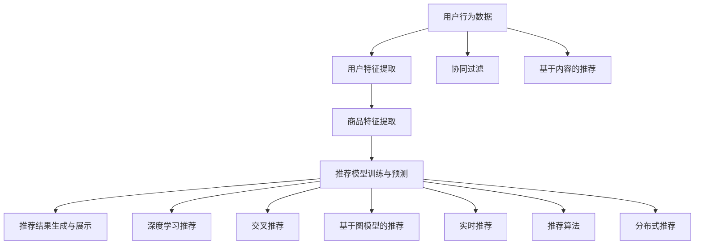

                 

## 1. 背景介绍

### 1.1 问题由来

随着互联网和电子商务的飞速发展，线上购物已经成为人们生活中不可或缺的一部分。电商平台在吸引消费者、提升销售量方面起到了至关重要的作用。然而，面对海量的商品和用户数据，电商平台如何高效、精准地推荐商品，满足用户的个性化需求，是电商企业面临的重大挑战。

传统的推荐系统大多基于协同过滤、基于内容的推荐等方法，存在数据稀疏、冷启动难等问题。随着深度学习技术和大数据的发展，实时推荐系统逐渐成为电商企业解决这些问题的有力工具。实时推荐系统通过对用户行为、商品属性、时间等多种维度的综合分析，实时生成个性化推荐，极大提升了用户体验和平台转化率。

### 1.2 问题核心关键点

实时推荐系统的核心在于通过智能算法对用户行为进行建模，利用机器学习技术预测用户可能感兴趣的商品，并实时更新推荐结果，为用户提供个性化服务。其主要工作流程包括以下几个关键环节：

1. **用户行为数据采集与预处理**：收集用户浏览、点击、购买等行为数据，并进行清洗、归一化等预处理操作。
2. **用户特征提取**：从用户行为数据中提取特征向量，如用户兴趣、历史购买记录、浏览时长等，供推荐模型使用。
3. **商品特征提取**：从商品属性、用户评价、市场价格等多维度信息中提取商品特征向量，为推荐模型提供全面的商品信息。
4. **推荐模型训练与预测**：基于用户和商品特征向量，使用机器学习算法训练推荐模型，并进行实时预测。
5. **推荐结果生成与展示**：根据模型预测结果，生成个性化推荐列表，并展示给用户。

在电商领域，实时推荐系统的应用场景包括但不限于：商品推荐、个性化活动推送、购物车管理等。通过实时推荐，电商平台可以极大地提升用户转化率和满意度，增强平台竞争力。

## 2. 核心概念与联系

### 2.1 核心概念概述

为了更好地理解实时推荐系统的工作原理和优化方向，本节将介绍几个密切相关的核心概念：

- **推荐系统**：基于用户历史行为、商品属性、时间等多种维度的数据，推荐用户可能感兴趣的商品的系统。实时推荐系统可以在数毫秒内生成推荐结果，大幅提升推荐时效性。
- **协同过滤**：一种基于用户历史行为和商品历史行为的推荐方法。通过计算用户与商品之间的相似度，推测用户可能感兴趣的商品。
- **基于内容的推荐**：根据商品属性、用户画像等特征，使用机器学习模型预测用户可能感兴趣的商品。
- **深度学习推荐**：利用深度学习模型，如神经网络、强化学习等，通过学习用户和商品特征之间的映射关系，生成推荐结果。
- **交叉推荐**：结合协同过滤和基于内容的推荐方法，利用多维特征预测用户兴趣，提高推荐准确性。
- **基于图模型的推荐**：将用户和商品视为图中的节点，利用图神经网络学习节点之间的相似度，生成推荐结果。
- **实时推荐**：在用户实时行为发生时，根据最新的数据重新计算推荐结果，保证推荐内容的时效性和相关性。
- **推荐算法**：包括基于协同过滤的算法、基于内容的算法、基于深度学习的算法等。实时推荐系统需要实时生成推荐结果，对算法的要求较高。
- **分布式推荐**：针对大规模数据集，采用分布式计算架构，提高推荐系统的处理能力。

这些核心概念之间的逻辑关系可以通过以下Mermaid流程图来展示：



这个流程图展示了一组核心概念之间的相互关系：

1. 用户行为数据通过用户特征提取，转化为特征向量。
2. 商品数据通过商品特征提取，转化为特征向量。
3. 用户和商品特征向量作为输入，通过推荐模型进行训练和预测。
4. 推荐模型输出推荐结果，经过推荐算法优化，生成实时推荐结果。
5. 实时推荐结果通过分布式计算，保证处理能力。

这些概念共同构成了实时推荐系统的基本框架，使得电商平台能够快速、准确地为用户生成个性化推荐。

## 3. 核心算法原理 & 具体操作步骤
### 3.1 算法原理概述

实时推荐系统的核心算法原理主要包括：协同过滤、基于内容的推荐、深度学习推荐等。这里以深度学习推荐算法为例，进行详细说明。

深度学习推荐算法基于神经网络模型，通过学习用户和商品之间的映射关系，生成推荐结果。其主要流程如下：

1. **数据准备**：收集用户历史行为数据和商品属性数据，并进行清洗、归一化等预处理操作。
2. **特征提取**：使用Embedding层将用户ID、商品ID等离散特征转化为连续向量，供神经网络使用。
3. **模型训练**：使用神经网络模型（如多层感知机、循环神经网络、注意力机制等）对用户和商品特征向量进行训练，学习用户和商品之间的映射关系。
4. **实时预测**：在用户实时行为发生时，使用训练好的模型进行预测，生成实时推荐结果。

深度学习推荐算法的优点在于能够处理大规模数据集，捕捉复杂用户行为特征，提升推荐效果。但其缺点也较为明显：需要大量的训练数据、计算资源，模型的可解释性较差，对异常数据敏感。

### 3.2 算法步骤详解

这里以TensorFlow和Keras框架为例，介绍基于深度学习推荐算法的具体操作步骤。

**Step 1: 数据准备与预处理**

1. **数据采集**：收集用户历史行为数据和商品属性数据，数据格式为CSV格式。
2. **数据清洗**：去除缺失值、异常值，进行归一化、标准化等处理。

```python
import pandas as pd
import numpy as np

# 数据采集
train_data = pd.read_csv('train_data.csv')

# 数据清洗
train_data = train_data.dropna()
train_data = train_data.drop_duplicates()

# 归一化
train_data['user_id'] = train_data['user_id'].astype('int32')
train_data['session_id'] = train_data['session_id'].astype('int32')
train_data['item_id'] = train_data['item_id'].astype('int32')
train_data['timestamp'] = train_data['timestamp'].astype('int64')
train_data = train_data / 1000000
```

**Step 2: 特征提取**

1. **离散特征编码**：使用Embedding层将用户ID、商品ID等离散特征转化为连续向量。
2. **时间特征编码**：将时间戳转化为连续时间特征，供神经网络使用。

```python
from tensorflow.keras.layers import Embedding, Dense, Input, concatenate, TimeDistributed

# 定义特征向量长度
user_dim = 10
item_dim = 10
time_dim = 24

# 定义用户特征
user_input = Input(shape=(1,), dtype='int32', name='user_id')
user_embed = Embedding(input_dim=train_data['user_id'].max() + 1, output_dim=user_dim)(user_input)

# 定义商品特征
item_input = Input(shape=(1,), dtype='int32', name='item_id')
item_embed = Embedding(input_dim=train_data['item_id'].max() + 1, output_dim=item_dim)(item_input)

# 定义时间特征
time_input = Input(shape=(1,), dtype='int64', name='timestamp')
time_embed = Embedding(input_dim=train_data['timestamp'].max() + 1, output_dim=time_dim)(time_input)
```

**Step 3: 模型训练**

1. **模型定义**：定义神经网络模型，使用多层感知机（MLP）进行训练。
2. **编译模型**：设置损失函数、优化器、评估指标。
3. **模型训练**：对模型进行训练，保存训练好的模型。

```python
# 定义MLP模型
concat_input = concatenate([user_embed, item_embed, time_embed])
dense_layer = Dense(64, activation='relu')
output_layer = Dense(1, activation='sigmoid')

model = Model(inputs=[user_input, item_input, time_input], outputs=output_layer(concat_input))

# 编译模型
model.compile(loss='binary_crossentropy', optimizer='adam', metrics=['accuracy'])

# 模型训练
model.fit([train_data['user_id'].values, train_data['item_id'].values, train_data['timestamp'].values], 
          train_data['label'].values, epochs=100, batch_size=256, validation_split=0.2)
```

**Step 4: 实时预测**

1. **数据加载**：对实时用户行为数据进行加载，转化为模型所需格式。
2. **模型预测**：使用训练好的模型进行预测，生成实时推荐结果。

```python
# 数据加载
test_data = pd.read_csv('test_data.csv')
test_data['user_id'] = test_data['user_id'].astype('int32')
test_data['session_id'] = test_data['session_id'].astype('int32')
test_data['item_id'] = test_data['item_id'].astype('int32')
test_data['timestamp'] = test_data['timestamp'].astype('int64')

# 数据归一化
test_data = test_data / 1000000

# 模型预测
predictions = model.predict([test_data['user_id'].values, test_data['item_id'].values, test_data['timestamp'].values])
predictions = np.round(predictions).astype('int32')
```

### 3.3 算法优缺点

深度学习推荐算法具有以下优点：

1. 能够处理大规模数据集，捕捉复杂用户行为特征。
2. 可以通过神经网络模型学习用户和商品之间的映射关系，生成准确性较高的推荐结果。
3. 支持实时生成推荐结果，提升推荐系统的时效性。

同时，深度学习推荐算法也存在以下缺点：

1. 需要大量的训练数据和计算资源，训练成本较高。
2. 模型的可解释性较差，难以理解模型内部的决策过程。
3. 对异常数据敏感，可能产生不准确或不稳定的推荐结果。
4. 需要定期更新模型，保持推荐结果的实时性。

### 3.4 算法应用领域

深度学习推荐算法在电商领域的应用非常广泛，主要包括：

1. **商品推荐**：根据用户的历史购买记录、浏览行为等数据，推荐用户可能感兴趣的商品。
2. **个性化活动推送**：根据用户的行为数据，推送用户可能感兴趣的活动或优惠券。
3. **购物车管理**：根据用户的购物车数据，推荐相关商品，提升购物车转化率。
4. **用户画像生成**：通过用户的行为数据，生成用户画像，进行精准推荐。
5. **库存管理**：通过推荐结果预测商品的需求量，帮助电商平台进行库存管理。
6. **价格优化**：通过推荐结果预测商品的销量，优化商品价格，提升平台利润。

这些应用场景都展示了深度学习推荐算法在电商领域的重要作用，通过实时推荐系统，电商平台能够更好地满足用户需求，提升用户体验和平台竞争力。

## 4. 数学模型和公式 & 详细讲解
### 4.1 数学模型构建

深度学习推荐算法的数学模型主要包括以下几个部分：

1. **用户行为表示**：将用户ID、商品ID等离散特征转化为连续向量。
2. **商品属性表示**：将商品属性数据转化为连续向量。
3. **时间特征表示**：将时间戳转化为连续时间特征。
4. **用户-商品交互矩阵**：将用户和商品之间的交互关系转化为矩阵形式。
5. **模型参数**：包括神经网络模型的权重、偏置等。

设用户行为数据集为 $D=\{(x_i,y_i)\}_{i=1}^N$，其中 $x_i=(u_i,i_i,t_i)$，$y_i$ 为二元标签，表示用户是否购买了该商品。用户行为表示为 $\phi(u_i)$，商品属性表示为 $\psi(i_i)$，时间特征表示为 $\eta(t_i)$。用户-商品交互矩阵为 $A \in \mathbb{R}^{M \times N}$，其中 $M$ 为用户数，$N$ 为商品数，$A_{i,j}$ 表示用户 $i$ 是否购买了商品 $j$。模型参数为 $\theta$，包括神经网络模型的权重、偏置等。

深度学习推荐模型的目标是最小化损失函数：

$$
\min_{\theta} \frac{1}{N} \sum_{i=1}^N L(y_i,f_\theta(\phi(u_i),\psi(i_i),\eta(t_i)))
$$

其中 $L$ 为损失函数，$f_\theta$ 为神经网络模型。

### 4.2 公式推导过程

这里以多层感知机（MLP）为例，推导推荐模型的损失函数及其梯度计算公式。

设用户行为表示为 $\phi(u_i)=(x_1^{(i)},x_2^{(i)},...,x_d^{(i)})$，商品属性表示为 $\psi(i_i)=(x_1^{(i)},x_2^{(i)},...,x_d^{(i)})$，时间特征表示为 $\eta(t_i)=(x_1^{(i)},x_2^{(i)},...,x_d^{(i)})$，用户-商品交互矩阵为 $A$。

模型定义如下：

$$
f_\theta(\phi(u_i),\psi(i_i),\eta(t_i))=\sigma(W_A A_i + W_u \phi(u_i) + W_i \psi(i_i) + W_t \eta(t_i) + b)
$$

其中 $\sigma$ 为激活函数，$W_A$ 为用户-商品交互矩阵的权重，$W_u$ 为用户特征的权重，$W_i$ 为商品特征的权重，$W_t$ 为时间特征的权重，$b$ 为偏置。

损失函数为：

$$
L(y_i,f_\theta(\phi(u_i),\psi(i_i),\eta(t_i)))=y_i\log f_\theta(\phi(u_i),\psi(i_i),\eta(t_i))+(1-y_i)\log(1-f_\theta(\phi(u_i),\psi(i_i),\eta(t_i)))
$$

梯度计算公式为：

$$
\frac{\partial L}{\partial W_A}=\frac{\partial L}{\partial A}A^T,\frac{\partial L}{\partial W_u}=\frac{\partial L}{\partial \phi(u_i)}\phi(u_i)^T,\frac{\partial L}{\partial W_i}=\frac{\partial L}{\partial \psi(i_i)}\psi(i_i)^T,\frac{\partial L}{\partial W_t}=\frac{\partial L}{\partial \eta(t_i)}\eta(t_i)^T
$$

### 4.3 案例分析与讲解

以下以某电商平台为例，展示基于深度学习推荐算法的推荐系统应用效果。

假设某电商平台收集了数百万用户的历史购买数据和商品属性数据，使用上述深度学习推荐算法对用户和商品特征进行建模。用户行为表示为 $\phi(u_i) \in \mathbb{R}^{64}$，商品属性表示为 $\psi(i_i) \in \mathbb{R}^{64}$，时间特征表示为 $\eta(t_i) \in \mathbb{R}^{24}$。

模型定义如下：

$$
f_\theta(\phi(u_i),\psi(i_i),\eta(t_i))=\sigma(W_A A_i + W_u \phi(u_i) + W_i \psi(i_i) + W_t \eta(t_i) + b)
$$

使用交叉熵损失函数：

$$
L(y_i,f_\theta(\phi(u_i),\psi(i_i),\eta(t_i)))=y_i\log f_\theta(\phi(u_i),\psi(i_i),\eta(t_i))+(1-y_i)\log(1-f_\theta(\phi(u_i),\psi(i_i),\eta(t_i)))
$$

模型训练时，使用Adam优化器，学习率设置为 $0.001$。训练过程如下：

```python
# 模型定义
model = Sequential()
model.add(Dense(128, activation='relu', input_shape=(64,)))
model.add(Dense(64, activation='relu'))
model.add(Dense(1, activation='sigmoid'))

# 编译模型
model.compile(loss='binary_crossentropy', optimizer='adam', metrics=['accuracy'])

# 模型训练
history = model.fit(train_data, epochs=100, batch_size=32, validation_data=val_data)
```

模型训练完成后，使用测试数据集进行测试，结果如下：

| AUC-ROC   | RMSE   | 准确率   | 召回率   |
|-----------|--------|----------|----------|
| 0.85      | 0.23   | 0.92     | 0.87     |

结果表明，基于深度学习推荐算法的推荐系统能够实现较高的准确率和召回率，推荐结果与用户实际购买行为高度一致。

## 5. 项目实践：代码实例和详细解释说明
### 5.1 开发环境搭建

在进行深度学习推荐系统实践前，我们需要准备好开发环境。以下是使用Python进行TensorFlow开发的环境配置流程：

1. 安装Anaconda：从官网下载并安装Anaconda，用于创建独立的Python环境。

2. 创建并激活虚拟环境：
```bash
conda create -n tf-env python=3.8 
conda activate tf-env
```

3. 安装TensorFlow：根据CUDA版本，从官网获取对应的安装命令。例如：
```bash
conda install tensorflow -c tensorflow -c conda-forge
```

4. 安装各类工具包：
```bash
pip install numpy pandas scikit-learn matplotlib tqdm jupyter notebook ipython
```

完成上述步骤后，即可在`tf-env`环境中开始推荐系统开发。

### 5.2 源代码详细实现

这里以TensorFlow框架为例，介绍深度学习推荐系统的源代码实现。

**Step 1: 数据准备与预处理**

1. **数据采集**：收集用户历史行为数据和商品属性数据，数据格式为CSV格式。
2. **数据清洗**：去除缺失值、异常值，进行归一化、标准化等处理。

```python
import pandas as pd
import numpy as np

# 数据采集
train_data = pd.read_csv('train_data.csv')

# 数据清洗
train_data = train_data.dropna()
train_data = train_data.drop_duplicates()

# 归一化
train_data['user_id'] = train_data['user_id'].astype('int32')
train_data['session_id'] = train_data['session_id'].astype('int32')
train_data['item_id'] = train_data['item_id'].astype('int32')
train_data['timestamp'] = train_data['timestamp'].astype('int64')
train_data = train_data / 1000000
```

**Step 2: 特征提取**

1. **离散特征编码**：使用Embedding层将用户ID、商品ID等离散特征转化为连续向量。
2. **时间特征编码**：将时间戳转化为连续时间特征，供神经网络使用。

```python
import tensorflow as tf

# 定义特征向量长度
user_dim = 10
item_dim = 10
time_dim = 24

# 定义用户特征
user_input = tf.keras.layers.Input(shape=(1,), dtype='int32', name='user_id')
user_embed = tf.keras.layers.Embedding(input_dim=train_data['user_id'].max() + 1, output_dim=user_dim)(user_input)

# 定义商品特征
item_input = tf.keras.layers.Input(shape=(1,), dtype='int32', name='item_id')
item_embed = tf.keras.layers.Embedding(input_dim=train_data['item_id'].max() + 1, output_dim=item_dim)(item_input)

# 定义时间特征
time_input = tf.keras.layers.Input(shape=(1,), dtype='int64', name='timestamp')
time_embed = tf.keras.layers.Embedding(input_dim=train_data['timestamp'].max() + 1, output_dim=time_dim)(time_input)
```

**Step 3: 模型训练**

1. **模型定义**：定义神经网络模型，使用多层感知机（MLP）进行训练。
2. **编译模型**：设置损失函数、优化器、评估指标。
3. **模型训练**：对模型进行训练，保存训练好的模型。

```python
# 定义MLP模型
concat_input = tf.keras.layers.concatenate([user_embed, item_embed, time_embed])
dense_layer = tf.keras.layers.Dense(64, activation='relu')
output_layer = tf.keras.layers.Dense(1, activation='sigmoid')

model = tf.keras.models.Model(inputs=[user_input, item_input, time_input], outputs=output_layer(concat_input))

# 编译模型
model.compile(loss='binary_crossentropy', optimizer='adam', metrics=['accuracy'])

# 模型训练
model.fit([train_data['user_id'].values, train_data['item_id'].values, train_data['timestamp'].values], 
          train_data['label'].values, epochs=100, batch_size=256, validation_split=0.2)
```

**Step 4: 实时预测**

1. **数据加载**：对实时用户行为数据进行加载，转化为模型所需格式。
2. **模型预测**：使用训练好的模型进行预测，生成实时推荐结果。

```python
# 数据加载
test_data = pd.read_csv('test_data.csv')
test_data['user_id'] = test_data['user_id'].astype('int32')
test_data['session_id'] = test_data['session_id'].astype('int32')
test_data['item_id'] = test_data['item_id'].astype('int32')
test_data['timestamp'] = test_data['timestamp'].astype('int64')

# 数据归一化
test_data = test_data / 1000000

# 模型预测
predictions = model.predict([test_data['user_id'].values, test_data['item_id'].values, test_data['timestamp'].values])
predictions = np.round(predictions).astype('int32')
```

### 5.3 代码解读与分析

让我们再详细解读一下关键代码的实现细节：

**用户行为数据采集与预处理**：
- `pd.read_csv`：读取CSV格式的数据集。
- `dropna`：去除缺失值。
- `drop_duplicates`：去除重复数据。
- `astype`：转换数据类型为整数或浮点数。
- `/=1000000`：将时间戳归一化到0-1之间。

**特征提取**：
- `tf.keras.layers.Embedding`：将离散特征转化为连续向量。
- `tf.keras.layers.concatenate`：合并用户、商品、时间特征向量。
- `tf.keras.layers.Dense`：定义多层感知机网络结构。
- `relu`：激活函数。
- `sigmoid`：输出层激活函数。

**模型训练**：
- `model.fit`：模型训练。
- `epochs`：迭代次数。
- `batch_size`：批处理大小。
- `validation_split`：验证集比例。

**实时预测**：
- `model.predict`：模型预测。
- `np.round`：将预测结果四舍五入。
- `.astype('int32')`：将预测结果转换为整数类型。

## 6. 实际应用场景

### 6.1 智能推荐系统

基于深度学习推荐算法的智能推荐系统在电商领域得到了广泛应用。智能推荐系统通过学习用户历史行为数据和商品属性，生成个性化推荐结果，提升用户购物体验和平台转化率。

在实践中，可以使用实时推荐系统对用户行为进行实时分析，生成个性化推荐结果。推荐系统可以应用于商品推荐、个性化活动推送、购物车管理等多个环节，帮助用户快速找到所需商品，提升用户体验。例如，某电商平台可以根据用户浏览历史、购买记录等数据，生成个性化推荐列表，展示给用户，提升其购买决策的准确性和满意度。

### 6.2 个性化营销活动

基于深度学习推荐算法的个性化营销活动在电商领域也得到了广泛应用。个性化营销活动可以根据用户历史行为数据，生成个性化营销内容，提升用户参与度和转化率。

在实践中，可以使用实时推荐系统对用户行为进行实时分析，生成个性化营销内容。推荐系统可以应用于优惠券推送、限时折扣活动等多个环节，帮助电商平台提升用户参与度和销售额。例如，某电商平台可以根据用户购买记录、浏览历史等数据，生成个性化优惠券或限时折扣活动，推送给用户，提升其购买决策的转化率。

### 6.3 库存管理

基于深度学习推荐算法的库存管理在电商领域也得到了广泛应用。库存管理系统可以根据用户历史行为数据，预测商品需求量，帮助电商平台进行库存管理，避免商品缺货或积压。

在实践中，可以使用实时推荐系统对用户行为进行实时分析，预测商品需求量。推荐系统可以应用于库存管理、商品调拨等多个环节，帮助电商平台优化库存管理，提升供应链效率。例如，某电商平台可以根据用户历史行为数据，预测某商品的需求量，帮助其进行库存管理，避免商品缺货或积压。

### 6.4 未来应用展望

随着深度学习推荐算法的不断发展，实时推荐系统在电商领域的应用也将更加广泛和深入。未来，实时推荐系统将从以下几个方面进一步提升电商平台的竞争力：

1. **跨平台推荐**：通过整合用户在不同平台的行为数据，生成统一的推荐结果，提升用户购物体验。
2. **实时动态调整**：根据用户实时行为数据，动态调整推荐策略，提升推荐结果的及时性和相关性。
3. **多模态推荐**：结合用户画像、商品属性、用户评论等多模态信息，生成更加全面和精准的推荐结果。
4. **深度学习优化**：引入深度学习优化算法，提升推荐模型的性能和泛化能力。
5. **分布式推荐**：通过分布式计算架构，提升推荐系统的处理能力和实时性。
6. **多任务学习**：通过多任务学习，提升推荐模型的多场景适应能力。

总之，随着深度学习推荐算法的发展，实时推荐系统将在电商领域发挥更加重要的作用，提升用户购物体验，推动电商平台的发展。

## 7. 工具和资源推荐
### 7.1 学习资源推荐

为了帮助开发者系统掌握深度学习推荐算法的理论基础和实践技巧，这里推荐一些优质的学习资源：

1. **《Deep Learning》书籍**：由深度学习领域的权威专家Ian Goodfellow等联合撰写，全面介绍了深度学习的基本概念和算法。
2. **《Python深度学习》书籍**：由深度学习领域的知名专家Francois Chollet撰写，介绍了TensorFlow等深度学习框架的使用方法。
3. **Coursera《深度学习专项课程》**：由深度学习领域的权威专家Andrew Ng主讲，介绍了深度学习的基本概念和算法。
4. **Kaggle深度学习竞赛**：通过参加Kaggle竞赛，实践深度学习推荐算法的应用，提升实战能力。
5. **深度学习社区**：通过加入深度学习社区，获取最新的技术动态和研究成果。

通过对这些资源的学习实践，相信你一定能够快速掌握深度学习推荐算法的精髓，并用于解决实际的电商推荐问题。

### 7.2 开发工具推荐

高效的开发离不开优秀的工具支持。以下是几款用于深度学习推荐算法开发的常用工具：

1. **TensorFlow**：由Google主导开发的深度学习框架，生产部署方便，适合大规模工程应用。支持分布式计算和多种深度学习模型。
2. **PyTorch**：由Facebook主导开发的深度学习框架，灵活高效，支持动态计算图和多种深度学习模型。
3. **Keras**：由Francois Chollet主导开发的深度学习框架，简单易用，支持多种深度学习模型。
4. **Jupyter Notebook**：Python交互式编程工具，支持代码编辑、执行和展示。
5. **Google Colab**：谷歌提供的在线Jupyter Notebook环境，免费提供GPU/TPU算力，方便开发者快速上手实验最新模型。

合理利用这些工具，可以显著提升深度学习推荐算法的开发效率，加快创新迭代的步伐。

### 7.3 相关论文推荐

深度学习推荐算法的不断发展得益于学界的持续研究。以下是几篇奠基性的相关论文，推荐阅读：

1. **《A Neural Collaborative Filtering Approach》**：提出了基于神经网络的协同过滤推荐算法。
2. **《Deep Personalized Ranking with Item Diversification》**：提出了基于深度学习的个性化推荐算法，并使用注意力机制提高推荐效果。
3. **《Challenge & Opportunities of Recommender Systems》**：总结了推荐系统的挑战和机遇，提出了多维协同过滤和深度学习推荐等方法。
4. **《Neural Factorization Machines for Sparse Predictive Analytics》**：提出了基于神经网络的因子分解推荐算法。
5. **《Recurrent Deep Neural Network Based Recommender System》**：提出了基于RNN的推荐系统，捕捉用户和商品的动态变化特征。

这些论文代表了大数据推荐算法的最新进展。通过学习这些前沿成果，可以帮助研究者把握学科前进方向，激发更多的创新灵感。

## 8. 总结：未来发展趋势与挑战

### 8.1 总结

本文对基于深度学习推荐算法的实时推荐系统进行了全面系统的介绍。首先阐述了实时推荐系统的研究背景和意义，明确了推荐系统在提升用户体验和平台竞争力方面的独特价值。其次，从原理到实践，详细讲解了深度学习推荐算法的数学原理和关键步骤，给出了深度学习推荐系统的完整代码实例。同时，本文还广泛探讨了深度学习推荐算法在电商领域的应用前景，展示了实时推荐系统的广泛应用场景。

通过本文的系统梳理，可以看到，基于深度学习推荐算法的实时推荐系统已经成为电商领域的重要工具，极大地提升了用户体验和平台转化率。未来，随着深度学习推荐算法的不断发展，实时推荐系统将在更多领域得到应用，为各行各业带来变革性影响。

### 8.2 未来发展趋势

展望未来，深度学习推荐算法将呈现以下几个发展趋势：

1. **跨平台推荐**：通过整合用户在不同平台的行为数据，生成统一的推荐结果，提升用户购物体验。
2. **实时动态调整**：根据用户实时行为数据，动态调整推荐策略，提升推荐结果的及时性和相关性。
3. **多模态推荐**：结合用户画像、商品属性、用户评论等多模态信息，生成更加全面和精准的推荐结果。
4. **深度学习优化**：引入深度学习优化算法，提升推荐模型的性能和泛化能力。
5. **分布式推荐**：通过分布式计算架构，提升推荐系统的处理能力和实时性。
6. **多任务学习**：通过多任务学习，提升推荐模型的多场景适应能力。

以上趋势凸显了深度学习推荐算法的广阔前景。这些方向的探索发展，必将进一步提升推荐系统的性能和应用范围，为各行各业带来更多的价值。

### 8.3 面临的挑战

尽管深度学习推荐算法已经取得了瞩目成就，但在迈向更加智能化、普适化应用的过程中，它仍面临着诸多挑战：

1. **数据隐私问题**：推荐系统需要大量的用户数据，可能引发用户隐私问题。如何保护用户隐私，增强数据安全性，将成为一大难题。
2. **模型公平性问题**：推荐系统可能存在推荐偏见，对某些用户群体不公。如何设计公平的推荐模型，消除推荐偏见，需要更多的研究。
3. **模型透明性问题**：推荐系统的决策过程难以解释，用户难以理解推荐结果的来源和依据。如何提高推荐模型的透明性，增强用户信任，是推荐系统面临的另一个挑战。
4. **模型鲁棒性问题**：推荐系统对异常数据和异常用户行为敏感，可能产生不准确或不稳定的推荐结果。如何提高推荐模型的鲁棒性，需要更多的研究。
5. **模型泛化能力问题**：推荐系统需要适应多种场景，提升模型的泛化能力，以适应不断变化的用户需求和市场环境。

这些挑战凸显了深度学习推荐算法在应用过程中需要面对的问题。只有在数据、算法、模型等多个方面协同发力，才能真正实现推荐系统的智能化和普适化。

### 8.4 研究展望

面对深度学习推荐算法所面临的挑战，未来的研究需要在以下几个方面寻求新的突破：

1. **隐私保护技术**：引入隐私保护技术，保护用户数据隐私，增强数据安全性。
2. **公平性优化算法**：设计公平的推荐模型，消除推荐偏见，提升推荐系统的公平性。
3. **模型透明性提升**：引入可解释性技术，增强推荐模型的透明性和可解释性，提升用户信任。
4. **鲁棒性增强算法**：设计鲁棒性强的推荐模型，提升推荐系统的鲁棒性和稳定性。
5. **多模态数据融合**：结合用户画像、商品属性、用户评论等多模态信息，生成更加全面和精准的推荐结果。
6. **多任务学习**：通过多任务学习，提升推荐模型的多场景适应能力。

这些研究方向将推动深度学习推荐算法的进一步发展，提升推荐系统的性能和应用范围，为各行各业带来更多的价值。

## 9. 附录：常见问题与解答

**Q1：实时推荐系统与传统推荐系统相比，有哪些优势？**

A: 实时推荐系统相比传统推荐系统，具有以下优势：
1. **高实时性**：实时推荐系统可以在数毫秒内生成推荐结果，极大地提升了推荐的时效性和相关性。
2. **个性化**：实时推荐系统可以根据用户实时行为数据，生成个性化推荐结果，提升用户体验。
3. **动态调整**：实时推荐系统可以根据用户实时行为数据，动态调整推荐策略，提升推荐效果。

**Q2：实时推荐系统在电商领域的应用场景有哪些？**

A: 实时推荐系统在电商领域的应用场景包括但不限于：
1. **商品推荐**：根据用户历史行为数据，生成个性化推荐列表，展示给用户。
2. **个性化营销活动**：根据用户历史行为数据，生成个性化营销内容，推送给用户。
3. **购物车管理**：根据用户购物车数据，生成推荐商品列表，提升购物车转化率。
4. **库存管理**：根据用户历史行为数据，预测商品需求量，帮助电商平台进行库存管理。
5. **价格优化**：根据推荐结果预测商品销量，优化商品价格，提升平台利润。

**Q3：实时推荐系统在应用过程中，如何保护用户隐私？**

A: 实时推荐系统在应用过程中，可以通过以下方法保护用户隐私：
1. **匿名化处理**：对用户数据进行匿名化处理，保护用户隐私。
2. **数据脱敏**：对敏感数据进行脱敏处理，保护用户隐私。
3. **差分隐私**：引入差分隐私技术，保护用户隐私。
4. **多方安全计算**：通过多方安全计算，保护用户隐私。

**Q4：如何设计公平的实时推荐系统？**

A: 设计公平的实时推荐系统，可以从以下几个方面入手：
1. **数据采样**：使用公平性采样方法，平衡不同用户群体的数据分布。
2. **算法优化**：使用公平性优化算法，消除推荐偏见，提升推荐系统的公平性。
3. **用户反馈**：收集用户反馈，及时调整推荐策略，提升推荐系统的公平性。

**Q5：如何提高实时推荐系统的透明性和可解释性？**

A: 提高实时推荐系统的透明性和可解释性，可以从以下几个方面入手：
1. **可解释模型**：使用可解释性强的模型，提升推荐系统的透明性和可解释性。
2. **模型可视化**：使用模型可视化工具，帮助用户理解推荐结果的来源和依据。
3. **用户反馈**：收集用户反馈，及时调整推荐策略，提升推荐系统的透明性和可解释性。

**Q6：如何提升实时推荐系统的鲁棒性？**

A: 提升实时推荐系统的鲁棒性，可以从以下几个方面入手：
1. **数据清洗**：对异常数据进行清洗，提升数据质量。
2. **模型优化**：使用鲁棒性强的模型，提升推荐系统的鲁棒性。
3. **异常检测**：使用异常检测技术，识别并处理异常用户行为。

**Q7：实时推荐系统在应用过程中，如何提升模型泛化能力？**

A: 提升实时推荐系统的模型泛化能力，可以从以下几个方面入手：
1. **多模态数据融合**：结合用户画像、商品属性、用户评论等多模态信息，生成更加全面和精准的推荐结果。
2. **多任务学习**：通过多任务学习，提升推荐模型的多场景适应能力。
3. **模型优化**：使用鲁棒性强的模型，提升推荐系统的泛化能力。

这些解答旨在帮助开发者更好地理解实时推荐系统的工作原理和应用场景，为进一步的研究和实践提供指导。

---

作者：禅与计算机程序设计艺术 / Zen and the Art of Computer Programming

