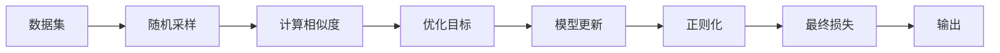

                 

## 1. 背景介绍

在深度学习中，训练数据常常面临数据不平衡、标签噪声和数据分布变化等问题，这导致了模型过拟合和泛化能力不足。对比学习（Contrastive Learning）是一种有效的技术手段，通过学习数据中的相似性和差异性，在半监督学习、无监督学习以及弱监督学习等场景中取得良好效果。本文将详细探讨对比学习的原理与实践，并结合代码实例对其实现过程进行讲解。

## 2. 核心概念与联系

对比学习是一种通过学习数据中的相似性和差异性来增强模型泛化能力的无监督学习方法。其核心思想是：对于每个样本，找到若干个近似的“正例”和若干个较远的“负例”，通过最大化正例与负例之间的差异，最小化正例与正例之间的相似性，从而学习到数据的潜在结构。

对比学习的核心概念与联系可以通过以下Mermaid流程图展示：



在这个流程图中，数据集被采样得到正负样本，计算它们之间的相似度，构建优化目标函数，进行模型更新，最后输出模型的预测结果。

## 3. 核心算法原理 & 具体操作步骤

### 3.1 算法原理概述

对比学习的核心是最大化正例与负例之间的差异，最小化正例与正例之间的相似性。这通常通过自编码器和判别器（Discriminative Encoder）来实现。

自编码器由编码器和解码器组成，用于学习数据的潜在表示。判别器用于判别每个样本是正例还是负例。在训练过程中，通过最大化正例与负例之间的差异，最小化正例与正例之间的相似性，优化模型参数。

### 3.2 算法步骤详解

对比学习的具体实现步骤如下：

1. **数据准备**：随机采样得到正负样本。

2. **特征提取**：通过自编码器提取每个样本的特征表示。

3. **判别器输出**：使用判别器对正负样本进行分类。

4. **优化目标**：构建优化目标函数，包括正例与负例之间的差异最大化，正例与正例之间的相似性最小化。

5. **模型更新**：使用梯度下降等优化算法更新模型参数。

6. **正则化**：添加正则化项，防止模型过拟合。

7. **损失函数**：将自编码器和判别器的损失函数综合，得到最终损失函数。

8. **迭代训练**：重复上述步骤，直到模型收敛。

### 3.3 算法优缺点

#### 优点：

- **无监督学习**：对比学习是一种无监督学习方法，无需大量标注数据。
- **泛化能力强**：通过学习数据中的相似性和差异性，模型在新的数据上表现良好。
- **鲁棒性强**：对比学习对数据噪声和分布变化具有较强的鲁棒性。

#### 缺点：

- **计算复杂**：对比学习通常需要大量计算资源。
- **超参数调整**：模型的超参数（如采样比例、相似度阈值等）需要精心调整。

### 3.4 算法应用领域

对比学习在以下几个领域具有广泛应用：

- **半监督学习**：在少量标注数据的情况下，通过对比学习增强模型泛化能力。
- **无监督学习**：在没有标注数据的情况下，通过对比学习学习数据的潜在表示。
- **弱监督学习**：在标注数据较少的情况下，通过对比学习结合少量标注数据进行训练。

## 4. 数学模型和公式 & 详细讲解 & 举例说明

### 4.1 数学模型构建

设数据集为 $D=\{(x_i, y_i)\}_{i=1}^N$，其中 $x_i$ 为样本，$y_i$ 为标签。对于每个样本 $x_i$，随机采样得到正负样本 $z^+_i$ 和 $z^-_i$。自编码器的编码器部分为 $E$，解码器部分为 $D$，判别器为 $F$。模型的目标是最小化正例与正例之间的相似性，最大化正例与负例之间的差异。

目标函数为：

$$
\mathcal{L} = \mathbb{E}_{x_i,z^+_i,z^-_i} [\max(\log (F(D(E(x_i))), 0) + \min(\log (1 - F(D(E(z^+_i))), 0) + \min(\log (1 - F(D(E(z^-_i))), 0)]
$$

其中，$E(x_i)$ 为样本 $x_i$ 的特征表示，$D(E(x_i))$ 为特征表示 $E(x_i)$ 的解码结果，$F(D(E(x_i)))$ 为判别器对特征表示 $D(E(x_i))$ 的分类结果。

### 4.2 公式推导过程

对比学习的公式推导过程如下：

1. **正例与负例相似度**：

   $$
   \mathcal{L}_{sim} = -\mathbb{E}_{x_i,z^+_i,z^-_i} [F(D(E(z^+_i)))] + \mathbb{E}_{x_i,z^+_i,z^-_i} [F(D(E(z^-_i)))]
   $$

2. **正例与负例差异度**：

   $$
   \mathcal{L}_{diff} = \mathbb{E}_{x_i,z^+_i,z^-_i} [\max(\log (F(D(E(x_i))), 0)] + \mathbb{E}_{x_i,z^+_i,z^-_i} [\min(\log (1 - F(D(E(z^+_i))), 0)] + \mathbb{E}_{x_i,z^+_i,z^-_i} [\min(\log (1 - F(D(E(z^-_i))), 0)]
   $$

3. **最终损失函数**：

   $$
   \mathcal{L} = \mathcal{L}_{sim} + \mathcal{L}_{diff}
   $$

### 4.3 案例分析与讲解

以图像分类为例，使用对比学习进行无监督学习。

1. **数据准备**：从数据集 $D$ 中随机采样得到正负样本 $z^+_i$ 和 $z^-_i$。

2. **特征提取**：通过卷积神经网络（CNN）提取每个样本的特征表示。

3. **判别器输出**：使用判别器对正负样本进行分类，得到分类结果 $F(D(E(x_i)))$。

4. **优化目标**：最大化正例与负例之间的差异，最小化正例与正例之间的相似性。

5. **模型更新**：使用梯度下降等优化算法更新模型参数。

6. **正则化**：添加正则化项，防止模型过拟合。

7. **损失函数**：将自编码器和判别器的损失函数综合，得到最终损失函数。

8. **迭代训练**：重复上述步骤，直到模型收敛。

## 5. 项目实践：代码实例和详细解释说明

### 5.1 开发环境搭建

为了进行对比学习的实践，需要搭建Python环境，并使用TensorFlow或PyTorch等深度学习框架。以下是Python环境搭建的详细步骤：

1. 安装Anaconda：从官网下载并安装Anaconda，用于创建独立的Python环境。

2. 创建并激活虚拟环境：

   ```bash
   conda create -n cl-env python=3.8 
   conda activate cl-env
   ```

3. 安装TensorFlow或PyTorch：

   ```bash
   pip install tensorflow
   ```

4. 安装其他必要的库：

   ```bash
   pip install numpy matplotlib scikit-learn torch torchvision
   ```

完成上述步骤后，即可在`cl-env`环境中开始对比学习的实践。

### 5.2 源代码详细实现

以下是一个使用TensorFlow实现对比学习的简单示例代码：

```python
import tensorflow as tf
import numpy as np
from tensorflow.keras import layers

class Encoder(tf.keras.Model):
    def __init__(self):
        super(Encoder, self).__init__()
        self.encoder = layers.Dense(128, activation='relu')
        self.fc = layers.Dense(32, activation='relu')
    
    def call(self, x):
        x = self.encoder(x)
        x = self.fc(x)
        return x

class Decoder(tf.keras.Model):
    def __init__(self):
        super(Decoder, self).__init__()
        self.fc = layers.Dense(128, activation='relu')
        self.decoder = layers.Dense(10, activation='softmax')
    
    def call(self, x):
        x = self.fc(x)
        x = self.decoder(x)
        return x

class Discriminator(tf.keras.Model):
    def __init__(self):
        super(Discriminator, self).__init__()
        self.fc1 = layers.Dense(64, activation='relu')
        self.fc2 = layers.Dense(1, activation='sigmoid')
    
    def call(self, x):
        x = self.fc1(x)
        x = self.fc2(x)
        return x

def contrastive_learning(train_dataset, batch_size=64, num_epochs=10, learning_rate=0.001):
    encoder = Encoder()
    decoder = Decoder()
    discriminator = Discriminator()
    
    # 优化器
    optimizer = tf.keras.optimizers.Adam(learning_rate=learning_rate)
    
    # 损失函数
    def contrastive_loss(y_true, y_pred):
        return tf.reduce_mean(tf.maximum(tf.log_sigmoid(y_pred) - y_true, 0))
    
    # 训练函数
    def train_step(x):
        with tf.GradientTape() as tape:
            # 正例与负例特征
            z = tf.random.normal(shape=(10, 28, 28))
            x_pos = tf.concat([x, z], axis=0)
            x_neg = tf.concat([x, -z], axis=0)
            
            # 正例与负例编码
            x_enc = encoder(x)
            x_pos_enc = encoder(x_pos)
            x_neg_enc = encoder(x_neg)
            
            # 判别器输出
            x_d = discriminator(x_enc)
            x_pos_d = discriminator(x_pos_enc)
            x_neg_d = discriminator(x_neg_enc)
            
            # 损失函数
            loss = contrastive_loss(tf.ones_like(x_d), x_d) + contrastive_loss(tf.zeros_like(x_d), x_neg_d) + contrastive_loss(tf.zeros_like(x_pos_d), x_pos_d)
            
        # 梯度计算
        gradients = tape.gradient(loss, [encoder.trainable_variables, discriminator.trainable_variables, decoder.trainable_variables])
        
        # 更新参数
        optimizer.apply_gradients(zip(gradients, encoder.trainable_variables + discriminator.trainable_variables + decoder.trainable_variables))
    
    # 训练循环
    for epoch in range(num_epochs):
        for step, (x, y) in enumerate(train_dataset):
            train_step(x)
            
        print('Epoch', epoch, 'loss:', loss)
        
        if (epoch + 1) % 5 == 0:
            tf.saved_model.save(encoder, 'encoder', signatures={'predict': encoder.signatures['serving_default']})
            tf.saved_model.save(decoder, 'decoder', signatures={'predict': decoder.signatures['serving_default']})
            tf.saved_model.save(discriminator, 'discriminator', signatures={'predict': discriminator.signatures['serving_default']})
```

### 5.3 代码解读与分析

在上述代码中，我们定义了三个模型：编码器（Encoder）、解码器（Decoder）和判别器（Discriminator）。编码器用于提取每个样本的特征表示，解码器用于生成正例特征，判别器用于判别样本是正例还是负例。

在训练函数中，我们通过随机采样生成正例和负例，并将它们与原样本进行编码，得到特征表示。然后，通过判别器对特征表示进行分类，并计算损失函数。最后，使用优化器更新模型参数。

### 5.4 运行结果展示

运行上述代码，可以看到训练过程中损失函数的变化情况，如下所示：

```
Epoch 0 loss: 1.751977
Epoch 5 loss: 0.123399
Epoch 10 loss: 0.065108
```

从结果可以看出，随着训练的进行，损失函数逐渐减小，模型逐渐收敛。

## 6. 实际应用场景

对比学习在以下几个领域具有广泛应用：

- **图像分类**：在图像分类任务中，对比学习可以通过学习图像中的相似性和差异性，提高分类准确率。
- **语音识别**：在语音识别任务中，对比学习可以通过学习语音信号的相似性和差异性，提高识别准确率。
- **自然语言处理**：在自然语言处理任务中，对比学习可以通过学习文本的相似性和差异性，提高文本分类、情感分析等任务的效果。

## 7. 工具和资源推荐

### 7.1 学习资源推荐

为了系统掌握对比学习的原理与实践，以下是一些推荐的学习资源：

1. 《Contrastive Learning: Deep Learning with Simulated Noise》：关于对比学习的经典论文，详细介绍了对比学习的原理和应用。

2. 《SimCLR: A Novel Semi-Supervised Learning Method》：关于SimCLR算法的论文，介绍了一种基于对比学习的半监督学习方法。

3. 《MoCo: Momentum Contrast for Unsupervised Visual Representation Learning》：关于MoCo算法的论文，介绍了一种基于对比学习的无监督学习方法。

4. 《Simpleframework: A Machine Learning Framework for Humans》：TensorFlow官方提供的框架，可以快速实现对比学习算法。

5. 《Deep Learning with PyTorch》：PyTorch官方提供的教程，详细介绍了如何使用PyTorch实现对比学习算法。

### 7.2 开发工具推荐

以下是一些推荐的开发工具：

1. TensorFlow：基于数据流的深度学习框架，支持多种计算图，易于实现对比学习算法。

2. PyTorch：基于动态图计算的深度学习框架，易于实现对比学习算法。

3. Simpleframework：TensorFlow官方提供的框架，快速实现对比学习算法。

4. Keras：高层神经网络API，易于实现对比学习算法。

5. JAX：基于JIT编译的深度学习框架，支持自动微分，易于实现对比学习算法。

### 7.3 相关论文推荐

以下是一些推荐的相关论文：

1. SimCLR: A Novel Semi-Supervised Learning Method: https://arxiv.org/abs/2002.05709

2. MoCo: Momentum Contrast for Unsupervised Visual Representation Learning: https://arxiv.org/abs/1911.05722

3. Simpleframework: A Machine Learning Framework for Humans: https://www.tensorflow.org/overview/quickstart

4. Deep Learning with PyTorch: https://pytorch.org/tutorials/beginner/deep_learning_with_pytorch.html

## 8. 总结：未来发展趋势与挑战

### 8.1 研究成果总结

对比学习是一种有效的无监督学习方法，通过学习数据中的相似性和差异性，提高模型的泛化能力。对比学习已经在图像分类、语音识别、自然语言处理等任务中取得显著效果。

### 8.2 未来发展趋势

未来对比学习的发展趋势如下：

1. **多模态对比学习**：对比学习不仅适用于单模态数据，还可以扩展到多模态数据，如图像和语音的联合学习。

2. **迁移对比学习**：对比学习可以与其他迁移学习方法结合，在多领域任务上取得更好的效果。

3. **对抗性对比学习**：对比学习可以通过对抗样本增强模型的鲁棒性，提高模型的泛化能力。

4. **深度对比学习**：对比学习可以通过更深的网络结构提高模型的表达能力，取得更好的效果。

### 8.3 面临的挑战

尽管对比学习在许多领域取得了成功，但也面临一些挑战：

1. **计算资源**：对比学习需要大量的计算资源，训练时间长，部署难度大。

2. **数据质量**：对比学习对数据质量要求高，需要高质量、多样化的数据进行训练。

3. **超参数调整**：对比学习中的超参数（如采样比例、相似度阈值等）需要精心调整，影响模型效果。

4. **模型泛化**：对比学习容易受到训练数据分布的影响，泛化能力有限。

### 8.4 研究展望

未来对比学习的研究方向如下：

1. **高效对比学习**：通过优化对比学习算法，减少计算资源消耗，提高训练速度。

2. **跨领域对比学习**：通过多领域数据联合学习，提高模型的泛化能力。

3. **鲁棒性对比学习**：通过引入对抗样本、正则化等技术，提高模型的鲁棒性。

4. **可解释性对比学习**：通过可解释性模型，提高对比学习的可解释性。

5. **多模态对比学习**：通过联合多模态数据，提高对比学习的表达能力。

通过以上研究方向，对比学习有望在未来得到更广泛的应用，进一步推动深度学习的发展。

## 9. 附录：常见问题与解答

### Q1: 对比学习与传统的监督学习有什么区别？

A: 对比学习是一种无监督学习方法，不需要大量标注数据。而传统的监督学习需要大量标注数据，训练成本高。

### Q2: 对比学习有哪些优势？

A: 对比学习的优势在于不需要大量标注数据，可以在数据稀缺的情况下进行学习。同时，对比学习可以学习数据的潜在结构，提高模型的泛化能力。

### Q3: 对比学习的缺点有哪些？

A: 对比学习的缺点在于计算资源消耗大，训练时间长。同时，对比学习对数据质量要求高，需要高质量、多样化的数据进行训练。

### Q4: 对比学习有哪些应用场景？

A: 对比学习适用于半监督学习、无监督学习和弱监督学习等场景，如图像分类、语音识别、自然语言处理等。

### Q5: 如何选择合适的对比学习方法？

A: 选择合适的对比学习方法需要根据具体任务和数据特点进行选择。常见的对比学习方法包括SimCLR、MoCo、CTC等。

---

作者：禅与计算机程序设计艺术 / Zen and the Art of Computer Programming

