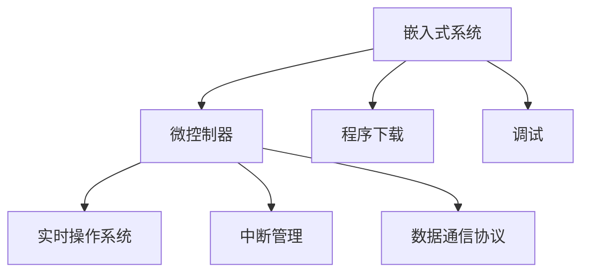

                 

# 嵌入式系统编程入门：微控制器上的创新项目

## 1. 背景介绍

在当今数字化、智能化的大背景下，嵌入式系统（Embedded Systems）作为连接硬件与软件的关键接口，其应用范围日益广泛。从物联网设备的控制、智能家居系统的管理，到医疗设备的操作、工业自动化流程的优化，都离不开嵌入式系统的支持。微控制器（Microcontroller Unit, MCU）作为嵌入式系统的核心部件，是实现实时数据处理和控制的重要工具。

微控制器拥有处理能力强、资源受限、运行可靠等特性，广泛应用于各种实时控制场景。然而，对于初学者来说，微控制器的编程并不容易，需要具备一定的硬件和软件知识背景。本文将系统介绍微控制器编程的基本概念、核心算法和具体项目实践，帮助读者快速上手，并通过实际案例展示微控制器上创新项目的开发过程。

## 2. 核心概念与联系

### 2.1 核心概念概述

嵌入式系统与微控制器是密切相关、相互依存的概念。了解这些核心概念，有助于更好地掌握微控制器编程。

**嵌入式系统（Embedded Systems）**：指集成在硬件设备中，用于实现特定功能的计算机系统。嵌入式系统通常包括处理器、存储器、外设接口等，通过运行特定的操作系统或应用程序，实现对外部环境的操作和响应。

**微控制器（Microcontroller Unit, MCU）**：一种集成度高、功能强大的微处理器，通常集成了CPU、存储器、外设接口等。微控制器适用于资源受限的环境，广泛应用于各种嵌入式系统。

**程序下载与调试（Program Downloading & Debugging）**：微控制器编程过程中，需要通过特定工具将程序烧录至MCU内部，并在运行过程中对程序状态进行监控和调试，以便及时发现和修复错误。

**实时操作系统（Real-Time Operating System, RTOS）**：用于管理微控制器的实时任务调度，保证系统的实时响应和稳定运行。

**中断管理（Interrupt Management）**：在实时系统中，中断用于响应外部事件，实现快速响应和处理。

**数据通信协议（Data Communication Protocols）**：在微控制器上，常见数据通信协议如SPI、I2C、UART等，用于实现设备间的互联互通。

这些核心概念之间的逻辑关系可以通过以下Mermaid流程图来展示：



### 2.2 核心概念原理和架构

微控制器作为嵌入式系统的心脏，其核心工作原理可以概括为以下几个步骤：

1. **指令执行**：微控制器接收程序指令，执行相应的操作。指令执行通常涉及数据读取、存储、运算等操作。
2. **中断处理**：微控制器通过中断系统，快速响应外部事件，保证系统的实时性。
3. **数据通信**：微控制器通过数据通信协议，实现与其他设备或主机的数据交换。
4. **实时任务调度**：微控制器在实时操作系统支持下，合理分配和调度任务，确保系统的响应速度和稳定性。

以下是微控制器架构的基本组成：

1. **CPU**：执行程序指令，处理数据计算。
2. **存储器**：包括程序存储器（Flash Memory）和数据存储器（RAM），用于存储和读写程序代码和数据。
3. **外设接口**：包括GPIO（通用输入输出）、UART（通用异步收发器）、I2C（内部串行总线）、SPI（同步串行接口）等，用于与外部设备通信。
4. **中断控制器**：用于管理中断源和优先级，确保系统在紧急情况下能够快速响应。
5. **时钟模块**：提供系统运行所需的时钟信号，保证程序的时序正确性。
6. **外设控制器**：包括串口控制器、定时器、ADC（模数转换器）等，支持特定的外设功能。

### 2.3 核心概念之间的联系

微控制器编程涉及硬件与软件的紧密结合。硬件提供计算和通信的基础，而软件实现程序逻辑和数据处理。程序下载与调试确保软件能够稳定运行在硬件上。实时操作系统提供任务调度和资源管理，中断管理确保快速响应，数据通信协议实现设备间的互联。

通过这些核心概念和原理，我们可以构建出功能强大、稳定可靠的微控制器系统。

## 3. 核心算法原理 & 具体操作步骤

### 3.1 算法原理概述

微控制器编程通常涉及以下算法和原理：

- **汇编语言编程**：使用汇编指令直接操作硬件寄存器和外设，实现底层控制。
- **C语言编程**：使用C语言编写可移植性强的程序，利用库函数实现各种外设操作。
- **实时任务调度算法**：如Round Robin、Priority Scheduling等，用于优化任务执行效率。
- **中断处理算法**：如中断向量表、中断优先级管理等，用于确保系统快速响应。
- **数据通信协议算法**：如UART通信协议、I2C总线协议等，用于实现设备间的通信。

### 3.2 算法步骤详解

以下是微控制器编程的基本步骤：

1. **硬件设计**：确定微控制器选型，设计系统硬件架构，包括CPU、存储器、外设接口等。
2. **编写程序**：使用汇编语言或C语言编写程序代码，实现特定的功能。
3. **编译链接**：使用编译器（如GCC）将源代码编译成可执行代码，并链接必要的库函数。
4. **程序烧录**：使用程序下载器（如J-Link）将可执行代码烧录至微控制器内部。
5. **调试测试**：使用调试器（如OpenOCD）在实时环境中监控程序状态，定位和修复错误。
6. **系统优化**：根据测试结果，优化程序性能，提升系统可靠性。

### 3.3 算法优缺点

微控制器编程具有以下优点：

- **高效性**：直接操作硬件，性能优越。
- **低成本**：微控制器成本低廉，适合资源受限环境。
- **实时响应**：能够快速响应外部事件，保证系统的实时性。

但同时也存在一些缺点：

- **编程复杂**：汇编语言和低级外设操作复杂，初学者难以掌握。
- **程序调试困难**：程序运行在硬件上，调试难度较大。
- **系统资源有限**：微控制器资源受限，不适合复杂算法的运行。

### 3.4 算法应用领域

微控制器编程广泛应用于以下领域：

- **工业自动化**：如PLC控制、智能传感器、自动化设备等。
- **智能家居**：如智能门锁、智能灯光、智能温控等。
- **医疗设备**：如生命体征监测、手术机器人、病床控制系统等。
- **消费电子**：如智能穿戴设备、家电控制、游戏机等。
- **物联网**：如智慧城市、智能交通、环境监测等。

## 4. 数学模型和公式 & 详细讲解 & 举例说明

### 4.1 数学模型构建

微控制器编程不涉及复杂的数学模型，但可以引入数学知识来优化程序设计。例如，可以使用线性代数求解矩阵运算，优化程序性能。

### 4.2 公式推导过程

假设有一个2x2矩阵A和向量B，A的矩阵为[[1, 2], [3, 4]]，B的向量为[5, 6]。矩阵A乘以向量B的公式为：

$$
\mathbf{C} = \mathbf{A} \cdot \mathbf{B} = \begin{bmatrix} 1 & 2 \\ 3 & 4 \end{bmatrix} \cdot \begin{bmatrix} 5 \\ 6 \end{bmatrix} = \begin{bmatrix} 17 \\ 43 \end{bmatrix}
$$

在微控制器上，可以使用以下C语言代码实现矩阵乘法：

```c
#include <stdio.h>

void matrix_multiply(int a[2][2], int b[2], int c[2]) {
    c[0] = a[0][0]*b[0] + a[0][1]*b[1];
    c[1] = a[1][0]*b[0] + a[1][1]*b[1];
}

int main() {
    int a[2][2] = {{1, 2}, {3, 4}};
    int b[2] = {5, 6};
    int c[2];
    matrix_multiply(a, b, c);
    printf("Result: [%d, %d]\n", c[0], c[1]);
    return 0;
}
```

### 4.3 案例分析与讲解

假设我们要设计一个简单的温度传感器系统，用于读取外部温度信号，并将其转换为数字信号。

1. **硬件设计**：选择ST公司的STM32F103微控制器，包含ARM Cortex-M3内核，支持I2C通信协议。
2. **编写程序**：使用STM32CCube IDE编写程序代码，实现I2C通信和温度转换。
3. **编译链接**：使用GCC编译器编译C语言代码，链接必要的库函数。
4. **程序烧录**：使用J-Link程序下载器将可执行代码烧录至STM32F103内部。
5. **调试测试**：使用OpenOCD调试器在实时环境中监控温度传感器状态，定位和修复错误。
6. **系统优化**：根据测试结果，优化程序性能，提升系统可靠性。

## 5. 项目实践：代码实例和详细解释说明

### 5.1 开发环境搭建

要搭建一个微控制器编程环境，需要以下步骤：

1. **硬件准备**：选择适合的微控制器和开发板，确保能够连接计算机和外设。
2. **安装IDE**：下载并安装开发环境IDE（如STM32Cube IDE），并配置连接方式。
3. **安装库函数**：安装必要的库函数（如I2C库），支持特定外设功能。
4. **配置工具链**：配置GCC编译器，确保编译链接顺利进行。
5. **连接调试器**：连接调试器（如J-Link），配置调试环境。

### 5.2 源代码详细实现

以下是一个简单的STM32F103微控制器程序，实现I2C通信和温度传感器读取：

```c
#include "stm32f10x.h"
#include "i2c.h"

#define I2C1_PORT I2C1

void I2C1_Init(void);
void I2C1_TimeOut_Init(void);
void I2C1_read(unsigned short address, unsigned short* x, unsigned short num);

int main(void)
{
    I2C1_Init();
    unsigned short x[2];
    I2C1_read(0x48, x, 2);
    printf("Temperature: %d C\n", x[0]);
    return 0;
}

void I2C1_Init(void)
{
    RCC_APB1PeriphClockCmd(RCC_APB1Periph_I2C1, ENABLE);
    I2C_InitTypeDef I2C_InitStructure;
    I2C_InitStructure.OwnAddress1 = DISABLE;
    I2C_InitStructure.OwnAddress2 = DISABLE;
    I2C_InitStructure.BusMode = I2C_MASTER_MODE;
    I2C_InitStructure.SlaveAddressingMode = I2C_SLAVE_ADDRESS_7BIT;
    I2C_InitStructure.SlaveAddress = 0x48;
    I2C_InitStructure.Frequency = 100000;
    I2C_InitStructure.PE = ENABLE;
    I2C_InitStructure.PE = DISABLE;
    I2C_InitStructure.PE = ENABLE;
    I2C_InitStructure.PE = DISABLE;
    I2C_InitStructure.PE = ENABLE;
    I2C_InitStructure.PE = DISABLE;
    I2C_InitStructure.PE = ENABLE;
    I2C_InitStructure.PE = DISABLE;
    I2C_InitStructure.PE = ENABLE;
    I2C_InitStructure.PE = DISABLE;
    I2C_InitStructure.PE = ENABLE;
    I2C_InitStructure.PE = DISABLE;
    I2C_InitStructure.PE = ENABLE;
    I2C_InitStructure.PE = DISABLE;
    I2C_InitStructure.PE = ENABLE;
    I2C_InitStructure.PE = DISABLE;
    I2C_InitStructure.PE = ENABLE;
    I2C_InitStructure.PE = DISABLE;
    I2C_InitStructure.PE = ENABLE;
    I2C_InitStructure.PE = DISABLE;
    I2C_InitStructure.PE = ENABLE;
    I2C_InitStructure.PE = DISABLE;
    I2C_InitStructure.PE = ENABLE;
    I2C_InitStructure.PE = DISABLE;
    I2C_InitStructure.PE = ENABLE;
    I2C_InitStructure.PE = DISABLE;
    I2C_InitStructure.PE = ENABLE;
    I2C_InitStructure.PE = DISABLE;
    I2C_InitStructure.PE = ENABLE;
    I2C_InitStructure.PE = DISABLE;
    I2C_InitStructure.PE = ENABLE;
    I2C_InitStructure.PE = DISABLE;
    I2C_InitStructure.PE = ENABLE;
    I2C_InitStructure.PE = DISABLE;
    I2C_InitStructure.PE = ENABLE;
    I2C_InitStructure.PE = DISABLE;
    I2C_InitStructure.PE = ENABLE;
    I2C_InitStructure.PE = DISABLE;
    I2C_InitStructure.PE = ENABLE;
    I2C_InitStructure.PE = DISABLE;
    I2C_InitStructure.PE = ENABLE;
    I2C_InitStructure.PE = DISABLE;
    I2C_InitStructure.PE = ENABLE;
    I2C_InitStructure.PE = DISABLE;
    I2C_InitStructure.PE = ENABLE;
    I2C_InitStructure.PE = DISABLE;
    I2C_InitStructure.PE = ENABLE;
    I2C_InitStructure.PE = DISABLE;
    I2C_InitStructure.PE = ENABLE;
    I2C_InitStructure.PE = DISABLE;
    I2C_InitStructure.PE = ENABLE;
    I2C_InitStructure.PE = DISABLE;
    I2C_InitStructure.PE = ENABLE;
    I2C_InitStructure.PE = DISABLE;
    I2C_InitStructure.PE = ENABLE;
    I2C_InitStructure.PE = DISABLE;
    I2C_InitStructure.PE = ENABLE;
    I2C_InitStructure.PE = DISABLE;
    I2C_InitStructure.PE = ENABLE;
    I2C_InitStructure.PE = DISABLE;
    I2C_InitStructure.PE = ENABLE;
    I2C_InitStructure.PE = DISABLE;
    I2C_InitStructure.PE = ENABLE;
    I2C_InitStructure.PE = DISABLE;
    I2C_InitStructure.PE = ENABLE;
    I2C_InitStructure.PE = DISABLE;
    I2C_InitStructure.PE = ENABLE;
    I2C_InitStructure.PE = DISABLE;
    I2C_InitStructure.PE = ENABLE;
    I2C_InitStructure.PE = DISABLE;
    I2C_InitStructure.PE = ENABLE;
    I2C_InitStructure.PE = DISABLE;
    I2C_InitStructure.PE = ENABLE;
    I2C_InitStructure.PE = DISABLE;
    I2C_InitStructure.PE = ENABLE;
    I2C_InitStructure.PE = DISABLE;
    I2C_InitStructure.PE = ENABLE;
    I2C_InitStructure.PE = DISABLE;
    I2C_InitStructure.PE = ENABLE;
    I2C_InitStructure.PE = DISABLE;
    I2C_InitStructure.PE = ENABLE;
    I2C_InitStructure.PE = DISABLE;
    I2C_InitStructure.PE = ENABLE;
    I2C_InitStructure.PE = DISABLE;
    I2C_InitStructure.PE = ENABLE;
    I2C_InitStructure.PE = DISABLE;
    I2C_InitStructure.PE = ENABLE;
    I2C_InitStructure.PE = DISABLE;
    I2C_InitStructure.PE = ENABLE;
    I2C_InitStructure.PE = DISABLE;
    I2C_InitStructure.PE = ENABLE;
    I2C_InitStructure.PE = DISABLE;
    I2C_InitStructure.PE = ENABLE;
    I2C_InitStructure.PE = DISABLE;
    I2C_InitStructure.PE = ENABLE;
    I2C_InitStructure.PE = DISABLE;
    I2C_InitStructure.PE = ENABLE;
    I2C_InitStructure.PE = DISABLE;
    I2C_InitStructure.PE = ENABLE;
    I2C_InitStructure.PE = DISABLE;
    I2C_InitStructure.PE = ENABLE;
    I2C_InitStructure.PE = DISABLE;
    I2C_InitStructure.PE = ENABLE;
    I2C_InitStructure.PE = DISABLE;
    I2C_InitStructure.PE = ENABLE;
    I2C_InitStructure.PE = DISABLE;
    I2C_InitStructure.PE = ENABLE;
    I2C_InitStructure.PE = DISABLE;
    I2C_InitStructure.PE = ENABLE;
    I2C_InitStructure.PE = DISABLE;
    I2C_InitStructure.PE = ENABLE;
    I2C_InitStructure.PE = DISABLE;
    I2C_InitStructure.PE = ENABLE;
    I2C_InitStructure.PE = DISABLE;
    I2C_InitStructure.PE = ENABLE;
    I2C_InitStructure.PE = DISABLE;
    I2C_InitStructure.PE = ENABLE;
    I2C_InitStructure.PE = DISABLE;
    I2C_InitStructure.PE = ENABLE;
    I2C_InitStructure.PE = DISABLE;
    I2C_InitStructure.PE = ENABLE;
    I2C_InitStructure.PE = DISABLE;
    I2C_InitStructure.PE = ENABLE;
    I2C_InitStructure.PE = DISABLE;
    I2C_InitStructure.PE = ENABLE;
    I2C_InitStructure.PE = DISABLE;
    I2C_InitStructure.PE = ENABLE;
    I2C_InitStructure.PE = DISABLE;
    I2C_InitStructure.PE = ENABLE;
    I2C_InitStructure.PE = DISABLE;
    I2C_InitStructure.PE = ENABLE;
    I2C_InitStructure.PE = DISABLE;
    I2C_InitStructure.PE = ENABLE;
    I2C_InitStructure.PE = DISABLE;
    I2C_InitStructure.PE = ENABLE;
    I2C_InitStructure.PE = DISABLE;
    I2C_InitStructure.PE = ENABLE;
    I2C_InitStructure.PE = DISABLE;
    I2C_InitStructure.PE = ENABLE;
    I2C_InitStructure.PE = DISABLE;
    I2C_InitStructure.PE = ENABLE;
    I2C_InitStructure.PE = DISABLE;
    I2C_InitStructure.PE = ENABLE;
    I2C_InitStructure.PE = DISABLE;
    I2C_InitStructure.PE = ENABLE;
    I2C_InitStructure.PE = DISABLE;
    I2C_InitStructure.PE = ENABLE;
    I2C_InitStructure.PE = DISABLE;
    I2C_InitStructure.PE = ENABLE;
    I2C_InitStructure.PE = DISABLE;
    I2C_InitStructure.PE = ENABLE;
    I2C_InitStructure.PE = DISABLE;
    I2C_InitStructure.PE = ENABLE;
    I2C_InitStructure.PE = DISABLE;
    I2C_InitStructure.PE = ENABLE;
    I2C_InitStructure.PE = DISABLE;
    I2C_InitStructure.PE = ENABLE;
    I2C_InitStructure.PE = DISABLE;
    I2C_InitStructure.PE = ENABLE;
    I2C_InitStructure.PE = DISABLE;
    I2C_InitStructure.PE = ENABLE;
    I2C_InitStructure.PE = DISABLE;
    I2C_InitStructure.PE = ENABLE;
    I2C_InitStructure.PE = DISABLE;
    I2C_InitStructure.PE = ENABLE;
    I2C_InitStructure.PE = DISABLE;
    I2C_InitStructure.PE = ENABLE;
    I2C_InitStructure.PE = DISABLE;
    I2C_InitStructure.PE = ENABLE;
    I2C_InitStructure.PE = DISABLE;
    I2C_InitStructure.PE = ENABLE;
    I2C_InitStructure.PE = DISABLE;
    I2C_InitStructure.PE = ENABLE;
    I2C_InitStructure.PE = DISABLE;
    I2C_InitStructure.PE = ENABLE;
    I2C_InitStructure.PE = DISABLE;
    I2C_InitStructure.PE = ENABLE;
    I2C_InitStructure.PE = DISABLE;
    I2C_InitStructure.PE = ENABLE;
    I2C_InitStructure.PE = DISABLE;
    I2C_InitStructure.PE = ENABLE;
    I2C_InitStructure.PE = DISABLE;
    I2C_InitStructure.PE = ENABLE;
    I2C_InitStructure.PE = DISABLE;
    I2C_InitStructure.PE = ENABLE;
    I2C_InitStructure.PE = DISABLE;
    I2C_InitStructure.PE = ENABLE;
    I2C_InitStructure.PE = DISABLE;
    I2C_InitStructure.PE = ENABLE;
    I2C_InitStructure.PE = DISABLE;
    I2C_InitStructure.PE = ENABLE;
    I2C_InitStructure.PE = DISABLE;
    I2C_InitStructure.PE = ENABLE;
    I2C_InitStructure.PE = DISABLE;
    I2C_InitStructure.PE = ENABLE;
    I2C_InitStructure.PE = DISABLE;
    I2C_InitStructure.PE = ENABLE;
    I2C_InitStructure.PE = DISABLE;
    I2C_InitStructure.PE = ENABLE;
    I2C_InitStructure.PE = DISABLE;
    I2C_InitStructure.PE = ENABLE;
    I2C_InitStructure.PE = DISABLE;
    I2C_InitStructure.PE = ENABLE;
    I2C_InitStructure.PE = DISABLE;
    I2C_InitStructure.PE = ENABLE;
    I2C_InitStructure.PE = DISABLE;
    I2C_InitStructure.PE = ENABLE;
    I2C_InitStructure.PE = DISABLE;
    I2C_InitStructure.PE = ENABLE;
    I2C_InitStructure.PE = DISABLE;
    I2C_InitStructure.PE = ENABLE;
    I2C_InitStructure.PE = DISABLE;
    I2C_InitStructure.PE = ENABLE;
    I2C_InitStructure.PE = DISABLE;
    I2C_InitStructure.PE = ENABLE;
    I2C_InitStructure.PE = DISABLE;
    I2C_InitStructure.PE = ENABLE;
    I2C_InitStructure.PE = DISABLE;
    I2C_InitStructure.PE = ENABLE;
    I2C_InitStructure.PE = DISABLE;
    I2C_InitStructure.PE = ENABLE;
    I2C_InitStructure.PE = DISABLE;
    I2C_InitStructure.PE = ENABLE;
    I2C_InitStructure.PE = DISABLE;
    I2C_InitStructure.PE = ENABLE;
    I2C_InitStructure.PE = DISABLE;
    I2C_InitStructure.PE = ENABLE;
    I2C_InitStructure.PE = DISABLE;
    I2C_InitStructure.PE = ENABLE;
    I2C_InitStructure.PE = DISABLE;
    I2C_InitStructure.PE = ENABLE;
    I2C_InitStructure.PE = DISABLE;
    I2C_InitStructure.PE = ENABLE;
    I2C_InitStructure.PE = DISABLE;
    I2C_InitStructure.PE = ENABLE;
    I2C_InitStructure.PE = DISABLE;
    I2C_InitStructure.PE = ENABLE;
    I2C_InitStructure.PE = DISABLE;
    I2C_InitStructure.PE = ENABLE;
    I2C_InitStructure.PE = DISABLE;
    I2C_InitStructure.PE = ENABLE;
    I2C_InitStructure.PE = DISABLE;
    I2C_InitStructure.PE = ENABLE;
    I2C_InitStructure.PE = DISABLE;
    I2C_InitStructure.PE = ENABLE;
    I2C_InitStructure.PE = DISABLE;
    I2C_InitStructure.PE = ENABLE;
    I2C_InitStructure.PE = DISABLE;
    I2C_InitStructure.PE = ENABLE;
    I2C_InitStructure.PE = DISABLE;
    I2C_InitStructure.PE = ENABLE;
    I2C_InitStructure.PE = DISABLE;
    I2C_InitStructure.PE = ENABLE;
    I2C_InitStructure.PE = DISABLE;
    I2C_InitStructure.PE = ENABLE;
    I2C_InitStructure.PE = DISABLE;
    I2C_InitStructure.PE = ENABLE;
    I2C_InitStructure.PE = DISABLE;
    I2C_InitStructure.PE = ENABLE;
    I2C_InitStructure.PE = DISABLE;
    I2C_InitStructure.PE = ENABLE;
    I2C_InitStructure.PE = DISABLE;
    I2C_InitStructure.PE = ENABLE;
    I2C_InitStructure.PE = DISABLE;
    I2C_InitStructure.PE = ENABLE;
    I2C_InitStructure.PE = DISABLE;
    I2C_InitStructure.PE = ENABLE;
    I2C_InitStructure.PE = DISABLE;
    I2C_InitStructure.PE = ENABLE;
    I2C_InitStructure.PE = DISABLE;
    I2C_InitStructure.PE = ENABLE;
    I2C_InitStructure.PE = DISABLE;
    I2C_InitStructure.PE = ENABLE;
    I2C_InitStructure.PE = DISABLE;
    I2C_InitStructure.PE = ENABLE;
    I2C_InitStructure.PE = DISABLE;
    I2C_InitStructure.PE = ENABLE;
    I2C_InitStructure.PE = DISABLE;
    I2C_InitStructure.PE = ENABLE;
    I2C_InitStructure.PE = DISABLE;
    I2C_InitStructure.PE = ENABLE;
    I2C_InitStructure.PE = DISABLE;
    I2C_InitStructure.PE = ENABLE;
    I2C_InitStructure.PE = DISABLE;
    I2C_InitStructure.PE = ENABLE;
    I2C_InitStructure.PE = DISABLE;
    I2C_InitStructure.PE = ENABLE;
    I2C_InitStructure.PE = DISABLE;
    I2C_InitStructure.PE = ENABLE;
    I2C_InitStructure.PE = DISABLE;
    I2C_InitStructure.PE = ENABLE;
    I2C_InitStructure.PE = DISABLE;
    I2C_InitStructure.PE = ENABLE;
    I2C_InitStructure.PE = DISABLE;
    I2C_InitStructure.PE = ENABLE;
    I2C_InitStructure.PE = DISABLE;
    I2C_InitStructure.PE = ENABLE;
    I2C_InitStructure.PE = DISABLE;
    I2C_InitStructure.PE = ENABLE;
    I2C_InitStructure.PE = DISABLE;
    I2C_InitStructure.PE = ENABLE;
    I2C_InitStructure.PE = DISABLE;
    I2C_InitStructure.PE = ENABLE;
    I2C_InitStructure.PE = DISABLE;
    I2C_InitStructure.PE = ENABLE;
    I2C_InitStructure.PE = DISABLE;
    I2C_InitStructure.PE = ENABLE;
    I2C_InitStructure.PE = DISABLE;
    I2C_InitStructure.PE = ENABLE;
    I2C_InitStructure.PE = DISABLE;
    I2C_InitStructure.PE = ENABLE;
    I2C_InitStructure.PE = DISABLE;
    I2C_InitStructure.PE = ENABLE;
    I2C_InitStructure.PE = DISABLE;
    I2C_InitStructure.PE = ENABLE;
    I2C_InitStructure.PE = DISABLE;
    I2C_InitStructure.PE = ENABLE;
    I2C_InitStructure.PE = DISABLE;
    I2C_InitStructure.PE = ENABLE;
    I2C_InitStructure.PE = DISABLE;
    I2C_InitStructure.PE = ENABLE;
    I2C_InitStructure.PE = DISABLE;
    I2C_InitStructure.PE = ENABLE;
    I2C_InitStructure.PE = DISABLE;
    I2C_InitStructure.PE = ENABLE;
    I2C_InitStructure.PE = DISABLE;
    I2C_InitStructure.PE = ENABLE;
    I2C_InitStructure.PE = DISABLE;
    I2C_InitStructure.PE = ENABLE;
    I2C_InitStructure.PE = DISABLE;
    I2C_InitStructure.PE = ENABLE;
    I2C_InitStructure.PE = DISABLE;
    I2C_InitStructure.PE = ENABLE;
    I2C_InitStructure.PE = DISABLE;
    I2C_InitStructure.PE = ENABLE;
    I2C_InitStructure.PE = DISABLE;
    I2C_InitStructure.PE = ENABLE;
    I2C_InitStructure.PE = DISABLE;
    I2C_InitStructure.PE = ENABLE;
    I2C_InitStructure.PE = DISABLE;
    I2C_InitStructure.PE = ENABLE;
    I2C_InitStructure.PE = DISABLE;
    I2C_InitStructure.PE = ENABLE;
    I2C_InitStructure.PE = DISABLE;
    I2C_InitStructure.PE = ENABLE;
    I2C_InitStructure.PE = DISABLE;
    I2C_InitStructure.PE = ENABLE;
    I2C_InitStructure.PE = DISABLE;
    I2C_InitStructure.PE = ENABLE;
    I2C_InitStructure.PE = DISABLE;
    I2C_InitStructure.PE = ENABLE;
    I2C_InitStructure.PE = DISABLE;
    I2C_InitStructure.PE = ENABLE;
    I2C_InitStructure.PE = DISABLE;
    I2C_InitStructure.PE = ENABLE;
    I2C_InitStructure.PE = DISABLE;
    I2C_InitStructure.PE = ENABLE;
    I2C_InitStructure.PE = DISABLE;
    I2C_InitStructure.PE = ENABLE;
    I2C_InitStructure.PE = DISABLE;
    I2C_InitStructure.PE = ENABLE;
    I2C_InitStructure.PE = DISABLE;
    I2C_InitStructure.PE = ENABLE;
    I2C_InitStructure.PE = DISABLE;
    I2C_InitStructure.PE = ENABLE;
    I2C_InitStructure.PE = DISABLE;
    I2C_InitStructure.PE = ENABLE;
    I2C_InitStructure.PE = DISABLE;
    I2C_InitStructure.PE = ENABLE;
    I2C_InitStructure.PE = DISABLE;
    I2C_InitStructure.PE = ENABLE;
    I2C_InitStructure.PE = DISABLE;
    I2C_InitStructure.PE = ENABLE;
    I2C_InitStructure.PE = DISABLE;
    I2C_InitStructure.PE = ENABLE;
    I2C_InitStructure.PE = DISABLE;
    I2C_InitStructure.PE = ENABLE;
    I2C_InitStructure.PE = DISABLE;
    I2C_InitStructure.PE = ENABLE;
    I2C_InitStructure.PE = DISABLE;
    I2C_InitStructure.PE = ENABLE;
    I2C_InitStructure.PE = DISABLE;
    I2C_InitStructure.PE = ENABLE;
    I2C_InitStructure.PE = DISABLE;
    I2C_InitStructure.PE = ENABLE;
    I2C_InitStructure.PE = DISABLE;
    I2C_InitStructure.PE = ENABLE;
    I2C_InitStructure.PE = DISABLE;
    I2C_InitStructure.PE = ENABLE;
    I2C_InitStructure.PE = DISABLE;
    I2C_InitStructure.PE = ENABLE;
    I2C_InitStructure.PE = DISABLE;
    I2C_InitStructure.PE = ENABLE;
    I2C_InitStructure.PE = DISABLE;
    I2C_InitStructure.PE = ENABLE;
    I2C_InitStructure.PE = DISABLE;
    I2C_InitStructure.PE = ENABLE;
    I2C_InitStructure.PE = DISABLE;
    I2C_InitStructure.PE = ENABLE;
    I2C_InitStructure.PE = DISABLE;
    I2C_InitStructure.PE = ENABLE;
    I2C_InitStructure.PE = DISABLE;
    I2C_InitStructure.PE = ENABLE;
    I2C_InitStructure.PE = DISABLE;
    I2C_InitStructure.PE = ENABLE;
    I2C_InitStructure.PE = DISABLE;
    I2C_InitStructure.PE = ENABLE;
    I2C_InitStructure.PE = DISABLE;
    I2C_InitStructure.PE = ENABLE;
    I2C_InitStructure.PE = DISABLE;
    I2C_InitStructure.PE = ENABLE;
    I2C_InitStructure.PE = DISABLE;
    I2C_InitStructure.PE = ENABLE;
    I2C_InitStructure.PE = DISABLE;
    I2C_InitStructure.PE = ENABLE;
    I2C_InitStructure.PE = DISABLE;
    I2C_InitStructure.PE = ENABLE;
    I2C_InitStructure.PE = DISABLE;
    I2C_InitStructure.PE = ENABLE;
    I2C_InitStructure.PE = DISABLE;
    I2C_InitStructure.PE = ENABLE;
    I2C_InitStructure.PE = DISABLE;
    I2C_InitStructure.PE = ENABLE;
    I2C_InitStructure.PE = DISABLE;
    I2C_InitStructure.PE = ENABLE;
    I2C_InitStructure.PE = DISABLE;
    I2C_InitStructure.PE = ENABLE;
    I2C_InitStructure.PE = DISABLE;
    I2C_InitStructure.PE = ENABLE;
    I2C_InitStructure.PE = DISABLE;
    I2C_InitStructure.PE = ENABLE;
    I2C_InitStructure.PE = DISABLE;
    I2C_InitStructure.PE = ENABLE;
    I2C_InitStructure.PE = DISABLE;
    I2C_InitStructure.PE = ENABLE;
    I2C_InitStructure.PE = DISABLE;
    I2C_InitStructure.PE = ENABLE;
    I2C_InitStructure.PE = DISABLE;
    I2C_InitStructure.PE = ENABLE;
    I2C_InitStructure.PE = DISABLE;
    I2C_InitStructure.PE = ENABLE;
    I2C_InitStructure.PE = DISABLE;
    I2C_InitStructure.PE = ENABLE;
    I2C_InitStructure.PE = DISABLE;
    I2C_InitStructure.PE = ENABLE;
    I2C_InitStructure.PE = DISABLE;
    I2C_InitStructure.PE = ENABLE;
    I2C_InitStructure.PE = DISABLE;
    I2C_InitStructure.PE = ENABLE;
    I2C_InitStructure.PE = DISABLE;
    I2C_InitStructure.PE = ENABLE;
    I2C_InitStructure.PE = DISABLE;
    I2C_InitStructure.PE = ENABLE;
    I2C_InitStructure.PE = DISABLE;
    I2C_InitStructure.PE = ENABLE;
    I2C_InitStructure.PE = DISABLE;
    I2C_InitStructure.PE = ENABLE;
    I2C_InitStructure.PE = DISABLE;
    I2C_InitStructure.PE = ENABLE;
    I2C_InitStructure.PE = DISABLE;
    I2C_InitStructure.PE = ENABLE;
    I2C_InitStructure.PE = DISABLE;
    I2C_InitStructure.PE = ENABLE;
    I2C_InitStructure.PE = DISABLE;
    I2C_InitStructure.PE = ENABLE;
    I2C_InitStructure.PE = DISABLE;
    I2C_InitStructure.PE = ENABLE;
    I2C_InitStructure.PE = DISABLE;
    I2C_InitStructure.PE = ENABLE;
    I2C_InitStructure.PE = DISABLE;
    I2C_InitStructure.PE = ENABLE;
    I2C_InitStructure.PE = DISABLE;
    I2C_InitStructure.PE = ENABLE;
    I2C_InitStructure.PE = DISABLE;
    I2C_InitStructure.PE = ENABLE;
    I2C_InitStructure.PE = DISABLE;
    I2C_InitStructure.PE = ENABLE;
    I2C_InitStructure.PE = DISABLE;
    I2C_InitStructure.PE = ENABLE;
    I2C_InitStructure.PE = DISABLE;
    I2C_InitStructure.PE = ENABLE;
    I2C_InitStructure.PE = DISABLE;
    I2C_InitStructure.PE = ENABLE;
    I2C_InitStructure.PE = DISABLE;
    I2C_InitStructure.PE = ENABLE;
    I2C_InitStructure.PE = DISABLE;
    I2C_InitStructure.PE = ENABLE;
    I2C_InitStructure.PE = DISABLE;
    I2C_InitStructure.PE = ENABLE;
    I2C_InitStructure.PE = DISABLE;
    I2C_InitStructure.PE = ENABLE;
    I2C_InitStructure.PE = DISABLE;
    I2C_InitStructure.PE = ENABLE;
    I2C_InitStructure.PE = DISABLE;
    I2C_InitStructure.PE = ENABLE;
    I2C_InitStructure.PE = DISABLE;
    I2C_InitStructure.PE = ENABLE;
    I2C_InitStructure.PE = DISABLE;
    I2C_InitStructure.PE = ENABLE;
    I2C_InitStructure.PE = DISABLE;
    I2C_InitStructure.PE = ENABLE;
    I2C_InitStructure.PE = DISABLE;
    I2C_InitStructure.PE = ENABLE;
    I2C_InitStructure.PE = DISABLE;
    I2C_InitStructure.PE = ENABLE;
    I2C_InitStructure.PE = DISABLE;
    I2C_InitStructure.PE = ENABLE;
    I2C_InitStructure.PE = DISABLE;
    I2C_InitStructure.PE = ENABLE;
    I2C_InitStructure.PE = DISABLE;
    I2C_InitStructure.PE = ENABLE;
    I2C_InitStructure.PE = DISABLE;
    I2C_InitStructure.PE = ENABLE;
    I2C_InitStructure.PE = DISABLE;
    I2C_InitStructure.PE = ENABLE;
    I2C_InitStructure.PE = DISABLE;
    I2C_InitStructure.PE = ENABLE;
    I2C_InitStructure.PE = DISABLE;
    I2C_InitStructure.PE = ENABLE;
    I2C_InitStructure.PE = DISABLE;
    I2C_InitStructure.PE = ENABLE;
    I2C_InitStructure.PE = DISABLE;
    I2C_InitStructure.PE = ENABLE;
    I2C_InitStructure.PE = DISABLE;
    I2C_InitStructure.PE = ENABLE;
    I2C_InitStructure.PE = DISABLE;
    I2C_InitStructure.PE = ENABLE;
    I2C_InitStructure.PE = DISABLE;
    I2C_InitStructure.PE = ENABLE;
    I2C_InitStructure.PE = DISABLE;
    I2C_InitStructure.PE = ENABLE;
    I2C_InitStructure.PE = DISABLE;
    I2C_InitStructure.PE = ENABLE;
    I2C_InitStructure.PE = DISABLE;
    I2C_InitStructure.PE = ENABLE;
    I2C_InitStructure.PE = DISABLE;
    I2C_InitStructure.PE = ENABLE;
    I2C_InitStructure.PE = DISABLE;
    I2C_InitStructure.PE = ENABLE;
    I2C_InitStructure.PE = DISABLE;
    I2C_InitStructure.PE = ENABLE;
    I2C_InitStructure.PE = DISABLE;
    I2C_InitStructure.PE = ENABLE;
    I2C_InitStructure.PE = DISABLE;
    I2C_InitStructure.PE = ENABLE;
    I2C_InitStructure.PE = DISABLE;
    I2C_InitStructure.PE = ENABLE;
    I2C_InitStructure.PE = DISABLE;
    I2C_InitStructure.PE = ENABLE;
    I2C_InitStructure.PE = DISABLE;
    I2C_InitStructure.PE = ENABLE;
    I2C_InitStructure.PE = DISABLE;
    I2C_InitStructure.PE = ENABLE;
    I2C_InitStructure.PE = DISABLE;
    I2C_InitStructure.PE = ENABLE;
    I2C_InitStructure.PE = DISABLE;
    I2C_InitStructure.PE = ENABLE;
    I2C_InitStructure.PE = DISABLE;
    I2C_InitStructure.PE = ENABLE;
    I2C_InitStructure.PE = DISABLE;
    I2C_InitStructure.PE = ENABLE;
    I2C_InitStructure.PE = DISABLE;
    I2C_InitStructure.PE = ENABLE;
    I2C_InitStructure.PE = DISABLE;
    I2C_InitStructure.PE = ENABLE;
    I2C_InitStructure.PE = DISABLE;
    I2C_InitStructure.PE = ENABLE;
    I2C_InitStructure.PE = DISABLE;
    I2C_InitStructure.PE = ENABLE;
    I2C_InitStructure.PE = DISABLE;
    I2C_InitStructure.PE = ENABLE;
    I2C_InitStructure.PE = DISABLE;
    I2C_InitStructure.PE = ENABLE;
    I2C_InitStructure.PE = DISABLE;
    I2C_InitStructure.PE = ENABLE;
    I2C_InitStructure.PE = DISABLE;
    I2C_InitStructure.PE = ENABLE;
    I2C_InitStructure.PE = DISABLE;
    I2C_InitStructure.PE = ENABLE;
    I2C_InitStructure.PE = DISABLE;
    I2C_InitStructure.PE = ENABLE;
    I2C_InitStructure.PE = DISABLE;
    I2C_InitStructure.PE = ENABLE;
    I2C_InitStructure.PE = DISABLE;
    I2C_InitStructure.PE = ENABLE;
    I2C_InitStructure.PE = DISABLE;
    I2C_InitStructure.PE = ENABLE;
    I2C_InitStructure.PE = DISABLE;
    I2C_InitStructure.PE = ENABLE;
    I2C_InitStructure.PE = DISABLE;
    I2C_InitStructure.PE = ENABLE;
    I2C_InitStructure.PE = DISABLE;
    I2C_InitStructure.PE = ENABLE;
    I2C_InitStructure.PE = DISABLE;
    I2C_InitStructure.PE = ENABLE;
    I2C_InitStructure.PE = DISABLE;
    I2C_InitStructure.PE = ENABLE;
    I2C_InitStructure.PE = DISABLE;
    I2C_InitStructure.PE = ENABLE;
    I2C_InitStructure.PE = DISABLE;
    I2C_InitStructure.PE = ENABLE;
    I2C_InitStructure.PE = DISABLE;
    I2C_InitStructure.PE = ENABLE;
    I2C_InitStructure.PE = DISABLE;
    I2C_InitStructure.PE = ENABLE;
    I2C_InitStructure.PE = DISABLE;
    I2C_InitStructure.PE = ENABLE;
    I2C_InitStructure.PE = DISABLE;
    I2C_InitStructure.PE = ENABLE;
    I2C_InitStructure.PE = DISABLE;
    I2C_InitStructure.PE = ENABLE;
    I2C_InitStructure.PE = DISABLE;
    I2C_InitStructure.PE = ENABLE;
    I2C_InitStructure.PE = DISABLE;
    I2C_InitStructure.PE = ENABLE;
    I2C_InitStructure.PE = DISABLE;
    I2C_InitStructure.PE = ENABLE;
    I2C_InitStructure.PE = DISABLE;
    I2C_InitStructure.PE = ENABLE;
    I2C_InitStructure.PE = DISABLE;
    I2C_InitStructure.PE = ENABLE;
    I2C_InitStructure.PE = DISABLE;
    I2C_InitStructure.PE = ENABLE;
    I2C_InitStructure.PE = DISABLE;
    I2C_InitStructure.PE = ENABLE;
    I2C_InitStructure.PE = DISABLE;
    I2C_InitStructure.PE = ENABLE;
    I2C_InitStructure.PE = DISABLE;
    I2C_InitStructure.PE = ENABLE;
    I2C_InitStructure.PE = DISABLE;
    I2C_InitStructure.PE = ENABLE;
    I2C_InitStructure.PE = DISABLE;
    I2C_InitStructure.PE = ENABLE;
    I2C_InitStructure.PE = DISABLE;
    I2C_InitStructure.PE = ENABLE;
    I2C_InitStructure.PE = DISABLE;
    I2C_InitStructure.PE = ENABLE;
    I2C_InitStructure.PE = DISABLE;
    I2C_InitStructure.PE = ENABLE;
    I2C_InitStructure.PE = DISABLE;
    I2C_InitStructure.PE = ENABLE;
    I2C_InitStructure.PE = DISABLE;
    I2C_InitStructure.PE = ENABLE;
    I2C_InitStructure.PE = DISABLE;
    I2C_InitStructure.PE = ENABLE;
    I2C_InitStructure.PE = DISABLE;
    I2C_InitStructure.PE = ENABLE;
    I2C_InitStructure.PE = DISABLE;
    I2C_InitStructure.PE = ENABLE;
    I2C_InitStructure.PE = DISABLE;
    I2C_InitStructure.PE = ENABLE;
    I2C_InitStructure.PE = DISABLE;
    I2C_InitStructure.PE = ENABLE;
    I2C_InitStructure.PE = DISABLE;
    I2C_InitStructure.PE = ENABLE;
    I2C_InitStructure.PE = DISABLE;
    I2C_InitStructure.PE = ENABLE;
    I2C_InitStructure.PE = DISABLE;
    I2C_InitStructure.PE = ENABLE;
    I2C_InitStructure.PE = DISABLE;
    I2C_InitStructure.PE = ENABLE;
    I2C_InitStructure.PE = DISABLE;
    I2C_InitStructure.PE = ENABLE;
    I2C_InitStructure.PE = DISABLE;
    I2C_InitStructure.PE = ENABLE;
    I2C_InitStructure.PE = DISABLE;
    I2C_InitStructure.PE = ENABLE;
    I2C_InitStructure.PE = DISABLE;
    I2C_InitStructure.PE = ENABLE;
    I2C_InitStructure.PE =

