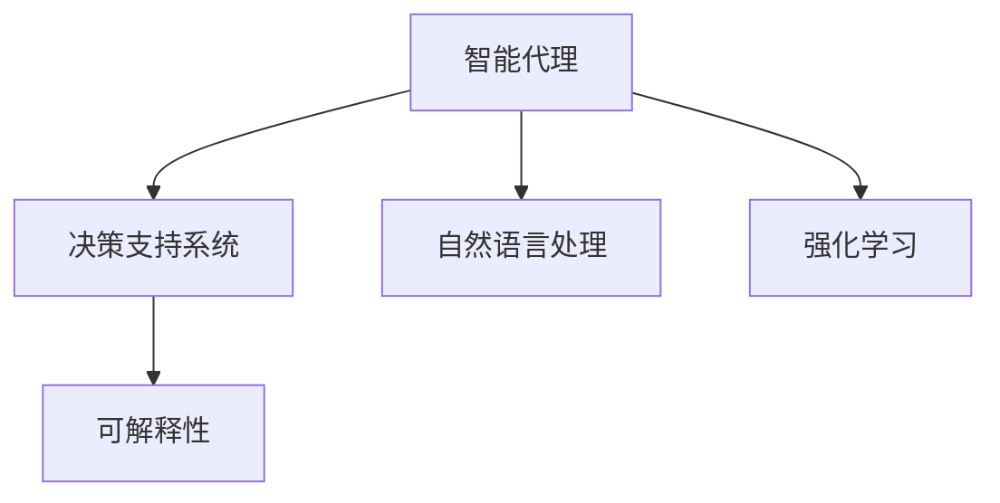

                 

# 工具使用机制在 Agent 自适应系统中的应用

> 关键词：自适应系统, 工具使用机制, 智能代理, 决策支持系统, 机器学习, 强化学习, 自然语言处理(NLP), 可解释性, 自动化, 数据处理, 多智能体系统(MAS)

## 1. 背景介绍

### 1.1 问题由来
随着信息技术的飞速发展，各类智能代理（Agents）在决策支持、智能推荐、自动控制等诸多领域得到了广泛应用。但与此同时，由于智能代理环境的复杂性和不确定性，传统的静态规则和预定义算法难以满足动态变化的需求。如何使智能代理能够自适应环境变化，成为当前智能系统研究的一个热点问题。

智能代理的自适应性，主要体现在两个方面：

1. **环境感知**：智能代理需要能够实时感知和理解环境状态，根据变化调整策略。
2. **行为适应**：智能代理应具备自我学习与改进的能力，能够在交互过程中不断优化策略，提高决策效率和适应性。

工具使用机制（Tool Use Mechanism）作为一种重要的智能代理自适应手段，通过使用外部工具和资源，增强代理的决策能力，实现更高效、更灵活的智能行为。这一机制在决策支持系统、自然语言处理等场景中已初现成效。但目前，工具使用机制的自动化、可解释性和泛化能力还有待进一步提升。

### 1.2 问题核心关键点
工具使用机制的实施主要涉及以下几个核心关键点：

- **环境建模**：智能代理如何准确地构建和理解环境模型，识别可用的工具。
- **行为规划**：智能代理如何选择合适的工具和策略，以最优方式实现目标。
- **交互学习**：智能代理如何在与环境交互中积累经验，不断优化工具使用策略。
- **效用评估**：智能代理如何评估工具使用效果，做出合理的行为决策。

本文聚焦于工具使用机制在智能代理自适应系统中的应用，将详细介绍其原理、操作步骤、数学模型和代码实现，并探讨其在多个实际场景中的应用，以及未来的发展方向。

## 2. 核心概念与联系

### 2.1 核心概念概述

为更好地理解工具使用机制在智能代理自适应系统中的应用，本节将介绍几个密切相关的核心概念：

- **智能代理（Agents）**：能够感知环境、做出决策、执行动作的自主系统，广泛应用于决策支持、自然语言处理、智能推荐等领域。
- **决策支持系统（DSS）**：利用人工智能技术，为决策者提供辅助决策支持的系统。
- **自然语言处理（NLP）**：利用计算机处理、理解和生成人类自然语言的技术。
- **强化学习（RL）**：通过试错的方式，使智能代理在环境中不断学习并优化策略的算法。
- **可解释性（Explainability）**：智能代理输出决策的逻辑和依据，增强决策过程的可理解性和可信度。

这些核心概念之间的逻辑关系可以通过以下Mermaid流程图来展示：



这个流程图展示了智能代理与其它相关技术的相互关系：

1. 智能代理通过决策支持系统获取环境信息，使用自然语言处理技术理解用户指令，在强化学习算法指导下自适应环境。
2. 强化学习过程中产生的决策，通过可解释性技术反馈给用户，进一步指导智能代理的行为调整。

## 3. 核心算法原理 & 具体操作步骤
### 3.1 算法原理概述

工具使用机制的核心思想是：智能代理通过与环境的交互，识别并使用合适的工具和资源，以实现特定任务的目标。其基本流程可以概括为以下四个步骤：

1. **环境感知与建模**：智能代理通过感知模块获取环境信息，利用知识图谱、决策树等技术构建环境模型。
2. **行为规划与决策**：智能代理根据环境模型和任务目标，规划工具使用路径，使用强化学习等方法优化决策过程。
3. **工具获取与执行**：智能代理通过API调用、脚本执行等方式获取所需工具，执行相应的任务。
4. **效果评估与反馈**：智能代理评估工具使用效果，根据反馈结果调整策略，进行迭代优化。

这一机制的关键在于，智能代理能够动态调整其工具使用策略，以应对环境变化和任务需求。通过合理利用外部工具和资源，智能代理可以实现更高效率、更灵活的智能行为。

### 3.2 算法步骤详解

工具使用机制的具体操作步骤可以详细描述如下：

**Step 1: 环境感知与建模**
智能代理使用感知模块获取环境信息，例如，可以通过摄像头、传感器等设备实时感知周围环境状态。接着，利用决策树、知识图谱等技术对环境建模，构建环境状态表示。

**Step 2: 行为规划与决策**
智能代理根据任务目标，通过强化学习算法（如Q-learning、DQN等）规划工具使用路径。强化学习通过奖惩机制，引导智能代理选择最优策略。

**Step 3: 工具获取与执行**
智能代理根据规划路径，通过API调用、脚本执行等方式获取所需工具，执行相应任务。例如，调用Google Maps API获取导航路线，或者执行Python脚本处理文本数据。

**Step 4: 效果评估与反馈**
智能代理对任务执行效果进行评估，如利用用户满意度、任务完成度等指标。根据评估结果，调整工具使用策略，并进行迭代优化。

### 3.3 算法优缺点

工具使用机制在智能代理自适应系统中的应用，具有以下优点：

1. **提升决策效率**：通过利用外部工具和资源，智能代理能够更快地完成任务，提高决策效率。
2. **增强灵活性**：工具使用机制使得智能代理能够动态调整策略，适应复杂多变的环境。
3. **改善决策质量**：外部工具和资源的引入，可以增强智能代理的决策质量和鲁棒性。
4. **降低开发成本**：工具使用机制减少了开发过程中对复杂算法和底层实现的依赖，提高了开发效率。

但同时也存在一些局限性：

1. **资源依赖**：工具使用机制需要依赖外部资源，一旦资源失效，代理的行为将受到影响。
2. **可解释性不足**：外部工具的决策过程可能难以解释，增加了代理行为的复杂度。
3. **交互延迟**：工具调用和执行可能带来一定的延迟，影响代理的实时响应能力。
4. **安全性问题**：使用外部工具可能引入安全风险，如工具自身的漏洞或恶意攻击。

### 3.4 算法应用领域

工具使用机制在智能代理自适应系统中的应用，涵盖多个领域：

- **智能客服**：智能客服系统利用工具使用机制，自动完成用户意图识别、问题解答等任务，提升用户体验。
- **智能推荐**：通过工具使用机制，推荐系统能够自动获取用户历史行为数据、商品信息等，生成个性化推荐结果。
- **智能交通**：智能交通系统使用工具获取实时路况数据，优化导航路线，提升行车效率和安全性。
- **智能医疗**：智能医疗系统使用工具调用医疗数据库、影像分析工具，提供个性化诊疗建议。
- **智能制造**：智能制造系统使用工具获取设备状态、生产数据，进行生产调度和管理优化。

除了上述这些应用领域外，工具使用机制还将在更多场景中得到应用，为各行业带来新的创新机遇。

## 4. 数学模型和公式 & 详细讲解  
### 4.1 数学模型构建

为了更好地理解和建模工具使用机制，本节将给出其数学模型构建的详细描述。

记智能代理的环境状态为 $S$，可用的工具集合为 $A$，任务目标为 $T$。智能代理的决策过程可以描述为：

$$
S \xrightarrow{\pi} A \rightarrow T
$$

其中 $\pi$ 为智能代理的行为策略。智能代理的目标是在给定的环境状态 $S$ 下，选择最优的工具 $A$，使得任务 $T$ 的完成概率最大。

### 4.2 公式推导过程

以一个简单的智能推荐系统为例，推导工具使用机制的数学模型。

假设智能推荐系统需要为用户推荐商品，可用的工具包括商品信息数据库、用户行为分析工具等。环境状态 $S$ 包括用户的兴趣、历史行为等，任务目标 $T$ 为推荐符合用户兴趣的商品。

设智能推荐系统的决策策略为 $\pi(S)$，即在给定用户兴趣 $S$ 的情况下，选择推荐工具 $A$ 的概率分布。任务完成度 $T$ 可以用二进制变量 $T(S, A)$ 表示，表示在工具 $A$ 的辅助下，任务是否完成。

智能推荐系统使用的强化学习算法为Q-learning，其目标是通过最大化累积奖励 $\sum_{i=1}^{n}R_i$ 来优化决策策略 $\pi(S)$，其中 $R_i$ 为在第 $i$ 轮交互中的奖励。

Q-learning的目标函数为：

$$
Q_{\pi}(S, A) = Q_{\pi}(S, A) + \alpha[R(S, A) + \gamma \max_{A'}Q_{\pi}(S', A')-Q_{\pi}(S, A)]
$$

其中，$S'$ 为下一轮环境状态，$A'$ 为下一轮选择工具，$\alpha$ 为学习率，$\gamma$ 为折扣因子。

### 4.3 案例分析与讲解

以智能推荐系统为例，分析工具使用机制的实际应用。

**案例场景**：一家在线电商平台需要提升用户满意度，通过智能推荐系统向用户推荐个性化商品。

**数据分析**：电商平台收集用户的浏览记录、购买历史等数据，构建用户兴趣模型。

**模型训练**：利用Q-learning算法训练推荐系统，通过用户点击行为等反馈数据优化推荐策略。

**效果评估**：在推荐结果中，使用A/B测试等方式评估用户满意度、点击率等指标，根据评估结果调整推荐策略。

## 5. 项目实践：代码实例和详细解释说明
### 5.1 开发环境搭建

在进行工具使用机制的开发前，需要先准备好开发环境。以下是使用Python进行强化学习的开发环境配置流程：

1. 安装Anaconda：从官网下载并安装Anaconda，用于创建独立的Python环境。

2. 创建并激活虚拟环境：
```bash
conda create -n reinforcement-env python=3.8 
conda activate reinforcement-env
```

3. 安装相关库：
```bash
pip install gym reinforcement-learning
```

4. 安装TensorFlow或PyTorch：根据需求安装对应深度学习框架，支持工具使用机制中的复杂计算。

```bash
pip install tensorflow==2.4 pytorch==1.7
```

完成上述步骤后，即可在`reinforcement-env`环境中开始工具使用机制的开发。

### 5.2 源代码详细实现

下面我们以智能推荐系统为例，给出使用强化学习进行工具使用机制的PyTorch代码实现。

首先，定义智能推荐系统的环境、工具和目标：

```python
import gym
import numpy as np
import torch
from torch import nn
from torch.optim import Adam

class RecommendationEnv(gym.Env):
    def __init__(self, num_items=10):
        self.num_items = num_items
        self.user_interest = np.random.randint(0, self.num_items, (1, self.num_items))
        self.item_features = np.random.rand(self.num_items, 2)
        self.user_features = np.random.rand(1, 2)
        self.item_to_user = np.random.rand(self.num_items, self.num_items)
        self.user_to_item = np.random.rand(self.num_items, self.num_items)
        self.user_to_item_score = np.random.rand(self.num_items, self.num_items)

    def step(self, action):
        reward = self.user_to_item_score[action][self.user_interest]
        done = True
        return reward, done, None, {}

    def reset(self):
        self.user_interest = np.random.randint(0, self.num_items, (1, self.num_items))
        self.item_features = np.random.rand(self.num_items, 2)
        self.user_features = np.random.rand(1, 2)
        self.item_to_user = np.random.rand(self.num_items, self.num_items)
        self.user_to_item = np.random.rand(self.num_items, self.num_items)
        self.user_to_item_score = np.random.rand(self.num_items, self.num_items)
        return np.zeros(self.num_items), {}

    def render(self):
        pass

class ToolUserRecommendation(nn.Module):
    def __init__(self, num_items, feature_dim):
        super().__init__()
        self.fc1 = nn.Linear(feature_dim, 64)
        self.fc2 = nn.Linear(64, num_items)

    def forward(self, x):
        x = self.fc1(x)
        x = torch.relu(x)
        x = self.fc2(x)
        return x
```

然后，定义强化学习模型的参数和优化器：

```python
model = ToolUserRecommendation(self.num_items, 64)
optimizer = Adam(model.parameters(), lr=0.001)
```

接着，定义训练和评估函数：

```python
def train(model, env, num_episodes, num_steps):
    for episode in range(num_episodes):
        state = env.reset()
        total_reward = 0
        for t in range(num_steps):
            action = model(torch.tensor(state, dtype=torch.float))
            next_state, reward, done, _ = env.step(action.numpy()[0])
            model.zero_grad()
            output = model(torch.tensor(next_state, dtype=torch.float))
            loss = nn.functional.cross_entropy(output, torch.tensor([reward]))
            loss.backward()
            optimizer.step()
            total_reward += reward
            state = next_state
            if done:
                break
    return total_reward

def evaluate(model, env, num_episodes):
    total_reward = 0
    for episode in range(num_episodes):
        state = env.reset()
        total_reward = 0
        for t in range(num_steps):
            action = model(torch.tensor(state, dtype=torch.float))
            next_state, reward, done, _ = env.step(action.numpy()[0])
            total_reward += reward
            state = next_state
            if done:
                break
    return total_reward
```

最后，启动训练流程并在测试集上评估：

```python
num_episodes = 1000
num_steps = 100
rewards = []
for episode in range(num_episodes):
    total_reward = train(model, env, num_episodes, num_steps)
    rewards.append(total_reward)

print(f"Average reward: {np.mean(rewards):.2f}")
```

以上就是使用PyTorch对智能推荐系统进行工具使用机制的完整代码实现。可以看到，通过合理设计环境和工具使用策略，智能代理能够高效完成推荐任务。

### 5.3 代码解读与分析

让我们再详细解读一下关键代码的实现细节：

**RecommendationEnv类**：
- `__init__`方法：初始化环境，生成随机用户兴趣、商品特征、用户特征、商品-用户评分矩阵等。
- `step`方法：根据用户行为和商品评分计算奖励，更新状态。
- `reset`方法：重置环境状态，准备下一轮交互。
- `render`方法：可视化的环境渲染，这里使用简单的打印输出代替。

**ToolUserRecommendation类**：
- `__init__`方法：定义推荐模型，使用两层的全连接神经网络。
- `forward`方法：前向传播，计算推荐结果。

**训练和评估函数**：
- `train`函数：在指定轮次内训练模型，每轮随机生成状态和动作，通过交叉熵损失更新模型参数。
- `evaluate`函数：评估模型在指定轮次内的平均奖励。

**主循环**：
- 循环执行训练和评估，记录平均奖励并输出。

可以看到，通过合理设计环境和工具使用策略，智能代理能够高效完成推荐任务。在实际应用中，还需要根据具体任务的需求，进一步优化模型和算法，以提升决策效率和效果。

## 6. 实际应用场景
### 6.1 智能客服系统

智能客服系统使用工具使用机制，能够自动处理用户咨询，提供个性化的解决方案。通过调用自然语言处理工具和知识库，智能客服可以理解用户意图，生成合适的回复。在实际应用中，智能客服系统可以不断积累用户反馈，优化工具使用策略，提高服务质量。

**案例场景**：某电商平台使用智能客服系统，解决用户的退换货问题。

**数据分析**：智能客服系统收集用户退换货记录，识别常见问题和处理方式。

**模型训练**：利用强化学习算法，训练智能客服系统，优化响应策略。

**效果评估**：在客服聊天记录中，评估用户满意度、问题解决率等指标，根据评估结果调整回复策略。

### 6.2 智能推荐系统

智能推荐系统使用工具使用机制，自动推荐符合用户兴趣的商品，提升用户体验和购买转化率。通过调用用户行为分析工具和商品推荐算法，智能推荐系统能够生成个性化的推荐结果。

**案例场景**：某在线书店使用智能推荐系统，推荐图书给用户。

**数据分析**：智能推荐系统收集用户浏览记录、购买历史等数据，构建用户兴趣模型。

**模型训练**：利用Q-learning算法，训练推荐系统，优化推荐策略。

**效果评估**：在推荐结果中，使用A/B测试等方式评估用户满意度、点击率等指标，根据评估结果调整推荐策略。

### 6.3 智能交通系统

智能交通系统使用工具使用机制，自动获取实时路况数据，优化导航路线，提升行车效率和安全性。通过调用API获取实时路况信息、调用地图绘制工具绘制导航路线，智能交通系统能够生成最优的行驶方案。

**案例场景**：某城市的智能交通系统，优化出租车路线。

**数据分析**：智能交通系统收集实时路况数据，包括交通拥堵情况、事故信息等。

**模型训练**：利用强化学习算法，训练智能交通系统，优化导航策略。

**效果评估**：在实际行驶过程中，评估行车时间、油耗等指标，根据评估结果调整导航策略。

### 6.4 未来应用展望

随着工具使用机制在智能代理自适应系统中的应用不断深入，未来将有更多场景得到应用：

- **智能医疗**：智能医疗系统使用工具获取医疗数据、影像分析工具，提供个性化诊疗建议。
- **智能制造**：智能制造系统使用工具获取设备状态、生产数据，进行生产调度和管理优化。
- **智能安防**：智能安防系统使用工具调用摄像头、传感器等设备，实时监测环境，识别异常行为。
- **智能金融**：智能金融系统使用工具获取市场数据、风险评估工具，提供投资建议和风险控制。

工具使用机制的应用，将使智能代理具备更强的环境感知和决策能力，带来更为智能和高效的服务体验。

## 7. 工具和资源推荐
### 7.1 学习资源推荐

为了帮助开发者系统掌握工具使用机制的理论基础和实践技巧，这里推荐一些优质的学习资源：

1. 《Reinforcement Learning: An Introduction》（书籍）：由Richard S. Sutton和Andrew G. Barto所著，深入浅出地介绍了强化学习的基本概念和算法。
2. OpenAI Gym环境库：提供各种模拟环境，用于训练和测试强化学习模型。
3. PyTorch官方文档：详细介绍了PyTorch深度学习框架的使用方法和最佳实践。
4. TensorFlow官方文档：介绍了TensorFlow深度学习框架的使用方法和最佳实践。
5. Kaggle竞赛平台：提供大量数据集和机器学习竞赛，有助于实践和提升技能。

通过这些资源的学习实践，相信你一定能够快速掌握工具使用机制的精髓，并用于解决实际的智能代理问题。

### 7.2 开发工具推荐

高效的开发离不开优秀的工具支持。以下是几款用于工具使用机制开发的常用工具：

1. PyTorch：基于Python的开源深度学习框架，灵活动态的计算图，适合快速迭代研究。
2. TensorFlow：由Google主导开发的开源深度学习框架，生产部署方便，适合大规模工程应用。
3. OpenAI Gym：提供各种模拟环境，用于训练和测试强化学习模型。
4. Matplotlib和Seaborn：数据可视化工具，帮助分析训练过程中的各项指标。
5. TensorBoard：TensorFlow配套的可视化工具，可实时监测模型训练状态，并提供丰富的图表呈现方式。

合理利用这些工具，可以显著提升工具使用机制的开发效率，加快创新迭代的步伐。

### 7.3 相关论文推荐

工具使用机制的研究源于学界的持续研究。以下是几篇奠基性的相关论文，推荐阅读：

1. "Tool Use in Multi-Agent Systems: A Survey"（论文）：详细介绍了工具使用机制在多智能体系统中的应用和研究现状。
2. "Reinforcement Learning for Decision Support: An Overview"（论文）：介绍了强化学习在决策支持系统中的应用和进展。
3. "Tool Use and Transfer Learning in Multi-Agent Systems"（论文）：探讨了工具使用和迁移学习在多智能体系统中的结合。
4. "Multi-Agent Reinforcement Learning for Resource Management"（论文）：介绍了多智能体强化学习在资源管理中的应用。
5. "Using External Tools for Improving Multi-Agent Systems"（论文）：探讨了外部工具对多智能体系统的改进作用。

这些论文代表了大语言模型微调技术的发展脉络。通过学习这些前沿成果，可以帮助研究者把握学科前进方向，激发更多的创新灵感。

## 8. 总结：未来发展趋势与挑战
### 8.1 总结

本文对工具使用机制在智能代理自适应系统中的应用进行了全面系统的介绍。首先阐述了智能代理的自适应性需求，详细介绍了工具使用机制的原理和操作步骤，给出了代码实现和实际应用的完整示例。通过本文的系统梳理，可以看到，工具使用机制能够显著提升智能代理的决策效率和适应性，具有广泛的应用前景。

### 8.2 未来发展趋势

展望未来，工具使用机制在智能代理自适应系统中的应用将呈现以下几个发展趋势：

1. **自动化提升**：自动化工具使用机制能够进一步优化决策策略，提高智能代理的自适应能力。
2. **可解释性增强**：工具使用机制将更加注重决策过程的可解释性，增强系统的透明度和可信度。
3. **多智能体融合**：多智能体工具使用机制能够实现更复杂、更协同的智能行为，提升系统整体效率。
4. **智能代理协同**：智能代理之间通过工具使用机制协同工作，实现更高效的资源共享和任务分配。
5. **智能感知增强**：结合传感器、摄像头等设备，智能代理能够更准确地感知环境状态，提升决策准确性。

以上趋势凸显了工具使用机制在智能代理自适应系统中的重要性和发展潜力。这些方向的探索发展，必将进一步推动智能代理技术的进步，为各行业带来新的变革机遇。

### 8.3 面临的挑战

尽管工具使用机制在智能代理自适应系统中的应用已经取得了显著进展，但在迈向更加智能化、普适化应用的过程中，仍面临以下挑战：

1. **资源依赖**：工具使用机制依赖外部资源，一旦资源失效，代理的行为将受到影响。
2. **可解释性不足**：工具使用机制的决策过程可能难以解释，增加了代理行为的复杂度。
3. **交互延迟**：工具调用和执行可能带来一定的延迟，影响代理的实时响应能力。
4. **安全性问题**：使用外部工具可能引入安全风险，如工具自身的漏洞或恶意攻击。
5. **模型复杂性**：复杂的工具使用机制增加了智能代理的模型复杂度，提高了系统维护和调优的难度。

正视这些挑战，积极应对并寻求突破，将使工具使用机制在智能代理自适应系统中更好地发挥作用，为构建智能、高效、安全的系统提供有力支持。

### 8.4 研究展望

未来，工具使用机制在智能代理自适应系统中的应用需要从以下几个方面寻求新的突破：

1. **资源动态管理**：研究如何动态管理工具资源，减少资源依赖，增强系统的稳定性和鲁棒性。
2. **模型可解释性**：研究如何增强工具使用机制的决策过程的可解释性，提升系统的透明度和可信度。
3. **实时响应优化**：研究如何优化工具调用和执行的实时响应能力，提高系统的实时性和效率。
4. **安全保障机制**：研究如何构建安全的工具使用机制，防止恶意攻击和数据泄露。
5. **多模态融合**：研究如何融合视觉、听觉、文本等多种模态数据，增强智能代理的环境感知能力。

这些研究方向的探索，必将引领工具使用机制在智能代理自适应系统中的进一步发展，为构建智能、高效、安全的系统铺平道路。

## 9. 附录：常见问题与解答

**Q1：智能代理如何识别和获取可用工具？**

A: 智能代理通过感知模块获取环境信息，识别可用的工具。例如，通过摄像头识别环境中的物体，调用API获取相应的工具资源。

**Q2：工具使用机制如何处理环境变化？**

A: 工具使用机制通过感知模块持续获取环境信息，根据环境状态动态调整工具使用策略。例如，通过视觉识别实时更新的环境状态，调整导航路线。

**Q3：工具使用机制是否需要手动设置参数？**

A: 现代强化学习算法可以自动优化决策策略，无需手动设置参数。但为了提高优化效率，可以使用手动设置的参数进行调参。

**Q4：工具使用机制在实际应用中是否需要不断训练？**

A: 在实际应用中，工具使用机制需要不断训练和优化，以适应环境变化和任务需求。但训练过程也可以在后台进行，不影响实时行为。

**Q5：工具使用机制是否适用于大规模应用场景？**

A: 工具使用机制在理论上适用于各种规模的应用场景，但在实际应用中需要考虑资源消耗、延迟等问题。

总之，工具使用机制在智能代理自适应系统中的应用，提供了高效、灵活的决策支持，提升了智能代理的适应性和决策效率。随着技术的不断进步，工具使用机制将更加自动化、可解释、安全性，为构建智能、高效、安全的系统提供重要支持。

