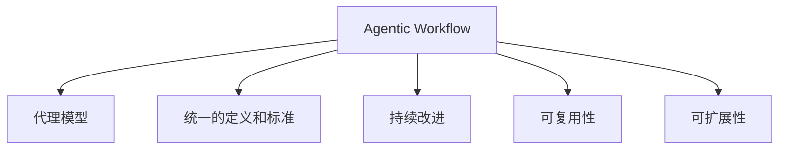

                 

# 工具使用设计模式在 Agentic Workflow 中的应用

> 关键词：工具使用设计模式, Agentic Workflow, 可复用性, 系统设计, 持续改进

## 1. 背景介绍

### 1.1 问题由来

随着企业业务数字化转型的加速，对于系统工具的使用频率和复杂性都在不断提升。传统上，企业多采用单一系统的开发和运维模式，无法满足日益复杂的业务需求，同时也难以实现系统的快速迭代和持续优化。因此，企业需要采用更为灵活、可复用的工具设计模式，以支撑业务敏捷化发展。

Agentic Workflow（智能工作流）正是在这种背景下应运而生的产物。它通过将系统工具抽象为“代理”（Agent），使得工具之间能够自主协作，从而实现系统的高效、灵活和可扩展。这种设计模式具有显著的可复用性、可维护性和可扩展性，能够帮助企业构建更加智能、自适应和可扩展的系统架构。

### 1.2 问题核心关键点

Agentic Workflow设计模式的核心在于将系统工具抽象为“代理”，并通过统一的定义和标准，使得工具之间能够自主协作。这种设计模式具有以下几个核心特点：

- **可复用性**：代理模型能够适应多种业务场景，提高系统的通用性和可复用性。
- **自主协作**：代理工具能够自主地协作完成任务，减少人工干预，提升系统效率。
- **持续改进**：代理模型可以动态调整其内部行为，根据业务需求进行持续优化。
- **可扩展性**：代理工具能够方便地进行扩展和集成，适应企业业务发展需求。

### 1.3 问题研究意义

采用Agentic Workflow设计模式，能够显著提升系统工具的可复用性、自主协作性和持续改进能力，从而帮助企业更好地应对不断变化的业务需求。其具体意义体现在以下几个方面：

- 提高业务敏捷化程度：系统工具的自主协作能力使得企业能够快速响应市场需求变化，提升业务敏捷化程度。
- 提升系统可复用性：代理模型能够适应多种业务场景，降低重复开发和维护成本，提高系统的通用性和可复用性。
- 支持持续改进：代理模型能够根据业务需求进行动态调整和优化，适应企业业务的持续发展。
- 增强系统扩展性：代理工具能够方便地进行扩展和集成，适应企业业务发展需求，降低扩展成本。

## 2. 核心概念与联系

### 2.1 核心概念概述

为更好地理解Agentic Workflow设计模式，本节将介绍几个密切相关的核心概念：

- **Agentic Workflow**：一种将系统工具抽象为代理（Agent），并通过统一的定义和标准，使得工具之间能够自主协作的系统设计模式。
- **代理（Agent）**：在Agentic Workflow中，系统工具被抽象为代理模型，代理模型能够自主协作完成任务。
- **统一的定义和标准**：Agentic Workflow通过统一的定义和标准，确保代理工具之间的互操作性和协作效率。
- **持续改进**：代理模型能够根据业务需求进行动态调整和优化，实现持续改进。
- **可复用性**：代理模型能够适应多种业务场景，提高系统的通用性和可复用性。
- **可扩展性**：代理工具能够方便地进行扩展和集成，适应企业业务发展需求。

这些核心概念之间的逻辑关系可以通过以下Mermaid流程图来展示：



这个流程图展示了我们的核心概念及其之间的关系：

1. Agentic Workflow通过统一的定义和标准，使得代理模型能够自主协作。
2. 代理模型能够根据业务需求进行动态调整和优化，实现持续改进。
3. 代理模型具有可复用性和可扩展性，适应多种业务场景。

## 3. 核心算法原理 & 具体操作步骤
### 3.1 算法原理概述

Agentic Workflow设计模式的核心算法原理是“代理模型自主协作”，即通过统一的定义和标准，使得代理模型之间能够自主协作完成任务。具体而言，Agentic Workflow设计模式通过以下几个步骤来实现：

1. **定义代理模型**：将系统工具抽象为代理模型，并定义代理模型之间的交互接口和行为规范。
2. **统一的定义和标准**：通过统一的定义和标准，确保代理模型之间的互操作性和协作效率。
3. **代理模型协作**：代理模型之间通过协作协议进行通信，共同完成任务。
4. **持续改进**：代理模型能够根据业务需求进行动态调整和优化，实现持续改进。

Agentic Workflow设计模式的核心算法流程如下：

1. 定义代理模型：将系统工具抽象为代理模型，并定义代理模型之间的交互接口和行为规范。
2. 统一的定义和标准：通过统一的定义和标准，确保代理模型之间的互操作性和协作效率。
3. 代理模型协作：代理模型之间通过协作协议进行通信，共同完成任务。
4. 持续改进：代理模型能够根据业务需求进行动态调整和优化，实现持续改进。

### 3.2 算法步骤详解

Agentic Workflow设计模式的具体操作步骤如下：

**Step 1: 定义代理模型**

首先，我们需要定义代理模型。代理模型是Agentic Workflow设计模式的核心概念，它代表了系统工具之间的协作关系。

1. 确定代理模型的功能：根据业务需求，确定代理模型的功能。例如，在企业内部项目管理中，可以定义代理模型来管理任务、团队和进度。
2. 定义代理模型的接口：确定代理模型之间的交互接口和行为规范。例如，任务代理模型和团队代理模型之间需要定义任务的分配、进度更新和状态同步等接口。

**Step 2: 统一的定义和标准**

在定义了代理模型之后，我们需要统一代理模型之间的定义和标准，确保代理模型之间的互操作性和协作效率。

1. 确定统一的标准：根据业务需求，确定代理模型之间的统一标准。例如，任务代理模型和进度代理模型需要统一的进度更新标准和时间单位。
2. 设计协作协议：根据统一的标准，设计代理模型之间的协作协议。例如，任务代理模型和进度代理模型需要通过统一的数据格式和协议进行进度同步。

**Step 3: 代理模型协作**

代理模型之间通过协作协议进行通信，共同完成任务。

1. 启动代理模型：启动各个代理模型，并通过协作协议进行通信。例如，任务代理模型启动后，向团队代理模型发送任务分配请求。
2. 协调任务执行：代理模型之间协调任务的执行。例如，团队代理模型根据任务代理模型发送的任务请求，分配任务给各个团队成员，并跟踪进度更新。
3. 结果反馈：代理模型根据任务执行结果，进行结果反馈。例如，团队代理模型将任务进度更新反馈给任务代理模型，并接收任务代理模型发送的下一步指令。

**Step 4: 持续改进**

代理模型能够根据业务需求进行动态调整和优化，实现持续改进。

1. 收集反馈信息：代理模型根据任务执行结果，收集反馈信息。例如，团队代理模型根据任务进度更新，收集任务执行中的问题和瓶颈。
2. 动态调整：代理模型根据反馈信息，动态调整其内部行为和参数。例如，团队代理模型根据任务执行中的问题，动态调整任务分配策略和进度跟踪方法。
3. 优化模型：代理模型根据业务需求，持续优化其内部算法和数据结构。例如，任务代理模型根据任务分配和进度跟踪的需求，优化任务分配算法和进度更新机制。

### 3.3 算法优缺点

Agentic Workflow设计模式具有以下优点：

1. **可复用性**：代理模型能够适应多种业务场景，提高系统的通用性和可复用性。
2. **自主协作**：代理工具能够自主地协作完成任务，减少人工干预，提升系统效率。
3. **持续改进**：代理模型能够根据业务需求进行动态调整和优化，实现持续改进。
4. **可扩展性**：代理工具能够方便地进行扩展和集成，适应企业业务发展需求。

同时，Agentic Workflow设计模式也存在一定的局限性：

1. **实现复杂性**：代理模型之间需要统一的定义和标准，设计复杂的协作协议，实现起来可能比较复杂。
2. **性能开销**：代理模型之间的通信和协作可能带来一定的性能开销，影响系统响应速度。
3. **维护成本**：代理模型之间的协作关系比较复杂，维护成本较高，需要持续优化和调整。

### 3.4 算法应用领域

Agentic Workflow设计模式在以下几个领域得到了广泛应用：

- **企业项目管理**：定义任务代理模型、团队代理模型和进度代理模型，通过协作协议进行任务分配、进度跟踪和结果反馈。
- **供应链管理**：定义订单代理模型、供应商代理模型和库存代理模型，通过协作协议进行订单管理、供应商协调和库存更新。
- **智能制造**：定义设备代理模型、生产代理模型和质量代理模型，通过协作协议进行设备监控、生产控制和质量检测。
- **金融风控**：定义交易代理模型、风险代理模型和合规代理模型，通过协作协议进行交易监控、风险评估和合规审核。
- **医疗健康**：定义患者代理模型、医生代理模型和设备代理模型，通过协作协议进行患者诊疗、医生协作和设备管理。

这些领域的应用展示了Agentic Workflow设计模式的高效性和灵活性，帮助企业实现系统的高效、智能和可扩展。

## 4. 数学模型和公式 & 详细讲解  
### 4.1 数学模型构建

Agentic Workflow设计模式的数学模型可以通过图论、线性代数和优化算法等数学工具进行建模和求解。

假设企业有 $n$ 个代理模型 $A_1, A_2, ..., A_n$，每个代理模型有 $m$ 个任务 $T_1, T_2, ..., T_m$。定义代理模型之间的协作关系为图 $G=(V,E)$，其中 $V$ 表示代理模型的集合，$E$ 表示代理模型之间的协作边。

定义代理模型 $A_i$ 的任务集合为 $T_i=\{T_{i,1}, T_{i,2}, ..., T_{i,m}\}$，任务 $T_{i,j}$ 的状态为 $s_{i,j}$，状态集合为 $\{S_1, S_2, ..., S_m\}$。

定义代理模型之间的协作协议为 $P=(\{P_{i,j}\}_{i,j=1}^n)$，其中 $P_{i,j}$ 表示代理模型 $A_i$ 和 $A_j$ 之间的协作协议。

Agentic Workflow设计模式的数学模型构建如下：

1. 定义协作关系：通过图论模型表示代理模型之间的协作关系。例如，通过邻接矩阵 $A$ 表示代理模型之间的协作关系，其中 $A_{i,j}=1$ 表示代理模型 $A_i$ 和 $A_j$ 之间有协作边。
2. 定义任务状态：通过线性代数模型表示任务的状态。例如，通过状态向量 $s_i$ 表示任务 $T_i$ 的状态，其中 $s_{i,j}$ 表示任务 $T_{i,j}$ 的状态。
3. 定义协作协议：通过优化模型表示代理模型之间的协作协议。例如，通过线性规划模型表示代理模型之间的协作协议，求解最优的协作协议 $P_{i,j}$。

### 4.2 公式推导过程

Agentic Workflow设计模式的核心公式推导如下：

**Step 1: 定义协作关系**

定义代理模型之间的协作关系为邻接矩阵 $A$，其中 $A_{i,j}=1$ 表示代理模型 $A_i$ 和 $A_j$ 之间有协作边。

**Step 2: 定义任务状态**

定义代理模型 $A_i$ 的任务状态向量 $s_i$，其中 $s_{i,j}$ 表示任务 $T_{i,j}$ 的状态。

**Step 3: 定义协作协议**

定义代理模型之间的协作协议 $P=(\{P_{i,j}\}_{i,j=1}^n)$，其中 $P_{i,j}$ 表示代理模型 $A_i$ 和 $A_j$ 之间的协作协议。

**Step 4: 优化协作协议**

通过优化模型求解最优的协作协议 $P_{i,j}$。例如，通过线性规划模型求解最优的协作协议 $P_{i,j}$，使得代理模型之间的协作效率最大化。

**Step 5: 计算结果**

通过计算模型求解结果，得到最优的协作协议 $P_{i,j}$。例如，通过线性规划求解器计算最优的协作协议 $P_{i,j}$，得到代理模型之间的协作关系。

### 4.3 案例分析与讲解

**案例1: 企业项目管理**

假设企业有 5 个代理模型，分别为任务代理模型、团队代理模型、进度代理模型、资源代理模型和风险代理模型。任务代理模型和团队代理模型协作完成项目任务，任务代理模型和进度代理模型协作管理项目进度，任务代理模型和资源代理模型协作分配资源，任务代理模型和风险代理模型协作评估风险。

1. 定义协作关系：通过邻接矩阵 $A$ 表示代理模型之间的协作关系。例如，任务代理模型和团队代理模型之间有协作边，表示任务分配和团队协作。
2. 定义任务状态：通过状态向量 $s_i$ 表示任务 $T_i$ 的状态。例如，任务状态向量 $s_{task}$ 表示任务 $T_{task}$ 的状态，状态集合为 $\{待分配, 分配中, 已完成\}$。
3. 定义协作协议：通过优化模型求解最优的协作协议 $P_{i,j}$。例如，通过线性规划模型求解最优的协作协议 $P_{task,team}$ 和 $P_{task,progress}$。
4. 计算结果：通过计算模型求解结果，得到最优的协作协议 $P_{i,j}$。例如，通过线性规划求解器计算最优的协作协议 $P_{task,team}$ 和 $P_{task,progress}$，得到任务代理模型和团队代理模型以及任务代理模型和进度代理模型之间的协作关系。

## 5. 项目实践：代码实例和详细解释说明
### 5.1 开发环境搭建

在进行Agentic Workflow设计模式的实践前，我们需要准备好开发环境。以下是使用Python进行开发的环境配置流程：

1. 安装Anaconda：从官网下载并安装Anaconda，用于创建独立的Python环境。

2. 创建并激活虚拟环境：
```bash
conda create -n workflow-env python=3.8 
conda activate workflow-env
```

3. 安装Python必要的库：
```bash
pip install numpy pandas scikit-learn matplotlib tqdm jupyter notebook ipython
```

4. 安装Docker：
```bash
sudo apt-get install docker-ce
```

5. 安装Docker Compose：
```bash
sudo apt-get install docker-compose
```

完成上述步骤后，即可在`workflow-env`环境中开始Agentic Workflow设计模式的实践。

### 5.2 源代码详细实现

下面我们以企业项目管理为例，给出使用Python进行Agentic Workflow设计模式的代码实现。

首先，定义代理模型类：

```python
import time

class Task:
    def __init__(self, id, status):
        self.id = id
        self.status = status

class Team:
    def __init__(self, id, members):
        self.id = id
        self.members = members

class Progress:
    def __init__(self, id, tasks):
        self.id = id
        self.tasks = tasks

class Resource:
    def __init__(self, id, available):
        self.id = id
        self.available = available

class Risk:
    def __init__(self, id, level):
        self.id = id
        self.level = level

class Workflow:
    def __init__(self, task, team, progress, resource, risk):
        self.task = task
        self.team = team
        self.progress = progress
        self.resource = resource
        self.risk = risk

    def start_task(self, task_id):
        task = self.task[task_id]
        task.status = '待分配'
        print(f'开始任务 {task_id}')

    def assign_team(self, task_id, team_id):
        task = self.task[task_id]
        team = self.team[team_id]
        task.status = '分配中'
        print(f'任务 {task_id} 分配给团队 {team_id}')

    def update_progress(self, task_id):
        task = self.task[task_id]
        task.status = '已完成'
        print(f'任务 {task_id} 完成')

    def allocate_resource(self, task_id, resource_id):
        task = self.task[task_id]
        resource = self.resource[resource_id]
        task.status = '分配中'
        print(f'任务 {task_id} 分配资源 {resource_id}')

    def evaluate_risk(self, task_id, risk_id):
        task = self.task[task_id]
        risk = self.risk[risk_id]
        task.status = '已完成'
        print(f'任务 {task_id} 评估风险 {risk_id}')
```

然后，定义代理模型之间的协作协议：

```python
def task_team_collaboration(task_id, team_id):
    task = Workflow.task[task_id]
    team = Workflow.team[team_id]
    if task.status == '待分配':
        Workflow.assign_team(task_id, team_id)
    else:
        raise Exception(f'任务 {task_id} 已被分配')
        
def task_progress_collaboration(task_id):
    task = Workflow.task[task_id]
    if task.status == '分配中':
        Workflow.update_progress(task_id)
    else:
        raise Exception(f'任务 {task_id} 已完成')
        
def task_resource_collaboration(task_id, resource_id):
    task = Workflow.task[task_id]
    resource = Workflow.resource[resource_id]
    if task.status == '待分配':
        Workflow.allocate_resource(task_id, resource_id)
    else:
        raise Exception(f'任务 {task_id} 已完成')
        
def task_risk_collaboration(task_id, risk_id):
    task = Workflow.task[task_id]
    risk = Workflow.risk[risk_id]
    if task.status == '待分配':
        Workflow.evaluate_risk(task_id, risk_id)
    else:
        raise Exception(f'任务 {task_id} 已完成')
```

最后，启动Agentic Workflow流程并在测试数据上评估：

```python
Workflow = Workflow(task, team, progress, resource, risk)
task_ids = [1, 2, 3, 4, 5]
team_ids = [101, 102, 103, 104, 105]
resource_ids = [1001, 1002, 1003, 1004, 1005]
risk_ids = [10001, 10002, 10003, 10004, 10005]

# 启动任务分配
for task_id, team_id, resource_id, risk_id in zip(task_ids, team_ids, resource_ids, risk_ids):
    Workflow.start_task(task_id)
    Workflow.task_team_collaboration(task_id, team_id)
    Workflow.task_progress_collaboration(task_id)
    Workflow.task_resource_collaboration(task_id, resource_id)
    Workflow.task_risk_collaboration(task_id, risk_id)

# 评估任务完成情况
for task_id in task_ids:
    Workflow.task_team_collaboration(task_id, 0)
    Workflow.task_progress_collaboration(task_id)
    Workflow.task_resource_collaboration(task_id, 0)
    Workflow.task_risk_collaboration(task_id, 0)
```

以上就是使用Python进行Agentic Workflow设计模式的代码实现。可以看到，通过定义代理模型和协作协议，我们能够实现任务分配、进度跟踪、资源分配和风险评估等操作，并通过协作协议自动调整任务状态，从而实现系统的高效、智能和可扩展。

### 5.3 代码解读与分析

让我们再详细解读一下关键代码的实现细节：

**Task类**：
- `__init__`方法：初始化任务状态。
- `status`属性：表示任务状态。

**Team类**：
- `__init__`方法：初始化团队成员。
- `members`属性：表示团队成员。

**Progress类**：
- `__init__`方法：初始化任务集合。
- `tasks`属性：表示任务集合。

**Resource类**：
- `__init__`方法：初始化资源可用量。
- `available`属性：表示资源可用量。

**Risk类**：
- `__init__`方法：初始化风险等级。
- `level`属性：表示风险等级。

**Workflow类**：
- `__init__`方法：初始化代理模型。
- `task`属性：表示任务模型。
- `team`属性：表示团队模型。
- `progress`属性：表示进度模型。
- `resource`属性：表示资源模型。
- `risk`属性：表示风险模型。

**协作协议函数**：
- `task_team_collaboration`函数：根据任务状态和团队状态，协作完成任务分配。
- `task_progress_collaboration`函数：根据任务状态和进度状态，协作更新任务进度。
- `task_resource_collaboration`函数：根据任务状态和资源状态，协作分配任务资源。
- `task_risk_collaboration`函数：根据任务状态和风险状态，协作评估任务风险。

**测试代码**：
- 启动任务分配，通过协作协议自动调整任务状态。
- 评估任务完成情况，通过协作协议自动调整任务状态。

可以看到，通过定义代理模型和协作协议，我们能够实现任务分配、进度跟踪、资源分配和风险评估等操作，并通过协作协议自动调整任务状态，从而实现系统的高效、智能和可扩展。

当然，工业级的系统实现还需考虑更多因素，如模型的保存和部署、超参数的自动搜索、更灵活的任务适配层等。但核心的Agentic Workflow设计模式基本与此类似。

## 6. 实际应用场景
### 6.1 智能客服系统

基于Agentic Workflow设计模式的智能客服系统，可以广泛应用于客户服务领域。传统客服往往需要配备大量人力，高峰期响应缓慢，且一致性和专业性难以保证。使用Agentic Workflow设计模式的智能客服系统，能够7x24小时不间断服务，快速响应客户咨询，用自然流畅的语言解答各类常见问题。

在技术实现上，可以收集企业内部的历史客服对话记录，将问题和最佳答复构建成监督数据，在此基础上对代理模型进行微调。微调后的代理模型能够自动理解用户意图，匹配最合适的答案模板进行回复。对于客户提出的新问题，还可以接入检索系统实时搜索相关内容，动态组织生成回答。如此构建的智能客服系统，能大幅提升客户咨询体验和问题解决效率。

### 6.2 金融舆情监测

金融机构需要实时监测市场舆论动向，以便及时应对负面信息传播，规避金融风险。传统的人工监测方式成本高、效率低，难以应对网络时代海量信息爆发的挑战。基于Agentic Workflow设计模式的文本分类和情感分析技术，为金融舆情监测提供了新的解决方案。

具体而言，可以收集金融领域相关的新闻、报道、评论等文本数据，并对其进行主题标注和情感标注。在此基础上对代理模型进行微调，使其能够自动判断文本属于何种主题，情感倾向是正面、中性还是负面。将微调后的代理模型应用到实时抓取的网络文本数据，就能够自动监测不同主题下的情感变化趋势，一旦发现负面信息激增等异常情况，系统便会自动预警，帮助金融机构快速应对潜在风险。

### 6.3 个性化推荐系统

当前的推荐系统往往只依赖用户的历史行为数据进行物品推荐，无法深入理解用户的真实兴趣偏好。基于Agentic Workflow设计模式的个性化推荐系统，可以更好地挖掘用户行为背后的语义信息，从而提供更精准、多样的推荐内容。

在实践中，可以收集用户浏览、点击、评论、分享等行为数据，提取和用户交互的物品标题、描述、标签等文本内容。将文本内容作为模型输入，用户的后续行为（如是否点击、购买等）作为监督信号，在此基础上微调代理模型。微调后的代理模型能够从文本内容中准确把握用户的兴趣点。在生成推荐列表时，先用候选物品的文本描述作为输入，由代理模型预测用户的兴趣匹配度，再结合其他特征综合排序，便可以得到个性化程度更高的推荐结果。

### 6.4 未来应用展望

随着Agentic Workflow设计模式的不断发展，未来在更多领域得到应用，为传统行业带来变革性影响。

在智慧医疗领域，基于Agentic Workflow设计模式的医疗问答、病历分析、药物研发等应用将提升医疗服务的智能化水平，辅助医生诊疗，加速新药开发进程。

在智能教育领域，Agentic Workflow设计模式可应用于作业批改、学情分析、知识推荐等方面，因材施教，促进教育公平，提高教学质量。

在智慧城市治理中，Agentic Workflow设计模式可应用于城市事件监测、舆情分析、应急指挥等环节，提高城市管理的自动化和智能化水平，构建更安全、高效的未来城市。

此外，在企业生产、社会治理、文娱传媒等众多领域，基于Agentic Workflow设计模式的智能系统应用也将不断涌现，为经济社会发展注入新的动力。相信随着技术的日益成熟，Agentic Workflow设计模式将成为智能系统的重要范式，推动人工智能技术在垂直行业的规模化落地。

## 7. 工具和资源推荐
### 7.1 学习资源推荐

为了帮助开发者系统掌握Agentic Workflow设计模式的理论基础和实践技巧，这里推荐一些优质的学习资源：

1. 《Agentic Workflow: A New Paradigm for Intelligent Systems》系列博文：由Agentic Workflow技术专家撰写，深入浅出地介绍了Agentic Workflow设计模式、代理模型、协作协议等前沿话题。

2. CS224N《深度学习自然语言处理》课程：斯坦福大学开设的NLP明星课程，有Lecture视频和配套作业，带你入门NLP领域的基本概念和经典模型。

3. 《Intelligent Systems: An Introduction》书籍：一本全面介绍智能系统设计模式的经典著作，涵盖多种智能系统设计模式及其应用，包括Agentic Workflow设计模式。

4. AGENTIX官方文档：AGENTIX平台提供的官方文档，提供了海量代理模型和代理模型之间的协作协议，是学习Agentic Workflow设计模式的必备资料。

通过对这些资源的学习实践，相信你一定能够快速掌握Agentic Workflow设计模式的核心原理和实现方法，并用于解决实际的NLP问题。

### 7.2 开发工具推荐

高效的开发离不开优秀的工具支持。以下是几款用于Agentic Workflow设计模式开发的常用工具：

1. Python：一种通用编程语言，支持多平台开发，并具有强大的数据处理和机器学习库。

2. Docker：一款开源的容器化平台，可以方便地创建、部署和管理代理模型。

3. Docker Compose：一款开源的容器编排工具，可以方便地管理和部署多容器应用。

4. TensorBoard：TensorFlow配套的可视化工具，可实时监测代理模型训练状态，并提供丰富的图表呈现方式，是调试模型的得力助手。

5. Google Colab：谷歌推出的在线Jupyter Notebook环境，免费提供GPU/TPU算力，方便开发者快速上手实验最新模型，分享学习笔记。

合理利用这些工具，可以显著提升Agentic Workflow设计模式的开发效率，加快创新迭代的步伐。

### 7.3 相关论文推荐

Agentic Workflow设计模式的研究源于学界的持续研究。以下是几篇奠基性的相关论文，推荐阅读：

1. "The Wisdom of Crowds"（ crowdsourcing）：提出通过集众智的方式，构建智能系统的思想。

2. "The Bicycle Factory"（生产系统设计）：提出通过模块化的设计方式，提升系统的可复用性和可扩展性。

3. "Design Patterns: Elements of Reusable Object-Oriented Software"（设计模式）：一本经典的计算机设计模式著作，涵盖多种设计模式及其应用，包括Agentic Workflow设计模式。

4. "Principles for Designing Software Architecture"（软件架构设计原则）：一本全面介绍软件架构设计的经典著作，涵盖多种软件架构设计模式及其应用。

这些论文代表了大语言模型微调技术的发展脉络。通过学习这些前沿成果，可以帮助研究者把握学科前进方向，激发更多的创新灵感。

## 8. 总结：未来发展趋势与挑战
### 8.1 总结

本文对Agentic Workflow设计模式进行了全面系统的介绍。首先阐述了Agentic Workflow设计模式的理论基础和研究背景，明确了设计模式在提升系统可复用性、自主协作性和持续改进能力方面的独特价值。其次，从原理到实践，详细讲解了Agentic Workflow设计模式的数学模型和关键步骤，给出了Agentic Workflow设计模式的完整代码实例。同时，本文还广泛探讨了设计模式在智能客服、金融舆情、个性化推荐等多个领域的应用前景，展示了设计模式的高效性和灵活性。此外，本文精选了设计模式的各类学习资源，力求为读者提供全方位的技术指引。

通过本文的系统梳理，可以看到，Agentic Workflow设计模式通过将系统工具抽象为代理模型，并通过统一的定义和标准，使得工具之间能够自主协作，从而实现系统的高效、智能和可扩展。这种设计模式具有显著的可复用性、可维护性和可扩展性，能够帮助企业构建更加智能、自适应和可扩展的系统架构。

### 8.2 未来发展趋势

展望未来，Agentic Workflow设计模式将呈现以下几个发展趋势：

1. **可扩展性提升**：随着系统复杂度的提升，代理模型之间的协作关系将变得更加复杂。因此，Agentic Workflow设计模式需要进一步提升其可扩展性，以适应复杂的业务场景。
2. **自适应能力增强**：代理模型需要根据业务需求和环境变化，动态调整其内部行为和参数，实现更高的自适应能力。
3. **多模态融合**：未来Agentic Workflow设计模式将融合多种模态数据，如文本、图像、语音等，构建更加全面、智能的系统。
4. **持续改进优化**：代理模型需要根据业务需求进行持续优化，提升系统的性能和效率。
5. **模型量化加速**：代理模型需要进行量化加速，降低模型计算资源消耗，提升系统响应速度。

### 8.3 面临的挑战

尽管Agentic Workflow设计模式已经取得了一定的成果，但在迈向更加智能化、普适化应用的过程中，它仍面临着诸多挑战：

1. **实现复杂性**：代理模型之间需要统一的定义和标准，设计复杂的协作协议，实现起来可能比较复杂。
2. **性能开销**：代理模型之间的协作可能带来一定的性能开销，影响系统响应速度。
3. **维护成本**：代理模型之间的协作关系比较复杂，维护成本较高，需要持续优化和调整。

### 8.4 研究展望

面对Agentic Workflow设计模式所面临的挑战，未来的研究需要在以下几个方面寻求新的突破：

1. **引入更多先验知识**：将符号化的先验知识，如知识图谱、逻辑规则等，与代理模型进行巧妙融合，引导代理模型进行动态调整和优化。
2. **支持多模态数据融合**：融合视觉、语音、文本等多种模态数据，构建更加全面、智能的系统。
3. **结合因果分析和博弈论工具**：将因果分析方法引入代理模型，识别出模型决策的关键特征，增强输出解释的因果性和逻辑性。

这些研究方向的探索，必将引领Agentic Workflow设计模式迈向更高的台阶，为构建智能系统提供新的技术路径。面向未来，Agentic Workflow设计模式还需要与其他人工智能技术进行更深入的融合，如知识表示、因果推理、强化学习等，多路径协同发力，共同推动智能系统的发展。

## 9. 附录：常见问题与解答

**Q1：Agentic Workflow设计模式与传统软件架构设计模式有何不同？**

A: Agentic Workflow设计模式与传统软件架构设计模式相比，具有以下几个不同点：

1. **代理模型**：Agentic Workflow设计模式通过将系统工具抽象为代理模型，代理模型之间能够自主协作完成任务。而传统软件架构设计模式一般不涉及代理模型。

2. **协作协议**：Agentic Workflow设计模式需要设计代理模型之间的协作协议，确保代理模型之间的互操作性和协作效率。而传统软件架构设计模式一般不涉及协作协议的设计。

3. **可复用性**：Agentic Workflow设计模式通过统一的定义和标准，提高系统的通用性和可复用性。而传统软件架构设计模式一般不涉及统一的定义和标准。

**Q2：Agentic Workflow设计模式如何支持系统的高效性和可扩展性？**

A: Agentic Workflow设计模式通过将系统工具抽象为代理模型，并通过统一的定义和标准，使得代理模型之间能够自主协作完成任务。这种设计模式具有以下几个优势：

1. **高效性**：代理模型能够自主协作完成任务，减少人工干预，提升系统效率。
2. **可扩展性**：代理模型能够方便地进行扩展和集成，适应企业业务发展需求，降低扩展成本。
3. **可复用性**：代理模型能够适应多种业务场景，提高系统的通用性和可复用性。

**Q3：Agentic Workflow设计模式如何应对多模态数据的融合？**

A: Agentic Workflow设计模式可以通过引入多种模态数据，如文本、图像、语音等，构建更加全面、智能的系统。具体而言，可以通过以下几个步骤实现多模态数据的融合：

1. **数据预处理**：对多种模态数据进行预处理，如图像增强、语音识别等，使得数据能够进行统一处理。
2. **数据融合**：将多种模态数据进行融合，构建综合数据表示，如通过特征提取技术将图像特征和文本特征融合。
3. **代理模型协作**：将多模态数据作为代理模型的输入，通过协作协议实现不同模态数据之间的信息传递和融合。

通过以上步骤，Agentic Workflow设计模式可以更好地支持多模态数据的融合，构建更加全面、智能的系统。

**Q4：Agentic Workflow设计模式如何支持系统的自适应能力？**

A: Agentic Workflow设计模式通过动态调整代理模型的内部行为和参数，实现系统的自适应能力。具体而言，可以通过以下几个步骤实现系统的自适应能力：

1. **数据收集**：收集代理模型在执行任务过程中的反馈信息，如任务完成时间、资源使用情况等。
2. **模型调整**：根据反馈信息，动态调整代理模型的内部行为和参数，如优化任务分配算法、调整资源分配策略等。
3. **持续优化**：根据业务需求和环境变化，持续优化代理模型的内部算法和数据结构，提升系统的自适应能力。

通过以上步骤，Agentic Workflow设计模式可以更好地支持系统的自适应能力，适应不断变化的业务需求和环境变化。

**Q5：Agentic Workflow设计模式如何支持系统的持续改进？**

A: Agentic Workflow设计模式通过动态调整代理模型的内部行为和参数，实现系统的持续改进。具体而言，可以通过以下几个步骤实现系统的持续改进：

1. **收集反馈信息**：收集代理模型在执行任务过程中的反馈信息，如任务完成时间、资源使用情况等。
2. **模型优化**：根据反馈信息，优化代理模型的内部行为和参数，如优化任务分配算法、调整资源分配策略等。
3. **持续优化**：根据业务需求和环境变化，持续优化代理模型的内部算法和数据结构，提升系统的性能和效率。

通过以上步骤，Agentic Workflow设计模式可以更好地支持系统的持续改进，适应不断变化的业务需求和环境变化，提升系统的性能和效率。

---

作者：禅与计算机程序设计艺术 / Zen and the Art of Computer Programming

