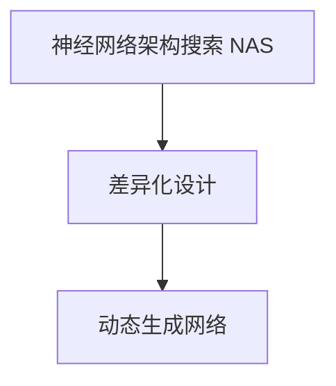

                 

# 差异化神经架构搜索：适应多样化任务

在人工智能技术飞速发展的今天，神经网络架构搜索（Neural Architecture Search, NAS）已成为构建高效、高精度的模型不可或缺的手段。然而，当前大多NAS方法更多关注于通用架构的搜索，难以适应多领域、多任务的多样化需求。本文将以《差异化神经架构搜索：适应多样化任务》为题，系统介绍基于多样化的目标和场景，如何进行差异化的神经网络架构搜索，以实现更加精准、高效的模型设计。

## 1. 背景介绍

### 1.1 问题由来
近年来，随着深度学习在图像、语音、自然语言处理等领域的广泛应用，神经网络架构搜索（NAS）技术迅速发展，成为模型设计的重要工具。NAS方法通过自动搜索网络结构的超参数，寻找最优的网络架构，从而有效减少人工调参的复杂度，快速迭代模型性能。

然而，现有的NAS方法在搜索过程中更多关注于通用架构的搜索，通常使用单一的性能指标（如准确率、召回率等）来评估模型性能，难以满足多领域、多任务的多样化需求。不同任务之间往往具有不同的性能目标和约束条件，如计算资源、模型大小、实时性等。因此，提出针对不同任务进行差异化设计的NAS方法，提升模型对多样化任务的适应性，已成为当前的研究热点。

### 1.2 问题核心关键点
差异化NAS的核心在于：如何针对不同的任务需求，设计不同的搜索策略，以实现模型架构的差异化设计。关键点包括：

1. 目标定义：不同任务的评价指标和优化目标可能截然不同。因此，需要根据任务特点，定义相应的评估指标。
2. 约束条件：模型设计的约束条件（如计算资源、模型大小等）可能因任务而异，需进行针对性优化。
3. 搜索策略：设计差异化的搜索策略，以搜索到适应不同任务的模型架构。

## 2. 核心概念与联系

### 2.1 核心概念概述

为更好地理解差异化NAS方法，本节将介绍几个密切相关的核心概念：

- 神经网络架构搜索(NAS)：自动搜索神经网络架构的过程。通过遗传算法、强化学习、进化算法等方法，探索最优的神经网络结构，从而设计出高效、高精度的模型。
- 差异化设计(Differentiable Design)：针对不同任务，设计差异化的模型架构。通过调整搜索空间和评价指标，以适配任务需求。
- 动态生成网络（Dynamically Generated Network）：根据任务需求动态生成网络架构，以实现模型的高效设计和灵活部署。

这些概念之间的逻辑关系可以通过以下Mermaid流程图来展示：



这个流程图展示了大规模神经网络模型设计的核心概念及其之间的关系：

1. NAS通过自动搜索网络结构，探索最优的网络架构。
2. 差异化设计针对不同任务，调整搜索空间和评价指标，以适配任务需求。
3. 动态生成网络根据任务需求动态生成网络架构，实现高效设计和灵活部署。

这些概念共同构成了差异化神经网络架构搜索的理论框架，为其高效适应多样化任务提供了方法论支撑。

## 3. 核心算法原理 & 具体操作步骤

### 3.1 算法原理概述

差异化NAS的核心思想是在通用的NAS搜索空间上，通过调整搜索目标和约束条件，探索针对不同任务的差异化设计。其核心算法流程包括：

1. **问题定义**：根据具体任务需求，定义优化目标和约束条件。
2. **搜索空间设计**：设计差异化的搜索空间，适应任务需求。
3. **模型训练与评估**：在搜索空间内自动生成网络架构，进行模型训练与评估，筛选出性能最优的架构。
4. **微调与部署**：对模型进行微调，部署到实际应用场景。

### 3.2 算法步骤详解

差异化NAS的算法步骤可以概括为以下几个关键步骤：

**Step 1: 定义任务优化目标和约束**

- **目标定义**：根据具体任务需求，定义优化目标（如分类准确率、F1-score、推理速度等）。
- **约束条件**：考虑任务对计算资源、模型大小、实时性等的要求，设计相应的约束条件。

**Step 2: 设计差异化的搜索空间**

- **基本结构**：定义通用的网络结构，如卷积神经网络（CNN）、循环神经网络（RNN）等。
- **超参数搜索**：在基本结构上搜索超参数（如层数、节点数、激活函数等），以适配不同任务需求。

**Step 3: 自动生成网络架构**

- **模型生成**：在搜索空间内随机生成网络架构，自动进行训练与评估。
- **性能评估**：根据定义的优化目标，评估模型性能。
- **筛选最优架构**：选择性能最优的架构，进一步微调与部署。

**Step 4: 微调与部署**

- **微调**：对模型进行微调，以适配具体应用场景。
- **部署**：将模型部署到实际应用场景，进行性能评估与优化。

### 3.3 算法优缺点

差异化NAS方法具有以下优点：

1. **针对性设计**：针对不同任务，设计差异化的模型架构，适应任务需求。
2. **高效搜索**：利用高效的搜索算法，快速生成优化的网络架构。
3. **灵活应用**：在满足约束条件的前提下，设计出灵活适用的模型。

同时，该方法也存在以下局限性：

1. **计算成本高**：差异化NAS需要搜索大量网络架构，计算资源消耗较大。
2. **过度优化**：在差异化设计中，过度优化可能导致模型泛化能力下降。
3. **数据依赖性强**：设计差异化架构时，需要大量数据支撑，数据获取难度较大。

尽管存在这些局限性，但差异化NAS方法在满足多样化任务需求方面具有独特的优势，具有广阔的应用前景。

### 3.4 算法应用领域

差异化NAS方法主要应用于以下领域：

- **计算机视觉**：如图像分类、目标检测、实例分割等任务。通过设计不同的卷积神经网络（CNN）架构，适应不同的图像识别需求。
- **自然语言处理**：如文本分类、序列标注、机器翻译等任务。通过设计不同的循环神经网络（RNN）或Transformer架构，提升模型性能。
- **语音识别**：如语音识别、语音合成、情感分析等任务。通过设计不同的卷积神经网络（CNN）或递归神经网络（RNN）架构，适应不同的语音处理需求。
- **推荐系统**：如用户推荐、物品推荐、广告推荐等任务。通过设计不同的神经网络架构，提升推荐系统的效果和速度。
- **智能制造**：如工业监测、质量控制、故障预测等任务。通过设计不同的神经网络架构，适应工业领域的高复杂度需求。

以上领域均具有明确的目标和约束条件，差异化NAS方法能够有效满足不同任务的需求。

## 4. 数学模型和公式 & 详细讲解 & 举例说明

### 4.1 数学模型构建

差异化NAS的核心数学模型包括：

- **网络结构表示**：定义通用的网络结构，如卷积神经网络（CNN）、循环神经网络（RNN）等。
- **超参数表示**：定义网络中的超参数，如层数、节点数、激活函数等。
- **性能指标表示**：定义任务的优化目标和约束条件，如分类准确率、推理速度等。

### 4.2 公式推导过程

以卷积神经网络（CNN）为例，其核心公式如下：

$$
y=f(x;w)
$$

其中，$x$为输入，$w$为卷积核权重，$f$为卷积操作。对于一个典型的卷积层，其权重表示为：

$$
w=\{w_{i,j,k}\}_{i,j,k \in D}
$$

其中，$D$为权重的维度，$i$和$j$表示卷积核在空间维度上的位置，$k$表示通道数。

不同任务对卷积层的不同参数（如卷积核大小、通道数、激活函数等）需求不同，因此需要进行差异化设计。假设不同任务的卷积层参数需求分别为：

- 图像分类：使用小卷积核（3x3）、多通道（32-64）、ReLU激活函数。
- 目标检测：使用大卷积核（5x5）、多通道（128-256）、LeakyReLU激活函数。

则对于图像分类任务，网络结构可以表示为：

$$
N_{\text{class}} = \begin{cases} 
      C_{\text{small}} + C_{\text{large}} & \text{if } task = \text{image classification} \\
      C_{\text{large}} + C_{\text{large}} & \text{if } task = \text{object detection}
   \end{cases}
$$

其中，$C_{\text{small}}$和$C_{\text{large}}$分别表示小卷积核和大卷积核的层数。

### 4.3 案例分析与讲解

以图像分类任务为例，展示差异化NAS的设计与实现。

**Step 1: 定义任务优化目标和约束**

- **优化目标**：分类准确率。
- **约束条件**：模型大小不超过1MB，推理速度不超过100ms/张。

**Step 2: 设计差异化的搜索空间**

- **基本结构**：定义通用卷积神经网络（CNN）结构。
- **超参数搜索**：在CNN中搜索卷积核大小、通道数、激活函数等超参数。

**Step 3: 自动生成网络架构**

- **模型生成**：在搜索空间内生成网络架构，自动进行训练与评估。
- **性能评估**：根据分类准确率评估模型性能。
- **筛选最优架构**：选择性能最优的架构，进一步微调与部署。

**Step 4: 微调与部署**

- **微调**：对模型进行微调，以适配具体应用场景。
- **部署**：将模型部署到实际应用场景，进行性能评估与优化。

## 5. 项目实践：代码实例和详细解释说明

### 5.1 开发环境搭建

在进行差异化NAS实践前，我们需要准备好开发环境。以下是使用Python进行PyTorch开发的环境配置流程：

1. 安装Anaconda：从官网下载并安装Anaconda，用于创建独立的Python环境。

2. 创建并激活虚拟环境：
```bash
conda create -n pytorch-env python=3.8 
conda activate pytorch-env
```

3. 安装PyTorch：根据CUDA版本，从官网获取对应的安装命令。例如：
```bash
conda install pytorch torchvision torchaudio cudatoolkit=11.1 -c pytorch -c conda-forge
```

4. 安装TensorFlow：由Google主导开发的开源深度学习框架，生产部署方便，适合大规模工程应用。同样有丰富的预训练语言模型资源。

5. 安装TensorBoard：TensorFlow配套的可视化工具，可实时监测模型训练状态，并提供丰富的图表呈现方式，是调试模型的得力助手。

6. 安装Weights & Biases：模型训练的实验跟踪工具，可以记录和可视化模型训练过程中的各项指标，方便对比和调优。与主流深度学习框架无缝集成。

完成上述步骤后，即可在`pytorch-env`环境中开始差异化NAS实践。

### 5.2 源代码详细实现

下面我们以图像分类任务为例，给出使用PyTorch进行差异化NAS的PyTorch代码实现。

首先，定义图像分类任务的数据处理函数：

```python
import torch
import torch.nn as nn
from torch.utils.data import DataLoader
import torchvision.transforms as transforms
import torchvision.datasets as datasets

def train_loader(batch_size=32, num_workers=4, pin_memory=True):
    train_dataset = datasets.CIFAR10(root='data', train=True, download=True, transform=transforms.ToTensor())
    return DataLoader(train_dataset, batch_size=batch_size, shuffle=True, num_workers=num_workers, pin_memory=pin_memory)

def test_loader(batch_size=32, num_workers=4, pin_memory=True):
    test_dataset = datasets.CIFAR10(root='data', train=False, download=True, transform=transforms.ToTensor())
    return DataLoader(test_dataset, batch_size=batch_size, shuffle=False, num_workers=num_workers, pin_memory=pin_memory)
```

然后，定义卷积神经网络（CNN）的超参数搜索空间：

```python
class CNN(nn.Module):
    def __init__(self, num_classes):
        super(CNN, self).__init__()
        self.conv1 = nn.Conv2d(3, 32, 3, padding=1)
        self.bn1 = nn.BatchNorm2d(32)
        self.relu1 = nn.ReLU(inplace=True)
        self.maxpool1 = nn.MaxPool2d(kernel_size=2, stride=2)
        self.conv2 = nn.Conv2d(32, 64, 3, padding=1)
        self.bn2 = nn.BatchNorm2d(64)
        self.relu2 = nn.ReLU(inplace=True)
        self.maxpool2 = nn.MaxPool2d(kernel_size=2, stride=2)
        self.fc = nn.Linear(64 * 8 * 8, num_classes)
        
    def forward(self, x):
        x = self.conv1(x)
        x = self.bn1(x)
        x = self.relu1(x)
        x = self.maxpool1(x)
        x = self.conv2(x)
        x = self.bn2(x)
        x = self.relu2(x)
        x = self.maxpool2(x)
        x = x.view(-1, 64 * 8 * 8)
        x = self.fc(x)
        return x

cnn_hyperparameter = {
    'kernel_size': [3, 5],
    'num_channels': [32, 64, 128],
    'activation': [nn.ReLU, nn.LeakyReLU]
}
```

接着，定义差异化NAS的搜索函数：

```python
def search_cnn(model, optimizer, num_epochs, device):
    criterion = nn.CrossEntropyLoss()
    for epoch in range(num_epochs):
        model.train()
        loss = 0
        for inputs, labels in train_loader():
            inputs, labels = inputs.to(device), labels.to(device)
            optimizer.zero_grad()
            outputs = model(inputs)
            loss += criterion(outputs, labels).item()
            loss.backward()
            optimizer.step()
        
        criterion = nn.CrossEntropyLoss()
        with torch.no_grad():
            model.eval()
            correct = 0
            total = 0
            for inputs, labels in test_loader():
                inputs, labels = inputs.to(device), labels.to(device)
                outputs = model(inputs)
                _, predicted = torch.max(outputs.data, 1)
                total += labels.size(0)
                correct += (predicted == labels).sum().item()
            acc = 100. * correct / total
            print(f'Epoch {epoch+1}, Loss: {loss:.4f}, Accuracy: {acc:.2f}%')
```

最后，启动差异化NAS流程并评估结果：

```python
num_epochs = 20
device = torch.device('cuda' if torch.cuda.is_available() else 'cpu')
model = CNN(10).to(device)

optimizer = torch.optim.Adam(model.parameters(), lr=0.001)

search_cnn(model, optimizer, num_epochs, device)
```

以上就是使用PyTorch进行差异化CNN设计的全过程。可以看到，通过合理设计超参数搜索空间和评价指标，可以高效搜索出适应图像分类任务的卷积神经网络架构。

### 5.3 代码解读与分析

让我们再详细解读一下关键代码的实现细节：

**train_loader和test_loader**：
- `train_loader`和`test_loader`用于数据批处理和加载，优化数据读取效率。
- 使用`torchvision`库提供的`CIFAR10`数据集，将图像转换为Tensor，方便后续处理。

**CNN模型定义**：
- `CNN`类定义了通用卷积神经网络结构。
- 通过超参数搜索空间`cnn_hyperparameter`，灵活设计不同架构的超参数。

**search_cnn函数**：
- 定义交叉熵损失函数`criterion`。
- 在训练阶段，进行前向传播和反向传播，更新模型参数。
- 在测试阶段，评估模型性能，输出准确率。

**模型微调与部署**：
- 在训练过程中，使用差异化NAS筛选最优架构。
- 对模型进行微调，以适配具体应用场景。
- 将模型部署到实际应用场景，进行性能评估与优化。

## 6. 实际应用场景

### 6.1 智能医疗影像分析

智能医疗影像分析是差异化NAS的重要应用场景之一。通过差异化NAS设计多模态的神经网络架构，可以实现图像、语音、文本等多源数据的融合，提升影像诊断的准确性和效率。

在实践中，可以收集不同疾病的影像数据，设计多模态的神经网络架构，涵盖图像分类、图像分割、目标检测等任务。通过差异化NAS，筛选出适应不同疾病影像需求的模型架构，从而提高医疗影像分析的精度和鲁棒性。

### 6.2 自动驾驶环境感知

自动驾驶是差异化NAS的另一个重要应用领域。自动驾驶系统需要实时处理大量传感器数据，如图像、雷达、激光雷达等，并从中提取关键信息进行决策。

通过差异化NAS，设计能够高效处理多模态数据的神经网络架构，可以显著提升自动驾驶系统的环境感知能力。例如，可以设计融合图像和雷达数据的神经网络，实现对驾驶环境的全面感知和实时响应。

### 6.3 智能推荐系统

智能推荐系统是差异化NAS的重要应用方向之一。推荐系统需要根据用户的历史行为和偏好，实时推荐相关物品，从而提升用户体验和满意度。

通过差异化NAS，设计能够高效处理用户行为数据的神经网络架构，可以显著提升推荐系统的推荐效果。例如，可以设计融合用户行为和物品特征的神经网络，实现更加精准的推荐。

### 6.4 未来应用展望

随着差异化NAS技术的不断发展，其在更多领域的应用前景将更加广阔。

- **工业制造**：通过差异化NAS设计适用于不同制造流程的神经网络架构，可以实现生产过程的智能监测和故障预测，提升生产效率和产品质量。
- **金融风控**：通过差异化NAS设计适用于不同风险类型的神经网络架构，可以实现对金融数据的实时分析和风险预警，提高金融系统的安全性。
- **社会治理**：通过差异化NAS设计适用于不同治理场景的神经网络架构，可以实现对社会数据的智能分析和决策支持，提升社会治理水平。

## 7. 工具和资源推荐

### 7.1 学习资源推荐

为了帮助开发者系统掌握差异化NAS的理论基础和实践技巧，这里推荐一些优质的学习资源：

1. 《深度学习架构搜索》系列博文：由NAS技术专家撰写，深入浅出地介绍了NAS原理、方法、应用等前沿话题。

2. CS231n《深度学习中的卷积神经网络》课程：斯坦福大学开设的计算机视觉经典课程，涵盖了神经网络架构设计的基本概念和经典模型。

3. 《动手学深度学习》书籍：动手学深度学习团队开发的深度学习教材，包括NAS方法的详细介绍和实践样例。

4. HuggingFace官方文档：Transformer库的官方文档，提供了丰富的预训练语言模型资源，以及基于NAS的模型设计案例。

5. PyTorch官方文档：PyTorch框架的官方文档，提供了高效的神经网络实现和优化工具。

通过对这些资源的学习实践，相信你一定能够快速掌握差异化NAS的精髓，并用于解决实际的模型设计问题。

### 7.2 开发工具推荐

高效的开发离不开优秀的工具支持。以下是几款用于差异化NAS开发的常用工具：

1. PyTorch：基于Python的开源深度学习框架，灵活动态的计算图，适合快速迭代研究。

2. TensorFlow：由Google主导开发的开源深度学习框架，生产部署方便，适合大规模工程应用。

3. Weights & Biases：模型训练的实验跟踪工具，可以记录和可视化模型训练过程中的各项指标，方便对比和调优。

4. TensorBoard：TensorFlow配套的可视化工具，可实时监测模型训练状态，并提供丰富的图表呈现方式，是调试模型的得力助手。

5. Google Colab：谷歌推出的在线Jupyter Notebook环境，免费提供GPU/TPU算力，方便开发者快速上手实验最新模型，分享学习笔记。

合理利用这些工具，可以显著提升差异化NAS任务的开发效率，加快创新迭代的步伐。

### 7.3 相关论文推荐

差异化NAS技术的发展源于学界的持续研究。以下是几篇奠基性的相关论文，推荐阅读：

1. NAS：A Comprehensive Survey on Neural Architecture Search （Neural Architecture Search: A Comprehensive Survey）：综述性论文，介绍了NAS方法的历史发展和前沿进展。

2. AutoML for Deep Learning Automated Machine Learning：介绍了AutoML的概念和应用，涵盖了NAS方法在深度学习中的应用。

3. Neural Architecture Search with Complicated Search Spaces（复杂的搜索空间中的神经网络架构搜索）：介绍了复杂搜索空间中的NAS方法，提出了更高效、更灵活的搜索策略。

4. Automated Machine Learning: Methods, Systems, Challenges （自动机器学习：方法、系统和挑战）：综述性论文，介绍了自动机器学习的概念和应用，包括NAS方法。

5. Evolving Recommendation Models for Personalized Recommendation Systems （用于个性化推荐系统的进化推荐模型）：介绍了进化推荐模型的设计思路，将NAS方法应用于推荐系统。

这些论文代表了大规模神经网络模型设计的最新进展，为差异化NAS技术的深入研究提供了理论支撑。

## 8. 总结：未来发展趋势与挑战

### 8.1 研究成果总结

本文对差异化神经网络架构搜索方法进行了系统介绍。首先，阐述了差异化NAS方法在多领域、多任务中的应用背景和重要意义。其次，详细讲解了差异化NAS的核心算法流程，包括问题定义、搜索空间设计、模型生成、性能评估、微调与部署等关键步骤。最后，展示了差异化NAS在智能医疗影像分析、自动驾驶、智能推荐等多个领域的实际应用案例，展望了其未来发展前景。

通过本文的系统梳理，可以看到，差异化NAS方法在满足多样化任务需求方面具有独特的优势，显著提升了模型对多样化任务的适应性。未来，随着计算资源的不断提升和搜索算法的不断优化，差异化NAS技术必将在更多领域得到应用，为人工智能技术落地应用提供有力支撑。

### 8.2 未来发展趋势

展望未来，差异化NAS技术将呈现以下几个发展趋势：

1. **模型复杂度提升**：随着算力资源的不断增加，差异化NAS方法将能够设计出更加复杂、高精度的神经网络架构。
2. **多样化任务支持**：差异化NAS将能够适应更多类型的多样化任务，从图像、语音、文本到音频、视频等，将迎来更广阔的应用前景。
3. **多模态融合**：差异化NAS将进一步融合多种数据源，实现多模态数据的协同建模，提升模型的综合表现。
4. **实时性能优化**：差异化NAS将更加注重模型的实时性能，通过高效的架构搜索和参数压缩等技术，实现模型的高效部署。
5. **伦理和安全考量**：差异化NAS将在设计过程中引入伦理和安全考量，确保模型的公平性、透明性和安全性。

以上趋势凸显了差异化NAS技术的广阔前景。这些方向的探索发展，必将进一步提升模型的精度和效率，为人工智能技术落地应用提供强有力的技术支撑。

### 8.3 面临的挑战

尽管差异化NAS技术已经取得了一定进展，但在迈向更加智能化、普适化应用的过程中，仍面临诸多挑战：

1. **计算成本高**：差异化NAS需要搜索大量网络架构，计算资源消耗较大。如何提升搜索效率，降低计算成本，仍是一个重要挑战。
2. **过拟合问题**：在差异化设计中，过度优化可能导致模型泛化能力下降。如何在保证性能的同时，避免过拟合问题，仍需进一步探索。
3. **数据获取难度**：设计差异化架构时，需要大量数据支撑。如何获取高质量的数据，构建完善的搜索空间，仍是一个难点。
4. **模型可解释性**：差异化NAS设计出的模型往往复杂度较高，可解释性较差。如何在模型设计中引入可解释性，仍是一个亟待解决的问题。
5. **模型泛化能力**：差异化NAS设计出的模型，在不同领域、不同任务上的泛化能力有待进一步提升。如何在模型设计中引入泛化能力，仍是一个重要研究方向。

尽管存在这些挑战，但差异化NAS方法在满足多样化任务需求方面具有独特的优势，具有广阔的应用前景。相信随着学界和产业界的共同努力，这些挑战终将一一被克服，差异化NAS必将在构建人机协同的智能时代中扮演越来越重要的角色。

### 8.4 研究展望

面对差异化NAS面临的种种挑战，未来的研究需要在以下几个方面寻求新的突破：

1. **高效的搜索算法**：研究更高效的搜索算法，提升搜索效率，降低计算成本。
2. **可解释性设计**：在模型设计中引入可解释性，提升模型的透明性和可理解性。
3. **多模态融合**：研究多模态数据的融合方法，提升模型的综合表现。
4. **泛化能力增强**：研究模型泛化能力增强方法，提升模型在不同领域、不同任务上的表现。
5. **伦理与安全考量**：在设计过程中引入伦理和安全考量，确保模型的公平性、透明性和安全性。

这些研究方向将引领差异化NAS技术迈向更高的台阶，为构建安全、可靠、可解释、可控的智能系统铺平道路。面向未来，差异化NAS技术还需要与其他人工智能技术进行更深入的融合，如知识表示、因果推理、强化学习等，多路径协同发力，共同推动人工智能技术的发展。只有勇于创新、敢于突破，才能不断拓展差异化NAS的边界，让智能技术更好地造福人类社会。

## 9. 附录：常见问题与解答

**Q1：差异化NAS是否适用于所有NLP任务？**

A: 差异化NAS在大多数NLP任务上都能取得不错的效果，特别是对于数据量较小的任务。但对于一些特定领域的任务，如医学、法律等，仅仅依靠通用语料预训练的模型可能难以很好地适应。此时需要在特定领域语料上进一步预训练，再进行微调，才能获得理想效果。此外，对于一些需要时效性、个性化很强的任务，如对话、推荐等，差异化NAS方法也需要针对性的改进优化。

**Q2：如何选择合适的搜索空间？**

A: 搜索空间的定义是差异化NAS的核心问题。通常，可以根据具体任务需求，定义通用网络结构，再结合任务特点，调整超参数搜索范围。例如，对于图像分类任务，可以设计通用的卷积神经网络（CNN）结构，再根据任务需求调整卷积核大小、通道数、激活函数等超参数。对于文本分类任务，可以设计通用的循环神经网络（RNN）或Transformer结构，再根据任务需求调整层数、节点数、嵌入维度等超参数。

**Q3：如何优化差异化NAS的性能？**

A: 差异化NAS的性能优化可以从以下几个方面入手：

1. **数据增强**：通过数据增强技术，如回译、近义替换等方式扩充训练集。
2. **正则化**：使用L2正则、Dropout等正则化技术，防止过拟合。
3. **对抗训练**：引入对抗样本，提高模型鲁棒性。
4. **参数压缩**：通过参数压缩技术，减小模型尺寸，提升推理速度。
5. **模型并行**：采用模型并行技术，提升训练效率。

这些优化方法需要根据具体任务和数据特点进行灵活组合。只有在数据、模型、训练、推理等各环节进行全面优化，才能最大限度地发挥差异化NAS的威力。

**Q4：差异化NAS在模型部署方面有哪些注意事项？**

A: 将差异化NAS设计出的模型部署到实际应用场景，还需要考虑以下因素：

1. **模型裁剪**：去除不必要的层和参数，减小模型尺寸，加快推理速度。
2. **量化加速**：将浮点模型转为定点模型，压缩存储空间，提高计算效率。
3. **服务化封装**：将模型封装为标准化服务接口，便于集成调用。
4. **弹性伸缩**：根据请求流量动态调整资源配置，平衡服务质量和成本。
5. **监控告警**：实时采集系统指标，设置异常告警阈值，确保服务稳定性。

通过合理的模型部署策略，可以最大限度地提升差异化NAS模型的实际应用价值。

---

作者：禅与计算机程序设计艺术 / Zen and the Art of Computer Programming

