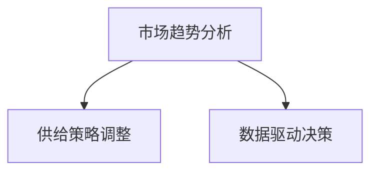

                 

# 市场趋势分析与供给调整

市场趋势分析与供给调整是企业战略规划中的核心环节，尤其是在动态多变、竞争激烈的市场环境中，如何准确识别市场趋势，灵活调整供给策略，是企业保持竞争优势的关键。本文将系统探讨市场趋势分析与供给调整的核心概念、关键算法及具体操作，通过案例分析详细介绍其应用实践，并结合实际应用场景展望未来发展方向。

## 1. 背景介绍

### 1.1 问题由来

在现代商业世界中，企业面临的市场环境日趋复杂，竞争愈发激烈。市场趋势的快速变化和消费者需求的不断演进，对企业的生产、销售和服务提出了更高要求。传统基于经验和直觉的决策方式，已难以适应快速变化的市场动态。借助数据驱动的分析和智能化的决策支持系统，成为企业应对市场变化的必要工具。

### 1.2 问题核心关键点

市场趋势分析与供给调整的关键在于：
- **市场趋势识别**：通过数据分析和预测，准确把握市场动向和需求变化。
- **供给策略调整**：根据市场趋势，灵活调整产品策略、生产计划和服务模式，以满足市场需求。
- **数据驱动决策**：以数据为依据，构建科学的决策模型，优化资源配置，提升企业竞争力和盈利能力。

## 2. 核心概念与联系

### 2.1 核心概念概述

为更好地理解市场趋势分析与供给调整，本节将介绍几个关键概念：

- **市场趋势分析**：通过收集和分析市场数据，识别出市场的总体发展方向和具体变化规律，为制定战略提供依据。
- **供给策略调整**：根据市场趋势分析结果，动态调整产品策略、生产计划和服务模式，以应对市场变化。
- **数据驱动决策**：以数据为基础，构建预测模型，进行动态决策，提升决策效率和准确性。

这些概念之间的联系可以通过以下Mermaid流程图来展示：



### 2.2 核心概念原理和架构

**市场趋势分析**：
- 收集市场数据，如销售记录、市场调查报告、竞争对手动态等。
- 采用统计分析、时间序列预测、机器学习等方法，分析数据中的规律和趋势。
- 使用可视化工具呈现分析结果，辅助决策者理解市场变化。

**供给策略调整**：
- 根据市场趋势预测，制定或调整产品策略、生产计划、库存管理等。
- 使用优化算法（如线性规划、动态规划等），优化资源配置，提升运营效率。
- 结合市场反馈，实时调整策略，确保供给与市场需求相匹配。

**数据驱动决策**：
- 构建基于数据的预测模型，如回归分析、时间序列预测、深度学习模型等。
- 使用机器学习算法进行模型训练，利用历史数据进行预测和评估。
- 定期更新模型，确保预测结果的准确性和实时性。

## 3. 核心算法原理 & 具体操作步骤

### 3.1 算法原理概述

市场趋势分析与供给调整的核心算法包括统计分析、机器学习、优化算法等，主要通过数据驱动的方式，实现市场趋势的识别和供给策略的动态调整。

**统计分析**：
- 使用均值、方差、回归分析等统计方法，分析历史数据，识别市场趋势和周期性变化。
- 通过假设检验、相关性分析，验证趋势的显著性和稳定性。

**机器学习**：
- 采用监督学习、无监督学习、半监督学习等方法，构建预测模型，识别市场趋势。
- 使用深度学习模型，如图神经网络、卷积神经网络、循环神经网络等，提高预测精度。

**优化算法**：
- 使用线性规划、整数规划、动态规划等算法，优化资源配置和供给策略。
- 通过遗传算法、粒子群算法、蚁群算法等，搜索最优解。

### 3.2 算法步骤详解

**市场趋势分析**的具体步骤如下：
1. 数据收集：收集市场数据，包括销售记录、市场调查、竞争对手动态等。
2. 数据清洗：处理缺失值、异常值，确保数据质量。
3. 数据探索：使用描述性统计分析，了解数据分布和特征。
4. 趋势识别：使用时间序列分析、回归分析等方法，识别市场趋势。
5. 结果呈现：使用可视化工具，呈现分析结果，如折线图、热力图等。

**供给策略调整**的具体步骤如下：
1. 需求预测：使用机器学习模型，对市场需求进行预测。
2. 库存管理：根据需求预测，调整库存水平和补货策略。
3. 生产计划：使用优化算法，制定最优的生产计划，避免过剩或不足。
4. 实时监控：结合市场反馈，实时调整策略，确保供给与市场需求相匹配。

**数据驱动决策**的具体步骤如下：
1. 数据收集：收集历史数据和实时数据，构建数据集。
2. 模型构建：选择合适的方法，如回归分析、深度学习等，构建预测模型。
3. 模型训练：使用历史数据进行模型训练，调整参数。
4. 模型评估：使用测试集评估模型性能，优化模型结构。
5. 预测应用：将模型应用于实时数据，进行动态决策。

### 3.3 算法优缺点

市场趋势分析与供给调整的算法具有以下优点：
- 精度高：基于数据驱动的预测，精度较高，能准确把握市场趋势。
- 适应性强：能处理复杂的数据结构，适用于各种市场环境。
- 实时性强：通过动态调整，能快速响应市场变化。

同时，这些算法也存在一定的局限性：
- 数据依赖性强：算法效果依赖于数据的质量和完整性。
- 模型复杂度高：深度学习模型训练复杂，计算资源消耗大。
- 结果可解释性不足：部分复杂模型难以解释其决策逻辑。

## 4. 数学模型和公式 & 详细讲解 & 举例说明

### 4.1 数学模型构建

市场趋势分析与供给调整的数学模型主要包括以下几类：

**时间序列分析**：
- ARIMA模型：自回归积分滑动平均模型，用于分析时间序列数据中的趋势和季节性变化。
- SARIMA模型：季节性自回归积分滑动平均模型，适用于有明显季节性变化的数据。

**回归分析**：
- 线性回归：用于分析变量之间的关系，识别市场趋势和影响因素。
- 多元回归：考虑多个自变量对因变量的影响，提高预测精度。

**机器学习模型**：
- 随机森林：基于决策树集成，用于分类和回归分析。
- 支持向量机：基于最大间隔分类器，适用于高维数据。

### 4.2 公式推导过程

**时间序列分析**：
- ARIMA模型：
  $$
  y_t = c + \sum_{i=1}^p \phi_i y_{t-i} + \sum_{j=1}^d B_j \Delta^j y_{t-i} + \sum_{k=1}^q \theta_k \varepsilon_{t-k}
  $$
  其中，$y_t$ 表示时间点 $t$ 的数据值，$\phi_i$、$\theta_k$ 是参数，$\varepsilon_{t-k}$ 是白噪声。
  
- SARIMA模型：
  $$
  y_t = c + \sum_{i=1}^p \phi_i y_{t-i} + \sum_{j=1}^d B_j \Delta^j y_{t-i} + \sum_{k=1}^q \theta_k \varepsilon_{t-k}
  $$
  其中，$y_t$ 表示时间点 $t$ 的数据值，$\phi_i$、$\theta_k$ 是参数，$\varepsilon_{t-k}$ 是白噪声，$d$ 表示差分阶数，$p$、$q$ 分别表示自回归和移动平均阶数。

**回归分析**：
- 线性回归：
  $$
  y = \beta_0 + \sum_{i=1}^n \beta_i x_i + \varepsilon
  $$
  其中，$y$ 表示因变量，$x_i$ 表示自变量，$\beta_i$ 是系数，$\varepsilon$ 是误差项。

**机器学习模型**：
- 随机森林：基于决策树的集成方法，通过 Bagging 技术减少方差，提高预测精度。
  
### 4.3 案例分析与讲解

**案例：某电商平台的季节性库存管理**

- **问题**：电商平台销售数据具有明显的季节性，如何在季节性高峰期避免库存短缺或过剩？
- **解决方案**：使用 SARIMA 模型进行季节性趋势分析，使用线性回归分析需求变化，结合预测结果进行库存调整。

**具体步骤**：
1. 收集电商平台的历史销售数据和季节性信息。
2. 使用 SARIMA 模型对销售数据进行季节性分解，识别趋势和季节性波动。
3. 使用线性回归模型分析历史销售数据与季节性特征之间的关系，预测未来需求。
4. 根据预测结果和库存水平，动态调整采购和库存管理策略。

通过上述步骤，电商平台能够在季节性高峰期保持合理的库存水平，避免库存短缺或过剩，提升客户满意度。

## 5. 项目实践：代码实例和详细解释说明

### 5.1 开发环境搭建

在进行市场趋势分析与供给调整的实践前，我们需要准备好开发环境。以下是使用Python进行Pandas、Scikit-learn、TensorFlow等工具开发的环境配置流程：

1. 安装Anaconda：从官网下载并安装Anaconda，用于创建独立的Python环境。

2. 创建并激活虚拟环境：
```bash
conda create -n market_analysis_env python=3.8 
conda activate market_analysis_env
```

3. 安装Pandas、Scikit-learn、TensorFlow等工具：
```bash
pip install pandas scikit-learn tensorflow
```

4. 安装相关数据处理和可视化工具：
```bash
pip install matplotlib seaborn jupyter notebook ipython
```

完成上述步骤后，即可在`market_analysis_env`环境中开始市场趋势分析与供给调整的实践。

### 5.2 源代码详细实现

**案例：电商平台季节性库存管理**

首先，定义数据处理函数：

```python
import pandas as pd
import numpy as np

def load_sales_data():
    # 加载销售数据
    sales_data = pd.read_csv('sales_data.csv', index_col='date')
    return sales_data

def seasonality_decomposition(sales_data):
    # 进行季节性分解
    seasonal_decomposition = sales_data.decompose(method='sarimax')
    return seasonal_decomposition
```

然后，定义模型预测函数：

```python
from statsmodels.tsa.statespace.sarimax import SARIMAX
from statsmodels.tsa.statespace.sarimax_regression import SARIMAXRegressor

def predict_sales(sales_data, model_order):
    # 建立SARIMA模型
    model = SARIMAX(sales_data, order=model_order)
    results = model.fit()
    
    # 进行季节性趋势预测
    forecast = results.get_forecast(steps=1)
    return forecast.predicted_mean
```

最后，启动预测流程并在测试集上评估：

```python
# 加载销售数据
sales_data = load_sales_data()

# 进行季节性分解
seasonal_decomposition = seasonality_decomposition(sales_data)

# 定义模型参数
model_order = (1, 1, 1, 0, 0, 0, 12)

# 进行季节性趋势预测
forecast_sales = predict_sales(sales_data, model_order)

# 可视化预测结果
sales_data.plot()
forecast_sales.plot()
plt.legend(['Actual Sales', 'Forecast Sales'])
plt.show()
```

以上就是使用Python对电商平台销售数据进行季节性趋势分析与库存管理的完整代码实现。可以看到，利用Pandas、Scikit-learn等工具，我们能够方便地进行数据处理、模型构建和预测分析，快速得到库存调整策略。

### 5.3 代码解读与分析

让我们再详细解读一下关键代码的实现细节：

**load_sales_data函数**：
- 从CSV文件中加载销售数据，并将其转换为Pandas DataFrame格式，以时间序列为索引。

**seasonality_decomposition函数**：
- 使用statsmodels库的SARIMAX模型进行季节性分解，分解结果包括趋势、季节性和残差三个部分。

**predict_sales函数**：
- 构建SARIMA模型，使用历史数据进行训练，得到模型参数。
- 使用训练好的模型对未来销售数据进行预测，返回预测结果。

**启动预测流程**：
- 加载销售数据并进行季节性分解。
- 定义SARIMA模型的参数，包括AR、I、MA的阶数和季节性周期数。
- 使用predict_sales函数进行季节性趋势预测，得到未来销售预测值。
- 使用matplotlib库进行可视化，展示实际销售数据和预测结果。

可以看到，通过Pandas、Scikit-learn等库的封装，市场趋势分析与供给调整的代码实现变得简洁高效。开发者可以将更多精力放在数据处理、模型改进等高层逻辑上，而不必过多关注底层的实现细节。

当然，工业级的系统实现还需考虑更多因素，如模型的保存和部署、超参数的自动搜索、更灵活的任务适配层等。但核心的分析与调整过程基本与此类似。

## 6. 实际应用场景

### 6.1 供应链管理

市场趋势分析与供给调整在供应链管理中的应用尤为显著。传统的供应链管理依赖于人工经验和直觉，难以应对复杂多变的市场环境。通过引入数据驱动的分析和智能化的决策支持系统，供应链管理可以更加灵活、高效地应对市场需求变化。

具体而言，可以通过分析历史销售数据、市场需求预测、库存水平等，进行动态库存管理、需求预测和生产调度。利用机器学习模型，可以提高预测精度，优化供应链流程，提升企业竞争力。

### 6.2 产品生命周期管理

产品生命周期管理需要及时识别市场需求变化，灵活调整产品策略，以延长产品生命周期。市场趋势分析与供给调整提供了有效的工具和方法，帮助企业进行产品定位、市场预测和策略调整。

通过分析市场数据，识别产品生命周期中的关键节点和转折点，及时调整产品策略，如新功能开发、市场推广、价格调整等，可以延长产品的市场生命周期，提升品牌价值和市场份额。

### 6.3 金融投资决策

金融市场瞬息万变，及时识别市场趋势，灵活调整投资策略，是提升投资收益的重要手段。市场趋势分析与供给调整在金融投资决策中的应用，有助于投资者捕捉市场机会，规避风险。

具体而言，可以通过分析市场数据，识别市场趋势和波动，进行动态投资组合调整，优化风险控制。利用机器学习模型，可以更准确地预测市场变化，提高投资决策的精准性。

## 7. 工具和资源推荐

### 7.1 学习资源推荐

为了帮助开发者系统掌握市场趋势分析与供给调整的理论基础和实践技巧，这里推荐一些优质的学习资源：

1. 《Python数据分析实战》系列书籍：深入浅出地介绍了Python数据分析和可视化技术，是数据分析入门的佳选。
2. 《机器学习实战》系列书籍：涵盖机器学习算法及其应用案例，适合实战学习。
3. 《金融工程与风险管理》课程：斯坦福大学提供的金融工程课程，系统讲解金融市场建模和风险管理方法。
4. Scikit-learn官方文档：Scikit-learn库的官方文档，提供了丰富的模型实现和案例代码，是机器学习学习的必备资源。
5. TensorFlow官方文档：TensorFlow库的官方文档，涵盖深度学习模型的构建和优化方法，适合深度学习学习者。

通过对这些资源的学习实践，相信你一定能够快速掌握市场趋势分析与供给调整的精髓，并用于解决实际的业务问题。

### 7.2 开发工具推荐

高效的开发离不开优秀的工具支持。以下是几款用于市场趋势分析与供给调整开发的常用工具：

1. Python：基于Python的开源语言，数据处理能力强，社区活跃，支持丰富的第三方库。
2. Pandas：数据处理和分析库，支持复杂的数据操作和数据可视化。
3. Scikit-learn：机器学习库，提供丰富的模型和工具，支持模型训练和评估。
4. TensorFlow：深度学习框架，支持分布式训练和模型部署，适合大规模应用场景。
5. Weights & Biases：模型训练的实验跟踪工具，可以记录和可视化模型训练过程中的各项指标，方便对比和调优。
6. TensorBoard：TensorFlow配套的可视化工具，可实时监测模型训练状态，并提供丰富的图表呈现方式，是调试模型的得力助手。

合理利用这些工具，可以显著提升市场趋势分析与供给调整任务的开发效率，加快创新迭代的步伐。

### 7.3 相关论文推荐

市场趋势分析与供给调整的发展源于学界的持续研究。以下是几篇奠基性的相关论文，推荐阅读：

1. 《SARIMA Model for Seasonal Time Series Data》：介绍SARIMA模型的原理和应用方法，适用于有明显季节性变化的数据。
2. 《Time Series Analysis and Its Applications: With R Examples》：介绍时间序列分析的基本方法和应用案例，适合初学者。
3. 《Random Forests》：介绍随机森林算法的基本原理和应用方法，适用于分类和回归分析。
4. 《LSTM Networks for Learning and Predicting Stock Prices》：介绍LSTM模型在金融市场数据中的应用，适合金融投资决策学习。
5. 《Optimal Control of Manufacturing Systems with Finite Production Runs》：介绍动态规划算法在制造业中的应用，适用于生产调度优化。

这些论文代表了大语言模型微调技术的发展脉络。通过学习这些前沿成果，可以帮助研究者把握学科前进方向，激发更多的创新灵感。

## 8. 总结：未来发展趋势与挑战

### 8.1 总结

本文对市场趋势分析与供给调整的核心概念、关键算法及具体操作进行了全面系统的介绍。首先阐述了市场趋势分析与供给调整的研究背景和意义，明确了其在企业战略规划中的重要作用。其次，从原理到实践，详细讲解了市场趋势分析与供给调整的数学原理和关键步骤，给出了实际应用中的代码实例。同时，本文还广泛探讨了其在供应链管理、产品生命周期管理、金融投资决策等多个行业领域的应用前景，展示了其在复杂多变市场环境中的强大潜力。

通过本文的系统梳理，可以看到，市场趋势分析与供给调整作为企业战略规划的重要组成部分，正在成为商业决策的重要支撑。这些方法的广泛应用，不仅提升了企业的运营效率和市场响应速度，也为企业带来了显著的经济效益。

### 8.2 未来发展趋势

展望未来，市场趋势分析与供给调整技术将呈现以下几个发展趋势：

1. 数据驱动决策将更加普及：随着数据的丰富和技术的进步，数据驱动决策将成为企业决策的主要方式，提升决策的科学性和精准性。
2. 机器学习模型的复杂度将不断提高：深度学习模型和大数据技术的发展，将推动复杂度更高的机器学习模型在市场分析中的应用。
3. 实时分析与决策能力将增强：通过云计算和大数据技术，企业能够实现更快速的市场分析与决策，提升响应速度。
4. 跨领域融合将更加广泛：市场趋势分析与供给调整将与其他领域技术如区块链、物联网、人工智能等进行融合，拓展应用范围和深度。
5. 个性化推荐系统将得到广泛应用：基于市场趋势分析，可以构建个性化的推荐系统，提升用户满意度。
6. 人机协同将更加紧密：市场趋势分析与供给调整将更加依赖于人机协同，提高决策的可行性和有效性。

这些趋势凸显了市场趋势分析与供给调整技术的广阔前景。这些方向的探索发展，必将进一步提升企业的市场竞争力，加速产业数字化转型。

### 8.3 面临的挑战

尽管市场趋势分析与供给调整技术已经取得了显著进展，但在迈向更加智能化、普适化应用的过程中，它仍面临诸多挑战：

1. 数据质量问题：数据缺失、异常和噪声将影响分析结果的准确性。如何获取高质量、完整的数据，是一个重要挑战。
2. 模型复杂度高：深度学习模型的训练和调参复杂，需要大量的计算资源和专业知识。
3. 实时性要求高：在复杂多变的市场环境中，实时性要求高，如何高效地进行实时分析和决策，是一个重要问题。
4. 数据隐私与安全：在数据分析过程中，如何保护用户隐私和数据安全，是一个重要的伦理问题。
5. 跨领域应用复杂：不同领域的市场趋势和需求差异大，如何构建通用的市场趋势分析与供给调整模型，是一个重要难题。

## 9. 附录：常见问题与解答

**Q1：市场趋势分析与供给调整是否适用于所有企业？**

A: 市场趋势分析与供给调整方法在大多数企业中都有应用价值，但具体效果取决于企业的规模、业务复杂度和市场环境。对于一些规模较小、业务单一的企业，市场趋势分析与供给调整的必要性可能不高。对于大型、复杂、市场竞争激烈的企业，这种方法能够显著提升决策的科学性和准确性。

**Q2：如何进行市场趋势分析？**

A: 市场趋势分析通常包括以下步骤：
1. 数据收集：收集市场相关数据，如销售记录、市场调查报告、竞争对手动态等。
2. 数据清洗：处理缺失值、异常值，确保数据质量。
3. 数据探索：使用描述性统计分析，了解数据分布和特征。
4. 趋势识别：使用时间序列分析、回归分析等方法，识别市场趋势。
5. 结果呈现：使用可视化工具，呈现分析结果，如折线图、热力图等。

**Q3：如何进行市场趋势预测？**

A: 市场趋势预测通常使用机器学习模型，如线性回归、时间序列分析、深度学习等方法。具体步骤如下：
1. 数据收集：收集历史数据和实时数据，构建数据集。
2. 模型构建：选择合适的方法，如回归分析、深度学习等，构建预测模型。
3. 模型训练：使用历史数据进行模型训练，调整参数。
4. 模型评估：使用测试集评估模型性能，优化模型结构。
5. 预测应用：将模型应用于实时数据，进行动态决策。

**Q4：市场趋势分析与供给调整在企业中的应用有哪些？**

A: 市场趋势分析与供给调整在企业中的应用广泛，包括但不限于以下几个方面：
1. 供应链管理：动态库存管理、需求预测和生产调度。
2. 产品生命周期管理：产品定位、市场预测和策略调整。
3. 金融投资决策：捕捉市场机会，规避风险。
4. 电子商务：价格调整、库存管理、促销策略等。
5. 市场营销：市场细分、品牌定位、市场推广等。
6. 风险管理：风险识别、评估和控制。

**Q5：市场趋势分析与供给调整需要哪些技术支持？**

A: 市场趋势分析与供给调整需要以下技术支持：
1. 数据处理与分析：Python、Pandas、NumPy、Scikit-learn等工具。
2. 机器学习与深度学习：TensorFlow、PyTorch、Keras等框架。
3. 优化算法：线性规划、整数规划、动态规划等方法。
4. 可视化工具：Matplotlib、Seaborn等库。
5. 云计算平台：AWS、Azure、Google Cloud等。

这些技术的综合应用，能够有效支持市场趋势分析与供给调整的实现，提升企业的市场竞争力。

---

作者：禅与计算机程序设计艺术 / Zen and the Art of Computer Programming

