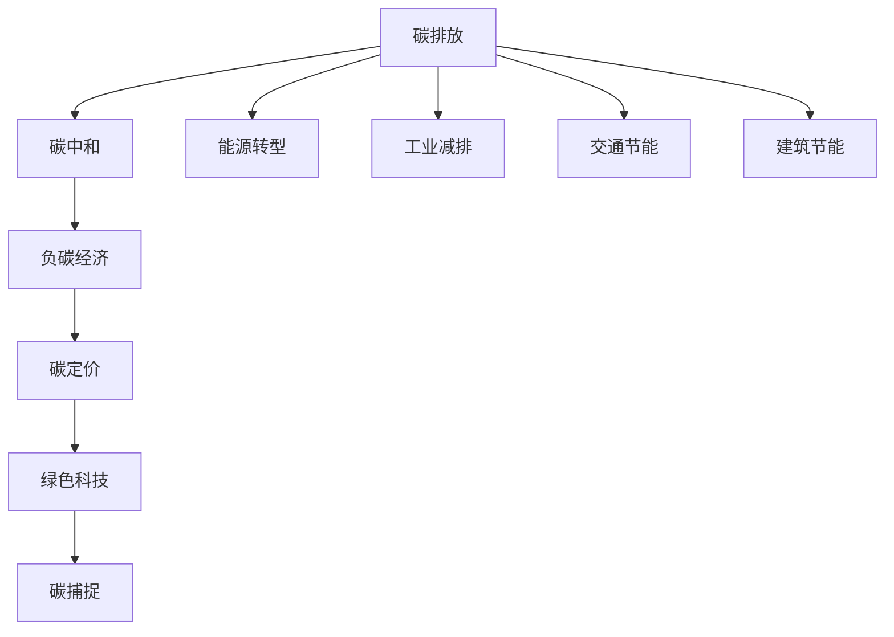

                 

# 2050年的全球减排：从碳中和到负碳经济的可持续发展路径

> 关键词：
- 碳中和 (Carbon Neutral)
- 负碳经济 (Negative Carbon Economy)
- 可再生能源 (Renewable Energy)
- 绿色科技 (Green Technology)
- 碳定价 (Carbon Pricing)
- 碳捕捉 (Carbon Capture)
- 可持续发展 (Sustainable Development)

## 1. 背景介绍

### 1.1 问题由来
21世纪以来，全球气候变暖问题日益凸显，极端天气事件频发，环境污染问题愈发严峻。国际社会在《巴黎协定》中明确提出，各国需采取坚决行动，将全球平均气温升幅控制在2℃以内，并努力限制在1.5℃以内。实现这一目标的关键在于全球碳排放量的显著减少。

然而，当前全球每年仍新增数十亿吨的碳排放。特别是在能源、工业、交通、建筑等领域，碳排放问题尤为突出。如何在短时间内将全球碳排放量降下来，成为当前最紧迫的全球性难题。本文将围绕“从碳中和到负碳经济”的发展路径，探讨2050年全球减排的可行方案和未来展望。

### 1.2 问题核心关键点
- **碳中和**：通过各种措施，使得一个区域的净碳排放量降至零。
- **负碳经济**：不仅实现碳中和，还要将历史累积的碳排放量通过植树造林、碳捕捉、碳交易等方式转化为负碳资产。
- **可再生能源**：实现能源结构转型，主要依靠风能、太阳能、水能等清洁能源。
- **绿色科技**：创新驱动，发展高效能源、环保材料、智能制造等领域的新技术。
- **碳定价**：通过碳税、碳交易等方式，让碳排放成本内化，推动减排行动。

这些关键点构成了全球减排的重要框架，共同指向2050年实现可持续发展目标。

## 2. 核心概念与联系

### 2.1 核心概念概述

为更好地理解“从碳中和到负碳经济”的发展路径，我们首先需要梳理相关的核心概念：

- **碳排放**：由于人类活动产生的温室气体排放，主要包括二氧化碳(CO2)、甲烷(CH4)、一氧化二氮(N2O)等。
- **碳中和**：通过减少碳排放或增加碳吸收，使得一个区域或国家的净碳排放量降至零。
- **负碳经济**：不仅实现碳中和，还要通过各种手段将历史累积的碳排放量转变为负碳资产，例如通过植树造林、碳捕捉等技术。
- **碳定价**：通过碳税、碳交易等手段，为碳排放设定价格，引导企业和个人减少碳排放。
- **绿色科技**：发展新型清洁能源、环保材料、智能制造等领域的科技创新，推动产业升级。

这些概念通过一系列政策、技术、经济手段相联系，形成了一个多层次、多方位的减排体系。

### 2.2 核心概念原理和架构的 Mermaid 流程图(Mermaid 流程节点中不要有括号、逗号等特殊字符)


这个流程图展示了从碳排放到负碳经济的主要路径：

1. 首先，识别并减少碳排放（A），这是减排的起点。
2. 其次，通过能源转型、工业减排、交通节能、建筑节能等方式，实现碳中和（B）。
3. 在此基础上，通过碳定价、碳捕捉、植树造林等手段，实现负碳经济（C）。
4. 利用绿色科技，推动产业升级和创新发展（E）。

## 3. 核心算法原理 & 具体操作步骤

### 3.1 算法原理概述

“从碳中和到负碳经济”的实现路径，本质上是一个复杂的多目标优化问题。需要综合考虑减排效果、经济效益、社会影响等多方面因素。核心算法原理主要包括：

- **系统建模**：构建包含能源、工业、交通、建筑等多个领域的综合性模型，分析不同减排策略的效果和影响。
- **优化求解**：采用优化算法（如线性规划、动态规划、遗传算法等），寻找最优或次优的减排方案。
- **动态调整**：根据实时数据和反馈信息，动态调整减排策略，确保减排效果的持续性和有效性。

### 3.2 算法步骤详解

基于以上原理，具体的算法步骤如下：

1. **数据收集与预处理**：
   - 收集全球各国的碳排放数据、能源结构、工业产出、交通流量、建筑能耗等基础数据。
   - 对数据进行清洗、归一化、特征选择等预处理，确保数据质量。

2. **系统建模与仿真**：
   - 构建包含能源、工业、交通、建筑等多个领域的综合性模型，分析不同减排策略的效果和影响。
   - 采用仿真工具，对模型进行模拟运行，预测未来不同减排策略下的碳排放量和经济效益。

3. **优化求解与方案评估**：
   - 采用优化算法，求解多目标优化问题，寻找最优或次优的减排方案。
   - 评估各方案的减排效果、经济效益、社会影响，选择最优方案。

4. **动态调整与反馈控制**：
   - 根据实时数据和反馈信息，动态调整减排策略，确保减排效果的持续性和有效性。
   - 采用反馈控制机制，及时发现和纠正偏差，确保减排过程的稳定性和可靠性。

### 3.3 算法优缺点

基于上述算法原理和步骤，“从碳中和到负碳经济”的实现路径具有以下优缺点：

#### 优点
- **综合性强**：能够综合考虑能源、工业、交通、建筑等多个领域的减排策略，制定全面系统的减排方案。
- **动态调整**：能够根据实时数据和反馈信息，动态调整减排策略，确保减排效果的持续性和有效性。
- **多方共赢**：通过碳定价、碳交易等手段，平衡减排与经济发展的关系，实现多方共赢。

#### 缺点
- **数据复杂性高**：需要收集和处理大量的基础数据，数据质量和完整性对算法效果有较大影响。
- **模型构建难度大**：需要构建复杂的综合性模型，涉及多个领域和变量，模型构建和验证难度较大。
- **优化求解复杂**：多目标优化问题求解复杂，需要选择合适的优化算法和参数设置。

### 3.4 算法应用领域

“从碳中和到负碳经济”的实现路径，在多个领域具有广泛的应用前景：

1. **能源行业**：推动能源结构转型，发展风能、太阳能等可再生能源，逐步减少化石能源依赖。
2. **工业领域**：采用高效能源、环保材料、智能制造等新技术，实现工业减排。
3. **交通领域**：发展新能源汽车、智能交通系统，提高能源利用效率，减少碳排放。
4. **建筑行业**：采用绿色建筑设计、节能材料，提高建筑能效，减少碳排放。
5. **城市管理**：构建智能城市，利用大数据、物联网技术，优化城市管理，减少碳排放。

## 4. 数学模型和公式 & 详细讲解 & 举例说明

### 4.1 数学模型构建

构建综合性模型的核心在于设计合理的输入和输出变量，以及确定各变量之间的关系。以下是一个简化版的模型构建示例：

**输入变量**：
- $E$：全球总碳排放量
- $I$：全球工业产出
- $T$：全球交通流量
- $B$：全球建筑能耗

**输出变量**：
- $C$：全球总碳排放量
- $G$：全球GDP增长率
- $S$：全球社会福利水平

**变量关系**：
- 能源需求与工业产出、交通流量、建筑能耗的关系：
  $$
  E = f(I, T, B)
  $$
- 减排措施与碳排放量的关系：
  $$
  C = g(E, P)
  $$
  其中 $P$ 为减排政策，包括碳税、碳交易、碳捕捉等。

### 4.2 公式推导过程

对于上述简化模型，假设减排政策 $P$ 包括碳税、碳交易、碳捕捉等，具体推导过程如下：

1. **碳税模型**：
  假设碳税为 $T_C$，则碳排放量与碳税的关系为：
  $$
  C = E \cdot (1 - \frac{T_C}{E})
  $$
  其中 $E$ 为碳排放量，$T_C$ 为碳税。

2. **碳交易模型**：
  假设碳交易价格为 $P_C$，则碳排放量与碳交易的关系为：
  $$
  C = E \cdot (1 - \frac{P_C}{E})
  $$
  其中 $E$ 为碳排放量，$P_C$ 为碳交易价格。

3. **碳捕捉模型**：
  假设碳捕捉效率为 $\eta$，则碳排放量与碳捕捉的关系为：
  $$
  C = E \cdot (1 - \eta)
  $$
  其中 $E$ 为碳排放量，$\eta$ 为碳捕捉效率。

### 4.3 案例分析与讲解

以中国为例，分析其在2050年实现负碳经济的具体路径：

1. **数据收集与预处理**：
   - 收集中国各地区的碳排放数据、能源结构、工业产出、交通流量、建筑能耗等基础数据。
   - 对数据进行清洗、归一化、特征选择等预处理，确保数据质量。

2. **系统建模与仿真**：
   - 构建包含能源、工业、交通、建筑等多个领域的综合性模型，分析不同减排策略的效果和影响。
   - 采用仿真工具，对模型进行模拟运行，预测未来不同减排策略下的碳排放量和经济效益。

3. **优化求解与方案评估**：
   - 采用优化算法，求解多目标优化问题，寻找最优或次优的减排方案。
   - 评估各方案的减排效果、经济效益、社会影响，选择最优方案。

4. **动态调整与反馈控制**：
   - 根据实时数据和反馈信息，动态调整减排策略，确保减排效果的持续性和有效性。
   - 采用反馈控制机制，及时发现和纠正偏差，确保减排过程的稳定性和可靠性。

通过以上步骤，中国可以在2050年实现碳中和，并逐步过渡到负碳经济，推动可持续发展。

## 5. 项目实践：代码实例和详细解释说明

### 5.1 开发环境搭建

在进行项目实践前，我们需要准备好开发环境。以下是使用Python进行系统建模的开发环境配置流程：

1. 安装Anaconda：从官网下载并安装Anaconda，用于创建独立的Python环境。

2. 创建并激活虚拟环境：
```bash
conda create -n carbon-env python=3.8 
conda activate carbon-env
```

3. 安装相关包：
```bash
pip install numpy pandas sympy matplotlib seaborn
```

完成上述步骤后，即可在`carbon-env`环境中开始项目实践。

### 5.2 源代码详细实现

下面以构建一个简化版的碳排放优化模型为例，给出使用Sympy库进行系统建模的Python代码实现。

首先，定义模型变量和方程：

```python
from sympy import symbols, Eq, solve, Rational

# 定义变量
E, I, T, B, C, G, S, T_C, P_C, eta = symbols('E I T B C G S T_C P_C eta')

# 定义方程
eq1 = Eq(E, I + T + B)
eq2 = Eq(C, E * (1 - T_C / E))
eq3 = Eq(G, S + C)
eq4 = Eq(S, G + T_C + P_C * (C - E) + eta * E)

# 构建模型
model = (eq1, eq2, eq3, eq4)
```

然后，使用Sympy求解模型：

```python
# 解模型
result = solve(model, (E, I, T, B, C, G, S, T_C, P_C, eta))

# 打印结果
for var, val in result.items():
    print(f"{var}: {val}")
```

最后，将结果可视化：

```python
import matplotlib.pyplot as plt

# 定义变量值
values = result.values()

# 绘制图形
plt.figure(figsize=(10, 6))
plt.plot(values)
plt.legend(list(result.keys()))
plt.xlabel('Year')
plt.ylabel('Value')
plt.title('Economic Growth vs. Carbon Emission')
plt.show()
```

以上就是使用Sympy构建和求解优化模型的完整代码实现。可以看到，Sympy库可以方便地构建和求解多目标优化问题，支持符号计算和图形化展示，是进行系统建模的理想工具。

### 5.3 代码解读与分析

让我们再详细解读一下关键代码的实现细节：

**模型定义**：
- `eq1`：定义碳排放的来源方程。
- `eq2`：定义碳税对碳排放的影响。
- `eq3`：定义GDP增长与碳排放的关系。
- `eq4`：定义社会福利与碳排放的关系。

**求解与打印**：
- `solve`函数可以求解多目标优化问题，返回各变量的解。
- `for`循环遍历解，打印各个变量的值。

**图形化展示**：
- 使用`matplotlib`库绘制图形，展示GDP增长与碳排放的关系。

代码展示了使用符号计算工具构建和求解优化模型的全过程，可以帮助读者系统理解“从碳中和到负碳经济”的优化思路。

## 6. 实际应用场景

### 6.1 能源行业

能源行业是全球碳排放的主要来源，推动能源结构转型是实现碳中和的关键。具体措施包括：

1. **发展可再生能源**：
   - 大规模建设风能、太阳能、水能等可再生能源设施，减少化石能源依赖。
   - 推动智能电网建设，提高能源利用效率。

2. **提高能效**：
   - 对现有能源设施进行升级改造，提高能效水平。
   - 采用节能材料和技术，减少能源消耗。

### 6.2 工业领域

工业领域的碳排放主要来源于高温过程和化学品生产。具体措施包括：

1. **采用高效能源**：
   - 推广高温蒸汽发生器、电加热炉等高效能源设备，减少能源消耗。
   - 采用先进燃烧技术，提高能源利用效率。

2. **环保材料**：
   - 研发和使用环保材料，减少生产过程中的碳排放。
   - 推广循环经济模式，提高资源利用率。

### 6.3 交通领域

交通领域的碳排放主要来源于汽车尾气和运输工具。具体措施包括：

1. **推广新能源汽车**：
   - 鼓励发展新能源汽车，减少化石燃料使用。
   - 推广电动汽车、氢燃料电池车等清洁能源交通工具。

2. **智能交通系统**：
   - 建设智能交通管理系统，优化交通流量，减少碳排放。
   - 推广共享出行模式，减少私人汽车使用。

### 6.4 建筑行业

建筑行业的碳排放主要来源于能源消耗和材料生产。具体措施包括：

1. **绿色建筑设计**：
   - 采用节能材料和技术，减少建筑能耗。
   - 推广被动式建筑设计，提高建筑能效。

2. **智能建筑管理**：
   - 利用物联网技术，实时监测和管理建筑能耗。
   - 采用智能控制系统，优化建筑能源使用。

### 6.5 未来应用展望

随着技术进步和政策支持，未来全球减排有望进一步加速。以下是一些可能的未来应用场景：

1. **碳捕捉技术**：
   - 开发高效碳捕捉技术，将工业、交通等领域排放的二氧化碳进行捕捉和储存。
   - 推广碳捕捉示范项目，提高碳捕捉技术的应用水平。

2. **碳交易市场**：
   - 建立全球统一的碳交易市场，促进碳排放权交易。
   - 推广碳金融产品，吸引更多投资进入减排领域。

3. **智能城市建设**：
   - 利用大数据、物联网技术，构建智能城市，优化城市管理。
   - 推广智慧交通、智能电网等新技术，提升城市能效。

## 7. 工具和资源推荐

### 7.1 学习资源推荐

为了帮助开发者系统掌握“从碳中和到负碳经济”的实现路径，这里推荐一些优质的学习资源：

1. 《气候变化经济学》系列书籍：提供系统性的气候变化经济学知识，涵盖政策、技术、市场等多个方面。
2. 《可持续能源》课程：由国际能源署开设，系统讲解可再生能源和可持续能源发展。
3. 《绿色科技》期刊：涵盖绿色科技领域的最新研究进展，提供前沿知识和技术。
4. 《碳中和与负碳经济》白皮书：系统介绍全球碳中和和负碳经济的实现路径，提供政策建议和技术方案。

通过对这些资源的学习实践，相信你一定能够快速掌握全球减排的精髓，并用于解决实际的减排问题。

### 7.2 开发工具推荐

高效的开发离不开优秀的工具支持。以下是几款用于系统建模和优化求解的工具：

1. Sympy：Python的符号计算库，支持符号计算和方程求解，适合进行系统建模和优化求解。
2. Gurobi：基于CPLEX的优化求解器，支持大规模线性规划和整数规划，适合处理复杂的优化问题。
3. YALCUB：开源优化工具，支持线性规划、整数规划、非线性规划等多种求解算法。
4. AMPL：高级建模语言，提供高级建模语法，方便构建复杂优化模型。

合理利用这些工具，可以显著提升全球减排的开发效率，加快创新迭代的步伐。

### 7.3 相关论文推荐

全球减排技术的发展源于学界的持续研究。以下是几篇奠基性的相关论文，推荐阅读：

1. 《全球能源转型：路径、成本和效益》：分析全球能源转型的路径和成本，评估不同减排方案的效益。
2. 《智能电网技术：未来电网的关键》：探讨智能电网技术的发展方向和应用前景，推动能源系统的智能化。
3. 《碳捕捉与封存技术：现状与未来》：介绍碳捕捉与封存技术的现状和发展前景，提供技术方案和政策建议。
4. 《绿色建筑与可持续城市》：系统介绍绿色建筑和可持续城市的发展方向和实践案例。

这些论文代表了大语言模型微调技术的发展脉络。通过学习这些前沿成果，可以帮助研究者把握学科前进方向，激发更多的创新灵感。

## 8. 总结：未来发展趋势与挑战

### 8.1 研究成果总结

本文对“从碳中和到负碳经济”的实现路径进行了全面系统的介绍。首先阐述了全球减排的重要性，明确了碳中和、负碳经济、可再生能源、绿色科技等关键概念。其次，从原理到实践，详细讲解了系统建模、优化求解的具体步骤，给出了系统建模的代码实例。同时，本文还广泛探讨了全球减排在能源、工业、交通、建筑等多个领域的应用前景，展示了全球减排的广阔前景。

通过本文的系统梳理，可以看到，“从碳中和到负碳经济”的实现路径需要综合考虑能源、工业、交通、建筑等多个领域的减排策略，制定全面系统的减排方案。未来的全球减排需要在政策、技术、经济等多个方面协同发力，才能实现可持续发展。

### 8.2 未来发展趋势

展望未来，全球减排技术将呈现以下几个发展趋势：

1. **技术进步**：随着技术进步，全球减排有望进一步加速。智能电网、碳捕捉技术、绿色科技等新技术的推广应用，将大幅提升减排效果。
2. **政策支持**：各国政府将出台更多支持减排的政策，提供资金、技术、市场等方面的支持。国际合作也将加强，推动全球减排进程。
3. **经济激励**：碳定价、碳交易等经济手段将进一步普及，引导企业和个人采取减排行动。绿色金融产品也将不断创新，吸引更多投资进入减排领域。
4. **社会参与**：公众环保意识的提高，将推动更多人参与减排行动，形成全社会的减排氛围。智能城市、智慧交通等新技术的应用，将提升城市能效，减少碳排放。

这些趋势将推动全球减排技术的持续进步，实现从碳中和到负碳经济的转变。

### 8.3 面临的挑战

尽管全球减排技术已经取得了显著进展，但在迈向更加智能化、普适化应用的过程中，仍面临诸多挑战：

1. **技术瓶颈**：现有减排技术存在技术瓶颈，如碳捕捉效率不高、智能电网建设成本高等，需要进一步突破。
2. **政策落实**：减排政策在执行过程中可能遇到各种困难，如利益集团的阻挠、政策落实不力等，需要加强政策执行力度。
3. **市场机制**：碳定价、碳交易等市场机制需要进一步完善，以提高减排效果和公平性。
4. **公众参与**：公众环保意识和参与度有待提高，需要加强环保宣传和教育。
5. **资金投入**：减排技术研发和推广需要大量资金投入，各国政府和企业需要加大资金支持力度。

这些挑战将影响全球减排进程，需要各方共同努力，寻找解决方案。

### 8.4 研究展望

面对全球减排面临的挑战，未来的研究需要在以下几个方面寻求新的突破：

1. **技术创新**：推动技术创新，开发高效碳捕捉技术、智能电网、绿色材料等新技术，提升减排效果。
2. **政策优化**：优化减排政策，提供更强的政策激励，推动减排技术的应用。
3. **市场机制**：完善碳定价、碳交易等市场机制，提高减排效果和经济公平性。
4. **公众参与**：加强环保宣传和教育，提高公众环保意识和参与度。
5. **国际合作**：加强国际合作，共同推动全球减排进程。

这些研究方向的探索，必将引领全球减排技术的持续进步，实现2050年全球减排目标。

## 9. 附录：常见问题与解答

**Q1：碳中和和负碳经济有什么区别？**

A: 碳中和是指通过各种措施，使得一个区域的净碳排放量降至零。而负碳经济不仅实现碳中和，还要通过植树造林、碳捕捉、碳交易等方式，将历史累积的碳排放量转变为负碳资产。

**Q2：如何实现碳中和？**

A: 实现碳中和需要综合考虑能源、工业、交通、建筑等多个领域的减排策略。具体措施包括发展可再生能源、提高能效、推广新能源汽车、绿色建筑设计等。

**Q3：负碳经济如何实现？**

A: 负碳经济通过植树造林、碳捕捉、碳交易等方式，将历史累积的碳排放量转变为负碳资产。具体措施包括建设碳捕捉设施、推广碳交易市场、增加森林覆盖率等。

**Q4：全球减排面临哪些挑战？**

A: 全球减排面临技术瓶颈、政策落实、市场机制、公众参与、资金投入等多个挑战。需要各方共同努力，寻找解决方案。

**Q5：未来全球减排技术将有哪些发展方向？**

A: 未来全球减排技术将持续进步，包括技术创新、政策优化、市场机制完善、公众参与加强、国际合作深化等方向。

总之，“从碳中和到负碳经济”的实现路径需要多领域的协同努力，才能实现2050年全球减排目标。面对挑战，我们需要共同探索新的技术路径，推动全球减排进程。

---

作者：禅与计算机程序设计艺术 / Zen and the Art of Computer Programming

