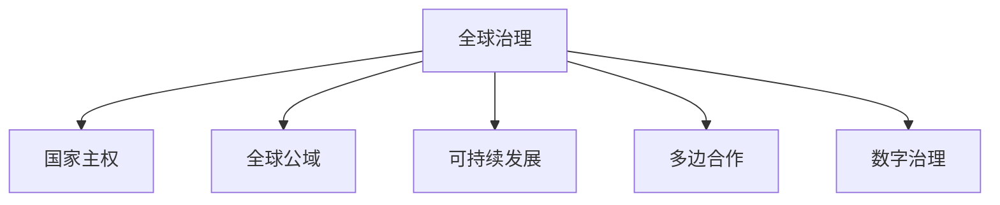

                 

## 1. 背景介绍

### 1.1 问题由来
全球治理是一个多层次、多维度、跨学科的复杂问题，涉及国家主权、国际规则、全球公域管理、可持续发展等多个方面。随着全球化的深入发展和科技的进步，全球治理面临新的挑战和机遇。未来，随着全球化的进一步加深，资源分配、气候变化、网络安全、健康危机等全球性问题将更加复杂。如何在这些挑战中建立有效的治理模式，成为各国政府、国际组织和学术界关注的焦点。

### 1.2 问题核心关键点
未来全球治理的核心关键点在于：
- 如何平衡国家主权与全球公域的管理
- 如何建立全球合作的治理框架
- 如何处理技术快速发展带来的治理难题
- 如何保障全球治理的公平性和普惠性
- 如何构建可持续的全球治理体系

这些关键问题需要从理论、实践和技术等多个层面进行深入研究和探索，以期在2050年建立一套有效的全球治理模式。

### 1.3 问题研究意义
研究2050年的全球治理，对于构建更加公平、公正、可持续的全球治理体系具有重要意义：
- 有助于各国在全球化背景下找到新的合作途径，增强国际社会的团结与协作。
- 有助于在国际规则制定、冲突解决、环境保护等方面形成共识，构建稳定、和谐的国际秩序。
- 有助于应对全球性问题，如气候变化、资源分配、网络安全等，提升全球治理的应对能力。
- 有助于推动技术进步，为全球治理注入新的动力，提高治理的效率和效果。
- 有助于确保全球治理的公平性，保障所有国家，特别是发展中国家的权益。

## 2. 核心概念与联系

### 2.1 核心概念概述

为更好地理解2050年全球治理模式创新的核心概念，本节将介绍几个密切相关的核心概念：

- **全球治理**：指国际社会通过协商、合作、立法等方式，共同应对全球性挑战和问题，维护国际秩序和人类共同利益的过程。
- **国家主权**：指国家对其领土、人民、政治、经济、文化等事务拥有最高权力和最终决策权，是国家独立和尊严的象征。
- **全球公域**：指人类共享的全球资源，如海洋、太空、互联网等，具有超越国界的特点，其管理和利用需要国际社会的共同努力。
- **可持续发展**：指满足当代人需求，同时不损害后代人满足其需求能力的发展模式，关注环境保护、资源合理利用等。
- **多边合作**：指多个国家、国际组织、民间团体等合作主体共同参与的国际事务处理方式，通过集体行动实现共同目标。
- **数字治理**：指利用数字技术（如区块链、人工智能等）优化全球治理体系，提高治理效率和透明度。

这些核心概念之间的逻辑关系可以通过以下Mermaid流程图来展示：



这个流程图展示了几大核心概念及其之间的关系：

1. 全球治理通过协商和合作，处理全球公域问题，推进可持续发展。
2. 国家主权是全球治理的基础，各国在保障自身权益的同时，需遵循国际规则。
3. 全球公域涉及多方利益，需通过多边合作，共同管理。
4. 可持续发展是全球治理的最终目标，涉及环境保护、资源利用等多领域。
5. 数字治理为全球治理提供技术支持，提升治理效率和透明度。

## 3. 核心算法原理 & 具体操作步骤

### 3.1 算法原理概述

未来全球治理模式创新，可以通过系统化的算法和模型来实现。其核心思想是：

- 构建多边合作的算法框架，通过协商、博弈、协调等方式，实现多方共赢。
- 设计全球公域管理的数字治理模型，利用区块链、人工智能等技术，优化公域资源的管理和使用。
- 利用可持续发展目标（SDGs）作为评价指标，建立基于数据的治理决策机制。

### 3.2 算法步骤详解

未来全球治理的算法步骤可以包括以下几个关键步骤：

**Step 1: 设计多边合作算法框架**
- 确定治理目标和参与方。
- 制定合作规则和协议。
- 建立协商和决策机制。
- 设定冲突解决和调整机制。

**Step 2: 构建全球公域管理数字治理模型**
- 利用区块链技术建立去中心化的治理网络。
- 设计智能合约，实现自动化的公域资源管理。
- 利用AI和大数据分析，实时监控公域使用情况，优化资源配置。

**Step 3: 实现基于SDGs的治理决策机制**
- 收集和分析公域数据，确定SDGs的实现情况。
- 利用数据科学和机器学习，预测和评估SDGs的实施效果。
- 基于数据评估和模型预测，制定科学的治理政策和措施。

**Step 4: 持续优化和迭代**
- 定期评估治理效果和SDGs的进展情况。
- 根据评估结果，调整合作框架和治理模型。
- 持续改进算法和模型，提升全球治理的适应性和实效性。

### 3.3 算法优缺点

未来全球治理的算法具有以下优点：
1. 多方共赢。通过多边合作算法，能够有效平衡各方利益，实现共赢。
2. 透明公正。数字治理模型能够实现去中心化，增强治理过程的透明度和公正性。
3. 数据驱动。基于SDGs的决策机制能够基于数据进行科学决策，提升治理的科学性和有效性。
4. 可扩展性。算法框架和模型能够适应不同国家和领域的需求，具有较强的可扩展性。

同时，这些算法也存在一定的局限性：
1. 合作难度。多边合作算法需要各方的积极参与和配合，可能导致治理过程复杂且耗时。
2. 技术门槛。数字治理模型的实施需要高水平的技术支持和资源投入。
3. 数据安全。大数据和AI技术的应用可能带来数据隐私和安全问题。
4. 模型鲁棒性。基于数据的决策机制可能受到数据质量和模型偏见的影响。
5. 治理效率。全球治理涉及多国和多领域，协调复杂，效率可能较低。

尽管存在这些局限性，但未来全球治理的算法框架和模型设计仍具有重要的应用前景，需进一步研究和优化。

### 3.4 算法应用领域

未来全球治理的算法框架和模型设计可以应用于多个领域，如：

- **环境治理**：通过数字治理模型，优化全球公共资源的保护和利用。
- **国际贸易**：利用多边合作算法，促进公平、公正的国际贸易秩序。
- **公共卫生**：基于SDGs的治理决策机制，优化全球公共卫生资源的分配和使用。
- **数字治理**：利用区块链和AI技术，优化数字治理网络，保障数据安全和隐私。
- **可持续发展**：建立基于SDGs的决策机制，推动全球可持续发展的目标实现。

## 4. 数学模型和公式 & 详细讲解 & 举例说明

### 4.1 数学模型构建

在未来全球治理的算法设计中，可以使用以下数学模型进行建模：

- **多边合作博弈模型**：描述各方利益和策略，通过Nash均衡求解最优合作方案。
- **数字治理模型**：基于区块链和智能合约，设计公域资源管理的数学模型。
- **基于SDGs的决策模型**：通过数据科学和机器学习，建立SDGs实现情况的量化模型。

### 4.2 公式推导过程

这里以多边合作博弈模型为例，介绍其基本推导过程：

假设有 $n$ 个参与方，每个参与方的利益函数为 $U_i(x_i)$，其中 $x_i$ 为参与方 $i$ 的策略，如合作或对抗。

设 $\boldsymbol{U} = [U_1, U_2, ..., U_n]$，则博弈问题的目标为求解合作策略 $(x_1^*, x_2^*, ..., x_n^*)$，满足以下条件：

$$
\max_{\boldsymbol{x}} \sum_{i=1}^n U_i(x_i) \\
s.t. \quad x_i \in \mathcal{X}_i, \quad \forall i \in [1, n]
$$

其中 $\mathcal{X}_i$ 为参与方 $i$ 的策略空间。

求解上述优化问题，可以采用Nash均衡求解方法，即求解每个参与方的最佳反应函数，并找到所有参与方策略的纳什均衡解。

### 4.3 案例分析与讲解

以全球气候变化治理为例，说明多边合作博弈模型的应用：

- **参与方**：全球主要经济体，如美国、中国、欧盟等。
- **策略**：减排承诺和行动方案。
- **利益函数**：各国的环境效益、经济成本、技术进步等。

通过多边合作博弈模型，可以求得各国的最佳减排承诺和合作策略，确保全球减排目标的实现。

## 5. 项目实践：代码实例和详细解释说明

### 5.1 开发环境搭建

在进行未来全球治理算法和模型的开发实践中，需要搭建适合的环境。以下是使用Python进行代码实践的环境配置流程：

1. 安装Python：从官网下载并安装最新版本的Python。
2. 安装必要的库：如numpy、pandas、matplotlib、scikit-learn、jupyter notebook等。
3. 配置环境变量：设置Python路径、库路径等环境变量。
4. 搭建开发环境：使用Jupyter Notebook搭建代码实践环境。

### 5.2 源代码详细实现

以下是一个简单的多边合作博弈模型实现示例：

```python
import numpy as np
from scipy.optimize import linprog

# 定义参与方数量和策略空间
n = 3
X = np.array([[1, 0, 0], [0, 1, 0], [0, 0, 1]])

# 定义参与方的利益函数系数
U = np.array([[1, -1, 0], [-1, 1, -1], [0, -1, 1]])

# 求解Nash均衡
def nash_equilibrium(X, U):
    A = np.array(X)
    b = np.zeros(n)
    c = -U
    result = linprog(c, A_ub=A, b_ub=b, bounds=(0, None))
    return result.x

# 求解
equilibrium = nash_equilibrium(X, U)
print("Nash equilibrium:", equilibrium)
```

### 5.3 代码解读与分析

上述代码实现了一个简单的多边合作博弈模型，用于求解参与方的最佳策略。具体解读如下：

- **策略空间**：使用单位矩阵定义参与方的策略空间，即每个参与方有三种策略：合作、对抗、不作为。
- **利益函数**：使用系数矩阵U定义各参与方的利益函数，如合作带来的环境效益、对抗带来的经济成本等。
- **求解函数**：定义Nash均衡求解函数，使用线性规划方法求解所有参与方的最佳策略。

通过简单的代码实现，可以初步理解多边合作博弈模型的应用。实际应用中，参与方的策略空间、利益函数和求解方法可能更加复杂，需要根据具体问题进行设计和调整。

## 6. 实际应用场景

### 6.1 智能城市治理

未来全球治理模式在智能城市治理中的应用，可以有效提升城市管理效率和居民生活质量。

- **智慧基础设施**：通过区块链和AI技术，实现智能交通、能源管理、公共安全等领域的数字化管理。
- **数据共享与协作**：建立多方合作的城市治理网络，实现数据共享和协同决策。
- **市民参与**：通过智能应用，市民可以直接参与城市治理，提升治理透明度和民主性。

### 6.2 数字健康治理

在全球健康治理中，未来治理模式可以有效应对全球健康危机，提升公共卫生响应能力。

- **数据收集与分析**：利用大数据和AI技术，实时监测全球健康数据，预测疫情发展趋势。
- **资源分配与调度**：通过多边合作算法，优化全球医疗资源的分配和调度。
- **公众教育与宣传**：利用智能应用，提高公众健康意识，普及防疫知识。

### 6.3 国际金融治理

未来全球治理模式在国际金融治理中的应用，可以有效防范金融风险，促进全球金融稳定。

- **去中心化金融**：利用区块链技术，建立去中心化的金融交易网络，降低金融系统的风险。
- **全球货币政策**：通过多边合作，制定全球统一的货币政策，稳定全球金融市场。
- **金融监管**：利用AI和大数据分析，实时监控金融风险，提前预警和防范。

### 6.4 未来应用展望

未来全球治理模式将面临更多挑战和机遇，需进一步创新和优化：

- **数据治理**：数据隐私和安全将成为全球治理的重要课题，需建立全球数据治理框架。
- **智能治理**：AI和机器学习技术将为全球治理注入新的动力，提升治理的效率和精准度。
- **可持续发展**：全球治理需更多关注环境保护、资源利用等可持续发展目标，推动绿色治理。
- **多领域融合**：未来治理模式需更多融合其他领域，如智慧医疗、智能交通、数字安全等，形成跨领域治理体系。
- **全球化合作**：需建立更加公平、公正、透明的国际合作机制，确保全球治理的普惠性。

## 7. 工具和资源推荐

### 7.1 学习资源推荐

为了帮助开发者掌握未来全球治理模式的理论基础和实践技巧，这里推荐一些优质的学习资源：

1. 《博弈论与经济建模》：介绍博弈论的基本原理和应用，适合理解多边合作算法。
2. 《区块链技术原理与应用》：系统讲解区块链技术的工作原理和应用场景，适合理解数字治理模型。
3. 《数据科学与机器学习》：介绍数据科学和机器学习的基本概念和应用，适合理解基于SDGs的决策模型。
4. Coursera和edX等在线课程平台，提供系统化的在线学习资源，涵盖全球治理的多个领域。
5. 相关学术期刊和会议论文，如《全球治理评论》、《国际关系研究》等，提供前沿的学术研究和讨论。

通过对这些资源的学习实践，相信你一定能够系统掌握未来全球治理模式的理论基础和实践技巧。

### 7.2 开发工具推荐

高效的开发离不开优秀的工具支持。以下是几款用于未来全球治理模式开发的常用工具：

1. Jupyter Notebook：开源的交互式计算环境，支持代码编写、数据可视化、结果展示等功能。
2. GitHub：全球最大的代码托管平台，支持团队协作和代码版本控制。
3. Docker和Kubernetes：容器化和自动化部署工具，支持分布式系统和微服务架构。
4. TensorFlow和PyTorch：主流的深度学习框架，支持大数据和AI技术的开发和应用。
5. Scrapy和BeautifulSoup：数据爬虫和解析工具，支持高效的数据采集和预处理。

合理利用这些工具，可以显著提升未来全球治理模式的开发效率，加快创新迭代的步伐。

### 7.3 相关论文推荐

未来全球治理模式的发展源于学界的持续研究。以下是几篇奠基性的相关论文，推荐阅读：

1. "The Evolution of Cooperation"（罗伯特·阿克塞尔罗德）：研究合作与冲突的博弈论模型，是博弈论领域的经典之作。
2. "Blockchain: Principles and Paradigms"（米歇尔·考夫曼）：全面介绍区块链技术的原理和应用，是数字治理领域的权威教材。
3. "The Four Pillars of Sustainability"（安格·珀西）：介绍可持续发展目标的基本概念和实施路径，是全球治理的重要参考。

这些论文代表了大语言模型微调技术的发展脉络。通过学习这些前沿成果，可以帮助研究者把握学科前进方向，激发更多的创新灵感。

## 8. 总结：未来发展趋势与挑战

### 8.1 总结

本文对未来全球治理模式进行了全面系统的介绍。首先阐述了未来全球治理模式的核心概念和关键点，明确了其应用前景和研究意义。其次，从理论到实践，详细讲解了未来全球治理模式的设计思想和操作步骤，给出了具体的代码实现示例。同时，本文还探讨了未来全球治理模式在多个实际应用场景中的创新应用，展示了其广阔的应用前景。最后，本文精选了未来全球治理模式的各类学习资源，力求为读者提供全方位的技术指引。

通过本文的系统梳理，可以看到，未来全球治理模式具有广阔的应用前景，在多个领域具有重要的实践价值。其核心算法和模型设计，可以优化全球资源管理和配置，提升治理效率和效果，构建稳定、公正、可持续的全球治理体系。

### 8.2 未来发展趋势

展望未来，未来全球治理模式将呈现以下几个发展趋势：

1. **数据驱动**：未来治理模式将更多依赖于大数据和AI技术，实现科学决策和高效管理。
2. **智能治理**：智能算法和机器学习技术将为全球治理注入新的动力，提升治理的效率和精准度。
3. **多方协作**：全球治理需更多关注多方协作机制，建立稳定、公正的国际合作框架。
4. **可持续发展**：全球治理需更多关注环境保护、资源利用等可持续发展目标，推动绿色治理。
5. **技术融合**：未来治理模式需更多融合其他领域，如智慧医疗、智能交通、数字安全等，形成跨领域治理体系。
6. **全球化合作**：需建立更加公平、公正、透明的国际合作机制，确保全球治理的普惠性。

这些趋势凸显了未来全球治理模式的广阔前景，为实现全球治理的现代化、普惠化和可持续化提供了方向。

### 8.3 面临的挑战

尽管未来全球治理模式已经取得了不少进展，但在迈向更加智能化、普惠化应用的过程中，仍面临诸多挑战：

1. **数据隐私和安全**：数据隐私和安全将成为全球治理的重要课题，需建立全球数据治理框架。
2. **技术门槛**：大数据和AI技术的应用需要高水平的技术支持和资源投入。
3. **治理效率**：全球治理涉及多国和多领域，协调复杂，效率可能较低。
4. **模型鲁棒性**：基于数据的决策机制可能受到数据质量和模型偏见的影响。
5. **全球化合作**：需建立更加公平、公正、透明的国际合作机制，确保全球治理的普惠性。

尽管存在这些挑战，但未来全球治理模式的研究和实践正在不断突破，需进一步探索和优化。

### 8.4 研究展望

面对未来全球治理模式所面临的挑战，未来的研究需要在以下几个方面寻求新的突破：

1. **数据治理**：研究全球数据隐私保护、数据共享机制，构建全球数据治理框架。
2. **智能治理**：开发更加智能化的治理算法和模型，提高治理的效率和效果。
3. **可持续发展**：研究全球可持续发展目标的实现路径，推动绿色治理。
4. **多领域融合**：融合其他领域的技术和方法，形成跨领域治理体系。
5. **全球化合作**：建立更加公平、公正、透明的国际合作机制，确保全球治理的普惠性。

这些研究方向将引领未来全球治理模式的创新和优化，推动全球治理向更加智能化、普惠化和可持续化的方向发展。

## 9. 附录：常见问题与解答

**Q1: 未来全球治理模式是否适用于所有国家？**

A: 未来全球治理模式旨在促进全球合作，提升全球治理效率和公平性，但不同国家的国情、文化和治理需求各异，实施过程中需根据具体情况进行调整和优化。

**Q2: 如何处理未来全球治理中的数据隐私和安全问题？**

A: 未来治理模式需建立全球数据治理框架，制定严格的数据隐私保护政策，确保数据的安全性和隐私性。同时，利用区块链技术实现数据的去中心化管理，减少数据泄露的风险。

**Q3: 未来全球治理模式在实际应用中是否会面临技术瓶颈？**

A: 未来治理模式需要高水平的技术支持和资源投入，特别是在大数据和AI技术的应用上。需建立技术研发和创新机制，不断突破技术瓶颈，提升治理的效率和效果。

**Q4: 未来全球治理模式的普惠性如何保障？**

A: 未来治理模式需建立更加公平、公正的国际合作机制，确保各国的合法权益和利益平衡。需推动全球治理的民主化、透明化，增加各国的参与度和影响力。

**Q5: 未来全球治理模式的可持续发展目标如何实现？**

A: 未来治理模式需更多关注环境保护、资源利用等可持续发展目标，推动绿色治理。需制定科学的治理政策和措施，实现经济、社会、环境的协调发展。

这些问题的答案，将有助于深入理解未来全球治理模式的理论基础和实际应用，为构建更加公平、公正、可持续的全球治理体系提供有益的参考和指导。

---

作者：禅与计算机程序设计艺术 / Zen and the Art of Computer Programming

