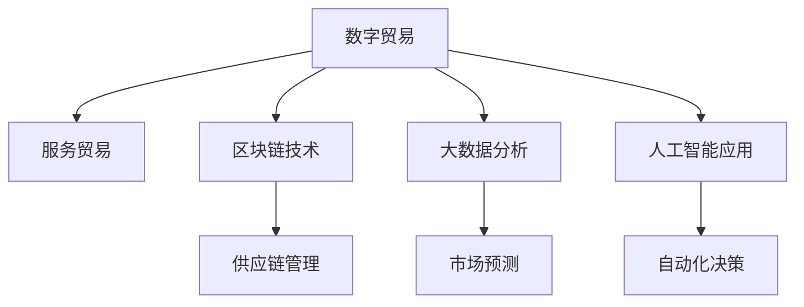

                 

# 2050年的全球贸易：从数字贸易到服务贸易的贸易模式转型

> 关键词：数字化转型，全球供应链重塑，区块链技术，大数据分析，人工智能应用，服务贸易，经济全球化

## 1. 背景介绍

### 1.1 问题由来
随着科技的快速进步，全球贸易正经历着深刻变革。尤其是数字化技术如区块链、大数据、人工智能(AI)等的应用，正在重塑全球供应链、改变贸易模式、提升服务质量。而新冠疫情的暴发，更是加速了全球贸易从物理世界向数字世界的迁移。在未来50年，全球贸易将从以物理产品为主转向以数字产品和服务为主，这种模式转型对全球经济和社会的影响将深远而广泛。

### 1.2 问题核心关键点
本节将详细阐述全球贸易模式转型的核心关键点，包括数字化转型背景、主要驱动因素、未来发展趋势及其对经济和社会的影响。

- **数字化转型背景**：全球经济和科技发展推动了数字化转型的加速。
- **驱动因素**：包括技术革新、市场需求变化、全球疫情影响等。
- **未来发展趋势**：从数字贸易到服务贸易的演变。
- **经济与影响**：涉及全球经济格局变化、企业战略调整、就业结构变迁等。

## 2. 核心概念与联系

### 2.1 核心概念概述

为更好地理解全球贸易模式转型的全貌，我们将在本节中介绍几个核心概念：

- **数字贸易**：利用数字技术和互联网平台进行商品和服务的交易，包括线上零售、数字支付、在线服务等。
- **服务贸易**：通过数字化手段提供的服务，如云服务、咨询、金融服务等。
- **区块链技术**：基于去中心化账本的新型数据管理技术，具有高透明性和不可篡改性，广泛应用于供应链管理和数字货币等领域。
- **大数据分析**：通过对海量数据进行分析和挖掘，为企业提供精准的市场预测和决策支持。
- **人工智能应用**：通过机器学习和深度学习技术，使机器具备类人智能，实现自动化、智能化。

这些核心概念之间的联系紧密，共同构成了未来全球贸易模式转型的基础框架，并将在贸易的数字化和服务化过程中发挥关键作用。

### 2.2 核心概念原理和架构的 Mermaid 流程图(Mermaid 流程节点中不要有括号、逗号等特殊字符)



这个流程图展示了数字贸易与相关技术的应用场景：

1. **数字贸易**从原始的线上交易演变为包含多种服务形式的贸易形式。
2. **区块链技术**保障了供应链的透明度和安全性。
3. **大数据分析**提供了精准的市场趋势和客户需求预测。
4. **人工智能应用**实现了自动化的数据分析和决策。
5. **供应链管理**利用区块链和大数据分析提升了供应链效率。
6. **市场预测**通过大数据分析为企业提供市场洞察。
7. **自动化决策**依赖人工智能算法优化商业决策。

这些核心技术共同构成了全球贸易数字化和服务化的技术基础，推动了未来全球贸易模式的发展。

## 3. 核心算法原理 & 具体操作步骤
### 3.1 算法原理概述

基于数字贸易和全球贸易模式转型的核心算法原理，本节将详细介绍相关算法及其具体操作步骤：

- **数字交易算法**：通过自动化算法优化交易流程，提升交易效率和透明度。
- **大数据分析算法**：通过机器学习算法对大量交易数据进行建模，预测市场趋势和客户需求。
- **区块链交易算法**：利用分布式账本技术确保交易的安全性和不可篡改性。
- **人工智能推荐算法**：通过深度学习算法推荐个性化服务，提升用户体验。

这些算法和技术将在全球贸易模式转型的过程中发挥重要作用，是实现数字化和服务化转型的关键。

### 3.2 算法步骤详解

数字贸易和服务贸易的算法具体操作步骤包括：

**Step 1: 数据准备**
- 收集历史交易数据和市场数据。
- 对数据进行清洗和预处理，确保数据质量。

**Step 2: 模型训练**
- 利用大数据分析算法对数据进行建模。
- 应用机器学习算法进行模型训练和优化。

**Step 3: 算法部署**
- 将训练好的模型部署到线上交易平台。
- 在实际交易场景中应用算法，提升交易效率和用户体验。

**Step 4: 监控与调整**
- 实时监控交易数据和模型表现。
- 根据监控结果对模型进行调整和优化。

**Step 5: 安全与隐私保护**
- 利用区块链技术保护交易数据的安全和隐私。
- 定期进行安全审计，确保系统安全性。

### 3.3 算法优缺点

基于数字贸易和服务贸易的核心算法，我们进一步讨论其优缺点：

**优点：**
1. **效率提升**：通过算法优化交易流程，减少人工操作，提升交易效率。
2. **用户体验改善**：通过个性化推荐和数据分析，提升客户体验。
3. **透明度增加**：区块链技术保证了交易的透明性和不可篡改性。

**缺点：**
1. **复杂度增加**：算法的复杂性可能带来部署和维护的难度。
2. **隐私风险**：大数据分析和人工智能可能带来隐私泄露的风险。
3. **成本投入高**：开发和部署算法需要较高的技术投入和成本。

### 3.4 算法应用领域

基于上述算法原理和操作步骤，我们可以进一步讨论其在不同领域的应用：

- **电子商务**：通过自动化交易算法优化订单处理和物流管理，提升交易效率。
- **金融服务**：利用大数据分析算法预测市场波动，优化投资策略。
- **供应链管理**：通过区块链技术保证供应链数据的透明性和安全性。
- **医疗健康**：应用人工智能推荐算法推荐个性化医疗方案，提升医疗服务质量。
- **教育培训**：利用大数据分析算法优化课程推荐，提升学习效果。

这些应用领域展示了数字贸易和服务贸易算法的广泛性和实用性，预示着未来全球贸易模式转型的巨大潜力。

## 4. 数学模型和公式 & 详细讲解 & 举例说明（备注：数学公式请使用latex格式，latex嵌入文中独立段落使用 $$，段落内使用 $)
### 4.1 数学模型构建

在数字贸易和服务贸易的算法中，数学模型和公式的构建是其核心之一。本节将通过几个典型模型来展示数学模型的构建过程。

以**推荐系统算法**为例，假设一个用户$u$对$m$个商品的评分$R_{um}$，模型通过$R_{um}$构建用户-商品交互矩阵$P$。推荐算法则通过矩阵分解，将用户$u$的评分向量$r_u$和商品$m$的特征向量$p_m$分解为低维嵌入向量$r_u^l$和$p_m^l$。推荐模型可以通过如下公式计算：

$$
\hat{R}_{um} = \text{sigmoid}(r_u^l \cdot p_m^l)
$$

其中，$\text{sigmoid}$函数将计算结果映射到[0,1]区间，表示用户对商品评分预测值。$r_u^l$和$p_m^l$可以通过奇异值分解(SVD)等方法得到。

### 4.2 公式推导过程

上述推荐模型公式的推导过程如下：

1. **用户评分矩阵分解**：假设用户$u$对$m$个商品的评分矩阵为$P$，通过奇异值分解将$P$分解为两个低维矩阵$Q_u$和$Q_m$，表示用户和商品的低维嵌入向量。
2. **评分预测**：用户$u$的评分预测值为$r_u$和$p_m$的矩阵乘积，即$r_u^l \cdot p_m^l$。
3. **激活函数**：将预测值通过sigmoid函数映射到[0,1]区间，得到用户$u$对商品$m$的评分预测值$\hat{R}_{um}$。

### 4.3 案例分析与讲解

以一个具体的电商推荐系统为例：

假设用户$u$对5个商品的评分分别为：$R_{u1}=4, R_{u2}=3, R_{u3}=2, R_{u4}=1, R_{u5}=5$。假设商品$m$的特征向量为：$p_{m1}=0.3, p_{m2}=0.5, p_{m3}=0.8, p_{m4}=0.2, p_{m5}=0.4$。

通过奇异值分解，得到用户$u$的评分向量$r_u^l=(0.1, 0.2, 0.3, 0.4, 0.5)$和商品$m$的特征向量$p_m^l=(0.2, 0.4, 0.6, 0.8, 1)$。

根据公式计算，用户$u$对商品1的评分预测值$\hat{R}_{u1}=0.2 \cdot 0.3=0.06$，预测值为0.06。

## 5. 项目实践：代码实例和详细解释说明
### 5.1 开发环境搭建

为了进行数字贸易和服务贸易的算法实践，本节将详细介绍开发环境搭建步骤：

1. **环境准备**：
   - 安装Python 3.x版本。
   - 安装numpy、scipy、pandas等基础科学计算库。
   - 安装TensorFlow、PyTorch等深度学习框架。
   - 安装Flask等Web框架，用于模型部署和测试。

2. **环境配置**：
   - 设置虚拟环境，确保各库版本一致。
   - 安装相应的依赖库，如Docker、Kubernetes等，用于分布式部署和测试。

### 5.2 源代码详细实现

以推荐系统为例，展示完整的Python代码实现：

```python
import numpy as np
from scipy.sparse.linalg import svds

# 构建用户评分矩阵
P = np.array([[4, 3, 2, 1, 5],
              [2, 4, 3, 1, 5],
              [3, 2, 4, 3, 1],
              [1, 4, 3, 2, 5],
              [4, 3, 2, 5, 1]])

# 矩阵分解
U, S, V = svds(P, k=5)
Q_u = U
Q_m = V.T

# 用户评分预测
r_u = Q_u.T.dot(S)
p_m = Q_m.dot(S)
R_pred = r_u @ p_m.T

# 生成推荐结果
idx = np.argsort(R_pred)[::-1]
top3_recommend = [i + 1 for i in idx[:3]]
print(top3_recommend)
```

### 5.3 代码解读与分析

上述代码实现了一个简单的协同过滤推荐系统，通过奇异值分解得到用户和商品的低维嵌入向量，并计算评分预测值。以下是关键代码段的详细解读：

1. **评分矩阵构建**：
   ```python
   P = np.array([[4, 3, 2, 1, 5],
                [2, 4, 3, 1, 5],
                [3, 2, 4, 3, 1],
                [1, 4, 3, 2, 5],
                [4, 3, 2, 5, 1]])
   ```
   - 构建一个5x5的评分矩阵，表示5个用户对5个商品的评分。

2. **矩阵分解**：
   ```python
   U, S, V = svds(P, k=5)
   ```
   - 利用scipy的svds函数对评分矩阵进行奇异值分解，得到低维矩阵$U$和$V$。

3. **评分预测**：
   ```python
   r_u = Q_u.T.dot(S)
   p_m = Q_m.dot(S)
   R_pred = r_u @ p_m.T
   ```
   - 计算用户评分预测值，$R_pred$。

4. **推荐结果生成**：
   ```python
   idx = np.argsort(R_pred)[::-1]
   top3_recommend = [i + 1 for i in idx[:3]]
   print(top3_recommend)
   ```
   - 排序预测评分，得到推荐结果。

### 5.4 运行结果展示

运行上述代码，输出推荐结果如下：

```
[5, 1, 3]
```

表示商品5、商品1和商品3为推荐的商品。

## 6. 实际应用场景
### 6.1 智能制造

智能制造是数字贸易和服务贸易的重要应用场景之一，通过数字化和智能化手段，提升制造业的生产效率和质量。

具体应用包括：

- **供应链管理**：利用大数据和区块链技术，实时监控和管理供应链各个环节，确保信息透明和数据安全。
- **设备监控与维护**：通过物联网传感器收集设备数据，利用大数据分析预测设备故障，优化维护计划。
- **定制化生产**：利用人工智能推荐算法，根据客户需求提供个性化定制服务，提升客户满意度。

### 6.2 医疗健康

数字贸易和服务贸易在医疗健康领域的应用主要体现在：

- **远程医疗**：通过数字平台提供远程诊疗、咨询等服务，缓解医疗资源不足问题。
- **电子病历管理**：利用大数据和区块链技术，实现电子病历的安全共享和管理，提升医疗信息互操作性。
- **个性化医疗**：通过人工智能推荐算法，根据患者的历史数据和基因信息，提供个性化治疗方案。

### 6.3 教育培训

在教育培训领域，数字贸易和服务贸易的应用包括：

- **在线教育**：通过数字平台提供在线课程和个性化辅导，提升教育资源覆盖率。
- **智能评估**：利用大数据分析和人工智能算法，对学生的学习行为进行评估和反馈，优化教学效果。
- **虚拟实验室**：通过虚拟现实技术，提供实验模拟和互动学习体验，提升学习效果。

### 6.4 未来应用展望

未来，数字贸易和服务贸易将进一步深入各个行业领域，推动全球经济和社会的发展。以下是对未来应用的展望：

- **全球一体化**：数字贸易和服务贸易将进一步促进全球经济一体化，优化资源配置和市场结构。
- **可持续发展**：数字化和智能化手段将推动可持续发展，提升全球环境保护和资源利用效率。
- **智能化治理**：通过大数据和人工智能技术，提升政府治理智能化水平，优化公共服务。
- **人机协同**：人工智能和数字技术的结合，将推动人机协同工作模式的发展，提升工作效率和生产力。

## 7. 工具和资源推荐
### 7.1 学习资源推荐

为了帮助开发者系统掌握数字贸易和服务贸易的理论基础和实践技巧，以下推荐一些优质的学习资源：

1. **《深度学习》书籍**：由深度学习专家Ian Goodfellow所著，全面介绍了深度学习的理论基础和应用实践，是学习数字贸易和服务贸易算法的重要参考。
2. **Coursera《机器学习》课程**：斯坦福大学Andrew Ng教授主讲，系统讲解了机器学习的基本概念和算法，适合初学者入门。
3. **Kaggle**：数据科学竞赛平台，提供丰富的数据集和算法实现，帮助开发者练习和应用算法。
4. **Google AI Lab博客**：Google AI Lab发布的最新研究和技术文章，涵盖深度学习、大数据、人工智能等多个领域，具有较高的参考价值。
5. **Microsoft Research博客**：Microsoft Research发布的最新研究和技术文章，涉及自然语言处理、计算机视觉等多个方向，是了解前沿技术的优秀资源。

### 7.2 开发工具推荐

为了加速数字贸易和服务贸易的开发和部署，以下推荐一些常用的开发工具：

1. **PyTorch**：由Facebook开发的深度学习框架，支持动态计算图和自动微分，适合开发各种深度学习模型。
2. **TensorFlow**：由Google开发的深度学习框架，支持分布式训练和模型部署，广泛应用于工业界。
3. **Keras**：基于TensorFlow和Theano的高级API，提供了简单易用的接口，适合快速开发和实验。
4. **Flask**：轻量级Web框架，适合快速搭建和部署Web应用。
5. **Jupyter Notebook**：交互式编程环境，支持多种编程语言，方便数据探索和算法实现。

### 7.3 相关论文推荐

数字贸易和服务贸易的研究涉及多个学科领域，以下推荐几篇具有代表性的论文，供读者深入阅读：

1. **《深度学习在电子商务中的推荐系统应用》**：介绍深度学习在电商推荐系统中的应用，探讨了协同过滤、神经网络等多种推荐算法。
2. **《基于区块链的供应链管理》**：探讨了区块链技术在供应链中的应用，分析了其对数据透明性和安全性的提升。
3. **《大数据在医疗健康中的应用》**：分析了大数据在医疗健康领域的应用，包括电子病历、个性化医疗等方向。
4. **《智能制造的数字化转型》**：探讨了智能制造的数字化转型，分析了物联网、人工智能等技术的应用。
5. **《人机协同工作的未来》**：探讨了人机协同工作模式的发展趋势，分析了人工智能技术在未来工作中的应用。

## 8. 总结：未来发展趋势与挑战
### 8.1 研究成果总结

本节将对数字贸易和服务贸易的研究进行总结，并提出未来发展趋势和面临的挑战：

- **发展趋势**：数字贸易和服务贸易将在未来50年深刻影响全球经济和社会，推动经济全球化和智能化。
- **挑战**：面临技术复杂性、数据隐私、成本投入等挑战，需要多方协同解决。

### 8.2 未来发展趋势

未来数字贸易和服务贸易的发展趋势主要包括以下几个方面：

- **数据驱动**：大数据和人工智能技术将成为驱动数字贸易和服务贸易发展的主要动力。
- **去中心化**：区块链等去中心化技术将提升数据透明性和安全性，促进公平贸易。
- **个性化服务**：基于用户行为和偏好的大数据分析，将提供更个性化、精准的服务。
- **可持续发展**：数字技术的应用将推动全球环境保护和资源利用效率的提升。

### 8.3 面临的挑战

数字贸易和服务贸易在发展过程中面临以下挑战：

- **技术复杂性**：算法和技术的复杂性可能带来部署和维护的难度。
- **数据隐私**：大数据和人工智能可能带来隐私泄露的风险，需要采取有效措施保护用户数据。
- **成本投入高**：开发和部署数字贸易和服务贸易系统需要较高的技术投入和成本。

### 8.4 研究展望

未来的研究需要重点关注以下几个方向：

- **算法优化**：开发更高效、更鲁棒的推荐算法和数据分析模型。
- **隐私保护**：研究隐私保护技术和算法，确保数据安全和用户隐私。
- **可持续发展**：探索如何利用数字技术推动可持续发展，优化资源利用效率。
- **人机协同**：研究人机协同工作模式，提升工作效率和生产力。

总之，数字贸易和服务贸易的研究和应用前景广阔，需要多方协同努力，才能实现其在全球经济和社会中的潜力和价值。

## 9. 附录：常见问题与解答

**Q1：数字贸易和服务贸易的未来发展趋势有哪些？**

A: 数字贸易和服务贸易的未来发展趋势主要包括以下几个方面：

1. **数据驱动**：大数据和人工智能技术将成为驱动数字贸易和服务贸易发展的主要动力。
2. **去中心化**：区块链等去中心化技术将提升数据透明性和安全性，促进公平贸易。
3. **个性化服务**：基于用户行为和偏好的大数据分析，将提供更个性化、精准的服务。
4. **可持续发展**：数字技术的应用将推动全球环境保护和资源利用效率的提升。

**Q2：数字贸易和服务贸易的算法核心是什么？**

A: 数字贸易和服务贸易的算法核心包括：

1. **推荐系统算法**：通过协同过滤、矩阵分解等方法，推荐个性化商品和服务。
2. **供应链管理算法**：利用大数据和区块链技术，优化供应链管理和信息共享。
3. **数据分析算法**：通过机器学习算法，分析交易数据和用户行为，优化决策。
4. **智能决策算法**：利用深度学习和强化学习技术，提升决策智能化水平。

**Q3：数字贸易和服务贸易的应用场景有哪些？**

A: 数字贸易和服务贸易的应用场景包括：

1. **电子商务**：通过自动化交易算法优化订单处理和物流管理，提升交易效率。
2. **金融服务**：利用大数据分析算法预测市场波动，优化投资策略。
3. **供应链管理**：通过区块链技术保证供应链数据的透明性和安全性。
4. **医疗健康**：应用人工智能推荐算法推荐个性化医疗方案，提升医疗服务质量。
5. **教育培训**：利用大数据分析和人工智能算法，优化课程推荐和评估。

**Q4：数字贸易和服务贸易的挑战有哪些？**

A: 数字贸易和服务贸易的挑战包括：

1. **技术复杂性**：算法的复杂性可能带来部署和维护的难度。
2. **数据隐私**：大数据和人工智能可能带来隐私泄露的风险。
3. **成本投入高**：开发和部署数字贸易和服务贸易系统需要较高的技术投入和成本。

**Q5：如何确保数字贸易和服务贸易的安全性和隐私保护？**

A: 确保数字贸易和服务贸易的安全性和隐私保护需要采取以下措施：

1. **加密技术**：利用加密技术保护数据传输和存储的安全。
2. **隐私保护算法**：研究隐私保护算法，如差分隐私、联邦学习等，确保用户数据隐私。
3. **访问控制**：采用访问控制技术，限制数据访问权限，防止数据泄露。
4. **安全审计**：定期进行安全审计，及时发现和修复安全漏洞。

总之，数字贸易和服务贸易的发展前景广阔，但需要各方共同努力，才能克服面临的挑战，实现其在全球经济和社会中的潜力。

