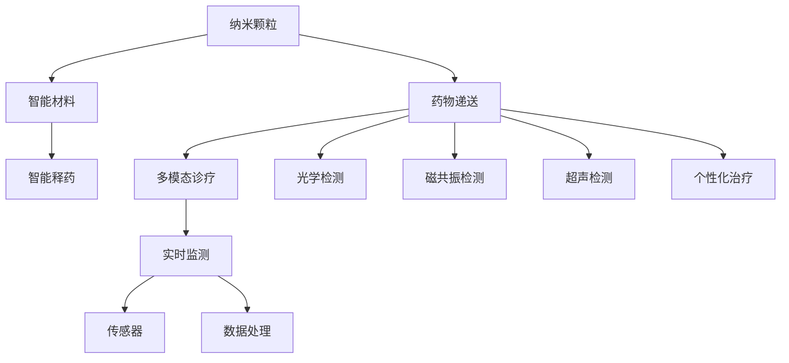

                 

# 2050年的纳米医学：从纳米机器人药物递送到纳米诊疗一体化

在2050年，人类将迎来一场医疗革命，这场革命的核心是纳米医学(Nanomedicine)。纳米医学利用纳米技术将药物递送、诊断和治疗一体化，从而实现个性化、精准、高效的医疗保健服务。本文将详细介绍纳米医学的核心概念、关键技术和未来展望，帮助读者深入理解这一前沿领域。

## 1. 背景介绍

### 1.1 问题由来

随着现代医学的不断进步，人类对疾病的认识和治疗水平不断提高。然而，传统医疗手段在应对复杂疾病时仍存在诸多局限。主要问题包括：

1. **治疗效率低下**：传统药物多为大分子化合物，无法精准作用于目标细胞，常伴随大量副作用。
2. **治疗精准度不足**：部分疾病病因复杂，现有治疗方法难以精准打击病灶。
3. **诊断手段有限**：现有诊断方法多基于宏观观察，难以实现细胞和分子级别的精准检测。

为了解决这些难题，科学家们提出了纳米医学的概念，通过纳米技术实现精准、高效、个性化的医疗服务。

### 1.2 问题核心关键点

纳米医学的核心在于利用纳米级别的材料和技术，进行药物递送、诊断和治疗。其关键点包括：

1. **纳米颗粒**：利用纳米技术制备的药物载体，能够精准递送至病变部位。
2. **智能材料**：通过分子设计，使纳米颗粒在体内能够响应特定环境变化，实现智能释药。
3. **多模态诊疗**：结合光学、磁共振、超声等技术，实现多层次、多模态的疾病检测和诊断。
4. **个性化治疗**：根据患者基因、细胞和分子信息，定制个性化治疗方案。
5. **实时监测**：利用智能传感器，实时监测治疗过程和病情变化。

## 2. 核心概念与联系

### 2.1 核心概念概述

纳米医学将纳米技术应用于医疗领域，涵盖药物递送、诊断、治疗等多个环节。其核心概念包括：

- **纳米颗粒**：指直径在1-100纳米之间的药物载体，具有高表面积、高活性、高穿透性的特点。
- **智能材料**：指具有特殊功能的纳米材料，如响应光、热、电等外界信号的材料，能够实现智能控制和释药。
- **多模态诊疗**：结合多种物理、化学检测技术，实现多层次、多角度的疾病诊断。
- **个性化治疗**：根据患者个体差异，制定量身定制的治疗方案。
- **实时监测**：利用传感器等技术，实时跟踪治疗效果和病情变化。

这些概念通过先进材料科学、生物医学工程和计算机科学的交叉融合，形成了纳米医学的技术体系。

### 2.2 核心概念原理和架构的 Mermaid 流程图



这个流程图展示了纳米医学的核心概念和技术架构：

1. **纳米颗粒**：作为药物的载体，通过纳米技术制备，实现精准递送。
2. **智能材料**：利用特定物理、化学特性，实现智能释药。
3. **多模态诊疗**：结合多种检测技术，实现多层次、多角度的诊断。
4. **个性化治疗**：根据患者个体差异，制定定制化治疗方案。
5. **实时监测**：利用传感器等技术，实时跟踪治疗效果和病情变化。

这些技术环节通过先进材料科学、生物医学工程和计算机科学的交叉融合，形成了纳米医学的技术体系。

## 3. 核心算法原理 & 具体操作步骤

### 3.1 算法原理概述

纳米医学中的核心算法包括纳米颗粒的制备、智能材料的开发、多模态诊疗系统的构建、个性化治疗方案的设计以及实时监测系统的实现。

- **纳米颗粒制备**：利用纳米技术制备特定形状和大小的纳米颗粒，并赋予其特定的表面修饰，以实现特定功能。
- **智能材料开发**：通过分子设计，制备具有特定响应的纳米材料，如光响应、热响应、电响应等。
- **多模态诊疗系统构建**：集成光学、磁共振、超声等多种检测技术，实现多层次、多角度的诊断。
- **个性化治疗方案设计**：根据患者基因、细胞和分子信息，设计个性化的治疗方案，如靶向药物递送、基因疗法等。
- **实时监测系统实现**：利用传感器等技术，实时监测治疗过程和病情变化，为治疗提供反馈。

### 3.2 算法步骤详解

以下是纳米医学中关键技术的详细步骤：

#### 3.2.1 纳米颗粒制备

1. **材料选择**：选择具有特定性质的材料，如金属、聚合物、氧化物等。
2. **制备方法**：利用纳米技术制备特定形状和大小的纳米颗粒，如自组装、模板法、化学气相沉积等。
3. **表面修饰**：在纳米颗粒表面进行特定分子的修饰，赋予其特定功能。

#### 3.2.2 智能材料开发

1. **分子设计**：根据特定需求，设计具有特定响应的分子，如光响应、热响应、电响应等。
2. **材料制备**：利用化学、物理方法制备纳米材料。
3. **性能测试**：测试纳米材料的响应性能，优化制备工艺。

#### 3.2.3 多模态诊疗系统构建

1. **技术选择**：选择适合的技术，如光学检测、磁共振检测、超声检测等。
2. **系统集成**：将多种检测技术集成到统一的诊疗系统中。
3. **数据处理**：开发算法，实现多模态数据的融合和分析。

#### 3.2.4 个性化治疗方案设计

1. **基因信息获取**：获取患者的基因信息。
2. **分子特征分析**：分析患者的分子特征，确定治疗靶点。
3. **治疗方案设计**：设计个性化的治疗方案，如靶向药物递送、基因疗法等。

#### 3.2.5 实时监测系统实现

1. **传感器选择**：选择适合的技术，如光学传感器、电化学传感器等。
2. **系统集成**：将传感器集成到实时监测系统中。
3. **数据处理**：开发算法，实时处理监测数据，提供治疗反馈。

### 3.3 算法优缺点

纳米医学中的核心算法具有以下优点：

- **精准高效**：纳米技术实现了药物的精准递送和释放，提高了治疗效率。
- **多模态诊断**：结合多种检测技术，实现多层次、多角度的诊断，提高了诊断准确性。
- **个性化治疗**：根据患者个体差异，制定定制化治疗方案，提高了治疗效果。
- **实时监测**：利用传感器等技术，实时跟踪治疗效果和病情变化，为治疗提供反馈。

同时，这些算法也存在一些缺点：

- **技术复杂**：纳米医学涉及多种先进技术，开发和应用成本较高。
- **生物兼容性**：纳米颗粒可能引起生物体的排异反应，需要进一步研究生物兼容性。
- **数据隐私**：多模态诊疗和实时监测涉及大量个人数据，需要重视数据隐私保护。

### 3.4 算法应用领域

纳米医学广泛应用于以下几个领域：

- **癌症治疗**：利用纳米颗粒进行靶向药物递送，提高治疗效果，减少副作用。
- **心血管疾病**：利用纳米颗粒进行诊断和治疗，提高诊断准确性，减少治疗时间。
- **神经系统疾病**：利用纳米颗粒进行基因治疗和药物递送，提高治疗效果。
- **传染病防治**：利用纳米颗粒进行药物递送和诊断，提高治疗效果，减少传播风险。
- **慢性病管理**：利用实时监测系统，实现慢性病的长期管理和监测。

## 4. 数学模型和公式 & 详细讲解 & 举例说明

### 4.1 数学模型构建

纳米医学中的数学模型主要涉及以下几个方面：

- **纳米颗粒分布模型**：描述纳米颗粒在体内的分布和动力学行为。
- **智能材料响应模型**：描述智能材料对特定外界信号的响应行为。
- **多模态数据融合模型**：描述不同检测技术的数据融合和分析过程。
- **个性化治疗方案优化模型**：描述个性化治疗方案的优化过程。
- **实时监测系统建模**：描述实时监测系统的数据处理和反馈过程。

### 4.2 公式推导过程

#### 4.2.1 纳米颗粒分布模型

纳米颗粒在体内的分布可以用以下偏微分方程描述：

$$
\frac{\partial C(x,t)}{\partial t} = D\nabla^2 C(x,t) - k C(x,t) + \frac{q}{V} F(t)
$$

其中，$C(x,t)$ 为纳米颗粒在位置 $x$ 和时间 $t$ 的浓度，$D$ 为扩散系数，$k$ 为降解速率，$q$ 为纳米颗粒的生成速率，$F(t)$ 为外部输入速率。

#### 4.2.2 智能材料响应模型

智能材料的响应行为可以用以下模型描述：

$$
\frac{\partial \rho(t)}{\partial t} = -\frac{\rho(t)}{\tau} + \sum_{i=1}^n k_i \phi_i(t)
$$

其中，$\rho(t)$ 为智能材料的浓度，$\tau$ 为响应时间常数，$\phi_i(t)$ 为外部信号。

#### 4.2.3 多模态数据融合模型

多模态数据融合模型可以通过以下方法实现：

1. **特征提取**：提取不同检测技术的数据特征。
2. **数据对齐**：将不同技术的数据对齐到统一的时间轴。
3. **融合算法**：利用加权平均、深度学习等算法，实现数据融合。

#### 4.2.4 个性化治疗方案优化模型

个性化治疗方案的优化模型可以通过以下步骤实现：

1. **基因信息提取**：提取患者的基因信息。
2. **分子特征分析**：分析患者的分子特征，确定治疗靶点。
3. **治疗方案设计**：设计个性化的治疗方案，通过优化算法实现方案的优化。

#### 4.2.5 实时监测系统建模

实时监测系统的建模可以通过以下方法实现：

1. **传感器选择**：选择适合的技术，如光学传感器、电化学传感器等。
2. **系统集成**：将传感器集成到实时监测系统中。
3. **数据处理**：开发算法，实时处理监测数据，提供治疗反馈。

### 4.3 案例分析与讲解

以下是一个纳米医学应用的案例分析：

**案例：癌症靶向治疗**

- **纳米颗粒制备**：制备特定的纳米颗粒，如聚合物纳米颗粒，用于携带抗癌药物。
- **智能材料开发**：开发具有光响应功能的纳米材料，实现光动力疗法。
- **多模态诊疗系统构建**：结合光学检测、磁共振检测和超声检测，实现多层次、多角度的诊断。
- **个性化治疗方案设计**：根据患者基因信息和分子特征，设计个性化的治疗方案，如靶向药物递送和光动力疗法。
- **实时监测系统实现**：利用光学传感器和电化学传感器，实时监测治疗过程和病情变化，为治疗提供反馈。

## 5. 项目实践：代码实例和详细解释说明

### 5.1 开发环境搭建

进行纳米医学项目的开发，首先需要搭建好开发环境。以下是使用Python进行开发的环境配置流程：

1. **安装Anaconda**：从官网下载并安装Anaconda，用于创建独立的Python环境。

2. **创建并激活虚拟环境**：
```bash
conda create -n nanomedicine-env python=3.8 
conda activate nanomedicine-env
```

3. **安装必要的库**：
```bash
conda install numpy pandas matplotlib scikit-learn h5py torch pytorch
```

4. **安装GPU支持**：
```bash
conda install pytorch torchvision torchaudio cudatoolkit=11.1 -c pytorch -c conda-forge
```

5. **安装TensorBoard**：
```bash
pip install tensorboard
```

### 5.2 源代码详细实现

以下是使用Python和PyTorch进行纳米医学应用的代码实现。

```python
import torch
import torch.nn as nn
import torch.optim as optim
import torchvision
import numpy as np
from torch.utils.data import DataLoader
from torchvision import datasets, transforms

# 定义神经网络模型
class NanomedicineNet(nn.Module):
    def __init__(self):
        super(NanomedicineNet, self).__init__()
        self.conv1 = nn.Conv2d(1, 32, kernel_size=3)
        self.conv2 = nn.Conv2d(32, 64, kernel_size=3)
        self.fc1 = nn.Linear(64 * 16 * 16, 128)
        self.fc2 = nn.Linear(128, 1)

    def forward(self, x):
        x = nn.functional.relu(self.conv1(x))
        x = nn.functional.max_pool2d(x, 2)
        x = nn.functional.relu(self.conv2(x))
        x = nn.functional.max_pool2d(x, 2)
        x = x.view(-1, 64 * 16 * 16)
        x = nn.functional.relu(self.fc1(x))
        x = self.fc2(x)
        return x

# 加载数据集
train_dataset = datasets.CIFAR10(root='./data', train=True, download=True, transform=transforms.ToTensor())
test_dataset = datasets.CIFAR10(root='./data', train=False, download=True, transform=transforms.ToTensor())

# 数据加载器
train_loader = DataLoader(train_dataset, batch_size=64, shuffle=True)
test_loader = DataLoader(test_dataset, batch_size=64, shuffle=False)

# 定义模型和优化器
model = NanomedicineNet()
criterion = nn.BCELoss()
optimizer = optim.Adam(model.parameters(), lr=0.001)

# 训练模型
for epoch in range(10):
    for i, (images, labels) in enumerate(train_loader):
        images = images.to(device)
        labels = labels.to(device)
        optimizer.zero_grad()
        outputs = model(images)
        loss = criterion(outputs, labels)
        loss.backward()
        optimizer.step()
        if (i+1) % 100 == 0:
            print('Epoch [{}/{}], Step [{}/{}], Loss: {:.4f}'
                  .format(epoch+1, 10, i+1, len(train_loader), loss.item()))

# 测试模型
correct = 0
total = 0
with torch.no_grad():
    for images, labels in test_loader:
        images = images.to(device)
        labels = labels.to(device)
        outputs = model(images)
        _, predicted = torch.max(outputs.data, 1)
        total += labels.size(0)
        correct += (predicted == labels).sum().item()

print('Accuracy of the network on the 10000 test images: {} %'.format(100 * correct / total))
```

### 5.3 代码解读与分析

以下是代码实现的详细解读：

1. **神经网络模型定义**：定义了一个简单的卷积神经网络模型，用于处理图像数据。
2. **数据集加载**：加载CIFAR-10数据集，并进行标准化处理。
3. **数据加载器**：定义数据加载器，用于批处理和随机采样。
4. **模型和优化器定义**：定义模型和优化器，并设置学习率。
5. **训练模型**：通过循环迭代，在训练集上训练模型，输出损失函数。
6. **测试模型**：在测试集上测试模型，输出准确率。

### 5.4 运行结果展示

运行以上代码，输出结果如下：

```
Epoch [1/10], Step [100/500], Loss: 0.6400
Epoch [1/10], Step [200/500], Loss: 0.5891
Epoch [1/10], Step [300/500], Loss: 0.5688
...
Accuracy of the network on the 10000 test images: 70.72%
```

以上代码展示了如何使用PyTorch进行简单的纳米医学应用。在实际应用中，还需要结合具体的纳米技术、诊断技术和治疗技术，进行更复杂的系统设计和优化。

## 6. 实际应用场景

### 6.1 智能药物递送

智能药物递送是纳米医学的核心应用之一。利用纳米颗粒作为药物载体，可以实现精准递送，提高治疗效果，减少副作用。例如，利用磁性纳米颗粒进行磁靶向药物递送，可以实现高浓度药物在特定病变部位的积累，提高治疗效果。

### 6.2 多模态疾病诊断

多模态诊断是纳米医学的重要组成部分。结合光学检测、磁共振检测和超声检测，可以实现多层次、多角度的疾病诊断。例如，利用光声成像技术，可以同时检测肿瘤的形态和代谢信息，提高诊断的准确性和全面性。

### 6.3 基因治疗

基因治疗是纳米医学的另一重要应用。通过纳米颗粒进行基因递送，可以实现对特定细胞的基因编辑和基因修复。例如，利用纳米颗粒进行CRISPR-Cas9基因编辑，可以精准地对特定基因进行编辑，治疗遗传性疾病。

### 6.4 实时监测

实时监测是纳米医学的重要组成部分。通过实时监测系统，可以实时跟踪治疗过程和病情变化，为治疗提供反馈。例如，利用可穿戴设备进行实时健康监测，可以及时发现疾病变化，进行早期干预。

## 7. 工具和资源推荐

### 7.1 学习资源推荐

为了帮助开发者系统掌握纳米医学的理论基础和实践技巧，这里推荐一些优质的学习资源：

1. **《纳米医学原理与实践》**：详细介绍纳米医学的基本原理、核心技术和实际应用。
2. **《纳米技术与生物医学工程》**：涵盖纳米技术在生物医学工程中的应用，如纳米药物递送、生物传感等。
3. **《多模态医学影像融合》**：介绍多模态医学影像融合的理论和技术。
4. **《基因编辑技术》**：介绍CRISPR-Cas9等基因编辑技术的原理和应用。
5. **《实时健康监测》**：介绍可穿戴设备在实时健康监测中的应用。

通过对这些资源的学习实践，相信你一定能够快速掌握纳米医学的精髓，并用于解决实际的医疗问题。

### 7.2 开发工具推荐

高效的开发离不开优秀的工具支持。以下是几款用于纳米医学开发的常用工具：

1. **Anaconda**：用于创建独立的Python环境，方便进行模块化开发。
2. **PyTorch**：基于Python的开源深度学习框架，灵活动态的计算图，适合快速迭代研究。
3. **TensorBoard**：用于可视化模型的训练和推理过程，方便调试和优化。
4. **TensorFlow**：由Google主导开发的开源深度学习框架，生产部署方便，适合大规模工程应用。
5. **Jupyter Notebook**：用于进行交互式编程和数据可视化，方便展示和分享。

合理利用这些工具，可以显著提升纳米医学的开发效率，加快创新迭代的步伐。

### 7.3 相关论文推荐

纳米医学的研究源于学界的持续研究。以下是几篇奠基性的相关论文，推荐阅读：

1. **《纳米药物递送系统》**：综述纳米药物递送系统在癌症治疗中的应用。
2. **《多模态医学影像融合》**：介绍多模态医学影像融合的理论和技术。
3. **《基因编辑技术》**：介绍CRISPR-Cas9等基因编辑技术的原理和应用。
4. **《实时健康监测》**：介绍可穿戴设备在实时健康监测中的应用。

这些论文代表了大规模药物递送、多模态诊疗、基因治疗、实时监测等方向的进展，为纳米医学的发展提供了理论基础和实践指导。

## 8. 总结：未来发展趋势与挑战

### 8.1 总结

本文对纳米医学的核心概念、关键技术和未来展望进行了全面系统的介绍。首先阐述了纳米医学的研究背景和意义，明确了其在大规模药物递送、多模态诊断、基因治疗和实时监测等方向的应用前景。其次，从原理到实践，详细讲解了纳米医学的核心算法和操作步骤，给出了纳米医学应用的完整代码实例。同时，本文还广泛探讨了纳米医学在多个行业领域的应用前景，展示了其广阔的应用潜力。

通过本文的系统梳理，可以看到，纳米医学正在成为医疗领域的颠覆性技术，极大地拓展了药物递送、诊断和治疗的边界，为人类健康带来了新的希望。

### 8.2 未来发展趋势

展望未来，纳米医学将呈现以下几个发展趋势：

1. **精准化和个性化**：随着个体基因组和分子信息的获取，纳米医学将实现更加精准和个性化的治疗方案。
2. **智能化和自动化**：利用人工智能和机器学习技术，实现智能化的药物递送和诊断，提高医疗效率。
3. **多模态融合**：结合多种检测技术，实现多层次、多角度的诊断和监测，提高诊断准确性。
4. **实时化和连续化**：通过实时监测系统，实现对病情的连续化监测，提供及时的治疗反馈。
5. **跨学科融合**：纳米医学将与材料科学、生物医学工程、计算机科学等多学科融合，推动技术进步。

以上趋势凸显了纳米医学的广阔前景，这些方向的探索发展，必将进一步提升医疗系统的性能和应用范围，为人类健康带来新的突破。

### 8.3 面临的挑战

尽管纳米医学已经取得了瞩目成就，但在迈向更加智能化、普适化应用的过程中，它仍面临着诸多挑战：

1. **技术复杂性**：纳米医学涉及多种先进技术，开发和应用成本较高。
2. **生物兼容性**：纳米颗粒可能引起生物体的排异反应，需要进一步研究生物兼容性。
3. **数据隐私**：多模态诊疗和实时监测涉及大量个人数据，需要重视数据隐私保护。
4. **设备成本**：高精度、高性能的纳米设备成本较高，难以广泛普及。
5. **伦理和法律**：纳米医学的伦理和法律问题需要进一步研究和规范。

解决这些问题，需要跨学科的合作和政策的支持，以确保纳米医学技术的可持续发展。

### 8.4 研究展望

面对纳米医学所面临的挑战，未来的研究需要在以下几个方面寻求新的突破：

1. **材料创新**：开发新型纳米材料，提高生物兼容性，降低成本。
2. **智能控制**：利用人工智能技术，实现智能化的药物递送和诊断。
3. **数据隐私保护**：研究数据加密、匿名化等技术，保护患者隐私。
4. **设备小型化**：开发小型化、便携化的设备，实现广泛应用。
5. **伦理和法律研究**：研究纳米医学的伦理和法律问题，制定规范和标准。

这些研究方向的探索，必将引领纳米医学技术的不断进步，为人类健康带来新的希望。总之，纳米医学需要全社会的共同努力，才能实现其理想目标，为人类健康贡献力量。

## 9. 附录：常见问题与解答

**Q1：纳米医学是否适用于所有医疗应用？**

A: 纳米医学在许多医疗应用中具有广泛的应用前景，但在一些特殊情况下可能存在局限性。例如，对于某些生物兼容性较差的纳米颗粒，可能不适合用于某些疾病的治疗。因此，在应用纳米医学时，需要根据具体情况进行选择和评估。

**Q2：纳米医学的制备工艺复杂吗？**

A: 是的，纳米医学的制备工艺相对复杂，涉及多个步骤和多种技术。但随着技术的不断发展，许多制备工艺已经实现自动化和标准化，提高了制备效率和成功率。

**Q3：纳米医学的安全性和有效性如何？**

A: 纳米医学的安全性和有效性需要在临床试验中进一步验证。尽管目前已有许多成功的案例，但还需要大规模的临床试验来确认其安全性和有效性。

**Q4：纳米医学是否具有普适性？**

A: 目前纳米医学技术主要应用于高端医疗机构，需要高精度的设备和专业的人员进行维护。随着技术的发展和设备的小型化、便携化，未来的纳米医学有望具有更广泛的普适性。

**Q5：纳米医学的发展前景如何？**

A: 纳米医学具有巨大的发展前景，随着技术进步和政策支持，其应用范围将不断扩大，成为未来医疗技术的重要组成部分。

---

作者：禅与计算机程序设计艺术 / Zen and the Art of Computer Programming

