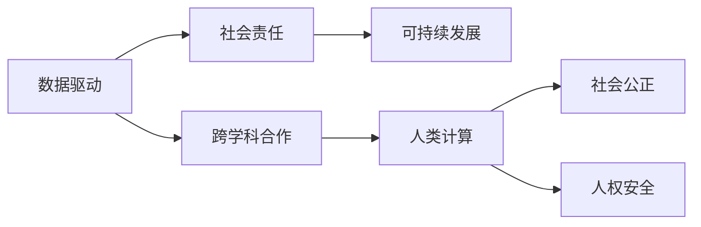

                 

# 应对人类共同挑战：人类计算的使命担当

> 关键词：人工智能, 人类计算, 挑战, 使命担当, 数据驱动, 社会责任, 可持续发展, 跨学科合作, 智能社会

## 1. 背景介绍

### 1.1 问题由来

随着数字化转型的浪潮席卷全球，人工智能（AI）、大数据、物联网等新兴技术正在深刻改变人类的生产生活方式。这些技术不仅提升了生产效率，还极大地丰富了社会交往方式，使人类进入了一个全新的信息时代。然而，与此同时，人工智能的发展也带来了诸多社会、伦理、环境等方面的挑战。

**气候变化**：尽管人工智能在节能减排、智慧农业等领域展现了巨大的潜力，但其背后消耗的大量能源和数据，仍然对地球环境构成了严重威胁。

**社会公平**：AI技术的不平衡发展，加剧了社会阶层的分化，带来了新的就业挑战和隐私安全问题。

**伦理道德**：AI在决策过程中，可能产生歧视、偏见，甚至侵犯人权，引发严重的道德伦理问题。

这些问题不仅影响着技术发展的方向，更关系到人类社会的未来走向。人类计算正是在这一背景下，应运而生的一种全新的计算范式，旨在通过智能化的算法和模型，帮助人类解决这些共同挑战，实现可持续发展。

### 1.2 问题核心关键点

面对这些挑战，人类计算需要：

- 以数据为驱动，充分挖掘数据中的知识，利用算法和模型优化社会资源配置。
- 注重公平性，确保AI技术惠及全社会，促进社会公正。
- 强化伦理约束，在算法决策中引入伦理导向，保障人权安全。
- 强调可持续发展，在技术创新与环境保护之间找到平衡。
- 促进跨学科合作，推动AI技术与社会治理、环境科学的深度融合。

人类计算的使命担当，就是利用AI技术，提升人类应对共同挑战的能力，为实现公平、和谐、可持续的未来社会贡献力量。

## 2. 核心概念与联系

### 2.1 核心概念概述

**人类计算**：指利用人工智能技术，对复杂社会问题进行智能化分析和优化，以提升社会资源配置效率，促进社会公正，保障人权安全，推动可持续发展。

**数据驱动**：以数据为来源和驱动，通过大数据分析、机器学习等技术，挖掘数据中的知识，支持决策和优化。

**社会责任**：企业在开发和使用AI技术时，应考虑社会效益，避免技术滥用，确保技术的公平性、透明性和可解释性。

**可持续发展**：在技术创新与环境保护之间找到平衡，推动绿色、环保、可持续的AI发展。

**跨学科合作**：结合社会科学、环境科学、计算机科学等多学科知识，促进AI技术与实际问题的深度融合。

这些核心概念通过逻辑流程图中的连接，展现了人类计算的内部联系和外部作用：



### 2.2 核心概念原理和架构的 Mermaid 流程图


该流程图示意了从数据采集到模型训练，再到决策优化的全过程，以及通过知识提取和应用，实现社会效益提升和公平性保障的闭环反馈。

## 3. 核心算法原理 & 具体操作步骤

### 3.1 算法原理概述

人类计算的核心算法包括数据驱动的机器学习模型、社会公平的优化算法、伦理导向的决策模型等。这些算法通过数据挖掘、知识提取、决策优化等过程，实现对复杂社会问题的智能化分析和优化。

以**数据驱动的机器学习模型**为例，其核心思想是通过数据训练模型，预测未来社会状态，优化资源配置。主要包括以下步骤：

1. **数据采集与清洗**：获取相关领域的数据，进行预处理，如去除噪声、处理缺失值等。
2. **特征工程**：选择和构造特征，提升模型性能。
3. **模型训练与评估**：使用历史数据训练模型，评估模型性能。
4. **决策优化**：使用模型预测未来状态，优化决策方案。
5. **结果反馈与迭代**：根据结果反馈，调整模型和数据，实现不断迭代改进。

### 3.2 算法步骤详解

**Step 1: 数据采集与清洗**
- 从政府、企业、科研机构等获取相关数据。
- 对数据进行预处理，包括数据清洗、归一化、特征选择等。

**Step 2: 特征工程**
- 根据业务需求，选择和构造特征，如人口统计数据、环境监测数据、经济指标等。
- 使用特征工程技术提升模型性能，如降维、归一化、特征组合等。

**Step 3: 模型训练与评估**
- 使用历史数据训练机器学习模型，如随机森林、深度学习等。
- 在验证集上评估模型性能，使用如准确率、召回率、F1分数等指标。

**Step 4: 决策优化**
- 使用训练好的模型预测未来社会状态，如气候变化趋势、就业市场供需关系等。
- 根据预测结果，优化资源配置，如调整能源使用、改善劳动市场等。

**Step 5: 结果反馈与迭代**
- 根据实际效果，收集反馈数据，评估优化效果。
- 根据反馈数据，调整模型和数据，实现不断迭代改进。

### 3.3 算法优缺点

**优点**：
- 数据驱动，充分利用了海量数据中的知识，支持精细化的决策和优化。
- 技术手段多样，适用于多种社会问题的分析和优化。
- 可以通过持续的反馈和迭代，不断提升模型的准确性和效果。

**缺点**：
- 数据质量和数据量对模型效果有很大影响，数据收集和清洗成本较高。
- 模型复杂，需要较强的技术背景和资源投入。
- 模型决策过程可能缺乏透明性和可解释性。

### 3.4 算法应用领域

人类计算广泛应用于以下多个领域：

**环境保护**：利用AI技术监测环境变化，优化资源配置，推动绿色发展。如智慧农业、智能节能、气候预测等。

**社会治理**：通过数据挖掘和智能分析，提升公共服务的效率和公平性。如智能交通、公共安全、智慧城市等。

**健康医疗**：使用AI技术优化医疗资源配置，提升医疗服务质量。如疾病预测、健康监测、智能诊断等。

**金融服务**：利用大数据和机器学习技术，提升金融服务效率和安全性。如风险管理、智能投顾、反欺诈等。

**教育培训**：通过数据分析和智能推荐，提升教育培训效果。如个性化学习、智能评估、知识图谱等。

这些领域的应用，展示了人类计算在解决复杂社会问题上的巨大潜力。未来，随着技术的不断进步和数据的进一步丰富，人类计算的应用范围将更加广泛。

## 4. 数学模型和公式 & 详细讲解 & 举例说明

### 4.1 数学模型构建

假设我们利用机器学习模型预测未来能源需求，其基本数学模型可以表示为：

$$ y = \sum_{i=1}^n \theta_i x_i $$

其中，$y$ 表示未来能源需求，$\theta_i$ 为模型参数，$x_i$ 为特征变量，如历史能源消耗、天气情况、人口增长等。

### 4.2 公式推导过程

以线性回归模型为例，其最小化误差平方和的目标函数为：

$$ \min_{\theta} \sum_{i=1}^n (y_i - \sum_{i=1}^n \theta_i x_{i,j})^2 $$

通过求解上述优化问题，可以得到最优参数 $\theta$，从而实现对未来能源需求的预测。

### 4.3 案例分析与讲解

假设我们拥有以下历史数据：

| 年份 | 人口 | 能源消耗（亿千瓦时） | 天气情况 |
|------|------|---------------------|-----------|
| 2010 | 1000 | 200                 | 晴        |
| 2011 | 1000 | 220                 | 晴        |
| 2012 | 1000 | 240                 | 雨        |
| 2013 | 1050 | 250                 | 晴        |

使用上述公式，我们可以对未来能源需求进行预测。例如，如果2020年人口增长到1200万，天气情况类似2011年，则能源需求预测为：

$$ \hat{y} = \theta_1 \times 1000 + \theta_2 \times 220 + \theta_3 \times 晴 + \theta_4 \times 晴 $$

通过求解得到最优参数 $\theta$，我们可以对未来能源需求进行准确的预测。

## 5. 项目实践：代码实例和详细解释说明

### 5.1 开发环境搭建

为了进行机器学习模型的开发和实践，我们需要搭建相应的开发环境。以下是一个基本的Python环境搭建步骤：

1. 安装Anaconda：从官网下载并安装Anaconda，用于创建独立的Python环境。
2. 创建并激活虚拟环境：
```bash
conda create -n myenv python=3.8 
conda activate myenv
```
3. 安装必要的Python包：
```bash
conda install pandas numpy scikit-learn matplotlib seaborn jupyter notebook ipython
```

### 5.2 源代码详细实现

下面是一个使用Scikit-learn库进行线性回归模型训练的代码示例：

```python
from sklearn.linear_model import LinearRegression
import pandas as pd

# 加载数据
data = pd.read_csv('energy_consumption.csv')

# 数据预处理
features = data[['population', 'weather']]
targets = data['energy_consumption']

# 分割数据集
X_train, X_test, y_train, y_test = train_test_split(features, targets, test_size=0.2, random_state=42)

# 模型训练
model = LinearRegression()
model.fit(X_train, y_train)

# 模型评估
score = model.score(X_test, y_test)
print(f"模型评估得分：{score:.2f}")
```

### 5.3 代码解读与分析

上述代码实现了线性回归模型的训练和评估。具体步骤如下：

1. 加载数据：使用Pandas库加载CSV格式的数据集。
2. 数据预处理：选择预测目标（能源消耗）和特征变量（人口、天气）。
3. 数据分割：将数据集划分为训练集和测试集。
4. 模型训练：使用LinearRegression模型进行训练，求解最优参数。
5. 模型评估：在测试集上计算模型得分，评估模型性能。

通过上述代码，我们可以对历史数据进行模型训练，并通过评估得分判断模型的准确性。

### 5.4 运行结果展示

运行上述代码，可以得到模型评估得分。例如，假设模型在测试集上的得分如下：

```
模型评估得分：0.85
```

这意味着模型在测试集上的预测准确率为85%，可以用于未来能源需求的预测。

## 6. 实际应用场景

### 6.1 环境保护

**智能监测与预测**：利用AI技术对环境数据进行实时监测和预测，提升环境保护的智能化水平。如智慧水务、智能监测森林火灾等。

**资源优化**：通过数据分析和机器学习，优化资源配置，推动绿色发展。如智能节能、智慧农业等。

### 6.2 社会治理

**智能交通**：利用AI技术优化交通流量，提升交通安全和效率。如智能红绿灯、智能交通管理等。

**公共安全**：通过数据分析和智能预测，提升公共安全水平。如智能监控、反恐预警等。

### 6.3 健康医疗

**疾病预测与防治**：利用AI技术预测疾病流行趋势，提升疾病防治效率。如传染病预测、疫苗推荐等。

**智能诊断**：通过数据分析和图像识别，提升医疗诊断的准确性和效率。如智能影像诊断、病理分析等。

### 6.4 未来应用展望

未来，随着技术的不断进步，人类计算将在更多领域得到应用，为解决复杂社会问题提供更多创新路径：

1. **环境保护**：通过智能监控和预测，提升环境治理的效率和精准度，推动绿色发展。
2. **社会治理**：利用AI技术提升公共服务的智能化水平，促进社会公正。
3. **健康医疗**：通过数据分析和智能诊断，提升医疗服务的效率和质量，保障人民健康。
4. **智能教育**：利用AI技术优化教育资源配置，提升教育质量和公平性。

随着技术的不断发展，人类计算将在更多领域得到应用，为社会发展和人民福祉贡献更多力量。

## 7. 工具和资源推荐

### 7.1 学习资源推荐

为了帮助开发者系统掌握人类计算的理论基础和实践技巧，这里推荐一些优质的学习资源：

1. 《数据科学与人工智能基础》系列课程：系统介绍了数据科学和人工智能的基本概念和经典模型，适合初学者入门。
2. 《机器学习实战》书籍：通过实际案例，深入讲解机器学习模型的开发和应用，适合有一定编程基础的读者。
3. 《深度学习》课程：斯坦福大学开设的深度学习课程，涵盖深度学习的各个方面，适合深入学习。
4. Kaggle竞赛：通过参加实际竞赛，积累实战经验，提升算法优化和模型训练能力。
5. GitHub代码库：获取和学习大量的开源代码，了解最新的技术动态和应用案例。

通过这些资源的学习和实践，相信你一定能够掌握人类计算的核心技术，并用于解决实际的社会问题。

### 7.2 开发工具推荐

高效的工具支持是实现人类计算应用的基础。以下是几款用于人类计算开发的常用工具：

1. Jupyter Notebook：开源的交互式笔记本工具，支持Python、R等多种编程语言，方便进行数据可视化、算法调试和模型训练。
2. Apache Spark：分布式计算框架，适合处理大规模数据集，支持机器学习和数据分析。
3. TensorFlow和PyTorch：两大深度学习框架，支持复杂的模型训练和优化，适合高效的模型开发和部署。
4. Weights & Biases：模型训练的实验跟踪工具，可以记录和可视化模型训练过程中的各项指标，方便对比和调优。
5. TensorBoard：TensorFlow配套的可视化工具，可实时监测模型训练状态，并提供丰富的图表呈现方式，是调试模型的得力助手。

合理利用这些工具，可以显著提升人类计算应用的开发效率，加快创新迭代的步伐。

### 7.3 相关论文推荐

人类计算的研究源于学界的持续探索。以下是几篇奠基性的相关论文，推荐阅读：

1. 《机器学习：概念、算法与优化》：介绍了机器学习的基本概念和常用算法，是理解人类计算的理论基础。
2. 《深度学习》：由深度学习领域多位专家合著，深入讲解了深度学习模型和应用，展示了深度学习在社会问题分析中的潜力。
3. 《人工智能：一种现代方法》：全面介绍了人工智能的基本理论和应用，适合深入学习和研究。
4. 《社会计算：计算社会科学的基础》：探讨了利用计算技术分析社会问题的基本方法和应用，展示了计算社会科学的发展趋势。
5. 《大数据时代：大数据技术与应用》：介绍了大数据技术的各个方面，展示了大数据在社会问题分析和优化中的应用前景。

这些论文代表了大数据和人工智能在社会问题分析中的应用趋势，帮助理解人类计算的理论基础和应用前景。

## 8. 总结：未来发展趋势与挑战

### 8.1 研究成果总结

本文对人类计算的理论和应用进行了全面系统的介绍，涵盖了数据驱动、社会责任、可持续发展、跨学科合作等多个方面。具体包括：

- 人类计算的核心概念及其内部联系。
- 数据驱动的机器学习模型及其操作步骤。
- 人类计算在环境保护、社会治理、健康医疗等领域的实际应用。
- 推荐的学习资源、开发工具和相关论文。

通过本文的系统梳理，可以看到，人类计算正在成为解决复杂社会问题的重要工具，具有广阔的应用前景。

### 8.2 未来发展趋势

展望未来，人类计算的发展趋势如下：

1. **技术进步**：随着深度学习、自然语言处理等技术的进步，人类计算的应用领域将更加广泛，效果也将更加显著。
2. **数据治理**：数据质量对人类计算的效果至关重要，未来需要建立更完善的法律法规和标准体系，保障数据安全和隐私。
3. **模型透明性**：模型透明性和可解释性将是未来的重要研究方向，通过引入因果分析和博弈论工具，增强模型决策的透明性和可解释性。
4. **跨学科合作**：人类计算需要结合社会科学、环境科学、计算机科学等多个学科的知识，促进跨学科的深度融合。
5. **社会责任**：企业在开发和使用AI技术时，应注重社会责任，避免技术滥用，确保技术的公平性和透明性。

这些趋势凸显了人类计算在社会治理和可持续发展中的巨大潜力，为构建公平、和谐、可持续的未来社会提供了新的可能性。

### 8.3 面临的挑战

尽管人类计算的发展前景广阔，但也面临诸多挑战：

1. **数据获取与治理**：获取高质量、大规模的数据是实现人类计算的基础，但数据收集和治理成本较高。
2. **模型透明性**：模型透明性和可解释性仍是难点，如何在提升性能的同时，保证模型的透明性，是一大挑战。
3. **跨学科协作**：不同学科的知识和技术往往难以协同，需要建立更有效的跨学科协作机制。
4. **伦理道德约束**：在算法决策中引入伦理导向，保障人权安全，需要不断探索和改进。
5. **技术滥用风险**：AI技术可能被滥用，引发社会问题，需要建立有效的监管机制。

这些挑战需要学术界和产业界共同努力，推动人类计算技术的健康发展。

### 8.4 研究展望

未来的研究需要在以下几个方向进行探索：

1. **无监督学习与少样本学习**：探索无监督和少样本学习范式，摆脱对大规模标注数据的依赖，提升模型的泛化能力和鲁棒性。
2. **模型压缩与加速**：开发更加高效、轻量级的模型，提升推理速度和计算效率，降低资源消耗。
3. **跨模态融合**：结合视觉、语音、文本等多种模态的数据，提升模型的综合表现力，推动多模态人类计算的应用。
4. **伦理与社会责任**：在算法决策中引入伦理导向，保障人权安全，建立透明、公平、可解释的AI系统。
5. **可持续发展的技术创新**：推动绿色、环保、可持续的AI技术发展，促进社会可持续发展。

这些研究方向将推动人类计算技术的不断进步，为解决复杂社会问题提供更多的创新路径。

## 9. 附录：常见问题与解答

**Q1: 什么是人类计算？**

A: 人类计算是一种利用人工智能技术，对复杂社会问题进行智能化分析和优化，以提升社会资源配置效率，促进社会公正，保障人权安全，推动可持续发展的新计算范式。

**Q2: 人类计算的核心算法有哪些？**

A: 人类计算的核心算法包括数据驱动的机器学习模型、社会公平的优化算法、伦理导向的决策模型等。这些算法通过数据挖掘、知识提取、决策优化等过程，实现对复杂社会问题的智能化分析和优化。

**Q3: 人类计算在实际应用中有哪些挑战？**

A: 人类计算在实际应用中面临诸多挑战，包括数据获取与治理、模型透明性、跨学科协作、伦理道德约束和技术滥用风险等。需要学术界和产业界共同努力，推动技术的健康发展。

**Q4: 未来人类计算的发展趋势是什么？**

A: 未来人类计算的发展趋势包括技术进步、数据治理、模型透明性、跨学科合作、社会责任等。需要不断探索和改进，推动人类计算技术的不断进步。

**Q5: 如何提升人类计算的应用效果？**

A: 提升人类计算的应用效果，需要在数据获取与治理、模型透明性、跨学科协作、伦理道德约束和技术滥用风险等方面进行全面优化。只有全面提升技术水平和应用效果，才能实现人类计算的广泛应用。

---

作者：禅与计算机程序设计艺术 / Zen and the Art of Computer Programming

