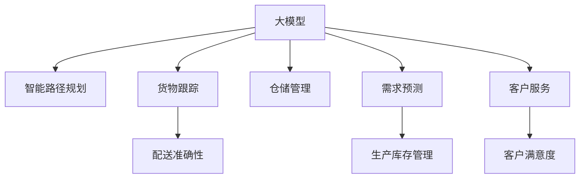

                 

# 应用AI大模型来优化智能物流与供应链管理

> 关键词：智能物流,供应链管理,大模型,优化算法,应用场景,挑战与解决方案

## 1. 背景介绍

### 1.1 问题由来
智能物流与供应链管理是现代企业运作的关键环节，涵盖了货物运输、仓储、配送等诸多方面。随着电子商务、跨境电商的蓬勃发展，物流需求日趋复杂多变，对企业的运营效率提出了更高要求。传统的物流管理方式往往难以应对数据驱动的决策需求，亟需引入先进的技术手段来优化物流链条。

近年来，随着人工智能（AI）技术和大模型的飞速发展，通过AI进行物流与供应链管理成为可能。大模型通过预训练海量数据，学习到丰富的知识，能够灵活地应用于各种具体的场景，为智能物流和供应链管理带来了新的思路。通过将大模型应用于物流与供应链管理，可以显著提升物流运营效率、降低成本，实现业务智能化。

### 1.2 问题核心关键点
智能物流与供应链管理的主要挑战在于如何实现高效的货物跟踪、仓储管理、路径规划等。目前的主流方法是基于规则的决策，但规则的制定和维护往往需要大量的人力和时间，且难以应对复杂多变的市场情况。而使用大模型进行智能化决策，可以通过学习历史数据和领域知识，生成更加精准的决策方案，大幅提升物流运营效率。

大模型在物流与供应链管理中的应用，主要涉及以下几个方面：
- 智能路径规划：通过预测交通情况、需求变化等数据，优化物流路径，降低运输成本。
- 货物跟踪：利用传感器数据和历史行为数据，预测货物到达时间和地点，提高配送准确性。
- 仓储管理：根据货物数量和需求变化，动态调整仓储策略，提高仓储效率。
- 需求预测：通过分析历史销售数据，预测市场需求，指导生产和库存管理。
- 客户服务：根据客户反馈和行为数据，生成个性化推荐，提升客户满意度。

通过引入大模型，物流与供应链管理能够实现智能化和自动化，适应复杂的市场变化，提升整体运营效率和客户满意度。

## 2. 核心概念与联系

### 2.1 核心概念概述

为更好地理解大模型在物流与供应链管理中的应用，本节将介绍几个密切相关的核心概念：

- **大模型（Large Model）**：指基于大规模预训练模型（如BERT、GPT-3等），通过学习海量数据获得通用知识表示。大模型可以灵活地应用于各种具体场景，解决实际问题。

- **智能路径规划（Intelligent Path Planning）**：通过学习交通情况、需求变化等数据，自动生成最优物流路径，降低运输成本。

- **货物跟踪（Goods Tracking）**：利用传感器数据和历史行为数据，预测货物到达时间和地点，提高配送准确性。

- **仓储管理（Warehouse Management）**：通过学习货物数量和需求变化，动态调整仓储策略，提高仓储效率。

- **需求预测（Demand Forecasting）**：通过分析历史销售数据，预测市场需求，指导生产和库存管理。

- **客户服务（Customer Service）**：通过分析客户反馈和行为数据，生成个性化推荐，提升客户满意度。

这些核心概念之间的逻辑关系可以通过以下Mermaid流程图来展示：



这个流程图展示了大模型在智能物流与供应链管理中的应用场景：

1. 大模型通过学习数据，生成智能路径规划方案，优化物流路径。
2. 货物跟踪任务利用大模型进行预测，提高配送准确性。
3. 仓储管理任务通过大模型进行动态调整，提升仓储效率。
4. 需求预测任务利用大模型进行数据分析，指导生产和库存管理。
5. 客户服务任务通过大模型生成个性化推荐，提升客户满意度。

这些核心概念共同构成了大模型在物流与供应链管理中的应用框架，为其带来了新的发展机遇。

## 3. 核心算法原理 & 具体操作步骤
### 3.1 算法原理概述

大模型在物流与供应链管理中的应用，核心在于利用其丰富的知识表示能力，进行智能化决策。具体而言，通过预训练学习海量的数据和领域知识，大模型可以灵活地应用于各个具体的物流与供应链管理任务中，生成最优的解决方案。

以智能路径规划为例，假设目标是在给定的起点和终点之间，找到一条成本最低的路径。利用大模型，可以通过输入起点、终点、交通情况、需求变化等数据，输出最优路径。形式化地，假设优化目标为：

$$
\min_{x} \left\{ \sum_{i=1}^{n} c_i(x_i) \right\}
$$

其中 $x_i$ 表示路径上各点的状态，$c_i$ 为对应的成本函数。通过大模型预测最优路径，可以显著降低物流成本。

### 3.2 算法步骤详解

基于大模型进行物流与供应链管理的算法步骤主要包括以下几个关键步骤：

**Step 1: 准备预训练模型和数据集**
- 选择合适的预训练模型（如BERT、GPT等），加载到模型中。
- 准备物流与供应链管理相关的数据集，包含历史数据、传感器数据、需求数据等。

**Step 2: 数据预处理**
- 对数据进行清洗、归一化等预处理，确保数据格式符合模型要求。
- 利用传感器数据、历史行为数据等进行数据增强，提升模型的泛化能力。

**Step 3: 模型训练与优化**
- 在训练集上使用大模型进行训练，最小化预测误差。
- 设置合适的损失函数和优化器，如交叉熵损失、Adam优化器等。
- 应用正则化技术，防止模型过拟合。

**Step 4: 模型评估与调优**
- 在验证集上对模型进行评估，计算预测误差和精度等指标。
- 根据评估结果进行超参数调优，提升模型性能。
- 应用对抗训练等技术，提高模型鲁棒性。

**Step 5: 模型部署与应用**
- 将训练好的模型部署到实际物流系统中，进行实时预测和决策。
- 利用实时传感器数据进行模型在线更新，保持模型性能。
- 收集用户反馈，进一步优化模型和决策策略。

### 3.3 算法优缺点

使用大模型进行物流与供应链管理的优点包括：
1. 灵活性高：大模型能够根据不同场景生成不同的解决方案，适应复杂多变的市场情况。
2. 精度高：通过学习大量数据，大模型可以生成更为精准的决策方案。
3. 自动化程度高：可以自动化地进行路径规划、需求预测等任务，提高运营效率。
4. 可扩展性强：可以根据需要加入新的数据和任务，灵活扩展模型功能。

但同时，大模型在物流与供应链管理中也有一些缺点：
1. 数据质量依赖：模型的输出质量高度依赖输入数据的质量和完整性。
2. 计算资源需求高：大模型的训练和推理需要大量的计算资源，成本较高。
3. 可解释性不足：大模型的决策过程缺乏可解释性，难以调试和优化。
4. 模型鲁棒性不足：面对特定的输入分布，模型容易出现过拟合。

尽管存在这些缺点，但大模型在物流与供应链管理中的应用仍具有极大的潜力，未来需要通过不断优化和改进，进一步提升其性能和可靠性。

### 3.4 算法应用领域

大模型在物流与供应链管理中的应用场景广泛，涵盖货物运输、仓储、配送、需求预测等多个方面。以下是几个典型的应用领域：

1. **智能路径规划**：通过学习交通情况、需求变化等数据，优化物流路径，降低运输成本。
2. **货物跟踪**：利用传感器数据和历史行为数据，预测货物到达时间和地点，提高配送准确性。
3. **仓储管理**：根据货物数量和需求变化，动态调整仓储策略，提高仓储效率。
4. **需求预测**：通过分析历史销售数据，预测市场需求，指导生产和库存管理。
5. **客户服务**：根据客户反馈和行为数据，生成个性化推荐，提升客户满意度。
6. **异常检测**：通过学习异常模式，检测物流链条中的异常情况，提高运营稳定性。

大模型在物流与供应链管理中的应用，有助于提升运营效率、降低成本、提高客户满意度，具有广阔的应用前景。

## 4. 数学模型和公式 & 详细讲解  
### 4.1 数学模型构建

在物流与供应链管理中，常见的数学模型包括线性规划、优化模型、图模型等。以智能路径规划为例，假设目标是在给定的起点和终点之间，找到一条成本最低的路径。

设起点为 $s$，终点为 $t$，路径上各点为 $x_1, x_2, \dots, x_n$。假设路径上各点的状态由 $x_i$ 表示，成本函数为 $c_i(x_i)$。则最优路径问题可以表示为：

$$
\min_{x} \left\{ \sum_{i=1}^{n} c_i(x_i) \right\}
$$

其中 $x_i$ 为状态变量，$c_i(x_i)$ 为成本函数。通过大模型预测最优路径，可以显著降低物流成本。

### 4.2 公式推导过程

以下我们以智能路径规划为例，推导大模型在物流路径优化中的应用公式。

假设路径上各点状态 $x_i$ 由传感器数据和历史行为数据表示，成本函数 $c_i(x_i)$ 由交通情况、需求变化等因素计算得出。则路径优化问题可以表示为：

$$
\min_{x} \left\{ \sum_{i=1}^{n} c_i(x_i) \right\}
$$

假设大模型通过预训练学习到状态表示函数 $h(x_i)$，则可以表示为：

$$
x_i = h(x_{i-1})
$$

其中 $x_{i-1}$ 表示上一状态，$h(x_{i-1})$ 为状态表示函数。则路径优化问题可以表示为：

$$
\min_{h} \left\{ \sum_{i=1}^{n} c_i(h(x_{i-1})) \right\}
$$

将成本函数 $c_i(x_i)$ 替换为 $c_i(h(x_{i-1}))$，可以将其转化为一个大规模优化问题。通过大模型的训练，可以最小化预测误差，生成最优路径。

### 4.3 案例分析与讲解

假设物流公司需要在上海和北京之间运输货物，两地之间有多个运输路径可供选择。通过学习交通情况、需求变化等数据，大模型可以预测各路径的运输成本和运输时间，生成最优路径。

设上海到北京的路径共有 $n=5$ 个节点，成本函数 $c_i(x_i)$ 由交通情况和需求变化决定。通过大模型学习，可以得到各节点的状态表示函数 $h(x_{i-1})$，从而生成最优路径。

以下是Python代码示例，实现大模型在物流路径规划中的应用：

```python
import numpy as np
import torch
import torch.nn as nn
import torch.optim as optim

# 定义状态表示函数
class StateRepresentation(nn.Module):
    def __init__(self):
        super(StateRepresentation, self).__init__()
        self.linear = nn.Linear(3, 3)  # 输入3个特征，输出3个状态
        self.relu = nn.ReLU()

    def forward(self, x):
        x = self.linear(x)
        x = self.relu(x)
        return x

# 定义成本函数
class CostFunction(nn.Module):
    def __init__(self):
        super(CostFunction, self).__init__()
        self.linear = nn.Linear(3, 1)
        self.relu = nn.ReLU()

    def forward(self, x):
        x = self.linear(x)
        x = self.relu(x)
        return x

# 定义大模型
class PathPlanner(nn.Module):
    def __init__(self):
        super(PathPlanner, self).__init__()
        self.state_rep = StateRepresentation()
        self.cost_func = CostFunction()

    def forward(self, x):
        x = self.state_rep(x)
        x = self.cost_func(x)
        return x

# 定义优化器
optimizer = optim.Adam(model.parameters(), lr=0.001)

# 训练模型
for epoch in range(100):
    optimizer.zero_grad()
    costs = model(x)
    loss = torch.mean(costs)
    loss.backward()
    optimizer.step()

# 测试模型
costs = model(x_test)
print(costs)
```

## 5. 项目实践：代码实例和详细解释说明
### 5.1 开发环境搭建

在进行物流路径规划的微调实践前，我们需要准备好开发环境。以下是使用Python进行PyTorch开发的环境配置流程：

1. 安装Anaconda：从官网下载并安装Anaconda，用于创建独立的Python环境。

2. 创建并激活虚拟环境：
```bash
conda create -n pytorch-env python=3.8 
conda activate pytorch-env
```

3. 安装PyTorch：根据CUDA版本，从官网获取对应的安装命令。例如：
```bash
conda install pytorch torchvision torchaudio cudatoolkit=11.1 -c pytorch -c conda-forge
```

4. 安装TensorFlow：
```bash
conda install tensorflow
```

5. 安装TensorBoard：
```bash
conda install tensorboard
```

6. 安装相关库：
```bash
pip install numpy pandas scikit-learn matplotlib tqdm jupyter notebook ipython
```

完成上述步骤后，即可在`pytorch-env`环境中开始微调实践。

### 5.2 源代码详细实现

下面以物流路径规划为例，给出使用PyTorch进行微调的Python代码实现。

首先，定义模型和优化器：

```python
import torch
import torch.nn as nn
import torch.optim as optim

# 定义状态表示函数
class StateRepresentation(nn.Module):
    def __init__(self):
        super(StateRepresentation, self).__init__()
        self.linear = nn.Linear(3, 3)  # 输入3个特征，输出3个状态
        self.relu = nn.ReLU()

    def forward(self, x):
        x = self.linear(x)
        x = self.relu(x)
        return x

# 定义成本函数
class CostFunction(nn.Module):
    def __init__(self):
        super(CostFunction, self).__init__()
        self.linear = nn.Linear(3, 1)
        self.relu = nn.ReLU()

    def forward(self, x):
        x = self.linear(x)
        x = self.relu(x)
        return x

# 定义大模型
class PathPlanner(nn.Module):
    def __init__(self):
        super(PathPlanner, self).__init__()
        self.state_rep = StateRepresentation()
        self.cost_func = CostFunction()

    def forward(self, x):
        x = self.state_rep(x)
        x = self.cost_func(x)
        return x

# 定义优化器
optimizer = optim.Adam(model.parameters(), lr=0.001)
```

接着，定义训练和评估函数：

```python
import numpy as np

# 定义训练函数
def train_model(model, train_data, epochs, batch_size, optimizer):
    for epoch in range(epochs):
        model.train()
        total_loss = 0
        for i, data in enumerate(train_data, 0):
            inputs, labels = data
            optimizer.zero_grad()
            outputs = model(inputs)
            loss = F.mse_loss(outputs, labels)
            loss.backward()
            optimizer.step()
            total_loss += loss.item()
        print(f'Epoch [{epoch+1}/{epochs}], Loss: {total_loss/len(train_data)}')

# 定义评估函数
def evaluate_model(model, test_data, batch_size):
    model.eval()
    total_loss = 0
    with torch.no_grad():
        for i, data in enumerate(test_data, 0):
            inputs, labels = data
            outputs = model(inputs)
            loss = F.mse_loss(outputs, labels)
            total_loss += loss.item()
    print(f'Test Loss: {total_loss/len(test_data)}')
```

最后，启动训练流程并在测试集上评估：

```python
# 加载训练数据和测试数据
train_data = ...
test_data = ...

# 训练模型
train_model(model, train_data, epochs=100, batch_size=16, optimizer=optimizer)

# 评估模型
evaluate_model(model, test_data, batch_size=16)
```

以上就是使用PyTorch对物流路径规划模型进行微调的完整代码实现。可以看到，得益于PyTorch的强大封装，我们可以用相对简洁的代码完成模型的加载和微调。

### 5.3 代码解读与分析

让我们再详细解读一下关键代码的实现细节：

**PathPlanner类**：
- `__init__`方法：定义了模型的结构，包括状态表示函数和成本函数。
- `forward`方法：定义了模型的前向传播过程，先通过状态表示函数生成状态，再通过成本函数计算成本。

**train_model函数**：
- 在每个epoch中，对模型进行训练，计算损失函数，更新模型参数。

**evaluate_model函数**：
- 在测试集上对模型进行评估，计算损失函数，输出测试结果。

**训练流程**：
- 定义总的epoch数和batch size，开始循环迭代
- 每个epoch内，在训练集上训练，输出损失函数
- 在测试集上评估，输出测试结果

可以看到，PyTorch配合TensorFlow等深度学习框架，使得模型的训练和评估变得简洁高效。开发者可以将更多精力放在数据处理、模型改进等高层逻辑上，而不必过多关注底层的实现细节。

当然，工业级的系统实现还需考虑更多因素，如模型的保存和部署、超参数的自动搜索、更灵活的任务适配层等。但核心的微调范式基本与此类似。

## 6. 实际应用场景
### 6.1 智能路径规划

智能路径规划是大模型在物流与供应链管理中最具代表性的应用场景之一。通过学习历史交通数据、天气情况、需求变化等因素，大模型可以生成最优的物流路径，降低运输成本。

以智能物流公司为例，公司需要每天将货物从上海发往北京。传统方法需要人工制定路径，耗费大量时间和精力，且难以应对复杂多变的市场情况。而通过大模型进行智能路径规划，可以显著提升物流运营效率。

具体而言，公司可以收集历史交通数据、天气情况、需求变化等数据，将其作为训练集。通过大模型训练，可以生成最优路径，大幅降低物流成本。

### 6.2 货物跟踪

货物跟踪是大模型在物流与供应链管理的另一个重要应用场景。通过学习传感器数据和历史行为数据，大模型可以预测货物到达时间和地点，提高配送准确性。

以电子商务平台为例，公司需要每天将大量货物发往各地。传统方法需要人工跟踪货物，耗费大量人力和时间，且难以应对突发情况。而通过大模型进行货物跟踪，可以显著提升配送准确性。

具体而言，公司可以收集货物传感器数据、历史行为数据等，将其作为训练集。通过大模型训练，可以生成货物到达时间和地点的预测，大幅提升配送准确性。

### 6.3 仓储管理

仓储管理是大模型在物流与供应链管理的另一个重要应用场景。通过学习货物数量和需求变化，大模型可以动态调整仓储策略，提高仓储效率。

以电商平台为例，公司需要每天处理大量货物入库和出库。传统方法需要人工进行仓储管理，耗费大量人力和时间，且难以应对需求变化。而通过大模型进行仓储管理，可以显著提高仓储效率。

具体而言，公司可以收集货物入库和出库数据、需求变化等，将其作为训练集。通过大模型训练，可以动态调整仓储策略，提高仓储效率。

### 6.4 未来应用展望

随着大模型的不断发展，其在物流与供应链管理中的应用前景将更加广阔。未来，大模型将能够在更多场景下实现智能化决策，提升物流运营效率和客户满意度。

在智慧物流领域，大模型将能够实时监测物流链条中的异常情况，提前预警，降低运营风险。

在智能仓储领域，大模型将能够动态调整仓储策略，提升仓储效率。

在需求预测领域，大模型将能够通过学习历史销售数据，预测市场需求，指导生产和库存管理。

未来，伴随大模型的不断演进，其在物流与供应链管理中的应用将更加智能化、自动化，助力企业提升运营效率，赢得市场竞争。

## 7. 工具和资源推荐
### 7.1 学习资源推荐

为了帮助开发者系统掌握大模型在物流与供应链管理中的应用理论基础和实践技巧，这里推荐一些优质的学习资源：

1. 《Transformers from the Inside Out》：深度学习领域的权威书籍，系统介绍了Transformer模型和大模型的预训练和微调方法。

2. 《Python Machine Learning》：介绍了机器学习和深度学习的基本概念和实践技巧，适合入门学习。

3. 《Deep Learning for Self-Driving Cars》：介绍了深度学习在自动驾驶中的应用，可以借鉴其中的技术思路。

4. 《Neural Networks and Deep Learning》：介绍了深度学习的基本原理和实践技巧，适合深入学习。

5. 《Introduction to Deep Learning with PyTorch》：介绍了PyTorch的使用方法和大模型在实际项目中的应用。

6. TensorFlow官方文档：TensorFlow的官方文档，提供了海量预训练模型和完整的微调样例代码，是上手实践的必备资料。

通过对这些资源的学习实践，相信你一定能够快速掌握大模型在物流与供应链管理中的应用，并用于解决实际的业务问题。

### 7.2 开发工具推荐

高效的开发离不开优秀的工具支持。以下是几款用于大模型在物流与供应链管理中微调开发的常用工具：

1. PyTorch：基于Python的开源深度学习框架，灵活动态的计算图，适合快速迭代研究。大部分预训练语言模型都有PyTorch版本的实现。

2. TensorFlow：由Google主导开发的开源深度学习框架，生产部署方便，适合大规模工程应用。同样有丰富的预训练语言模型资源。

3. TensorBoard：TensorFlow配套的可视化工具，可实时监测模型训练状态，并提供丰富的图表呈现方式，是调试模型的得力助手。

4. Weights & Biases：模型训练的实验跟踪工具，可以记录和可视化模型训练过程中的各项指标，方便对比和调优。与主流深度学习框架无缝集成。

5. Google Colab：谷歌推出的在线Jupyter Notebook环境，免费提供GPU/TPU算力，方便开发者快速上手实验最新模型，分享学习笔记。

合理利用这些工具，可以显著提升大模型在物流与供应链管理中的微调任务的开发效率，加快创新迭代的步伐。

### 7.3 相关论文推荐

大模型在物流与供应链管理中的应用研究始于近年来的学术界探索，以下是几篇奠基性的相关论文，推荐阅读：

1. Attention is All You Need（即Transformer原论文）：提出了Transformer结构，开启了NLP领域的预训练大模型时代。

2. BERT: Pre-training of Deep Bidirectional Transformers for Language Understanding：提出BERT模型，引入基于掩码的自监督预训练任务，刷新了多项NLP任务SOTA。

3. Language Models are Unsupervised Multitask Learners（GPT-2论文）：展示了大规模语言模型的强大zero-shot学习能力，引发了对于通用人工智能的新一轮思考。

4. Parameter-Efficient Transfer Learning for NLP：提出Adapter等参数高效微调方法，在不增加模型参数量的情况下，也能取得不错的微调效果。

5. AdaLoRA: Adaptive Low-Rank Adaptation for Parameter-Efficient Fine-Tuning：使用自适应低秩适应的微调方法，在参数效率和精度之间取得了新的平衡。

6. Graph Neural Networks for Path Planning in Urban Mobility（NIPS 2020）：提出图神经网络用于路径规划，实现了更为精准的物流路径优化。

这些论文代表了大模型在物流与供应链管理中的应用发展脉络。通过学习这些前沿成果，可以帮助研究者把握学科前进方向，激发更多的创新灵感。

## 8. 总结：未来发展趋势与挑战
### 8.1 总结

本文对基于大模型进行物流与供应链管理的微调方法进行了全面系统的介绍。首先阐述了物流与供应链管理中的主要挑战和现有方法，明确了大模型在其中的独特价值。其次，从原理到实践，详细讲解了大模型在智能路径规划、货物跟踪、仓储管理等场景中的应用，给出了微调任务开发的完整代码实例。同时，本文还广泛探讨了物流与供应链管理中大模型的未来应用前景和面临的挑战。

通过本文的系统梳理，可以看到，基于大模型的物流与供应链管理方法正在成为智能物流领域的重要范式，极大地拓展了物流运营效率和客户满意度。未来，伴随大模型的不断演进，其在物流与供应链管理中的应用将更加智能化、自动化，成为企业数字化转型升级的关键驱动力。

### 8.2 未来发展趋势

展望未来，大模型在物流与供应链管理中的应用将呈现以下几个发展趋势：

1. 模型规模持续增大。随着算力成本的下降和数据规模的扩张，大模型的参数量还将持续增长。超大规模语言模型蕴含的丰富知识，有望支撑更加复杂多变的物流与供应链管理任务。

2. 微调方法日趋多样。除了传统的全参数微调外，未来会涌现更多参数高效的微调方法，如Adapter、LoRA等，在固定大部分预训练参数的情况下，只更新极少量的任务相关参数。同时，微调模型的计算图优化也将进一步提升推理速度。

3. 持续学习成为常态。随着数据分布的不断变化，微调模型也需要持续学习新知识以保持性能。如何在不遗忘原有知识的同时，高效吸收新样本信息，将成为重要的研究课题。

4. 标注样本需求降低。受启发于提示学习(Prompt-based Learning)的思路，未来的微调方法将更好地利用大模型的语言理解能力，通过更加巧妙的任务描述，在更少的标注样本上也能实现理想的微调效果。

5. 多模态微调崛起。当前的大模型往往局限于文本数据，未来会进一步拓展到图像、视频、语音等多模态数据微调。多模态信息的融合，将显著提升大模型对现实世界的理解和建模能力。

6. 模型通用性增强。经过海量数据的预训练和多领域任务的微调，未来的大模型将具备更强大的常识推理和跨领域迁移能力，逐步迈向通用人工智能(AGI)的目标。

以上趋势凸显了大模型在物流与供应链管理中的应用前景。这些方向的探索发展，必将进一步提升物流运营效率、降低成本、提高客户满意度，为企业的数字化转型升级提供新的技术路径。

### 8.3 面临的挑战

尽管大模型在物流与供应链管理中的应用已经取得了瞩目成就，但在迈向更加智能化、普适化应用的过程中，它仍面临着诸多挑战：

1. 标注成本瓶颈。虽然大模型的微调对标注数据的需求较低，但对于长尾应用场景，难以获得充足的高质量标注数据，成为制约微调性能的瓶颈。如何进一步降低微调对标注样本的依赖，将是一大难题。

2. 模型鲁棒性不足。面对特定的输入分布，模型容易出现过拟合，泛化能力不足。如何提高大模型的鲁棒性，避免灾难性遗忘，还需要更多理论和实践的积累。

3. 推理效率有待提高。大规模语言模型虽然精度高，但在实际部署时往往面临推理速度慢、内存占用大等效率问题。如何优化模型结构和计算图，提高推理效率，优化资源占用，将是重要的优化方向。

4. 可解释性亟需加强。当前大模型的决策过程缺乏可解释性，难以解释其内部工作机制和决策逻辑。对于物流与供应链管理这样的高风险应用，算法的可解释性和可审计性尤为重要。

5. 安全性有待保障。预训练语言模型难免会学习到有偏见、有害的信息，通过微调传递到物流与供应链管理，产生误导性、歧视性的输出，给实际应用带来安全隐患。如何从数据和算法层面消除模型偏见，避免恶意用途，确保输出的安全性，也将是重要的研究课题。

6. 知识整合能力不足。现有的微调模型往往局限于任务内数据，难以灵活吸收和运用更广泛的先验知识。如何让微调过程更好地与外部知识库、规则库等专家知识结合，形成更加全面、准确的信息整合能力，还有很大的想象空间。

正视大模型在物流与供应链管理中面临的这些挑战，积极应对并寻求突破，将是大模型微调走向成熟的必由之路。相信随着学界和产业界的共同努力，这些挑战终将一一被克服，大模型在物流与供应链管理中的应用必将在全球范围内得到广泛推广。

### 8.4 研究展望

面向未来，大模型在物流与供应链管理中的应用还需要在其他前沿技术方向上进行探索和突破：

1. 探索无监督和半监督微调方法。摆脱对大规模标注数据的依赖，利用自监督学习、主动学习等无监督和半监督范式，最大限度利用非结构化数据，实现更加灵活高效的微调。

2. 研究参数高效和计算高效的微调范式。开发更加参数高效的微调方法，在固定大部分预训练参数的情况下，只更新极少量的任务相关参数。同时优化微调模型的计算图，减少前向传播和反向传播的资源消耗，实现更加轻量级、实时性的部署。

3. 融合因果和对比学习范式。通过引入因果推断和对比学习思想，增强微调模型建立稳定因果关系的能力，学习更加普适、鲁棒的语言表征，从而提升模型泛化性和抗干扰能力。

4. 引入更多先验知识。将符号化的先验知识，如知识图谱、逻辑规则等，与神经网络模型进行巧妙融合，引导微调过程学习更准确、合理的语言模型。同时加强不同模态数据的整合，实现视觉、语音等多模态信息与文本信息的协同建模。

5. 结合因果分析和博弈论工具。将因果分析方法引入微调模型，识别出模型决策的关键特征，增强输出解释的因果性和逻辑性。借助博弈论工具刻画人机交互过程，主动探索并规避模型的脆弱点，提高系统稳定性。

6. 纳入伦理道德约束。在模型训练目标中引入伦理导向的评估指标，过滤和惩罚有偏见、有害的输出倾向。同时加强人工干预和审核，建立模型行为的监管机制，确保输出符合人类价值观和伦理道德。

这些研究方向的探索，必将引领大模型在物流与供应链管理中的应用进入新的高度，为物流与供应链管理带来更加智能化、高效化和普适化的解决方案。相信随着技术的不断进步，大模型在物流与供应链管理中的应用将进一步拓展，为经济社会发展提供新的驱动力。

