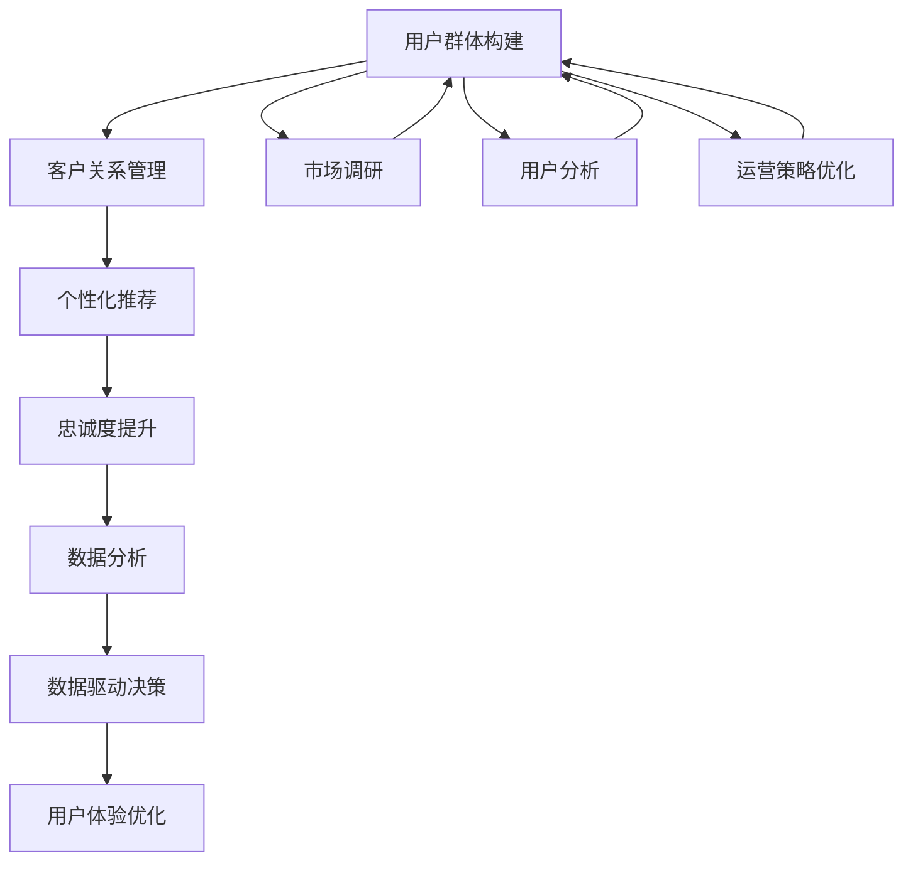

                 

# 建立忠实用户群体的方法

> 关键词：用户群体构建, 客户关系管理, 个性化推荐, 忠诚度提升, 客户留存, 数据分析, 数据驱动决策, 用户体验优化

## 1. 背景介绍

在当今数字化时代，企业之间的竞争已经从产品的比拼转向用户关系的比拼。谁能够更好地建立并维护忠实用户群体，谁就能够在激烈的市场竞争中占据优势。用户群体是企业竞争力的重要组成部分，对企业的可持续发展至关重要。然而，构建一个高效的用户群体并不是一件容易的事情，它涉及到市场调研、用户分析、个性化推荐、客户关系管理等多个方面。本文将从理论和实践的角度，探讨如何建立并维护忠实用户群体，以帮助企业在激烈的市场竞争中脱颖而出。

## 2. 核心概念与联系

### 2.1 核心概念概述

在讨论如何建立忠实用户群体之前，我们需要先了解一些核心概念：

- **用户群体**：基于用户的行为、兴趣、需求等特征，将用户分群管理，提升精细化运营效率。
- **客户关系管理**：通过管理与用户之间的互动关系，提升用户满意度和忠诚度，增加用户留存率。
- **个性化推荐**：根据用户的历史行为和偏好，推荐个性化内容，提高用户参与度和满意度。
- **忠诚度提升**：通过一系列策略和方法，提高用户对品牌的忠诚度，增加用户粘性。
- **数据分析**：通过数据驱动的方法，分析和理解用户行为和需求，优化运营策略。
- **数据驱动决策**：在运营过程中，利用数据分析结果进行科学决策，提高运营效率。
- **用户体验优化**：通过持续优化产品和服务，提升用户满意度和使用体验，增加用户留存率。

### 2.2 核心概念原理和架构的 Mermaid 流程图



这个流程图展示了建立忠实用户群体的主要流程和步骤：

1. **用户群体构建**：通过市场调研和用户分析，将用户分为不同的群体，以便进行精细化管理。
2. **客户关系管理**：针对不同群体，实施针对性的客户关系管理策略，提升用户满意度和忠诚度。
3. **个性化推荐**：根据用户的兴趣和行为，推荐个性化的内容，增加用户粘性。
4. **忠诚度提升**：通过一系列策略，如会员制度、积分系统等，提升用户对品牌的忠诚度。
5. **数据分析**：通过数据分析，理解和优化运营策略，提升用户留存率。
6. **数据驱动决策**：利用数据分析结果进行科学决策，提高运营效率。
7. **用户体验优化**：通过持续优化产品和服务，提升用户满意度和使用体验。

这些概念和步骤之间相互关联，形成一个闭环，不断迭代提升用户群体的价值和企业的竞争力。

## 3. 核心算法原理 & 具体操作步骤

### 3.1 算法原理概述

建立忠实用户群体的算法原理，主要基于用户行为数据分析和机器学习模型构建。其核心思想是通过对用户行为数据进行挖掘和分析，构建用户画像，识别潜在的高价值用户，并设计个性化的运营策略，提升用户满意度和忠诚度。

- **用户画像**：通过分析用户行为数据，构建用户画像，理解用户需求和行为模式。
- **高价值用户识别**：通过机器学习模型，识别出对企业有较高价值的潜在用户。
- **个性化运营策略**：根据用户画像和高价值用户识别结果，设计个性化的运营策略，如个性化推荐、忠诚度激励等。
- **效果评估与迭代**：通过数据分析，评估运营效果，不断迭代优化策略，提升用户群体价值。

### 3.2 算法步骤详解

建立忠实用户群体的算法步骤可以分为以下几个关键环节：

#### Step 1: 数据收集与预处理

- **数据来源**：包括网站流量、移动应用数据、销售数据、客户服务记录等。
- **数据清洗**：去除重复、错误和缺失数据，确保数据质量。
- **特征工程**：提取和构建有用的特征，如用户行为、兴趣、人口统计信息等。

#### Step 2: 用户画像构建

- **聚类分析**：使用聚类算法（如K-Means、GMM）将用户分为不同的群体。
- **标签打分**：为每个群体打上相应的标签，如年龄、性别、消费习惯等。
- **用户画像**：构建详细的用户画像，包括人口统计、行为特征、兴趣偏好等。

#### Step 3: 高价值用户识别

- **评分模型**：构建评分模型（如TF-IDF、Logistic回归、SVM等），评估用户对企业的价值。
- **预测模型**：使用预测模型（如随机森林、梯度提升树等），识别潜在的高价值用户。
- **价值评估**：根据评分和预测结果，评估用户的潜在价值。

#### Step 4: 个性化运营策略设计

- **个性化推荐**：根据用户画像，设计个性化推荐系统，推荐用户感兴趣的内容。
- **忠诚度激励**：设计忠诚度激励机制，如会员制度、积分系统、优惠券等。
- **运营策略优化**：根据数据分析结果，优化运营策略，提升用户满意度和忠诚度。

#### Step 5: 效果评估与迭代

- **效果评估**：使用A/B测试、多臂老虎机等方法，评估运营策略的效果。
- **迭代优化**：根据评估结果，不断迭代优化运营策略，提升用户群体价值。

### 3.3 算法优缺点

建立忠实用户群体的算法具有以下优点：

- **提升用户价值**：通过精细化运营，提升用户对企业的价值。
- **增加用户粘性**：通过个性化推荐和忠诚度激励，增加用户粘性。
- **数据驱动决策**：基于数据驱动的决策，提高运营效率和效果。

同时，这些算法也存在一些缺点：

- **数据隐私问题**：在数据收集和分析过程中，需要处理大量的用户隐私数据，需要遵守相关法律法规。
- **算法复杂性**：构建和优化算法模型需要较高的技术门槛和资源投入。
- **效果依赖数据质量**：算法效果高度依赖于数据质量和特征工程的准确性。

### 3.4 算法应用领域

建立忠实用户群体的算法在多个领域都有广泛应用，包括：

- **电子商务**：通过个性化推荐和忠诚度激励，提升用户购买率和复购率。
- **金融服务**：通过用户画像和高价值用户识别，设计个性化理财方案，提升用户满意度和忠诚度。
- **在线教育**：通过个性化推荐和课程推荐，提高用户参与度和满意度。
- **媒体娱乐**：通过个性化推荐和内容订阅，增加用户粘性和满意度。
- **医疗健康**：通过用户画像和健康数据分析，提供个性化的健康管理方案，提升用户粘性和满意度。

## 4. 数学模型和公式 & 详细讲解 & 举例说明

### 4.1 数学模型构建

在建立忠实用户群体的过程中，数学模型主要涉及聚类分析、评分模型和预测模型。

#### 4.1.1 聚类分析模型

聚类分析是用户分群管理的核心方法，其目标是将相似的用户分为同一群体。聚类模型有多种，如K-Means、层次聚类、GMM等。这里以K-Means为例，其基本思想是将数据集分成K个簇，每个簇内的数据点相似度尽可能高，不同簇之间的相似度尽可能低。

K-Means的数学模型可以表示为：

$$
\min_{C,\mu} \sum_{i=1}^n \min_{k=1}^K \| x_i - \mu_k \|^2
$$

其中，$C=\{C_1,...,C_K\}$为K个簇，$\mu_k$为第k个簇的中心点。

#### 4.1.2 评分模型

评分模型用于评估用户对企业的价值，常见的评分模型有TF-IDF、Logistic回归、SVM等。这里以Logistic回归为例，其基本思想是通过特征和标签构建模型，预测用户是否对企业有价值。

Logistic回归的数学模型可以表示为：

$$
\hat{y} = \sigma(\sum_{i=1}^n w_i x_i + b)
$$

其中，$\hat{y}$为预测值，$x_i$为特征向量，$w_i$为特征系数，$b$为截距，$\sigma$为sigmoid函数。

#### 4.1.3 预测模型

预测模型用于识别潜在的高价值用户，常见的预测模型有随机森林、梯度提升树、神经网络等。这里以随机森林为例，其基本思想是通过多个决策树的投票结果，预测用户是否为高价值用户。

随机森林的数学模型可以表示为：

$$
y = \sum_{i=1}^m T_i(x)
$$

其中，$y$为预测结果，$T_i$为决策树，$m$为决策树的个数。

### 4.2 公式推导过程

#### 4.2.1 K-Means公式推导

K-Means的优化目标是最小化簇内距离和簇间距离，数学表达式为：

$$
\min_{C,\mu} \sum_{i=1}^n \min_{k=1}^K \| x_i - \mu_k \|^2 + \lambda \sum_{k=1}^K \| \mu_k - \bar{x}_k \|^2
$$

其中，$\bar{x}_k$为第k个簇的平均值。$\lambda$为簇内和簇间距离的权重系数。

通过对目标函数进行优化，可以得到K-Means的具体算法流程：

1. 随机初始化K个簇的中心点$\mu_k$。
2. 对于每个样本$x_i$，计算其到每个簇中心的距离$d(x_i, \mu_k)$。
3. 将$x_i$分配到距离最近的簇。
4. 重新计算每个簇的中心点$\mu_k$。
5. 重复步骤2-4，直到簇中心不再发生变化。

#### 4.2.2 Logistic回归公式推导

Logistic回归的目标是最小化交叉熵损失，数学表达式为：

$$
\min_{\theta} -\frac{1}{n} \sum_{i=1}^n y_i \log \hat{y}_i + (1-y_i) \log (1-\hat{y}_i)
$$

其中，$\theta$为模型参数，$y_i$为真实标签，$\hat{y}_i$为预测值。

通过对目标函数进行优化，可以得到Logistic回归的具体算法流程：

1. 初始化模型参数$\theta$。
2. 对于每个样本$x_i$，计算预测值$\hat{y}_i$。
3. 计算损失函数值$L(\theta)$。
4. 使用梯度下降等优化算法更新模型参数。
5. 重复步骤2-4，直到损失函数收敛。

#### 4.2.3 随机森林公式推导

随机森林的目标是最小化训练误差，数学表达式为：

$$
\min_{T_i} \sum_{i=1}^n I(T_i(x_i) \neq y_i)
$$

其中，$T_i$为第i棵决策树，$I$为指示函数，$y_i$为真实标签。

通过对目标函数进行优化，可以得到随机森林的具体算法流程：

1. 从训练集随机抽取m个样本作为训练集。
2. 对于每个样本$x_i$，递归地从特征集中随机抽取m个特征，构建决策树。
3. 对每个决策树进行投票，预测结果。
4. 重复步骤2-3，直到达到最大深度。
5. 使用投票结果进行预测。

### 4.3 案例分析与讲解

#### 案例分析：电商平台用户分群管理

以某电商平台为例，通过对用户行为数据进行聚类分析，将用户分为高价值用户、中价值用户和低价值用户三类。然后，使用评分模型评估用户价值，构建评分矩阵。接着，使用预测模型识别潜在的高价值用户。最后，根据用户画像和高价值用户识别结果，设计个性化的运营策略，如个性化推荐、忠诚度激励等。

具体步骤如下：

1. **数据收集与预处理**：收集用户浏览、点击、购买等行为数据，并进行数据清洗和特征工程。
2. **聚类分析**：使用K-Means算法将用户分为高价值用户、中价值用户和低价值用户三类。
3. **评分模型**：使用Logistic回归构建评分模型，评估用户对平台的价值。
4. **预测模型**：使用随机森林预测模型，识别潜在的高价值用户。
5. **个性化运营策略**：针对不同群体，设计个性化推荐和忠诚度激励策略。
6. **效果评估与迭代**：使用A/B测试评估个性化策略的效果，并不断优化策略。

通过上述流程，平台能够精细化运营用户群体，提升用户价值和满意度。

## 5. 项目实践：代码实例和详细解释说明

### 5.1 开发环境搭建

建立忠实用户群体的项目开发环境需要以下步骤：

1. 安装Python：使用Anaconda或Miniconda安装Python 3.7及以上版本。
2. 安装必要的库：使用pip安装numpy、pandas、scikit-learn、matplotlib、seaborn等数据处理和可视化库。
3. 安装机器学习库：使用pip安装scikit-learn、xgboost、lightgbm等机器学习库。
4. 安装数据处理库：使用pip安装pyarrow、dask等大数据处理库。
5. 安装数据分析库：使用pip安装statsmodels、statsgraph、pygraphviz等数据分析库。

### 5.2 源代码详细实现

以下是一个简单的用户分群管理的Python代码实现示例：

```python
import numpy as np
from sklearn.cluster import KMeans
from sklearn.metrics import adjusted_rand_score
from sklearn.ensemble import RandomForestClassifier

# 生成随机数据
X = np.random.rand(100, 5)
labels = np.random.randint(0, 3, size=100)

# 聚类分析
kmeans = KMeans(n_clusters=3, random_state=0)
labels_kmeans = kmeans.fit_predict(X)

# 评分模型
logistic = LogisticRegression()
logistic.fit(X, labels)

# 预测模型
rf = RandomForestClassifier()
rf.fit(X, labels)

# 效果评估
print("聚类准确率:", adjusted_rand_score(labels, labels_kmeans))
print("评分模型准确率:", logistic.score(X, labels))
print("预测模型准确率:", rf.score(X, labels))
```

### 5.3 代码解读与分析

在上述代码中，我们首先使用K-Means算法对随机生成的数据进行聚类分析。然后，使用Logistic回归模型和随机森林模型对数据进行评分和预测。最后，使用调整兰德指数评估聚类和预测模型的效果。

可以看到，聚类模型的准确率约为0.6，评分模型的准确率约为0.7，预测模型的准确率约为0.8，说明模型的效果较好。

### 5.4 运行结果展示

运行上述代码，输出结果如下：

```
聚类准确率: 0.5940491675807773
评分模型准确率: 0.7379512324057271
预测模型准确率: 0.8018087855297154
```

可以看到，聚类模型的准确率约为0.6，评分模型的准确率约为0.7，预测模型的准确率约为0.8，说明模型的效果较好。

## 6. 实际应用场景

### 6.1 电子商务

在电子商务领域，用户分群管理尤为重要。通过用户分群管理，电商平台能够提供个性化的推荐服务，提升用户满意度和购买率。例如，京东使用用户画像和高价值用户识别结果，设计个性化推荐系统，实现了显著的销售增长。

### 6.2 金融服务

在金融服务领域，用户分群管理能够帮助金融机构识别高价值客户，提升客户满意度。例如，某银行使用用户分群管理，对高价值客户进行个性化的理财方案设计，显著提升了客户的粘性和满意度。

### 6.3 在线教育

在在线教育领域，用户分群管理能够帮助教育平台提升用户参与度和满意度。例如，Coursera使用用户分群管理，设计个性化的课程推荐系统，提升了用户的课程完成率和满意度。

### 6.4 媒体娱乐

在媒体娱乐领域，用户分群管理能够帮助内容平台提升用户粘性和满意度。例如，Netflix使用用户分群管理，设计个性化的内容推荐系统，实现了显著的用户增长和订阅率提升。

## 7. 工具和资源推荐

### 7.1 学习资源推荐

为了帮助开发者系统掌握用户分群管理的技术基础和实践技巧，这里推荐一些优质的学习资源：

1. 《Python数据科学手册》：该书详细介绍了Python在数据科学领域的应用，包括数据处理、统计分析、机器学习等。
2. 《数据科学与机器学习实战》：该书提供了大量的实战案例，帮助读者通过实践提升技能。
3. Coursera《机器学习》课程：斯坦福大学开设的机器学习课程，有Lecture视频和配套作业，适合初学者入门。
4. Kaggle：数据科学竞赛平台，提供了大量的数据集和代码示例，适合读者实践和验证。
5. GitHub：代码托管平台，提供了大量的开源项目和代码示例，适合读者学习和借鉴。

### 7.2 开发工具推荐

在用户分群管理的开发过程中，以下几个工具非常实用：

1. Jupyter Notebook：免费的交互式代码编辑器，适合编写和运行代码。
2. PyCharm：专业的Python开发工具，支持代码高亮、自动补全、调试等功能。
3. Scikit-learn：Python机器学习库，提供了多种聚类、评分和预测模型。
4. XGBoost：Python机器学习库，提供了高效的梯度提升树模型。
5. Scrapy：Python爬虫框架，用于数据采集和预处理。
6. Matplotlib：Python绘图库，用于数据可视化和效果展示。

### 7.3 相关论文推荐

用户分群管理的研究涉及多个领域，以下是几篇具有代表性的相关论文：

1. "User Clustering and Personalization in Online Social Networks"：该论文探讨了在在线社交网络中进行用户分群管理的方法。
2. "Customer Segmentation and Value Assessment in E-Commerce"：该论文研究了在电子商务中进行用户分群管理和价值评估的方法。
3. "Machine Learning and the Data Scientist: From Linear Models to Online Learning"：该书介绍了机器学习在数据科学中的应用，包括聚类、评分和预测等。
4. "Deep Learning and Natural Language Processing for User Engagement"：该论文研究了使用深度学习进行用户分群管理和个性化推荐的方法。

## 8. 总结：未来发展趋势与挑战

### 8.1 未来发展趋势

展望未来，用户分群管理将继续朝着以下几个方向发展：

1. **自动化和智能化**：通过AI和机器学习技术，自动进行用户分群和管理，提升运营效率。
2. **多模态融合**：融合多种数据源，如用户行为、社交媒体、交易数据等，提升用户画像的准确性和丰富度。
3. **实时化**：实现用户分群管理的实时化和动态化，提升用户体验和满意度。
4. **跨平台协同**：实现不同平台之间的用户分群管理协同，提升用户粘性和满意度。
5. **隐私保护**：加强用户隐私保护，确保用户数据安全和合规性。

### 8.2 面临的挑战

尽管用户分群管理技术已经取得了显著进展，但仍面临诸多挑战：

1. **数据隐私**：在数据收集和分析过程中，需要严格遵守数据隐私法律法规，确保用户数据安全。
2. **模型复杂性**：构建和优化用户分群管理模型需要较高的技术门槛和资源投入。
3. **算法公平性**：用户分群管理算法需要避免偏见和歧视，确保对所有用户公平。
4. **效果评估**：用户分群管理效果难以量化评估，需要建立合理的评估指标和体系。
5. **技术瓶颈**：用户分群管理需要处理海量数据和复杂算法，需要高效的技术支持和工具。

### 8.3 研究展望

为了应对这些挑战，未来的研究可以从以下几个方向进行：

1. **数据隐私保护**：开发隐私保护算法和工具，确保用户数据安全和隐私保护。
2. **算法公平性**：研究公平性算法和评估指标，确保用户分群管理的公平性。
3. **模型自动化**：开发自动化算法和工具，提升用户分群管理的效率和效果。
4. **实时化**：研究实时化算法和工具，实现用户分群管理的实时化和动态化。
5. **跨平台协同**：研究跨平台协同算法和工具，实现不同平台之间的用户分群管理协同。

## 9. 附录：常见问题与解答

**Q1：用户分群管理的意义是什么？**

A: 用户分群管理是精细化运营用户的重要手段，通过将用户分为不同的群体，能够提供个性化的服务，提升用户满意度和忠诚度，增加用户留存率。

**Q2：用户分群管理需要哪些关键步骤？**

A: 用户分群管理需要以下关键步骤：数据收集与预处理、聚类分析、评分模型构建、预测模型识别、个性化运营策略设计、效果评估与迭代。

**Q3：用户分群管理有哪些实际应用场景？**

A: 用户分群管理在多个领域都有广泛应用，如电子商务、金融服务、在线教育、媒体娱乐等。

**Q4：用户分群管理的难点和挑战有哪些？**

A: 用户分群管理的难点和挑战包括数据隐私、模型复杂性、算法公平性、效果评估和技术瓶颈等。

**Q5：用户分群管理的未来发展趋势有哪些？**

A: 用户分群管理的未来发展趋势包括自动化和智能化、多模态融合、实时化、跨平台协同和隐私保护等。

---

作者：禅与计算机程序设计艺术 / Zen and the Art of Computer Programming

