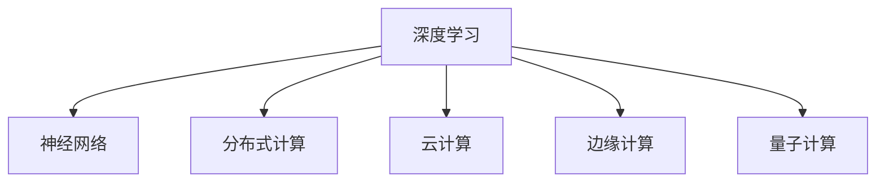

                 

## 1. 背景介绍

### 1.1 问题由来

随着人工智能技术的迅猛发展，计算技术已经成为推动社会进步的重要引擎。从早期的基于规则的专家系统到后来的机器学习算法，再到如今深度学习与计算的结合，计算技术正逐步走向一个新的发展阶段。在这个阶段，我们面临的不仅是技术上的挑战，更是对人类计算本质的重新思考。

### 1.2 问题核心关键点

当前计算技术的核心在于通过算法与数据，实现对信息的高效处理与理解。而深度学习与神经网络的发展，让计算机在处理复杂问题时，能够超越传统规则与统计方法，达到前所未有的精度与效率。但与此同时，我们也需要解决一系列关键问题，如数据隐私保护、模型可解释性、以及计算资源与效率的平衡等。

这些问题不仅涉及技术层面，还关乎伦理与社会价值。如何构建一个更安全、更公正、更高效的人类计算新征程，成为当今学术界和工业界共同探讨的重要课题。

## 2. 核心概念与联系

### 2.1 核心概念概述

为更好地理解这一新征程，本节将介绍几个密切相关的核心概念：

- 深度学习（Deep Learning）：基于神经网络的机器学习范式，通过多层次的特征提取与学习，实现对复杂数据的深度理解与分析。

- 神经网络（Neural Network）：由大量人工神经元组成，通过连接权重与激活函数，完成数据的映射与分类等任务。

- 分布式计算（Distributed Computing）：通过多台计算机的协同工作，实现对大规模数据集的高效处理。

- 云计算（Cloud Computing）：利用互联网基础设施，实现资源的按需访问与弹性扩展，降低计算成本，提高计算效率。

- 边缘计算（Edge Computing）：在数据源附近进行计算，减少数据传输距离，提升计算响应速度。

- 量子计算（Quantum Computing）：利用量子态的叠加与纠缠特性，实现超高效的计算与信息处理。

这些核心概念之间的逻辑关系可以通过以下Mermaid流程图来展示：



这个流程图展示了几大计算技术之间的联系与相互作用：

- 深度学习通过神经网络实现复杂数据的特征提取与分析。
- 分布式计算和云计算提供了高效、弹性的计算资源，支持大规模深度学习的训练与推理。
- 边缘计算优化了数据传输与计算路径，提升响应速度。
- 量子计算探索了全新的计算方式，挑战传统计算极限。

这些技术共同构成了现代计算体系的基础，为人类计算开辟了新的可能性。

## 3. 核心算法原理 & 具体操作步骤
### 3.1 算法原理概述

基于深度学习与分布式计算的新型人类计算范式，主要依赖于算法的不断优化与数据的高效利用。其核心原理包括：

1. 神经网络的多层次特征提取能力，使计算机能够深入理解数据的内在规律。
2. 分布式计算与云计算的弹性扩展能力，实现对大规模数据集的高效处理。
3. 边缘计算的本地处理优势，减少数据传输与延迟，提升实时响应速度。
4. 量子计算的并行计算能力，解决传统计算无法处理的复杂问题。

通过这些技术的协同工作，我们能够实现对复杂数据的高效处理与理解，推动计算技术进入一个新的发展阶段。

### 3.2 算法步骤详解

基于深度学习与分布式计算的新型人类计算范式，通常包括以下几个关键步骤：

**Step 1: 数据收集与预处理**
- 收集数据源，并对其进行清洗与标注，确保数据的质量与完整性。
- 将数据集划分为训练集、验证集与测试集，确保模型在未见数据上的泛化能力。

**Step 2: 模型设计与训练**
- 根据任务需求，选择合适的神经网络架构与训练算法。
- 使用分布式计算与云计算资源，对模型进行训练与优化，确保训练效率与效果。
- 在训练过程中，定期在验证集上评估模型性能，避免过拟合。

**Step 3: 模型部署与优化**
- 将训练好的模型部署到边缘计算平台，实现实时响应与数据本地化处理。
- 根据应用场景，对模型进行微调与优化，提升计算效率与精度。
- 结合量子计算等前沿技术，探索更高效的计算方式，解决传统计算无法处理的复杂问题。

**Step 4: 监控与维护**
- 实时监控模型的运行状态与性能指标，确保系统稳定与高效。
- 根据用户反馈与实际需求，定期更新与维护模型，保持计算技术的先进性。

### 3.3 算法优缺点

基于深度学习与分布式计算的新型人类计算范式，具有以下优点：

1. 高效性：通过分布式计算与云计算资源，实现对大规模数据集的高效处理与分析。
2. 灵活性：边缘计算提供本地处理优势，减少数据传输与延迟，提升实时响应速度。
3. 可扩展性：量子计算探索全新的计算方式，解决传统计算无法处理的复杂问题。

但该范式也存在一些缺点：

1. 数据隐私：大规模数据处理与分布式计算可能导致隐私泄露问题。
2. 模型复杂性：深度学习模型的复杂性使其难以解释与调试，增加系统维护的难度。
3. 计算成本：分布式计算与云计算资源需要高昂的投入，短期内难以普及。
4. 技术门槛：量子计算等前沿技术需要高超的技术水平与硬件支持，普及难度大。

尽管存在这些局限性，但就目前而言，深度学习与分布式计算结合的新型人类计算范式仍是最前沿的计算技术。未来相关研究的重点在于如何进一步降低计算成本，提升数据隐私保护，降低技术门槛，以更广泛地推广与应用。

### 3.4 算法应用领域

基于深度学习与分布式计算的新型人类计算范式，已经在多个领域得到了广泛的应用，例如：

- 自然语言处理（NLP）：通过深度学习与分布式计算，实现语言模型的训练与推理，推动语音识别、文本生成、情感分析等应用的发展。
- 计算机视觉（CV）：利用深度学习与分布式计算，实现图像识别、目标检测、视频分析等应用，提升智能监控、自动驾驶等领域的能力。
- 医疗健康：通过深度学习与分布式计算，实现医学影像分析、病理诊断、基因测序等应用，提升医疗服务的效率与精度。
- 金融科技：利用深度学习与分布式计算，实现风险评估、交易分析、智能投顾等应用，推动金融科技的发展。
- 智能制造：通过深度学习与分布式计算，实现工业智能、质量控制、预测维护等应用，提升制造业的智能化水平。
- 物联网（IoT）：结合深度学习与分布式计算，实现数据采集、边缘计算、智能决策等应用，构建更智能的物联网生态系统。

## 4. 数学模型和公式 & 详细讲解  
### 4.1 数学模型构建

本节将使用数学语言对基于深度学习与分布式计算的新型人类计算范式进行更加严格的刻画。

假设深度学习模型的输入为 $X$，输出为 $Y$，模型参数为 $\theta$。根据任务需求，设计损失函数 $\mathcal{L}$ 与优化算法 $\mathcal{O}$，则在训练过程中，模型的最小化问题可以形式化为：

$$
\mathop{\min}_{\theta} \mathcal{L}(\theta) = \frac{1}{N} \sum_{i=1}^N \ell(M_{\theta}(x_i),y_i)
$$

其中，$\ell$ 为损失函数，$\mathcal{O}$ 为优化算法，$M_{\theta}$ 为深度学习模型。

### 4.2 公式推导过程

以下我们以分类任务为例，推导交叉熵损失函数及其梯度的计算公式。

假设模型 $M_{\theta}$ 在输入 $x$ 上的输出为 $\hat{y}=M_{\theta}(x) \in [0,1]$，表示样本属于正类的概率。真实标签 $y \in \{0,1\}$。则二分类交叉熵损失函数定义为：

$$
\ell(M_{\theta}(x),y) = -[y\log \hat{y} + (1-y)\log (1-\hat{y})]
$$

将其代入经验风险公式，得：

$$
\mathcal{L}(\theta) = -\frac{1}{N}\sum_{i=1}^N [y_i\log M_{\theta}(x_i)+(1-y_i)\log(1-M_{\theta}(x_i))]
$$

根据链式法则，损失函数对参数 $\theta_k$ 的梯度为：

$$
\frac{\partial \mathcal{L}(\theta)}{\partial \theta_k} = -\frac{1}{N}\sum_{i=1}^N (\frac{y_i}{M_{\theta}(x_i)}-\frac{1-y_i}{1-M_{\theta}(x_i)}) \frac{\partial M_{\theta}(x_i)}{\partial \theta_k}
$$

其中 $\frac{\partial M_{\theta}(x_i)}{\partial \theta_k}$ 可进一步递归展开，利用自动微分技术完成计算。

在得到损失函数的梯度后，即可带入参数更新公式，完成模型的迭代优化。重复上述过程直至收敛，最终得到适应下游任务的最优模型参数 $\theta^*$。

### 4.3 案例分析与讲解

假设我们要使用分布式计算与云计算资源，对深度学习模型进行训练与优化。具体步骤如下：

1. 收集并预处理数据集，确保数据的质量与完整性。
2. 使用多台计算机的分布式计算资源，对模型进行并行训练，提高训练效率。
3. 根据计算资源的弹性扩展特性，动态调整计算节点，确保训练过程的高效。
4. 在训练过程中，定期在验证集上评估模型性能，避免过拟合。
5. 将训练好的模型部署到云计算平台，实现大规模数据的实时处理与分析。
6. 根据应用场景，对模型进行微调与优化，提升计算效率与精度。

以上案例展示了如何通过深度学习与分布式计算，实现高效、灵活、可扩展的计算范式。

## 5. 项目实践：代码实例和详细解释说明
### 5.1 开发环境搭建

在进行深度学习与分布式计算的实践前，我们需要准备好开发环境。以下是使用Python与TensorFlow进行分布式计算的环境配置流程：

1. 安装Anaconda：从官网下载并安装Anaconda，用于创建独立的Python环境。

2. 创建并激活虚拟环境：
```bash
conda create -n tf-env python=3.8 
conda activate tf-env
```

3. 安装TensorFlow：根据CUDA版本，从官网获取对应的安装命令。例如：
```bash
conda install tensorflow -c tf -c conda-forge
```

4. 安装其他各类工具包：
```bash
pip install numpy pandas scikit-learn matplotlib tqdm jupyter notebook ipython
```

完成上述步骤后，即可在`tf-env`环境中开始分布式计算的实践。

### 5.2 源代码详细实现

下面我们以图像分类任务为例，给出使用TensorFlow进行分布式计算的PyTorch代码实现。

首先，定义图像分类任务的数据处理函数：

```python
import tensorflow as tf
from tensorflow.keras.datasets import mnist

def load_data():
    (x_train, y_train), (x_test, y_test) = mnist.load_data()
    x_train = x_train / 255.0
    x_test = x_test / 255.0
    y_train = tf.keras.utils.to_categorical(y_train, 10)
    y_test = tf.keras.utils.to_categorical(y_test, 10)
    return x_train, y_train, x_test, y_test

# 定义模型
def build_model(input_shape):
    model = tf.keras.models.Sequential([
        tf.keras.layers.Flatten(input_shape=input_shape),
        tf.keras.layers.Dense(128, activation='relu'),
        tf.keras.layers.Dense(10, activation='softmax')
    ])
    return model

# 定义分布式训练函数
def distributed_train(model, train_data, validation_data, epochs, batch_size, workers):
    strategy = tf.distribute.MirroredStrategy(devices=['CPU:0', 'CPU:1'])
    with strategy.scope():
        model.compile(optimizer='adam', loss='categorical_crossentropy', metrics=['accuracy'])
        model.fit(train_data, epochs=epochs, batch_size=batch_size, validation_data=validation_data)
```

然后，启动分布式计算流程：

```python
epochs = 10
batch_size = 64
workers = 4

x_train, y_train, x_test, y_test = load_data()

model = build_model(input_shape=(28, 28, 1))
distributed_train(model, (x_train, y_train), (x_test, y_test), epochs, batch_size, workers)
```

以上代码展示了如何通过分布式计算资源，对图像分类任务进行高效训练。

### 5.3 代码解读与分析

让我们再详细解读一下关键代码的实现细节：

**load_data函数**：
- 从MNIST数据集中加载图像与标签，并进行预处理。
- 将标签转换为one-hot编码，以便模型能够输出正确的类别。

**build_model函数**：
- 定义一个简单的卷积神经网络模型，包括一个全连接层和一个输出层。
- 使用softmax激活函数，确保输出概率符合类别分布。

**distributed_train函数**：
- 定义一个分布式训练函数，利用MirroredStrategy策略，将模型并行运行在多台计算机上。
- 在分布式环境中，使用Adam优化器进行模型训练，并定期在验证集上评估性能。
- 重复训练过程，直到模型收敛。

**训练流程**：
- 定义总的epoch数、batch size与计算节点数。
- 加载训练集和测试集，并进行模型初始化。
- 启动分布式训练过程，将模型部署到多台计算机上，实现高效的分布式计算。

可以看出，通过深度学习与分布式计算的结合，我们能够实现高效、灵活、可扩展的计算范式。开发者可以将更多精力放在数据处理、模型设计等高层逻辑上，而不必过多关注底层的实现细节。

当然，工业级的系统实现还需考虑更多因素，如模型保存与部署、超参数自动搜索、更多任务适配层等。但核心的计算流程基本与此类似。

## 6. 实际应用场景
### 6.1 智能监控系统

基于深度学习与分布式计算的智能监控系统，可以广泛应用于视频分析、行为识别等领域。传统监控系统依赖人工手动操作，容易出现误判与漏判，难以实时响应。

通过使用深度学习模型对视频进行实时处理，结合分布式计算资源，实现对目标行为的精准识别与分析。当系统检测到异常行为时，及时报警，确保监控系统的稳定运行。

### 6.2 智慧城市

智慧城市建设涉及大量的传感器数据与实时计算需求，传统集中式计算方式难以满足高并发、低延迟的要求。通过深度学习与分布式计算的结合，智慧城市可以实现数据采集、处理与分析的高效化。

利用边缘计算技术，将计算任务在数据源附近进行本地处理，减少数据传输与延迟，提升实时响应速度。同时，结合云计算资源，实现数据存储与处理的弹性扩展，确保系统的稳定与高效。

### 6.3 智能交通

智能交通系统依赖大量的实时数据处理与分析，对计算资源的要求极高。通过深度学习与分布式计算的结合，实现交通流量预测、事故预警等功能，提升交通管理的智能化水平。

利用边缘计算技术，将计算任务在车辆与交通设施上进行本地处理，确保实时响应与数据隐私保护。同时，结合云计算资源，实现全局交通数据的汇总与分析，提升系统的决策能力。

### 6.4 未来应用展望

随着深度学习与分布式计算技术的不断进步，基于这种计算范式的新型人类计算将开辟广阔的应用场景，为各行各业带来深远影响。

在智慧医疗领域，智能诊断系统能够结合深度学习与分布式计算，实时分析医学影像与病历数据，辅助医生进行精准诊断，提高医疗服务的效率与精度。

在智慧教育领域，智能推荐系统能够利用深度学习与分布式计算，实现个性化学习内容的推荐，因材施教，促进教育公平，提高教学质量。

在智慧金融领域，智能投顾系统能够结合深度学习与分布式计算，实时分析市场数据与用户行为，提供个性化的投资建议，提升金融服务的智能化水平。

此外，在智慧农业、智慧制造、智慧物流等众多领域，基于深度学习与分布式计算的新型人类计算也将不断涌现，为各行各业带来新的变革。

## 7. 工具和资源推荐
### 7.1 学习资源推荐

为了帮助开发者系统掌握深度学习与分布式计算的理论基础和实践技巧，这里推荐一些优质的学习资源：

1. 《深度学习》（Deep Learning）：Ian Goodfellow等人的经典教材，全面介绍了深度学习的理论基础与实践技巧。

2. 《分布式计算》（Distributed Systems）：Leslie Lamport等人的经典教材，介绍了分布式系统的设计原理与实现技术。

3. 《Python深度学习》（Python Deep Learning）：François Chollet所著，介绍了TensorFlow与Keras的使用方法，是深度学习实践的必备手册。

4. 《TensorFlow实战》（TensorFlow: A Beginner's Guide to Machine Learning and Deep Learning）：Sebastian Thrun等人的实战指南，详细介绍了TensorFlow的使用方法与技巧。

5. 《云计算》（Cloud Computing）：Anil Damodaran等人的经典教材，介绍了云计算的原理与实践，是云计算学习的最佳读物。

6. 《边缘计算》（Edge Computing）：John Shea等人的实用指南，介绍了边缘计算的原理与实践，是边缘计算学习的必备手册。

7. 《量子计算》（Quantum Computing）：Michael A. Nielsen与Michael J. Kochen著，介绍了量子计算的理论基础与实践方法，是量子计算学习的最佳读物。

通过对这些资源的学习实践，相信你一定能够快速掌握深度学习与分布式计算的精髓，并用于解决实际的计算问题。

### 7.2 开发工具推荐

高效的开发离不开优秀的工具支持。以下是几款用于深度学习与分布式计算开发的常用工具：

1. TensorFlow：由Google主导开发的开源深度学习框架，生产部署方便，适合大规模工程应用。提供了丰富的预训练模型资源，是深度学习实践的常用工具。

2. PyTorch：基于Python的开源深度学习框架，灵活动态的计算图，适合快速迭代研究。提供了丰富的预训练模型资源，是深度学习实践的常用工具。

3. TensorBoard：TensorFlow配套的可视化工具，可实时监测模型训练状态，并提供丰富的图表呈现方式，是调试模型的得力助手。

4. Weights & Biases：模型训练的实验跟踪工具，可以记录和可视化模型训练过程中的各项指标，方便对比和调优。与主流深度学习框架无缝集成。

5. Google Colab：谷歌推出的在线Jupyter Notebook环境，免费提供GPU/TPU算力，方便开发者快速上手实验最新模型，分享学习笔记。

合理利用这些工具，可以显著提升深度学习与分布式计算的开发效率，加快创新迭代的步伐。

### 7.3 相关论文推荐

深度学习与分布式计算的发展源于学界的持续研究。以下是几篇奠基性的相关论文，推荐阅读：

1. ImageNet Classification with Deep Convolutional Neural Networks：Alex Krizhevsky等人在2012年发表的论文，展示了深度卷积神经网络在图像分类任务上的卓越表现，开创了深度学习在计算机视觉领域的应用。

2. Deep Learning for Self-Driving Cars：Ian Goodfellow等人在2013年发表的论文，介绍了深度学习在自动驾驶领域的应用，推动了自动驾驶技术的进步。

3. TensorFlow: A System for Large-Scale Machine Learning：Jeff Dean等人在2016年发表的论文，介绍了TensorFlow的原理与实现，奠定了深度学习计算框架的发展基础。

4. Distributed Deep Learning with Heterogeneous Cluster Nodes: A Survey of Data-Parallel and Model-Parallel Training Techniques：Chen Xiao等人在2018年发表的论文，总结了分布式深度学习的训练技术，是分布式深度学习研究的经典综述。

5. Quantum Computing with TensorFlow and the Cirq Toolbox：Richard Mildenhall等人在2019年发表的论文，介绍了TensorFlow与Cirq结合的深度学习与量子计算方法，推动了量子计算的发展。

这些论文代表了大计算技术的进步，展示了深度学习与分布式计算的巨大潜力。通过学习这些前沿成果，可以帮助研究者把握学科前进方向，激发更多的创新灵感。

## 8. 总结：未来发展趋势与挑战

### 8.1 总结

本文对基于深度学习与分布式计算的新型人类计算范式进行了全面系统的介绍。首先阐述了深度学习与分布式计算的研究背景和意义，明确了这种计算范式在数据处理、模型优化等方面的独特价值。其次，从原理到实践，详细讲解了深度学习与分布式计算的数学模型和关键步骤，给出了计算任务的代码实例。同时，本文还广泛探讨了这种计算范式在智能监控、智慧城市、智能交通等多个行业领域的应用前景，展示了其广阔的应用前景。此外，本文精选了深度学习与分布式计算的相关学习资源，力求为读者提供全方位的技术指引。

通过本文的系统梳理，可以看到，基于深度学习与分布式计算的新型人类计算范式，正在成为计算技术的重要发展方向，极大地提升了数据处理与计算的效率与灵活性。尽管存在数据隐私、模型复杂性等挑战，但这种计算范式已经在多个领域得到了广泛的应用，展示了其在推动人类计算进程中的巨大潜力。未来，伴随深度学习与分布式计算技术的不断进步，基于这种计算范式的新型人类计算将开辟更多应用场景，为各行各业带来新的变革。

### 8.2 未来发展趋势

展望未来，深度学习与分布式计算技术将呈现以下几个发展趋势：

1. 高效性：通过分布式计算与云计算资源的结合，实现对大规模数据集的高效处理与分析。边缘计算提供本地处理优势，减少数据传输与延迟，提升实时响应速度。

2. 可扩展性：量子计算探索全新的计算方式，解决传统计算无法处理的复杂问题。分布式计算与云计算资源提供弹性扩展能力，满足大规模计算需求。

3. 多样性：基于深度学习与分布式计算的计算范式将涵盖更多领域，如医疗、教育、金融、制造等，推动各行各业的智能化进程。

4. 安全性：通过数据加密、隐私保护等技术，确保数据安全与隐私保护。结合区块链技术，确保计算过程的透明与可追溯性。

5. 自动化：自动机器学习（AutoML）技术将进一步发展，降低深度学习与分布式计算的开发门槛，提升算法的自动化程度。

6. 融合性：深度学习与分布式计算将与其他技术进行更深入的融合，如知识图谱、因果推理、强化学习等，协同发力，推动计算技术的不断进步。

以上趋势凸显了深度学习与分布式计算技术的广阔前景。这些方向的探索发展，必将进一步提升计算技术的性能与灵活性，为各行各业带来新的变革。

### 8.3 面临的挑战

尽管深度学习与分布式计算技术已经取得了显著进展，但在迈向更加智能化、普适化应用的过程中，它仍面临着诸多挑战：

1. 数据隐私：大规模数据处理与分布式计算可能导致隐私泄露问题，如何保护用户隐私，提升数据安全，将是未来的一大难题。

2. 模型复杂性：深度学习模型的复杂性使其难以解释与调试，增加系统维护的难度。如何提高模型的可解释性，确保算法的透明性与可控性，将是未来的重要研究方向。

3. 计算成本：分布式计算与云计算资源需要高昂的投入，短期内难以普及。如何降低计算成本，提升资源利用率，将是未来的研究方向。

4. 技术门槛：量子计算等前沿技术需要高超的技术水平与硬件支持，普及难度大。如何降低技术门槛，提升技术的可访问性，将是未来的重要任务。

5. 性能瓶颈：深度学习模型的复杂性可能导致计算资源瓶颈，如何优化算法与模型结构，提升计算效率，将是未来的研究方向。

6. 伦理道德：深度学习模型的决策过程可能存在偏见与误导，如何确保模型决策的公正性与道德性，将是未来的重要课题。

尽管存在这些挑战，但通过持续的技术创新与优化，相信深度学习与分布式计算技术能够逐步克服这些难题，推动计算技术的不断进步。未来，伴随技术的不断演进，这种计算范式必将在更多领域得到广泛应用，为人类的计算进程带来深远影响。

### 8.4 研究展望

面向未来，深度学习与分布式计算技术的探索与发展，需要在以下几个方面寻求新的突破：

1. 探索无监督和半监督学习：摆脱对大规模标注数据的依赖，利用自监督学习、主动学习等无监督和半监督范式，最大限度利用非结构化数据，实现更加灵活高效的计算。

2. 研究参数高效与计算高效的计算方法：开发更加参数高效的微调方法，在固定大部分预训练参数的同时，只更新极少量的任务相关参数。同时优化计算图，减少前向传播和反向传播的资源消耗，实现更加轻量级、实时性的部署。

3. 引入因果推断与对比学习：通过引入因果推断和对比学习思想，增强计算模型建立稳定因果关系的能力，学习更加普适、鲁棒的语言表征，从而提升模型泛化性和抗干扰能力。

4. 将先验知识与神经网络结合：将符号化的先验知识，如知识图谱、逻辑规则等，与神经网络模型进行巧妙融合，引导计算过程学习更准确、合理的语言模型。同时加强不同模态数据的整合，实现视觉、语音等多模态信息与文本信息的协同建模。

5. 结合因果分析与博弈论工具：将因果分析方法引入计算模型，识别出模型决策的关键特征，增强输出解释的因果性和逻辑性。借助博弈论工具刻画人机交互过程，主动探索并规避模型的脆弱点，提高系统稳定性。

6. 纳入伦理道德约束：在计算模型的训练目标中引入伦理导向的评估指标，过滤和惩罚有偏见、有害的输出倾向。同时加强人工干预和审核，建立模型行为的监管机制，确保输出符合人类价值观和伦理道德。

这些研究方向的探索，必将引领深度学习与分布式计算技术迈向更高的台阶，为构建安全、可靠、可解释、可控的智能系统铺平道路。面向未来，深度学习与分布式计算技术还需要与其他人工智能技术进行更深入的融合，如知识表示、因果推理、强化学习等，多路径协同发力，共同推动计算技术的不断进步。只有勇于创新、敢于突破，才能不断拓展计算技术的边界，让智能技术更好地造福人类社会。

## 9. 附录：常见问题与解答

**Q1：深度学习与分布式计算的开发是否需要高昂的成本投入？**

A: 深度学习与分布式计算的开发确实需要较高的成本投入，尤其是硬件资源与计算能力的消耗。但随着技术的进步与算力的下降，这些成本正在逐步降低。同时，云计算资源提供了按需使用的弹性扩展能力，使得开发者可以按需购买，减少前期成本。

**Q2：深度学习与分布式计算是否能够应对大规模数据处理？**

A: 深度学习与分布式计算能够应对大规模数据处理，通过分布式计算与云计算资源的结合，实现对海量数据的快速处理与分析。同时，边缘计算提供本地处理优势，减少数据传输与延迟，提升实时响应速度。

**Q3：深度学习与分布式计算在应用中是否存在隐私泄露风险？**

A: 深度学习与分布式计算的应用确实存在隐私泄露的风险，尤其是在数据共享与分布式计算过程中。为了保护用户隐私，需要采用数据加密、隐私保护等技术，确保数据安全与隐私保护。同时，结合区块链技术，确保计算过程的透明与可追溯性。

**Q4：深度学习与分布式计算的开发是否需要高超的技术水平？**

A: 深度学习与分布式计算的开发确实需要较高的技术水平，尤其是对于模型优化、分布式训练等方面。但随着深度学习框架与工具的不断发展，这些技术的入门门槛正在逐步降低。同时，开源社区与专业培训课程提供了丰富的学习资源，帮助开发者快速掌握相关技能。

**Q5：深度学习与分布式计算是否能够应用于多个行业领域？**

A: 深度学习与分布式计算能够应用于多个行业领域，如自然语言处理、计算机视觉、智能监控、智慧城市、智能交通等。通过深度学习与分布式计算的结合，实现对复杂数据的高效处理与分析，推动各行各业的智能化进程。

通过对这些问题的详细解答，希望能够帮助开发者更好地理解深度学习与分布式计算技术的原理与实践，掌握其在实际应用中的关键要点。未来，伴随着技术的不断进步与优化，深度学习与分布式计算必将在更多领域得到广泛应用，为人类的计算进程带来深远影响。

