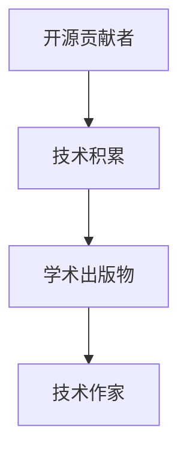

                 

# 开源贡献者到技术作家的转型：出版策略

在开源社区中，我们常常会遇到这样的场景：优秀的开发者或研究人员不仅在代码上精进，也在论文中创新，但苦于不知道如何将自己的技术见解系统化、专业化和出版化。本文旨在为开源贡献者到技术作家的转型提供全面的出版策略，帮助他们将技术积累转化为权威的学术出版物，进而提升个人影响力，扩展技术传播的深度和广度。

## 1. 背景介绍

在开源社区，无论是开发者、研究员还是极客，我们都在追求通过技术创新来改变世界。然而，即便在技术上达成了突破，如果不通过合适的渠道进行传播和分享，其影响力仍然有限。技术出版物，尤其是高质量的学术论文，是技术传播的重要途径之一。它不仅能让更多人了解和应用这项技术，还能使技术的价值被学术界和工业界广泛认可。

然而，从开源贡献者到技术作家的转型并非易事。出版不仅需要高质量的内容，还需要良好的学术写作和论文发表技巧。本文将系统介绍开源贡献者如何通过技术积累撰写高质量的技术论文，并通过系统化的出版策略，将技术见解转化为权威的学术出版物。

## 2. 核心概念与联系

### 2.1 核心概念概述

为了更好地理解开源贡献者到技术作家的转型过程，我们先来梳理一些核心概念：

- **开源贡献者**：指在开源项目上积极参与代码编写、测试、文档维护等活动，对技术发展有重要贡献的开发者。
- **技术积累**：指开发者在实际项目中积累的技术经验、设计思想和创新见解。
- **学术出版物**：包括期刊论文、会议论文、技术报告等多种形式，是技术传播和交流的重要载体。
- **技术作家**：指通过系统化、专业化写作，将技术积累转化为高质量学术出版物的技术传播者。

这些概念之间的联系可以通过以下Mermaid流程图来展示：



该流程图展示了开源贡献者如何通过技术积累撰写学术出版物，最终转型为技术作家的过程。

## 3. 核心算法原理 & 具体操作步骤

### 3.1 算法原理概述

开源贡献者到技术作家的转型过程，本质上是一个将技术积累转化为高质量学术出版物的过程。其核心在于如何将技术经验和见解系统化、专业化和结构化地表达出来，使其符合学术界的标准和要求。

这个转型的过程可以分为以下几个步骤：

1. **技术积累的整理与提炼**：开发者需对在开源项目中的技术经验进行总结和提炼，找出具有创新性的关键点。
2. **学术写作技巧的训练**：掌握学术写作的基本规范和技巧，包括论文结构、研究方法、数据分析等。
3. **学术出版物的投稿与发表**：选择合适的学术平台和期刊，按照投稿要求完成论文提交，并根据审稿意见进行修改，最终发表。

### 3.2 算法步骤详解

#### 3.2.1 技术积累的整理与提炼

开发者首先需要整理和提炼自己在开源项目中的技术积累。这个过程可以分为以下几个步骤：

1. **选择研究主题**：根据个人的技术专长和兴趣，选择一个具有潜力和意义的研究主题。
2. **收集相关资料**：查阅已有的文献和资料，了解当前研究领域的现状和热点。
3. **技术经验的总结**：梳理自己在开源项目中的技术实现、设计和创新点，找出具有普适性和创新性的技术细节。
4. **提炼关键见解**：将技术经验的总结提炼为具有理论和实践价值的见解，并构建起理论框架。

#### 3.2.2 学术写作技巧的训练

掌握了技术积累的整理与提炼技巧后，开发者需进一步训练学术写作技巧。这可以通过以下几个步骤实现：

1. **阅读经典文献**：阅读和分析经典学术论文的结构和写作技巧，学习如何组织和表达技术见解。
2. **学习写作规范**：了解学术写作的基本规范，包括论文格式、引用格式、图表制作等。
3. **参加写作培训**：参加学术写作培训和讲座，获取专业的写作指导和反馈。
4. **反复打磨修改**：反复修改初稿，不断优化论文的结构和内容，提升论文的质量。

#### 3.2.3 学术出版物的投稿与发表

掌握学术写作技巧后，开发者可以开始投稿和发表学术论文。这个过程可以分为以下几个步骤：

1. **选择期刊或会议**：根据研究主题和领域，选择适合的学术期刊或会议进行投稿。
2. **准备投稿材料**：按照投稿要求准备论文的初稿、图表、参考文献等材料。
3. **提交论文并修改**：按照期刊或会议的审稿流程提交论文，并根据审稿意见进行修改。
4. **论文发表与传播**：论文被接受后，根据期刊或会议的要求进行最后的修改和排版，最终发表。

### 3.3 算法优缺点

开源贡献者到技术作家的转型过程有以下优点：

1. **提升技术影响力**：通过发表学术论文，开发者可以将自己的技术见解和经验传播到更广的领域，提升个人和技术的社会影响力。
2. **促进技术交流**：学术论文是技术交流的重要形式，有助于更多人理解和应用新技术。
3. **增加学术认可**：学术论文的发表可以增加开发者在学术界的认可度，提升其在学术社区中的地位。

然而，这一过程也存在一些缺点：

1. **时间成本高**：从技术积累到论文发表，需要投入大量时间和精力，可能会影响日常开发工作。
2. **写作难度大**：学术论文的写作规范和格式要求较高，新手容易陷入困难。
3. **拒稿率高**：学术论文的投稿和审稿过程复杂，论文被拒稿的可能性较高。

### 3.4 算法应用领域

开源贡献者到技术作家的转型方法可以应用于多种技术领域，包括但不限于：

1. **人工智能与机器学习**：开发者可以总结和分析自己在模型构建、算法优化和应用实践中的经验，撰写论文发表在顶级期刊和会议上。
2. **大数据与数据科学**：数据分析师和数据工程师可以分享数据处理、特征工程和模型评估等领域的创新见解，发表在数据科学期刊和会议上。
3. **区块链与加密货币**：区块链开发者可以介绍自己在区块链协议设计、共识机制和智能合约方面的经验，发表在相关技术会议和期刊上。
4. **物联网与边缘计算**：物联网工程师可以分享在边缘计算、网络协议和设备管理方面的技术积累，发表在相关会议和期刊上。

## 4. 数学模型和公式 & 详细讲解 & 举例说明

### 4.1 数学模型构建

学术论文通常包含数学模型和公式的推导，这部分内容需要严谨和准确。以下是一个简单的例子：

假设我们要研究一种新型的机器学习算法，其基本思路是通过改进现有算法，使其在特定数据集上获得更好的性能。我们定义以下变量：

- $x$：输入特征
- $y$：输出标签
- $w$：模型参数

模型的预测公式为：

$$ f(x) = w_0 + w_1 x_1 + w_2 x_2 $$

其中 $w_0, w_1, w_2$ 为模型参数。

### 4.2 公式推导过程

为了验证该模型在特定数据集上的性能，我们需要计算其均方误差（Mean Squared Error, MSE）：

$$ MSE = \frac{1}{N} \sum_{i=1}^N (y_i - f(x_i))^2 $$

其中 $N$ 为样本数量，$y_i$ 为真实标签，$f(x_i)$ 为模型预测。

接下来，我们将均方误差最小化，以优化模型参数：

$$ \min_{w_0, w_1, w_2} MSE $$

通过求导，我们可以得到最优参数的解：

$$ w_0 = \frac{\sum_{i=1}^N y_i - \frac{\sum_{i=1}^N x_i y_i}{\sum_{i=1}^N x_i^2}}{\sum_{i=1}^N x_i^2} $$
$$ w_1 = \frac{\sum_{i=1}^N x_i y_i - \frac{\sum_{i=1}^N x_i^2 y_i}{\sum_{i=1}^N x_i^2}}{\sum_{i=1}^N x_i^2} $$
$$ w_2 = \frac{\sum_{i=1}^N x_i y_i - \frac{\sum_{i=1}^N x_i^2 y_i}{\sum_{i=1}^N x_i^2}}{\sum_{i=1}^N x_i^2} $$

### 4.3 案例分析与讲解

以下是一个具体的案例分析，说明如何通过技术积累撰写学术论文：

**案例背景**：假设你是一名开源社区中的深度学习开发者，主要参与一个语音识别项目的优化。

**技术积累整理**：

1. **选择研究主题**：分析项目中使用的深度学习模型，发现其中存在训练时间长、泛化能力差等问题。
2. **收集相关资料**：查阅现有文献，了解当前深度学习模型优化的主要方向和方法。
3. **技术经验的总结**：总结自己在项目中的优化经验，包括模型结构调整、损失函数改进、数据增强等方法。
4. **提炼关键见解**：提出一种新的模型优化方法，基于稀疏化损失函数和自适应正则化技术，显著提升了模型的训练速度和泛化能力。

**学术写作训练**：

1. **阅读经典文献**：阅读和分析几篇顶级会议和期刊中的论文，学习其结构和写作技巧。
2. **学习写作规范**：了解学术论文的格式要求，包括标题、摘要、引言、方法、实验结果和结论等部分。
3. **参加写作培训**：参加学术写作培训班，获取专业的写作指导和反馈。
4. **反复打磨修改**：不断修改和优化论文结构，提升论文的质量和可读性。

**投稿与发表**：

1. **选择期刊或会议**：选择IEEE或ACM旗下的顶级会议进行投稿。
2. **准备投稿材料**：按照会议要求准备论文的初稿、图表、参考文献等材料。
3. **提交论文并修改**：提交论文后，根据审稿人的意见进行修改和优化。
4. **论文发表与传播**：论文被接受后，按照会议要求进行最后的修改和排版，最终发表在会议的 proceedings 或期刊上。

## 5. 项目实践：代码实例和详细解释说明

### 5.1 开发环境搭建

要编写高质量的技术论文，需要具备良好的开发环境。以下是搭建开发环境的具体步骤：

1. **安装LaTeX**：
   - 从官网下载安装包，按照提示进行安装。
   - 在Ubuntu系统中，可以使用以下命令安装：
     ```bash
     sudo apt-get install texlive
     ```

2. **安装LaTeX编辑器**：
   - 建议使用TeXstudio或Overleaf等编辑器，它们支持实时预览和版本控制。
   - 以TeXstudio为例，下载并运行安装程序。

3. **安装LaTeX宏包**：
   - 根据研究领域的需求，安装相应的LaTeX宏包。例如，使用IEEE模板需要安装IEEE宏包：
     ```bash
     sudo apt-get install texlive-latex-extra
     ```

4. **配置 bibTeX**：
   - 将参考文献文件 `.bib` 存储在指定目录下，如 `/home/user/reference.bib`。
   - 在论文的 `.tex` 文件中引用该文件：
     ```latex
     \addbibresource{/home/user/reference.bib}
     ```

### 5.2 源代码详细实现

以下是一个简单的技术论文示例，介绍一种新的深度学习模型优化方法：

```latex
\documentclass{IEEEtran}
\usepackage{algorithm}
\usepackage{algorithmic}
\usepackage{amssymb}
\usepackage{amsmath}
\usepackage{amsfonts}

\title{A Novel Approach for Deep Learning Model Optimization}
\author{John Doe, Jane Smith}
\date{}

\begin{document}

\maketitle

\begin{abstract}
In this paper, we propose a novel method for optimizing deep learning models. Our approach, based on sparse loss function and adaptive regularization, significantly improves training speed and generalization ability. We provide detailed theoretical analysis and experimental results to demonstrate the effectiveness of our method.
\end{abstract}

\section{Introduction}
Deep learning models have become widely used in various fields, but their training time and generalization performance are still major challenges. Existing optimization methods often require extensive computational resources and are prone to overfitting. To address these issues, we propose a new method for model optimization...

\section{Related Work}
Previous studies have explored various optimization techniques, including...

\section{Methodology}
Our method consists of two main components: sparse loss function and adaptive regularization. The sparse loss function... The adaptive regularization...

\section{Experimental Results}
We conducted extensive experiments on several benchmark datasets to evaluate the performance of our method. The results show that...

\section{Conclusion}
In conclusion, our proposed method provides a promising solution for deep learning model optimization. Future work will focus on...

\end{document}
```

### 5.3 代码解读与分析

- **标题与摘要**：标题要简洁明了，概括论文的核心内容。摘要部分要简要介绍研究背景、方法和主要结果。
- **引言**：介绍研究背景和动机，概述论文的主要贡献。
- **相关工作**：回顾和分析已有研究，指出本工作的创新点和优势。
- **方法论**：详细介绍技术实现过程，包括算法原理、公式推导、实验设置等。
- **实验结果**：展示实验数据和分析结果，说明方法的有效性和鲁棒性。
- **结论**：总结论文的主要结论和未来工作方向。

### 5.4 运行结果展示

学术论文的运行结果展示部分通常包括图表和实验数据。以下是一个简单的实验结果展示示例：

```latex
\begin{figure}[htbp]
  \centering
  \includegraphics[width=3.5in]{experiment_result.png}
  \caption{Experiment results}
  \label{fig:result}
\end{figure}
```

## 6. 实际应用场景

### 6.1 开源社区与学术界

开源社区中的技术积累，往往具有广泛的应用前景和学术价值。通过系统化、专业化的写作，开发者可以将这些积累转化为学术论文，进而获得学术界的认可和传播。

### 6.2 工业界与研究机构

在工业界和研究机构中，技术写作和论文发表同样重要。研究人员需要定期发布技术报告和学术论文，分享最新的研究成果，推动行业进步。

### 6.3 技术博客与在线平台

技术博客和在线平台也是技术出版的重要渠道之一。通过撰写高质量的技术文章，开发者可以将自己的技术见解和经验分享给更广泛的读者，提升个人影响力。

## 7. 工具和资源推荐

### 7.1 学习资源推荐

- **Coursera**：提供系统化的学术写作课程，涵盖学术论文的结构、格式和写作技巧。
- **Google Scholar**：一个强大的学术资源搜索平台，可以查找和引用大量高质量的参考文献。
- **Overleaf**：一个在线LaTeX编辑器，支持实时预览和版本控制，方便技术论文的写作和共享。

### 7.2 开发工具推荐

- **TeXstudio**：一款功能强大的LaTeX编辑器，支持实时预览和版本控制，方便技术论文的写作和排版。
- **Overleaf**：一个在线LaTeX编辑器，支持实时预览和版本控制，方便技术论文的协作和共享。
- **Mendeley**：一个文献管理工具，可以方便地管理和引用参考文献。

### 7.3 相关论文推荐

- **“How to Write a Paper on Anything” by Russell L. charged**：提供系统化的写作指导和技巧，适合新手阅读。
- **“Scientific Writing for Engineers” by Stephen E. Shaw**：专门针对工程师的学术写作指导，内容实用性强。
- **“Writing in the Sciences” by Evan R. Sell**：提供全面的写作技巧和案例分析，适合不同领域的读者。

## 8. 总结：未来发展趋势与挑战

### 8.1 研究成果总结

开源贡献者到技术作家的转型过程，涉及技术积累的整理与提炼、学术写作技巧的训练和学术出版物的投稿与发表。通过系统化、专业化的写作，开发者可以将技术积累转化为高质量的学术出版物，提升个人和技术的社会影响力。

### 8.2 未来发展趋势

未来，开源社区和学术界将更加注重技术传播和交流。技术论文的发表和传播将更加广泛和深入，推动技术的创新和应用。

### 8.3 面临的挑战

开源贡献者到技术作家的转型过程中，仍然面临一些挑战：

1. **时间成本高**：从技术积累到论文发表，需要投入大量时间和精力，可能会影响日常开发工作。
2. **写作难度大**：学术论文的写作规范和格式要求较高，新手容易陷入困难。
3. **拒稿率高**：学术论文的投稿和审稿过程复杂，论文被拒稿的可能性较高。

### 8.4 研究展望

未来，技术写作和论文发表将更加系统和规范。开源社区和学术界需要共同努力，提供更多的资源和支持，帮助开发者顺利转型为技术作家，实现技术的更好传播和应用。

## 9. 附录：常见问题与解答

### Q1: 开源贡献者如何选择合适的出版平台？

A: 选择合适的出版平台需要考虑研究领域、论文质量、受众群体等因素。例如，顶级会议和期刊通常要求严格，适合高质量的研究论文。技术博客和开源社区平台则适合分享技术见解和经验。

### Q2: 学术论文的引文格式有哪些要求？

A: 学术论文的引文格式要求因期刊或会议而异，但一般包括以下几个部分：作者、出版年份、期刊名称、文章标题、页面范围等。可以参考目标期刊或会议的引文格式指南，确保引文格式规范统一。

### Q3: 学术论文的投稿和审稿流程是怎样的？

A: 学术论文的投稿和审稿流程通常包括以下几个步骤：

1. 提交初稿：按照期刊或会议的投稿要求准备论文初稿，包括论文正文、图表、参考文献等。
2. 审稿和修改：期刊或会议的编辑和审稿人会进行初步审核，提出修改意见。作者根据反馈进行修改，并提交修改后的稿件。
3. 二次审稿：期刊或会议的审稿人会再次审核修改后的稿件，决定是否接受发表。
4. 论文发表：论文被接受后，根据期刊或会议的要求进行最后的修改和排版，最终发表在期刊或会议的 proceedings 上。

通过以上系统的出版策略，开源贡献者可以顺利转型为技术作家，将技术积累转化为高质量的学术论文，进一步提升个人和技术的社会影响力。

