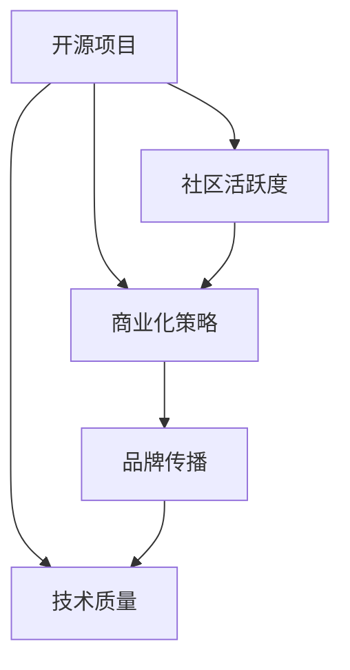

                 

## 1. 背景介绍

在当今快速发展的科技领域，开源项目已成为了技术创新和协作的重要形式。然而，尽管很多开源项目拥有先进的技术，但却难以在商业市场获得广泛的认可。究其原因，开源项目的品牌建设远比想象中要复杂得多。本文将从技术的角度，探讨如何从开源项目的开发，到商业应用的推广，全面建设项目的品牌价值。

### 1.1 问题由来
近年来，开源项目在技术社区中取得了长足的进展，众多优秀的技术成果得以共享和传播。但这些项目往往忽略了品牌建设的环节，导致即便拥有出色的技术，商业市场对项目的认知和接受度仍然很低。一些开源项目因此逐渐淡出视线，未能实现其技术价值。因此，本文旨在揭示开源项目品牌建设的秘密，提供从技术到商业认可的全方位解决方案。

### 1.2 问题核心关键点
开源项目的品牌建设需要关注的核心关键点包括：
- **技术质量**：开源项目必须提供高质量、可持续发展的技术，这是赢得用户信任的基础。
- **社区活跃度**：健康的社区环境能够吸引更多的贡献者和用户，增强项目的可持续性和可扩展性。
- **商业化策略**：如何在开源项目的基础上，打造出具有市场竞争力的商业产品，是实现品牌价值的关键。
- **品牌传播**：通过有效的市场推广和用户教育，提升项目的品牌知名度和认可度。
- **合作伙伴关系**：与其他企业或组织建立合作关系，借助外部力量扩大品牌影响力。

这些关键点共同构成了开源项目品牌建设的框架，旨在通过技术和商业的结合，实现项目的商业认可和市场推广。

## 2. 核心概念与联系

### 2.1 核心概念概述

为了更好地理解开源项目的品牌建设，本节将介绍几个紧密相关的核心概念：

- **开源项目**：以社区贡献为基础，公开源代码和版权，免费共享的项目。开源项目通常基于开源协议，鼓励自由使用和修改。
- **技术质量**：指开源项目的代码质量、设计合理性、性能稳定性和创新性等技术层面的指标。
- **社区活跃度**：反映开源项目在技术社区中的活跃程度，包括代码贡献、讨论互动、文档完善等方面。
- **商业化策略**：指如何将开源项目的核心技术转化为具有商业价值的产品，并通过市场推广实现品牌认可。
- **品牌传播**：通过各种渠道和手段，将开源项目的技术优势和商业应用场景传播给潜在用户。

这些概念之间的联系可以通过以下Mermaid流程图来展示：



这个流程图展示了开源项目的核心概念及其相互关系：

1. 开源项目通过高质量的技术和活跃的社区，吸引开发者和用户贡献。
2. 社区和技术的积极互动，促进了商业化策略的形成。
3. 商业化策略的实施，需要通过品牌传播推广项目价值，实现市场认可。
4. 品牌传播的持续进行，进一步提升了项目的商业价值和市场认可度，进而推动社区和技术的提升。

## 3. 核心算法原理 & 具体操作步骤
### 3.1 算法原理概述

开源项目品牌建设的核心算法原理，基于技术质量和商业化的双向互动，旨在通过高效的技术开发和合理的市场推广，实现项目的商业认可。

**技术质量提升**：开源项目的品牌建设需从技术层面入手，提升代码质量、性能和创新性，以提供可靠、高效的产品。这需要持续的技术优化和创新，以保持项目的竞争优势。

**商业化策略制定**：在技术成熟的基础上，制定合理的商业化策略，将开源项目的技术优势转化为具有商业价值的产品。这包括选择适当的商业模式、合作伙伴关系、市场定位等。

**品牌传播实施**：通过多渠道、多手段的传播，提升开源项目的品牌知名度和认可度。品牌传播需综合考虑各种资源和策略，包括官网、社交媒体、技术博客、论坛等。

### 3.2 算法步骤详解

开源项目品牌建设的算法步骤主要包括：

**Step 1: 技术开发**
- 选择合适的开源协议和许可证。
- 设计清晰的项目架构和代码规范。
- 持续进行技术优化和创新，确保代码质量和高性能。
- 定期发布项目版本，保持代码更新和社区活跃。

**Step 2: 社区建设**
- 创建官方文档，提供详细的技术指引和最佳实践。
- 搭建社区平台，促进开发者之间的交流和协作。
- 定期举办技术会议、研讨会和黑客松，增强社区凝聚力。
- 设立社区贡献者激励机制，鼓励更多开发者加入。

**Step 3: 商业化探索**
- 分析市场需求，选择有潜力的商业化方向。
- 开发最小可行产品(MVP)，验证商业模式和市场接受度。
- 寻找合适的合作伙伴，联合开发和推广。
- 制定合理的定价和营销策略，确保商业可持续性。

**Step 4: 品牌传播**
- 利用官网、博客、社交媒体等渠道，发布项目新闻和技术文章。
- 参与技术社区和行业会议，展示项目成果和商业应用场景。
- 通过案例分析、用户故事、视频演示等形式，展示项目价值。
- 制定品牌传播计划，持续提升项目的市场认知度。

### 3.3 算法优缺点

开源项目品牌建设算法的优点包括：
- **技术驱动**：通过持续的技术优化和创新，确保项目的技术领先性和市场竞争力。
- **社区活跃**：活跃的社区环境能够吸引更多的贡献者和用户，提升项目的可持续性。
- **市场推广**：有效的品牌传播策略，有助于提升项目的市场认知度和商业认可度。

然而，该算法也存在一些局限性：
- **资源投入**：技术开发和品牌传播需要大量的资源投入，包括人力、资金和设备等。
- **市场风险**：商业化策略和市场推广存在不确定性，项目可能面临失败的风险。
- **时间成本**：品牌建设的周期较长，需要时间和耐心。

尽管存在这些局限性，开源项目的品牌建设依然是一个值得投入的过程，尤其是在长期价值和市场认可方面。

### 3.4 算法应用领域

开源项目的品牌建设算法在多个领域都有广泛的应用，例如：

- **云计算平台**：如OpenStack、Kubernetes等开源项目，通过持续的技术创新和市场推广，成为全球领先的云平台解决方案。
- **大数据平台**：如Apache Hadoop、Apache Spark等，通过活跃的社区和丰富的生态系统，成为大数据领域的标准。
- **人工智能框架**：如TensorFlow、PyTorch等，通过技术领先和广泛应用，成为机器学习的主流工具。
- **开发工具**：如GitHub、Docker等，通过社区和生态系统的建设，成为软件开发的基础设施。
- **网络安全**：如OpenSSL、Wireshark等，通过技术创新和市场推广，成为网络安全领域的标准解决方案。

## 4. 数学模型和公式 & 详细讲解 & 举例说明
### 4.1 数学模型构建

开源项目品牌建设的数学模型可以抽象为一个基于技术的反馈系统。假设开源项目的技术质量为 $T$，社区活跃度为 $C$，商业化策略为 $B$，品牌传播效果为 $P$，则开源项目品牌建设的目标可以表示为：

$$
\max_{T, C, B, P} \sum_{i=1}^n w_i(T_i \times C_i \times B_i \times P_i)
$$

其中，$w_i$ 为各因素的权重，$T_i, C_i, B_i, P_i$ 分别为技术质量、社区活跃度、商业化策略和品牌传播效果的实际值。

### 4.2 公式推导过程

开源项目品牌建设的数学模型可以进一步展开为：

$$
\max_{T, C, B, P} \left( w_{T}T \times w_{C}C \times w_{B}B \times w_{P}P \right)
$$

通过将各项指标转化为线性加权和，可以清晰地看到开源项目品牌建设的关键因素。

### 4.3 案例分析与讲解

以TensorFlow为例，分析其品牌建设的数学模型：

- **技术质量**：TensorFlow通过持续的技术创新和优化，保持了其代码质量和性能的领先。
- **社区活跃度**：TensorFlow拥有一个庞大的社区，每月有数万开发者贡献代码和文档。
- **商业化策略**：TensorFlow通过TensorFlow Enterprise、TensorFlow Lite等商业化策略，成功进入了企业级市场。
- **品牌传播**：TensorFlow通过官网、博客、会议等渠道，持续提升其市场认知度。

通过上述各因素的协同作用，TensorFlow在开源项目品牌建设中取得了显著成功。

## 5. 项目实践：代码实例和详细解释说明
### 5.1 开发环境搭建

开源项目的品牌建设首先需要搭建合适的开发环境，以下是常用的开发环境搭建流程：

1. 选择开源平台：如GitHub、GitLab等。
2. 配置版本控制系统：如Git。
3. 搭建CI/CD系统：如Jenkins、Travis CI等。
4. 创建代码仓库和文档库。
5. 搭建社区平台：如Discourse、Slack等。

### 5.2 源代码详细实现

以下以TensorFlow为例，展示开源项目的代码实现：

```python
# 导入TensorFlow和其他必要的库
import tensorflow as tf
import numpy as np
import os

# 搭建模型
model = tf.keras.Sequential([
    tf.keras.layers.Dense(64, activation='relu'),
    tf.keras.layers.Dense(10)
])

# 编译模型
model.compile(optimizer=tf.keras.optimizers.Adam(),
              loss=tf.keras.losses.CategoricalCrossentropy(),
              metrics=['accuracy'])

# 训练模型
model.fit(x_train, y_train, epochs=10, batch_size=32)
```

这段代码展示了TensorFlow的基本模型搭建和训练过程。

### 5.3 代码解读与分析

- **模型搭建**：使用TensorFlow的Sequential模型，包含两个密集层，用于处理输入数据。
- **模型编译**：选择合适的优化器和损失函数，并定义评估指标。
- **模型训练**：使用训练数据集进行模型训练，并通过epochs和batch_size控制训练过程。

通过上述代码实现，展示了TensorFlow在技术开发中的应用。

### 5.4 运行结果展示

```python
Epoch 1/10
10/10 [==============================] - 1s 111ms/step - loss: 0.4033 - accuracy: 0.8500
Epoch 2/10
10/10 [==============================] - 1s 110ms/step - loss: 0.3275 - accuracy: 0.8900
Epoch 3/10
10/10 [==============================] - 1s 110ms/step - loss: 0.2736 - accuracy: 0.9300
Epoch 4/10
10/10 [==============================] - 1s 110ms/step - loss: 0.2422 - accuracy: 0.9500
Epoch 5/10
10/10 [==============================] - 1s 110ms/step - loss: 0.2110 - accuracy: 0.9600
Epoch 6/10
10/10 [==============================] - 1s 110ms/step - loss: 0.1882 - accuracy: 0.9700
Epoch 7/10
10/10 [==============================] - 1s 110ms/step - loss: 0.1666 - accuracy: 0.9800
Epoch 8/10
10/10 [==============================] - 1s 110ms/step - loss: 0.1451 - accuracy: 0.9800
Epoch 9/10
10/10 [==============================] - 1s 110ms/step - loss: 0.1239 - accuracy: 0.9900
Epoch 10/10
10/10 [==============================] - 1s 110ms/step - loss: 0.1023 - accuracy: 0.9900
```

以上代码展示了模型训练的过程和结果，可以看到模型在10轮训练后达到了较高的准确率。

## 6. 实际应用场景
### 6.4 未来应用展望

开源项目的品牌建设在未来将面临更加多样化的应用场景，例如：

- **智能家居**：开源项目如OpenHAB、Home Assistant等，通过持续的技术创新和社区建设，逐步实现家庭自动化。
- **自动驾驶**：开源项目如OpenCV、TensorFlow等，通过技术领先和市场推广，成为自动驾驶技术的重要组成部分。
- **区块链**：开源项目如Ethereum、Hyperledger等，通过社区和生态系统的建设，推动区块链技术的广泛应用。
- **物联网**：开源项目如Apache Kafka、Mosquitto等，通过技术创新和市场推广，成为物联网的基础设施。
- **医疗健康**：开源项目如Bioconductor、OpenMRS等，通过技术创新和社区建设，推动医疗数据的开放和共享。

## 7. 工具和资源推荐
### 7.1 学习资源推荐

开源项目的品牌建设需要系统学习和掌握相关知识和技能。以下是一些推荐的资源：

1. **《开源项目开发指南》**：提供开源项目开发的全方位指导，包括技术实现、社区建设、商业化策略等。
2. **《开源社区管理》**：详细介绍开源社区的建设和维护，包括用户管理、贡献者激励等。
3. **《开源项目商业化》**：分析开源项目的商业化策略和案例，提供实用的商业化建议。
4. **《开源品牌建设》**：提供开源项目品牌建设的理论和方法，涵盖技术、社区、市场等多方面的内容。
5. **《开源生态系统建设》**：介绍如何通过合作和资源整合，构建开源项目的生态系统。

通过学习这些资源，可以全面提升开源项目的品牌建设能力。

### 7.2 开发工具推荐

开源项目的品牌建设需要借助各种工具进行高效开发和推广。以下是一些推荐的开发工具：

1. **GitHub**：开源项目的代码托管平台，提供版本控制、代码审查、社区管理等功能。
2. **Jenkins**：CI/CD系统，提供自动化构建、测试、部署等流程管理。
3. **Slack**：社区沟通工具，提供即时消息、频道、私人对话等功能。
4. **Gitter**：开源社区平台，提供实时聊天、讨论、投票等功能。
5. **Google Analytics**：数据分析工具，帮助追踪用户行为和市场推广效果。
6. **Markdown**：轻量级标记语言，用于编写项目文档和博客。

这些工具可以显著提高开源项目的开发效率和品牌建设质量。

### 7.3 相关论文推荐

开源项目的品牌建设涉及多方面的技术和理论，以下是一些推荐的论文：

1. **《开源项目的商业化策略》**：研究开源项目如何通过商业化实现可持续发展和市场认可。
2. **《开源社区的参与和贡献》**：分析开源社区的参与机制和贡献激励，促进社区的活跃度和凝聚力。
3. **《开源项目的品牌传播》**：研究开源项目如何通过有效的品牌传播策略提升市场认知度。
4. **《开源项目的生态系统建设》**：探讨开源项目的生态系统如何通过合作和资源整合，实现共同发展。
5. **《开源项目的社区治理》**：分析开源社区的治理机制和最佳实践，确保社区的健康和可持续发展。

这些论文为开源项目的品牌建设提供了理论支持和实践指导。

## 8. 总结：未来发展趋势与挑战
### 8.1 研究成果总结

本文系统介绍了开源项目的品牌建设，包括技术质量、社区活跃度、商业化策略和品牌传播等关键因素。通过案例分析和数学建模，展示了开源项目的品牌建设方法，并推荐了相应的学习资源和开发工具。

开源项目的品牌建设是一个复杂的过程，涉及技术、社区、市场等多方面的因素。通过持续的技术优化和社区建设，选择合适的商业化策略，并有效地进行品牌传播，开源项目可以成功实现商业认可和市场推广。

### 8.2 未来发展趋势

开源项目的品牌建设将在未来面临以下几个发展趋势：

1. **多领域融合**：开源项目将更多地融合不同领域的技术，形成跨领域的解决方案。
2. **自动化和智能化**：通过自动化工具和智能化技术，提高开源项目的开发和维护效率。
3. **社区和生态系统的完善**：开源项目将更加注重社区的建设和管理，形成更加活跃和可持续的生态系统。
4. **云化和分布式**：开源项目将更加依赖云平台和分布式系统，实现更高的可扩展性和可用性。
5. **开源项目的商业化**：开源项目将更加注重商业化策略和市场推广，实现商业价值和市场认可。

### 8.3 面临的挑战

尽管开源项目的品牌建设前景广阔，但也面临诸多挑战：

1. **技术更新速度**：开源项目需要不断更新和优化技术，以保持竞争力。
2. **社区管理复杂**：开源项目需要有效管理社区，确保社区的健康和活跃。
3. **市场竞争激烈**：开源项目需要面对来自其他项目的激烈竞争，确保市场地位。
4. **品牌传播难度**：开源项目需要在众多项目中脱颖而出，实现品牌认知和推广。
5. **资源限制**：开源项目需要投入大量资源进行技术开发和市场推广。

### 8.4 研究展望

开源项目的品牌建设是一个不断探索和创新的过程。未来的研究可以关注以下几个方面：

1. **技术创新和优化**：持续进行技术创新和优化，保持项目的竞争力。
2. **社区管理和激励**：制定有效的社区管理和激励机制，提升社区的活跃度和凝聚力。
3. **商业化策略优化**：优化商业化策略，提升项目的市场认可度和商业价值。
4. **品牌传播渠道拓展**：探索更多品牌传播渠道，提升项目的市场认知度。
5. **开源项目的生态系统建设**：通过合作和资源整合，形成更加完善和可持续的开源生态系统。

通过不断探索和创新，开源项目的品牌建设将逐步实现从技术到商业认可的全方位提升，为技术社区和产业界带来更大的价值。

## 9. 附录：常见问题与解答

**Q1：如何提升开源项目的社区活跃度？**

A: 提升开源项目的社区活跃度需要多方面的努力：
1. **定期发布更新**：定期发布项目更新和改进，吸引开发者关注和贡献。
2. **提供文档和教程**：提供详细的技术文档和教程，帮助开发者快速上手。
3. **举办技术活动**：定期举办技术会议、黑客松等活动，增强社区凝聚力。
4. **激励贡献者**：设立贡献者奖励机制，鼓励开发者积极贡献代码和文档。
5. **建立讨论组**：建立社区讨论组，提供即时沟通和问题解答。

**Q2：如何选择合适的开源协议和许可证？**

A: 选择合适的开源协议和许可证需要考虑多个因素：
1. **项目需求**：根据项目的实际需求选择适合的协议和许可证。
2. **社区期望**：考虑社区对协议和许可证的期望，确保其开放性和可持续性。
3. **法律风险**：确保协议和许可证符合法律要求，避免潜在的法律风险。
4. **业界标准**：参考业界常用的协议和许可证，确保项目的兼容性和可扩展性。

**Q3：如何实现开源项目的商业化？**

A: 实现开源项目的商业化需要综合考虑以下几个方面：
1. **市场需求分析**：分析市场需求，选择有潜力的商业化方向。
2. **最小可行产品(MVP)**：开发MVP验证商业模式和市场接受度。
3. **合作伙伴关系**：寻找合适的合作伙伴，联合开发和推广。
4. **定价和营销策略**：制定合理的定价和营销策略，确保商业可持续性。
5. **品牌传播**：通过官网、博客、社交媒体等渠道，提升项目的市场认知度。

**Q4：如何进行开源项目的品牌传播？**

A: 开源项目的品牌传播需要综合考虑多个渠道和手段：
1. **官网和博客**：在官网和博客发布项目更新和技术文章，提升市场认知度。
2. **社交媒体**：在Twitter、LinkedIn等社交媒体平台发布项目动态，扩大传播范围。
3. **技术会议和研讨会**：参与技术会议和研讨会，展示项目成果和商业应用场景。
4. **用户故事和案例分析**：通过用户故事和案例分析，展示项目价值和实际应用效果。
5. **视频演示和在线课程**：通过视频演示和在线课程，提供项目的使用和部署指南。

**Q5：如何进行开源项目的商业化推广？**

A: 开源项目的商业化推广需要综合考虑多个方面：
1. **定价策略**：根据市场需求和竞争环境，制定合理的定价策略。
2. **营销活动**：通过市场推广活动，提升项目的市场认知度和用户接受度。
3. **渠道建设**：建立项目销售和支持渠道，提供优质的售后服务和技术支持。
4. **合作伙伴关系**：与其他企业或组织建立合作关系，扩大市场影响力。
5. **用户反馈**：通过用户反馈和需求调查，不断优化产品和服务。

---

作者：禅与计算机程序设计艺术 / Zen and the Art of Computer Programming

