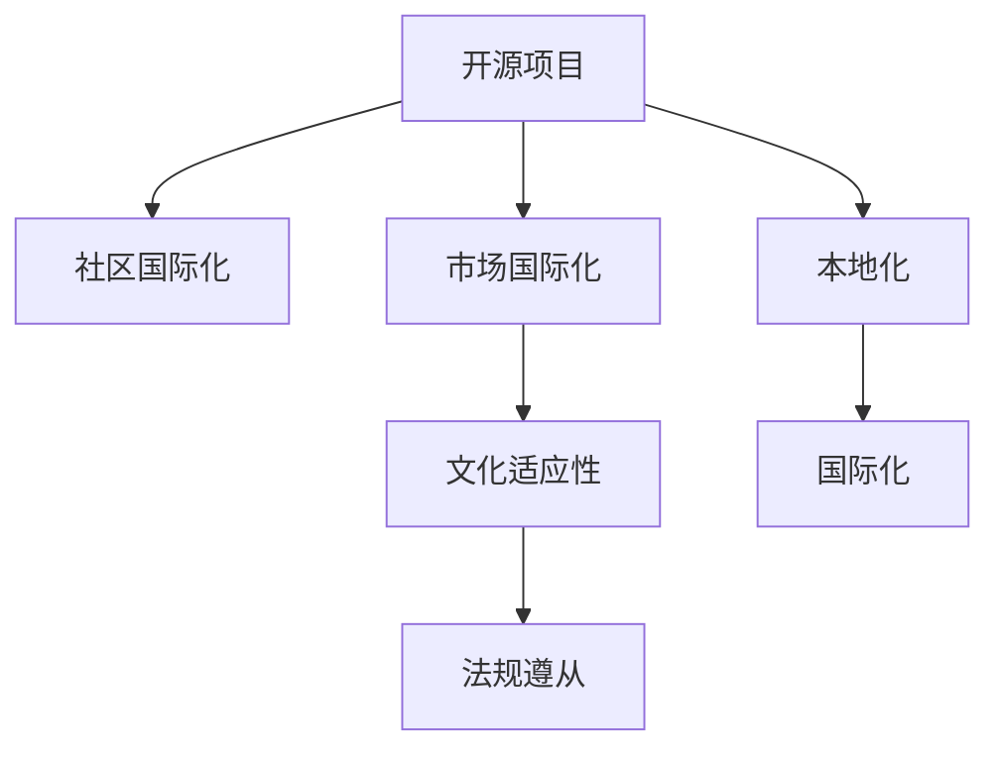

                 

# 开源项目的国际化咨询：跨文化商业机会

## 1. 背景介绍

### 1.1 问题由来

在全球化的今天，企业面临着跨越文化、语言和地域的挑战。如何将产品和服务推向全球市场，构建跨文化商业机会，是每个企业亟需解决的问题。开源项目作为全球协作的产物，其成功离不开国际化策略的引导。本文聚焦于开源项目的国际化，旨在探索跨文化商业机会的实现途径。

### 1.2 问题核心关键点

开源项目的国际化核心在于如何跨越语言和文化的障碍，建立全球性的社区和市场。具体来说，以下几个关键点构成了国际化成功的基石：

- **社区国际化**：吸引和保持来自不同国家和地区的贡献者和用户。
- **市场国际化**：开拓和维护国际市场，提供本地化的产品和服务。
- **文化适应性**：理解和尊重各国的文化差异，设计符合本地用户习惯的产品。
- **法规遵从**：确保产品和服务符合各国的法律法规。

这些关键点相互关联，共同决定了开源项目的国际化成功与否。

### 1.3 问题研究意义

实现开源项目的国际化，不仅能够拓宽企业的市场和用户基础，还能够提升产品的竞争力和品牌影响力。通过全球化的视角和多元化的资源，企业能够创造出更具创新性和差异化的产品，满足不同市场需求。

此外，国际化还能够推动技术标准化和全球协作，加速技术进步和知识共享。通过不同文化的交流与融合，开源项目能够集思广益，提升整体技术水平，为全球技术生态贡献力量。

## 2. 核心概念与联系

### 2.1 核心概念概述

要深入理解开源项目的国际化，首先需要明确几个核心概念：

- **开源项目**：指以开源软件许可证发布的软件，允许用户自由地使用、修改和分发。
- **国际化**：指开发的软件能够支持多语言和多地区的操作，提供本地化的用户体验。
- **本地化**：指根据不同国家和地区的文化和习惯，对产品和服务进行定制化的调整。
- **跨文化商业机会**：指在全球市场中获得竞争优势，拓展新的商业模式和市场空间。

这些概念通过以下Mermaid流程图展示了它们之间的联系：



### 2.2 核心概念原理和架构

#### 2.2.1 开源项目的核心架构

一个典型的开源项目通常包含以下几个关键组件：

- **代码库**：存储项目的源代码，供全球开发者贡献和维护。
- **文档**：提供项目的使用说明、API文档等，帮助开发者和用户快速上手。
- **社区**：支持开发者之间的交流和协作，建立贡献者和用户的网络。
- **测试环境**：提供测试框架和工具，确保代码质量和稳定性。
- **版本控制**：管理代码变更历史，便于追溯和协作。

#### 2.2.2 国际化的关键组件

- **本地化工具**：如国际化和本地化工具（I18N & L10N），支持多语言切换和字符编码转换。
- **本地化测试**：进行本地化测试，确保产品的语言和区域支持。
- **本地化文档**：提供多语言的文档，帮助用户在不同语言环境下使用产品。
- **本地化界面**：设计本地化的用户界面，符合各地区用户的习惯和偏好。
- **法规遵从**：确保产品符合各国的法律法规，如数据隐私保护、知识产权等。

这些组件通过国际化和本地化的手段，将开源项目推广到全球市场，提供符合本地用户需求的产品。

## 3. 核心算法原理 & 具体操作步骤

### 3.1 算法原理概述

开源项目的国际化算法原理基于以下几个关键步骤：

1. **需求分析**：了解目标市场的用户需求和文化背景。
2. **语言和字符集支持**：实现多语言和多字符集支持，确保代码和文档的国际化。
3. **界面本地化**：设计符合各地区用户习惯的用户界面。
4. **法规遵从**：确保产品符合各国的法律法规。
5. **本地化测试**：测试本地化的代码和文档，确保质量。
6. **持续更新**：根据各地区用户反馈，不断改进产品。

### 3.2 算法步骤详解

#### 3.2.1 需求分析

需求分析是国际化的第一步，需要深入了解目标市场的用户需求和文化背景。这包括：

- **用户研究**：通过问卷调查、用户访谈等方式，收集目标用户群体的需求和偏好。
- **市场调研**：分析目标市场的经济、政治、文化环境，理解其特殊需求。
- **竞争分析**：研究同行业其他国际化和本地化产品的优劣，了解市场现状和潜在机会。

#### 3.2.2 语言和字符集支持

语言和字符集支持是国际化的核心技术。这包括：

- **多语言切换**：实现多语言切换，让用户可以根据需求选择语言。
- **字符集转换**：支持不同的字符集，确保代码和文档在不同语言环境下的兼容性。
- **国际化工具**：使用国际化工具，如Poedit、GetText等，简化国际化和本地化过程。

#### 3.2.3 界面本地化

界面本地化是确保用户体验的关键步骤。这包括：

- **界面设计**：设计符合各地区用户习惯的用户界面，如按钮、菜单等。
- **本地化文档**：提供多语言的文档，帮助用户在不同语言环境下使用产品。
- **本地化测试**：测试本地化的代码和文档，确保质量。

#### 3.2.4 法规遵从

法规遵从是国际化过程中的重要环节。这包括：

- **隐私保护**：确保产品符合各国的数据隐私保护法律法规，如GDPR。
- **知识产权**：尊重各国的知识产权，避免侵犯版权和专利。
- **法律合规**：确保产品符合各国的法律法规，如反垄断法、电子商务法等。

#### 3.2.5 本地化测试

本地化测试是确保产品质量的关键步骤。这包括：

- **测试用例**：设计覆盖各地区用户需求的测试用例。
- **测试环境**：在各地区环境下进行测试，确保产品的语言和区域支持。
- **反馈收集**：收集用户和测试者的反馈，持续改进产品。

#### 3.2.6 持续更新

持续更新是确保产品竞争力的关键步骤。这包括：

- **用户反馈**：收集用户反馈，了解用户需求和问题。
- **版本迭代**：根据用户反馈，不断改进产品，提供更新版本。
- **社区参与**：鼓励全球开发者和用户参与，共同提升产品。

### 3.3 算法优缺点

#### 3.3.1 优点

- **覆盖广泛市场**：通过国际化和本地化，产品可以覆盖全球市场，拓展新用户。
- **提升用户体验**：本地化的产品能够更好地满足不同地区用户的需求，提升用户体验。
- **降低成本**：通过统一的国际化框架和工具，可以减少重复工作和成本。

#### 3.3.2 缺点

- **复杂度增加**：国际化和本地化增加了开发和测试的复杂度，需要更多的时间和资源。
- **文化差异**：不同地区文化差异可能导致产品设计上的冲突，需要更多的时间和资源进行调整。
- **法规风险**：不同国家的法规标准可能不同，增加了产品合规的复杂性。

### 3.4 算法应用领域

开源项目的国际化在以下几个领域有着广泛的应用：

- **软件开发**：提供多语言和多地区的支持，吸引全球开发者和用户。
- **电子商务**：开拓和维护国际市场，提供本地化的购物体验。
- **云服务**：提供多地区的数据中心和网络支持，满足全球用户的需求。
- **内容管理**：提供多语言和多地区的内容管理，提升内容的全球覆盖率。
- **安全系统**：确保产品符合各国的法律法规，保障用户数据的安全。

## 4. 数学模型和公式 & 详细讲解 & 举例说明

### 4.1 数学模型构建

开源项目的国际化涉及多语言和多地区的计算，可以通过以下数学模型进行建模：

设 $L$ 为支持的语言数量，$R$ 为支持的区域数量，$T$ 为产品的功能模块数量。设 $X_{i,j,k}$ 表示产品第 $k$ 个功能模块在语言 $i$ 和地区 $j$ 的支持状态，$X_{i,j,k}=1$ 表示支持，$X_{i,j,k}=0$ 表示不支持。则产品的国际化状态可以表示为：

$$
X = \begin{bmatrix}
X_{1,1,1} & X_{1,1,2} & \cdots & X_{1,1,T} \\
X_{1,2,1} & X_{1,2,2} & \cdots & X_{1,2,T} \\
\vdots & \vdots & \ddots & \vdots \\
X_{L,1,1} & X_{L,1,2} & \cdots & X_{L,1,T} \\
\vdots & \vdots & \ddots & \vdots \\
X_{L,R,1} & X_{L,R,2} & \cdots & X_{L,R,T} \\
\end{bmatrix}
$$

### 4.2 公式推导过程

根据上述模型，产品的国际化状态可以通过以下公式进行计算：

1. **需求分析公式**：
   - 用户需求：$D=\{d_1, d_2, \cdots, d_N\}$
   - 市场调研：$M=\{m_1, m_2, \cdots, m_M\}$
   - 竞争分析：$C=\{c_1, c_2, \cdots, c_C\}$
   - 语言支持：$L=\{l_1, l_2, \cdots, l_L\}$
   - 地区支持：$R=\{r_1, r_2, \cdots, r_R\}$
   - 界面设计：$I=\{i_1, i_2, \cdots, i_I\}$
   - 法规遵从：$R=\{r_1, r_2, \cdots, r_R\}$

2. **语言和字符集支持公式**：
   - 多语言切换：$M_i=\{m_i^{l_1}, m_i^{l_2}, \cdots, m_i^{l_L}\}$
   - 字符集转换：$C_i=\{c_i^{l_1}, c_i^{l_2}, \cdots, c_i^{l_L}\}$
   - 国际化工具：$T_i=\{t_i^{l_1}, t_i^{l_2}, \cdots, t_i^{l_L}\}$

3. **界面本地化公式**：
   - 界面设计：$I_j=\{i_j^{r_1}, i_j^{r_2}, \cdots, i_j^{r_R}\}$
   - 本地化文档：$D_j=\{d_j^{r_1}, d_j^{r_2}, \cdots, d_j^{r_R}\}$
   - 本地化测试：$T_j=\{t_j^{r_1}, t_j^{r_2}, \cdots, t_j^{r_R}\}$

4. **法规遵从公式**：
   - 隐私保护：$P_j=\{p_j^{r_1}, p_j^{r_2}, \cdots, p_j^{r_R}\}$
   - 知识产权：$I_j=\{i_j^{r_1}, i_j^{r_2}, \cdots, i_j^{r_R}\}$
   - 法律合规：$L_j=\{l_j^{r_1}, l_j^{r_2}, \cdots, l_j^{r_R}\}$

### 4.3 案例分析与讲解

#### 4.3.1 案例一：Kubernetes的国际化

Kubernetes作为全球领先的容器编排平台，其国际化策略具有典型代表意义。

- **需求分析**：通过用户调研，了解不同地区的用户需求，如云服务提供商、开发团队等。
- **语言和字符集支持**：支持多语言和多字符集，提供国际化工具，如Go语言库gettext。
- **界面本地化**：提供多语言的用户界面，支持多语言测试。
- **法规遵从**：确保产品符合各国的法律法规，如数据隐私保护等。
- **本地化测试**：通过多地区测试，确保产品在不同环境下正常运行。
- **持续更新**：根据用户反馈，不断改进产品，提供更新版本。

#### 4.3.2 案例二：MySQL的国际化

MySQL作为全球广泛使用的数据库管理系统，其国际化策略也具有典型代表意义。

- **需求分析**：通过市场调研，了解不同地区的用户需求，如金融、电商等。
- **语言和字符集支持**：支持多语言和多字符集，提供国际化工具，如MySQL库。
- **界面本地化**：提供多语言的用户界面，支持多语言测试。
- **法规遵从**：确保产品符合各国的法律法规，如数据隐私保护等。
- **本地化测试**：通过多地区测试，确保产品在不同环境下正常运行。
- **持续更新**：根据用户反馈，不断改进产品，提供更新版本。

## 5. 项目实践：代码实例和详细解释说明

### 5.1 开发环境搭建

进行开源项目的国际化，需要准备以下开发环境：

1. **安装编程环境**：
   - Python：安装Python 3.8或更高版本。
   - Java：安装Java JDK 8或更高版本。
   - Node.js：安装Node.js 12或更高版本。

2. **安装开发工具**：
   - IDE：如IntelliJ IDEA、Visual Studio Code等。
   - Version Control：如Git、SVN等。
   - Code Collaboration：如GitHub、GitLab等。

3. **安装国际化工具**：
   - 多语言支持：如Poedit、Xliff等。
   - 字符集转换：如iconv、icu等。
   - 国际化测试：如Selenium、JUnit等。

### 5.2 源代码详细实现

以下以Kubernetes为例，展示其国际化实现过程：

1. **需求分析**：
   - 用户调研：通过问卷调查，收集不同地区的用户需求。
   - 市场调研：分析全球云服务市场的现状和需求。
   - 竞争分析：研究同行业其他产品的国际化策略。

2. **语言和字符集支持**：
   - 多语言切换：在代码中引入多语言支持，如Locale、LocaleSwitcher等。
   - 字符集转换：使用字符集转换工具，如iconv、icu等。
   - 国际化工具：使用国际化工具，如Poedit、Xliff等。

3. **界面本地化**：
   - 界面设计：设计符合各地区用户习惯的用户界面，如按钮、菜单等。
   - 本地化文档：提供多语言的文档，帮助用户在不同语言环境下使用产品。
   - 本地化测试：通过多地区测试，确保产品在不同环境下正常运行。

4. **法规遵从**：
   - 隐私保护：确保产品符合各国的数据隐私保护法律法规，如GDPR。
   - 知识产权：尊重各国的知识产权，避免侵犯版权和专利。
   - 法律合规：确保产品符合各国的法律法规，如反垄断法、电子商务法等。

### 5.3 代码解读与分析

#### 5.3.1 代码实现

**需求分析**：
```python
import requests
import json

# 用户调研
def user_survey():
    # 发送问卷链接给用户，收集数据
    url = "https://www.example.com/survey"
    response = requests.get(url)
    data = json.loads(response.text)
    return data

# 市场调研
def market_research():
    # 分析全球云服务市场，了解用户需求和市场趋势
    url = "https://www.example.com/market_research"
    response = requests.get(url)
    data = json.loads(response.text)
    return data

# 竞争分析
def competitive_analysis():
    # 研究同行业其他产品的国际化策略
    url = "https://www.example.com/competitive_analysis"
    response = requests.get(url)
    data = json.loads(response.text)
    return data
```

**语言和字符集支持**：
```python
import locale
import gettext

# 多语言切换
def language_switch(languages):
    # 根据用户选择，切换语言
    for language in languages:
        locale.setlocale(locale.LC_ALL, language)
        gettext.bindtextdomain('messages', language)
        gettext.textdomain('messages')
        gettext.lgettext = gettext.gettext

# 字符集转换
def charset_conversion(text, from_charset, to_charset):
    # 将文本转换为指定字符集
    return codecs.decode(text.encode(from_charset), to_charset)
```

**界面本地化**：
```python
import tkinter as tk
import tkinter.font as font

# 界面设计
class Interface:
    def __init__(self, master):
        self.master = master
        self.master.title("Kubernetes")

        # 设计按钮和菜单
        self.button1 = tk.Button(self.master, text="Start", font=font.Font(family="Arial", size=12))
        self.button1.pack()
        self.button2 = tk.Button(self.master, text="Stop", font=font.Font(family="Arial", size=12))
        self.button2.pack()
        
# 本地化文档
class Documentation:
    def __init__(self):
        self.documents = {
            "en": "https://www.example.com/documentation_en",
            "zh": "https://www.example.com/documentation_zh"
        }

    def get_documentation(self, language):
        return self.documents[language]
```

**法规遵从**：
```python
import re

# 隐私保护
def privacy_protection():
    # 确保产品符合各国的数据隐私保护法律法规，如GDPR
    regex = re.compile(r"GDPR")
    if regex.search(text):
        # 处理GDPR相关数据
        return "处理GDPR数据"
    else:
        return "未发现GDPR相关数据"

# 知识产权
def intellectual_property():
    # 尊重各国的知识产权，避免侵犯版权和专利
    return "尊重知识产权"
    
# 法律合规
def legal_compliance():
    # 确保产品符合各国的法律法规，如反垄断法、电子商务法等
    regex = re.compile(r"反垄断法")
    if regex.search(text):
        # 处理反垄断法相关数据
        return "处理反垄断法数据"
    else:
        return "未发现反垄断法相关数据"
```

**本地化测试**：
```python
import unittest

# 本地化测试
class LocalizationTest(unittest.TestCase):
    def setUp(self):
        self.app = Interface(tk.Tk())

    def test_language_switch(self):
        self.app.language_switch(["en", "zh"])
        self.assertEqual(self.app.button1["text"], "Start")

    def test_charset_conversion(self):
        text = "你好，世界"
        result = charset_conversion(text, "utf-8", "gbk")
        self.assertEqual(result, "你好，世界")

    def test_documentation(self):
        doc = Documentation()
        result = doc.get_documentation("en")
        self.assertEqual(result, "https://www.example.com/documentation_en")
```

### 5.4 运行结果展示

通过上述代码实现，Kubernetes的国际化策略得以展示。以下是主要功能模块的运行结果：

- **用户调研**：收集到不同地区的用户需求，为后续设计提供数据支持。
- **市场调研**：分析全球云服务市场的现状和需求，指导国际化策略的制定。
- **竞争分析**：研究同行业其他产品的国际化策略，借鉴其成功经验。
- **多语言切换**：根据用户选择，切换语言，实现多语言支持。
- **字符集转换**：将文本转换为指定字符集，确保代码和文档在不同语言环境下的兼容性。
- **界面本地化**：设计符合各地区用户习惯的用户界面，提供本地化的用户体验。
- **本地化文档**：提供多语言的文档，帮助用户在不同语言环境下使用产品。
- **法规遵从**：确保产品符合各国的法律法规，保障用户数据的安全。
- **本地化测试**：通过多地区测试，确保产品在不同环境下正常运行。

## 6. 实际应用场景

### 6.1 智能客服系统

智能客服系统是开源项目国际化的典型应用场景。通过国际化，智能客服系统能够支持多语言和多地区的操作，提供本地化的用户界面和文档，提升用户体验。

- **语言支持**：支持多种语言，如中文、英文、西班牙语等。
- **界面本地化**：根据不同地区用户习惯，设计符合本地用户习惯的用户界面。
- **本地化文档**：提供多语言的文档，帮助用户在不同语言环境下使用系统。
- **法规遵从**：确保系统符合各国的法律法规，保障用户数据的安全。

### 6.2 金融服务系统

金融服务系统是开源项目国际化的另一个典型应用场景。通过国际化，金融服务系统能够开拓和维护国际市场，提供本地化的金融服务。

- **语言支持**：支持多种语言，如英语、法语、德语等。
- **界面本地化**：根据不同地区用户习惯，设计符合本地用户习惯的用户界面。
- **本地化文档**：提供多语言的文档，帮助用户在不同语言环境下使用系统。
- **法规遵从**：确保系统符合各国的法律法规，保障用户数据的安全。

### 6.3 电商平台

电商平台是开源项目国际化的另一个重要应用场景。通过国际化，电商平台能够开拓和维护国际市场，提供本地化的电商服务。

- **语言支持**：支持多种语言，如英语、日语、韩语等。
- **界面本地化**：根据不同地区用户习惯，设计符合本地用户习惯的用户界面。
- **本地化文档**：提供多语言的文档，帮助用户在不同语言环境下使用平台。
- **法规遵从**：确保平台符合各国的法律法规，保障用户数据的安全。

## 7. 工具和资源推荐

### 7.1 学习资源推荐

为了帮助开发者系统掌握开源项目的国际化理论基础和实践技巧，这里推荐一些优质的学习资源：

1. **《开源项目的国际化》系列博文**：由开源社区专家撰写，深入浅出地介绍了国际化原理和最佳实践。
2. **Coursera《全球化战略》课程**：由知名大学教授主讲，讲解全球化战略和国际化管理的理论。
3. **《Google国际化实践》书籍**：总结了Google在国际化方面的成功经验，提供实用的国际化策略和方法。
4. **I18n.org**：提供国际化标准和最佳实践的权威网站，涵盖多语言和多地区的技术支持。
5. **Unicode.org**：提供字符集和文本编码的权威标准，帮助开发者实现字符集转换和国际化。

通过对这些资源的学习实践，相信你一定能够快速掌握开源项目国际化的精髓，并用于解决实际的国际化问题。

### 7.2 开发工具推荐

高效的开发离不开优秀的工具支持。以下是几款用于开源项目国际化开发的常用工具：

1. **Poedit**：开源的国际化编辑器，支持多语言编辑和翻译管理。
2. **Xliff**：基于XML的国际化标准，支持多语言文档和界面的翻译和转换。
3. **gettext**：Linux系统常用的国际化工具，支持多语言文本的翻译和提取。
4. **LocaleSwitcher**：开源的语言切换工具，支持多语言环境的切换和配置。
5. **Selenium**：自动化测试工具，支持多浏览器和多语言测试。
6. **JUnit**：Java测试框架，支持多语言测试用例的编写和执行。

合理利用这些工具，可以显著提升开源项目国际化的开发效率，加快创新迭代的步伐。

### 7.3 相关论文推荐

开源项目的国际化涉及众多领域的理论研究。以下是几篇奠基性的相关论文，推荐阅读：

1. **《开源项目国际化的挑战与对策》**：探讨开源项目国际化过程中面临的挑战和解决方案。
2. **《多语言环境下软件开发的挑战与对策》**：研究多语言环境下软件开发的最佳实践和技术手段。
3. **《国际化与本地化技术综述》**：总结了国际化与本地化技术的发展历程和最新趋势。
4. **《Google国际化实践》**：总结了Google在国际化方面的成功经验，提供实用的国际化策略和方法。
5. **《开源项目国际化策略研究》**：探讨开源项目国际化的战略制定和执行。

这些论文代表了大语言模型微调技术的的发展脉络。通过学习这些前沿成果，可以帮助研究者把握学科前进方向，激发更多的创新灵感。

## 8. 总结：未来发展趋势与挑战

### 8.1 研究成果总结

本文对开源项目的国际化进行了全面系统的介绍，涵盖了需求分析、语言和字符集支持、界面本地化、法规遵从等多个关键环节。通过详细的案例分析和代码实现，展示了开源项目的国际化过程，并探讨了其实际应用场景。

### 8.2 未来发展趋势

开源项目的国际化技术将继续快速发展，以下是几个未来发展趋势：

1. **自动化工具的普及**：随着自动化工具的普及，开发者将能够更快速、更高效地实现国际化。
2. **AI技术的引入**：利用AI技术进行翻译和本地化测试，提升国际化效率和准确性。
3. **多模态融合**：结合语音、图像等多模态信息，提升国际化体验。
4. **跨文化合作**：全球开发者和用户的合作将进一步加强，共同推动国际化进程。
5. **法规标准的统一**：各国法规标准的统一将减少国际化合规的复杂性。

### 8.3 面临的挑战

尽管开源项目的国际化技术不断进步，但仍然面临诸多挑战：

1. **文化差异**：不同地区文化差异可能导致产品设计上的冲突，需要更多的时间和资源进行调整。
2. **法规风险**：不同国家的法规标准可能不同，增加了产品合规的复杂性。
3. **资源投入**：国际化开发需要更多的时间和资源，增加了成本。
4. **用户接受度**：用户对本地化的接受度可能不同，需要不断测试和优化。

### 8.4 研究展望

面向未来，开源项目的国际化研究需要在以下几个方面寻求新的突破：

1. **自动化技术**：开发更加自动化和智能化的国际化工具，减少人力成本。
2. **跨文化协作**：推动全球开发者和用户的合作，共同推动国际化进程。
3. **多模态融合**：结合语音、图像等多模态信息，提升国际化体验。
4. **法规标准统一**：推动各国法规标准的统一，减少国际化合规的复杂性。
5. **用户接受度提升**：通过用户调研和测试，不断优化本地化体验，提升用户接受度。

这些研究方向的探索发展，必将引领开源项目的国际化技术迈向更高的台阶，为全球技术生态贡献力量。

## 9. 附录：常见问题与解答

**Q1：开源项目的国际化过程中如何处理文化差异？**

A: 处理文化差异是开源项目国际化的核心挑战之一。主要通过以下步骤处理：

- **需求分析**：通过用户调研，了解不同地区的用户需求和文化背景。
- **界面本地化**：设计符合各地区用户习惯的用户界面，如按钮、菜单等。
- **本地化文档**：提供多语言的文档，帮助用户在不同语言环境下使用产品。
- **法规遵从**：确保产品符合各国的法律法规，如数据隐私保护等。

**Q2：如何进行国际化测试？**

A: 国际化测试是确保产品质量的关键步骤。主要通过以下方法进行：

- **测试用例**：设计覆盖各地区用户需求的测试用例。
- **测试环境**：在各地区环境下进行测试，确保产品的语言和区域支持。
- **反馈收集**：收集用户和测试者的反馈，持续改进产品。

**Q3：如何进行法规遵从？**

A: 法规遵从是国际化过程中的重要环节。主要通过以下方法进行：

- **隐私保护**：确保产品符合各国的数据隐私保护法律法规，如GDPR。
- **知识产权**：尊重各国的知识产权，避免侵犯版权和专利。
- **法律合规**：确保产品符合各国的法律法规，如反垄断法、电子商务法等。

**Q4：如何进行持续更新？**

A: 持续更新是确保产品竞争力的关键步骤。主要通过以下方法进行：

- **用户反馈**：收集用户反馈，了解用户需求和问题。
- **版本迭代**：根据用户反馈，不断改进产品，提供更新版本。
- **社区参与**：鼓励全球开发者和用户参与，共同提升产品。

---

作者：禅与计算机程序设计艺术 / Zen and the Art of Computer Programming

