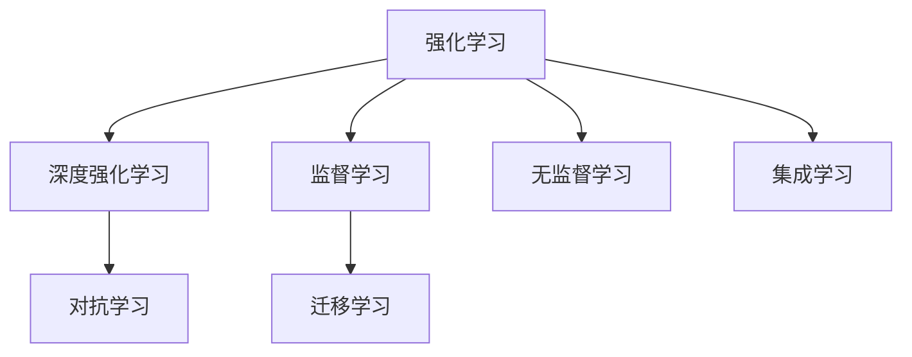

                 

## 1. 背景介绍

### 1.1 问题由来
机器学习领域自20世纪80年代兴起以来，经历了从浅层学习到深层学习的演化。当前，深度学习技术已经深入到计算机视觉、自然语言处理、语音识别等多个领域，极大地推动了人工智能技术的进步。然而，在面对一些决策问题时，深度学习方法却显得力不从心。传统的机器学习方法依赖于大量标注数据，难以应对实时变化的环境，缺乏自我改进和决策优化能力。

针对这些问题，强化学习(Reinforcement Learning, RL)应运而生。强化学习是一种通过与环境交互来学习最优决策策略的算法框架。与传统的监督学习和无监督学习方法不同，强化学习通过奖励信号指导模型学习，能够在不依赖标注数据的情况下，不断优化决策策略，适应复杂的动态环境。

本文旨在深入探讨强化学习与传统机器学习方法的异同点，通过理论分析、实验验证和实际应用案例，展示强化学习在复杂决策场景中的优势和潜力。

## 2. 核心概念与联系

### 2.1 核心概念概述

为更好地理解强化学习的核心概念及其与传统机器学习方法的联系，本节将介绍几个密切相关的核心概念：

- 强化学习(Reinforcement Learning)：通过与环境交互，在每一个时间步(timestep)选择最优动作(action)，以获得最大奖励(reward)的算法框架。强化学习强调模型在动态环境中自我优化和决策学习。

- 深度强化学习(Deep Reinforcement Learning, DRL)：在强化学习的基础上，使用深度神经网络作为函数逼近器，用于估计Q值函数、策略函数等关键中间变量，以提高模型学习效率和精度。

- 监督学习(Supervised Learning)：通过大量已标注的数据，学习模型输入和输出之间的映射关系，广泛应用于分类、回归等任务。

- 无监督学习(Unsupervised Learning)：通过大量未标注的数据，学习数据的分布特性和内在结构，如聚类、降维、生成模型等。

- 迁移学习(Transfer Learning)：通过在一个任务上学习到的知识，迁移到另一个任务上，以提升新任务的学习效率和效果。

- 对抗学习(Adversarial Learning)：通过对抗训练等方法，使模型能够抵抗攻击，提高模型的鲁棒性和安全性。

这些核心概念之间的逻辑关系可以通过以下Mermaid流程图来展示：



这个流程图展示了一个较完整的机器学习框架，其中的每个环节都有其特定的应用场景和价值。

## 3. 核心算法原理 & 具体操作步骤

### 3.1 算法原理概述

强化学习通过与环境交互来学习最优决策策略。假设一个智能体(Agent)在某个环境(Environment)中执行一系列动作(Action)，每个动作会导致环境的某种变化，并根据动作的好坏程度给出奖励(Reward)。智能体的目标是通过学习最优的策略，最大化长期累积奖励。

强化学习的主要算法框架包括值函数逼近、策略优化、基于模型的强化学习等。常用的方法有Q-Learning、SARSA、Deep Q-Learning、策略梯度法等。这些方法通过估计Q值函数或策略函数，逐步逼近最优策略。

与传统的监督学习不同，强化学习在每个时间步上都要根据当前的观察(Observation)和奖励(Reward)，动态选择最优的动作(ACTION)。这种动态决策过程使得强化学习能够适应非平稳分布的环境变化，具有更强的泛化能力。

### 3.2 算法步骤详解

强化学习的核心算法步骤包括以下几个关键环节：

**Step 1: 环境建模与状态定义**
- 定义环境的状态空间、动作空间和奖励函数。状态空间通常由环境的状态变量构成，动作空间包括所有可执行的动作，奖励函数用于评估动作的好坏。
- 环境建模可以使用POMDP、MDP等数学框架，详细描述智能体与环境的交互过程。

**Step 2: 选择算法框架**
- 选择适合的算法框架，如Q-Learning、Deep Q-Learning、策略梯度法等。这些算法通过不同的方式逼近最优策略。
- 确定算法超参数，如学习率、折扣因子、更新频率等，以控制模型的探索和利用平衡。

**Step 3: 训练过程**
- 在每个时间步，智能体观察当前状态，选择动作并执行，获得即时奖励和状态转移。
- 通过回溯奖励和状态转移，更新Q值函数或策略函数。
- 重复上述过程直至达到预设的训练轮数或满足预设的收敛条件。

**Step 4: 测试和部署**
- 在测试集上评估模型性能，对比不同策略的累积奖励。
- 使用训练好的模型进行实际应用，如自动驾驶、游戏AI等。
- 持续收集数据，根据新数据调整模型参数，进行持续学习和优化。

### 3.3 算法优缺点

强化学习与传统机器学习方法相比，具有以下优缺点：

**优点：**
1. 适应性强：强化学习能够适应复杂多变的环境，不依赖标注数据。
2. 动态优化：通过实时交互反馈，强化学习能够不断优化决策策略，最大化长期奖励。
3. 模型泛化：强化学习能够学习到具有泛化能力的行为策略，适应不同的应用场景。
4. 决策自主：强化学习具有自主决策能力，无需人类干预。

**缺点：**
1. 探索与利用平衡：强化学习需要平衡探索和利用，过多的探索可能导致资源浪费，过多的利用可能导致策略过早收敛。
2. 样本效率低：强化学习往往需要大量的样本来收敛，对于高维环境和高复杂度问题，学习过程较为缓慢。
3. 可解释性差：强化学习的决策过程缺乏可解释性，难以理解和调试。
4. 动作空间复杂：当动作空间很大时，强化学习需要高效的探索策略，优化难度增加。
5. 存在局部最优：强化学习容易陷入局部最优，难以找到全局最优策略。

尽管存在这些局限性，但强化学习在特定场景下展现出巨大的优势，成为解决复杂决策问题的重要手段。未来相关研究的重点在于如何进一步提高样本效率和可解释性，改善探索与利用平衡，从而更好地适应各类应用需求。

### 3.4 算法应用领域

强化学习在多个领域得到了广泛的应用，展示了其强大的决策能力。以下是几个典型的应用场景：

- 自动驾驶：强化学习能够通过与虚拟环境和实际道路的交互，学习最优的驾驶策略，避免交通事故和违规行为。
- 游戏AI：强化学习可以学习最优的游戏策略，在游戏中战胜人类对手。
- 机器人控制：强化学习可以控制机器人完成复杂的动作序列，如路径规划、目标抓取等。
- 金融交易：强化学习可以学习最优的交易策略，自动执行交易操作，获取最大收益。
- 自然语言处理：强化学习可以学习最优的对话策略，提升机器人与人类交互的自然流畅性。
- 资源管理：强化学习可以优化资源分配，如电源管理、网络路由等，提高系统的效率和可靠性。

强化学习在这些领域中的应用，展示了其在解决复杂决策问题中的潜力和价值。随着算法技术的不断进步，强化学习必将在更多领域得到广泛应用，推动人工智能技术的不断创新和突破。

## 4. 数学模型和公式 & 详细讲解 & 举例说明

### 4.1 数学模型构建

强化学习模型的数学模型可以抽象为马尔科夫决策过程(Markov Decision Process, MDP)。MDP包括状态空间(S)、动作空间(A)、奖励函数(R)、状态转移概率(P)等元素，定义如下：

$$
(S, A, R, P)
$$

其中，状态空间S表示环境的所有可能状态，动作空间A表示智能体可执行的所有动作，奖励函数R用于评估每个状态-动作对的奖励，状态转移概率P描述了在状态s下，执行动作a后转移到状态s'的概率。

强化学习的目标是通过学习最优策略$\pi$，最大化长期累积奖励$J(\pi)$。策略函数$\pi: S \to A$将状态映射到动作。强化学习的核心问题是求解最优策略$\pi^*$，使得$J(\pi^*) = \max_{\pi} J(\pi)$。

### 4.2 公式推导过程

在强化学习中，常用的方法包括Q-Learning、SARSA和策略梯度法等。以下以Q-Learning为例，推导其核心公式。

Q-Learning的目标是学习Q值函数$Q(s,a)$，表示在状态s下执行动作a的预期累积奖励。Q值函数满足Bellman方程：

$$
Q(s,a) = r + \gamma \max_{a'} Q(s',a')
$$

其中，r为即时奖励，$\gamma$为折扣因子。

Q-Learning通过迭代更新Q值函数来逼近最优策略。更新公式如下：

$$
Q(s_t, a_t) \leftarrow Q(s_t, a_t) + \alpha [r_{t+1} + \gamma \max_{a'} Q(s_{t+1}, a') - Q(s_t, a_t)]
$$

其中，$\alpha$为学习率。

Q-Learning的思路是通过不断迭代，逐步逼近最优Q值函数，从而得到最优策略。

### 4.3 案例分析与讲解

下面通过一个简单的案例，展示Q-Learning在环境中的学习过程。假设有一个简单的四状态环境，智能体的目标是最大化累积奖励。环境的状态和动作如下表所示：

| 状态 | 奖励 | 转移概率 |
| --- | --- | --- |
| S1 | 0 | 0.3 |
| S2 | 0 | 0.3 |
| S3 | 0 | 0.3 |
| S4 | 1 | 0.1 |

智能体的动作空间为{left, right}，初始状态为S1。通过Q-Learning学习最优策略，步骤如下：

1. 初始化Q值函数$Q(s,a)=0$。
2. 执行初始动作a1=right，转移至状态S2，获得奖励r1=0。
3. 更新Q值函数：$Q(S1, right) \leftarrow Q(S1, right) + \alpha [r_2 + \gamma \max_{a'} Q(S2, a')]$。
4. 重复执行动作，更新Q值函数，直到达到稳定状态。

通过Q-Learning学习，智能体可以发现最优策略为右移，最大化累积奖励。

## 5. 项目实践：代码实例和详细解释说明

### 5.1 开发环境搭建

在进行强化学习项目实践前，我们需要准备好开发环境。以下是使用Python进行Reinforcement Learning开发的环境配置流程：

1. 安装Anaconda：从官网下载并安装Anaconda，用于创建独立的Python环境。

2. 创建并激活虚拟环境：
```bash
conda create -n reinlearn python=3.8 
conda activate reinlearn
```

3. 安装必要的库：
```bash
conda install gym reinforcement-learning git
```

4. 安装OpenAI Gym库：
```bash
pip install gym
```

5. 安装TensorFlow或PyTorch库：
```bash
pip install tensorflow pytorch torchvision
```

完成上述步骤后，即可在`reinlearn`环境中开始强化学习实践。

### 5.2 源代码详细实现

下面我们以Q-Learning算法为例，给出使用TensorFlow实现Q-Learning的PyTorch代码实现。

首先，定义Q-Learning的核心类：

```python
import tensorflow as tf

class QLearning:
    def __init__(self, env, learning_rate=0.1, discount_factor=0.9, epsilon=0.1):
        self.env = env
        self.q_table = tf.Variable(tf.zeros([env.observation_space.n, env.action_space.n]))
        self.learning_rate = learning_rate
        self.discount_factor = discount_factor
        self.epsilon = epsilon
        
    def q_value(self, state, action):
        return tf.reduce_sum(self.q_table * tf.one_hot(action, self.env.action_space.n))
    
    def train(self, max_episodes=1000, max_steps=100):
        for episode in range(max_episodes):
            state = self.env.reset()
            done = False
            steps = 0
            while not done:
                if np.random.rand() < self.epsilon:
                    action = self.env.action_space.sample()
                else:
                    action = np.argmax(self.q_value(state, self.env.action_space))
                next_state, reward, done, _ = self.env.step(action)
                q_next = self.q_value(next_state, self.env.action_space)
                max_q_next = tf.reduce_max(q_next)
                q_value = self.q_value(state, action)
                td_target = reward + self.discount_factor * max_q_next
                td_error = td_target - tf.reduce_mean(q_value)
                train_op = tf.assign_add(self.q_table, self.learning_rate * td_error)
                self.sess.run(train_op)
                state = next_state
                steps += 1
                if steps >= max_steps:
                    break
            print("Episode: {}, Steps: {}, Cumulative Reward: {}".format(episode+1, steps, self.cumulative_reward))
```

然后，使用OpenAI Gym库构建一个简单的四状态环境，并实例化Q-Learning类：

```python
import gym

env = gym.make('CartPole-v1')
ql = QLearning(env)
ql.train()
```

最后，启动训练过程并输出训练结果：

```python
ql.sess = tf.Session()
ql.sess.run(tf.global_variables_initializer())
ql.cumulative_reward = 0
for _ in range(max_episodes):
    ql.cumulative_reward += ql.train(max_steps=max_steps)
```

以上就是使用TensorFlow实现Q-Learning算法的完整代码实例。可以看到，通过定义Q值函数、训练函数和实例化类，我们可以快速实现一个简单的Q-Learning算法。

### 5.3 代码解读与分析

让我们再详细解读一下关键代码的实现细节：

**QLearning类**：
- `__init__`方法：初始化环境、Q值表、学习率、折扣因子和探索率。
- `q_value`方法：计算给定状态-动作对的Q值。
- `train`方法：进行Q-Learning训练，更新Q值表。

**OpenAI Gym环境**：
- `gym.make('CartPole-v1')`：创建一个简单的四状态环境。

**训练过程**：
- 通过`tf.Session()`和`tf.global_variables_initializer()`创建和初始化TensorFlow会话。
- `ql.cumulative_reward = 0`：用于记录每个回合的累积奖励。
- 在每个回合中，执行Q-Learning的训练步骤，直到达到最大回合数或最大步数。

该代码实现展示了Q-Learning的基本流程和原理，易于理解和修改，适合作为入门学习和实验的基础。

## 6. 实际应用场景

### 6.1 自动驾驶

自动驾驶技术是强化学习的重要应用场景之一。在自动驾驶中，智能车需要实时感知环境，选择最优的驾驶策略，以避免交通事故和违规行为。通过与虚拟环境和实际道路的交互，强化学习能够学习最优的驾驶策略，提高行车的安全性和效率。

在实际应用中，智能车可以通过摄像头、雷达等传感器获取环境信息，将环境信息作为状态，将加速、转向等操作作为动作，通过强化学习不断优化驾驶策略。智能车可以通过策略梯度方法，如Proximal Policy Optimization(PPO)，不断调整策略参数，最大化长期累积奖励。

### 6.2 游戏AI

游戏AI是强化学习的典型应用之一。通过与游戏环境的交互，强化学习可以学习最优的游戏策略，获得高分的游戏成绩。

在游戏AI中，智能体可以通过Q-Learning等方法学习最优的动作策略，如AlphaGo、Dota 2等游戏中使用的强化学习技术。通过不断优化策略参数，智能体可以逐步超越人类对手，成为游戏领域的顶尖玩家。

### 6.3 机器人控制

机器人控制是强化学习的另一个重要应用领域。通过与物理环境的交互，强化学习能够学习最优的机器人控制策略，完成复杂的动作序列，如路径规划、目标抓取等。

在机器人控制中，智能体可以通过Q-Learning等方法学习最优的动作策略，如K vdula机器人的路径规划和目标抓取。通过不断优化策略参数，智能体可以逐步实现更加复杂的任务，提升机器人的自主性和智能化水平。

### 6.4 未来应用展望

随着强化学习技术的不断发展，其在更多领域得到了广泛的应用，展示了其强大的决策能力。

在智慧医疗领域，强化学习可以用于医疗影像诊断、个性化治疗方案生成等，提升医疗服务的智能化水平。

在智能教育领域，强化学习可以用于智能辅导、个性化学习路径设计等，因材施教，促进教育公平，提高教学质量。

在智慧城市治理中，强化学习可以用于城市事件监测、舆情分析、应急指挥等环节，提高城市管理的自动化和智能化水平，构建更安全、高效的未来城市。

此外，在企业生产、社会治理、文娱传媒等众多领域，强化学习也将不断涌现新的应用场景，为经济社会发展注入新的动力。

## 7. 工具和资源推荐

### 7.1 学习资源推荐

为了帮助开发者系统掌握强化学习的理论基础和实践技巧，这里推荐一些优质的学习资源：

1. 《强化学习基础》（Reinforcement Learning: An Introduction）：由Richard S. Sutton和Andrew G. Barto撰写，全面介绍了强化学习的基本概念、算法和应用。
2. 《深度强化学习》（Deep Reinforcement Learning with Python）：由Yoshua Bengio和Ian Goodfellow共同撰写，介绍了深度强化学习的基本框架和最新进展。
3. Coursera的强化学习课程：由David Silver教授讲授，是学习强化学习的经典课程，涵盖了从基础到高级的各种算法和应用。
4. DeepMind的AI论文与博客：DeepMind在强化学习领域的研究成果丰富，其官方博客和论文库是学习和跟踪最新进展的重要资源。

通过对这些资源的学习实践，相信你一定能够快速掌握强化学习的精髓，并用于解决实际的决策问题。

### 7.2 开发工具推荐

高效的开发离不开优秀的工具支持。以下是几款用于强化学习开发的常用工具：

1. OpenAI Gym：用于模拟环境与智能体交互的Python库，提供了多种模拟环境，方便开发者进行测试和研究。
2. TensorFlow和PyTorch：用于深度学习框架，支持强化学习算法的实现。
3. TensorBoard：用于可视化训练过程和模型结构，便于调试和优化。
4. Weights & Biases：用于实验跟踪和管理，记录和可视化模型训练指标。
5. AutoGPT：用于自动生成代码和模型，提高开发效率。

合理利用这些工具，可以显著提升强化学习项目的开发效率，加快创新迭代的步伐。

### 7.3 相关论文推荐

强化学习技术的发展离不开学界的持续研究。以下是几篇奠基性的相关论文，推荐阅读：

1. Deep Reinforcement Learning with Function Approximation: Foundations and Policy-Gradient Methods（Deep Q-Learning）：提出Deep Q-Learning算法，将深度神经网络应用于强化学习，极大地提升了学习效率和精度。
2. Actor-Critic Method: A New Framework for General Reinforcement Learning（Actor-Critic）：提出Actor-Critic方法，通过联合训练策略和价值函数，解决了强化学习中的探索与利用平衡问题。
3. On Policy Gradients with Variance Reduction（Proximal Policy Optimization）：提出Proximal Policy Optimization算法，通过引入梯度裁剪等技术，加速了策略梯度方法的学习过程。
4. Human-level Control through Deep Reinforcement Learning（AlphaGo）：提出AlphaGo算法，通过深度强化学习在围棋领域取得了超人类水平的表现，展示了强化学习在复杂决策场景中的潜力。

这些论文代表了大强化学习技术的核心进展，通过学习这些前沿成果，可以帮助研究者把握学科前进方向，激发更多的创新灵感。

## 8. 总结：未来发展趋势与挑战

### 8.1 总结

本文对强化学习与传统机器学习方法的异同点进行了全面系统的介绍。首先阐述了强化学习的背景和意义，明确了其在解决复杂决策问题中的独特价值。其次，从原理到实践，详细讲解了强化学习的基本算法和操作步骤，给出了强化学习任务开发的完整代码实例。同时，本文还广泛探讨了强化学习在自动驾驶、游戏AI、机器人控制等多个领域的应用前景，展示了其强大的决策能力。

通过本文的系统梳理，可以看到，强化学习在解决复杂决策问题中的巨大优势和潜力。强化学习能够在不依赖标注数据的情况下，不断优化决策策略，适应动态环境。未来随着算法技术的不断进步，强化学习必将在更多领域得到广泛应用，推动人工智能技术的不断创新和突破。

### 8.2 未来发展趋势

展望未来，强化学习技术将呈现以下几个发展趋势：

1. 深度强化学习：通过深度神经网络逼近最优策略，提高样本效率和学习精度。
2. 多智能体学习：通过多智能体协作，学习最优的团队策略，解决复杂环境下的决策问题。
3. 元学习：通过学习元知识，快速适应新的任务和环境，提高迁移学习能力。
4. 自适应算法：通过在线学习和动态调整策略参数，适应动态环境的变化。
5. 神经网络优化：通过改进神经网络结构和优化算法，提高模型效率和泛化能力。
6. 应用广泛化：强化学习将在更多领域得到应用，如医疗、教育、城市治理等，推动各行各业的智能化升级。

以上趋势凸显了强化学习技术的广阔前景。这些方向的探索发展，必将进一步提升强化学习系统的性能和应用范围，为人工智能技术的发展注入新的动力。

### 8.3 面临的挑战

尽管强化学习技术已经取得了瞩目成就，但在迈向更加智能化、普适化应用的过程中，它仍面临诸多挑战：

1. 探索与利用平衡：强化学习需要平衡探索和利用，过多的探索可能导致资源浪费，过多的利用可能导致策略过早收敛。
2. 样本效率低：强化学习往往需要大量的样本来收敛，对于高维环境和高复杂度问题，学习过程较为缓慢。
3. 可解释性差：强化学习的决策过程缺乏可解释性，难以理解和调试。
4. 动作空间复杂：当动作空间很大时，强化学习需要高效的探索策略，优化难度增加。
5. 存在局部最优：强化学习容易陷入局部最优，难以找到全局最优策略。
6. 鲁棒性不足：强化学习模型在面对噪声和干扰时，鲁棒性有待提升。

尽管存在这些局限性，但强化学习在特定场景下展现出巨大的优势，成为解决复杂决策问题的重要手段。未来相关研究的重点在于如何进一步提高样本效率和可解释性，改善探索与利用平衡，从而更好地适应各类应用需求。

### 8.4 研究展望

面对强化学习面临的种种挑战，未来的研究需要在以下几个方面寻求新的突破：

1. 探索无监督和半监督强化学习方法。摆脱对大量标注数据的依赖，利用自监督学习、主动学习等无监督和半监督范式，最大限度利用非结构化数据，实现更加灵活高效的强化学习。
2. 研究参数高效和计算高效的强化学习范式。开发更加参数高效的强化学习方法，在固定大部分预训练参数的同时，只更新极少量的任务相关参数。同时优化强化学习模型的计算图，减少前向传播和反向传播的资源消耗，实现更加轻量级、实时性的部署。
3. 引入因果推断和对比学习思想。通过引入因果推断和对比学习方法，增强强化学习建立稳定因果关系的能力，学习更加普适、鲁棒的行为策略，从而提升模型泛化性和抗干扰能力。
4. 引入更多先验知识。将符号化的先验知识，如知识图谱、逻辑规则等，与强化学习模型进行巧妙融合，引导强化学习过程学习更准确、合理的行为策略。同时加强不同模态数据的整合，实现视觉、语音等多模态信息与文本信息的协同建模。
5. 结合因果分析和博弈论工具。将因果分析方法引入强化学习模型，识别出模型决策的关键特征，增强输出解释的因果性和逻辑性。借助博弈论工具刻画人机交互过程，主动探索并规避模型的脆弱点，提高系统稳定性。
6. 纳入伦理道德约束。在强化学习模型的训练目标中引入伦理导向的评估指标，过滤和惩罚有偏见、有害的输出倾向。同时加强人工干预和审核，建立模型行为的监管机制，确保输出符合人类价值观和伦理道德。

这些研究方向的探索，必将引领强化学习技术迈向更高的台阶，为构建安全、可靠、可解释、可控的智能系统铺平道路。面向未来，强化学习技术还需要与其他人工智能技术进行更深入的融合，如知识表示、因果推理、强化学习等，多路径协同发力，共同推动人工智能技术的进步。只有勇于创新、敢于突破，才能不断拓展强化学习的边界，让智能技术更好地造福人类社会。

## 9. 附录：常见问题与解答

**Q1：强化学习和传统机器学习有哪些区别？**

A: 强化学习和传统机器学习的区别主要在于：
1. 目标不同：强化学习的目标是通过与环境交互学习最优决策策略，最大化长期累积奖励；传统机器学习的目标是通过大量标注数据学习模型输入和输出之间的映射关系。
2. 数据要求不同：强化学习不依赖标注数据，通过环境交互获得奖励信号；传统机器学习依赖大量标注数据，需要人工标注每个数据样本的输出标签。
3. 学习方式不同：强化学习通过探索和利用动态优化策略，不断调整决策行为；传统机器学习通过静态模型学习固定映射关系。
4. 模型复杂度不同：强化学习模型往往比较复杂，包括策略函数、价值函数等中间变量；传统机器学习模型相对简单，直接学习输入和输出之间的关系。

**Q2：强化学习中如何缓解过拟合问题？**

A: 强化学习中的过拟合问题通常通过以下几个方法缓解：
1. 数据增强：通过随机化环境状态、改变奖励函数等方法，增加训练数据的多样性，提高模型的泛化能力。
2. 正则化：通过L2正则、Dropout等方法，避免模型过度拟合训练数据。
3. 模型集成：通过并行训练多个模型，取平均输出，抑制过拟合。
4. 探索与利用平衡：通过引入探索策略，如$\epsilon$-贪心策略、UCB等，在探索和利用之间取得平衡，避免模型过早收敛。
5. 样本效率优化：通过改进算法和优化策略，减少不必要的探索和计算，提高样本效率。

**Q3：强化学习在实际应用中需要注意哪些问题？**

A: 在实际应用中，强化学习需要注意以下问题：
1. 数据采集：需要获取高质量的环境数据，确保数据具有代表性和多样性。
2. 环境建模：需要准确地描述环境的状态和动作空间，选择合适的奖励函数，设计合理的环境仿真。
3. 模型训练：需要选择合适的算法和超参数，确保模型能够高效学习最优策略。
4. 模型部署：需要考虑模型的实时性、资源占用和可扩展性，进行有效的模型压缩和优化。
5. 模型验证：需要在测试集上评估模型的泛化能力和鲁棒性，进行充分的模型测试和调优。
6. 模型应用：需要在实际应用中考虑模型的安全和伦理问题，确保模型输出符合人类价值观和伦理道德。

**Q4：强化学习如何应用于多智能体系统？**

A: 强化学习可以应用于多智能体系统，通过协作学习最优的团队策略。多智能体系统中的智能体可以通过分布式强化学习算法，如分布式Q-Learning、多智能体策略优化(MASO)等，进行协作学习。每个智能体通过与其他智能体的交互，学习最优的动作策略，从而提高系统的整体性能。多智能体系统通常包括通信机制、协作策略等关键环节，需要精心设计。

**Q5：强化学习在医疗领域的应用前景如何？**

A: 强化学习在医疗领域具有广泛的应用前景，如医疗影像诊断、个性化治疗方案生成等。在医疗影像诊断中，强化学习可以通过学习最优的分割策略，提高医学影像的分割精度和准确性。在个性化治疗方案生成中，强化学习可以通过学习最优的用药方案，提供个性化的治疗建议，提升治疗效果。

总之，强化学习在解决复杂决策问题中的潜力和价值已经得到广泛认可，未来将在更多领域得到应用，推动人工智能技术的不断创新和突破。

