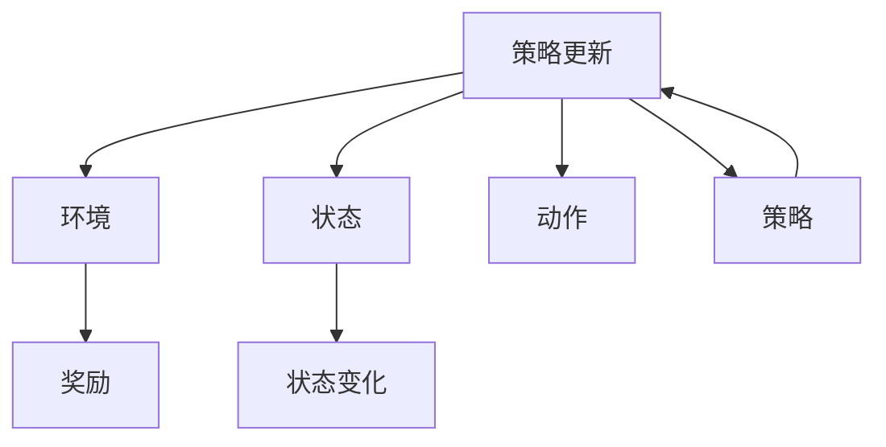

                 

## 1. 背景介绍

电子竞技（eSports），即电竞，是一种融合了游戏、竞技、社交、观赏等元素的互联网文化活动。电竞产业正在经历从早期的小众爱好者走向主流大众的过程，随着云计算、大数据、人工智能等先进技术的引入，电竞竞赛的难度和复杂度也在不断提升。

强化学习（Reinforcement Learning, RL），作为人工智能领域的一个核心分支，专注于智能体（agent）通过与环境的交互，不断优化策略以最大化累积奖励（cumulative reward）的过程。其算法和理论在自动驾驶、机器人、游戏AI等多个领域都有着广泛应用，而在电竞这一新兴领域中，RL也展现出了巨大的潜力。

本文将探讨RL在电竞中的运用，从基础概念到实际应用，详细分析强化学习在电竞中的优势、挑战以及未来展望，希望能为电竞领域的AI技术应用提供一些参考。

## 2. 核心概念与联系

### 2.1 核心概念概述

为了更好地理解强化学习在电竞中的应用，我们首先介绍几个关键概念：

- **强化学习（Reinforcement Learning, RL）**：强化学习是一种基于奖励信号的学习方式，智能体通过在环境中不断采取行动，并通过环境反馈的奖励信号不断优化策略，以最大化长期累积奖励。
- **智能体（Agent）**：在RL中，智能体是执行策略的主体，可以是一个人、一个机器人，甚至一个程序。
- **环境（Environment）**：智能体交互的虚拟或真实环境，负责提供状态的反馈和奖励。
- **状态（State）**：环境中的即时信息，用于描述智能体所处情境。
- **动作（Action）**：智能体在给定状态下所采取的具体操作。
- **奖励（Reward）**：智能体在采取某个动作后，环境给出的反馈信号，用于衡量动作的好坏。

### 2.2 核心概念原理和架构的 Mermaid 流程图

以下是RL的原理和架构的Mermaid流程图：



这个流程图展示了RL的基本架构：智能体在环境中采取动作，状态变化并接收环境反馈的奖励，进而更新策略以最大化未来累积奖励。

## 3. 核心算法原理 & 具体操作步骤

### 3.1 算法原理概述

在电竞中，RL智能体可以是游戏玩家、虚拟角色、机器人等。其核心思想是，通过学习并优化策略，使智能体在各种游戏情境中采取最优的动作序列，以达到胜利或高分的目标。

强化学习在电竞中的基本流程如下：

1. **初始化**：初始化智能体状态和环境。
2. **选择动作**：智能体根据当前状态，选择并执行一个动作。
3. **环境反馈**：环境更新状态并给出奖励信号。
4. **更新策略**：智能体根据奖励信号调整策略，以便在未来取得更好的表现。
5. **迭代执行**：重复执行上述过程，直到游戏结束或达到预设迭代次数。

### 3.2 算法步骤详解

在电竞中，强化学习可以采用以下关键步骤：

#### 步骤1：选择环境与动作空间

首先，需要定义电竞游戏的环境和动作空间。环境可以是游戏地图、角色属性、装备状态等。动作空间则包括可能的移动、攻击、技能释放等。

#### 步骤2：设计奖励函数

设计合理的奖励函数是强化学习成功的关键。通常，设计奖励函数时需要考虑如下因素：

- **目标导向**：奖励信号应引导智能体朝向最终目标（如击败对手、获得高分等）。
- **即时与长期平衡**：奖励既要考虑即时反馈（如杀死敌人、获取资源），也要考虑长期累积（如策略执行的稳定性和胜利概率）。
- **惩罚机制**：适当加入惩罚项，如失败惩罚、时间限制惩罚等，引导智能体避免不利的行为。

#### 步骤3：选择与训练策略

常用的策略选择方法包括：

- **$\epsilon$-贪心策略**：以一定概率（$\epsilon$）随机选择动作，其余时间采用当前策略选取最优动作。
- **Q-learning**：通过学习动作-状态-奖励的Q值表，选择具有最高Q值的动作。
- **Deep Q-Network（DQN）**：将Q值表表示为神经网络，进一步提升Q值的预测准确性。

#### 步骤4：实施与优化

在电竞中实施RL的策略时，需要注意如下几点：

- **模拟与真实**：可以使用模拟环境进行训练，如使用AI对真人玩家进行模拟。
- **多目标优化**：电竞中通常存在多个目标（如生存、击杀、推塔等），需要平衡多目标的优化。
- **复杂性管理**：电竞中的状态空间和动作空间可能非常庞大，需要采用特征提取等方法简化问题。

#### 步骤5：评估与迭代

在实施RL策略后，需要对智能体的表现进行评估，并根据评估结果不断迭代优化策略。

### 3.3 算法优缺点

RL在电竞中具有以下优点：

- **自适应性强**：RL智能体能够通过不断尝试和学习，适应复杂多变的游戏环境。
- **策略优化**：通过迭代优化，智能体可以逐步改进策略，提升游戏表现。
- **通用性**：RL算法可以应用于不同类型和风格的电竞游戏中。

同时，RL也存在以下缺点：

- **学习效率低**：在复杂环境中，RL智能体需要大量训练时间才能找到最优策略。
- **难以理解**：RL算法复杂度高，其内部工作机制难以理解和解释。
- **数据依赖**：RL需要大量的训练数据，且对数据质量要求高。

### 3.4 算法应用领域

RL在电竞中已应用于多个领域，包括但不限于：

- **机器人对战**：如AlphaGoZero在围棋中击败人类顶尖棋手。
- **团队策略游戏**：如《Dota 2》、《星际争霸》中，AI团队玩家通过学习游戏策略，与人类玩家对抗。
- **游戏AI**：如《Overwatch》中，AI角色通过强化学习，能够适应不同类型的玩家和策略。
- **动态环境适应**：如《FIFA》中的AI守门员，能够在不同的比赛环境中表现出不同的反应策略。

## 4. 数学模型和公式 & 详细讲解

### 4.1 数学模型构建

在电竞中，RL的数学模型可以定义为：

$$
\max_{\pi} \mathbb{E}_{\tau \sim \pi} [\sum_{t=0}^T \gamma^t r_t]
$$

其中 $\pi$ 是智能体的策略函数，$\tau$ 是智能体的行为序列，$r_t$ 是状态 $s_t$ 和动作 $a_t$ 的奖励，$T$ 是游戏终止时间，$\gamma$ 是折扣因子。

### 4.2 公式推导过程

强化学习的核心公式为Bellman方程：

$$
Q^{\pi}(s_t,a_t) = r_t + \gamma \mathbb{E}_{s_{t+1}}[Q^{\pi}(s_{t+1},\cdot)]
$$

其中 $Q^{\pi}(s,a)$ 表示策略 $\pi$ 在状态 $s$ 下采取动作 $a$ 的Q值。

在电竞中，Bellman方程可以表示为：

$$
Q^{\pi}(s_{t+1},a_{t+1}) = r + \gamma \max_{a} Q^{\pi}(s_{t+1},a)
$$

其中 $r$ 是当前状态 $s_t$ 下采取动作 $a_t$ 的即时奖励，$\gamma$ 是折扣因子，$\max_{a}$ 表示在状态 $s_{t+1}$ 下选择最优动作。

### 4.3 案例分析与讲解

以《星际争霸》为例，分析强化学习如何应用于游戏AI。

- **状态**：智能体的状态可以是游戏地图的当前布局、己方和敌方单位位置、装备状态、资源数量等。
- **动作**：动作可以是移动、攻击、建造建筑、采集资源等。
- **奖励**：奖励可以是击杀敌军、建造建筑、采集资源、防御成功等，具体奖励值可以根据游戏规则设计。
- **训练**：使用DQN算法训练智能体，不断调整策略以最大化长期累积奖励。

## 5. 项目实践：代码实例和详细解释说明

### 5.1 开发环境搭建

进行RL在电竞中的项目实践，需要先搭建开发环境。以下是基本步骤：

1. **安装Python**：下载并安装Python，通常需要3.7或更高版本。
2. **安装PyTorch**：使用pip安装PyTorch，建议安装最新版本。
3. **安装 gym 库**：gym是Python的模拟环境库，用于构建和测试强化学习算法。

### 5.2 源代码详细实现

以下是一个简单的RL代码示例，以训练一个简单版本的《Snake》游戏AI：

```python
import gym
import numpy as np
import torch
import torch.nn as nn
import torch.optim as optim

class QNetwork(nn.Module):
    def __init__(self, state_size, action_size):
        super(QNetwork, self).__init__()
        self.fc1 = nn.Linear(state_size, 64)
        self.fc2 = nn.Linear(64, action_size)

    def forward(self, x):
        x = F.relu(self.fc1(x))
        x = self.fc2(x)
        return x

def train(env, q_network, optimizer, num_episodes):
    state = env.reset()
    state = torch.tensor(state, dtype=torch.float32)

    for episode in range(num_episodes):
        done = False
        total_reward = 0

        while not done:
            # 使用ε-greedy策略选择动作
            if np.random.rand() < 0.1:
                action = env.action_space.sample()
            else:
                action = q_network(state).argmax().item()

            # 执行动作并获取环境反馈
            next_state, reward, done, _ = env.step(action)

            # 更新Q值
            q_next = q_network(torch.tensor(next_state, dtype=torch.float32))
            q_next_value = q_next.max()
            target = reward + 0.99 * q_next_value

            q = q_network(state)
            q_value = q[0][action]

            # 更新Q值
            optimizer.zero_grad()
            loss = (target - q_value).mean()
            loss.backward()
            optimizer.step()

            total_reward += reward
            state = next_state

        print("Episode {}: Total reward = {}".format(episode, total_reward))

env = gym.make("Snake-v0")
q_network = QNetwork(env.observation_space.shape[0], env.action_space.n)
optimizer = optim.Adam(q_network.parameters(), lr=0.001)
train(env, q_network, optimizer, 1000)
```

### 5.3 代码解读与分析

这段代码实现了一个简单的Q-learning算法，用于训练Snake游戏的AI玩家。以下是关键代码的解读：

- **QNetwork类**：定义了Q值的神经网络结构，包含两个全连接层。
- **训练过程**：在每个回合中，智能体使用ε-greedy策略选择动作，并根据环境反馈的奖励更新Q值。
- **损失函数**：使用均方误差作为损失函数，优化Q网络的参数。
- **输出**：打印每个回合的总奖励，用于评估训练效果。

## 6. 实际应用场景

### 6.1 电子竞技

强化学习在游戏AI中已经得到了广泛应用。例如，AlphaGo通过RL实现了在围棋领域的突破。在游戏AI领域，RL可以帮助智能体学习最优的游戏策略，提升游戏性能。

- **团队策略游戏**：如《Dota 2》、《星际争霸》中，AI团队玩家通过学习游戏策略，与人类玩家对抗。
- **单人游戏**：如《Overwatch》中，AI角色通过强化学习，能够适应不同类型的玩家和策略。

### 6.2 运动游戏

在运动游戏中，RL也可以帮助玩家提升技能和策略。例如，在《FIFA》中，AI守门员通过RL学习动态环境下的反应策略，提升拦截能力。

### 6.3 机器人对战

RL在机器人对战中也有着广泛应用。例如，AlphaStar通过RL在《星际争霸2》中战胜了人类顶尖玩家。

### 6.4 未来应用展望

未来，RL在电竞中的应用将更加广泛和深入。随着计算资源和算法的不断提升，RL智能体将能够处理更复杂的游戏环境和更多样化的策略。

- **自适应策略**：智能体能够根据不同对手和环境动态调整策略。
- **多目标优化**：智能体能够在多种目标（如生存、击杀、推塔等）间平衡优化。
- **团队协作**：智能体能够与队友协同作战，提升团队的整体表现。

## 7. 工具和资源推荐

### 7.1 学习资源推荐

为了深入学习RL在电竞中的应用，推荐以下学习资源：

1. **《Reinforcement Learning: An Introduction》**：由Richard S. Sutton和Andrew G. Barto合著的经典教材，全面介绍了强化学习的基本概念和算法。
2. **《Gym: A Toolkit for Continuous Multi-Agent Reinforcement Learning》**：gym的官方文档，提供了大量的模拟环境和代码示例。
3. **《Deep Q-Learning in Python》**：由Ian Goodfellow等人编写的实用教程，介绍了如何使用Python实现DQN算法。

### 7.2 开发工具推荐

在RL开发中，常用工具包括：

1. **PyTorch**：强大的深度学习框架，支持高效的GPU计算。
2. **TensorFlow**：Google开源的深度学习框架，支持分布式计算和自动微分。
3. **Gym**：用于构建和测试强化学习算法的Python库，提供了丰富的模拟环境。
4. **Horizon**：OpenAI开发的强化学习平台，支持大规模分布式训练和模型部署。

### 7.3 相关论文推荐

在RL领域，有许多前沿的论文值得关注，以下是几篇具有代表性的论文：

1. **《Human-level Control through Deep Reinforcement Learning》**：由DeepMind团队发表的论文，展示了AlphaGo通过强化学习在围棋领域的突破。
2. **《AlphaStar: Playing StarCraft at the Grandmaster Level》**：由OpenAI团队发表的论文，展示了AlphaStar通过强化学习在《星际争霸2》中的胜利。
3. **《Evolution Strategies for Learning to Play Go from Scratch》**：由TianLun Zhang等人在NeurIPS 2019发表的论文，展示了进化策略在从零开始学习围棋中的效果。

## 8. 总结：未来发展趋势与挑战

### 8.1 研究成果总结

强化学习在电竞中的应用已经取得了显著成果，但仍面临诸多挑战。

- **策略优化**：如何在复杂环境中找到最优策略是一个重要难题。
- **计算资源**：训练复杂模型需要大量计算资源，如何高效利用资源是一个关键问题。
- **数据依赖**：RL需要大量标注数据，如何生成和利用数据是一个重要挑战。

### 8.2 未来发展趋势

未来，强化学习在电竞中的应用将更加广泛和深入，其主要发展趋势包括：

- **多智能体协作**：智能体将能够在团队协作中表现得更加出色。
- **自适应环境**：智能体将能够适应动态和不确定的环境，提升应对复杂场景的能力。
- **跨领域应用**：RL将在电竞以外的领域，如自动驾驶、机器人等，展现出更大的潜力。

### 8.3 面临的挑战

尽管强化学习在电竞中取得了显著进展，但仍面临诸多挑战：

- **训练效率**：在复杂环境中训练RL智能体需要大量时间和资源。
- **策略泛化**：如何在多种环境下保持策略的有效性是一个挑战。
- **安全性和公平性**：RL智能体的行为可能存在不确定性，需要考虑其安全性。

### 8.4 研究展望

未来的研究需要在以下几个方面寻求新的突破：

- **增强鲁棒性**：提高RL智能体在动态环境中的鲁棒性和稳定性。
- **优化策略**：通过算法优化和策略设计，提升RL智能体的表现。
- **跨领域应用**：将RL应用于其他领域，探索其在其他场景中的应用潜力。

总之，强化学习在电竞中的应用展示了巨大的潜力，未来将随着算法和计算资源的提升，展现出更加广阔的应用前景。

## 9. 附录：常见问题与解答

**Q1：RL在电竞中的学习效率如何？**

A: RL在电竞中的学习效率相对较低，特别是在复杂环境中。然而，随着深度学习和计算资源的提升，RL在电竞中的应用已经取得了显著进展。例如，AlphaStar在《星际争霸2》中的胜利展示了RL的强大能力。

**Q2：RL在电竞中的策略泛化能力如何？**

A: RL智能体在不同环境中的策略泛化能力是一个挑战。然而，通过精心设计环境和奖励函数，可以提升RL智能体的泛化能力。例如，AlphaGo在围棋中的应用展示了RL在特定领域的泛化能力。

**Q3：RL在电竞中的安全性如何？**

A: RL智能体的行为可能存在不确定性，需要在设计和训练过程中考虑其安全性。例如，AlphaGo在围棋中的应用展示了RL在特定领域的安全性。

**Q4：RL在电竞中的公平性如何？**

A: RL智能体的公平性是一个重要问题。在设计和训练过程中，需要考虑智能体的公平性和可解释性。例如，AlphaGo在围棋中的应用展示了RL在特定领域的公平性。

---

作者：禅与计算机程序设计艺术 / Zen and the Art of Computer Programming

