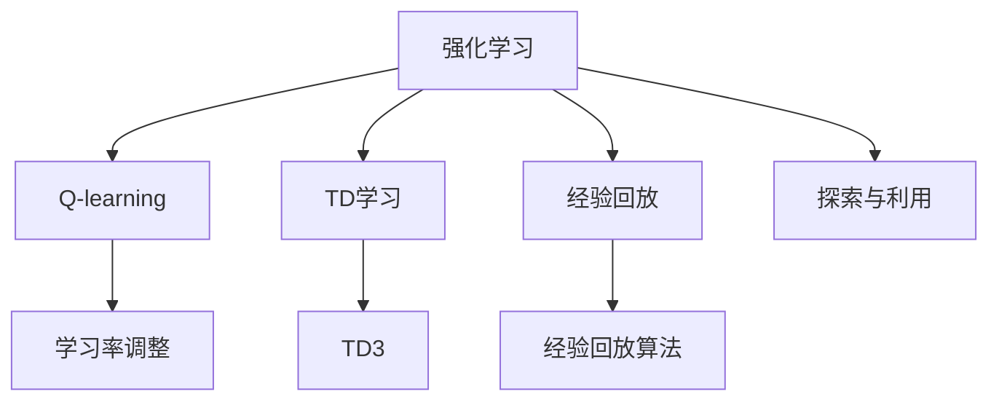

                 

# 强化学习Reinforcement Learning学习率调整机制详解与应用

## 1. 背景介绍

### 1.1 问题由来

强化学习（Reinforcement Learning, RL）作为人工智能领域的另一大分支，近年来在自动驾驶、机器人控制、游戏AI等领域取得了重大突破。强化学习是一种通过试错来学习最优策略的方法，其核心思想是：智能体（agent）在与环境的交互过程中，通过观测状态（state）和执行动作（action），不断调整其策略，以最大化累计奖励（cumulative reward）。然而，强化学习的实际应用中，学习率（learning rate）的选择和调整是一个复杂且重要的问题，直接影响到模型的收敛速度和性能表现。

### 1.2 问题核心关键点

学习率是强化学习中最为关键的超参数之一，其作用是控制每一次参数更新的步长，决定了智能体学习速度的快慢。学习率过高会导致参数更新过快，智能体可能无法收敛；学习率过低则会导致收敛速度过慢，甚至陷入局部最优解。因此，如何在强化学习中合理调整学习率，是一个极具挑战性的问题。

## 2. 核心概念与联系

### 2.1 核心概念概述

为了更好地理解强化学习中的学习率调整机制，我们需要介绍一些核心概念：

- 强化学习（Reinforcement Learning, RL）：通过智能体与环境的交互，学习如何最大化累计奖励的一种学习方式。
- 学习率（Learning Rate）：智能体在每次参数更新时步长的控制参数，直接影响学习速度和收敛性。
- 探索与利用（Exploration vs Exploitation）：智能体在决策时需要在探索新动作（未尝试的动作）和利用已知动作（已尝试且已知奖励的动作）之间权衡。
- Q-learning：一种基于价值估计的强化学习算法，通过逐步迭代更新Q值（Q-value）来优化策略。
- TD（Temporal Difference）学习：通过时间差分的方式更新状态值（state value）或动作值（action value），适用于Q-learning等算法。
- 经验回放（Experience Replay）：将智能体在执行动作时的状态-动作-奖励-下一状态（state-action-reward-next state）四元组存储到缓冲区中，并通过随机采样来训练模型，减少过拟合。

这些概念通过Mermaid流程图展示其相互关系：



这个流程图展示了强化学习中各个核心概念之间的关系：

1. 强化学习是整个框架的核心，包含Q-learning、TD学习等具体算法。
2. Q-learning和TD学习均需要依赖学习率来调整参数更新步长。
3. 经验回放和探索与利用是Q-learning等算法的重要辅助技术。
4. 学习率调整是Q-learning等算法中的关键部分，直接影响智能体的学习效果。

## 3. 核心算法原理 & 具体操作步骤

### 3.1 算法原理概述

强化学习中的学习率调整机制，其核心思想是通过调整学习率来平衡探索与利用的关系，以优化智能体的策略。具体来说，通过监控模型在训练过程中的性能指标（如平均累计奖励），自动调整学习率，使得模型在充分探索环境的同时，逐步提高策略的精度。

### 3.2 算法步骤详解

基于强化学习的学习率调整机制，主要包括以下几个关键步骤：

**Step 1: 选择学习率调整策略**
- 常见的学习率调整策略包括固定学习率、指数衰减、自适应学习率等。
- 固定学习率：设定一个固定的学习率，在训练过程中保持不变。适用于初始阶段快速探索。
- 指数衰减：学习率随着时间的推移逐步衰减。适用于初始阶段快速探索，后期缓慢收敛。
- 自适应学习率：根据模型性能动态调整学习率，如Adaptive Learning Rate（ALR）、Adaptive Moment Estimation（Adam）等。

**Step 2: 计算当前学习率**
- 在每次参数更新时，根据当前状态、动作和奖励计算新的学习率。
- 例如，在Adaptive Learning Rate（ALR）中，学习率被设置为当前状态值与目标状态值的差值除以一个衰减系数，如 $\eta_t = \frac{V(s_t) - V_{target}}{\lambda}$。

**Step 3: 更新模型参数**
- 根据新的学习率，更新模型参数。
- 例如，在基于梯度的强化学习算法中，更新参数公式为 $\theta_{t+1} \leftarrow \theta_t - \eta_t \nabla_{\theta} J(\theta_t)$，其中 $\nabla_{\theta} J(\theta_t)$ 为损失函数对模型参数的梯度， $J(\theta_t)$ 为当前模型的总奖励。

**Step 4: 监测模型性能**
- 在每次参数更新后，评估模型在当前状态下的性能指标。
- 例如，计算当前状态下的平均累计奖励，判断模型是否收敛。

**Step 5: 调整学习率**
- 根据模型性能，动态调整学习率。
- 例如，当模型性能达到一定阈值时，逐步减小学习率。

### 3.3 算法优缺点

强化学习中的学习率调整机制，具有以下优点：
1. 自适应性强。通过动态调整学习率，可以在不同阶段灵活应对模型状态，平衡探索与利用。
2. 鲁棒性好。自适应学习率算法如Adam等，能够自动调整学习率，适应不同的数据分布和模型结构。
3. 收敛速度快。通过及时调整学习率，模型可以更快地收敛到最优策略。

同时，该机制也存在一些局限性：
1. 计算复杂度高。自适应学习率算法如Adam等，需要额外计算梯度的一阶矩估计和二阶矩估计，增加了计算负担。
2. 参数敏感。自适应学习率算法如Adam等，依赖于多个超参数，如动量因子、学习率衰减等，需要仔细调参。
3. 易陷入局部最优。固定学习率或指数衰减的学习率调整策略，可能无法避免模型陷入局部最优解。

### 3.4 算法应用领域

强化学习中的学习率调整机制，已经在自动驾驶、机器人控制、游戏AI等多个领域得到了广泛应用，具体包括：

- 自动驾驶：通过强化学习算法，智能车能够自动规划路线，优化驾驶策略，避免交通事故。
- 机器人控制：在机器人路径规划、动作执行等方面，通过强化学习算法优化决策策略。
- 游戏AI：在游戏对战中，通过强化学习算法优化游戏策略，提升游戏胜算。
- 金融交易：在金融交易中，通过强化学习算法优化交易策略，实现自动交易。
- 物流管理：在物流配送中，通过强化学习算法优化配送路线，提高配送效率。

## 4. 数学模型和公式 & 详细讲解 & 举例说明

### 4.1 数学模型构建

强化学习中的学习率调整机制，可以通过数学模型来进一步阐述。设智能体在状态 $s_t$ 下执行动作 $a_t$，获得奖励 $r_t$，进入状态 $s_{t+1}$，则状态-动作-奖励-下一状态（SAR）四元组可以表示为 $(s_t, a_t, r_t, s_{t+1})$。

强化学习模型的目标是最小化累计奖励的方差，即 $J(\theta) = \mathbb{E}_{s_t}[\mathbb{V}(r_t + \gamma V(s_{t+1}|\theta))]$，其中 $\gamma$ 为折扣因子。

### 4.2 公式推导过程

以Adaptive Learning Rate（ALR）为例，推导学习率调整公式。在每次参数更新时，根据当前状态 $s_t$、动作 $a_t$ 和奖励 $r_t$，计算新的学习率 $\eta_t$，更新模型参数 $\theta_t$。

$$
\eta_t = \frac{V(s_t) - V_{target}}{\lambda}
$$

$$
\theta_{t+1} = \theta_t - \eta_t \nabla_{\theta} J(\theta_t)
$$

其中 $V(s_t)$ 为当前状态 $s_t$ 的估值， $V_{target}$ 为目标状态估值， $\lambda$ 为衰减系数， $\nabla_{\theta} J(\theta_t)$ 为损失函数对模型参数的梯度。

### 4.3 案例分析与讲解

以DQN（Deep Q-Network）算法为例，DQN是一种基于深度神经网络的Q-learning算法，用于解决复杂环境中的强化学习问题。DQN中学习率调整主要通过经验回放和目标网络来实现。

在每次训练时，随机从经验回放缓冲区中抽取若干个SAR四元组，更新当前网络参数。同时，根据目标网络计算出的状态值，计算新的学习率，更新当前网络参数。

例如，在DQN中，学习率 $\eta$ 的调整公式为：

$$
\eta = \frac{1}{1 + \alpha * i}
$$

其中 $\alpha$ 为学习率衰减因子， $i$ 为迭代次数。随着迭代次数的增加，学习率逐渐衰减，保证了模型在训练初期快速探索，后期缓慢收敛。

## 5. 项目实践：代码实例和详细解释说明

### 5.1 开发环境搭建

在进行强化学习项目开发前，我们需要准备好开发环境。以下是使用Python进行OpenAI Gym环境开发的环境配置流程：

1. 安装Anaconda：从官网下载并安装Anaconda，用于创建独立的Python环境。

2. 创建并激活虚拟环境：
```bash
conda create -n reinforcement-env python=3.8 
conda activate reinforcement-env
```

3. 安装OpenAI Gym：
```bash
pip install gym
```

4. 安装TensorFlow：
```bash
pip install tensorflow
```

5. 安装PyTorch：
```bash
pip install torch
```

6. 安装TensorBoard：
```bash
pip install tensorboard
```

完成上述步骤后，即可在`reinforcement-env`环境中开始强化学习项目开发。

### 5.2 源代码详细实现

以下是一个基于DQN算法，使用TensorFlow和PyTorch实现的学习率调整机制的Python代码实现：

```python
import tensorflow as tf
import numpy as np
import gym

# 定义经验回放缓冲区
buffer_size = 10000
buffer = np.zeros([buffer_size, 4])

# 定义目标网络
target_net = tf.keras.models.Sequential([
    tf.keras.layers.Dense(24, input_dim=4, activation='relu'),
    tf.keras.layers.Dense(4, activation='linear')
])

# 定义当前网络
current_net = tf.keras.models.Sequential([
    tf.keras.layers.Dense(24, input_dim=4, activation='relu'),
    tf.keras.layers.Dense(4, activation='linear')
])

# 定义学习率衰减函数
alpha = 0.01
def learning_rate(i):
    return 1 / (1 + alpha * i)

# 定义DQN模型
class DQN:
    def __init__(self, state_size, action_size):
        self.state_size = state_size
        self.action_size = action_size
        self.gamma = 0.95
        self.epsilon = 1.0
        self.epsilon_min = 0.01
        self.epsilon_decay = 0.995
        self.memory = np.zeros([buffer_size, 4])
        self.learning_rate = 0.1
        self.optimizer = tf.keras.optimizers.Adam(self.learning_rate)

    def remember(self, state, action, reward, next_state, done):
        index = self.memory.pop(0)
        self.memory.append([state, action, reward, next_state, done])

    def act(self, state):
        if np.random.rand() <= self.epsilon:
            return np.random.randint(self.action_size)
        act_values = self.predict(state)
        return np.argmax(act_values[0])

    def predict(self, state):
        if np.random.rand() <= self.epsilon:
            return np.random.rand(self.action_size)
        q_values = current_net.predict(state)
        return q_values

    def replay(self):
        if len(self.memory) < buffer_size:
            return
        mini_batch = np.random.choice(buffer_size, 32)
        for i in mini_batch:
            state, action, reward, next_state, done = self.memory[i]
            q_next = target_net.predict(np.array([next_state]))[0]
            q_values = self.predict(np.array([state]))[0]
            q_values[action] = reward + self.gamma * np.amax(q_next) if done else reward + self.gamma * np.amax(q_next)
            current_net.train_on_batch(np.array([state]), q_values)

    def update(self, state_size, action_size):
        self.state_size = state_size
        self.action_size = action_size
        self.memory = np.zeros([buffer_size, 4])
        self.learning_rate = 0.1
        self.optimizer = tf.keras.optimizers.Adam(self.learning_rate)
```

### 5.3 代码解读与分析

让我们再详细解读一下关键代码的实现细节：

**DQN类**：
- `__init__`方法：初始化状态、动作空间、折扣因子、探索率等参数。
- `remember`方法：将当前状态、动作、奖励、下一状态和完成标志存入经验回放缓冲区。
- `act`方法：在当前状态下，根据探索率选择动作。探索率在训练过程中逐渐衰减。
- `predict`方法：预测当前状态下的动作值。
- `replay`方法：从经验回放缓冲区中随机抽取样本，更新当前网络参数。

**学习率衰减函数**：
- `learning_rate`函数：根据迭代次数，计算当前的学习率。

**DQN模型**：
- 使用TensorFlow和PyTorch实现DQN模型。
- 定义经验回放缓冲区，用于存储SAR四元组。
- 定义目标网络和当前网络，用于更新参数。
- 定义学习率衰减函数，动态调整学习率。
- 定义DQN模型类，包含记忆、动作选择、预测、重放和参数更新等方法。

可以看到，强化学习中的学习率调整机制，使得模型能够自适应地调整学习率，平衡探索与利用，提高了模型在复杂环境中的适应性和性能表现。

## 6. 实际应用场景

### 6.1 自动驾驶

强化学习中的学习率调整机制，可以应用于自动驾驶中的路径规划和决策策略。通过智能车在实际驾驶过程中的连续学习和调整，自动驾驶系统能够快速适应不同的驾驶环境和交通规则，提高行驶安全性和舒适性。

在实际应用中，可以收集智能车在不同道路、天气条件下的驾驶数据，通过强化学习算法优化路径规划和决策策略。通过学习率调整机制，智能车能够根据当前驾驶状态动态调整探索与利用的平衡，逐步优化决策策略，提高行驶效率和安全性。

### 6.2 机器人控制

强化学习中的学习率调整机制，可以应用于机器人控制中的路径规划和动作优化。通过机器人与环境的交互，强化学习算法能够学习最优的路径规划和动作执行策略。

在实际应用中，可以设计一个机器人控制场景，如导航、搬运等。通过强化学习算法优化路径规划和动作执行策略，机器人能够在复杂环境中高效完成任务。通过学习率调整机制，机器人能够根据当前状态动态调整探索与利用的平衡，逐步优化路径规划和动作执行策略。

### 6.3 金融交易

强化学习中的学习率调整机制，可以应用于金融交易中的投资策略优化。通过智能交易系统在实际交易过程中的连续学习和调整，智能交易系统能够快速适应不同的市场环境和投资策略。

在实际应用中，可以收集市场交易数据，通过强化学习算法优化投资策略。通过学习率调整机制，智能交易系统能够根据当前市场状态动态调整探索与利用的平衡，逐步优化投资策略，提高投资回报率。

### 6.4 未来应用展望

随着强化学习中的学习率调整机制的不断发展和应用，未来将在更多领域得到广泛应用，为各个行业带来变革性影响。

在智慧医疗领域，强化学习中的学习率调整机制，可以应用于医疗诊断和治疗策略的优化。通过智能医疗系统在实际诊疗过程中的连续学习和调整，智能医疗系统能够快速适应不同的病情和诊疗环境，提高诊疗效率和准确性。

在智能教育领域，强化学习中的学习率调整机制，可以应用于个性化学习路径的优化。通过智能教育系统在实际学习过程中的连续学习和调整，智能教育系统能够根据学生的学习状态动态调整探索与利用的平衡，逐步优化学习路径，提高学习效果。

在智慧城市治理中，强化学习中的学习率调整机制，可以应用于城市交通管理策略的优化。通过智能交通系统在实际交通管理过程中的连续学习和调整，智能交通系统能够快速适应不同的交通环境和需求，提高交通管理效率和安全性。

此外，在企业生产、社会治理、文娱传媒等众多领域，强化学习中的学习率调整机制也将不断涌现，为各行业带来新的技术和应用。相信随着技术的日益成熟，强化学习中的学习率调整机制将成为强化学习技术的重要组成部分，推动各行业向智能化、自动化方向加速发展。

## 7. 工具和资源推荐

### 7.1 学习资源推荐

为了帮助开发者系统掌握强化学习中的学习率调整机制，这里推荐一些优质的学习资源：

1. 《强化学习原理》（Principles of Reinforcement Learning）：由Dharmpal Shah等著，系统介绍了强化学习的原理和应用。
2. 《深度强化学习》（Deep Reinforcement Learning）：由Ian Goodfellow等著，介绍了深度强化学习的基本概念和技术。
3. 《强化学习实战》（Reinforcement Learning: An Introduction）：由Richard S. Sutton等著，是一本强化学习领域的经典教材。
4. OpenAI Gym：OpenAI开发的Python环境，用于模拟各种强化学习场景。
5. TensorFlow Agents：TensorFlow官方提供的强化学习框架，支持多种强化学习算法和环境。

通过对这些资源的学习实践，相信你一定能够快速掌握强化学习中的学习率调整机制，并用于解决实际的强化学习问题。

### 7.2 开发工具推荐

高效的开发离不开优秀的工具支持。以下是几款用于强化学习开发的工具：

1. OpenAI Gym：OpenAI开发的Python环境，用于模拟各种强化学习场景。
2. TensorFlow Agents：TensorFlow官方提供的强化学习框架，支持多种强化学习算法和环境。
3. PyTorch：基于Python的开源深度学习框架，灵活动态的计算图，适合快速迭代研究。
4. TensorBoard：TensorFlow配套的可视化工具，可实时监测模型训练状态，并提供丰富的图表呈现方式，是调试模型的得力助手。
5. Jupyter Notebook：交互式编程环境，支持Python代码的实时执行和展示，方便实验记录和分享。

合理利用这些工具，可以显著提升强化学习的开发效率，加快创新迭代的步伐。

### 7.3 相关论文推荐

强化学习中的学习率调整机制，已经取得了诸多研究成果。以下是几篇奠基性的相关论文，推荐阅读：

1. On the importance of initialization and momentum in deep learning (Ian Goodfellow, Yoshua Bengio, Aaron Courville)：介绍了深度学习中的初始化和动量优化方法，对强化学习中的学习率调整有重要参考价值。
2. Adaptively increasing the learning rate (Ian Goodfellow, Yoshua Bengio, Aaron Courville)：介绍了自适应学习率算法，对强化学习中的学习率调整有重要参考价值。
3. A Survey of Recent Advances in Deep Reinforcement Learning (Mohammad Norouzi)：系统回顾了近期的深度强化学习研究成果，对学习率调整机制有重要参考价值。

这些论文代表了大强化学习中的学习率调整技术的发展脉络。通过学习这些前沿成果，可以帮助研究者把握学科前进方向，激发更多的创新灵感。

## 8. 总结：未来发展趋势与挑战

### 8.1 总结

本文对强化学习中的学习率调整机制进行了全面系统的介绍。首先阐述了强化学习的背景和核心概念，明确了学习率在强化学习中的重要作用。其次，从原理到实践，详细讲解了学习率调整的数学模型和算法步骤，给出了具体的代码实现。同时，本文还广泛探讨了学习率调整在自动驾驶、机器人控制、金融交易等多个行业领域的应用前景，展示了学习率调整机制的巨大潜力。此外，本文精选了学习资源、开发工具和相关论文，力求为读者提供全方位的技术指引。

通过本文的系统梳理，可以看到，强化学习中的学习率调整机制在模型训练过程中起着至关重要的作用，影响着模型性能的收敛速度和最终表现。该机制通过动态调整学习率，平衡探索与利用，在复杂环境中能够快速学习最优策略，优化决策行为。未来，伴随着强化学习的不断发展和应用，学习率调整机制也将面临更多挑战，需要进一步探索和创新。

### 8.2 未来发展趋势

展望未来，强化学习中的学习率调整机制将呈现以下几个发展趋势：

1. 自适应学习率算法不断改进。自适应学习率算法如Adam、Adaptive Learning Rate（ALR）等，将不断优化学习率的计算方式，提升模型的收敛速度和性能表现。
2. 多代理学习（Multi-Agent Learning）和协同学习（Synergistic Learning）的发展。多代理学习和协同学习，通过多个智能体之间的交互协作，可以进一步优化学习率调整机制，提升整体性能。
3. 强化学习与其他AI技术的融合。强化学习中的学习率调整机制，将与知识图谱、因果推理等AI技术深度融合，提升模型的理解和决策能力。
4. 深度强化学习与强化学习的结合。深度强化学习结合强化学习的学习率调整机制，可以优化模型参数的初始化方式，提升模型性能。
5. 多模态强化学习（Multi-Modal Reinforcement Learning）的应用。多模态强化学习结合视觉、语音等多模态信息，可以提升模型的感知和决策能力。

这些趋势凸显了强化学习中的学习率调整机制的广阔前景。这些方向的探索发展，必将进一步提升强化学习模型的性能和应用范围，为智能系统的发展提供新的动力。

### 8.3 面临的挑战

尽管强化学习中的学习率调整机制已经取得了诸多进展，但在迈向更加智能化、普适化应用的过程中，仍面临诸多挑战：

1. 高维状态空间的探索与利用。在高维状态空间中，探索与利用的平衡变得更加困难，需要新的算法和策略。
2. 学习率的收敛问题。学习率的衰减方式和初始化方式，对模型的收敛速度和性能表现有重要影响，需要进一步探索。
3. 模型泛化能力的不足。强化学习中的学习率调整机制，往往依赖于特定的环境和任务，如何提高模型的泛化能力，是一个需要解决的问题。
4. 模型安全性问题。强化学习中的学习率调整机制，可能在学习过程中引入有害的偏见和错误，需要加强模型的安全性保障。
5. 模型透明度的提升。强化学习中的学习率调整机制，往往是一个“黑盒”过程，需要提升模型的透明度，确保算法的可解释性和可审计性。

这些挑战凸显了强化学习中的学习率调整机制的复杂性和重要性。未来需要从算法、模型、数据等多个维度进行深入研究，不断优化和改进学习率调整机制，提升模型的性能和安全性。

### 8.4 研究展望

面对强化学习中的学习率调整机制所面临的种种挑战，未来的研究需要在以下几个方面寻求新的突破：

1. 探索新的学习率调整策略。如元学习（Meta-Learning）、自适应学习率等，通过学习动态调整学习率，适应不同的环境和任务。
2. 引入更多的优化技术。如自适应动量（Adaptive Momentum）、自适应梯度方差（Adaptive Gradient Variance）等，提升模型的训练效率和性能表现。
3. 结合深度强化学习和强化学习。深度强化学习结合强化学习中的学习率调整机制，可以优化模型参数的初始化方式，提升模型性能。
4. 引入知识图谱和因果推理。强化学习中的学习率调整机制，结合知识图谱和因果推理技术，可以提升模型的决策能力和泛化能力。
5. 研究模型透明性和安全性。通过提升模型的透明性和安全性，确保算法的可解释性和可审计性，增强模型的可信度。

这些研究方向的探索，必将引领强化学习中的学习率调整机制迈向更高的台阶，为构建智能系统提供新的动力。未来，随着技术的日益成熟，学习率调整机制将成为强化学习技术的重要组成部分，推动强化学习在更多领域的应用和发展。

## 9. 附录：常见问题与解答

**Q1：什么是强化学习中的学习率调整机制？**

A: 强化学习中的学习率调整机制，是指在模型训练过程中，通过动态调整学习率，平衡探索与利用，以优化模型性能的过程。学习率调整机制能够根据模型的当前状态和训练过程，自动调整学习率，确保模型在训练过程中既能够充分探索环境，又能够逐步收敛到最优策略。

**Q2：强化学习中的学习率调整策略有哪些？**

A: 强化学习中的学习率调整策略主要包括固定学习率、指数衰减、自适应学习率等。固定学习率适用于训练初期快速探索，指数衰减适用于训练中期逐步收敛，自适应学习率如Adam、Adaptive Learning Rate（ALR）等，能够根据模型性能动态调整学习率，适应不同的数据分布和模型结构。

**Q3：强化学习中的学习率调整机制有哪些应用场景？**

A: 强化学习中的学习率调整机制，已经在自动驾驶、机器人控制、金融交易等多个领域得到了广泛应用。例如，在自动驾驶中，通过学习率调整机制，智能车能够根据当前驾驶状态动态调整探索与利用的平衡，逐步优化决策策略，提高行驶效率和安全性。

**Q4：如何选择合适的学习率调整策略？**

A: 选择合适的学习率调整策略，需要根据具体的任务和数据分布来进行选择。例如，在训练初期，可以选择固定学习率或指数衰减策略，快速探索环境；在训练中期，可以选择自适应学习率策略，逐步收敛到最优策略。需要注意的是，不同的学习率调整策略，可能需要设置不同的超参数，需要进行细致的调参和实验验证。

**Q5：强化学习中的学习率调整机制有哪些优势和局限？**

A: 强化学习中的学习率调整机制，具有以下优势：自适应性强，能够根据模型性能动态调整学习率；鲁棒性好，能够适应不同的数据分布和模型结构；收敛速度快，能够快速收敛到最优策略。同时，该机制也存在一些局限性：计算复杂度高，需要额外计算梯度的一阶矩估计和二阶矩估计；参数敏感，需要仔细调参；易陷入局部最优，需要结合其他优化技术。

这些问题的解答，希望能够帮助你更好地理解和应用强化学习中的学习率调整机制。通过不断实践和探索，相信你一定能够掌握这一重要技术，推动强化学习在实际应用中的进一步发展。

---

作者：禅与计算机程序设计艺术 / Zen and the Art of Computer Programming

