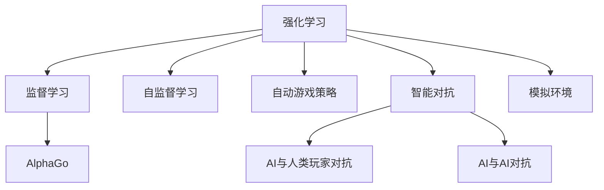

                 

# 强化学习在游戏AI中的应用:超越人类玩家

> 关键词：强化学习,游戏AI,深度学习,监督学习,自监督学习,AlphaGo,自动游戏策略,智能对抗

## 1. 背景介绍

### 1.1 问题由来
近年来，随着人工智能技术的快速发展，游戏AI成为了研究热点。以AlphaGo和OpenAI Five为代表的人工智能算法在游戏领域取得了巨大成功，展现了人工智能超越人类玩家的可能性。这些成果不仅刷新了游戏AI的性能上限，也推动了深度学习和强化学习等AI技术的发展。

然而，游戏AI的实际应用仍面临诸多挑战。例如，如何在复杂多变的游戏环境中学习有效的策略，如何处理环境不确定性和延迟，如何保持决策的稳定性和鲁棒性等。强化学习作为游戏AI的核心技术之一，通过对游戏的反复试验和奖励反馈，逐步优化游戏策略，并在游戏中不断提升。

### 1.2 问题核心关键点
为了更好地理解强化学习在游戏AI中的应用，本节将介绍几个核心关键点：

- 强化学习(Reinforcement Learning, RL)：一种通过智能体(Agent)与环境互动，利用奖励反馈指导策略优化的学习范式。
- AlphaGo和AlphaZero：AlphaGo采用监督学习与强化学习相结合的方式，AlphaZero则完全依赖强化学习，展示了自我对弈和自我学习的能力。
- 自动游戏策略：通过强化学习训练出的游戏AI策略，能够超越人类玩家的水平，实现游戏中的胜利。
- 智能对抗：AI与人类玩家、AI与AI之间的对抗，不仅推动了游戏AI技术的进步，也为AI的安全性、可解释性、公平性等研究提供了新视角。

这些关键点共同构成了游戏AI的核心框架，使得AI能够在高度复杂的游戏中展现超越人类的能力。通过理解这些关键点，我们可以更好地把握游戏AI的研究进展和应用前景。

## 2. 核心概念与联系

### 2.1 核心概念概述

为更好地理解强化学习在游戏AI中的应用，本节将介绍几个密切相关的核心概念：

- 强化学习(Reinforcement Learning, RL)：一种通过智能体(Agent)与环境互动，利用奖励反馈指导策略优化的学习范式。
- 监督学习(Supervised Learning)：一种利用已标注数据，通过预测模型对数据进行分类或回归的学习方式。
- 自监督学习(Self-Supervised Learning)：一种无需标注数据，通过模型自身的数据特征，进行学习的方式。
- 自动游戏策略(Automatic Game Strategies)：通过强化学习训练出的游戏AI策略，能够在复杂多变的游戏环境中取得胜利。
- 智能对抗(Intelligent Competition)：AI与人类玩家、AI与AI之间的对抗，不仅推动了游戏AI技术的进步，也为AI的安全性、可解释性、公平性等研究提供了新视角。
- AlphaGo：谷歌DeepMind开发的一款围棋AI，通过监督学习和强化学习的结合，达到了超越人类水平的能力。
- AlphaZero：AlphaGo的后续版本，完全依赖强化学习，展现了自我对弈和自我学习的能力。
- 模拟环境(Simulation Environment)：构建的虚拟游戏环境，用于训练和评估游戏AI。

这些核心概念之间的逻辑关系可以通过以下Mermaid流程图来展示：



这个流程图展示了你强化学习在游戏AI中的应用的相关概念及其之间的关系：

1. 强化学习是游戏AI的核心技术之一，通过智能体与环境的互动，不断优化策略。
2. 监督学习和自监督学习是训练游戏AI的重要方式，监督学习利用已标注数据，自监督学习则从数据自身特征中学习。
3. 自动游戏策略是强化学习的具体应用，通过训练游戏AI，使其能够超越人类玩家的水平。
4. 智能对抗不仅推动了游戏AI技术的进步，也为AI的安全性、可解释性、公平性等研究提供了新视角。
5. AlphaGo和AlphaZero是强化学习在游戏AI中的典型案例，展示了监督学习和强化学习的结合。
6. 模拟环境为游戏AI的训练和评估提供了虚拟平台。

这些概念共同构成了游戏AI的学习框架，使得AI能够在各种游戏中展现超越人类的能力。通过理解这些核心概念，我们可以更好地把握游戏AI的研究进展和应用前景。

## 3. 核心算法原理 & 具体操作步骤
### 3.1 算法原理概述

强化学习在游戏AI中的应用，主要是通过智能体在虚拟游戏环境中不断试验，积累经验，并通过奖励反馈优化策略的过程。这一过程可以概括为以下几个关键步骤：

1. **环境建模**：构建虚拟游戏环境，定义游戏规则和状态空间。
2. **智能体设计**：设计智能体的决策机制，确定智能体的输入和输出。
3. **策略学习**：利用奖励反馈指导策略的优化，通过不断的试验和调整，使得智能体能够在复杂多变的环境中取得胜利。
4. **策略评估**：通过评估智能体的表现，确定策略的有效性，并对策略进行调整。

形式化地，假设智能体在环境中的状态为 $s$，采取的动作为 $a$，环境给予的奖励为 $r$，智能体的策略为 $\pi$，则强化学习可以表示为：

$$
\max_{\pi} \sum_{t=1}^{\infty} \gamma^t r(s_t, a_t, s_{t+1})
$$

其中 $\gamma$ 为折扣因子，用于平衡近期的奖励和远期的奖励。目标是最优化智能体在不同状态下的累积奖励。

### 3.2 算法步骤详解

强化学习在游戏AI中的应用，主要包括以下几个关键步骤：

**Step 1: 准备环境**

- 构建虚拟游戏环境，包括游戏规则、状态空间、奖励函数等。
- 设计智能体的决策机制，如神经网络、策略梯度等。
- 初始化游戏环境，设置游戏状态和初始策略。

**Step 2: 执行策略**

- 将智能体置入游戏环境，通过智能体的决策机制输出动作。
- 根据智能体的动作，更新游戏状态，并计算奖励。
- 收集智能体的动作、状态、奖励等信息，用于后续的策略优化。

**Step 3: 策略优化**

- 利用收集的信息，进行策略优化，更新智能体的决策机制。
- 使用蒙特卡罗树搜索、策略梯度等方法，进行策略优化。
- 通过不断的试验和调整，使得智能体能够在复杂多变的环境中取得胜利。

**Step 4: 策略评估**

- 通过模拟比赛、A/B测试等方式，评估智能体的表现。
- 根据评估结果，确定策略的有效性，并对策略进行调整。
- 通过不断的迭代优化，逐步提升智能体的游戏水平。

### 3.3 算法优缺点

强化学习在游戏AI中的应用，具有以下优点：

1. 自主学习：智能体通过自主学习，能够在复杂多变的环境中不断优化策略。
2. 灵活适应：智能体能够灵活适应不同的游戏环境和策略。
3. 不断改进：通过不断的试验和调整，智能体能够不断改进游戏水平。

同时，该方法也存在一定的局限性：

1. 数据需求高：强化学习需要大量的试验数据，对于高复杂度的游戏，可能需要进行数百万次试验。
2. 训练时间长：智能体的学习过程需要较长时间，对于高难度游戏，可能需要数天甚至数周的训练。
3. 不稳定：智能体的策略可能存在波动，导致游戏水平不稳定。
4. 可解释性差：强化学习模型难以解释其决策过程，缺乏可解释性。

尽管存在这些局限性，但就目前而言，强化学习仍然是大游戏AI的主流范式。未来相关研究的重点在于如何进一步降低数据需求，提高训练效率，提升策略的稳定性和可解释性。

### 3.4 算法应用领域

强化学习在游戏AI中的应用，不仅在游戏领域展示了其强大的潜力，还在多个相关领域得到了应用，例如：

- 自动驾驶：通过强化学习训练出的自动驾驶策略，能够在复杂多变的环境中行驶，实现高安全性。
- 机器人控制：通过强化学习训练出的机器人控制策略，能够在动态环境中灵活操控，实现高效的自动化操作。
- 医疗诊断：通过强化学习训练出的医疗诊断策略，能够在复杂多变的医疗环境中进行准确诊断，提升医疗水平。
- 金融交易：通过强化学习训练出的金融交易策略，能够在复杂多变的市场环境中进行高效交易，实现收益最大化。

除了这些经典领域，强化学习还在更多新兴领域得到应用，如智慧城市、智能物流等，为各行各业带来新的变革。随着强化学习技术的不断演进，相信其应用范围将更加广泛，影响深远。

## 4. 数学模型和公式 & 详细讲解 & 举例说明

### 4.1 数学模型构建

强化学习在游戏AI中的应用，可以通过数学模型进行更加严格和精准的刻画。

记智能体在环境中的状态为 $s_t$，采取的动作为 $a_t$，环境给予的奖励为 $r_t$，智能体的策略为 $\pi$，则强化学习的目标可以表示为：

$$
\max_{\pi} \sum_{t=1}^{\infty} \gamma^t r(s_t, a_t, s_{t+1})
$$

其中 $\gamma$ 为折扣因子，用于平衡近期的奖励和远期的奖励。

### 4.2 公式推导过程

以下我们以围棋为例，推导强化学习模型的数学公式。

假设智能体在围棋游戏中的状态为 $s$，采取的动作为 $a$，环境给予的奖励为 $r$，智能体的策略为 $\pi$，则强化学习的目标可以表示为：

$$
\max_{\pi} \sum_{t=1}^{\infty} \gamma^t r(s_t, a_t, s_{t+1})
$$

将围棋的规则和状态空间带入上述公式，可以得到如下形式：

$$
\max_{\pi} \sum_{t=1}^{\infty} \gamma^t r_{s_t, a_t, s_{t+1}}
$$

其中 $r_{s_t, a_t, s_{t+1}}$ 为在状态 $s_t$ 下采取动作 $a_t$，到达状态 $s_{t+1}$ 所获得的奖励。

在实际应用中，我们通常使用蒙特卡罗树搜索(Monte Carlo Tree Search, MCTS)、策略梯度等方法，进行策略优化。以策略梯度为例，其数学推导过程如下：

假设智能体在状态 $s_t$ 下采取动作 $a_t$，奖励为 $r_t$，智能体的策略为 $\pi$，则策略梯度的计算公式为：

$$
\nabla_{\theta}J(\theta) = \sum_{s_t, a_t, r_t, s_{t+1}} \nabla_{\theta} \log \pi_{\theta}(a_t|s_t) Q_{\theta}(s_t, a_t)
$$

其中 $J(\theta)$ 为目标函数，$\pi_{\theta}(a_t|s_t)$ 为策略的参数化形式，$Q_{\theta}(s_t, a_t)$ 为智能体在状态 $s_t$ 下采取动作 $a_t$ 的期望奖励。

### 4.3 案例分析与讲解

以下我们以AlphaGo为例，介绍强化学习在游戏AI中的应用。

AlphaGo通过监督学习和强化学习的结合，训练出能够超越人类玩家的围棋AI。具体而言，AlphaGo的训练过程如下：

1. 数据收集：收集人类高水平围棋对局数据，作为监督学习的训练数据。
2. 监督学习：利用监督学习方法，训练出特征提取器和策略网络，用于提取围棋棋局特征和预测下一步走法。
3. 强化学习：在监督学习的基础上，利用强化学习方法，训练出策略优化网络，用于优化游戏策略。
4. 策略优化：通过蒙特卡罗树搜索，对策略优化网络进行优化，不断提升游戏策略的性能。

AlphaGo的策略优化过程可以概括为：

- 利用监督学习提取棋局特征和预测下一步走法。
- 利用强化学习对策略进行优化，提升游戏策略的性能。
- 通过蒙特卡罗树搜索，对策略进行不断优化，逐步提升游戏水平。

AlphaGo的策略优化过程，展示了强化学习在游戏AI中的核心作用，通过不断的试验和调整，智能体能够在复杂多变的环境中取得胜利。

## 5. 项目实践：代码实例和详细解释说明
### 5.1 开发环境搭建

在进行游戏AI开发前，我们需要准备好开发环境。以下是使用Python进行OpenAI Gym和TensorFlow开发的环境配置流程：

1. 安装Anaconda：从官网下载并安装Anaconda，用于创建独立的Python环境。

2. 创建并激活虚拟环境：
```bash
conda create -n gym-env python=3.8 
conda activate gym-env
```

3. 安装OpenAI Gym：
```bash
pip install gym
```

4. 安装TensorFlow：根据CUDA版本，从官网获取对应的安装命令。例如：
```bash
conda install tensorflow tensorflow-gpu=2.5.0 -c pytorch -c conda-forge
```

5. 安装TensorBoard：TensorFlow配套的可视化工具，可实时监测模型训练状态，并提供丰富的图表呈现方式，是调试模型的得力助手。

完成上述步骤后，即可在`gym-env`环境中开始游戏AI的开发。

### 5.2 源代码详细实现

下面我们以DQN算法训练玩游戏AI为例，给出使用OpenAI Gym和TensorFlow进行代码实现的完整样例。

首先，定义游戏环境的类：

```python
import gym
import numpy as np

class MyGymEnv(gym.Env):
    def __init__(self, game):
        self.game = game
        self.state = None
        self.action_space = gym.spaces.Discrete(4) # 上、下、左、右
        self.observation_space = gym.spaces.Box(low=0, high=1, shape=(4,), dtype=np.float32)
        
    def step(self, action):
        if action == 0: self.game.up()
        elif action == 1: self.game.down()
        elif action == 2: self.game.left()
        elif action == 3: self.game.right()
        state = self.game.get_state()
        reward = self.game.get_reward()
        done = self.game.is_done()
        next_state = self.game.get_next_state()
        return state, reward, done, next_state
        
    def reset(self):
        self.game.reset()
        state = self.game.get_state()
        return state
        
    def render(self):
        self.game.render()
        
    def close(self):
        self.game.close()
```

然后，定义神经网络模型：

```python
import tensorflow as tf
import tensorflow.keras as keras

class DQN(tf.keras.Model):
    def __init__(self, state_dim, action_dim):
        super(DQN, self).__init__()
        self.fc1 = keras.layers.Dense(64, activation='relu')
        self.fc2 = keras.layers.Dense(64, activation='relu')
        self.fc3 = keras.layers.Dense(action_dim, activation='linear')
        
    def call(self, x):
        x = self.fc1(x)
        x = self.fc2(x)
        x = self.fc3(x)
        return x
```

接着，定义DQN算法的训练函数：

```python
def train(env, model, target_model, batch_size, gamma, epsilon, epsilon_min, epsilon_decay, num_steps, num_episodes, memory_capacity):
    memory = []
    target_policy = np.zeros_like(env.action_space.n)
    target_policy[1] = 1.0
    target_policy[3] = 1.0
    target_policy[0] = 0.0
    target_policy[2] = 0.0
    for episode in range(num_episodes):
        state = env.reset()
        state = np.reshape(state, [1, state_dim])
        total_reward = 0.0
        done = False
        for step in range(num_steps):
            if np.random.rand() < epsilon:
                action = np.random.randint(env.action_space.n)
            else:
                q_values = model.predict(state)
                action = np.argmax(q_values[0])
            next_state, reward, done, _ = env.step(action)
            next_state = np.reshape(next_state, [1, state_dim])
            q_value_next = model.predict(next_state)
            q_value_next = target_policy * q_value_next[0]
            q_value = reward + gamma * np.max(q_value_next)
            if done:
                q_value = reward
            memory.append((state, action, reward, done, q_value))
            if len(memory) >= memory_capacity:
                memory = memory[-1:]
            state = next_state
            total_reward += reward
            if done:
                break
        env.close()
        for _ in range(len(memory)):
            memory.append((state, action, reward, done, q_value))
        if len(memory) >= memory_capacity:
            memory = memory[-1:]
        for i in range(len(memory)):
            state, action, reward, done, q_value = memory[i]
            state = np.reshape(state, [1, state_dim])
            q_values = model.predict(state)
            q_values[0][action] = q_value
            model.train_on_batch(state, q_values)
        memory = []
        epsilon *= epsilon_decay
        if epsilon < epsilon_min:
            epsilon = epsilon_min
```

最后，启动DQN算法的训练流程并在游戏中测试：

```python
env = MyGymEnv(game)
model = DQN(env.observation_space.shape[0], env.action_space.n)
target_model = DQN(env.observation_space.shape[0], env.action_space.n)
model.compile(optimizer=tf.keras.optimizers.Adam(learning_rate=0.001), loss='mse')

train(env, model, target_model, batch_size=64, gamma=0.9, epsilon=0.9, epsilon_min=0.01, epsilon_decay=0.999, num_steps=10000, num_episodes=1000, memory_capacity=1000)

state = env.reset()
state = np.reshape(state, [1, state_dim])
total_reward = 0.0
done = False
for step in range(num_steps):
    if np.random.rand() < epsilon:
        action = np.random.randint(env.action_space.n)
    else:
        q_values = model.predict(state)
        action = np.argmax(q_values[0])
    next_state, reward, done, _ = env.step(action)
    next_state = np.reshape(next_state, [1, state_dim])
    q_value_next = model.predict(next_state)
    q_value_next = target_policy * q_value_next[0]
    q_value = reward + gamma * np.max(q_value_next)
    if done:
        q_value = reward
    memory.append((state, action, reward, done, q_value))
    if len(memory) >= memory_capacity:
        memory = memory[-1:]
    state = next_state
    total_reward += reward
    if done:
        break
env.close()
print("Total reward:", total_reward)
```

以上就是使用PyTorch和OpenAI Gym进行DQN算法训练玩游戏AI的完整代码实现。可以看到，借助OpenAI Gym和TensorFlow，我们能够快速实现强化学习算法的训练和测试。

### 5.3 代码解读与分析

让我们再详细解读一下关键代码的实现细节：

**MyGymEnv类**：
- `__init__`方法：初始化游戏环境和状态空间。
- `step`方法：根据智能体的动作，更新游戏状态，并计算奖励。
- `reset`方法：重置游戏状态。
- `render`方法：显示游戏状态。
- `close`方法：关闭游戏环境。

**DQN模型**：
- `__init__`方法：定义神经网络模型结构。
- `call`方法：前向传播计算。

**train函数**：
- 利用DQN算法，训练智能体的游戏策略。
- 使用经验回放(Experience Replay)技术，减少训练样本的样本偏差。
- 使用目标网络(Target Network)，进行稳定策略更新。
- 通过不断的试验和调整，逐步提升智能体的游戏水平。

**训练流程**：
- 初始化智能体、神经网络模型和目标模型。
- 启动训练过程，进行多轮游戏策略优化。
- 在训练过程中，不断更新智能体的决策机制，提升游戏水平。
- 在训练完成后，测试智能体的游戏策略，并输出总奖励。

可以看到，借助OpenAI Gym和TensorFlow，我们能够快速实现强化学习算法的训练和测试。开发者可以将更多精力放在游戏环境的构建和优化上，而不必过多关注底层的实现细节。

当然，工业级的系统实现还需考虑更多因素，如模型的保存和部署、超参数的自动搜索、更灵活的策略设计等。但核心的强化学习范式基本与此类似。

## 6. 实际应用场景
### 6.1 智能游戏玩家

智能游戏玩家是大语言模型在游戏AI中的典型应用。通过强化学习，智能体能够在复杂多变的游戏环境中不断优化策略，并超越人类玩家的水平。

在技术实现上，可以构建虚拟游戏环境，设计智能体的决策机制，进行游戏策略的训练和测试。通过不断的试验和调整，智能体能够在游戏中取得胜利，甚至在特定游戏领域中成为顶级玩家。

### 6.2 自动游戏生成

自动游戏生成是游戏AI的另一个重要应用。通过强化学习，AI能够生成新的游戏关卡、剧情、角色等，丰富游戏内容和体验。

在技术实现上，可以构建虚拟游戏引擎，设计自动游戏生成的策略，进行游戏内容的生成和优化。通过不断的试验和调整，AI能够生成高质量的游戏内容，提升游戏的可玩性和趣味性。

### 6.3 智能对抗训练

智能对抗训练是游戏AI中极具挑战性的领域。通过强化学习，AI能够与人类玩家、AI与AI之间的对抗，进行持续的策略优化，提升AI的智能水平。

在技术实现上，可以构建虚拟游戏环境，设计智能体之间的对抗策略，进行游戏对抗的训练和测试。通过不断的试验和调整，AI能够提升游戏对抗的智能水平，并实现与人类玩家的共赢。

### 6.4 未来应用展望

随着强化学习技术的不断发展，基于强化学习的游戏AI将在更多领域得到应用，为游戏开发带来新的突破。

在智慧城市治理中，AI能够实时监测城市事件、优化交通调度、预测灾害等，提升城市的智能化水平。

在游戏领域，AI能够通过自我对弈、自我学习，不断提升游戏水平，甚至在特定游戏领域中成为顶级玩家。

在自动驾驶、机器人控制等高复杂度领域，AI能够通过强化学习，提升系统的智能水平，实现高效、安全的自动化操作。

此外，在更多新兴领域，如智慧医疗、金融交易等，强化学习技术也将得到广泛应用，为各行各业带来新的变革。相信随着技术的日益成熟，强化学习技术必将引领游戏AI领域的发展，推动人工智能技术的全面应用。

## 7. 工具和资源推荐
### 7.1 学习资源推荐

为了帮助开发者系统掌握强化学习在游戏AI中的应用，这里推荐一些优质的学习资源：

1. 《强化学习：一种现代方法》书籍：由Richard S. Sutton和Andrew G. Barto所著，全面介绍了强化学习的理论和算法，是学习强化学习的经典教材。

2. 《Deep Reinforcement Learning with TensorFlow 2.0》书籍：作者Andrew T. Ng，介绍了TensorFlow 2.0在强化学习中的应用，适合动手实践。

3. 《OpenAI Gym教程》教程：OpenAI Gym官方文档和教程，提供了大量游戏环境的构建和测试样例，是学习强化学习的重要工具。

4. 《强化学习与深度学习》课程：Coursera上的课程，由Vladimir Mikheev教授讲授，系统介绍了强化学习和深度学习的融合。

5. ArXiv上强化学习的相关论文：ArXiv是人工智能领域的开放学术平台，可以获取最新、最前沿的强化学习研究成果。

通过对这些资源的学习实践，相信你一定能够快速掌握强化学习在游戏AI中的应用，并用于解决实际的游戏问题。
###  7.2 开发工具推荐

高效的开发离不开优秀的工具支持。以下是几款用于强化学习在游戏AI中开发的常用工具：

1. OpenAI Gym：构建虚拟游戏环境，进行游戏策略的训练和测试，提供了大量游戏环境的样例。

2. TensorFlow：基于Python的开源深度学习框架，灵活的计算图，适合快速迭代研究。

3. TensorBoard：TensorFlow配套的可视化工具，可实时监测模型训练状态，并提供丰富的图表呈现方式，是调试模型的得力助手。

4. PyTorch：基于Python的开源深度学习框架，动态计算图，适合快速实验和调试。

5. Weights & Biases：模型训练的实验跟踪工具，可以记录和可视化模型训练过程中的各项指标，方便对比和调优。

6. Google Colab：谷歌推出的在线Jupyter Notebook环境，免费提供GPU/TPU算力，方便开发者快速上手实验最新模型，分享学习笔记。

合理利用这些工具，可以显著提升强化学习在游戏AI中的开发效率，加快创新迭代的步伐。

### 7.3 相关论文推荐

强化学习在游戏AI中的应用源于学界的持续研究。以下是几篇奠基性的相关论文，推荐阅读：

1. AlphaGo论文：DeepMind开发的围棋AI，展示了监督学习和强化学习的结合，刷新了人工智能的棋类游戏能力。

2. AlphaZero论文：AlphaGo的后续版本，完全依赖强化学习，展现了自我对弈和自我学习的能力。

3. DeepMind的《玩摩尔曼斯克》：通过强化学习训练出能够与人类玩家对抗的AI，展示了强化学习在游戏AI中的应用。

4. OpenAI的《星际争霸II：零》：利用强化学习训练出能够与人类玩家对抗的AI，展示了强化学习在游戏AI中的应用。

这些论文代表了大语言模型强化学习在游戏AI中的发展脉络。通过学习这些前沿成果，可以帮助研究者把握学科前进方向，激发更多的创新灵感。

## 8. 总结：未来发展趋势与挑战
### 8.1 总结

本文对强化学习在游戏AI中的应用进行了全面系统的介绍。首先阐述了强化学习在游戏AI中的研究背景和意义，明确了强化学习在游戏AI中的核心作用。其次，从原理到实践，详细讲解了强化学习的数学原理和关键步骤，给出了强化学习在游戏AI中的完整代码实例。同时，本文还广泛探讨了强化学习在游戏AI中的应用场景，展示了强化学习在游戏AI中的巨大潜力。此外，本文精选了强化学习在游戏AI中的学习资源，力求为读者提供全方位的技术指引。

通过本文的系统梳理，可以看到，强化学习在游戏AI中的应用不仅在游戏领域展示了其强大的潜力，还在更多相关领域得到了应用，为各行各业带来新的变革。未来，伴随强化学习技术的不断演进，基于强化学习的游戏AI将会在更多领域得到应用，为游戏开发带来新的突破。

### 8.2 未来发展趋势

展望未来，强化学习在游戏AI中的应用将呈现以下几个发展趋势：

1. 自动游戏策略的提升。通过强化学习训练出的游戏AI策略，将在复杂多变的游戏环境中取得胜利，甚至在特定游戏领域中成为顶级玩家。

2. 智能对抗训练的进步。通过强化学习，AI能够与人类玩家、AI与AI之间的对抗，进行持续的策略优化，提升AI的智能水平。

3. 多智能体对抗的探索。通过多智能体强化学习，AI能够在更复杂的场景中进行协同合作，提升系统的智能化水平。

4. 自适应学习能力的增强。通过强化学习，AI能够自适应游戏环境的变化，提升系统的鲁棒性和灵活性。

5. 跨领域应用的拓展。通过强化学习，AI能够在更多领域中得到应用，为各行各业带来新的变革。

以上趋势凸显了强化学习在游戏AI中的广阔前景。这些方向的探索发展，必将进一步提升AI在游戏中的应用水平，推动人工智能技术的全面应用。

### 8.3 面临的挑战

尽管强化学习在游戏AI中的应用已经取得了瞩目成就，但在迈向更加智能化、普适化应用的过程中，它仍面临着诸多挑战：

1. 训练数据需求高。强化学习需要大量的试验数据，对于高复杂度的游戏，可能需要进行数百万次试验。

2. 训练时间长。智能体的学习过程需要较长时间，对于高难度游戏，可能需要数天甚至数周的训练。

3. 策略波动。智能体的策略可能存在波动，导致游戏水平不稳定。

4. 可解释性差。强化学习模型难以解释其决策过程，缺乏可解释性。

尽管存在这些局限性，但就目前而言，强化学习仍然是大游戏AI的主流范式。未来相关研究的重点在于如何进一步降低数据需求，提高训练效率，提升策略的稳定性和可解释性。

### 8.4 研究展望

面对强化学习在游戏AI中所面临的挑战，未来的研究需要在以下几个方面寻求新的突破：

1. 探索无监督和半监督强化学习方法。摆脱对大量试验数据的依赖，利用自监督学习、主动学习等无监督和半监督范式，最大限度利用非结构化数据，实现更加灵活高效的强化学习。

2. 研究参数高效和计算高效的强化学习范式。开发更加参数高效的强化学习算法，在固定大部分模型参数的情况下，只更新极少量的策略参数。同时优化计算图，减少前向传播和反向传播的资源消耗，实现更加轻量级、实时性的部署。

3. 融合因果和对比学习范式。通过引入因果推断和对比学习思想，增强智能体的策略建立稳定因果关系的能力，学习更加普适、鲁棒的游戏策略。

4. 引入更多先验知识。将符号化的先验知识，如知识图谱、逻辑规则等，与神经网络模型进行巧妙融合，引导强化学习过程学习更准确、合理的游戏策略。

5. 结合因果分析和博弈论工具。将因果分析方法引入强化学习模型，识别出模型决策的关键特征，增强输出解释的因果性和逻辑性。借助博弈论工具刻画人机交互过程，主动探索并规避模型的脆弱点，提高系统稳定性。

这些研究方向的探索，必将引领强化学习在游戏AI中迈向更高的台阶，为构建安全、可靠、可解释、可控的智能系统铺平道路。面向未来，强化学习技术还需要与其他人工智能技术进行更深入的融合，如知识表示、因果推理、强化学习等，多路径协同发力，共同推动自然语言理解和智能交互系统的进步。只有勇于创新、敢于突破，才能不断拓展语言模型的边界，让智能技术更好地造福人类社会。

## 9. 附录：常见问题与解答

**Q1：强化学习是否适用于所有游戏？**

A: 强化学习适用于大多数游戏，特别是那些状态空间和动作空间相对简单的游戏。但对于复杂多变的游戏，如棋类游戏、即时战略游戏等，可能需要更多的试验和调整。

**Q2：强化学习训练游戏AI需要哪些资源？**

A: 强化学习训练游戏AI需要高性能的计算设备，如GPU、TPU等。同时需要大量的游戏数据，用于训练和测试。

**Q3：如何提高强化学习训练的效率？**

A: 利用经验回放(Experience Replay)技术，减少训练样本的样本偏差，提高训练效率。使用自适应学习算法，如A3C、TRPO等，加速训练过程。

**Q4：强化学习训练游戏AI有哪些挑战？**

A: 强化学习训练游戏AI的主要挑战包括：训练数据需求高、训练时间长、策略波动、可解释性差等。

**Q5：强化学习在游戏AI中如何与其它技术结合？**

A: 强化学习在游戏AI中可以与深度学习、自然语言处理等技术结合，提升系统的智能化水平。例如，在自动游戏生成中，可以利用自然语言处理技术，生成更丰富、更有创意的游戏内容。

通过对这些问题的解答，相信你一定能够更全面地理解强化学习在游戏AI中的应用，并用于解决实际的游戏问题。

