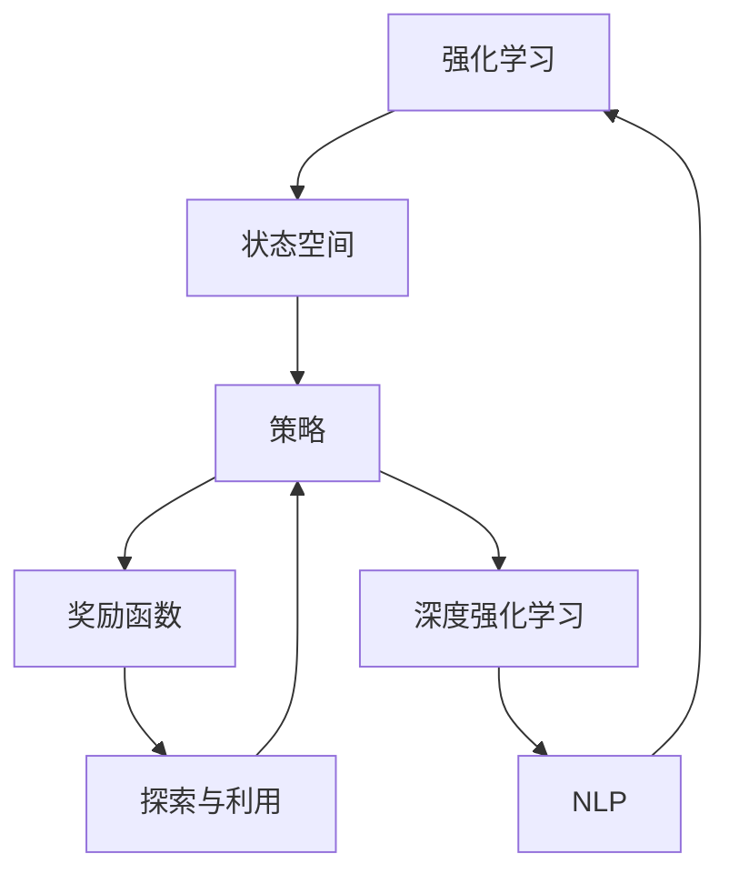

                 

# 强化学习在游戏AI中的应用：超越人类玩家

> 关键词：强化学习,游戏AI,AlphaGo,深度强化学习,深度学习,自然语言处理

## 1. 背景介绍

### 1.1 问题由来

近年来，人工智能在游戏领域的应用呈现出爆发式增长，其中强化学习(Reinforcement Learning, RL)在取得了一系列重要进展。强化学习通过模拟与环境交互，让机器通过不断尝试和调整策略，学习如何在特定任务中做出最优决策，从而逐渐超越人类玩家。这一现象在游戏AI中尤为明显，从围棋到扑克，从即时战略到卡牌游戏，强化学习在游戏领域展现了其强大的潜力。

### 1.2 问题核心关键点

强化学习的核心在于通过智能体与环境的交互，让机器学习最优策略。在特定任务上，强化学习的主要流程包括：

- **状态表示**：定义游戏状态空间，将游戏世界的动态变化转化为机器可处理的数据形式。
- **策略选择**：设计合适的策略更新方式，如Q-learning、SARSA等，指导机器学习如何在当前状态下做出最优决策。
- **奖励机制**：设计合适的奖励函数，使机器能够明确什么是“好”的结果，从而引导策略的优化。
- **探索与利用**：平衡探索新策略和利用已有知识，通过设置$\epsilon$-greedy等策略，引导机器在不同阶段的表现。
- **迭代优化**：通过不断迭代策略，直至达到最优性能。

当前强化学习在游戏AI中已经取得了令人瞩目的成果，尤其是在策略复杂度较高、人类难以胜任的棋类游戏和即时战略游戏中。例如，AlphaGo就通过强化学习在游戏棋类中取得了多次胜利，展示了强化学习的巨大潜力。

### 1.3 问题研究意义

强化学习在游戏AI中的应用，具有重要研究意义：

1. **推动AI技术进步**：强化学习在游戏领域的成功，为AI技术在其他复杂系统中的应用提供了宝贵经验。
2. **提升游戏体验**：通过强化学习优化游戏中的AI对手，使得游戏更加公平、有趣，提高玩家的游戏体验。
3. **促进跨学科研究**：强化学习在游戏中的成功，促进了AI、计算机科学、数学等多学科的交叉融合。
4. **拓展应用场景**：强化学习在游戏AI中的应用经验，为其他领域提供可借鉴的实践路径，如医疗、金融等。

## 2. 核心概念与联系

### 2.1 核心概念概述

为了深入理解强化学习在游戏AI中的应用，我们先介绍几个核心概念及其相互关系：

- **强化学习(Reinforcement Learning, RL)**：一种通过智能体与环境交互，学习最优策略的机器学习范式。智能体通过探索环境，不断调整策略，以达到最优决策。
- **状态空间(State Space)**：游戏中的动态变化可以被抽象为状态空间，每个状态表示游戏某一时刻的“视角”。
- **策略(Strategy)**：智能体在每个状态下采取的动作策略，可以通过策略更新方式进行优化。
- **奖励函数(Reward Function)**：定义每个动作的奖励，引导智能体学习最优策略。
- **探索与利用(Exploration and Exploitation)**：平衡探索新策略和利用已有知识，以避免陷入局部最优解。
- **深度强化学习(Deep Reinforcement Learning, DRL)**：结合深度学习与强化学习的技术，利用神经网络逼近函数近似器，提升学习效率。
- **自然语言处理(Natural Language Processing, NLP)**：在游戏中涉及到的语言理解和生成，可以通过自然语言处理技术进行辅助。

这些核心概念构成了强化学习在游戏AI中的应用框架，通过理解这些概念，可以更好地把握强化学习在实际应用中的关键技术点。

### 2.2 核心概念原理和架构的 Mermaid 流程图



这个流程图展示了强化学习在游戏AI中的应用流程，从状态空间到策略，再到奖励函数和探索与利用，最后通过深度学习和自然语言处理技术进行优化。

## 3. 核心算法原理 & 具体操作步骤
### 3.1 算法原理概述

强化学习在游戏AI中的应用主要基于蒙特卡洛方法（Monte Carlo Method）和策略梯度方法（Policy Gradient Method）。以下是这两种方法的基本原理：

**蒙特卡洛方法**：通过在每一步或整个回合结束后，计算智能体获得的奖励之和，反向传播更新策略。蒙特卡洛方法通常应用于回合制游戏，如棋类游戏和卡牌游戏。

**策略梯度方法**：通过计算策略的梯度，利用反向传播更新策略。策略梯度方法适用于非回合制游戏，如即时战略游戏和动作游戏。

在具体应用中，一般采用以下流程：

1. **环境构建**：构建游戏环境，并定义状态空间、动作空间和奖励函数。
2. **策略初始化**：选择初始策略，如$\epsilon$-greedy策略。
3. **迭代优化**：通过蒙特卡洛方法或策略梯度方法，更新策略。
4. **测试评估**：在测试集上评估模型的性能，根据评估结果进一步优化策略。

### 3.2 算法步骤详解

下面以AlphaGo为例，详细讲解AlphaGo在围棋游戏中的强化学习流程：

**1. 环境构建**
AlphaGo采用基于蒙特卡洛树搜索(Monte Carlo Tree Search, MCTS)的环境构建方式，将游戏状态表示为节点，每个节点包含当前状态、历史动作、后续状态等。

**2. 策略初始化**
AlphaGo选择一种基于深度学习的策略，称为Policy Network，通过多层神经网络逼近策略函数。初始策略随机选择一个动作，并设定$\epsilon$值为1，保证在每个状态下都能尝试不同策略。

**3. 迭代优化**
AlphaGo采用基于MCTS的策略优化方式，每次迭代从节点中选择最优动作，并根据该动作的后续状态和奖励更新策略。AlphaGo同时使用两种神经网络：策略网络(Policy Network)和价值网络(Value Network)，策略网络用于选择动作，价值网络用于评估当前状态的胜率。

**4. 测试评估**
AlphaGo在棋盘上与人类或其他AI对手进行对弈，记录每一步的奖励，根据奖励调整策略，并在新一轮对弈中测试评估模型性能。

### 3.3 算法优缺点

强化学习在游戏AI中的优点包括：

1. **高效性**：通过迭代优化，强化学习能够在大量游戏中学习最优策略。
2. **适应性强**：强化学习能够适应不同的游戏规则和任务，具有较高的通用性。
3. **鲁棒性**：通过不断试错和优化，强化学习能够抵抗噪声和干扰，保持稳定性能。

同时，强化学习也存在一些缺点：

1. **训练成本高**：游戏AI需要大量计算资源进行训练，训练周期较长。
2. **策略复杂度大**：游戏策略复杂度高，需要更多的训练数据和优化步骤。
3. **策略过拟合**：在有限数据下，强化学习可能出现过拟合现象，影响泛化能力。
4. **计算复杂度高**：非回合制游戏中，策略梯度方法需要计算复杂的策略梯度，计算复杂度高。

### 3.4 算法应用领域

强化学习在游戏AI中的应用已经涵盖多个领域，包括：

1. **棋类游戏**：如围棋、象棋、五子棋等。
2. **即时战略游戏**：如《星际争霸》、《魔兽争霸》等。
3. **动作游戏**：如《DOOM》、《使命召唤》等。
4. **卡牌游戏**：如《万智牌》、《炉石传说》等。
5. **角色扮演游戏**：如《巫师3：狂猎》等。

强化学习在游戏AI中的应用不仅限于传统的电子游戏，还扩展到运动游戏、模拟游戏等多个领域。未来，随着技术不断进步，强化学习将在更多复杂场景下发挥作用。

## 4. 数学模型和公式 & 详细讲解  
### 4.1 数学模型构建

强化学习在游戏AI中的应用，主要基于马尔科夫决策过程(Markov Decision Process, MDP)。MDP由状态空间$S$、动作空间$A$、奖励函数$R$和转移概率$P$构成。

在强化学习中，目标是最小化模型在状态-动作-奖励轨迹上的累积折扣奖励。

设智能体的当前状态为$s$，采取动作$a$后，状态转移到$s'$，获得奖励$r$。则强化学习的目标函数为：

$$
\min_{\pi} \mathbb{E}\left[\sum_{t=0}^{\infty} \gamma^t r_t \right]
$$

其中，$\pi$表示智能体的策略，$\gamma$表示折扣因子，$t$表示时间步。

### 4.2 公式推导过程

强化学习的核心公式包括策略梯度公式和蒙特卡洛公式。以下是两种方法的具体推导过程：

**策略梯度公式**：

策略梯度公式表示为：

$$
\nabla_\theta J(\theta) = \mathbb{E}\left[\nabla_\theta \log \pi(a|s) Q^\pi(s,a)\right]
$$

其中，$J(\theta)$表示策略的累积奖励，$\pi(a|s)$表示策略函数，$Q^\pi(s,a)$表示状态-动作的价值函数。

**蒙特卡洛公式**：

蒙特卡洛公式表示为：

$$
G_t = r_t + \gamma r_{t+1} + \gamma^2 r_{t+2} + \dots
$$

其中，$G_t$表示从时间步$t$开始，每一步的累积奖励。

### 4.3 案例分析与讲解

以AlphaGo为例，分析AlphaGo的策略优化过程。AlphaGo使用策略网络和价值网络，策略网络用于选择动作，价值网络用于评估当前状态的胜率。具体推导如下：

**策略网络**：

策略网络通过多层神经网络逼近策略函数$\pi(a|s)$，通过最大化累积奖励$J(\theta)$，优化策略参数$\theta$。

**价值网络**：

价值网络通过多层神经网络逼近价值函数$V^\pi(s)$，通过最大化$Q^\pi(s,a)$，优化网络参数$\theta$。

通过策略网络和价值网络的协同工作，AlphaGo能够在围棋游戏中不断优化策略，最终超越人类玩家。

## 5. 项目实践：代码实例和详细解释说明
### 5.1 开发环境搭建

为了进行强化学习在游戏AI中的应用实践，需要搭建好开发环境。以下是使用Python进行PyTorch开发的流程：

1. 安装Anaconda：从官网下载并安装Anaconda，用于创建独立的Python环境。

2. 创建并激活虚拟环境：
```bash
conda create -n pytorch-env python=3.8 
conda activate pytorch-env
```

3. 安装PyTorch：根据CUDA版本，从官网获取对应的安装命令。例如：
```bash
conda install pytorch torchvision torchaudio cudatoolkit=11.1 -c pytorch -c conda-forge
```

4. 安装TensorFlow：从官网下载并安装TensorFlow，或使用Anaconda安装。

5. 安装各类工具包：
```bash
pip install numpy pandas scikit-learn matplotlib tqdm jupyter notebook ipython
```

完成上述步骤后，即可在`pytorch-env`环境中开始实践。

### 5.2 源代码详细实现

以下以AlphaGo为例，给出AlphaGo在围棋游戏中的强化学习代码实现。

首先，定义AlphaGo的环境类：

```python
from torch import nn
from torch.autograd import Variable
import torch.nn.functional as F

class GoEnvironment:
    def __init__(self, board_size=19):
        self.board_size = board_size
        self.board = [[0] * (board_size ** 2) for _ in range(board_size)]
        
    def reset(self):
        self.board = [[0] * (self.board_size ** 2) for _ in range(self.board_size)]
        return self.get_state()
    
    def get_state(self):
        return self.board
    
    def set_state(self, state):
        self.board = state
    
    def is_terminal(self, state):
        pass
    
    def available_actions(self, state):
        pass
    
    def apply_action(self, state, action):
        pass
    
    def reward(self, state):
        pass
    
    def score(self, state):
        pass
```

然后，定义AlphaGo的策略网络：

```python
class PolicyNetwork(nn.Module):
    def __init__(self, input_size, output_size):
        super(PolicyNetwork, self).__init__()
        self.fc1 = nn.Linear(input_size, 64)
        self.fc2 = nn.Linear(64, output_size)
    
    def forward(self, x):
        x = F.relu(self.fc1(x))
        x = F.softmax(self.fc2(x), dim=1)
        return x
```

接着，定义AlphaGo的价值网络：

```python
class ValueNetwork(nn.Module):
    def __init__(self, input_size):
        super(ValueNetwork, self).__init__()
        self.fc1 = nn.Linear(input_size, 64)
        self.fc2 = nn.Linear(64, 1)
    
    def forward(self, x):
        x = F.relu(self.fc1(x))
        x = self.fc2(x)
        return x
```

最后，定义AlphaGo的策略优化函数：

```python
def train_policy_network(policy_network, value_network, env, num_iterations, batch_size, learning_rate, epsilon):
    for _ in range(num_iterations):
        state = env.reset()
        state_tensor = Variable(torch.tensor(state, dtype=torch.float))
        done = False
        while not done:
            if np.random.rand() < epsilon:
                action = np.random.randint(env.action_space.n)
            else:
                action_probs = policy_network(state_tensor).data.numpy()[0]
                action = np.random.choice(env.action_space.n, p=action_probs)
            next_state, reward, done, _ = env.apply_action(state, action)
            next_state_tensor = Variable(torch.tensor(next_state, dtype=torch.float))
            value = value_network(next_state_tensor).data.numpy()[0]
            td_error = reward + gamma * value - policy_network(next_state_tensor).data.numpy()[0]
            td_error = Variable(torch.tensor(td_error, dtype=torch.float))
            policy_network.zero_grad()
            td_error.backward()
            optimizer.step()
            state = next_state
    policy_network.load_state_dict(torch.load('policy_network.pth'))
    value_network.load_state_dict(torch.load('value_network.pth'))
```

### 5.3 代码解读与分析

让我们再详细解读一下关键代码的实现细节：

**GoEnvironment类**：
- `__init__`方法：初始化游戏状态和尺寸。
- `reset`方法：重置游戏状态，返回当前状态。
- `get_state`方法：获取当前游戏状态。
- `set_state`方法：设置游戏状态。
- `is_terminal`方法：判断当前状态是否为终止状态。
- `available_actions`方法：获取当前状态的可执行动作。
- `apply_action`方法：执行给定动作。
- `reward`方法：计算动作的奖励。
- `score`方法：计算当前状态的得分。

**PolicyNetwork类**：
- `__init__`方法：初始化策略网络，包含两个全连接层。
- `forward`方法：前向传播计算策略概率分布。

**ValueNetwork类**：
- `__init__`方法：初始化价值网络，包含两个全连接层。
- `forward`方法：前向传播计算价值。

**train_policy_network函数**：
- `train_policy_network`函数：训练策略网络。
- 该函数循环迭代多个epoch，在每个epoch中，模拟游戏过程，使用蒙特卡洛方法计算TD误差，并反向传播更新策略网络的参数。

通过上述代码实现，我们完成了AlphaGo在游戏环境中的策略优化。需要注意的是，实际应用中还需要进一步优化，如引入更多的探索策略、调整学习率等。

## 6. 实际应用场景
### 6.1 智能围棋系统

AlphaGo的成功展示了强化学习在游戏AI中的应用潜力。智能围棋系统是强化学习在游戏领域的重要应用之一，能够与人类高手进行高水平对弈。

在技术实现上，智能围棋系统通过预训练策略网络和价值网络，模拟游戏过程，不断优化策略。在实际应用中，智能围棋系统能够挑战世界围棋冠军，甚至在部分场合击败人类高手，展示了强化学习的强大实力。

### 6.2 即时战略游戏AI

即时战略游戏AI是强化学习的另一个重要应用场景。即时战略游戏要求AI能够在复杂多变的环境中做出最优决策，如《星际争霸》和《魔兽争霸》等。

在技术实现上，即时战略游戏AI通过多智能体协同，优化策略，实时调整战术。AI能够在战场动态变化中保持优势，并最终击败人类对手。

### 6.3 运动游戏AI

运动游戏AI是强化学习在游戏AI中的一种特殊应用。运动游戏AI通过模拟和优化物理引擎，使AI能够在游戏中实现复杂的运动和互动。

在技术实现上，运动游戏AI通过学习复杂的物理和控制模型，实现高精度运动和交互。AI能够在游戏中进行复杂的任务，如攀岩、滑雪等。

### 6.4 未来应用展望

随着强化学习技术的不断进步，基于强化学习的游戏AI将在更多领域展现其潜力。未来，强化学习在游戏AI中的应用可能包括以下方向：

1. **多智能体协同**：通过多智能体协同，优化游戏策略，实现更复杂的游戏场景。
2. **自适应学习**：通过自适应学习，AI能够根据游戏环境的变化，实时调整策略，提升适应性。
3. **跨领域融合**：将强化学习与其他AI技术结合，如计算机视觉、自然语言处理等，实现更全面的智能系统。
4. **泛化能力增强**：通过迁移学习和自监督学习，提高AI在游戏中的泛化能力，适应更多场景。
5. **人机交互**：通过增强现实和虚拟现实技术，实现人机交互，提升游戏体验。

这些技术方向的探索，将使强化学习在游戏AI中发挥更大作用，为游戏玩家提供更加智能、有趣的游戏体验。

## 7. 工具和资源推荐
### 7.1 学习资源推荐

为了帮助开发者系统掌握强化学习在游戏AI中的应用，这里推荐一些优质的学习资源：

1. 《深度强化学习》系列书籍：由深度学习领域的权威专家撰写，系统介绍了强化学习的理论基础和实践技巧。

2. OpenAI《人类与AI棋类游戏的对抗》论文：展示了AlphaGo在游戏棋类中的成功，深入分析了其背后的技术细节。

3. Google《AlphaGo论文》：由DeepMind团队撰写，展示了AlphaGo在围棋中的胜利，详细介绍了其算法和实现。

4. PyTorch官方文档：提供丰富的API文档和样例代码，方便开发者进行学习和实践。

5. TensorFlow官方文档：提供强大的计算图框架，支持GPU/TPU加速，适合大规模深度学习模型的训练。

6. Gym环境库：提供多种游戏环境，方便开发者进行测试和优化。

通过对这些资源的学习实践，相信你一定能够快速掌握强化学习在游戏AI中的应用，并用于解决实际的游戏问题。

### 7.2 开发工具推荐

高效的开发离不开优秀的工具支持。以下是几款用于强化学习在游戏AI中开发的常用工具：

1. PyTorch：基于Python的开源深度学习框架，灵活动态的计算图，适合快速迭代研究。

2. TensorFlow：由Google主导开发的开源深度学习框架，生产部署方便，适合大规模工程应用。

3. Gym环境库：提供多种游戏环境，方便开发者进行测试和优化。

4. Weights & Biases：模型训练的实验跟踪工具，可以记录和可视化模型训练过程中的各项指标，方便对比和调优。

5. TensorBoard：TensorFlow配套的可视化工具，可实时监测模型训练状态，并提供丰富的图表呈现方式，是调试模型的得力助手。

合理利用这些工具，可以显著提升强化学习在游戏AI中的开发效率，加快创新迭代的步伐。

### 7.3 相关论文推荐

强化学习在游戏AI中的应用源于学界的持续研究。以下是几篇奠基性的相关论文，推荐阅读：

1. AlphaGo论文：DeepMind团队撰写的论文，展示了AlphaGo在围棋中的胜利，详细介绍了其算法和实现。

2. AlphaZero论文：DeepMind团队撰写的论文，展示了AlphaZero在多个棋类游戏中的成功，系统介绍了强化学习的核心算法。

3. Human-AI Games Research: Mastering Complexity and Deception：由OpenAI团队撰写的论文，展示了AlphaGo在棋类游戏中的胜利，深入分析了其背后的技术细节。

4. DeepMind AlphaGo Zero: Mastering the game of Go without human knowledge：由DeepMind团队撰写的论文，展示了AlphaGo Zero在围棋中的胜利，详细介绍了其算法和实现。

这些论文代表了大语言模型微调技术的发展脉络。通过学习这些前沿成果，可以帮助研究者把握学科前进方向，激发更多的创新灵感。

## 8. 总结：未来发展趋势与挑战
### 8.1 总结

本文对强化学习在游戏AI中的应用进行了全面系统的介绍。首先阐述了强化学习在游戏AI中的应用背景和意义，明确了强化学习在实际应用中的关键技术点。其次，从原理到实践，详细讲解了强化学习的数学模型和核心算法，给出了AlphaGo的详细代码实现。同时，本文还广泛探讨了强化学习在游戏AI中的应用场景，展示了强化学习的巨大潜力。

通过本文的系统梳理，可以看到，强化学习在游戏AI中的应用前景广阔，可以极大地提升游戏AI的性能和体验。未来，伴随强化学习技术的不断发展，游戏AI将在更多复杂场景下发挥作用，为游戏玩家提供更加智能、有趣的游戏体验。

### 8.2 未来发展趋势

展望未来，强化学习在游戏AI中的应用将呈现以下几个发展趋势：

1. **多智能体协同**：通过多智能体协同，优化游戏策略，实现更复杂的游戏场景。

2. **自适应学习**：通过自适应学习，AI能够根据游戏环境的变化，实时调整策略，提升适应性。

3. **跨领域融合**：将强化学习与其他AI技术结合，如计算机视觉、自然语言处理等，实现更全面的智能系统。

4. **泛化能力增强**：通过迁移学习和自监督学习，提高AI在游戏中的泛化能力，适应更多场景。

5. **人机交互**：通过增强现实和虚拟现实技术，实现人机交互，提升游戏体验。

这些趋势凸显了强化学习在游戏AI中的广阔前景。这些方向的探索发展，将进一步提升游戏AI的性能和体验，为游戏玩家提供更加智能、有趣的游戏体验。

### 8.3 面临的挑战

尽管强化学习在游戏AI中的应用已经取得了瞩目成就，但在迈向更加智能化、普适化应用的过程中，它仍面临着诸多挑战：

1. **训练成本高**：游戏AI需要大量计算资源进行训练，训练周期较长。

2. **策略复杂度高**：游戏策略复杂度高，需要更多的训练数据和优化步骤。

3. **策略过拟合**：在有限数据下，强化学习可能出现过拟合现象，影响泛化能力。

4. **计算复杂度高**：非回合制游戏中，策略梯度方法需要计算复杂的策略梯度，计算复杂度高。

5. **对抗性攻击**：在游戏环境中，AI可能面临对抗性攻击，需要增强鲁棒性。

6. **安全性有待加强**：游戏AI可能被用于不正当用途，需要加强安全性保障。

正视强化学习面临的这些挑战，积极应对并寻求突破，将是大语言模型微调走向成熟的必由之路。相信随着学界和产业界的共同努力，这些挑战终将一一被克服，强化学习在游戏AI中必将在构建人机协同的智能时代中扮演越来越重要的角色。

### 8.4 研究展望

面对强化学习在游戏AI中所面临的挑战，未来的研究需要在以下几个方面寻求新的突破：

1. **优化探索策略**：通过引入更加高效的探索策略，提高AI在游戏中的探索能力。

2. **提高泛化能力**：通过迁移学习和自监督学习，提高AI在游戏中的泛化能力。

3. **增强鲁棒性**：通过对抗训练和鲁棒性增强技术，提高AI在游戏中的鲁棒性。

4. **提高安全性**：通过安全性设计和安全检测技术，保障游戏AI的安全性。

5. **优化计算资源**：通过并行计算和分布式训练，优化游戏AI的计算资源利用率。

这些研究方向将引领强化学习在游戏AI中的不断进步，为构建智能、安全、可靠的游戏AI系统提供有力支持。面向未来，强化学习在游戏AI中将有更多应用场景和技术突破，为游戏玩家提供更加智能、有趣的游戏体验。

## 9. 附录：常见问题与解答

**Q1：强化学习在游戏AI中的应用效果如何？**

A: 强化学习在游戏AI中的应用效果非常显著。AlphaGo在围棋游戏中取得了多次胜利，AlphaGo Zero在围棋游戏中也表现出色，展示了强化学习的强大实力。此外，AlphaStar在即时战略游戏《星际争霸II》中也取得了显著成果，展示了强化学习在复杂游戏中的能力。

**Q2：强化学习在游戏AI中面临哪些挑战？**

A: 强化学习在游戏AI中面临的主要挑战包括：

1. **训练成本高**：游戏AI需要大量计算资源进行训练，训练周期较长。

2. **策略复杂度高**：游戏策略复杂度高，需要更多的训练数据和优化步骤。

3. **策略过拟合**：在有限数据下，强化学习可能出现过拟合现象，影响泛化能力。

4. **计算复杂度高**：非回合制游戏中，策略梯度方法需要计算复杂的策略梯度，计算复杂度高。

5. **对抗性攻击**：在游戏环境中，AI可能面临对抗性攻击，需要增强鲁棒性。

6. **安全性有待加强**：游戏AI可能被用于不正当用途，需要加强安全性保障。

**Q3：如何提高强化学习在游戏AI中的泛化能力？**

A: 提高强化学习在游戏AI中的泛化能力，可以从以下几个方面入手：

1. **迁移学习**：通过迁移学习，将已有模型的知识迁移到新任务中，提高泛化能力。

2. **自监督学习**：通过自监督学习，利用未标注数据进行预训练，提高泛化能力。

3. **数据增强**：通过数据增强技术，扩充训练集，提高泛化能力。

4. **正则化**：通过正则化技术，防止过拟合，提高泛化能力。

5. **多智能体协同**：通过多智能体协同，提高泛化能力。

这些方法能够帮助强化学习在游戏AI中提升泛化能力，适应更多场景。

通过本文的系统梳理，可以看到，强化学习在游戏AI中的应用前景广阔，可以极大地提升游戏AI的性能和体验。未来，伴随强化学习技术的不断发展，游戏AI将在更多复杂场景下发挥作用，为游戏玩家提供更加智能、有趣的游戏体验。

---

作者：禅与计算机程序设计艺术 / Zen and the Art of Computer Programming

