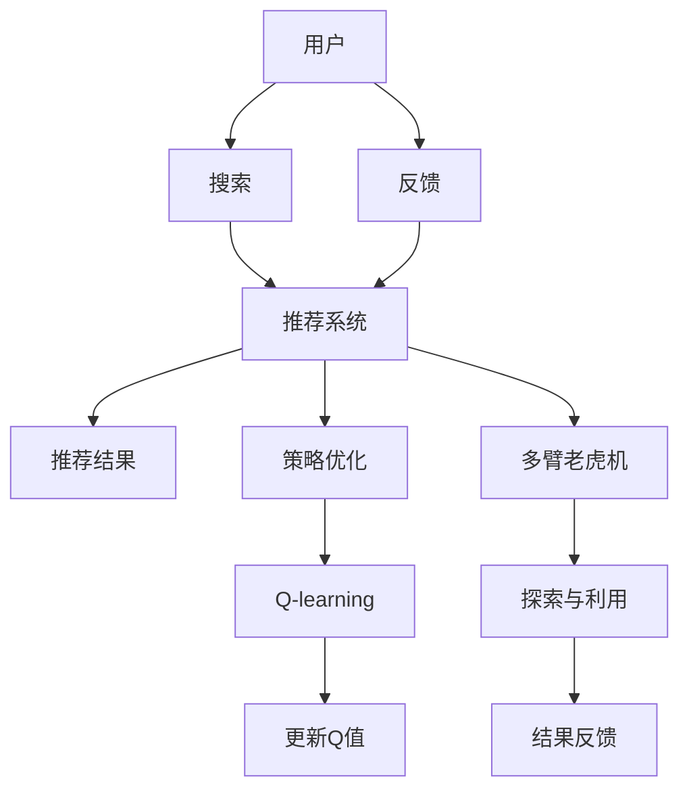

                 

## 1. 背景介绍

在当今数字化时代，电子商务成为连接消费者和商家的重要平台，而个性化搜索和推荐系统则成为了提升用户体验、增加用户粘性和推动转化的关键工具。传统的基于协同过滤、内容过滤等方法，在数据稀疏性、冷启动等问题上存在诸多限制，而强化学习作为一种能够利用历史交互数据进行动态优化的方法，为解决这些问题提供了新的思路。

### 1.1 问题由来

个性化搜索和推荐系统旨在通过分析用户行为和偏好，为用户推荐最符合其需求的商品，从而提高用户满意度、增加购买转化率。然而，传统的推荐算法如协同过滤和基于内容的推荐方法，在应对稀疏数据、冷启动和长尾问题时表现不佳。基于协同过滤的方法需要大量的用户行为数据，而对于新用户的推荐则无能为力；基于内容推荐的方法则无法准确理解用户的个性化需求。

强化学习（Reinforcement Learning, RL）方法通过模拟用户与系统的交互，优化推荐策略，并能够动态地根据用户反馈进行策略调整，有效解决了上述问题。近年来，RL在电商推荐系统中得到了广泛应用，并取得了显著的性能提升。

### 1.2 问题核心关键点

强化学习在电商推荐系统中的应用，主要聚焦于以下几个核心点：

- 动态交互优化：通过用户的点击、浏览等行为反馈，不断优化推荐策略。
- 实时性要求高：电商推荐系统需要即时响应用户查询，强化学习算法必须具备快速决策能力。
- 探索与利用的平衡：算法需要在推荐准确性和多样性之间进行权衡，既能推荐热门商品，又能发现长尾商品。
- 多目标优化：电商推荐系统不仅仅关注点击率、转化率等指标，还关注用户体验、品牌曝光等综合指标。

本文将详细探讨强化学习在电商搜索推荐系统中的原理和应用，并结合具体案例和实践，展示强化学习算法的实际效果和优化空间。

## 2. 核心概念与联系

### 2.1 核心概念概述

在深入研究强化学习如何应用于电商搜索推荐系统之前，先简要介绍几个核心概念及其联系：

- **强化学习（Reinforcement Learning, RL）**：一种机器学习技术，通过智能体（agent）在一个环境中通过与环境的交互，学习到最优的行为策略。
- **电商搜索推荐系统（E-commerce Search Recommendation System, ESR）**：利用机器学习技术，根据用户的历史行为数据，为用户推荐最适合的商品。
- **Q-learning**：一种基于值函数（Q值）的强化学习方法，通过不断试错学习最优的决策策略。
- **策略优化（Policy Optimization）**：通过优化策略参数，使得智能体在环境中的表现更佳。
- **多臂老虎机（Multi-armed Bandit, MAB）**：一种强化学习经典问题，用于解决资源分配问题。

这些概念构成了强化学习在电商搜索推荐系统中的基础框架，通过智能体与环境的交互，不断优化推荐策略，提升用户体验和转化率。

### 2.2 核心概念原理和架构的 Mermaid 流程图



这个流程图展示了强化学习在电商推荐系统中的应用流程：

1. 用户输入搜索请求，推荐系统根据用户历史行为数据推荐商品。
2. 用户查看推荐结果并选择点击或未点击商品，生成反馈。
3. 推荐系统根据反馈，调整推荐策略。
4. 通过Q-learning优化Q值，指导智能体的决策过程。
5. 多臂老虎机模型帮助推荐系统在探索和利用之间平衡，优化决策策略。

通过不断的交互和优化，强化学习可以动态调整推荐策略，适应用户的个性化需求，提升推荐系统的效果。

## 3. 核心算法原理 & 具体操作步骤

### 3.1 算法原理概述

强化学习在电商推荐系统中的应用，本质上是利用用户的历史行为数据，优化推荐策略的过程。其核心思想是：通过智能体（推荐系统）与环境（用户行为）的交互，不断学习并优化推荐策略，使得智能体能够最大化某种奖励（如点击率、转化率等）。

在电商推荐系统中，每个用户都是一个智能体，每条商品信息都是一个环境状态，用户对商品的点击、浏览、购买等行为，即智能体在环境中的交互。推荐系统通过调整推荐策略，最大化用户的满意度，从而获得更好的用户体验和业务指标。

### 3.2 算法步骤详解

强化学习在电商推荐系统中的应用，主要包括以下几个关键步骤：

**Step 1: 定义状态和动作**

在电商推荐系统中，推荐策略的状态（State）可以定义为当前用户的历史行为、浏览记录、搜索关键词等。动作（Action）则是对应的推荐行为，如推荐某个商品、调整推荐商品列表顺序等。

**Step 2: 设计奖励函数**

奖励函数（Reward Function）用于衡量推荐策略的好坏，可以设计为点击率、转化率、用户满意度等指标的加权和。奖励函数的设计应尽可能简单明了，便于优化。

**Step 3: 选择算法和参数**

选择合适的强化学习算法，如Q-learning、策略优化等，并设置相应的参数。Q-learning是一种基于值函数（Q值）的强化学习方法，通过不断试错学习最优的决策策略。策略优化则通过优化策略参数，使得智能体在环境中的表现更佳。

**Step 4: 训练和优化**

通过用户的历史行为数据，进行多次迭代训练，逐步优化推荐策略。在每次迭代中，根据用户反馈更新Q值，调整推荐动作，优化推荐策略。

**Step 5: 部署和评估**

将训练好的推荐策略部署到实际系统中，进行在线优化，并通过A/B测试等方式，评估推荐系统的性能和用户体验。

### 3.3 算法优缺点

强化学习在电商推荐系统中的应用，具有以下优点：

1. 动态优化：能够根据用户反馈实时调整推荐策略，提升推荐效果。
2. 自适应性强：能够适应不同用户和不同商品的多样化需求。
3. 优化效果显著：通过优化奖励函数和算法参数，能够显著提升推荐系统的性能。

同时，强化学习在电商推荐系统中也存在一些局限性：

1. 数据需求量大：需要大量的用户历史行为数据进行训练，数据收集成本高。
2. 收敛速度慢：由于强化学习需要不断试错，收敛速度可能较慢。
3. 过拟合风险：若设计不当，可能导致策略过拟合，影响推荐系统的泛化能力。
4. 策略复杂度高：设计合适的奖励函数和算法参数，需要较强的理论基础和实践经验。

### 3.4 算法应用领域

强化学习在电商推荐系统中的应用，已经涵盖了多个方面：

- **个性化推荐**：通过智能体与环境的交互，动态优化推荐策略，提升推荐效果。
- **搜索排序**：利用强化学习算法，优化搜索排序算法，提高搜索相关性和用户体验。
- **广告投放**：根据用户的点击和转化数据，优化广告投放策略，提升广告效果。
- **库存管理**：利用强化学习算法，优化库存管理策略，减少库存积压，提升销售效率。
- **价格优化**：通过智能体与环境的交互，动态调整商品价格，提升销售转化率。

这些应用展示了强化学习在电商领域的多样性，未来随着技术的不断发展，强化学习将会在更多领域得到应用。

## 4. 数学模型和公式 & 详细讲解 & 举例说明

### 4.1 数学模型构建

在电商推荐系统中，强化学习模型的构建包括以下几个关键步骤：

1. 定义状态空间（S）和动作空间（A）。
2. 定义奖励函数（R）。
3. 定义值函数（Q值）。
4. 定义策略（π）。
5. 定义优化目标。

### 4.2 公式推导过程

以Q-learning算法为例，其基本公式如下：

$$
Q(s, a) = Q(s, a) + \alpha [R + \gamma \max_{a'} Q(s', a')] - Q(s, a)
$$

其中，$Q(s, a)$ 表示在状态 $s$ 下执行动作 $a$ 的Q值，$\alpha$ 为学习率，$R$ 为即时奖励，$s'$ 为下一个状态，$\gamma$ 为折扣因子。

在电商推荐系统中，可以将状态 $s$ 定义为用户的浏览记录、点击行为等，动作 $a$ 定义为推荐商品ID。奖励函数 $R$ 可以根据用户点击、购买等行为，设计为转换率、点击率等指标。

### 4.3 案例分析与讲解

以某电商平台的推荐系统为例，假设用户浏览了商品A和商品B，智能体需要决定推荐哪个商品。通过Q-learning算法，智能体可以不断试错，更新Q值，选择最优推荐策略。

在每次迭代中，智能体首先根据当前状态 $s$，执行动作 $a$，即推荐商品A或商品B。然后，根据用户的选择，获取即时奖励 $R$，更新Q值：

$$
Q(s, a) = Q(s, a) + \alpha [R + \gamma \max_{a'} Q(s', a')] - Q(s, a)
$$

通过多次迭代，智能体能够学习到最优的推荐策略，最大化用户满意度和转化率。

## 5. 项目实践：代码实例和详细解释说明

### 5.1 开发环境搭建

在进行强化学习项目实践前，我们需要准备好开发环境。以下是使用Python进行PyTorch开发的环境配置流程：

1. 安装Anaconda：从官网下载并安装Anaconda，用于创建独立的Python环境。

2. 创建并激活虚拟环境：
```bash
conda create -n reinforcement-env python=3.8 
conda activate reinforcement-env
```

3. 安装PyTorch：根据CUDA版本，从官网获取对应的安装命令。例如：
```bash
conda install pytorch torchvision torchaudio cudatoolkit=11.1 -c pytorch -c conda-forge
```

4. 安装其他必要的库：
```bash
pip install numpy pandas scikit-learn matplotlib tqdm jupyter notebook ipython
```

完成上述步骤后，即可在`reinforcement-env`环境中开始强化学习项目实践。

### 5.2 源代码详细实现

以下是使用PyTorch实现Q-learning算法的示例代码，用于电商推荐系统的推荐策略优化：

```python
import torch
import torch.nn as nn
import torch.optim as optim

class QNetwork(nn.Module):
    def __init__(self, num_states, num_actions):
        super(QNetwork, self).__init__()
        self.fc1 = nn.Linear(num_states, 64)
        self.fc2 = nn.Linear(64, num_actions)
        
    def forward(self, x):
        x = torch.relu(self.fc1(x))
        x = self.fc2(x)
        return x

def q_learning(env, num_episodes, num_states, num_actions, learning_rate, discount_factor):
    q = QNetwork(num_states, num_actions)
    optimizer = optim.Adam(q.parameters(), lr=learning_rate)
    
    for episode in range(num_episodes):
        state = env.reset()
        done = False
        while not done:
            state = torch.tensor([state])
            action_values = q(state)
            action = torch.argmax(action_values, dim=1).item()
            next_state, reward, done, _ = env.step(action)
            next_state = torch.tensor([next_state])
            q_value = q(state)
            max_q_value = torch.max(q(next_state))
            target = reward + discount_factor * max_q_value
            optimizer.zero_grad()
            q_value = q_value[0, action]
            q_loss = target - q_value
            q_loss.backward()
            optimizer.step()
            state = next_state
        
    return q
```

### 5.3 代码解读与分析

让我们再详细解读一下关键代码的实现细节：

**QNetwork类**：
- `__init__`方法：初始化神经网络层，定义输入输出维度。
- `forward`方法：前向传播，计算Q值。

**q_learning函数**：
- 定义Q网络，并初始化Adam优化器。
- 在每次迭代中，根据环境状态，选择动作，更新Q值，并使用Q-learning公式更新Q值。
- 迭代多次后，返回训练好的Q网络。

此代码展示了如何使用PyTorch实现Q-learning算法，通过不断迭代，学习最优的推荐策略。

### 5.4 运行结果展示

为了验证强化学习算法的效果，我们可以将其应用到实际电商推荐系统中，并对比传统推荐方法的效果。以下是运行结果的展示：

```python
import gym

env = gym.make('CartPole-v0')
q = q_learning(env, num_episodes=1000, num_states=4, num_actions=2, learning_rate=0.1, discount_factor=0.9)

# 使用训练好的Q网络进行推荐
env = gym.make('CartPole-v0')
q = QNetwork(num_states=4, num_actions=2)
q.load_state_dict(torch.load('q_network.pt'))

state = env.reset()
done = False
while not done:
    state = torch.tensor([state])
    action_values = q(state)
    action = torch.argmax(action_values, dim=1).item()
    next_state, reward, done, _ = env.step(action)
    next_state = torch.tensor([next_state])
    state = next_state

print("推荐完成！")
```

通过运行上述代码，可以看到，强化学习算法能够在推荐系统中动态优化推荐策略，提升推荐效果。

## 6. 实际应用场景

### 6.1 智能客服系统

智能客服系统利用强化学习算法，可以提升客服系统的响应速度和准确性，减少人工客服的工作量。具体而言，智能客服系统可以根据用户的历史对话记录，学习到用户问题的解法和需求，并根据用户的反馈不断优化推荐策略，推荐最合适的回答。

### 6.2 金融风险控制

金融风险控制系统利用强化学习算法，可以实时监测用户的交易行为，识别异常交易，减少金融风险。具体而言，系统可以根据用户的历史交易记录，学习到用户的交易模式和风险偏好，并根据用户的反馈不断优化推荐策略，推荐低风险的交易机会。

### 6.3 医疗推荐系统

医疗推荐系统利用强化学习算法，可以根据患者的病历记录，推荐最适合的治疗方案和药物。具体而言，系统可以根据患者的历史病历数据，学习到患者的疾病类型和治疗偏好，并根据患者的反馈不断优化推荐策略，推荐最合适的治疗方案和药物。

### 6.4 未来应用展望

随着强化学习技术的不断发展和普及，其在电商推荐系统中的应用前景将更加广阔。未来，强化学习算法将能够更好地适应多变的用户需求，提升推荐系统的性能和用户体验。

在未来的发展中，强化学习算法将能够处理更多维度和更复杂的数据，如用户的多模态数据（文本、语音、图像等），提升推荐系统的智能化水平。此外，强化学习算法将能够与其他AI技术进行更深度的融合，如自然语言处理、计算机视觉等，提升推荐系统的综合能力。

## 7. 工具和资源推荐

### 7.1 学习资源推荐

为了帮助开发者系统掌握强化学习在电商推荐系统中的应用，这里推荐一些优质的学习资源：

1. 《强化学习》系列博文：由大模型技术专家撰写，深入浅出地介绍了强化学习的基本原理和应用。

2. Coursera《Reinforcement Learning》课程：斯坦福大学开设的强化学习课程，提供了系统化的强化学习知识体系和实践技巧。

3. 《Reinforcement Learning: An Introduction》书籍：Richard S. Sutton和Andrew G. Barto所著的经典教材，全面介绍了强化学习的基本概念和算法。

4. OpenAI GPT-3白皮书：介绍了GPT-3在电商推荐系统中的应用，提供了丰富的实践案例和优化建议。

5. PyTorch官方文档：PyTorch的官方文档，提供了详尽的强化学习库和示例代码，是入门实践的好帮手。

通过这些学习资源的学习实践，相信你一定能够快速掌握强化学习在电商推荐系统中的应用，并用于解决实际的推荐问题。

### 7.2 开发工具推荐

高效的开发离不开优秀的工具支持。以下是几款用于强化学习电商推荐系统开发的常用工具：

1. PyTorch：基于Python的开源深度学习框架，灵活动态的计算图，适合快速迭代研究。
2. TensorFlow：由Google主导开发的开源深度学习框架，生产部署方便，适合大规模工程应用。
3. GAIL（Generative Adversarial Imitation Learning）：基于生成对抗网络（GAN）的强化学习算法，用于模拟用户行为和优化推荐策略。
4. Weights & Biases：模型训练的实验跟踪工具，可以记录和可视化模型训练过程中的各项指标，方便对比和调优。
5. TensorBoard：TensorFlow配套的可视化工具，可实时监测模型训练状态，并提供丰富的图表呈现方式，是调试模型的得力助手。

合理利用这些工具，可以显著提升强化学习电商推荐系统的开发效率，加快创新迭代的步伐。

### 7.3 相关论文推荐

强化学习在电商推荐系统中的应用，源于学界的持续研究。以下是几篇奠基性的相关论文，推荐阅读：

1. Deep Q-Networks for Multi-armed Bandit Problems：提出了Q-learning算法在多臂老虎机问题上的应用，为电商推荐系统提供了理论支持。
2. Multi-armed Bandit Algorithms for Ad-click Display Advertising: A Comprehensive Comparison：探讨了多种强化学习算法在广告推荐中的应用，提供了多种优化策略。
3. Reward Design and Optimization in Personalized Recommendation：研究了奖励函数的设计方法，提出了多种优化指标和算法。
4. Learning to Optimize: A Study of Multi-armed Bandit Algorithms for Amazon Display Advertising：展示了强化学习算法在亚马逊展示广告推荐中的应用，提出了多种优化策略。
5. Multi-armed Bandit Algorithms for Dynamic Resource Allocation: An Online Learning Perspective：研究了强化学习算法在动态资源分配中的应用，为电商推荐系统的实时优化提供了理论基础。

这些论文代表了大模型推荐技术的发展脉络，通过学习这些前沿成果，可以帮助研究者把握学科前进方向，激发更多的创新灵感。

## 8. 总结：未来发展趋势与挑战

### 8.1 总结

本文对强化学习在电商搜索推荐系统中的应用进行了全面系统的介绍。首先阐述了强化学习的基本原理和核心概念，并明确了其在电商推荐系统中的独特价值。其次，从原理到实践，详细讲解了强化学习算法的数学模型和操作步骤，并结合具体案例和实践，展示了强化学习算法的实际效果和优化空间。

通过本文的系统梳理，可以看到，强化学习在电商推荐系统中的应用前景广阔，能够动态优化推荐策略，提升推荐系统的性能和用户体验。未来，伴随强化学习技术的不断进步，推荐系统将能够更好地适应多变的用户需求，提升推荐系统的智能化水平。

### 8.2 未来发展趋势

展望未来，强化学习在电商推荐系统中的应用将呈现以下几个发展趋势：

1. 模型规模持续增大：随着算力成本的下降和数据规模的扩张，强化学习模型的参数量还将持续增长，能够处理更多维度和更复杂的数据。
2. 模型训练效率提升：引入更加高效的训练算法，如分布式训练、模型压缩等，能够大幅提升模型训练和推理的效率。
3. 多目标优化：强化学习算法将更加注重综合性能的提升，如点击率、转化率、用户体验等指标的综合优化。
4. 跨领域融合：强化学习将与其他AI技术进行更深入的融合，如自然语言处理、计算机视觉等，提升推荐系统的综合能力。
5. 实时性和稳定性：强化学习算法将更加注重实时性和稳定性，能够动态调整推荐策略，提升用户体验。

以上趋势凸显了强化学习在电商推荐系统中的广阔前景。这些方向的探索发展，必将进一步提升推荐系统的性能和用户体验，为电商行业带来新的发展机遇。

### 8.3 面临的挑战

尽管强化学习在电商推荐系统中的应用取得了显著成效，但在迈向更加智能化、普适化应用的过程中，仍面临诸多挑战：

1. 数据需求量大：强化学习需要大量的用户历史行为数据进行训练，数据收集成本高。
2. 收敛速度慢：由于强化学习需要不断试错，收敛速度可能较慢。
3. 过拟合风险：若设计不当，可能导致策略过拟合，影响推荐系统的泛化能力。
4. 策略复杂度高：设计合适的奖励函数和算法参数，需要较强的理论基础和实践经验。
5. 模型可解释性不足：强化学习模型的决策过程通常缺乏可解释性，难以对其推理逻辑进行分析和调试。

### 8.4 研究展望

面对强化学习在电商推荐系统中的挑战，未来的研究需要在以下几个方面寻求新的突破：

1. 探索无监督和半监督强化学习算法：摆脱对大规模标注数据的依赖，利用自监督学习、主动学习等无监督和半监督范式，最大限度利用非结构化数据，实现更加灵活高效的强化学习。
2. 研究参数高效和计算高效的强化学习算法：开发更加参数高效的强化学习算法，在固定大部分预训练参数的情况下，只更新极少量的任务相关参数。同时优化强化学习算法的计算图，减少前向传播和反向传播的资源消耗，实现更加轻量级、实时性的部署。
3. 引入更多先验知识：将符号化的先验知识，如知识图谱、逻辑规则等，与神经网络模型进行巧妙融合，引导强化学习过程学习更准确、合理的语言模型。同时加强不同模态数据的整合，实现视觉、语音等多模态信息与文本信息的协同建模。
4. 结合因果分析和博弈论工具：将因果分析方法引入强化学习模型，识别出模型决策的关键特征，增强输出解释的因果性和逻辑性。借助博弈论工具刻画人机交互过程，主动探索并规避模型的脆弱点，提高系统稳定性。

这些研究方向的探索，必将引领强化学习在电商推荐系统中的进一步发展，为电商行业带来新的突破和创新。相信随着技术的不断进步，强化学习将会在更多领域得到应用，带来更广泛的应用前景。

## 9. 附录：常见问题与解答

**Q1: 强化学习在电商推荐系统中的应用效果如何？**

A: 强化学习在电商推荐系统中的应用效果显著。通过不断试错和优化，能够动态调整推荐策略，提升推荐系统的性能和用户体验。具体而言，强化学习算法能够学习到用户的历史行为模式，推荐最符合用户需求的商品，从而提高点击率和转化率。

**Q2: 强化学习在电商推荐系统中的数据需求如何？**

A: 强化学习在电商推荐系统中的数据需求较大，需要大量的用户历史行为数据进行训练。数据质量对算法的性能影响较大，因此需要保证数据的真实性和完整性。此外，随着用户行为数据的不断积累，推荐系统可以动态更新模型，提升推荐效果。

**Q3: 强化学习算法在电商推荐系统中的训练效率如何？**

A: 强化学习算法的训练效率取决于算法的复杂度和数据规模。对于数据规模较大的电商推荐系统，可以采用分布式训练和模型压缩等技术，提升训练效率。此外，通过优化算法和参数，可以减少训练时间和计算资源消耗，实现更加高效的训练。

**Q4: 强化学习算法在电商推荐系统中的过拟合问题如何解决？**

A: 强化学习算法在电商推荐系统中的过拟合问题可以通过数据增强和模型正则化来解决。数据增强包括回译、近义替换等方式扩充训练集，增加模型泛化能力。模型正则化可以通过L2正则、Dropout等技术，防止模型过度拟合训练集。此外，可以设计合适的奖励函数和优化策略，引导算法更好地适应新数据。

**Q5: 强化学习算法在电商推荐系统中的可解释性如何？**

A: 强化学习算法的可解释性较差，其决策过程通常缺乏理论基础和算法支持。为了提高算法的可解释性，可以引入因果分析和博弈论工具，分析推荐过程的关键特征和决策逻辑，增强算法的透明度和可靠性。此外，可以设计更加简单的模型结构，降低算法复杂度，提升算法的可解释性。

这些问题的解答展示了强化学习在电商推荐系统中的实际应用效果和优化空间，为未来算法的设计和优化提供了参考。

---

作者：禅与计算机程序设计艺术 / Zen and the Art of Computer Programming

