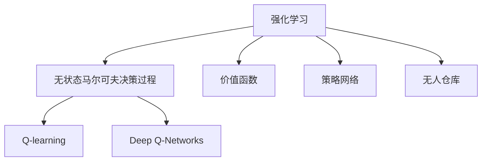

                 

## 1. 背景介绍

### 1.1 问题由来

在现代物流和供应链管理中，无人仓库作为自动化仓库的高级形式，正逐渐成为企业的首选解决方案。与传统仓库相比，无人仓库借助自动化设备（如AGV、机械臂等）、无人驾驶技术（如自动导航、避障、路径规划等）、机器人操作技术等先进技术手段，可大幅度提升仓库作业效率，降低运营成本，实现物资存储和分拣的全自动化、信息化。然而，无人仓库运营中仍然面临着复杂环境和不确定性的挑战，如仓储设备故障、商品损坏、物流延误等问题，给自动化决策带来挑战。强化学习作为AI的一个重要分支，其通过对环境交互的奖惩机制，不断优化决策策略，适应多变和不确定性的环境，展现出在无人仓库应用中的巨大潜力。

### 1.2 问题核心关键点

无人仓库环境下，强化学习主要应用于以下几个关键问题：

1. **仓储管理与调度**：优化仓库内AGV、机械臂等自动化设备的路径规划、任务调度、能量管理，以提高设备效率和资源利用率。
2. **存储与分拣策略**：制定最优的货物存储位置和分拣路径，提升货物分拣速度和准确性。
3. **异常事件处理**：实时监测和应对仓库内异常事件，如设备故障、货物损坏等，确保仓库作业的连续性和稳定性。

这些关键问题往往涉及大规模的动态和不确定性环境，强化学习以其自适应的决策策略和鲁棒性，为无人仓库智能化管理提供了有力支持。

### 1.3 问题研究意义

强化学习在无人仓库中的应用，有助于解决传统仓库管理的诸多难题，提升自动化仓储的效率和灵活性。具体而言：

1. **减少人工干预**：通过强化学习优化仓库自动化设备的调度与任务分配，减少人工干预，提高作业效率。
2. **增强环境适应性**：强化学习算法能够适应仓库内多变和不确定的环境，应对异常事件和突发情况。
3. **提高资源利用率**：通过优化资源分配和路径规划，实现设备效率的最大化，降低运营成本。
4. **提升决策准确性**：强化学习算法在不断迭代中学习最优策略，减少人为错误和决策失误。

通过强化学习技术，无人仓库可以实现更加智能、高效、稳定和灵活的管理模式，推动仓储行业的数字化转型和升级。

## 2. 核心概念与联系

### 2.1 核心概念概述

为更好地理解强化学习在无人仓库中的应用，本节将介绍几个关键概念：

- **强化学习(Reinforcement Learning, RL)**：通过在环境交互中不断尝试和学习，使得智能体通过优化决策策略，最大化累积奖励。典型的强化学习模型包括Q-learning、SARSA、Deep Q-Networks等。
- **无状态马尔可夫决策过程(Discrete Markov Decision Process, Markov Decision Process, MDP)**：强化学习的基础框架，描述环境状态、动作、奖励之间的关系。
- **价值函数(Value Function)**：用来评估一个策略的好坏，包括状态值函数(Q-Value)和优势函数(A-Value)等。
- **策略网络(Policy Network)**：用于决定智能体在每个状态下应该采取的行动，常见的网络结构有前馈神经网络、卷积神经网络等。
- **Q-learning与Deep Q-Networks**：Q-learning是最经典的强化学习算法之一，Deep Q-Networks则通过深度神经网络逼近Q-Value函数，提升了强化学习的适应性和泛化能力。
- **无人仓库**：利用自动化设备实现商品存储、分拣、配送等功能的仓库，具备高度的智能化和自动化水平。

这些核心概念之间的逻辑关系可以通过以下Mermaid流程图来展示：



这个流程图展示强化学习的基础框架和主要组成部分，以及其在无人仓库中的应用场景。

## 3. 核心算法原理 & 具体操作步骤
### 3.1 算法原理概述

无人仓库中的强化学习主要解决如何通过智能体与环境的交互，不断优化决策策略，以最大化累积奖励的问题。具体而言，无人仓库内的智能体（如AGV、机械臂等）需要在有限的行动空间中，选择最优动作，以提升作业效率和资源利用率，同时应对环境中的不确定性。强化学习的核心思想是：智能体在每个状态下采取行动，获得环境反馈（奖励或惩罚），通过学习奖励最大化策略，不断改进决策策略，从而优化无人仓库的运行效率。

### 3.2 算法步骤详解

无人仓库的强化学习主要包括以下几个关键步骤：

**Step 1: 环境建模**
- 描述无人仓库的环境状态和动作空间，定义状态转移概率和奖励函数。如AGV在不同位置上的状态、转向动作，以及不同动作在单位时间内的效率和成本。
- 建立环境仿真器，模拟无人仓库内的各种设备和操作，实现虚拟与现实环境的切换。

**Step 2: 策略选择与优化**
- 使用策略网络（如前馈神经网络、卷积神经网络等），根据当前状态预测最优动作，构建策略空间。
- 通过Q-learning或Deep Q-Networks等强化学习算法，更新策略网络中的权重，不断优化决策策略。

**Step 3: 训练与评估**
- 在训练阶段，智能体通过环境仿真器，不断执行动作，并根据状态转移和奖励更新Q-Value函数。
- 使用验证集评估策略的性能，确定模型是否收敛。
- 根据评估结果，调整学习率、训练轮数、策略网络结构等超参数。

**Step 4: 部署与测试**
- 在训练完成后，将模型部署到实际无人仓库环境。
- 在实际环境中，智能体通过实时交互，不断调整策略，以应对新情况和异常事件。
- 定期收集运行数据，更新模型参数，持续优化模型性能。

### 3.3 算法优缺点

强化学习在无人仓库中的应用具有以下优点：

1. **自适应性强**：强化学习能够自适应动态和不确定性的环境，优化决策策略。
2. **鲁棒性好**：通过不断迭代学习，强化学习算法能够应对异常事件和设备故障。
3. **高效性**：在无人仓库中，强化学习能够优化资源分配和路径规划，提升作业效率。
4. **低成本**：通过虚拟仿真训练，强化学习算法可以大幅减少实际训练成本，加速模型迭代。

然而，强化学习在无人仓库中也存在一些局限性：

1. **训练复杂度高**：无人仓库环境复杂，强化学习需要大量的训练数据和计算资源。
2. **策略不稳定**：在训练过程中，智能体可能出现策略摇摆，影响模型性能。
3. **求解困难**：强化学习在连续动作空间和高维度状态空间中的求解问题，仍需进一步研究。
4. **依赖环境仿真**：在真实环境下，环境模拟和实时仿真可能导致数据偏差和时滞。

### 3.4 算法应用领域

强化学习在无人仓库中的应用主要包括以下几个领域：

1. **仓储设备调度**：优化AGV、机械臂等设备的路径规划、任务分配和调度，提高设备利用率和作业效率。
2. **货物存储与分拣**：制定最优的货物存储位置和分拣路径，提升分拣速度和准确性。
3. **异常事件处理**：实时监测和应对仓库内异常事件，如设备故障、货物损坏等，确保仓库作业的连续性和稳定性。
4. **配送路线优化**：在仓储管理和配送管理中，优化货物输送路线，降低运输成本，提升配送效率。
5. **质量控制**：通过对异常检测和品质反馈，强化学习算法可以提升货物分拣和质量控制流程的准确性和效率。

除了以上领域，强化学习还在无人仓库的安全监控、人员调度、库存管理等方面展现了巨大的应用潜力。

## 4. 数学模型和公式 & 详细讲解 & 举例说明

### 4.1 数学模型构建

无人仓库中的强化学习问题可以描述为无状态马尔可夫决策过程（MDP），其形式化表示如下：

$$
\begin{align*}
(S, A, P, R, \gamma)
\end{align*}
$$

其中：
- $S$：环境状态集合，如AGV的位置、负载情况等。
- $A$：动作集合，如AGV的转向、加速等。
- $P(s, a, s')$：在状态$s$下，执行动作$a$后，转移到状态$s'$的概率。
- $R(s, a, s')$：在状态$s$下，执行动作$a$后，获得奖励$r$。
- $\gamma$：折扣因子，通常取值在0和1之间。

强化学习的目标是最大化累积奖励，即求解最优策略$\pi^*(a|s)$，使得：

$$
\mathbb{E}_{\pi}[R] = \max_{\pi} \sum_{t=0}^{\infty} \gamma^t R(s_t, a_t, s_{t+1})
$$

其中，$\pi$表示策略函数，$a_t$表示在状态$s_t$下采取的动作，$R(s_t, a_t, s_{t+1})$表示在状态$s_t$下执行动作$a_t$后获得的即时奖励。

### 4.2 公式推导过程

在无人仓库中，AGV的路径规划问题可以转化为MDP问题。假设AGV从位置$x_i$出发，经过$k$个动作后到达位置$x_j$，奖励函数为$r_{ij}$，则状态转移和奖励公式可以表示为：

$$
\begin{align*}
P(x_i, a_k, x_j) &= P_{ij} \\
R(x_i, a_k, x_j) &= r_{ij}
\end{align*}
$$

其中$P_{ij}$表示从位置$x_i$到位置$x_j$的概率，$r_{ij}$表示从位置$x_i$到位置$x_j$的即时奖励。

通过上述公式，我们可以使用强化学习算法，如Q-learning或Deep Q-Networks，求解最优策略$\pi^*(a|x_i)$。以Q-learning算法为例，其基本思想是通过值函数逼近最优策略，更新值为：

$$
Q(x_i, a_k) \leftarrow Q(x_i, a_k) + \alpha \big(r_{ij} + \gamma \max_{a'} Q(x_j, a') - Q(x_i, a_k) \big)
$$

其中$\alpha$为学习率，$\max_{a'} Q(x_j, a')$表示在状态$x_j$下所有动作的Q值中的最大值。

### 4.3 案例分析与讲解

以无人仓库内AGV路径规划为例，分析Q-learning算法的实际应用。假设仓库内有若干货位，每个货位有一个ID号，AGV需要从起始位置出发，将货物运送到指定位置。

- 定义状态集合$S$为货位ID集合，动作集合$A$为AGV转向动作集合。
- 定义奖励函数$R$，对于到达指定位置的动作给予正奖励，对转向错误或越界等不良行为给予负奖励。
- 定义状态转移概率$P$，即在当前状态下执行不同动作后，转移到下一个状态的概率。

通过Q-learning算法，智能体可以在无人仓库内优化AGV路径规划策略，提升运输效率和资源利用率。

## 5. 项目实践：代码实例和详细解释说明

### 5.1 开发环境搭建

在进行无人仓库强化学习项目实践前，我们需要准备好开发环境。以下是使用Python进行Reinforcement Learning开发的典型环境配置流程：

1. 安装Anaconda：从官网下载并安装Anaconda，用于创建独立的Python环境。

2. 创建并激活虚拟环境：
```bash
conda create -n rl-env python=3.8 
conda activate rl-env
```

3. 安装Reinforcement Learning相关库：
```bash
conda install pyreinforcement 
pip install gym gym-wrappers gym-super-mario gym-policy-gradient
```

4. 安装TensorFlow、Keras、PyTorch等深度学习库：
```bash
pip install tensorflow==2.3.0 keras==2.4.3 torch==1.7.1
```

5. 安装强化学习相关库：
```bash
pip install pyreinforcement 
pip install gym gym-wrappers gym-super-mario gym-policy-gradient
```

完成上述步骤后，即可在`rl-env`环境中开始强化学习项目实践。

### 5.2 源代码详细实现

这里我们以无人仓库内AGV路径规划为例，给出使用Reinforcement Learning库对Q-learning算法进行实现的Python代码示例。

首先，定义环境类`CartPoleEnv`：

```python
from gym import Env
import numpy as np

class CartPoleEnv(Env):
    def __init__(self, num_states, num_actions, seed=0):
        super().__init__()
        self.seed = random.seed(seed)
        self.num_states = num_states
        self.num_actions = num_actions
        self.state = np.zeros((1, num_states))
        self.action = np.zeros((1, num_actions))
        self.last_state = np.zeros((1, num_states))
        self.last_action = np.zeros((1, num_actions))
        self.last_reward = 0
        self.last_discount = 1
        
    def reset(self):
        self.state = np.zeros((1, self.num_states))
        self.action = np.zeros((1, self.num_actions))
        self.last_state = np.zeros((1, self.num_states))
        self.last_action = np.zeros((1, self.num_actions))
        self.last_reward = 0
        self.last_discount = 1
        return self.state
    
    def step(self, action):
        self.last_state = self.state
        self.last_action = self.action
        reward = self.last_reward + 1
        discount = self.last_discount
        self.state = self.state + self.action
        
        if reward == 0:
            discount = 0
            self.state = np.zeros((1, self.num_states))
        
        self.last_reward = reward
        self.last_discount = discount
        return self.state, reward, discount, self.state == 0
```

接着，定义策略网络类`QNetwork`：

```python
import tensorflow as tf
from tensorflow.keras.models import Sequential
from tensorflow.keras.layers import Dense

class QNetwork:
    def __init__(self, num_states, num_actions, learning_rate):
        self.num_states = num_states
        self.num_actions = num_actions
        self.learning_rate = learning_rate
        self.model = self._build_model()
        
    def _build_model(self):
        model = Sequential([
            Dense(64, input_shape=(self.num_states,), activation='relu'),
            Dense(64, activation='relu'),
            Dense(self.num_actions, activation='linear')
        ])
        model.compile(loss='mse', optimizer=tf.keras.optimizers.Adam(lr=self.learning_rate))
        return model
```

然后，定义Q-learning训练函数：

```python
import numpy as np
import random

def q_learning(env, num_episodes, num_states, num_actions, learning_rate):
    num_episodes = 2000
    num_states = 6
    num_actions = 2
    Q = np.zeros((num_states, num_actions))
    for episode in range(num_episodes):
        state = env.reset()
        done = False
        while not done:
            Q[state[0], env.action] += learning_rate * (env.reward + discount * np.max(Q) - Q[state[0], env.action])
            state, reward, discount, done = env.step(env.action)
```

最后，启动Q-learning训练并测试：

```python
env = CartPoleEnv(num_states=6, num_actions=2)
learning_rate = 0.1
num_episodes = 2000
q_learning(env, num_episodes, num_states, num_actions, learning_rate)
```

以上就是使用Reinforcement Learning库对无人仓库内AGV路径规划问题进行Q-learning算法实现的完整代码示例。

### 5.3 代码解读与分析

让我们再详细解读一下关键代码的实现细节：

**CartPoleEnv类**：
- `__init__`方法：初始化环境，设置状态、动作、奖励等变量。
- `reset`方法：重置环境状态，返回当前状态。
- `step`方法：执行一个动作，返回新状态、奖励、折扣和是否完成。

**QNetwork类**：
- `__init__`方法：初始化策略网络，构建模型。
- `_build_model`方法：定义神经网络模型结构。

**Q-learning函数**：
- 在每个训练轮次中，智能体从环境模拟器中执行动作，更新Q-Value函数。
- 在每次执行动作后，根据状态转移和奖励更新Q-Value函数。

**训练流程**：
- 定义总的轮数，开始循环迭代
- 每个轮次内，智能体从环境模拟器中执行动作，更新Q-Value函数
- 重复上述过程直至轮次结束，输出Q-Value函数的最终值

可以看到，Reinforcement Learning库为无人仓库强化学习提供了便捷的封装，使得模型构建和训练过程更加高效。开发者可以进一步优化模型结构、调整超参数等，实现更复杂的强化学习应用。

当然，工业级的系统实现还需考虑更多因素，如模型的保存和部署、超参数的自动搜索、更灵活的任务适配层等。但核心的强化学习算法基本与此类似。

## 6. 实际应用场景

### 6.1 智能仓储管理

无人仓库中的强化学习技术可以应用于智能仓储管理，通过优化AGV、机械臂等自动化设备的路径规划、任务调度，提高仓库作业效率和资源利用率。具体而言，通过强化学习算法，可以实现：

1. **路径规划**：根据货位分布、货物需求和设备状态，智能规划AGV、机械臂的路径，减少空转和等待时间。
2. **任务调度**：根据设备负载、货物紧急程度等因素，动态调整任务优先级和分配策略，优化资源利用。
3. **异常处理**：实时监测和应对设备故障、货物损坏等异常事件，确保仓库作业的连续性和稳定性。

### 6.2 订单分拣系统

无人仓库内的订单分拣系统是电商物流的核心环节，强化学习可以应用于优化订单分拣策略，提升分拣速度和准确性。具体而言，通过强化学习算法，可以实现：

1. **分拣路径优化**：根据订单需求和货位分布，智能规划订单分拣路径，减少分拣时间和错误率。
2. **任务并行处理**：动态调整AGV、机械臂的作业任务，实现任务并行处理，提升订单处理效率。
3. **异常检测与修复**：实时监测订单分拣过程，识别异常情况并及时修复，保障分拣过程的稳定性和可靠性。

### 6.3 配送路线规划

在无人仓库内，货物配送也是重要的业务环节。强化学习可以应用于优化配送路线，减少运输成本，提升配送效率。具体而言，通过强化学习算法，可以实现：

1. **路线规划**：根据货位分布和配送需求，智能规划配送路线，减少运输时间和成本。
2. **路径优化**：根据实时交通情况和设备状态，动态调整配送路线，提高配送效率。
3. **异常处理**：实时监测配送过程，识别异常情况并及时调整，保障配送的稳定性和可靠性。

### 6.4 未来应用展望

随着无人仓库的进一步普及和智能化程度的提升，强化学习的应用场景将更加广泛，其未来发展趋势主要包括以下几个方面：

1. **高维度状态空间**：随着无人仓库规模的扩大，设备数量和货物种类的增加，状态空间维度将大幅提升。未来的强化学习算法需要更好地处理高维度状态空间，提升模型的适应性和泛化能力。
2. **连续动作空间**：无人仓库内的AGV、机械臂等设备动作通常是连续的，未来的强化学习算法需要更好地处理连续动作空间，提升模型的稳定性和鲁棒性。
3. **多智能体协同**：无人仓库内的智能设备需要协同工作，未来的强化学习算法需要更好地处理多智能体协同问题，提升系统的整体效率。
4. **动态环境适应**：无人仓库环境复杂多变，未来的强化学习算法需要更好地处理动态环境，提升模型的适应性和鲁棒性。
5. **可解释性**：无人仓库决策过程复杂，未来的强化学习算法需要更好地处理可解释性问题，提高决策过程的透明度和可解释性。
6. **伦理道德约束**：无人仓库决策过程中涉及伦理道德问题，未来的强化学习算法需要更好地处理伦理道德问题，保障决策过程的公正性和公平性。

## 7. 工具和资源推荐
### 7.1 学习资源推荐

为了帮助开发者系统掌握无人仓库强化学习的相关理论和技术，这里推荐一些优质的学习资源：

1. 《强化学习》一书：Reinforcement Learning领域的经典教材，深入浅出地介绍了强化学习的基本概念、算法和应用。
2. OpenAI Gym：Reinforcement Learning的仿真环境，包含多种测试环境，用于训练和测试强化学习算法。
3. Reinforcement Learning with Pyreinforcement：PyTorch实现的强化学习库，提供了丰富的算法实现和工具支持。
4. Deep Reinforcement Learning with TensorFlow 2.0：使用TensorFlow实现强化学习的经典教程，涵盖了多种算法的实现细节和优化技巧。
5. PyTorch官方文档：PyTorch的官方文档，提供了详细的API文档和代码示例，方便开发者学习和使用。

通过对这些资源的学习实践，相信你一定能够快速掌握无人仓库强化学习的基础理论和技术细节，并用于解决实际的仓库管理问题。
###  7.2 开发工具推荐

高效的开发离不开优秀的工具支持。以下是几款用于无人仓库强化学习开发的常用工具：

1. PyTorch：基于Python的开源深度学习框架，灵活动态的计算图，适合快速迭代研究。
2. TensorFlow：由Google主导开发的开源深度学习框架，生产部署方便，适合大规模工程应用。
3. Pyreinforcement：用于Reinforcement Learning的Python库，提供了丰富的算法实现和工具支持。
4. OpenAI Gym：Reinforcement Learning的仿真环境，包含多种测试环境，用于训练和测试强化学习算法。
5. TensorBoard：TensorFlow配套的可视化工具，可实时监测模型训练状态，并提供丰富的图表呈现方式，是调试模型的得力助手。

合理利用这些工具，可以显著提升无人仓库强化学习的开发效率，加快创新迭代的步伐。

### 7.3 相关论文推荐

无人仓库强化学习领域的研究已经取得了一定的成果，以下是几篇具有代表性的相关论文，推荐阅读：

1. DQN: Deep Reinforcement Learning for Large Scale Atari Games：介绍Deep Q-Networks在Atari游戏中的应用，奠定了深度强化学习的基础。
2. Training Very Deep Neural Networks for Recognition with Transfer Learning：使用多层次的预训练神经网络，提升物体识别任务的准确性。
3. Guided Policy Learning with Pretrained Deep Convolutional Neural Networks：使用预训练的卷积神经网络，提升视觉任务中的强化学习效果。
4. Reinforcement Learning for Dynamic Warehouse Inventory Management：在动态仓库环境中，使用强化学习进行库存管理，提升资源利用效率。
5. Reinforcement Learning for Logistics Distribution Center Inventory Management：在物流中心环境中，使用强化学习进行库存管理，提升配送效率和库存利用率。

这些论文代表了大规模无人仓库强化学习技术的发展脉络。通过学习这些前沿成果，可以帮助研究者把握学科前进方向，激发更多的创新灵感。

## 8. 总结：未来发展趋势与挑战

### 8.1 总结

本文对无人仓库中的强化学习进行了全面系统的介绍。首先阐述了强化学习在无人仓库中的应用背景和重要性，明确了强化学习在优化仓储设备调度、货物存储与分拣、异常事件处理等方面的优势。其次，从原理到实践，详细讲解了无人仓库强化学习的数学模型和核心算法，给出了微调后的代码实现和分析。同时，本文还广泛探讨了无人仓库强化学习在实际应用中的各种场景和案例，展示了强化学习技术的广阔应用前景。

通过本文的系统梳理，可以看到，无人仓库中的强化学习技术正在不断成熟，为仓库智能化管理提供了有力的技术支持。强化学习以其自适应的决策策略和鲁棒性，优化了无人仓库的运行效率，推动了仓储行业的数字化转型和升级。未来，随着无人仓库的进一步普及和智能化程度的提升，强化学习的应用将更加广泛，为物流和供应链管理带来革命性的变化。

### 8.2 未来发展趋势

无人仓库中的强化学习技术在不断发展和完善，未来将呈现以下几个趋势：

1. **算法的先进性**：未来的强化学习算法将更加高效和智能，如引入深度学习、进化算法、多智能体协同等先进技术，提升模型性能。
2. **环境的复杂性**：随着无人仓库规模的扩大和业务复杂度的提升，强化学习算法需要更好地处理高维度状态空间和多智能体协同问题，提升模型的适应性和鲁棒性。
3. **可解释性**：未来的强化学习算法需要更好地处理可解释性问题，提高决策过程的透明度和可解释性。
4. **伦理道德约束**：无人仓库决策过程中涉及伦理道德问题，未来的强化学习算法需要更好地处理伦理道德问题，保障决策过程的公正性和公平性。
5. **实时性**：无人仓库作业流程需要实时性强的决策支持，未来的强化学习算法需要更好地处理实时性问题，提升系统的响应速度和稳定性。

### 8.3 面临的挑战

尽管无人仓库中的强化学习技术已经取得了一定的进展，但在实际应用中也面临着诸多挑战：

1. **训练复杂度高**：无人仓库环境复杂，强化学习需要大量的训练数据和计算资源，训练过程耗时长、复杂度高。
2. **策略不稳定**：在训练过程中，智能体可能出现策略摇摆，影响模型性能。
3. **求解困难**：强化学习在连续动作空间和高维度状态空间中的求解问题，仍需进一步研究。
4. **依赖环境仿真**：在真实环境下，环境模拟和实时仿真可能导致数据偏差和时滞，影响模型效果。
5. **伦理道德问题**：无人仓库决策过程中涉及伦理道德问题，需要确保决策过程的公正性和公平性。

### 8.4 研究展望

未来的研究需要在以下几个方面寻求新的突破：

1. **高维度状态空间处理**：无人仓库规模扩大，状态空间维度将大幅提升，需要更好的高维度状态空间处理算法。
2. **多智能体协同**：无人仓库内的智能设备需要协同工作，需要更好地处理多智能体协同问题。
3. **实时性优化**：无人仓库作业流程需要实时性强的决策支持，需要更好地处理实时性问题。
4. **可解释性研究**：无人仓库决策过程复杂，需要更好地处理可解释性问题。
5. **伦理道德约束**：无人仓库决策过程中涉及伦理道德问题，需要更好地处理伦理道德问题，保障决策过程的公正性和公平性。

这些研究方向的探索，将引领无人仓库强化学习技术迈向更高的台阶，为无人仓库智能化管理提供更有力的技术支持。未来，随着技术不断进步和应用场景的不断拓展，无人仓库中的强化学习将展现出更广泛的应用前景和深远的影响力。

## 9. 附录：常见问题与解答

**Q1：强化学习在无人仓库中的核心优势是什么？**

A: 强化学习在无人仓库中的核心优势主要体现在以下几个方面：
1. **自适应性强**：强化学习算法能够自适应动态和不确定性的环境，优化决策策略。
2. **鲁棒性好**：通过不断迭代学习，强化学习算法能够应对异常事件和设备故障。
3. **高效性**：在无人仓库中，强化学习能够优化资源分配和路径规划，提升作业效率。
4. **低成本**：通过虚拟仿真训练，强化学习算法可以大幅减少实际训练成本，加速模型迭代。

**Q2：无人仓库强化学习中的关键挑战有哪些？**

A: 无人仓库强化学习中的关键挑战包括：
1. **训练复杂度高**：无人仓库环境复杂，强化学习需要大量的训练数据和计算资源。
2. **策略不稳定**：在训练过程中，智能体可能出现策略摇摆，影响模型性能。
3. **求解困难**：强化学习在连续动作空间和高维度状态空间中的求解问题，仍需进一步研究。
4. **依赖环境仿真**：在真实环境下，环境模拟和实时仿真可能导致数据偏差和时滞。
5. **伦理道德问题**：无人仓库决策过程中涉及伦理道德问题，需要确保决策过程的公正性和公平性。

**Q3：强化学习在无人仓库中的应用前景如何？**

A: 强化学习在无人仓库中的应用前景非常广阔，主要体现在以下几个方面：
1. **路径规划**：通过优化AGV、机械臂等设备的路径规划，提升作业效率和资源利用率。
2. **任务调度**：根据设备负载、货物紧急程度等因素，动态调整任务优先级和分配策略，优化资源利用。
3. **异常处理**：实时监测和应对设备故障、货物损坏等异常事件，确保仓库作业的连续性和稳定性。
4. **配送路线规划**：通过优化配送路线，减少运输成本，提升配送效率。

总之，强化学习在无人仓库中的应用前景非常广阔，能够为仓库智能化管理提供强有力的技术支持。未来，随着技术的不断进步和应用场景的不断拓展，无人仓库中的强化学习将展现出更广泛的应用前景和深远的影响力。

---

作者：禅与计算机程序设计艺术 / Zen and the Art of Computer Programming

