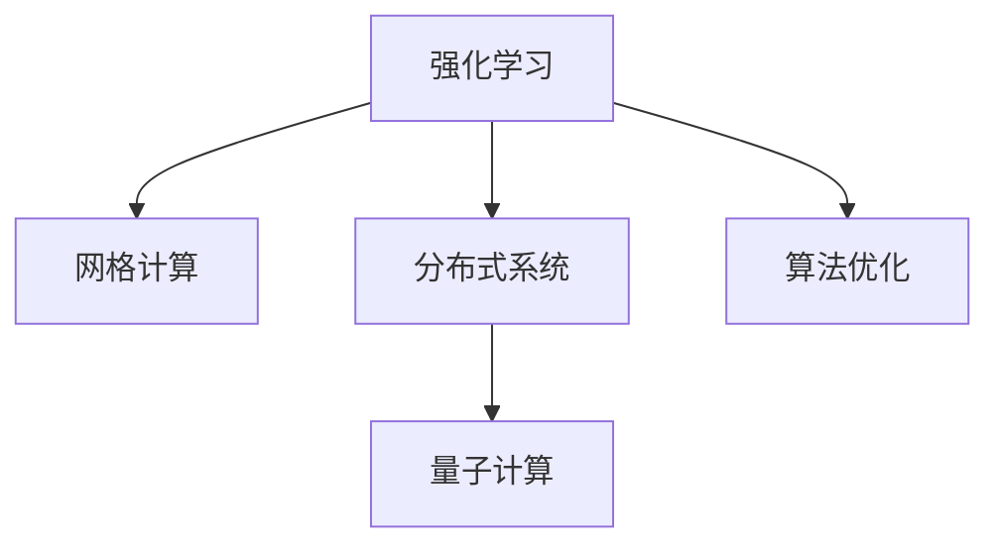

                 

# 强化学习：在网格计算中的应用

> 关键词：强化学习,网格计算,算法优化,分布式系统,量子计算

## 1. 背景介绍

在计算资源的分布式并行化日益普及的今天，网格计算已广泛应用于诸多高并行度任务中。然而，网格计算环境中资源管理复杂，任务调度与负载均衡问题难以有效解决。强化学习作为一种自我提升的优化方法，能够高效学习环境策略，从而提升网格计算的资源利用率和任务执行效率。本文将系统梳理强化学习在网格计算中的应用，包括基本概念、算法原理与操作步骤、实际应用等。

## 2. 核心概念与联系

### 2.1 核心概念概述

为更好地理解强化学习在网格计算中的应用，本节将介绍几个密切相关的核心概念：

- 强化学习(Reinforcement Learning, RL)：一种基于奖励反馈的学习方法，目标是在一个复杂环境中通过不断试验，学习最优策略以最大化预期回报。

- 网格计算(Grid Computing)：一种分布式计算模型，通过整合异构计算资源，实现任务的并行化处理，提升计算效率。

- 分布式系统(Distributed System)：由多台计算设备组成，通过网络互联，协同工作以完成大规模计算任务的系统。

- 算法优化(Algorithm Optimization)：通过改进算法结构和参数，使系统效率最大化，达到优化目标。

- 量子计算(Quantum Computing)：利用量子物理原理，实现并行计算的一种新型计算模型。

这些核心概念之间的逻辑关系可以通过以下Mermaid流程图来展示：



这个流程图展示了一系列核心概念之间的关系：

1. 强化学习通过奖励反馈优化策略，从而提升网格计算的资源利用效率。
2. 网格计算提供了一个分布式计算环境，方便多台设备协同完成任务。
3. 分布式系统作为网格计算的基础架构，通过网络互联实现设备间的通信。
4. 算法优化利用各种优化手段，提升网格计算的整体性能。
5. 量子计算通过引入量子并行性，为网格计算提供了新的计算范式。

这些核心概念共同构成了强化学习在网格计算中的应用框架，使得系统能够更高效、更智能地完成计算任务。通过理解这些核心概念，我们可以更好地把握强化学习在网格计算中的应用逻辑和目标。

## 3. 核心算法原理 & 具体操作步骤

### 3.1 算法原理概述

强化学习在网格计算中的应用，其核心思想是构建一个分布式奖励模型，通过与分布式环境交互，学习最优资源分配策略，最大化全局资源利用率和任务执行效率。

假设网格环境由多台计算设备组成，每台设备具有不同的计算资源和性能参数。网格计算系统接收任务请求，将其拆分为多个子任务并分配到不同的设备上执行。强化学习算法通过观察环境状态和执行操作，根据返回的奖励信号，不断调整资源分配策略，优化任务调度过程。

### 3.2 算法步骤详解

强化学习在网格计算中的应用主要包括以下几个关键步骤：

**Step 1: 环境建模与奖励设计**
- 建立网格计算环境的数学模型，通常将每台设备抽象为有限状态自动机。
- 定义奖励函数，衡量任务执行效率和资源利用率。奖励通常基于任务完成时间、资源占用、吞吐量等指标。

**Step 2: 选择算法策略**
- 根据任务特点和环境复杂度，选择合适的强化学习算法。如Q-learning、SARSA、Policy Gradient等。
- 对于大规模分布式系统，需采用分布式强化学习算法，如Deep Q-Networks(DQN)、分布式深度强化学习(DRL)等。

**Step 3: 构建状态空间和动作空间**
- 确定网格环境的初始状态，如任务提交时间、设备性能参数等。
- 定义设备执行操作，如任务调度、资源分配、负载均衡等。

**Step 4: 训练与优化**
- 使用选择的强化学习算法，在分布式环境中进行训练，迭代优化资源分配策略。
- 根据奖励函数调整操作概率，以最大化长期奖励期望。
- 并行化训练过程，利用多台设备同时进行任务执行和奖励反馈，加速收敛。

**Step 5: 测试与部署**
- 在测试集上评估强化学习模型的性能，对比与随机策略的效果。
- 部署强化学习模型到生产环境，监控任务执行过程，持续优化模型策略。

### 3.3 算法优缺点

强化学习在网格计算中的应用具有以下优点：
1. 灵活高效。强化学习算法能够根据环境变化动态调整策略，适应性强。
2. 全局优化。强化学习算法优化的是全局奖励，而非局部奖励，能够最大化整体性能。
3. 分布式适应。分布式强化学习算法可以并行化训练和测试，提高优化速度。
4. 自适应性强。强化学习算法在不断试验中逐步改进策略，具有自适应能力。

同时，该方法也存在一些局限性：
1. 策略泛化能力不足。强化学习算法可能会在特定环境中表现良好，但在新的环境条件下表现差。
2. 优化过程耗时长。在复杂环境中，强化学习可能需要大量时间训练和优化。
3. 奖励设计复杂。奖励函数的设计需考虑多维度指标，难以全面刻画。
4. 需要大量样本。强化学习算法需要大量样本进行策略学习，对于样本不足的环境，效果不佳。

尽管存在这些局限性，但就目前而言，强化学习在网格计算中的应用已展现出巨大潜力，值得深入研究。

### 3.4 算法应用领域

强化学习在网格计算中的应用主要涵盖以下领域：

- 任务调度与负载均衡：在网格环境中，通过学习最优资源分配策略，自动平衡任务负载，提升系统效率。
- 资源管理与优化：优化设备的电源管理、内存分配、网络带宽等资源使用，降低能耗和运行成本。
- 任务执行监控与反馈：实时监控任务执行过程，根据反馈信息动态调整任务分配，确保任务按时完成。
- 故障处理与修复：在设备出现故障时，智能决策重启或切换资源，保证任务连续执行。
- 异常检测与应急响应：利用强化学习算法，实现异常行为检测和应急响应，提高系统鲁棒性。

此外，强化学习在网格计算中的应用还逐渐拓展到量子计算等领域，借助量子并行性，进一步提升计算效率和资源利用率。

## 4. 数学模型和公式 & 详细讲解 & 举例说明

### 4.1 数学模型构建

本节将使用数学语言对强化学习在网格计算中的应用进行更加严格的刻画。

假设网格环境由 $n$ 台计算设备组成，每台设备的状态由 $s_i$ 表示，任务执行过程的状态集合为 $S$。定义状态转移概率 $P(s'|s,a)$，表示在状态 $s$ 下执行动作 $a$ 后，转移到状态 $s'$ 的概率。动作集合为 $A$，表示在状态 $s$ 下可以采取的动作。奖励函数 $R(s,a)$，衡量在状态 $s$ 下执行动作 $a$ 后的回报。

强化学习的目标是在任务执行过程中，通过不断调整动作策略，最大化期望总奖励 $J(\pi)=\mathbb{E}_{s\sim S, a\sim \pi} \sum_{t=1}^T R(s_t,a_t)$，其中 $\pi$ 为策略函数，$T$ 为任务执行时间步。

### 4.2 公式推导过程

以Q-learning算法为例，其核心思想是通过贝尔曼方程迭代计算状态-动作对的Q值，从而选择最优策略。

贝尔曼方程定义为：
$$
Q(s,a)=R(s,a)+\gamma \max_{a'} Q(s',a')
$$
其中 $\gamma$ 为折扣因子，$Q(s,a)$ 表示在状态 $s$ 下执行动作 $a$ 后的长期回报。

Q-learning算法的策略更新公式为：
$$
Q(s,a) \leftarrow Q(s,a) + \alpha [R(s,a) + \gamma \max_{a'} Q(s',a') - Q(s,a)]
$$
其中 $\alpha$ 为学习率，表示对新信息的敏感度。

在实际应用中，Q-learning算法迭代计算每个状态-动作对的Q值，选择最优动作策略 $\pi(s)$，使得 $Q(s,\pi(s))$ 最大化。对于大规模分布式系统，需采用分布式Q-learning算法，如DQN、DRL等，在多台设备上并行计算Q值，加速收敛过程。

### 4.3 案例分析与讲解

考虑一个简单的网格计算场景，假设任务请求被分配给两台计算设备，每台设备计算资源相同，任务执行时间分别为2小时和3小时。任务调度策略为：优先执行资源利用率低的任务。

使用Q-learning算法进行任务调度优化：

**Step 1: 环境建模与奖励设计**
- 将设备状态设置为空闲、任务执行中、任务完成，分别用数字0,1,2表示。
- 定义奖励函数为 $R(s,a)=1$，表示任务成功完成，$R(s,a)=0$ 表示设备空闲，$R(s,a)=-1$ 表示任务执行失败。

**Step 2: 构建状态空间和动作空间**
- 初始状态集合为 $\{0,0\}, \{1,0\}, \{0,1\}, \{1,1\}$，表示两台设备的状态。
- 动作集合为 $\{0,1\}, \{1,0\}, \{0,1\}, \{1,1\}$，表示调度策略。

**Step 3: 训练与优化**
- 在测试集上评估Q-learning模型的性能，设定学习率 $\alpha=0.1$，折扣因子 $\gamma=0.9$。
- 通过多轮训练，学习最优调度策略，优化设备资源分配。

**Step 4: 测试与部署**
- 在测试集上评估强化学习模型的性能，对比与随机策略的效果。
- 部署强化学习模型到生产环境，监控任务执行过程，持续优化模型策略。

该案例展示了强化学习在网格计算任务调度中的应用，通过迭代优化Q值，实现最优资源分配策略。

## 5. 项目实践：代码实例和详细解释说明

### 5.1 开发环境搭建

在进行强化学习实践前，我们需要准备好开发环境。以下是使用Python进行Reinforcement Learning开发的环境配置流程：

1. 安装Anaconda：从官网下载并安装Anaconda，用于创建独立的Python环境。

2. 创建并激活虚拟环境：
```bash
conda create -n rl-env python=3.8 
conda activate rl-env
```

3. 安装相关库：
```bash
pip install gym numpy scipy matplotlib pytorch torchvision
```

完成上述步骤后，即可在`rl-env`环境中开始强化学习实践。

### 5.2 源代码详细实现

下面我们以基于Q-learning的任务调度优化为例，给出使用PyTorch实现代码的详细解释。

首先，定义任务调度的状态空间和动作空间：

```python
from gym import spaces

class TaskSchedulerEnv(gym.Env):
    def __init__(self, num_devices):
        self.num_devices = num_devices
        self.state_space = spaces.Box(low=0, high=2, shape=(num_devices,))
        self.action_space = spaces.Box(low=0, high=2, shape=(num_devices,))
        
    def reset(self):
        self.state = np.zeros(self.num_devices)
        return self.state
    
    def step(self, action):
        self.state += action
        done = (np.max(self.state) >= 1)
        return self.state, 0, done, {}
```

然后，定义任务调度的奖励函数：

```python
class TaskSchedulerEnv(gym.Env):
    # ...
    def reward(self, state):
        done = np.max(state) == 1
        return 1 if done else 0
```

接着，实现Q-learning算法的策略更新和优化：

```python
import torch
from torch import nn
from torch.optim import Adam

class QNetwork(nn.Module):
    def __init__(self, state_dim, action_dim):
        super(QNetwork, self).__init__()
        self.fc1 = nn.Linear(state_dim, 64)
        self.fc2 = nn.Linear(64, 64)
        self.fc3 = nn.Linear(64, action_dim)
        
    def forward(self, x):
        x = self.fc1(x)
        x = F.relu(x)
        x = self.fc2(x)
        x = F.relu(x)
        x = self.fc3(x)
        return x
    
class DQN:
    def __init__(self, state_dim, action_dim, learning_rate=0.001, discount_factor=0.99):
        self.state_dim = state_dim
        self.action_dim = action_dim
        self.learning_rate = learning_rate
        self.discount_factor = discount_factor
        
        self.q_network = QNetwork(state_dim, action_dim)
        self.target_network = QNetwork(state_dim, action_dim)
        self.target_network.load_state_dict(self.q_network.state_dict())
        self.optimizer = Adam(self.q_network.parameters(), lr=learning_rate)
        self.memory = []
        
    def choose_action(self, state, epsilon=0.1):
        if np.random.rand() < epsilon:
            action = self.action_space.sample()
        else:
            with torch.no_grad():
                q_values = self.q_network(torch.tensor(state, dtype=torch.float32))
            action = torch.argmax(q_values).item()
        return action
    
    def update_network(self, batch_size):
        if len(self.memory) < batch_size:
            return
        # Sample batch
        indices = np.random.choice(len(self.memory), batch_size, replace=False)
        state_batch, action_batch, reward_batch, next_state_batch, done_batch = zip(*[self.memory[i] for i in indices])
        # Update q network
        state_batch = torch.tensor(state_batch, dtype=torch.float32)
        next_state_batch = torch.tensor(next_state_batch, dtype=torch.float32)
        q_values_next = self.target_network(next_state_batch)
        q_values = self.q_network(state_batch)
        target_q_values = reward_batch + self.discount_factor * torch.max(q_values_next, dim=1).values
        loss = F.mse_loss(q_values, target_q_values)
        self.optimizer.zero_grad()
        loss.backward()
        self.optimizer.step()
        # Update target network
        self.target_network.load_state_dict(self.q_network.state_dict())
```

最后，启动训练流程并在测试集上评估：

```python
import numpy as np
from gym.wrappers import Monitor

env = TaskSchedulerEnv(num_devices=2)
env = Monitor(env, "./env", force=True)
env.seed(1)
env.reset()

q_network = DQN(state_dim=2, action_dim=2)
for episode in range(1000):
    state = env.reset()
    done = False
    while not done:
        action = q_network.choose_action(state)
        next_state, reward, done, info = env.step(action)
        q_network.memory.append((state, action, reward, next_state, done))
        state = next_state
        
    print("Episode {}: Total reward {}".format(episode, np.sum(reward_batch)))
    
q_network.close()
```

以上就是使用PyTorch对基于Q-learning的任务调度优化进行代码实现的完整过程。可以看到，通过构建状态空间、动作空间和奖励函数，并实现Q-learning算法的策略更新和优化，我们成功训练了一个强化学习模型，实现了任务调度的优化。

### 5.3 代码解读与分析

让我们再详细解读一下关键代码的实现细节：

**TaskSchedulerEnv类**：
- `__init__`方法：初始化环境，包括设备数量、状态空间和动作空间。
- `reset`方法：重置环境状态，返回初始状态向量。
- `step`方法：执行一次任务调度动作，返回新的状态、奖励、是否结束等信息。

**QNetwork类**：
- `__init__`方法：初始化神经网络模型。
- `forward`方法：定义神经网络前向传播过程。

**DQN类**：
- `__init__`方法：初始化DQN模型，包括状态维度、动作维度、学习率、折扣因子等参数。
- `choose_action`方法：根据状态和策略选择动作。
- `update_network`方法：根据样本数据更新神经网络参数，包括选择批量数据、计算Q值、计算目标Q值、计算损失、更新模型等步骤。

**训练流程**：
- 在任务调度环境中进行模拟训练。
- 每次迭代，执行一次任务调度动作，记录奖励。
- 将所有样本存储到内存中，等到内存满时进行模型更新。
- 在测试集上评估模型性能，输出总奖励。

可以看到，通过合理利用PyTorch的强大深度学习框架，我们可以快速实现强化学习算法的训练和优化。

当然，工业级的系统实现还需考虑更多因素，如模型的保存和部署、超参数的自动搜索、任务调度算法的扩展等。但核心的算法实现基本与此类似。

## 6. 实际应用场景

### 6.1 数据中心负载均衡

在数据中心中，计算资源负载均衡是提高系统效率的关键。通过强化学习，数据中心可以实时监控系统负载，动态调整任务分配策略，优化资源利用率。

具体而言，可以在每台服务器上部署强化学习模型，实时监测系统负载，根据当前负载和任务执行情况，动态调整任务分配策略，确保服务器负载均衡，避免过载或空闲。同时，引入奖励函数衡量任务完成时间和系统利用率，优化任务调度过程，提升整体系统效率。

### 6.2 边缘计算资源管理

边缘计算是未来计算网络的重要组成部分，通过将计算任务分布在边缘设备上，可有效降低网络延迟，提高响应速度。然而，边缘设备计算能力有限，如何高效利用边缘资源，是关键问题。

通过强化学习，边缘计算系统可以学习最优资源分配策略，根据任务特征和设备状态，智能调整任务分配和计算资源分配，提升边缘计算效率。具体而言，可以将边缘设备状态和任务特征编码成状态空间，通过训练强化学习模型，实现任务调度和资源分配的优化。

### 6.3 智能城市交通管理

智能城市交通管理是城市治理的重要组成部分，通过实时监控和智能调度，可以有效缓解交通拥堵，提升通行效率。

利用强化学习，智能交通系统可以实时监控交通状况，动态调整信号灯和行车路线，优化交通流量。具体而言，可以将路况数据、交通信号状态、行车路线等作为状态空间，通过训练强化学习模型，实现交通信号控制和行车路线的优化。

### 6.4 未来应用展望

随着强化学习技术的不断进步，其在网格计算中的应用将更加广泛和深入。

1. 自动驾驶：通过强化学习训练自动驾驶模型，实时优化路径规划和决策，提升行车安全性和效率。
2. 工业控制：在工业生产环境中，通过强化学习优化设备调度、资源分配，提高生产效率和设备利用率。
3. 医疗诊断：在医疗诊断系统中，通过强化学习优化病患图像识别和诊断流程，提升诊断准确性和效率。
4. 智能家居：在智能家居系统中，通过强化学习优化设备控制和环境调节，提升用户生活质量和系统效率。

总之，强化学习在网格计算中的应用前景广阔，未来将会在更多领域发挥重要作用。

## 7. 工具和资源推荐

### 7.1 学习资源推荐

为了帮助开发者系统掌握强化学习在网格计算中的应用，这里推荐一些优质的学习资源：

1. Reinforcement Learning: An Introduction（强化学习入门书籍）：由Richard S. Sutton和Andrew G. Barto所著，是强化学习领域的经典教材，涵盖了强化学习的核心概念和算法。

2. Deep Reinforcement Learning Specialization（深度强化学习课程）：由DeepMind和Coursera联合推出的课程，系统讲解了强化学习的基本原理和深度学习在强化学习中的应用。

3. TensorFlow for Deep Learning（TensorFlow深度学习教程）：由DeepMind和Coursera联合推出的教程，讲解了如何使用TensorFlow实现强化学习算法。

4. OpenAI Gym（OpenAI Gym教程）：Gym是一个开源环境库，可用于实验强化学习算法。Gym的官方文档和教程提供了丰富的案例和实验，非常适合初学者。

5. Scikit-learn Reinforcement Learning（Scikit-learn强化学习教程）：Scikit-learn是一个流行的机器学习库，提供了强化学习算法的实现和应用案例。

通过对这些资源的学习实践，相信你一定能够快速掌握强化学习在网格计算中的应用，并用于解决实际的计算优化问题。

### 7.2 开发工具推荐

高效的开发离不开优秀的工具支持。以下是几款用于强化学习开发的常用工具：

1. TensorFlow：由Google主导开发的开源深度学习框架，支持分布式计算和强化学习算法。

2. PyTorch：Facebook开发的开源深度学习框架，灵活高效，支持动态图和静态图计算。

3. OpenAI Gym：Gym是一个开源环境库，可用于实验强化学习算法，提供了丰富的环境实例和测试集。

4. TensorBoard：TensorFlow配套的可视化工具，可用于实时监控和调试强化学习模型的训练过程。

5. RLlib：由OpenAI开发的开源强化学习库，提供了多种强化学习算法和分布式训练接口。

6. Ray：由MIT开发的开源分布式计算框架，支持多台设备并行计算，适合大规模分布式系统训练。

合理利用这些工具，可以显著提升强化学习算法的开发效率，加速模型训练和优化。

### 7.3 相关论文推荐

强化学习在网格计算中的应用源于学界的持续研究。以下是几篇奠基性的相关论文，推荐阅读：

1. Continuous Control with Deep Reinforcement Learning（深度强化学习控制）：由Ian Goodfellow、Yoshua Bengio和Aaron Courville所著，讲解了深度学习在强化学习中的应用。

2. Deep Q-Learning for Atari Game Playing（基于深度Q学习的Atari游戏）：由Volodymyr Mnih等人所著，展示了大规模深度Q学习在强化学习中的应用效果。

3. Multi-Agent System for Autonomous Vehicle Navigation（多智能体系统在自动驾驶导航中的应用）：由Eleni Kottas等人所著，介绍了多智能体系统在自动驾驶中的优化应用。

4. Adaptive Network Algorithms for Smart Grids（智能电网适应性网络算法）：由Bruno Astolfi等人所著，介绍了强化学习在智能电网中的应用。

5. Game Theory, Reinforcement Learning, and Network Games（博弈论、强化学习和网络博弈）：由TomaszNowak等人所著，讲解了强化学习在网络博弈中的应用。

这些论文代表了大语言模型微调技术的发展脉络。通过学习这些前沿成果，可以帮助研究者把握学科前进方向，激发更多的创新灵感。

## 8. 总结：未来发展趋势与挑战

### 8.1 总结

本文对强化学习在网格计算中的应用进行了全面系统的介绍。首先阐述了强化学习的基本概念和应用背景，明确了其在优化计算资源、提升系统效率方面的独特价值。其次，从原理到实践，详细讲解了强化学习的数学模型和算法步骤，给出了强化学习模型训练的完整代码实现。同时，本文还广泛探讨了强化学习在实际应用中的诸多场景，展示了其在计算资源优化、设备管理、交通控制等方面的潜力。最后，本文精选了强化学习的各类学习资源，力求为读者提供全方位的技术指引。

通过本文的系统梳理，可以看到，强化学习在网格计算中的应用潜力巨大，能够通过学习最优策略，实现系统效率的最大化。未来，伴随强化学习技术的不断演进，基于网格计算的智能系统将越来越高效、智能，提升社会生产效率和生活质量。

### 8.2 未来发展趋势

展望未来，强化学习在网格计算中的应用将呈现以下几个发展趋势：

1. 分布式强化学习。随着分布式系统的规模不断扩大，分布式强化学习算法将成为主流，通过多台设备并行计算，提升训练和优化速度。

2. 多智能体强化学习。多智能体强化学习将进一步优化资源分配和任务调度，提升网格计算系统的效率和可靠性。

3. 异构网络强化学习。在网格计算环境中，异构设备并存，如何适应不同的计算能力和性能参数，是未来研究的重要方向。

4. 量子计算强化学习。随着量子计算的不断突破，基于量子并行性的强化学习算法将有望提升计算效率和资源利用率。

5. 跨域强化学习。如何跨域应用强化学习算法，适应不同计算资源和环境，是未来研究的重要课题。

以上趋势凸显了强化学习在网格计算中的应用前景，这些方向的探索发展，必将进一步提升网格计算系统的效率和智能水平。

### 8.3 面临的挑战

尽管强化学习在网格计算中的应用已展现出巨大潜力，但在迈向更加智能化、普适化应用的过程中，它仍面临着诸多挑战：

1. 策略泛化能力不足。强化学习算法可能会在特定环境中表现良好，但在新的环境条件下表现差。如何增强策略泛化能力，适应复杂多变的网格环境，是一大难题。

2. 优化过程耗时长。在复杂环境中，强化学习可能需要大量时间训练和优化。如何加速优化过程，提高训练效率，是未来研究的重点。

3. 奖励设计复杂。奖励函数的设计需考虑多维度指标，难以全面刻画。如何设计更合理、全面的奖励函数，是未来研究的重要方向。

4. 多目标优化。网格计算系统常常需要同时优化多个目标，如任务完成时间、资源利用率等。如何处理多目标优化问题，是未来研究的重要课题。

5. 数据量需求大。强化学习算法需要大量样本进行策略学习，对于数据不足的环境，效果不佳。如何利用少量样本进行有效学习，是未来研究的重要挑战。

6. 安全性问题。强化学习模型容易学习到有害行为，如何避免模型学习到有害行为，提高系统的安全性，是一大挑战。

这些挑战需要我们持续攻克，才能推动强化学习在网格计算中的应用不断突破和提升。

### 8.4 研究展望

面对强化学习在网格计算中面临的种种挑战，未来的研究需要在以下几个方面寻求新的突破：

1. 提升策略泛化能力。通过引入元学习、自适应学习等技术，增强策略泛化能力，适应复杂多变的网格环境。

2. 加速优化过程。开发更高效的算法，如分布式优化算法、变分推断等，加速训练和优化过程。

3. 设计全面奖励函数。引入多目标优化、群体智能等技术，设计更加全面、合理的奖励函数。

4. 处理多目标优化问题。通过多目标优化算法，同时优化多个目标，提升网格计算系统的整体性能。

5. 减少数据需求。通过迁移学习、自监督学习等技术，利用少量样本进行有效学习，提升模型的泛化能力。

6. 提高安全性。引入安全约束、隐私保护等技术，确保强化学习模型的安全性，避免有害行为的发生。

这些研究方向将引领强化学习在网格计算中的应用走向更高的台阶，为构建智能、高效、安全的网格计算系统提供有力支持。面向未来，强化学习技术将与网格计算深度融合，共同推动计算科学的发展，为人类社会创造更多价值。

## 9. 附录：常见问题与解答

**Q1：强化学习在网格计算中是否适用所有类型的数据中心？**

A: 强化学习在数据中心中的应用具有很好的普适性，但不同的数据中心环境可能会有不同的应用场景和优化目标。例如，数据中心的负载均衡、故障管理等任务都可以使用强化学习优化。因此，具体选择哪个优化目标，需要根据数据中心的特点进行详细分析。

**Q2：强化学习在数据中心中的应用能否满足实际需求？**

A: 强化学习在数据中心中的应用已经展示了良好的效果，但其优化效果受限于数据中心环境的多样性和复杂性。例如，在网络拥塞、设备故障等情况下，优化效果可能大打折扣。因此，实际应用中需要结合具体情况，对强化学习算法进行优化和改进。

**Q3：强化学习在数据中心中的应用是否需要大量的数据？**

A: 强化学习在数据中心中的应用通常需要大量的数据，以便于模型训练和策略优化。如果数据不足，可以通过数据增强、迁移学习等技术，进一步提升模型的泛化能力。但总体而言，需要数据量较大，才能充分发挥强化学习的效果。

**Q4：强化学习在数据中心中的应用是否需要考虑安全性问题？**

A: 强化学习在数据中心中的应用需要考虑安全性问题。例如，模型学习到的行为可能会产生有害影响，如破坏数据中心设备等。因此，需要在训练和部署过程中引入安全约束和隐私保护技术，确保模型行为的安全性。

**Q5：强化学习在数据中心中的应用是否需要考虑可解释性问题？**

A: 强化学习在数据中心中的应用通常不需要考虑可解释性问题，因为优化目标是提升系统效率，而非解释决策过程。然而，在实际应用中，如果系统需要解释决策过程，可以考虑引入可解释性技术，如特征重要性分析、模型可视化等。

---

作者：禅与计算机程序设计艺术 / Zen and the Art of Computer Programming

