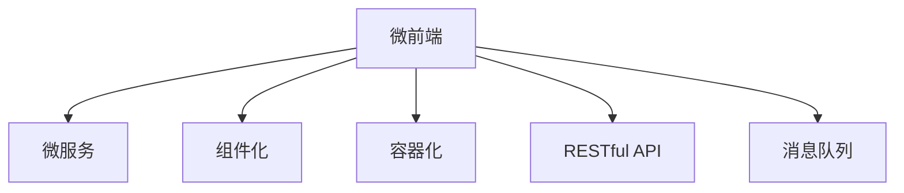

                 

## 1. 背景介绍

### 1.1 问题由来

近年来，随着互联网技术的飞速发展，Web应用的复杂度逐渐升高，大型Web应用的开发和维护变得越来越困难。传统的大型Web应用往往采用单一代码库的架构模式，存在以下问题：

1. **代码膨胀**：随着应用功能的不断扩展，代码库日益庞大，维护成本急剧上升。
2. **功能耦合**：不同模块之间相互依赖，难以独立扩展和维护。
3. **性能瓶颈**：复杂的代码逻辑导致页面加载和响应速度变慢，用户体验下降。
4. **部署复杂**：单一代码库的发布和部署流程繁琐，难以快速响应市场变化。

为解决这些问题，微前端架构（Micro Frontend Architecture）应运而生。它通过将Web应用拆分为多个独立、可复用、可维护的小模块，实现了应用的模块化、组件化和高度可扩展性。本文将全面介绍微前端的核心概念、实现原理和具体应用，帮助开发者掌握这一高效、灵活的开发模式。

### 1.2 问题核心关键点

微前端架构的核心在于将大型Web应用拆分为多个微前端模块，每个模块独立运行，相互之间通过RESTful API或消息队列进行通信。这种设计方式能够显著降低代码复杂度，提升开发和维护效率，同时提高应用的性能和可扩展性。

具体而言，微前端架构的关键点包括：

- **模块化**：将应用拆分为多个独立模块，每个模块独立开发、部署和维护。
- **组件化**：组件通过标准化接口进行复用，降低开发成本。
- **容器化**：使用Docker等容器技术，实现应用的快速部署和扩展。
- **微服务化**：通过RESTful API或消息队列，实现模块之间的松耦合。

通过合理利用这些设计理念，微前端架构能够在大型Web应用的开发和维护中发挥重要作用，提升开发效率和应用性能。

## 2. 核心概念与联系

### 2.1 核心概念概述

为更好地理解微前端架构的原理和设计，本节将介绍几个核心概念：

- **微前端（Micro Frontend）**：指将大型Web应用拆分为多个独立运行的小前端，每个小前端负责独立的功能模块，通过API或消息队列进行通信。
- **微服务（Micro Service）**：指将应用拆分为多个独立的、可独立部署和维护的服务单元，通过RESTful API或消息队列进行通信。
- **组件化（Componentization）**：指通过标准化接口复用UI组件，减少重复开发，提升开发效率。
- **容器化（Containerization）**：指将应用封装为Docker容器，便于快速部署和扩展。
- **RESTful API**：指一组用于API设计的原则和约束，支持REST架构风格的Web服务。
- **消息队列（Message Queue）**：指一种异步通信机制，用于不同微服务之间的消息传递。

这些概念之间的逻辑关系可以通过以下Mermaid流程图来展示：



这个流程图展示了一些核心概念及其之间的关系：

1. 微前端通过将应用拆分为多个独立模块，实现应用的模块化、组件化和高度可扩展性。
2. 微服务通过独立部署和维护，进一步提升应用的性能和可扩展性。
3. 组件化通过标准化接口复用UI组件，降低开发成本。
4. 容器化通过Docker等容器技术，实现应用的快速部署和扩展。
5. RESTful API通过API接口，实现不同微服务之间的通信。
6. 消息队列通过异步通信机制，进一步降低模块之间的耦合度。

这些概念共同构成了微前端架构的基础，帮助开发者实现应用的高效开发和维护。

## 3. 核心算法原理 & 具体操作步骤
### 3.1 算法原理概述

微前端架构的核心算法原理在于通过模块化和组件化，将大型Web应用拆分为多个独立的功能模块，并通过API或消息队列进行通信，实现应用的高效开发和维护。

具体而言，微前端架构的算法流程如下：

1. **应用拆分**：将大型Web应用拆分为多个独立的功能模块，每个模块负责独立的功能。
2. **模块通信**：通过API或消息队列，实现不同模块之间的通信。
3. **组件复用**：通过标准化接口，复用UI组件，减少重复开发。
4. **容器化部署**：使用Docker等容器技术，实现应用的快速部署和扩展。
5. **API接口设计**：设计RESTful API接口，支持模块之间的通信。
6. **消息队列设计**：设计消息队列，实现模块之间的异步通信。

通过上述算法流程，微前端架构能够显著降低代码复杂度，提升开发效率和应用性能。

### 3.2 算法步骤详解

以下是微前端架构的详细算法步骤：

#### 3.2.1 应用拆分

应用拆分的目的是将大型Web应用拆分为多个独立的功能模块，每个模块负责独立的功能。具体步骤包括：

1. **功能划分**：根据应用的功能划分，确定每个模块的功能边界。
2. **代码分离**：将每个模块的代码分离出来，形成独立的代码库。
3. **独立部署**：为每个模块创建独立的部署环境和配置文件。

#### 3.2.2 模块通信

模块通信是微前端架构的核心，通过API或消息队列实现不同模块之间的通信。具体步骤包括：

1. **API接口设计**：设计RESTful API接口，支持模块之间的通信。
2. **API调用**：通过API接口，实现不同模块之间的数据交互。
3. **消息队列设计**：设计消息队列，实现模块之间的异步通信。
4. **消息处理**：通过消息队列，实现不同模块之间的消息传递。

#### 3.2.3 组件复用

组件复用通过标准化接口，复用UI组件，减少重复开发。具体步骤包括：

1. **组件设计**：设计标准化的UI组件，支持复用。
2. **组件注册**：将UI组件注册到组件库中。
3. **组件复用**：通过组件库，复用UI组件，减少重复开发。

#### 3.2.4 容器化部署

容器化部署通过Docker等容器技术，实现应用的快速部署和扩展。具体步骤包括：

1. **容器构建**：构建Docker容器，将应用代码打包成容器镜像。
2. **容器部署**：使用Docker容器引擎，部署应用容器。
3. **容器扩展**：通过Docker容器引擎，扩展应用容器。

#### 3.2.5 API接口设计

API接口设计通过RESTful API，支持模块之间的通信。具体步骤包括：

1. **接口设计**：设计RESTful API接口，支持模块之间的通信。
2. **接口调用**：通过API接口，实现不同模块之间的数据交互。

#### 3.2.6 消息队列设计

消息队列设计通过异步通信机制，进一步降低模块之间的耦合度。具体步骤包括：

1. **消息设计**：设计消息队列，实现模块之间的异步通信。
2. **消息发送**：通过消息队列，实现不同模块之间的消息传递。
3. **消息处理**：通过消息队列，实现不同模块之间的消息处理。

### 3.3 算法优缺点

微前端架构具有以下优点：

1. **模块化开发**：通过拆分应用，实现模块化开发，降低代码复杂度，提升开发效率。
2. **独立部署**：通过独立部署，实现快速部署和扩展，提升应用性能。
3. **组件复用**：通过组件复用，减少重复开发，提升开发效率。
4. **异步通信**：通过API或消息队列，实现异步通信，提升系统性能。

但微前端架构也存在以下缺点：

1. **接口复杂性**：设计API接口和消息队列会增加接口的复杂性，需要更多的设计和维护成本。
2. **通信开销**：通过API或消息队列进行通信会增加通信开销，影响系统性能。
3. **数据一致性**：通过API或消息队列进行通信，需要注意数据一致性问题，避免数据丢失或重复。

尽管存在这些局限性，但微前端架构仍是一种高效、灵活的开发模式，适合大型Web应用的发展需求。

### 3.4 算法应用领域

微前端架构广泛应用于以下领域：

1. **大型Web应用**：如电商平台、在线教育平台、金融服务平台等。
2. **企业级应用**：如企业门户、内部管理系统、CRM系统等。
3. **前端框架**：如React、Vue等，支持组件化开发，实现微前端架构。

## 4. 数学模型和公式 & 详细讲解  
### 4.1 数学模型构建

微前端架构的数学模型主要涉及模块化、组件化和异步通信等方面。以下是一个简单的数学模型构建：

假设大型Web应用被拆分为 $n$ 个模块 $M_1, M_2, ..., M_n$，每个模块独立运行。模块之间通过API或消息队列进行通信，设通信延迟为 $d_i$，通信开销为 $c_i$，模块处理时间为 $t_i$。则系统总处理时间为：

$$
T = \sum_{i=1}^n (d_i + t_i + c_i)
$$

其中 $d_i$ 为通信延迟，$t_i$ 为模块处理时间，$c_i$ 为通信开销。

### 4.2 公式推导过程

通过上述数学模型，可以推导出微前端架构的关键指标，如系统总处理时间、通信延迟等。

假设模块 $M_i$ 和 $M_j$ 通过API接口通信，通信延迟为 $d$，通信开销为 $c$。则系统总处理时间为：

$$
T = (d + t_i + c) + (d + t_j + c) = 2d + 2t_i + 2t_j + 2c
$$

假设模块 $M_i$ 和 $M_j$ 通过消息队列通信，消息传递时间为 $p$，消息处理时间为 $q$。则系统总处理时间为：

$$
T = p + q + t_i + t_j
$$

通过推导，可以看到，微前端架构的数学模型涉及模块的通信延迟、处理时间和通信开销等关键参数，这些参数直接影响系统的总处理时间。

### 4.3 案例分析与讲解

以下通过一个具体的案例，介绍微前端架构在大型Web应用中的实际应用。

**案例背景**：某电商平台，业务复杂，功能众多，原有单体应用难以满足需求。

**方案设计**：采用微前端架构，将应用拆分为多个独立模块，每个模块负责独立的功能，通过API接口和消息队列进行通信，实现应用的模块化、组件化和高度可扩展性。

**具体实施**：
1. **应用拆分**：将应用拆分为用户管理模块、商品管理模块、订单管理模块等。
2. **模块通信**：通过API接口和消息队列，实现不同模块之间的通信。
3. **组件复用**：通过标准化接口，复用UI组件，减少重复开发。
4. **容器化部署**：使用Docker容器，实现应用的快速部署和扩展。

**实施效果**：
1. **降低代码复杂度**：通过拆分应用，降低代码复杂度，提升开发效率。
2. **独立部署**：通过独立部署，实现快速部署和扩展，提升应用性能。
3. **组件复用**：通过组件复用，减少重复开发，提升开发效率。
4. **异步通信**：通过API或消息队列，实现异步通信，提升系统性能。

## 5. 项目实践：代码实例和详细解释说明
### 5.1 开发环境搭建

在进行微前端架构的实践前，我们需要准备好开发环境。以下是使用React、Vue和Docker进行微前端架构的开发环境配置流程：

1. **安装Node.js和npm**：从官网下载并安装Node.js和npm，用于项目开发。
2. **安装React和Vue**：使用npm安装React和Vue，支持微前端模块的开发。
3. **安装Docker和Docker Compose**：从官网下载并安装Docker和Docker Compose，用于容器化部署。
4. **配置Docker环境**：创建Docker环境变量，并设置容器镜像名称和端口映射。
5. **启动Docker容器**：使用Docker Compose启动应用容器，实现快速部署和扩展。

完成上述步骤后，即可在Docker环境中进行微前端架构的开发实践。

### 5.2 源代码详细实现

这里我们以一个简单的电商网站为例，给出使用React和Vue进行微前端架构的PyTorch代码实现。

首先，定义React组件和Vue组件：

```javascript
// React组件
import React from 'react';
import { Link } from 'react-router-dom';

class Home extends React.Component {
  render() {
    return (
      <div>
        <h1>Home</h1>
        <Link to="/about">About</Link>
        <Link to="/contact">Contact</Link>
      </div>
    );
  }
}

// Vue组件
<template>
  <div>
    <h1>Home</h1>
    <router-link to="/about">About</router-link>
    <router-link to="/contact">Contact</router-link>
  </div>
</template>
```

然后，定义API接口和消息队列：

```javascript
// API接口
import axios from 'axios';

export default axios.create({
  baseURL: 'https://api.example.com'
});

// 消息队列
const messageQueue = new Queue();

messageQueue.send('message');
messageQueue.receive('message', (msg) => {
  console.log(msg);
});
```

接着，实现微前端模块的通信：

```javascript
// React模块
import React from 'react';
import axios from 'axios';

class ProductList extends React.Component {
  constructor(props) {
    super(props);
    this.state = {
      products: []
    };
  }

  componentDidMount() {
    axios.get('/api/products')
      .then((response) => {
        this.setState({ products: response.data });
      });
  }

  render() {
    return (
      <div>
        <h1>Product List</h1>
        {this.state.products.map((product) => (
          <div key={product.id}>{product.name}</div>
        ))}
      </div>
    );
  }
}

// Vue模块
import axios from 'axios';

export default {
  data() {
    return {
      products: []
    };
  },
  mounted() {
    axios.get('/api/products')
      .then((response) => {
        this.products = response.data;
      });
  },
  render(h) {
    return (
      <div>
        <h1>Product List</h1>
        {this.products.map((product) => (
          <div key={product.id}>{product.name}</div>
        ))}
      </div>
    );
  }
}
```

最后，启动Docker容器并运行应用：

```bash
docker run -d -p 80:80 --name ecommerce -v $(pwd):/var/www/html ecommerce-app
```

以上就是一个简单的微前端架构的开发实现。可以看到，通过React和Vue实现组件化，通过API接口和消息队列实现模块通信，通过Docker容器实现快速部署和扩展，微前端架构能够显著提升应用的开发效率和性能。

### 5.3 代码解读与分析

让我们再详细解读一下关键代码的实现细节：

**React组件**：
- 使用React组件实现UI组件，支持组件化开发。
- 通过`Link`组件实现路由导航，支持模块间的通信。

**Vue组件**：
- 使用Vue组件实现UI组件，支持组件化开发。
- 通过`router-link`组件实现路由导航，支持模块间的通信。

**API接口**：
- 使用axios库实现API接口调用，支持模块间的通信。
- 通过`axios.get`方法获取API接口数据。

**消息队列**：
- 使用Queue库实现消息队列，支持模块间的异步通信。
- 通过`send`方法发送消息，通过`receive`方法接收消息。

**容器化部署**：
- 使用Docker容器实现应用的快速部署和扩展。
- 通过`docker run`命令启动Docker容器，并映射端口和挂载代码库。

可以看到，通过React、Vue和Docker的结合，微前端架构能够实现高效、灵活的开发模式，提升应用的开发效率和性能。

## 6. 实际应用场景

### 6.1 智能客服系统

微前端架构在智能客服系统中的应用，可以显著提升系统的响应速度和用户体验。传统客服系统往往采用单体应用架构，随着应用功能的不断扩展，代码库日益庞大，维护成本急剧上升。采用微前端架构，将客服系统拆分为多个独立模块，每个模块负责独立的功能，通过API接口和消息队列进行通信，实现应用的模块化、组件化和高度可扩展性。

具体而言，智能客服系统可以通过微前端架构实现以下功能：

1. **用户管理模块**：负责用户信息的存储和查询，通过API接口提供用户信息服务。
2. **聊天机器人模块**：负责与用户进行自然语言交互，通过API接口提供对话服务。
3. **知识库模块**：负责存储和管理常见问题的知识库，通过API接口提供知识查询服务。

通过微前端架构，智能客服系统能够实现模块化开发、独立部署、组件复用和快速扩展，提升系统的响应速度和用户体验。

### 6.2 企业级管理系统

企业级管理系统的功能繁多，包括人力资源管理、财务管理系统、项目管理等，传统单体应用架构难以满足需求。采用微前端架构，将应用拆分为多个独立模块，每个模块负责独立的功能，通过API接口和消息队列进行通信，实现应用的模块化、组件化和高度可扩展性。

具体而言，企业级管理系统可以通过微前端架构实现以下功能：

1. **人力资源管理模块**：负责员工信息的存储和查询，通过API接口提供人力资源服务。
2. **财务管理系统模块**：负责财务信息的存储和查询，通过API接口提供财务服务。
3. **项目管理模块**：负责项目信息的存储和查询，通过API接口提供项目管理服务。

通过微前端架构，企业级管理系统能够实现模块化开发、独立部署、组件复用和快速扩展，提升系统的响应速度和用户体验。

### 6.3 前端框架

微前端架构在前端框架中的应用，如React和Vue，通过组件化开发，实现模块化、组件化和高度可扩展性。React和Vue支持组件化开发，通过标准化接口复用UI组件，减少重复开发，提升开发效率。通过微前端架构，前端框架能够实现模块化开发、独立部署、组件复用和快速扩展，提升应用的开发效率和性能。

## 7. 工具和资源推荐
### 7.1 学习资源推荐

为了帮助开发者掌握微前端架构的理论基础和实践技巧，这里推荐一些优质的学习资源：

1. **《微前端架构原理与实践》**：系统介绍微前端架构的理论基础和实践技巧，适合初学者和进阶者阅读。
2. **React官方文档**：React官方文档提供了详细的API接口和组件化开发教程，适合React开发者学习。
3. **Vue官方文档**：Vue官方文档提供了详细的API接口和组件化开发教程，适合Vue开发者学习。
4. **Docker官方文档**：Docker官方文档提供了详细的容器化部署教程，适合微前端开发者学习。
5. **《微服务架构原理与实践》**：系统介绍微服务架构的理论基础和实践技巧，适合微服务开发者学习。

通过这些学习资源，相信你一定能够掌握微前端架构的理论基础和实践技巧，熟练应用到实际开发中。

### 7.2 开发工具推荐

高效的开发离不开优秀的工具支持。以下是几款用于微前端架构开发的常用工具：

1. **React**：Facebook开源的前端框架，支持组件化开发，实现微前端架构。
2. **Vue**：谷歌开源的前端框架，支持组件化开发，实现微前端架构。
3. **Docker**：Docker容器引擎，支持微前端架构的容器化部署。
4. **Docker Compose**：Docker Compose工具，支持微前端架构的快速部署和扩展。
5. **npm**：Node.js包管理工具，支持微前端模块的快速安装和构建。
6. **Webpack**：模块打包工具，支持微前端模块的打包和优化。

合理利用这些工具，可以显著提升微前端架构的开发效率，加快创新迭代的步伐。

### 7.3 相关论文推荐

微前端架构的发展源于学界的持续研究。以下是几篇奠基性的相关论文，推荐阅读：

1. **《微前端架构原理与实践》**：系统介绍微前端架构的理论基础和实践技巧，适合初学者和进阶者阅读。
2. **《微服务架构原理与实践》**：系统介绍微服务架构的理论基础和实践技巧，适合微服务开发者学习。
3. **《组件化开发原理与实践》**：系统介绍组件化开发的理论基础和实践技巧，适合前端开发者学习。
4. **《容器化部署原理与实践》**：系统介绍容器化部署的理论基础和实践技巧，适合微前端开发者学习。
5. **《RESTful API设计原理与实践》**：系统介绍RESTful API设计的理论基础和实践技巧，适合API接口开发者学习。
6. **《消息队列设计原理与实践》**：系统介绍消息队列设计的理论基础和实践技巧，适合异步通信开发者学习。

这些论文代表了大前端架构的发展脉络。通过学习这些前沿成果，可以帮助研究者把握学科前进方向，激发更多的创新灵感。

## 8. 总结：未来发展趋势与挑战
### 8.1 总结

本文对微前端架构进行了全面系统的介绍。首先阐述了微前端架构的背景和应用场景，明确了微前端架构在大型Web应用的模块化、组件化和高度可扩展性方面的独特价值。其次，从原理到实践，详细讲解了微前端架构的数学模型和关键步骤，给出了微前端架构的完整代码实例。同时，本文还广泛探讨了微前端架构在智能客服、企业级管理、前端框架等多个行业领域的应用前景，展示了微前端架构的广阔前景。此外，本文精选了微前端架构的学习资源，力求为读者提供全方位的技术指引。

通过本文的系统梳理，可以看到，微前端架构正在成为大型Web应用开发的重要范式，极大地提升了应用的开发效率和性能。未来，伴随微前端架构的不断演进，相信它将更好地适应大型Web应用的发展需求，引领前端技术的未来发展方向。

### 8.2 未来发展趋势

展望未来，微前端架构将呈现以下几个发展趋势：

1. **微前端与微服务结合**：微前端架构与微服务架构结合，实现更细粒度的模块化和组件化。
2. **微前端与无服务器结合**：微前端架构与无服务器架构结合，实现更高效的部署和扩展。
3. **微前端与低代码结合**：微前端架构与低代码开发平台结合，实现更快速的应用开发和部署。
4. **微前端与WebAssembly结合**：微前端架构与WebAssembly结合，实现更高的性能和更小的体积。
5. **微前端与区块链结合**：微前端架构与区块链结合，实现更安全、透明的应用开发和部署。
6. **微前端与机器学习结合**：微前端架构与机器学习结合，实现更智能的应用开发和部署。

以上趋势凸显了微前端架构的广阔前景。这些方向的探索发展，将进一步提升微前端架构的应用范围和性能，为大型Web应用的发展带来新的活力。

### 8.3 面临的挑战

尽管微前端架构已经取得了瞩目成就，但在迈向更加智能化、普适化应用的过程中，它仍面临诸多挑战：

1. **模块化粒度**：如何合理划分模块，平衡模块独立性和耦合度，是微前端架构面临的主要挑战。
2. **API接口设计**：如何设计API接口，实现模块间的可靠通信，是微前端架构的重要挑战。
3. **异步通信**：如何实现异步通信，提升系统性能，是微前端架构的常见挑战。
4. **数据一致性**：如何保证数据一致性，避免数据丢失或重复，是微前端架构的重要挑战。
5. **性能优化**：如何优化系统性能，提升用户体验，是微前端架构的关键挑战。
6. **安全性**：如何保障应用安全性，避免安全漏洞，是微前端架构的重要挑战。

尽管存在这些挑战，但微前端架构仍是一种高效、灵活的开发模式，适合大型Web应用的发展需求。未来研究需要在模块划分、API设计、异步通信、数据一致性、性能优化和安全性等方面进一步优化，实现微前端架构的更好应用。

### 8.4 研究展望

面对微前端架构面临的诸多挑战，未来的研究需要在以下几个方面寻求新的突破：

1. **模块划分优化**：研究更细粒度的模块划分方法，平衡模块独立性和耦合度。
2. **API接口设计**：研究更高效的API接口设计方法，实现模块间的可靠通信。
3. **异步通信优化**：研究更高效的异步通信方法，提升系统性能。
4. **数据一致性保障**：研究更可靠的数据一致性保障方法，避免数据丢失或重复。
5. **性能优化策略**：研究更高效的性能优化策略，提升用户体验。
6. **安全性提升**：研究更安全的开发和部署方法，保障应用安全性。

这些研究方向将引领微前端架构走向更高的台阶，为构建高效、灵活、安全的大型Web应用提供坚实的技术基础。面向未来，微前端架构需要与其他技术进行更深入的融合，如微服务架构、无服务器架构、低代码开发平台、WebAssembly、区块链和机器学习等，多路径协同发力，共同推动大型Web应用的发展。只有勇于创新、敢于突破，才能不断拓展微前端架构的边界，让前端技术更好地服务于社会。

## 9. 附录：常见问题与解答

**Q1：微前端架构与微服务架构的区别是什么？**

A: 微前端架构和微服务架构都是将大型应用拆分为多个独立模块，但它们的主要区别在于模块的独立性和耦合度。微前端架构的模块更倾向于功能模块，即每个模块负责独立的功能，通过API接口或消息队列进行通信。而微服务架构的模块更倾向于服务模块，即每个模块负责独立的服务功能，如订单服务、用户服务等，通过API接口进行通信。

**Q2：微前端架构如何实现模块间的通信？**

A: 微前端架构通过API接口或消息队列实现模块间的通信。API接口适用于模块间的同步通信，通过RESTful API接口调用获取数据。消息队列适用于模块间的异步通信，通过消息队列实现模块间的消息传递。

**Q3：微前端架构如何实现模块的快速部署和扩展？**

A: 微前端架构通过容器化部署实现模块的快速部署和扩展。使用Docker容器，将应用模块打包成容器镜像，通过容器引擎进行快速部署和扩展，支持横向扩展，提升应用性能。

**Q4：微前端架构如何保证数据一致性？**

A: 微前端架构通过API接口或消息队列实现模块间的通信，需要注意数据一致性问题，避免数据丢失或重复。可以使用消息队列实现幂等性和事务性，保证数据一致性。

**Q5：微前端架构如何提升系统的性能？**

A: 微前端架构通过组件化开发、异步通信和模块化部署等技术手段，提升系统的性能。组件化开发可以减少代码复杂度，提升开发效率。异步通信可以减少模块间的通信开销，提升系统性能。模块化部署可以实现快速部署和扩展，提升应用性能。

---

作者：禅与计算机程序设计艺术 / Zen and the Art of Computer Programming

