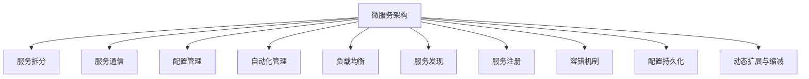

                 

# 微服务架构的设计与实现

## 1. 背景介绍

### 1.1 问题由来
随着企业应用系统的复杂度不断提高，传统的单块应用(Monolithic Application)已无法满足业务快速迭代和扩展的需求。单块应用往往存在代码耦合度高、部署困难、系统稳定性差等问题，难以支撑大型的分布式系统。

微服务架构应运而生，通过将单块应用拆分为多个独立的微服务模块，每个微服务独立部署、独立扩展，能够有效提升系统可维护性和扩展性，同时带来敏捷开发和快速迭代的能力。微服务架构作为分布式系统架构的一种重要范式，近年来在各行各业的应用中取得了显著成果，并成为现代企业架构的主流趋势。

### 1.2 问题核心关键点
微服务架构的核心在于将复杂系统拆分为简单、独立、可复用的微服务模块，实现系统功能的解耦和自动化管理。具体包括以下关键点：

- 服务拆分：将单块应用根据业务领域拆分为多个微服务，每个微服务负责特定功能模块。
- 服务通信：微服务之间通过轻量级协议进行通信，如RESTful API、gRPC等。
- 配置管理：通过配置中心实现微服务的集中管理，使得配置项修改无需重新部署应用。
- 自动化管理：采用容器化技术(CI/CD)实现微服务的自动化构建、测试、部署和运维。
- 负载均衡：通过负载均衡器实现微服务的流量负载均衡，保障系统的稳定性和可用性。
- 服务发现：通过服务发现机制自动获取微服务实例的运行地址，实现动态服务调用。

这些关键点共同构成了微服务架构的基本框架，使得系统能够以更加灵活、可扩展的方式运作。

## 2. 核心概念与联系

### 2.1 核心概念概述

为更好地理解微服务架构的设计与实现，本节将介绍几个密切相关的核心概念：

- 微服务架构(Microservices Architecture)：一种将单块应用拆分为多个独立、自治的微服务模块，实现系统解耦和自动化管理的分布式架构。

- 服务拆分(Splitting)：将单块应用按照业务功能或领域进行划分，每个微服务负责独立的功能模块。

- 服务通信(Communication)：微服务之间通过轻量级协议进行数据交换和协作，通常使用HTTP或gRPC等。

- 配置管理(Configuration)：通过配置中心实现微服务的集中配置管理，使得配置项修改无需重启整个应用。

- 自动化管理(Automation)：利用CI/CD工具链实现微服务的自动化构建、测试、部署和运维。

- 负载均衡(Load Balancing)：通过负载均衡器实现微服务的流量均衡，提升系统的可用性和稳定性。

- 服务发现(Service Discovery)：通过服务发现机制自动获取微服务实例的运行地址，实现动态服务调用。

- 服务注册(Service Registration)：微服务启动后自动向配置中心注册，以便其他服务能够动态查找。

- 容错机制(Fault Tolerance)：微服务架构必须具备强健的容错能力，避免因某个服务故障导致整个系统瘫痪。

- 配置持久化(Persistent Configuration)：将配置项持久化存储在配置中心，保证配置的可靠性和一致性。

- 动态扩展与缩减(Scale-out & Scale-in)：根据系统负载动态扩展或缩减微服务实例，实现系统资源的优化配置。

这些核心概念之间的逻辑关系可以通过以下Mermaid流程图来展示：



这个流程图展示了这个微服务架构的核心概念及其之间的关系：

1. 微服务架构将单块应用拆分为多个微服务，每个微服务独立部署。
2. 微服务之间通过轻量级协议进行通信，实现数据交互。
3. 通过配置中心实现微服务的集中配置，保证配置的一致性和可靠性。
4. 自动化管理工具链用于构建、测试、部署和运维微服务。
5. 负载均衡器保证微服务的流量均衡，提升系统可用性。
6. 服务发现机制自动获取微服务实例地址，实现动态服务调用。
7. 服务注册机制自动更新配置中心中的服务实例信息。
8. 容错机制确保系统在部分服务故障的情况下仍能正常运行。
9. 配置持久化保证配置项的安全可靠。
10. 动态扩展与缩减机制灵活调整系统资源配置。

这些概念共同构成了微服务架构的基本框架，使得系统能够以更加灵活、可扩展的方式运作。

## 3. 核心算法原理 & 具体操作步骤

### 3.1 算法原理概述

微服务架构的设计与实现，本质上是将一个复杂的大型系统拆分为多个相对独立、自治的微服务模块。每个微服务通常遵循单一职责原则(Single Responsibility Principle)，负责特定业务领域的逻辑处理。微服务之间的通信通常基于RESTful API或gRPC，采用轻量级协议保证通信的灵活性和高效性。

微服务架构的设计过程通常包括以下几个关键步骤：

1. 需求分析：根据业务需求和系统架构，识别出需要拆分的微服务模块。
2. 功能划分：按照业务功能或领域，将单块应用划分为多个独立的功能模块。
3. 接口设计：定义微服务之间的接口协议，通常使用RESTful API或gRPC。
4. 数据存储设计：为每个微服务设计独立的数据存储方案，如MySQL、MongoDB等。
5. 配置管理：使用配置中心统一管理微服务的配置项，保证配置的一致性。
6. 服务注册与发现：微服务启动后自动向配置中心注册，其他服务通过服务发现机制动态查找。
7. 负载均衡与容错：通过负载均衡器实现微服务的流量均衡，确保系统稳定性。
8. 自动化部署与运维：利用CI/CD工具链自动化构建、测试、部署和运维微服务。

### 3.2 算法步骤详解

以下详细介绍微服务架构设计与实现的具体步骤：

**Step 1: 需求分析与业务划分**

- 识别关键业务领域和功能模块，如用户管理、订单处理、库存管理等。
- 定义每个微服务的功能边界和职责范围，避免功能重叠和耦合。
- 确定微服务之间的交互方式和通信协议，如RESTful API、gRPC等。

**Step 2: 接口设计与协议选择**

- 定义每个微服务之间的接口协议，包括接口路径、请求参数、返回数据格式等。
- 选择适合的通信协议，保证接口的灵活性和高效性。
- 设计API版本控制策略，避免因接口变化导致的客户端兼容问题。

**Step 3: 数据存储设计**

- 为每个微服务设计独立的数据存储方案，考虑数据的隔离性和一致性。
- 选择适合的数据库技术，如MySQL、MongoDB、Redis等。
- 设计数据模型和关系，保证数据的规范化和灵活性。

**Step 4: 配置管理**

- 使用配置中心统一管理微服务的配置项，如环境变量、数据库连接、缓存配置等。
- 确保配置项的集中管理和持久化，避免配置项的丢失和不一致。
- 设计灵活的配置管理接口，方便微服务的动态配置。

**Step 5: 服务注册与发现**

- 微服务启动后自动向配置中心注册，提供服务的元信息，如服务地址、接口路径、负载均衡策略等。
- 其他服务通过服务发现机制动态查找可用服务，保证服务的可用性和可靠性。
- 设计灵活的服务发现接口，方便微服务的动态注册和发现。

**Step 6: 负载均衡与容错**

- 使用负载均衡器实现微服务的流量均衡，避免单点故障和性能瓶颈。
- 设计容错机制，如服务降级、重试机制等，保障系统的可用性。
- 设计可观测性系统，如日志、监控、告警等，及时发现和解决问题。

**Step 7: 自动化部署与运维**

- 利用CI/CD工具链自动化构建、测试、部署和运维微服务。
- 设计自动化部署流程，保证微服务的快速迭代和发布。
- 设计自动化运维流程，保证微服务的稳定性、可用性和性能。

**Step 8: 服务性能优化**

- 优化微服务的性能，如缓存、异步处理、负载均衡等。
- 设计可伸缩性方案，支持动态扩展和缩减微服务实例。
- 设计低延迟和高吞吐率的系统架构，提升用户体验。

通过以上步骤，可以有效设计和实现一个高性能、高可用、高扩展性的微服务架构。

### 3.3 算法优缺点

微服务架构的设计与实现，具有以下优点：

- 提升系统可维护性和可扩展性：微服务拆分后，各个服务独立部署，模块化开发，易于维护和扩展。
- 加速开发和迭代：微服务独立开发，并行推进，可以大大加快系统的开发和迭代速度。
- 提升系统性能和稳定性：微服务架构支持水平扩展，可以应对高并发和大流量。
- 支持敏捷开发和快速响应：微服务架构支持持续集成和持续交付，可以实时响应市场和客户需求。

同时，微服务架构也存在以下缺点：

- 系统复杂度增加：微服务拆分后，系统复杂度增加，管理维护难度提升。
- 网络延迟增加：微服务之间通过网络通信，网络延迟和通信开销增加。
- 系统一致性问题：微服务之间可能存在数据一致性问题，需要通过分布式事务和数据库设计解决。
- 管理成本上升：微服务架构需要更多的基础设施和管理工具，管理成本上升。
- 依赖关系复杂：微服务之间存在依赖关系，设计不当可能导致系统运行不稳定。

因此，在设计和实现微服务架构时，需要权衡各种因素，选择合适的架构模式和技术工具，确保系统的高效稳定运行。

### 3.4 算法应用领域

微服务架构被广泛应用于各种大型、分布式系统的设计和实现中，如电商、金融、医疗、物流、政府服务等。以下是几个典型应用场景：

- 电商系统：电商系统通常包含用户管理、商品管理、订单管理、库存管理等多个模块，适合采用微服务架构。
- 金融系统：金融系统通常需要处理大量的高并发交易和复杂的数据计算，适合采用微服务架构。
- 医疗系统：医疗系统通常需要处理大量的病人数据和复杂的医疗决策，适合采用微服务架构。
- 物流系统：物流系统通常包含订单处理、货物跟踪、配送管理等多个模块，适合采用微服务架构。
- 政府服务：政府服务通常需要处理大量的公众事务和数据交互，适合采用微服务架构。

这些场景中，微服务架构通过拆分和自治，实现了系统的灵活和可扩展性，提升了系统的性能和可靠性。

## 4. 数学模型和公式 & 详细讲解  
### 4.1 数学模型构建

在微服务架构的设计与实现中，我们通常需要考虑系统负载、服务延迟、流量均衡等指标。以下是一个简化的数学模型，用于描述微服务架构的负载均衡过程：

设微服务 $S_i$ 的负载为 $L_i$，每个请求的延迟为 $D_i$，系统总负载为 $L$，总请求数量为 $N$，请求到达速率 $R$。则负载均衡模型可以表示为：

$$
L_i = \frac{L_i \times D_i}{\sum_{j=1}^n \frac{L_j \times D_j}{R}}
$$

其中 $n$ 为微服务数量。

通过上述模型，可以计算每个微服务的负载和请求延迟，实现负载均衡和系统优化。

### 4.2 公式推导过程

假设系统总负载为 $L$，请求到达速率 $R$，请求延迟为 $D$。每个微服务的负载和请求延迟分别为 $L_i$ 和 $D_i$。

则系统总请求数量为：

$$
N = R \times T
$$

其中 $T$ 为请求处理时间。

每个微服务的请求数量为：

$$
N_i = \frac{L_i \times D_i}{R}
$$

假设微服务 $S_i$ 的请求数量为 $N_i$，则其负载为：

$$
L_i = \frac{N_i}{D_i}
$$

系统总负载为：

$$
L = \sum_{i=1}^n L_i
$$

每个微服务的请求延迟为：

$$
D_i = \frac{N_i}{L_i}
$$

综合以上公式，可以得到微服务负载均衡模型的完整表达式：

$$
L_i = \frac{L_i \times D_i}{\sum_{j=1}^n \frac{L_j \times D_j}{R}}
$$

通过这个公式，可以计算每个微服务的负载和请求延迟，实现系统的负载均衡和优化。

### 4.3 案例分析与讲解

以电商平台为例，假设系统总负载为 $L$，每个微服务的请求延迟分别为 $D_1$ 和 $D_2$，每个请求的平均处理时间为 $T$，请求到达速率为 $R$。则系统总请求数量为：

$$
N = R \times T
$$

每个微服务的请求数量为：

$$
N_1 = \frac{L_1 \times D_1}{R}, N_2 = \frac{L_2 \times D_2}{R}
$$

假设微服务 $S_1$ 的请求数量为 $N_1$，则其负载为：

$$
L_1 = \frac{N_1}{D_1}
$$

系统总负载为：

$$
L = L_1 + L_2
$$

每个微服务的请求延迟为：

$$
D_1 = \frac{N_1}{L_1}, D_2 = \frac{N_2}{L_2}
$$

通过以上公式，可以计算每个微服务的负载和请求延迟，实现系统的负载均衡和优化。

在实际应用中，通常使用负载均衡器自动调整每个微服务的请求负载，保证系统的稳定性。例如，使用Nginx或Apache作为负载均衡器，根据每个微服务的负载和请求延迟，动态调整请求路由，实现流量均衡和负载均衡。

## 5. 项目实践：代码实例和详细解释说明

### 5.1 开发环境搭建

在进行微服务架构的实践前，我们需要准备好开发环境。以下是使用Spring Boot和Docker构建微服务架构的开发环境配置流程：

1. 安装JDK：从官网下载并安装JDK，用于编译和运行Spring Boot应用程序。
2. 安装Maven：从官网下载并安装Maven，用于依赖管理。
3. 安装Spring Boot：从官网下载并安装Spring Boot，配置pom.xml文件，引入依赖。
4. 安装Docker：从官网下载并安装Docker，配置Dockerfile文件，构建Docker镜像。
5. 配置Docker Compose：配置docker-compose.yml文件，定义微服务的容器和服务关系。

完成上述步骤后，即可在Docker环境中开始微服务架构的实践。

### 5.2 源代码详细实现

以下是一个简单的Spring Boot微服务实例，用于实现用户管理模块。

首先，定义用户数据模型：

```java
import javax.persistence.Entity;
import javax.persistence.GeneratedValue;
import javax.persistence.GenerationType;
import javax.persistence.Id;

@Entity
public class User {
    @Id
    @GeneratedValue(strategy = GenerationType.IDENTITY)
    private Long id;
    private String name;
    private String email;
    private String password;

    // getters and setters
}
```

然后，定义用户服务接口：

```java
import org.springframework.stereotype.Service;

@Service
public interface UserService {
    User findById(Long id);
    void save(User user);
}
```

接着，定义用户服务实现类：

```java
import org.springframework.beans.factory.annotation.Autowired;
import org.springframework.stereotype.Service;

import javax.persistence.EntityManager;
import javax.persistence.PersistenceContext;
import javax.transaction.Transactional;

@Service
public class UserServiceImpl implements UserService {
    @PersistenceContext
    private EntityManager entityManager;

    @Override
    public User findById(Long id) {
        return entityManager.find(User.class, id);
    }

    @Override
    @Transactional
    public void save(User user) {
        entityManager.persist(user);
    }
}
```

最后，定义启动类：

```java
import org.springframework.boot.SpringApplication;
import org.springframework.boot.autoconfigure.SpringBootApplication;
import org.springframework.context.annotation.Bean;
import org.springframework.web.bind.annotation.*;

import javax.persistence.EntityManager;
import javax.persistence.PersistenceContext;

@SpringBootApplication
public class Application {
    public static void main(String[] args) {
        SpringApplication.run(Application.class, args);
    }

    @Bean
    public EntityManager entityManager() {
        return entityManager;
    }
}
```

启动微服务后，可以通过Swagger或其他接口测试工具访问用户管理模块的接口，实现用户数据的CRUD操作。

### 5.3 代码解读与分析

让我们再详细解读一下关键代码的实现细节：

**User类**：
- 定义了用户的基本属性和映射关系。

**UserService接口**：
- 定义了用户管理的基本操作，如查找、保存等。

**UserServiceImpl类**：
- 实现了UserService接口，使用Spring Boot提供的EntityManager进行数据库操作。

**Application类**：
- 定义了Spring Boot应用程序的入口，配置了EntityManager Bean。

通过上述代码，可以看到Spring Boot框架的强大封装能力，使得微服务的开发变得简洁高效。开发者只需关注核心业务逻辑，而不必过多考虑底层实现细节。

当然，在工业级的系统实现中，还需要考虑更多因素，如安全认证、事务管理、日志记录等。但核心的微服务模块代码基本与此类似。

## 6. 实际应用场景
### 6.1 电商系统

基于微服务架构的电商系统，可以实现高并发、高可用、高扩展性的特性。电商系统通常包含用户管理、商品管理、订单管理、库存管理等多个模块，适合采用微服务架构。

在电商系统中，用户管理模块负责用户注册、登录、信息管理等操作，商品管理模块负责商品信息、分类、搜索等操作，订单管理模块负责订单创建、支付、配送等操作，库存管理模块负责库存信息、采购、出库等操作。

通过微服务架构，电商系统可以灵活部署、独立扩展，每个模块可以独立开发、独立测试、独立部署，大大提升了系统的可维护性和可扩展性。同时，电商系统需要处理大量的高并发交易，微服务架构支持水平扩展，可以应对高并发和大流量。

### 6.2 金融系统

金融系统通常需要处理大量的高并发交易和复杂的数据计算，适合采用微服务架构。

金融系统中，交易管理模块负责处理订单、支付、结算等交易操作，风险管理模块负责评估风险、预警风险、处理风险等操作，数据管理模块负责数据存储、查询、分析等操作。

通过微服务架构，金融系统可以灵活部署、独立扩展，每个模块可以独立开发、独立测试、独立部署，大大提升了系统的可维护性和可扩展性。同时，金融系统需要处理大量的高并发交易，微服务架构支持水平扩展，可以应对高并发和大流量。

### 6.3 医疗系统

医疗系统通常需要处理大量的病人数据和复杂的医疗决策，适合采用微服务架构。

医疗系统中，病人管理模块负责病人信息、病历、诊断等操作，医生管理模块负责医生信息、排班、手术等操作，药品管理模块负责药品信息、库存、采购等操作。

通过微服务架构，医疗系统可以灵活部署、独立扩展，每个模块可以独立开发、独立测试、独立部署，大大提升了系统的可维护性和可扩展性。同时，医疗系统需要处理大量的高并发数据和复杂的医疗决策，微服务架构支持水平扩展，可以应对高并发和大流量。

### 6.4 物流系统

物流系统通常包含订单处理、货物跟踪、配送管理等多个模块，适合采用微服务架构。

物流系统中，订单管理模块负责订单创建、支付、配送等操作，货物跟踪模块负责货物位置、状态、运输等操作，配送管理模块负责配送路线、时间、费用等操作。

通过微服务架构，物流系统可以灵活部署、独立扩展，每个模块可以独立开发、独立测试、独立部署，大大提升了系统的可维护性和可扩展性。同时，物流系统需要处理大量的高并发数据和复杂的物流决策，微服务架构支持水平扩展，可以应对高并发和大流量。

### 6.5 政府服务

政府服务通常需要处理大量的公众事务和数据交互，适合采用微服务架构。

政府服务中，公共服务模块负责提供各种公共服务，如社保查询、公积金查询、税务查询等操作，行政服务模块负责各种行政事务，如申请审批、证照办理、公共资源等操作。

通过微服务架构，政府服务可以灵活部署、独立扩展，每个模块可以独立开发、独立测试、独立部署，大大提升了系统的可维护性和可扩展性。同时，政府服务需要处理大量的高并发数据和复杂的政务决策，微服务架构支持水平扩展，可以应对高并发和大流量。

## 7. 工具和资源推荐
### 7.1 学习资源推荐

为了帮助开发者系统掌握微服务架构的设计与实现，这里推荐一些优质的学习资源：

1. 《Spring Cloud微服务架构设计与实践》书籍：由知名Spring Cloud专家撰写，详细介绍了微服务架构的设计原则和实践技巧，适合初学者入门。
2. 《Docker实战》书籍：Docker实战作者撰写，全面介绍了Docker的安装、配置、部署、管理等实战技巧，适合Docker初学者入门。
3. 《Spring Boot实战》书籍：Spring Boot实战作者撰写，详细介绍了Spring Boot的开发、测试、部署等实战技巧，适合Spring Boot初学者入门。
4. 《微服务架构实战》课程：由知名微服务架构专家开设的在线课程，详细讲解了微服务架构的设计和实现，适合微服务架构从业者系统学习。
5. 《Spring Cloud for Java Developers》书籍：Spring Cloud for Java Developers作者撰写，详细介绍了Spring Cloud的核心组件和实战案例，适合Spring Cloud开发者系统学习。

通过对这些资源的学习实践，相信你一定能够快速掌握微服务架构的设计与实现，并用于解决实际的业务问题。
###  7.2 开发工具推荐

高效的开发离不开优秀的工具支持。以下是几款用于微服务架构开发的常用工具：

1. Spring Boot：基于Spring框架的开源开发框架，提供了一站式的开发、测试、部署、运维工具，适合微服务架构的开发。
2. Spring Cloud：基于Spring Boot的开源微服务框架，提供了一站式的微服务组件和服务治理，适合微服务架构的开发和管理。
3. Docker：开源容器化平台，用于构建、部署、管理Docker容器，适合微服务架构的部署和管理。
4. Kubernetes：开源容器编排平台，用于部署、扩展和管理Kubernetes集群，适合微服务架构的部署和管理。
5. nginx：开源负载均衡器，用于实现微服务的流量均衡和负载均衡，适合微服务架构的部署和管理。

合理利用这些工具，可以显著提升微服务架构的开发效率，加快创新迭代的步伐。

### 7.3 相关论文推荐

微服务架构的研究源于学界的持续探索。以下是几篇奠基性的相关论文，推荐阅读：

1. Microservices: A lightweight approach to building scalable and maintainable systems：文中所述的微服务架构思想，成为后续微服务研究的开山之作。
2. Building Microservices with Spring Cloud：详细介绍了Spring Cloud微服务架构的核心组件和实现细节，是微服务架构的重要参考。
3. Microservices Patterns：系统介绍了微服务架构的核心模式和设计原则，是微服务架构的重要参考。
4. Containerization of Microservices for Cloud Native Applications：介绍了Docker和Kubernetes在微服务架构中的应用，是微服务架构的重要参考。

这些论文代表了大规模微服务架构的研究脉络。通过学习这些前沿成果，可以帮助研究者把握学科前进方向，激发更多的创新灵感。

## 8. 总结：未来发展趋势与挑战

### 8.1 总结

本文对微服务架构的设计与实现进行了全面系统的介绍。首先阐述了微服务架构的提出背景和基本概念，明确了微服务架构在提升系统可维护性、可扩展性方面的独特价值。其次，从原理到实践，详细讲解了微服务架构的数学模型、公式推导、案例分析，并给出了微服务架构的完整代码实现。同时，本文还广泛探讨了微服务架构在电商、金融、医疗、物流、政府服务等多个行业领域的应用前景，展示了微服务架构的广泛适用性和重要价值。最后，本文精选了微服务架构的学习资源、开发工具和相关论文，力求为读者提供全方位的技术指引。

通过本文的系统梳理，可以看到，微服务架构在现代企业架构中已经发挥了重要作用，通过拆分和自治，实现了系统的灵活和可扩展性，提升了系统的性能和可靠性。未来，微服务架构将继续演变，成为分布式系统架构的主流范式，为更多企业带来变革性的影响。

### 8.2 未来发展趋势

展望未来，微服务架构将呈现以下几个发展趋势：

1. 云原生技术的融合：微服务架构将更加深入地融合云原生技术，如Docker、Kubernetes、Istio等，提升系统的自动化和可扩展性。
2. 服务网格的普及：服务网格技术如Istio、Linkerd等，将进一步普及，实现微服务间的更细粒度管理和优化。
3. 数据微服务的发展：随着数据量的增长和数据的复杂性，数据微服务将成为微服务架构的重要组成部分，提升数据处理和治理能力。
4. 自动化运维的强化：微服务架构的自动化运维将进一步强化，通过AIOps、DevOps等技术提升运维效率和质量。
5. 人工智能与微服务的结合：微服务架构将与人工智能技术深度结合，提升系统的智能决策和自动化能力。
6. 容器化与Kubernetes的推广：容器化技术将更加普及，Kubernetes等容器编排平台将进一步推广，提升微服务架构的部署和管理效率。

以上趋势凸显了微服务架构的广阔前景。这些方向的探索发展，必将进一步提升微服务架构的高效性和可扩展性，为更多企业带来变革性的影响。

### 8.3 面临的挑战

尽管微服务架构已经取得了显著成果，但在迈向更加智能化、普适化应用的过程中，它仍面临诸多挑战：

1. 系统复杂度增加：微服务拆分后，系统复杂度增加，管理维护难度提升。
2. 网络延迟增加：微服务之间通过网络通信，网络延迟和通信开销增加。
3. 系统一致性问题：微服务之间可能存在数据一致性问题，需要通过分布式事务和数据库设计解决。
4. 管理成本上升：微服务架构需要更多的基础设施和管理工具，管理成本上升。
5. 依赖关系复杂：微服务之间存在依赖关系，设计不当可能导致系统运行不稳定。

因此，在设计和实现微服务架构时，需要权衡各种因素，选择合适的架构模式和技术工具，确保系统的高效稳定运行。

### 8.4 研究展望

面对微服务架构所面临的种种挑战，未来的研究需要在以下几个方面寻求新的突破：

1. 探索无状态微服务架构：通过无状态化的设计，减少微服务间的依赖关系，提升系统的稳定性和可扩展性。
2. 研究自动化的编排和调度和优化技术：通过自动化编排和调度技术，实现微服务的灵活部署和优化。
3. 融合更多的分布式一致性协议：通过新的分布式一致性协议，解决微服务间的强一致性问题。
4. 研究智能化的服务治理技术：通过智能化服务治理技术，提升微服务的自适应和自管理能力。
5. 引入更多的微服务模式：通过更多的微服务模式，如函数即服务(FaaS)等，提升微服务架构的灵活性和可扩展性。
6. 加强微服务架构的安全性和隐私保护：通过加强微服务架构的安全性和隐私保护，提升系统的安全性和可信度。

这些研究方向的探索，必将引领微服务架构技术迈向更高的台阶，为构建安全、可靠、可解释、可控的智能系统铺平道路。面向未来，微服务架构还需要与其他人工智能技术进行更深入的融合，如知识表示、因果推理、强化学习等，多路径协同发力，共同推动自然语言理解和智能交互系统的进步。只有勇于创新、敢于突破，才能不断拓展微服务架构的边界，让智能技术更好地造福人类社会。

## 9. 附录：常见问题与解答

**Q1：微服务架构的优缺点是什么？**

A: 微服务架构的优点包括：

1. 提升系统可维护性和可扩展性：微服务拆分后，各个服务独立部署，模块化开发，易于维护和扩展。
2. 加速开发和迭代：微服务独立开发，并行推进，可以大大加快系统的开发和迭代速度。
3. 提升系统性能和稳定性：微服务架构支持水平扩展，可以应对高并发和大流量。

微服务架构的缺点包括：

1. 系统复杂度增加：微服务拆分后，系统复杂度增加，管理维护难度提升。
2. 网络延迟增加：微服务之间通过网络通信，网络延迟和通信开销增加。
3. 系统一致性问题：微服务之间可能存在数据一致性问题，需要通过分布式事务和数据库设计解决。
4. 管理成本上升：微服务架构需要更多的基础设施和管理工具，管理成本上升。
5. 依赖关系复杂：微服务之间存在依赖关系，设计不当可能导致系统运行不稳定。

**Q2：微服务架构的设计原则是什么？**

A: 微服务架构的设计原则包括：

1. 单一职责原则：每个微服务负责单一的业务功能，避免功能重叠和耦合。
2. 自治原则：每个微服务独立部署、独立扩展，不受其他服务的影响。
3. 轻量级通信原则：微服务之间通过轻量级协议进行通信，避免通信开销过大。
4. 容错原则：每个微服务具备强健的容错能力，避免因某个服务故障导致整个系统瘫痪。
5. 自动化原则：利用CI/CD工具链实现微服务的自动化构建、测试、部署和运维。
6. 安全原则：通过安全认证、数据加密等措施，保障微服务的安全性和隐私保护。

**Q3：微服务架构的部署模式有哪些？**

A: 微服务架构的部署模式包括：

1. 单体部署模式：将微服务打包为一个可执行文件，一次性部署。
2. 容器化部署模式：将微服务打包为Docker容器，通过容器编排平台（如Kubernetes）管理。
3. 微服务网关部署模式：通过微服务网关统一管理微服务的API接口，实现路由和负载均衡。
4. 自服务部署模式：通过微服务自服务平台，实现微服务的灵活部署和调用。

**Q4：微服务架构的优势是什么？**

A: 微服务架构的优势包括：

1. 提升系统可维护性和可扩展性：微服务拆分后，各个服务独立部署，模块化开发，易于维护和扩展。
2. 加速开发和迭代：微服务独立开发，并行推进，可以大大加快系统的开发和迭代速度。
3. 提升系统性能和稳定性：微服务架构支持水平扩展，可以应对高并发和大流量。
4. 支持敏捷开发和快速响应：微服务架构支持持续集成和持续交付，可以实时响应市场和客户需求。

**Q5：微服务架构的挑战是什么？**

A: 微服务架构的挑战包括：

1. 系统复杂度增加：微服务拆分后，系统复杂度增加，管理维护难度提升。
2. 网络延迟增加：微服务之间通过网络通信，网络延迟和通信开销增加。
3. 系统一致性问题：微服务之间可能存在数据一致性问题，需要通过分布式事务和数据库设计解决。
4. 管理成本上升：微服务架构需要更多的基础设施和管理工具，管理成本上升。
5. 依赖关系复杂：微服务之间存在依赖关系，设计不当可能导致系统运行不稳定。

**Q6：微服务架构的未来发展趋势是什么？**

A: 微服务架构的未来发展趋势包括：

1. 云原生技术的融合：微服务架构将更加深入地融合云原生技术，如Docker、Kubernetes、Istio等，提升系统的自动化和可扩展性。
2. 服务网格的普及：服务网格技术如Istio、Linkerd等，将进一步普及，实现微服务间的更细粒度管理和优化。
3. 数据微服务的发展：随着数据量的增长和数据的复杂性，数据微服务将成为微服务架构的重要组成部分，提升数据处理和治理能力。
4. 自动化运维的强化：微服务架构的自动化运维将进一步强化，通过AIOps、DevOps等技术提升运维效率和质量。
5. 人工智能与微服务的结合：微服务架构将与人工智能技术深度结合，提升系统的智能决策和自动化能力。
6. 容器化与Kubernetes的推广：容器化技术将更加普及，Kubernetes等容器编排平台将进一步推广，提升微服务架构的部署和管理效率。

这些趋势凸显了微服务架构的广阔前景。这些方向的探索发展，必将进一步提升微服务架构的高效性和可扩展性，为更多企业带来变革性的影响。

**Q7：微服务架构的设计原则是什么？**

A: 微服务架构的设计原则包括：

1. 单一职责原则：每个微服务负责单一的业务功能，避免功能重叠和耦合。
2. 自治原则：每个微服务独立部署、独立扩展，不受其他服务的影响。
3. 轻量级通信原则：微服务之间通过轻量级协议进行通信，避免通信开销过大。
4. 容错原则：每个微服务具备强健的容错能力，避免因某个服务故障导致整个系统瘫痪。
5. 自动化原则：利用CI/CD工具链实现微服务的自动化构建、测试、部署和运维。
6. 安全原则：通过安全认证、数据加密等措施，保障微服务的安全性和隐私保护。

**Q8：微服务架构的部署模式有哪些？**

A: 微服务架构的部署模式包括：

1. 单体部署模式：将微服务打包为一个可执行文件，一次性部署。
2. 容器化部署模式：将微服务打包为Docker容器，通过容器编排平台（如Kubernetes）管理。
3. 微服务网关部署模式：通过微服务网关统一管理微服务的API接口，实现路由和负载均衡。
4. 自服务部署模式：通过微服务自服务平台，实现微服务的灵活部署和调用。

**Q9：微服务架构的挑战是什么？**

A: 微服务架构的挑战包括：

1. 系统复杂度增加：微服务拆分后，系统复杂度增加，管理维护难度提升。
2. 网络延迟增加：微服务之间通过网络通信，网络延迟和通信开销增加。
3. 系统一致性问题：微服务之间可能存在数据一致性问题，需要通过分布式事务和数据库设计解决。
4. 管理成本上升：微服务架构需要更多的基础设施和管理工具，管理成本上升。
5. 依赖关系复杂：微服务之间存在依赖关系，设计不当可能导致系统运行不稳定。

**Q10：微服务架构的未来发展趋势是什么？**

A: 微服务架构的未来发展趋势包括：

1. 云原生技术的融合：微服务架构将更加深入地融合云原生技术，如Docker、Kubernetes、Istio等，提升系统的自动化和可扩展性。
2. 服务网格的普及：服务网格技术如Istio、Linkerd等，将进一步普及，实现微服务间的更细粒度管理和优化。
3. 数据微服务的发展：随着数据量的增长和数据的复杂性，数据微服务将成为微服务架构的重要组成部分，提升数据处理和治理能力。
4. 自动化运维的强化：微服务架构的自动化运维将进一步强化，通过AIOps、DevOps等技术提升运维效率和质量。
5. 人工智能与微服务的结合：微服务架构将与人工智能技术深度结合，提升系统的智能决策和自动化能力。
6. 容器化与Kubernetes的推广：容器化技术将更加普及，Kubernetes等容器编排平台将进一步推广，提升微服务架构的部署和管理效率。

这些趋势凸显了微服务架构的广阔前景。这些方向的探索发展，必将进一步提升微服务架构的高效性和可扩展性，为更多企业带来变革性的影响。

---

作者：禅与计算机程序设计艺术 / Zen and the Art of Computer Programming

