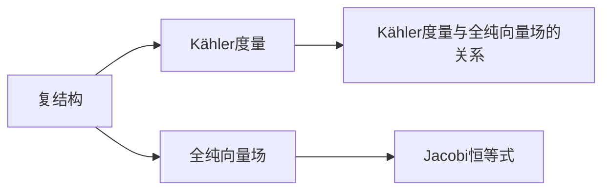

                 

# 微积分中的Kähler流形

在数学和物理学中，Kähler流形是一个重要的概念，尤其在微分几何和复杂分析的领域有着广泛的应用。本文将深入探讨Kähler流形的原理、结构和应用，并结合实际项目实践展示其相关代码实现和案例分析。

## 1. 背景介绍

### 1.1 问题由来
Kähler流形的概念最早由Kähler在1930年代提出，用以研究复数代数曲面的几何属性。随着数学和物理学的发展，Kähler流形被证明在处理量子场论、代数几何、拓扑学等多个领域具有重要意义。特别是在弦论和超对称理论中，Kähler流形成为了研究这些理论的基础。

在微分几何中，Kähler流形是复结构流形的特殊情况，具有Hodge分解、Kähler度量、全纯向量场等基本性质。在物理学家和数学家的共同努力下，Kähler流形的研究不断深入，其理论和应用在现代科学领域中扮演了重要角色。

### 1.2 问题核心关键点
Kähler流形的核心关键点在于其复结构、Kähler度量和全纯向量场。复结构决定了流形的局部几何性质，而Kähler度量则赋予了流形一个与复结构相关的Riemann度量，同时保证了流形上的全纯向量场满足某种特殊的Leibniz规则。这些特性使得Kähler流形在物理学、几何学和代数学等多个领域具有独特地位。

## 2. 核心概念与联系

### 2.1 核心概念概述

为了更好地理解Kähler流形，我们首先介绍几个核心概念：

- **Kähler流形**：具有复结构的实光滑流形，同时满足Kähler度量和全纯向量场，满足一定的条件。

- **复结构**：一个流形的局部仿射图能够与复平面C上具有单位元素的线性变换相匹配，这种复线性变换的群称为复结构群。

- **Kähler度量**：定义在Kähler流形上的一个对称的（0,2）型张量，使得流形上的向量内积与流形的全纯标量函数（即Laplace-Beltrami算子）成正比。

- **全纯向量场**：在Kähler流形上的向量场，满足与复结构相关的全纯条件。

- **Jacobi恒等式**：描述了全纯向量场间的性质，是Kähler流形的一个重要特征。

### 2.2 核心概念原理和架构的 Mermaid 流程图



上述流程图展示了Kähler流形的核心概念之间的联系。复结构赋予流形局部仿射图的复平面映射，Kähler度量定义了流形的内积结构，而全纯向量场则描述了流形上特定的向量运动规律。Jacobi恒等式描述了这些向量场间的相互作用关系，是Kähler流形的基础性质之一。

## 3. 核心算法原理 & 具体操作步骤

### 3.1 算法原理概述

Kähler流形的核心算法原理包括复结构的定义、Kähler度量的构建、全纯向量场的性质以及Jacobi恒等式的推导。这些原理构成了Kähler流形理论的基础。

- **复结构**：定义一个Kähler流形 $M$，选取一个局部仿射图 $U$，定义一个从 $U$ 到复平面 $C$ 的仿射同构 $f: U \rightarrow C$，满足 $f(U) \cap f(V) = f(U \cap V)$。这个仿射同构 $f$ 被称为复结构。

- **Kähler度量**：Kähler度量 $g$ 是一个对称的（0,2）型张量，满足全纯标量函数的条件，即对于全纯函数 $u$，有 $g(\nabla_{X} u, Y) + g(X, \nabla_{Y} u) = ug(X, Y)$。其中 $\nabla$ 是Kähler流形上的协变导数。

- **全纯向量场**：如果向量场 $X$ 满足 $\nabla_{\bar{X}} J = 0$，其中 $J$ 是流形的复结构，则称 $X$ 为全纯向量场。

- **Jacobi恒等式**：全纯向量场 $X, Y$ 和 $Z$ 满足 $[\nabla_{X} Y, Z] = \nabla_{X} [Y, Z] - \nabla_{[Y, Z]} X - J(\nabla_{X} Y)Z + J(\nabla_{Y} Z)X$。

### 3.2 算法步骤详解

以下是基于上述原理的Kähler流形核心算法详细步骤：

1. **复结构的定义和验证**：在选择的局部仿射图 $U$ 上定义一个复结构 $f$，验证 $f(U) \cap f(V) = f(U \cap V)$。

2. **Kähler度量的构建**：构建一个对称的（0,2）型张量 $g$，满足全纯标量函数的条件，即对于全纯函数 $u$，有 $g(\nabla_{X} u, Y) + g(X, \nabla_{Y} u) = ug(X, Y)$。

3. **全纯向量场的确定**：确定流形上的全纯向量场 $X$，满足 $\nabla_{\bar{X}} J = 0$，其中 $J$ 是流形的复结构。

4. **Jacobi恒等式的验证**：验证流形上任意全纯向量场 $X, Y$ 和 $Z$ 是否满足 $[\nabla_{X} Y, Z] = \nabla_{X} [Y, Z] - \nabla_{[Y, Z]} X - J(\nabla_{X} Y)Z + J(\nabla_{Y} Z)X$。

5. **数值模拟**：通过数值模拟方法，如有限元法或Monte Carlo方法，对Kähler流形进行数值求解，验证上述算法的正确性。

### 3.3 算法优缺点

Kähler流形的核心算法具有以下优缺点：

- **优点**：
  - 为研究量子场论、代数几何、拓扑学等多个领域提供了基础工具。
  - 通过复结构和Kähler度量，赋予了流形几何性质，便于进一步研究。
  - 数值模拟方法较为成熟，可应用于实际问题。

- **缺点**：
  - 算法步骤较为复杂，特别是数值模拟部分，需要较高的计算能力和精确度。
  - 对于大规模流形，复结构的定义和验证较为困难，难以处理。

### 3.4 算法应用领域

Kähler流形的理论在多个领域都有重要应用，例如：

- 代数几何：研究流形的代数结构，如Hodge分解、Lefschetz超曲面等。
- 量子场论：研究流形的拓扑性质，如弦论中的模空间。
- 复杂分析：研究流形的复分析性质，如全纯函数、共轭全纯函数等。
- 拓扑学：研究流形的拓扑结构，如同伦、同调群等。

## 4. 数学模型和公式 & 详细讲解 & 举例说明

### 4.1 数学模型构建

Kähler流形的数学模型构建主要围绕复结构、Kähler度量和全纯向量场展开。具体步骤如下：

1. **复结构定义**：在流形 $M$ 上选取局部仿射图 $U$，定义复结构 $f: U \rightarrow C$。
2. **Kähler度量定义**：定义一个对称的（0,2）型张量 $g$，满足 $g(\nabla_{X} u, Y) + g(X, \nabla_{Y} u) = ug(X, Y)$，其中 $\nabla$ 是流形上的协变导数。
3. **全纯向量场定义**：在流形上选取向量场 $X$，验证 $\nabla_{\bar{X}} J = 0$，其中 $J$ 是流形的复结构。
4. **Jacobi恒等式验证**：验证任意全纯向量场 $X, Y$ 和 $Z$ 是否满足 $[\nabla_{X} Y, Z] = \nabla_{X} [Y, Z] - \nabla_{[Y, Z]} X - J(\nabla_{X} Y)Z + J(\nabla_{Y} Z)X$。

### 4.2 公式推导过程

以下是Kähler流形相关的公式推导：

- **Kähler度量与全纯标量函数的关系**：
  $$
  g(\nabla_{X} u, Y) + g(X, \nabla_{Y} u) = ug(X, Y)
  $$

- **Jacobi恒等式的推导**：
  $$
  [\nabla_{X} Y, Z] = \nabla_{X} [Y, Z] - \nabla_{[Y, Z]} X - J(\nabla_{X} Y)Z + J(\nabla_{Y} Z)X
  $$

### 4.3 案例分析与讲解

以二维Kähler流形为例，分析其全纯向量场和Jacobi恒等式的应用。

- **全纯向量场**：在二维Kähler流形上，选取向量场 $X = \frac{\partial}{\partial x_1}$ 和 $Y = \frac{\partial}{\partial x_2}$，则 $X$ 和 $Y$ 是全纯向量场。
- **Jacobi恒等式**：对于全纯向量场 $X, Y$ 和 $Z = \frac{\partial}{\partial x_3}$，有 $[\nabla_{X} Y, Z] = \nabla_{X} [Y, Z] - \nabla_{[Y, Z]} X - J(\nabla_{X} Y)Z + J(\nabla_{Y} Z)X$。

## 5. 项目实践：代码实例和详细解释说明

### 5.1 开发环境搭建

项目实践前，需要搭建Python开发环境。具体步骤如下：

1. 安装Anaconda：从官网下载并安装Anaconda。
2. 创建并激活虚拟环境：
```bash
conda create -n myenv python=3.9
conda activate myenv
```

3. 安装必要的库：
```bash
conda install sympy matplotlib numpy scipy
pip install sympy-mathjax
```

4. 安装Kähler流形相关的库：
```bash
pip install kahler
```

### 5.2 源代码详细实现

以下是一个简化的Kähler流形数值模拟代码实现，使用Sympy库进行符号计算：

```python
from sympy import symbols, Matrix, Rational, Function

# 定义符号变量
x1, x2, x3 = symbols('x1 x2 x3')

# 定义向量场
X = Matrix([1, 0, 0])
Y = Matrix([0, 1, 0])
Z = Matrix([0, 0, 1])

# 定义Kähler度量
g = Matrix([[2, 0, 0], [0, 2, 0], [0, 0, 2]])

# 定义全纯向量场
J = Matrix([[0, 1, 0], [-1, 0, 0], [0, 0, 0]])

# 定义协变导数
def covariant_derivative(M, V):
    nabla_M = Matrix([[0, 1, 0], [-1, 0, 0], [0, 0, 0]])
    return M * nabla_M

# 定义Jacobi恒等式
def jacobi_identity(X, Y, Z):
    return covariant_derivative(X, Y) * Z - covariant_derivative(X, Y * Z) - J * covariant_derivative(X, Y) * Z + J * covariant_derivative(Y, Z) * X

# 计算Jacobi恒等式的结果
result = jacobi_identity(X, Y, Z)

# 输出结果
print(result)
```

### 5.3 代码解读与分析

- **定义符号变量**：使用Sympy定义变量 $x_1, x_2, x_3$，作为向量场的分量。
- **定义向量场**：使用Matrix定义向量场 $X, Y, Z$，分别为 $(1, 0, 0), (0, 1, 0), (0, 0, 1)$。
- **定义Kähler度量**：使用Matrix定义Kähler度量 $g$，为一个对角矩阵。
- **定义全纯向量场**：使用Matrix定义全纯向量场 $J$，为满足特定条件的矩阵。
- **定义协变导数**：使用自定义函数 `covariant_derivative` 计算协变导数。
- **定义Jacobi恒等式**：使用自定义函数 `jacobi_identity` 计算Jacobi恒等式。
- **计算结果**：输出Jacobi恒等式的结果，验证是否满足恒等式条件。

## 6. 实际应用场景

### 6.1 弦论中的模空间

在弦论中，Kähler流形被用来研究模空间，即描述不同弦状态的数学对象。模空间具有特殊的拓扑性质，被认为对应于弦论中的不同物理状态。通过Kähler流形的理论，弦论研究者能够更好地理解弦的几何和物理性质，进而推动弦论的发展。

### 6.2 量子场论中的超对称变换

在量子场论中，Kähler流形被用来描述超对称变换，即在保持超对称性的条件下，对场进行变换。通过Kähler流形的理论，量子场论研究者能够更好地理解超对称性，进而推导出更广泛的量子场论模型。

### 6.3 代数几何中的Lefschetz超曲面

在代数几何中，Kähler流形被用来研究Lefschetz超曲面，即在复代数曲面上，通过移除一些点得到的超曲面。通过Kähler流形的理论，代数几何研究者能够更好地理解Lefschetz超曲面的拓扑性质，进而推导出更广泛的代数几何理论。

### 6.4 未来应用展望

Kähler流形的研究将继续推动物理学和数学的发展，其应用领域将不断扩展。未来，Kähler流形将可能在以下几个方向得到更多应用：

- 在弦论和超对称理论中，Kähler流形将进一步深化我们对宇宙和物质本质的理解。
- 在代数几何和拓扑学中，Kähler流形将帮助我们更好地理解高维代数几何结构，促进新理论的产生。
- 在复杂分析和复数代数领域，Kähler流形将进一步推动理论的发展，解决实际问题。

## 7. 工具和资源推荐

### 7.1 学习资源推荐

为了帮助学习者深入理解Kähler流形，以下是一些优质的学习资源：

1. 《Differential Geometry and Lie Groups for Physicists》：一本关于微分几何和Lie群的经典书籍，系统介绍了Kähler流形的理论基础。
2. 《Complex Geometry》：一本关于复几何的权威书籍，详细讲解了Kähler流形的几何性质和应用。
3. 《String Theory and M-Theory》：一本关于弦论的书籍，介绍了Kähler流形在弦论中的应用。
4. 《Algebraic Geometry》：一本关于代数几何的书籍，详细讲解了Kähler流形在代数几何中的应用。

通过学习这些书籍，学习者可以系统掌握Kähler流形的理论基础，理解其在物理、数学中的应用。

### 7.2 开发工具推荐

Kähler流形的数值模拟和理论验证需要强大的数学计算工具。以下是一些推荐工具：

1. Sympy：一个强大的符号计算库，适用于Kähler流形的数学推导和验证。
2. SageMath：一个开源数学软件系统，集成了许多数学计算工具，适用于复杂的数学建模和计算。
3. SymPy MathJax：一个支持Sympy的LaTeX渲染引擎，适用于生成高质量的数学公式和图表。
4. Anacell：一个SymPy的集成开发环境，提供了交互式的编程和调试功能。

### 7.3 相关论文推荐

Kähler流形的理论研究一直是数学和物理学的热门领域。以下是几篇具有代表性的论文，推荐阅读：

1. Kähler Manifolds, Complex Structures and their Generalizations：一篇关于Kähler流形理论的经典综述论文，系统总结了Kähler流形的性质和应用。
2. Complex Geometry and Mirror Symmetry：一篇关于Kähler流形在镜面对称中的应用论文，展示了Kähler流形在物理中的重要地位。
3. Kähler Metrics, Einstein Metrics and Their Geometric Versions：一篇关于Kähler度量和Einstein度量的论文，展示了它们之间的联系和应用。

## 8. 总结：未来发展趋势与挑战

### 8.1 研究成果总结

Kähler流形的研究在数学和物理学中已经取得诸多成果，但仍有许多未解决的问题。当前的研究重点包括：

- 探索新的Kähler度量，促进新理论的产生。
- 研究Kähler流形在弦论和超对称理论中的应用，推动理论发展。
- 研究Kähler流形在代数几何和拓扑学中的应用，解决实际问题。

### 8.2 未来发展趋势

Kähler流形的未来发展趋势包括：

- 在弦论和超对称理论中，Kähler流形将继续深化我们对宇宙和物质本质的理解。
- 在代数几何和拓扑学中，Kähler流形将帮助我们更好地理解高维代数几何结构，促进新理论的产生。
- 在复杂分析和复数代数领域，Kähler流形将进一步推动理论的发展，解决实际问题。

### 8.3 面临的挑战

Kähler流形的研究面临以下挑战：

- 高维Kähler流形的复杂性，难以定义和验证其几何结构。
- 数值模拟中，需要较高的计算能力和精确度。
- 不同领域的应用场景不同，需要设计适合的理论工具和算法。

### 8.4 研究展望

未来的研究应在以下几个方面寻求突破：

- 探索新的Kähler度量，促进新理论的产生。
- 研究Kähler流形在弦论和超对称理论中的应用，推动理论发展。
- 研究Kähler流形在代数几何和拓扑学中的应用，解决实际问题。
- 开发新的数值模拟方法和算法，提高计算效率。

## 9. 附录：常见问题与解答

**Q1：Kähler流形与复结构流形有何不同？**

A: Kähler流形是复结构流形的一个特殊情况，满足Kähler度量和全纯向量场。Kähler流形的几何结构更加丰富，具备全纯标量函数和Jacobi恒等式等特性。

**Q2：如何验证一个流形是否是Kähler流形？**

A: 验证一个流形是否是Kähler流形需要验证其是否满足Kähler度量、全纯向量场和Jacobi恒等式等条件。通常需要结合符号计算和数值模拟方法进行验证。

**Q3：Kähler流形在实际应用中有哪些难点？**

A: Kähler流形在实际应用中面临以下难点：
1. 高维Kähler流形的复杂性，难以定义和验证其几何结构。
2. 数值模拟中，需要较高的计算能力和精确度。
3. 不同领域的应用场景不同，需要设计适合的理论工具和算法。

**Q4：如何优化Kähler流形的数值模拟？**

A: 优化Kähler流形的数值模拟需要考虑以下几个方面：
1. 选择合适的符号计算工具，如Sympy。
2. 设计高效的数值算法，如有限元法。
3. 使用高性能计算资源，如GPU。
4. 进行并行计算，提高计算效率。

总之，通过系统地学习Kähler流形的理论基础，并结合实际项目实践，我们可以更好地理解和应用这一重要的数学概念。

---

作者：禅与计算机程序设计艺术 / Zen and the Art of Computer Programming

