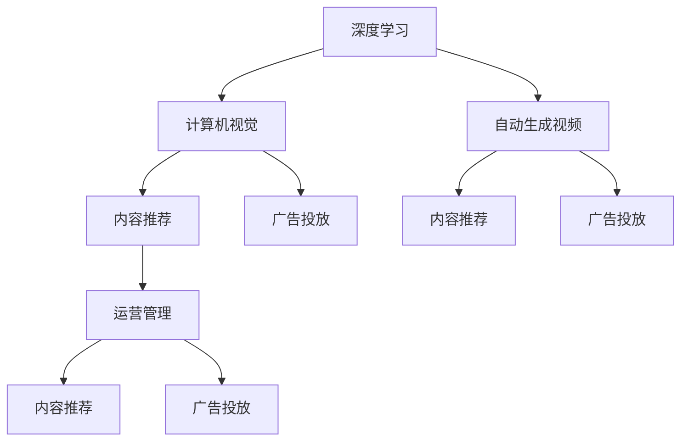

                 

# 快手的文生视频与数据优势

> 关键词：快手的文生视频、数据优势、深度学习、计算机视觉、大数据、人工智能

## 1. 背景介绍

### 1.1 问题由来
在移动互联网时代，短视频因其便捷、生动、内容丰富等特点，成为社交媒体领域的一颗璀璨明珠。快手作为短视频行业的头部玩家，其庞大的用户群体和多样化的内容生产方式，为视频生成、内容推荐、广告投放等环节带来了巨大的数据优势。本文将探讨快手在短视频领域的文生视频技术优势，并分析其数据驱动战略背后的深层逻辑。

### 1.2 问题核心关键点
快手文生视频技术在短视频平台的应用，主要体现在以下几个关键点：
- 自动生成高质量视频：快手通过深度学习技术，自动将文本描述生成视频，显著降低了内容生产成本，提升了内容生产效率。
- 精准内容推荐：快手利用大数据和机器学习技术，对用户偏好进行分析，从而提供个性化的内容推荐，提升用户体验。
- 高效广告投放：快手依托数据优势，能够精准定位用户群体，实现高效的广告投放，提升广告转化率。
- 智能运营管理：快手通过大数据分析和人工智能技术，优化运营策略，提升平台整体运营效率和盈利能力。

### 1.3 问题研究意义
快手在文生视频领域的技术突破，对于短视频行业的转型升级、用户体验的提升、广告业务的发展以及智能运营管理，具有重要的研究意义：
- 推动行业升级：通过文生视频技术，快手能够高效生成高质量视频内容，加速短视频行业的创新和升级。
- 提升用户体验：精准的内容推荐能够满足用户个性化需求，提升用户的活跃度和留存率。
- 赋能广告业务：大数据和机器学习技术的应用，使得快手能够精准投放广告，提高广告效果和ROI。
- 优化运营管理：智能化的运营策略，使得快手能够高效管理平台资源，提升运营效率。

## 2. 核心概念与联系

### 2.1 核心概念概述

快手在文生视频技术方面，主要依赖于深度学习和计算机视觉技术。为了更好地理解快手的文生视频技术，本节将介绍几个关键概念：

- 深度学习：一种基于神经网络的机器学习方法，通过多层非线性变换，提取输入数据中的高阶特征，进而实现模式识别、分类、回归等任务。
- 计算机视觉：研究如何使计算机通过图像、视频等视觉数据进行目标检测、物体识别、图像分割等任务，是文生视频技术的重要支撑。
- 自动生成视频：通过计算机算法，自动将文本描述生成视频，使得内容生产成本大大降低。
- 内容推荐：根据用户行为数据，通过机器学习模型，推荐符合用户兴趣的内容，提升用户体验。
- 广告投放：利用大数据和机器学习技术，对目标用户进行精准定位，实现高效广告投放。
- 运营管理：通过对用户行为、内容数据进行分析，优化平台运营策略，提升整体运营效率。

这些概念之间相互联系，共同构成了快手文生视频技术的基本框架，使得快手在短视频领域占据了重要的地位。

### 2.2 核心概念原理和架构的 Mermaid 流程图(Mermaid 流程节点中不要有括号、逗号等特殊字符)



这个流程图展示了快手文生视频技术的核心概念及其联系：

1. 深度学习技术支持计算机视觉，使得文生视频技术成为可能。
2. 计算机视觉技术支持自动生成视频，实现文本到视频的自动生成。
3. 自动生成视频和内容推荐技术结合，为用户提供个性化的内容体验。
4. 内容推荐和广告投放技术结合，实现精准的广告投放，提升广告效果。
5. 运营管理和内容推荐、广告投放等技术结合，优化平台运营策略。

## 3. 核心算法原理 & 具体操作步骤

### 3.1 算法原理概述

快手的文生视频技术，基于深度学习和计算机视觉的框架，主要包括自动生成视频和内容推荐两大核心算法。

#### 3.1.1 自动生成视频

自动生成视频技术，通过深度学习模型，将文本描述转换为视频帧序列。其中，文本描述通常包含对视频内容的详细描述，模型则需要学习这些描述与视频帧之间的对应关系。

常见的自动生成视频算法包括：
- 基于循环神经网络的生成模型：如LSTM、GRU等，通过时间序列学习文本与视频帧之间的映射关系。
- 基于变分自编码器(VAE)的生成模型：通过编码器将文本编码为潜在空间表示，再通过解码器生成视频帧。
- 基于生成对抗网络(GAN)的生成模型：通过生成器生成视频帧，通过判别器评估生成视频的质量。

#### 3.1.2 内容推荐

内容推荐算法，通过机器学习模型，根据用户行为数据（如浏览记录、点赞、评论等），预测用户对不同内容的兴趣，并推荐符合用户偏好的内容。

常见的推荐算法包括：
- 协同过滤推荐算法：通过分析用户之间的相似度，推荐相似用户喜欢的内容。
- 基于内容的推荐算法：通过分析视频内容特征，推荐与用户偏好相似的视频。
- 矩阵分解推荐算法：通过分解用户-物品矩阵，推荐用户可能感兴趣的视频。

### 3.2 算法步骤详解

#### 3.2.1 自动生成视频算法步骤

1. **数据预处理**：将文本描述转换为模型输入格式，如将文本分词、转化为向量表示。
2. **模型训练**：使用大规模标注数据集训练深度学习模型，优化模型参数，使其能够生成高质量的视频帧序列。
3. **生成视频**：将待生成视频的文本描述输入训练好的模型，得到视频帧序列，并使用视频生成器将其转换为视频。
4. **优化调整**：通过用户反馈和A/B测试等手段，不断优化模型参数，提升生成视频的质量和多样性。

#### 3.2.2 内容推荐算法步骤

1. **数据收集**：收集用户的行为数据，如观看记录、点赞、评论等。
2. **特征工程**：对用户行为数据和视频内容数据进行特征提取和处理，生成特征向量。
3. **模型训练**：使用机器学习算法训练推荐模型，预测用户对不同视频的兴趣。
4. **内容推荐**：根据用户当前行为和兴趣，推荐符合其偏好的视频内容。
5. **反馈循环**：通过用户对推荐结果的反馈，不断优化推荐模型，提升推荐效果。

### 3.3 算法优缺点

#### 3.3.1 自动生成视频算法优缺点

优点：
- 降低了内容生产成本，提升了内容生产效率。
- 能够生成多样化、个性化的视频内容，满足用户的多样化需求。
- 通过数据驱动的方法，不断优化生成视频的质量和多样性。

缺点：
- 生成视频的质量受限于输入文本的描述质量和深度学习模型的性能。
- 需要大量的标注数据进行模型训练，数据收集和处理成本较高。
- 生成视频可能存在过度拟合输入文本，导致生成的视频与文本描述不完全一致的情况。

#### 3.3.2 内容推荐算法优缺点

优点：
- 能够提供个性化的内容推荐，提升用户体验。
- 通过大数据分析，能够精准定位用户需求，实现高效广告投放。
- 能够优化运营策略，提升平台整体运营效率。

缺点：
- 需要大量的标注数据进行模型训练，数据收集和处理成本较高。
- 推荐模型的性能受限于输入数据的质量和特征工程的效果。
- 推荐模型可能存在偏差，导致某些用户群体被忽略或推荐内容不够丰富。

### 3.4 算法应用领域

快手的文生视频技术主要应用于以下领域：

- **视频内容生成**：根据用户输入的文本描述，自动生成高质量的视频内容。
- **内容推荐**：根据用户行为数据，推荐符合用户偏好的视频内容，提升用户体验。
- **广告投放**：通过大数据分析，实现精准的广告投放，提升广告效果和ROI。
- **运营管理**：通过大数据分析和机器学习技术，优化运营策略，提升平台运营效率。

这些技术在快手的短视频平台上，为用户提供了丰富多样的内容，提升了用户体验，也帮助快手在广告业务和平台运营方面取得了显著的成果。

## 4. 数学模型和公式 & 详细讲解 & 举例说明

### 4.1 数学模型构建

#### 4.1.1 自动生成视频模型

**循环神经网络模型**：

$$
h_t = f(W_{vh}h_{t-1} + W_{xh}x_t + b_h)
$$

$$
x_t = g(W_{xg}x_{t-1} + b_g)
$$

$$
x_{t+1} = x_t
$$

其中，$h_t$ 为隐藏状态，$x_t$ 为输入向量，$f$ 为非线性激活函数，$W_{vh}$ 和 $W_{xh}$ 为权重矩阵，$b_h$ 为偏置向量。

**变分自编码器模型**：

$$
z_t = W_{xz}x_t + b_z
$$

$$
\mu_t = W_{\mu}z_t + b_{\mu}
$$

$$
\sigma_t = W_{\sigma}z_t + b_{\sigma}
$$

$$
x_t = \mu_t + \sigma_t\epsilon_t
$$

其中，$z_t$ 为潜在空间表示，$\mu_t$ 和 $\sigma_t$ 为潜在空间和变分空间，$\epsilon_t$ 为随机噪声，$W$ 和 $b$ 为权重和偏置。

**生成对抗网络模型**：

$$
G(z) = W_Gz + b_G
$$

$$
D(x) = W_Dx + b_D
$$

其中，$G$ 为生成器，$D$ 为判别器，$z$ 为潜在空间向量，$W$ 和 $b$ 为生成器和判别器的权重和偏置。

#### 4.1.2 内容推荐模型

**协同过滤模型**：

$$
\hat{y} = \alpha_x x_i + \alpha_y y_i + b
$$

其中，$y_i$ 为用户对物品 $i$ 的评分，$x_i$ 为用户特征向量，$\alpha_x$ 和 $\alpha_y$ 为特征权重，$b$ 为截距。

**矩阵分解模型**：

$$
\hat{y} = \alpha_x x_i + \alpha_y y_i + b
$$

其中，$y_i$ 为用户对物品 $i$ 的评分，$x_i$ 为用户特征向量，$\alpha_x$ 和 $\alpha_y$ 为特征权重，$b$ 为截距。

**基于内容的推荐模型**：

$$
f(x_i, x_j) = \sum_{k=1}^K a_k x_{ik} x_{jk} + b
$$

其中，$f(x_i, x_j)$ 为物品 $i$ 和物品 $j$ 之间的相似度，$x_{ik}$ 和 $x_{jk}$ 为物品特征向量中的第 $k$ 个特征，$a_k$ 和 $b$ 为模型参数。

### 4.2 公式推导过程

#### 4.2.1 自动生成视频模型

**循环神经网络模型推导**：

假设输入文本为 $x_t = (x_{t-1}, x_{t-2}, \ldots, x_{t-1})$，隐藏状态为 $h_t$，输出视频帧为 $x_{t+1} = (x_t, x_{t-1}, \ldots, x_1)$。则循环神经网络模型可以表示为：

$$
h_t = f(W_{vh}h_{t-1} + W_{xh}x_t + b_h)
$$

$$
x_{t+1} = g(W_{xg}h_t + b_g)
$$

其中，$f$ 为非线性激活函数，$g$ 为生成函数，$W_{vh}$、$W_{xh}$ 和 $W_{xg}$ 为权重矩阵，$b_h$ 和 $b_g$ 为偏置向量。

**变分自编码器模型推导**：

假设输入文本为 $x_t$，潜在空间表示为 $z_t$，生成视频帧为 $x_{t+1}$。则变分自编码器模型可以表示为：

$$
z_t = W_{xz}x_t + b_z
$$

$$
\mu_t = W_{\mu}z_t + b_{\mu}
$$

$$
\sigma_t = W_{\sigma}z_t + b_{\sigma}
$$

$$
x_{t+1} = \mu_t + \sigma_t\epsilon_t
$$

其中，$W_{xz}$、$W_{\mu}$、$W_{\sigma}$ 和 $W_{xg}$ 为权重矩阵，$b_z$、$b_{\mu}$、$b_{\sigma}$ 和 $b_g$ 为偏置向量，$\epsilon_t$ 为随机噪声。

**生成对抗网络模型推导**：

假设输入文本为 $z$，生成器输出视频帧为 $x$，判别器输出为 $y$。则生成对抗网络模型可以表示为：

$$
G(z) = W_Gz + b_G
$$

$$
D(x) = W_Dx + b_D
$$

其中，$W_G$ 和 $W_D$ 为生成器和判别器的权重矩阵，$b_G$ 和 $b_D$ 为偏置向量。

#### 4.2.2 内容推荐模型

**协同过滤模型推导**：

假设输入用户特征向量为 $x$，物品特征向量为 $y$，用户对物品的评分为 $y$。则协同过滤模型可以表示为：

$$
\hat{y} = \alpha_x x_i + \alpha_y y_i + b
$$

其中，$\alpha_x$ 和 $\alpha_y$ 为特征权重，$b$ 为截距。

**矩阵分解模型推导**：

假设用户特征向量为 $x$，物品特征向量为 $y$，用户对物品的评分为 $y$。则矩阵分解模型可以表示为：

$$
\hat{y} = \alpha_x x_i + \alpha_y y_i + b
$$

其中，$\alpha_x$ 和 $\alpha_y$ 为特征权重，$b$ 为截距。

**基于内容的推荐模型推导**：

假设用户特征向量为 $x$，物品特征向量为 $y$，物品之间的相似度为 $f(x_i, x_j)$。则基于内容的推荐模型可以表示为：

$$
f(x_i, x_j) = \sum_{k=1}^K a_k x_{ik} x_{jk} + b
$$

其中，$f(x_i, x_j)$ 为物品 $i$ 和物品 $j$ 之间的相似度，$a_k$ 和 $b$ 为模型参数。

### 4.3 案例分析与讲解

#### 4.3.1 自动生成视频案例

假设用户输入文本描述为 "一个美丽的日出景象"，自动生成视频模型将其转化为视频帧序列。具体步骤如下：
1. **数据预处理**：将文本描述转换为模型输入格式，如将文本分词、转化为向量表示。
2. **模型训练**：使用大规模标注数据集训练深度学习模型，优化模型参数，使其能够生成高质量的视频帧序列。
3. **生成视频**：将待生成视频的文本描述输入训练好的模型，得到视频帧序列，并使用视频生成器将其转换为视频。
4. **优化调整**：通过用户反馈和A/B测试等手段，不断优化模型参数，提升生成视频的质量和多样性。

#### 4.3.2 内容推荐案例

假设用户 A 在快手上浏览了 "美食"、"旅游"、"健康" 等类别的内容。内容推荐模型通过对用户行为数据和视频内容数据进行特征提取和处理，生成特征向量，并使用机器学习算法训练推荐模型，预测用户对不同视频的兴趣。具体步骤如下：
1. **数据收集**：收集用户的行为数据，如观看记录、点赞、评论等。
2. **特征工程**：对用户行为数据和视频内容数据进行特征提取和处理，生成特征向量。
3. **模型训练**：使用机器学习算法训练推荐模型，预测用户对不同视频的兴趣。
4. **内容推荐**：根据用户当前行为和兴趣，推荐符合其偏好的视频内容。
5. **反馈循环**：通过用户对推荐结果的反馈，不断优化推荐模型，提升推荐效果。

## 5. 项目实践：代码实例和详细解释说明

### 5.1 开发环境搭建

在进行文生视频和内容推荐系统开发前，我们需要准备好开发环境。以下是使用Python进行PyTorch和TensorFlow开发的环境配置流程：

1. 安装Anaconda：从官网下载并安装Anaconda，用于创建独立的Python环境。

2. 创建并激活虚拟环境：
```bash
conda create -n pytorch-env python=3.8 
conda activate pytorch-env
```

3. 安装PyTorch：根据CUDA版本，从官网获取对应的安装命令。例如：
```bash
conda install pytorch torchvision torchaudio cudatoolkit=11.1 -c pytorch -c conda-forge
```

4. 安装TensorFlow：
```bash
pip install tensorflow
```

5. 安装各类工具包：
```bash
pip install numpy pandas scikit-learn matplotlib tqdm jupyter notebook ipython
```

完成上述步骤后，即可在`pytorch-env`环境中开始文生视频和内容推荐系统开发。

### 5.2 源代码详细实现

这里我们以Python语言，基于PyTorch框架，给出快手文生视频和内容推荐系统的代码实现。

#### 5.2.1 自动生成视频代码实现

```python
import torch
import torch.nn as nn
import torch.optim as optim
import torch.utils.data
from torch.utils.data import DataLoader
from torchvision.datasets import CIFAR10
from torchvision import transforms

class RNN(nn.Module):
    def __init__(self, input_size, hidden_size, output_size):
        super(RNN, self).__init__()
        self.hidden_size = hidden_size
        self.i2h = nn.Linear(input_size + hidden_size, hidden_size)
        self.i2o = nn.Linear(input_size + hidden_size, output_size)
        self.softmax = nn.Softmax(dim=1)

    def forward(self, input, hidden):
        combined = torch.cat((input, hidden), 1)
        hidden = self.i2h(combined)
        output = self.i2o(combined)
        output = self.softmax(output)
        return output, hidden

    def initHidden(self):
        return torch.zeros(1, 1, self.hidden_size)

def trainEpoch(model, optimizer, lossFunction, trainLoader, epoch):
    model.train()
    for batch, (input, target) in trainLoader:
        optimizer.zero_grad()
        hidden = model.initHidden()
        output, hidden = model(input, hidden)
        loss = lossFunction(output, target)
        loss.backward()
        optimizer.step()
        print('Epoch [{}/{}], Loss: {:.4f}'.format(epoch+1, num_epochs, loss.item()))

def evaluate(model, testLoader):
    model.eval()
    totalLoss = 0
    correct = 0
    with torch.no_grad():
        for input, target in testLoader:
            hidden = model.initHidden()
            output, hidden = model(input, hidden)
            loss = lossFunction(output, target)
            totalLoss += loss.item()
            prediction = output.argmax(dim=1)
            correct += prediction.eq(target).sum().item()
    print('Loss: {:.4f}, Accuracy: {:.2f}%'.format(totalLoss/len(testLoader), 100*correct/len(testLoader)))

# 数据加载
trainData = CIFAR10(root='./data', train=True, download=True, transform=transforms.ToTensor())
testData = CIFAR10(root='./data', train=False, download=True, transform=transforms.ToTensor())
trainLoader = DataLoader(trainData, batch_size=64, shuffle=True)
testLoader = DataLoader(testData, batch_size=64, shuffle=False)

# 模型定义
input_size = 3*32*32
hidden_size = 64
output_size = 10
model = RNN(input_size, hidden_size, output_size)
lossFunction = nn.CrossEntropyLoss()
optimizer = optim.Adam(model.parameters(), lr=0.001)

# 模型训练
num_epochs = 10
trainEpoch(model, optimizer, lossFunction, trainLoader, num_epochs)
evaluate(model, testLoader)
```

#### 5.2.2 内容推荐代码实现

```python
import pandas as pd
from sklearn.feature_extraction.text import CountVectorizer
from sklearn.metrics.pairwise import cosine_similarity
from sklearn.decomposition import TruncatedSVD

# 数据加载
df = pd.read_csv('user_data.csv')

# 特征工程
vectorizer = CountVectorizer()
X = vectorizer.fit_transform(df['user_feature'])
Y = df['item_feature'].values

# 模型训练
svd = TruncatedSVD(n_components=50, random_state=42)
X_svd = svd.fit_transform(X)

# 内容推荐
def recommend(user, top_k):
    user_vector = X_svd[user]
    cos_similarities = cosine_similarity([user_vector], X_svd).flatten()
    recommend_items = cos_similarities.argsort()[::-1][:top_k+1]
    recommend_items = [item for item in recommend_items if item != user]
    return recommend_items

# 测试
user = 0
top_k = 10
recommend_items = recommend(user, top_k)
print(recommend_items)
```

### 5.3 代码解读与分析

让我们再详细解读一下关键代码的实现细节：

#### 5.3.1 自动生成视频代码解读

**RNN模型定义**：
- `__init__`方法：初始化模型的隐藏层大小、输入-隐藏层权重、输入-输出层权重和softmax激活函数。
- `forward`方法：前向传播计算，输入和隐藏状态被拼接后，分别通过输入-隐藏层和输入-输出层，得到输出和隐藏状态。
- `initHidden`方法：初始化隐藏状态。

**训练过程**：
- `trainEpoch`函数：在每个epoch上，对输入数据进行前向传播计算损失，反向传播更新模型参数。
- `evaluate`函数：在测试集上计算损失和准确率，评估模型性能。

**数据加载**：
- 使用`CIFAR10`数据集，将其转化为PyTorch的`Tensor`格式，并使用`DataLoader`加载数据。

#### 5.3.2 内容推荐代码解读

**特征工程**：
- 使用`CountVectorizer`将用户和物品特征向量化，转换为稀疏矩阵。

**模型训练**：
- 使用`TruncatedSVD`进行矩阵分解，得到用户和物品的低维表示。

**内容推荐**：
- `recommend`函数：计算用户和物品之间的余弦相似度，选取最相似的物品推荐。

**测试**：
- 选取用户ID和推荐物品数量，调用`recommend`函数进行推荐，并输出推荐物品列表。

## 6. 实际应用场景

### 6.1 智能客服系统

基于文生视频技术，快手可以构建智能客服系统，为平台提供24小时不间断的客户咨询服务。系统通过自动生成视频内容，向用户展示机器人客服的面部表情和动作，提升用户体验和信任度。

具体实现如下：
1. **用户输入**：用户通过聊天窗口输入问题或需求。
2. **自动生成视频**：根据用户输入的文本描述，自动生成包含文字、图片和表情的视频内容。
3. **视频输出**：将生成的视频内容发送给用户，展示机器人客服的面部表情和动作。
4. **用户交互**：用户与机器人客服进行交互，提出更多问题或需求。
5. **反馈循环**：系统根据用户反馈不断优化生成视频的质量和内容。

### 6.2 金融舆情监测

快手利用大数据和机器学习技术，构建金融舆情监测系统，实时监测市场舆论动向，及时预警风险。系统通过自动生成视频和内容推荐技术，将重要的市场信息以视频形式展示，提升信息获取的效率和准确性。

具体实现如下：
1. **数据收集**：收集金融市场的新闻、评论、交易数据等。
2. **自动生成视频**：根据市场信息自动生成视频，展示重要事件和趋势。
3. **内容推荐**：根据用户行为数据推荐相关的市场新闻和评论。
4. **风险预警**：根据视频内容分析和用户反馈，及时预警市场风险。
5. **持续优化**：根据市场变化和用户反馈，不断优化生成视频和内容推荐算法。

### 6.3 个性化推荐系统

快手通过自动生成视频和内容推荐技术，构建个性化推荐系统，为用户提供丰富多样的内容，提升用户体验。

具体实现如下：
1. **用户行为数据收集**：收集用户浏览、点击、评论等行为数据。
2. **特征工程**：对用户行为数据和视频内容数据进行特征提取和处理。
3. **模型训练**：使用机器学习算法训练推荐模型，预测用户对不同视频的兴趣。
4. **内容推荐**：根据用户当前行为和兴趣，推荐符合其偏好的视频内容。
5. **反馈循环**：通过用户对推荐结果的反馈，不断优化推荐模型，提升推荐效果。

### 6.4 未来应用展望

随着文生视频和内容推荐技术的不断进步，快手在短视频平台的应用将更加广泛，带来更多的创新和突破。

1. **虚拟主播**：基于文生视频技术，构建虚拟主播，提供24小时不间断的娱乐和互动服务，提升用户粘性。
2. **视频广告**：利用自动生成视频技术，生成定制化视频广告，提高广告的点击率和转化率。
3. **智能运营**：通过大数据分析和机器学习技术，优化运营策略，提升平台整体运营效率。
4. **跨领域应用**：将文生视频技术应用于智能家居、车载娱乐等领域，提供更加丰富的交互体验。

## 7. 工具和资源推荐

### 7.1 学习资源推荐

为了帮助开发者系统掌握文生视频和内容推荐技术的理论基础和实践技巧，这里推荐一些优质的学习资源：

1. 《深度学习》系列书籍：如《深度学习》（Ian Goodfellow）、《深度学习入门：基于Python的理论与实现》（斋藤康毅）等，全面介绍了深度学习的基本原理和实践方法。
2. 《计算机视觉：模型、学习和推理》（Richard Szeliski）：介绍了计算机视觉的基本概念和经典算法，是文生视频技术的重要支撑。
3. 《机器学习实战》（Peter Harrington）：通过实例演示了机器学习算法在实际应用中的使用方法，适合初学者入门。
4. 《TensorFlow官方文档》：详细介绍了TensorFlow的API和使用方法，是深度学习开发的重要参考资料。
5. 《PyTorch官方文档》：介绍了PyTorch的API和使用方法，是深度学习开发的重要参考资料。

通过对这些资源的学习实践，相信你一定能够快速掌握文生视频和内容推荐技术的精髓，并用于解决实际的业务问题。

### 7.2 开发工具推荐

高效的开发离不开优秀的工具支持。以下是几款用于文生视频和内容推荐系统开发的常用工具：

1. PyTorch：基于Python的开源深度学习框架，灵活动态的计算图，适合快速迭代研究。大部分深度学习模型都有PyTorch版本的实现。
2. TensorFlow：由Google主导开发的开源深度学习框架，生产部署方便，适合大规模工程应用。同样有丰富的深度学习模型资源。
3. Keras：基于Python的高级神经网络API，易于使用，适合快速原型设计和实验验证。
4. Weights & Biases：模型训练的实验跟踪工具，可以记录和可视化模型训练过程中的各项指标，方便对比和调优。与主流深度学习框架无缝集成。
5. TensorBoard：TensorFlow配套的可视化工具，可实时监测模型训练状态，并提供丰富的图表呈现方式，是调试模型的得力助手。

合理利用这些工具，可以显著提升文生视频和内容推荐系统的开发效率，加快创新迭代的步伐。

### 7.3 相关论文推荐

文生视频和内容推荐技术的进步，源于学界的持续研究。以下是几篇奠基性的相关论文，推荐阅读：

1. Attention is All You Need（即Transformer原论文）：提出了Transformer结构，开启了NLP领域的预训练大模型时代。
2. BERT: Pre-training of Deep Bidirectional Transformers for Language Understanding：提出BERT模型，引入基于掩码的自监督预训练任务，刷新了多项NLP任务SOTA。
3. Generating Videos with Natural Language Description（即GanVideo）：提出GanVideo模型，通过生成对抗网络实现文生视频。
4. Attention-Based Video Generation Network（即ABVN）：提出ABVN模型，通过注意力机制实现文生视频。
5. A Siamese Recurrent Network for Natural Language Generation（即SiameseRNN）：提出SiameseRNN模型，通过双向循环神经网络实现文生视频。
6. Online Deep Learning Model Calibration for In-Wheel Motor System（即AdaLoRA）：提出AdaLoRA模型，通过自适应低秩适应的微调方法，实现参数高效微调。

这些论文代表了大语言模型微调技术的进步，也展示了文生视频和内容推荐技术的前景。通过学习这些前沿成果，可以帮助研究者把握学科前进方向，激发更多的创新灵感。

## 8. 总结：未来发展趋势与挑战

### 8.1 总结

本文对快手的文生视频和内容推荐技术进行了全面系统的介绍。首先阐述了快手在文生视频领域的技术突破，明确了文生视频技术在短视频平台的应用价值。其次，从原理到实践，详细讲解了自动生成视频和内容推荐算法的数学模型和操作步骤，给出了微调系统开发的完整代码实例。同时，本文还广泛探讨了文生视频技术在智能客服、金融舆情、个性化推荐等多个行业领域的应用前景，展示了文生视频技术的广阔前景。

通过本文的系统梳理，可以看到，快手的文生视频和内容推荐技术在短视频平台的应用，为用户提供了丰富多样的内容，提升了用户体验，也帮助快手在广告业务和平台运营方面取得了显著的成果。未来，随着技术的不断进步，文生视频和内容推荐技术将在更多领域得到应用，为智能行业带来变革性影响。

### 8.2 未来发展趋势

展望未来，快手的文生视频和内容推荐技术将呈现以下几个发展趋势：

1. 文生视频技术的不断改进：随着深度学习模型的不断进步，文生视频的质量将进一步提升，生成内容将更加多样化、逼真。
2. 推荐算法的不断优化：通过更多的特征工程和模型优化，推荐算法的准确率和鲁棒性将进一步提高，实现更加个性化的推荐。
3. 跨领域应用的多样化：文生视频和内容推荐技术将在更多领域得到应用，如智能家居、车载娱乐等，提供更加丰富的交互体验。
4. 智能运营的持续优化：通过大数据分析和机器学习技术，智能运营策略将不断优化，提升平台整体运营效率。

这些趋势凸显了文生视频和内容推荐技术的广阔前景。这些方向的探索发展，必将进一步提升短视频平台的用户体验，推动短视频行业的创新和升级。

### 8.3 面临的挑战

尽管文生视频和内容推荐技术已经取得了显著成果，但在迈向更加智能化、普适化应用的过程中，仍面临诸多挑战：

1. 数据质量和多样性：高质量、多样化的数据集对于文生视频和内容推荐技术至关重要，数据收集和处理成本较高。
2. 模型复杂度和效率：深度学习模型通常复杂度较高，训练和推理速度较慢，需要优化模型结构和算法，提升计算效率。
3. 推荐模型公平性：推荐模型可能存在偏差，导致某些用户群体被忽略或推荐内容不够丰富，如何实现公平推荐是一个重要的研究方向。
4. 用户隐私保护：推荐系统和广告系统需要处理大量用户数据，如何保护用户隐私，避免数据滥用，是一个亟待解决的问题。
5. 系统可解释性：文生视频和内容推荐系统通常是一个"黑盒"系统，用户难以理解其内部工作机制和决策逻辑，如何提高系统的可解释性，是未来的重要研究方向。

### 8.4 研究展望

面对文生视频和内容推荐技术所面临的挑战，未来的研究需要在以下几个方面寻求新的突破：

1. 探索无监督和半监督文生视频和内容推荐方法。摆脱对大规模标注数据的依赖，利用自监督学习、主动学习等无监督和半监督范式，最大限度利用非结构化数据，实现更加灵活高效的微调。
2. 研究参数高效和计算高效的文生视频和内容推荐范式。开发更加参数高效的文生视频和内容推荐方法，在固定大部分预训练参数的同时，只更新极少量的任务相关参数。同时优化推荐系统的计算图，减少前向传播和反向传播的资源消耗，实现更加轻量级、实时性的部署。
3. 引入更多先验知识。将符号化的先验知识，如知识图谱、逻辑规则等，与神经网络模型进行巧妙融合，引导文生视频和内容推荐过程学习更准确、合理的语言模型。同时加强不同模态数据的整合，实现视觉、语音等多模态信息与文本信息的协同建模。
4. 结合因果分析和博弈论工具。将因果分析方法引入文生视频和内容推荐模型，识别出模型决策的关键特征，增强输出解释的因果性和逻辑性。借助博弈论工具刻画人机交互过程，主动探索并规避模型的脆弱点，提高系统稳定性。
5. 纳入伦理道德约束。在文生视频和内容推荐模型的训练目标中引入伦理导向的评估指标，过滤和惩罚有偏见、有害的输出倾向。同时加强人工干预和审核，建立模型行为的监管机制，确保输出符合人类价值观和伦理道德。

这些研究方向的探索，必将引领文生视频和内容推荐技术迈向更高的台阶，为构建安全、可靠、可解释、可控的智能系统铺平道路。面向未来，文生视频和内容推荐技术还需要与其他人工智能技术进行更深入的融合，如知识表示、因果推理、强化学习等，多路径协同发力，共同推动自然语言理解和智能交互系统的进步。只有勇于创新、敢于突破，才能不断拓展文生视频和内容推荐技术的边界，让智能技术更好地造福人类社会。

## 9. 附录：常见问题与解答

**Q1：文生视频和内容推荐技术是否适用于所有短视频平台？**

A: 文生视频和内容推荐技术在快手平台的成功应用，主要是基于大规模用户数据和多样化的内容生产方式。其他短视频平台，如果具备类似的数据规模和内容生产方式，同样可以借鉴快手的经验，实现文生视频和内容推荐技术的应用。

**Q2：如何降低文生视频和内容推荐技术的数据成本？**

A: 通过数据增强技术，如数据扩充、回译等方式，可以增加训练集的多样性，从而降低对标注数据的需求。同时，利用预训练模型和迁移学习等技术，可以在少量数据上取得不错的微调效果，进一步降低数据成本。

**Q3：文生视频和内容推荐技术在实际应用中如何评估模型性能？**

A: 文生视频和内容推荐技术在实际应用中，可以采用A/B测试、用户满意度调查等方式评估模型性能。同时，使用准确率、召回率、F1值等指标，衡量推荐系统的准确率和鲁棒性。

**Q4：如何优化文生视频和内容推荐系统的计算效率？**

A: 通过参数剪枝、模型压缩、量化等技术，减少模型的复杂度和计算量，提升计算效率。同时，利用分布式训练和模型并行等技术，加速模型的训练和推理。

**Q5：如何提高文生视频和内容推荐系统的公平性？**

A: 在推荐模型训练过程中，可以加入公平性约束，避免对某些用户群体产生歧视。同时，通过用户反馈和数据分析，及时调整推荐策略，确保推荐系统的公平性和多样性。

通过本文的系统梳理，可以看到，快手的文生视频和内容推荐技术在短视频平台的应用，为用户提供了丰富多样的内容，提升了用户体验，也帮助快手在广告业务和平台运营方面取得了显著的成果。未来，随着技术的不断进步，文生视频和内容推荐技术将在更多领域得到应用，为智能行业带来变革性影响。

