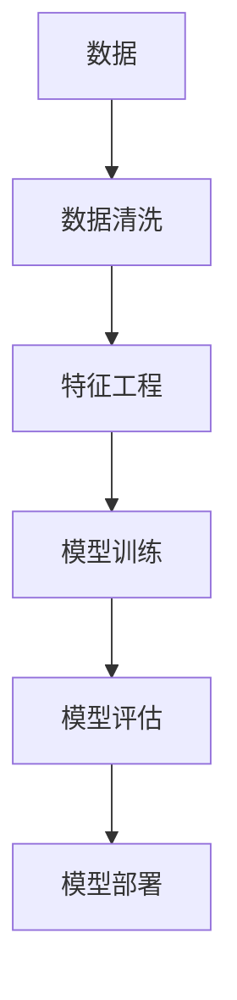
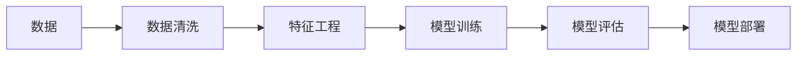

                 

# 怎样善于总结和挖掘事物本质的能力

## 1. 背景介绍

### 1.1 问题由来

在当今这个信息爆炸的时代，面对浩如烟海的数据和信息，如何从中找到有价值的内容，并将其转化为对决策和行动有指导意义的知识，成为了一个极其重要但极具挑战性的问题。信息泛滥不仅让人难以消化，更可能导致决策失误、机会错失。因此，如何高效地总结和挖掘事物本质，成为了一门极其重要的技能。

### 1.2 问题核心关键点

总结和挖掘事物本质的能力，是指通过分析、归纳、整理信息，提取出关键要素和核心价值，从而形成对问题有深入理解的思考方式和分析方法。这种能力在各个领域都有广泛应用，包括但不限于：

- **科学研究**：通过总结和挖掘数据，形成新的理论或发现。
- **商业决策**：在复杂多变的环境中，利用数据总结和分析，做出更有依据的决策。
- **日常生活**：在快节奏的生活中，快速理解和消化信息，做出更合理的选择。

## 2. 核心概念与联系

### 2.1 核心概念概述

要善于总结和挖掘事物本质，首先需要理解几个核心概念：

- **数据清洗**：在处理数据时，去除噪声、缺失值和不一致性，以确保数据的质量和可用性。
- **特征工程**：通过选择、转换和构建特征，提升模型的性能和解释性。
- **模型训练**：使用机器学习算法对数据进行训练，学习数据的规律和模式。
- **模型评估**：通过测试集和交叉验证等方法，评估模型的性能和泛化能力。
- **模型部署**：将训练好的模型应用于实际问题，实现对新数据的预测和推理。

这些概念之间通过一个数据流的过程联系起来，即：



### 2.2 核心概念原理和架构的 Mermaid 流程图



## 3. 核心算法原理 & 具体操作步骤

### 3.1 算法原理概述

总结和挖掘事物本质，通常涉及以下步骤：

1. **数据收集**：获取需要分析的数据集。
2. **数据清洗**：处理数据，去除噪声和异常值。
3. **特征选择与构建**：选择合适的特征，并进行一定的转换或构造，以提升模型效果。
4. **模型选择与训练**：根据任务选择合适的模型，使用数据集进行训练。
5. **模型评估**：使用验证集或测试集评估模型的性能。
6. **模型部署**：将模型应用于实际问题，进行预测或推理。

### 3.2 算法步骤详解

#### 3.2.1 数据收集

数据收集是所有分析的基础。数据可以从多种来源获取，包括但不限于：

- 数据库：如SQL数据库、NoSQL数据库。
- 文件系统：如文本文件、图像文件、视频文件。
- 网络数据：如API接口、Web爬虫获取的网页数据。
- 社交媒体：如Twitter、Facebook等平台的数据。

#### 3.2.2 数据清洗

数据清洗的目的是去除噪声、处理缺失值、纠正错误数据，确保数据的一致性和准确性。主要步骤如下：

- **去重**：去除重复的数据记录。
- **处理缺失值**：填补缺失值或删除缺失数据。
- **异常值检测与处理**：识别并处理异常值，以避免对模型产生负面影响。

#### 3.2.3 特征选择与构建

特征选择和构建是提升模型性能的关键步骤。常见的特征选择方法包括：

- **相关性分析**：选择与目标变量高度相关的特征。
- **递归特征消除**：通过递归的方式，逐步剔除对模型性能影响较小的特征。
- **主成分分析**：通过降维技术，将高维特征转化为低维特征。

特征构建则是通过一定的算法或逻辑，生成新的特征。例如：

- **时间特征**：根据时间戳生成时间区间、日/周/月统计特征。
- **文本特征**：将文本数据转化为词频、TF-IDF、Word2Vec等形式。
- **交互特征**：结合用户和商品特征，生成交叉特征。

#### 3.2.4 模型选择与训练

模型选择是根据任务和数据特性，选择合适的算法和模型。常见的机器学习模型包括：

- **线性模型**：如线性回归、逻辑回归。
- **树模型**：如决策树、随机森林、梯度提升树。
- **深度学习模型**：如神经网络、卷积神经网络、循环神经网络。

模型训练则是使用训练集，调整模型参数，使模型能够准确预测或分类数据。主要步骤如下：

- **划分数据集**：将数据集划分为训练集、验证集和测试集。
- **选择合适的损失函数**：如均方误差、交叉熵。
- **优化器选择**：如SGD、Adam、Adagrad。
- **超参数调整**：如学习率、批大小、迭代次数。

#### 3.2.5 模型评估

模型评估的目的是评估模型在新数据上的表现，主要通过以下方法：

- **交叉验证**：将数据集划分为训练集和验证集，使用验证集评估模型性能。
- **测试集评估**：使用独立的测试集，评估模型在新数据上的表现。
- **性能指标**：如准确率、召回率、F1-score。

#### 3.2.6 模型部署

模型部署是将训练好的模型应用于实际问题，主要步骤如下：

- **模型保存**：将模型保存到文件或数据库中，以备后续使用。
- **应用预测**：使用模型对新数据进行预测或分类。
- **监控和优化**：实时监控模型性能，根据实际情况进行调整优化。

### 3.3 算法优缺点

总结和挖掘事物本质的算法具有以下优点：

- **灵活性**：可以根据任务和数据特性，灵活选择和调整算法。
- **可解释性**：模型的选择和训练过程透明，容易理解。
- **可扩展性**：可以轻松处理大规模数据和复杂问题。

但同时也存在一些缺点：

- **数据依赖**：对数据质量和数据量的依赖较大，数据不充分可能影响结果。
- **计算资源需求**：部分算法对计算资源有较高要求，如深度学习模型需要大量GPU资源。
- **模型选择难度**：选择合适的模型和算法需要经验和知识，不易实现。

### 3.4 算法应用领域

总结和挖掘事物本质的算法在各个领域都有广泛应用，例如：

- **金融风险管理**：通过分析金融数据，预测市场波动和信用风险。
- **医疗诊断**：利用患者数据，建立疾病预测模型，辅助医生诊断。
- **推荐系统**：根据用户行为数据，生成个性化推荐。
- **社交网络分析**：分析社交网络数据，了解用户行为和关系。
- **城市规划**：通过交通数据，优化城市交通流量。

## 4. 数学模型和公式 & 详细讲解 & 举例说明

### 4.1 数学模型构建

在总结和挖掘事物本质的过程中，数学模型是不可或缺的工具。常见的方法包括线性回归、决策树、神经网络等。以下以线性回归为例，展示数学模型的构建过程：

$$
y = \theta_0 + \theta_1x_1 + \theta_2x_2 + \ldots + \theta_nx_n + \epsilon
$$

其中，$y$ 是目标变量，$x_1, x_2, \ldots, x_n$ 是自变量，$\theta_0, \theta_1, \ldots, \theta_n$ 是模型参数，$\epsilon$ 是误差项。

### 4.2 公式推导过程

线性回归模型的推导过程如下：

1. **假设线性模型**：假设目标变量和自变量之间存在线性关系。
2. **最小二乘法**：使用最小二乘法求解模型参数，使得预测值与实际值之间的误差平方和最小。
3. **参数求解**：通过矩阵求逆或梯度下降等方法，求解模型参数。

### 4.3 案例分析与讲解

假设我们有一组数据，包含身高和体重，目标是预测体重与身高的关系。

1. **数据收集**：从健康数据库中获取身高和体重的数据。
2. **数据清洗**：处理缺失值和异常值。
3. **特征选择**：选择身高作为自变量。
4. **模型训练**：使用线性回归模型，对数据进行训练，得到模型参数。
5. **模型评估**：使用测试集评估模型性能，如准确率和均方误差。
6. **模型部署**：使用训练好的模型，对新数据进行体重预测。

## 5. 项目实践：代码实例和详细解释说明

### 5.1 开发环境搭建

进行项目实践前，需要搭建开发环境。以下是一个基于Python的示例：

1. **安装Python**：从官网下载并安装Python，推荐使用Anaconda。
2. **创建虚拟环境**：使用conda创建虚拟环境，避免依赖冲突。
3. **安装相关库**：安装必要的Python库，如NumPy、Pandas、Scikit-Learn等。
4. **配置环境变量**：设置必要的系统环境变量，如PATH、PYTHONPATH等。

### 5.2 源代码详细实现

以下是一个简单的线性回归代码实现，展示了从数据收集、清洗、特征构建、模型训练到评估和部署的全过程：

```python
import numpy as np
from sklearn.linear_model import LinearRegression
from sklearn.model_selection import train_test_split
from sklearn.metrics import mean_squared_error

# 数据收集
data = np.loadtxt('data.txt', delimiter=',')

# 数据清洗
data = data[~np.isnan(data[:, 1])]

# 特征选择与构建
X = data[:, 0].reshape(-1, 1)
y = data[:, 1]

# 划分数据集
X_train, X_test, y_train, y_test = train_test_split(X, y, test_size=0.2)

# 模型训练
model = LinearRegression()
model.fit(X_train, y_train)

# 模型评估
y_pred = model.predict(X_test)
mse = mean_squared_error(y_test, y_pred)
print('MSE:', mse)

# 模型部署
new_data = np.array([[180], [190], [200]])
new_pred = model.predict(new_data)
print('预测结果:', new_pred)
```

### 5.3 代码解读与分析

以上代码展示了线性回归模型的完整实现过程。主要步骤如下：

1. **数据收集**：使用NumPy库，从文件中读取数据。
2. **数据清洗**：使用NumPy库的isnan函数，去除缺失值。
3. **特征选择与构建**：将身高数据转化为NumPy数组，作为自变量。
4. **模型训练**：使用Scikit-Learn库的LinearRegression模型，训练线性回归模型。
5. **模型评估**：使用均方误差作为评估指标，评估模型性能。
6. **模型部署**：使用训练好的模型，对新数据进行预测。

## 6. 实际应用场景

### 6.1 金融风险管理

在金融风险管理中，通过分析历史交易数据，可以建立风险预测模型，识别潜在的信用风险和市场波动。例如，利用线性回归模型，分析客户的信用记录和财务状况，预测其违约概率。

### 6.2 医疗诊断

医疗诊断中，可以通过分析患者的历史数据和实验室检查结果，建立疾病预测模型，辅助医生诊断。例如，利用随机森林模型，分析患者的症状和检查结果，预测其患病概率。

### 6.3 推荐系统

在推荐系统中，可以根据用户的历史行为数据，建立个性化推荐模型，推荐其可能感兴趣的商品或内容。例如，利用协同过滤算法，分析用户的行为数据，推荐相似用户喜欢的商品。

### 6.4 社交网络分析

社交网络分析中，可以通过分析用户的社交行为数据，了解用户之间的关系和影响。例如，利用图算法，分析社交网络数据，识别影响力较大的用户。

### 6.5 城市规划

在城市规划中，可以通过分析交通数据，优化交通流量，减少拥堵。例如，利用神经网络模型，分析交通流量和路况数据，预测交通拥堵情况。

## 7. 工具和资源推荐

### 7.1 学习资源推荐

为了深入理解总结和挖掘事物本质的能力，以下推荐一些优质学习资源：

1. **机器学习课程**：如Coursera的《机器学习》课程，提供系统的机器学习知识体系。
2. **数据分析工具**：如Python的Pandas库、R语言的dplyr库，提供高效的数据处理和分析功能。
3. **数据科学社区**：如Kaggle社区，提供大量数据集和竞赛，提升实践能力。
4. **开源项目**：如TensorFlow、PyTorch等深度学习框架，提供丰富的机器学习算法和模型。
5. **书籍推荐**：如《Python数据科学手册》、《深度学习》等，深入介绍数据科学和机器学习的原理和应用。

### 7.2 开发工具推荐

选择合适的开发工具，可以显著提升工作效率和质量。以下推荐一些常用的开发工具：

1. **Python IDE**：如Jupyter Notebook、PyCharm等，支持代码编写、调试和文档编写。
2. **数据可视化工具**：如Matplotlib、Seaborn等，提供丰富的数据可视化功能。
3. **版本控制系统**：如Git、GitHub等，方便版本管理和团队协作。
4. **自动化部署工具**：如Docker、Kubernetes等，支持模型的快速部署和运维。

### 7.3 相关论文推荐

为了进一步提升总结和挖掘事物本质的能力，以下推荐一些相关论文：

1. **线性回归论文**：如《An Introduction to the Simple Linear Regression Model》。
2. **决策树论文**：如《Decision Trees》。
3. **神经网络论文**：如《Deep Learning》。
4. **深度学习应用论文**：如《Application of Deep Learning in Finance》。
5. **社交网络分析论文**：如《Social Network Analysis: Methods and Techniques》。

## 8. 总结：未来发展趋势与挑战

### 8.1 研究成果总结

总结和挖掘事物本质的能力，在各个领域都有广泛应用。通过合理的数据清洗、特征选择、模型训练和评估，可以高效地提取数据的价值，形成有意义的见解和决策支持。

### 8.2 未来发展趋势

未来，总结和挖掘事物本质的能力将呈现以下发展趋势：

1. **自动化**：自动化的数据分析和建模工具，将提升效率和准确性。
2. **深度学习**：深度学习算法将在更多领域中应用，提供更准确的预测和分类。
3. **跨领域应用**：跨领域的数据分析和建模方法，将扩展应用场景。
4. **可解释性**：提升模型的可解释性，增强信任和接受度。
5. **数据隐私保护**：加强数据隐私保护，确保数据安全。

### 8.3 面临的挑战

总结和挖掘事物本质的能力，虽然有广泛应用，但也面临一些挑战：

1. **数据质量**：数据质量和数据量的依赖，影响模型效果。
2. **计算资源**：部分算法对计算资源有较高要求，需要大量硬件支持。
3. **模型选择**：选择合适的模型和算法，需要经验和知识。
4. **可解释性**：模型复杂度高，难以解释和理解。
5. **数据隐私**：数据隐私保护和数据泄露风险。

### 8.4 研究展望

为了克服这些挑战，未来需要在以下几个方面进行研究：

1. **自动化数据清洗**：开发自动化的数据清洗工具，提升数据质量。
2. **高效算法**：开发高效的数据分析和建模算法，降低计算资源需求。
3. **可解释性模型**：开发可解释性强的模型，增强信任和接受度。
4. **数据隐私保护**：加强数据隐私保护技术，确保数据安全。
5. **跨领域应用**：开发跨领域的数据分析和建模方法，拓展应用场景。

## 9. 附录：常见问题与解答

### Q1：如何选择合适的特征？

**A**：选择合适的特征，需要考虑以下几个方面：

1. **相关性**：选择与目标变量高度相关的特征。
2. **重要性**：选择对模型效果影响较大的特征。
3. **多样性**：选择多样化的特征，避免过拟合。

### Q2：模型训练过程中如何避免过拟合？

**A**：避免过拟合，可以采用以下方法：

1. **正则化**：使用L1/L2正则化，控制模型复杂度。
2. **dropout**：随机丢弃部分神经元，减少模型复杂度。
3. **early stopping**：在验证集上监控模型性能，提前停止训练。

### Q3：如何评估模型性能？

**A**：评估模型性能，可以采用以下指标：

1. **准确率**：模型预测正确的样本比例。
2. **召回率**：模型成功召回的正样本比例。
3. **F1-score**：综合考虑准确率和召回率的指标。

### Q4：如何提升模型可解释性？

**A**：提升模型可解释性，可以采用以下方法：

1. **特征重要性分析**：分析特征对模型预测的影响。
2. **可视化**：使用可视化工具，展示模型内部逻辑。
3. **简化模型**：减少模型复杂度，降低解释难度。

### Q5：如何处理数据不平衡问题？

**A**：处理数据不平衡问题，可以采用以下方法：

1. **欠采样**：减少多数类样本的数量，平衡数据集。
2. **过采样**：增加少数类样本的数量，平衡数据集。
3. **生成样本**：生成新样本，增加少数类样本数量。

---

作者：禅与计算机程序设计艺术 / Zen and the Art of Computer Programming

