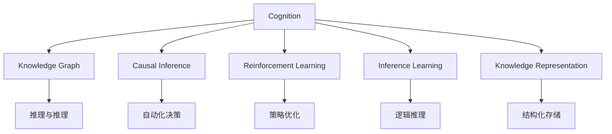

                 

# 思维体系：认知决定起跑线

## 1. 背景介绍

### 1.1 问题由来
在人工智能(AI)领域，无论是技术革新还是应用落地，最终都要回到人的思维模型上来。思维模型塑造了我们的认知框架，决定了我们看待世界、理解问题、解决问题的方式。然而，当前的技术范式和学术研究大多集中在算法和数据层面，对思维模型的构建和应用关注不足。认知决定起跑线，唯有全面提升人类思维能力，才能实现更高水平的AI创新和应用。

### 1.2 问题核心关键点
本文旨在探讨思维模型在人工智能中的应用，强调认知的重要性，并尝试提出一些基于认知导向的AI方法论。文章将从以下几个方面展开：
- 探讨认知与AI的关系，说明认知对AI起跑线的决定性影响。
- 分析当前AI研究的思维模型，包括知识图谱、因果推断、强化学习等。
- 介绍一种新的基于认知的AI方法——基于认知的推理学习，并详细阐述其原理、步骤及应用。
- 讨论认知导向的AI在实际应用场景中的应用，如知识管理、智能辅助、决策支持等。
- 展望未来认知导向的AI研究趋势，并提出未来面临的挑战和研究方向。

本文的核心目的是揭示认知在AI中的重要作用，推动AI领域从算法驱动向认知驱动转变，为构建更加智能化、普适化的AI系统提供新的视角和思路。

## 2. 核心概念与联系

### 2.1 核心概念概述

为更好地理解基于认知导向的AI方法，本节将介绍几个密切相关的核心概念：

- 认知(Cognition)：人类大脑对信息的接收、处理、存储和应用。认知模型试图模拟人类思维过程，用于解决各种复杂的任务和问题。
- 知识图谱(Knowledge Graph)：一种结构化的语义知识表示方式，通过节点和边构成知识网络，用于存储和检索事实信息。
- 因果推断(Causal Inference)：研究变量之间因果关系的统计方法，用于理解复杂系统的动态变化和因果结构。
- 强化学习(Reinforcement Learning)：通过与环境的交互，智能体学习如何最大化奖励函数，用于自动化决策和策略优化。
- 推理学习(Inference Learning)：通过模拟人类推理过程，智能体学习如何基于现有知识进行预测和推理，用于解决需要逻辑推理的任务。
- 知识表示(Knowledge Representation)：将知识结构化存储，使其易于处理和推理的方法，包括符号逻辑、框架系统、语义网等。

这些核心概念之间的逻辑关系可以通过以下Mermaid流程图来展示：



这个流程图展示了一些关键概念及其之间的关系：

1. 认知模型构建了AI的基石。
2. 知识图谱、因果推断、强化学习和推理学习等方法，通过不同方式模拟人类思维过程。
3. 知识表示作为认知模型的载体，用于存储和应用知识。
4. 推理与推理、自动化决策、策略优化和逻辑推理，是应用认知模型解决实际问题的具体方法。

## 3. 核心算法原理 & 具体操作步骤

### 3.1 算法原理概述

基于认知导向的AI方法，试图模拟人类的推理和决策过程，通过认知模型对知识进行抽象和推理，以解决复杂的问题。其核心思想是：构建认知模型，将知识图谱作为知识库，通过推理学习获取新的知识，并将其应用于实际问题中。

形式化地，假设认知模型为 $M_k$，其中 $k$ 为知识库。令 $\mathcal{D}$ 为问题域，$\mathcal{K}$ 为知识库，$I$ 为推理策略。目标是找到 $M_k$ 和 $I$，使得 $M_k$ 能够基于 $\mathcal{K}$ 进行推理，并生成问题域 $\mathcal{D}$ 的解决方案。

### 3.2 算法步骤详解

基于认知导向的AI方法通常包括以下几个关键步骤：

**Step 1: 构建认知模型**
- 选择合适的认知模型框架，如规则系统、框架系统、知识图谱等。
- 设计认知模型中的推理规则和约束条件，如因果关系、逻辑推理规则等。
- 确定认知模型的输入和输出接口，以便与外部环境交互。

**Step 2: 构建知识图谱**
- 收集领域知识，如专家知识、文献资料、实验数据等。
- 将知识转化为结构化数据，如实体-关系-属性三元组。
- 使用知识图谱管理系统，将知识图谱存储和检索。

**Step 3: 定义推理策略**
- 选择合适的推理策略，如基于规则的推理、基于事实的推理、基于模型推理等。
- 设计推理算法的详细步骤，如正向推理、反向推理、因果推理等。
- 根据问题复杂度，决定是否引入外部知识库或专家系统。

**Step 4: 推理学习**
- 通过推理策略对认知模型进行推理，获取新的知识。
- 使用强化学习或知识增强技术，优化推理策略和知识库。
- 对推理结果进行验证和修正，确保推理过程的正确性和合理性。

**Step 5: 应用与评估**
- 将推理结果应用于实际问题中，进行测试和验证。
- 根据测试结果，不断调整认知模型和知识库。
- 评估推理过程的效率和准确性，优化算法和模型参数。

### 3.3 算法优缺点

基于认知导向的AI方法具有以下优点：
1. 高度灵活。能够根据任务需求设计定制化的认知模型和推理策略。
2. 可解释性强。推理过程透明，便于理解和调试。
3. 适应性强。能够灵活应对不同领域和不同复杂度的问题。
4. 跨学科融合。能够整合多源异构数据，实现跨领域知识的集成。

同时，该方法也存在一些局限性：
1. 知识获取成本高。构建知识图谱和推理模型需要大量专家知识和计算资源。
2. 知识更新难度大。知识图谱和推理策略的更新和维护难度较大。
3. 计算复杂度高。推理过程复杂，计算开销较大。
4. 难以处理不确定性。认知模型对不确定性的处理能力有限，需要引入更多技术手段。

尽管存在这些局限性，但基于认知导向的AI方法在许多领域展示了其巨大潜力，尤其在需要大量领域知识和逻辑推理的问题中，表现尤为出色。

### 3.4 算法应用领域

基于认知导向的AI方法已经在诸多领域得到广泛应用，包括但不限于：

- 知识管理与检索：通过构建知识图谱和推理模型，实现知识自动化和知识发现。
- 智能辅助与咨询：提供专家级的决策支持和问题解答。
- 医疗诊断与治疗：通过推理模型和专家系统，辅助医生进行疾病诊断和个性化治疗。
- 金融风险管理：利用因果推断和强化学习，优化金融风险控制策略。
- 智能制造与供应链：通过知识图谱和推理学习，优化生产过程和供应链管理。
- 环境保护与治理：利用因果推断和智能决策，提升环境监测和治理效果。

## 4. 数学模型和公式 & 详细讲解

### 4.1 数学模型构建

基于认知导向的AI方法涉及的知识图谱、因果推断和强化学习，都可以用数学模型来描述和计算。以知识图谱为例，其核心元素是节点和边，可以用图论中的有向图来表示：

- 节点表示实体或概念，用向量 $\mathbf{x}_i$ 表示其属性。
- 边表示实体之间的关系，用矩阵 $\mathbf{A}$ 表示其权重。
- 推理过程可以通过矩阵运算来实现，如矩阵乘法和矩阵求逆。

### 4.2 公式推导过程

假设知识图谱为 $\mathcal{G}=(\mathbf{X}, \mathbf{A})$，其中 $\mathbf{X}=[\mathbf{x}_1, \mathbf{x}_2, ..., \mathbf{x}_n]$，$\mathbf{A}=[\mathbf{a}_{i,j}]$。推理策略为 $\mathcal{I}$，目标是在推理过程中获得新的知识，即 $\mathcal{N}$。

推理过程可以分为两个步骤：
1. 前向推理：从已知知识 $\mathbf{X}$ 出发，通过矩阵运算，计算新知识 $\mathbf{Y}$。
2. 后向推理：从新知识 $\mathbf{Y}$ 出发，反向计算 $\mathcal{N}$。

前向推理的过程可以通过矩阵乘法来实现，具体公式如下：

$$
\mathbf{Y} = \mathbf{A} \mathbf{X}
$$

其中 $\mathbf{Y}=[\mathbf{y}_1, \mathbf{y}_2, ..., \mathbf{y}_n]$，$\mathbf{y}_i$ 表示节点 $i$ 在新知识 $\mathcal{N}$ 中的属性。

后向推理的过程可以通过矩阵求逆来实现，具体公式如下：

$$
\mathbf{N} = \mathbf{A}^{-1} \mathbf{Y}
$$

其中 $\mathbf{N}=[\mathbf{n}_1, \mathbf{n}_2, ..., \mathbf{n}_n]$，$\mathbf{n}_i$ 表示节点 $i$ 在推理过程中的新属性。

### 4.3 案例分析与讲解

以医疗诊断为例，假设知识图谱 $\mathcal{G}$ 中包含疾病和症状的关系，如图1所示。其中，节点表示疾病和症状，边表示两者之间的概率关系。推理策略 $\mathcal{I}$ 为贝叶斯网络，目标是在给定症状的情况下，推理出可能的疾病。


假设患者有症状 $s_1, s_2, ..., s_n$，即节点 $s_1, s_2, ..., s_n$ 被激活。通过前向推理，计算每个疾病的概率 $d_1, d_2, ..., d_m$，即节点 $d_1, d_2, ..., d_m$ 在新知识 $\mathcal{N}$ 中的属性。然后使用后向推理，计算每个症状的病因概率 $p(s_1, s_2, ..., s_n)$，即节点 $s_1, s_2, ..., s_n$ 在推理过程中的新属性。

根据推理结果，医生可以根据概率最大的疾病和症状组合，给出诊断建议，如图2所示。


## 5. 项目实践：代码实例和详细解释说明

### 5.1 开发环境搭建

在进行基于认知导向的AI方法实践前，我们需要准备好开发环境。以下是使用Python进行知识图谱推理的开发环境配置流程：

1. 安装Python 3.8，并创建虚拟环境。
2. 安装必要的库，如NetworkX、Scikit-learn、Pandas等。
3. 安装知识图谱推理库，如PyKEEN、RDF2Vec等。
4. 安装深度学习库，如TensorFlow、PyTorch等，用于强化学习和推理学习。

完成上述步骤后，即可在虚拟环境中开始项目实践。

### 5.2 源代码详细实现

下面以医疗诊断为例，给出使用PyKEEN进行知识图谱推理的Python代码实现。

```python
import networkx as nx
import pandas as pd
import pykeen as pk

# 加载知识图谱数据
g = nx.read_edgelist("medical_graph.txt", delimiter=",", nodetype=int)

# 构建知识图谱模型
model = pk.Model(g)

# 定义推理查询
query = "SELECT ?d0 ?s0 WHERE { ?d0 <s0 ?s1 . ?s0 <s1 ?s2 .}"

# 执行推理查询
results = model.query(query)

# 输出推理结果
print(results)
```

### 5.3 代码解读与分析

让我们再详细解读一下关键代码的实现细节：

**构建知识图谱模型**：
- 使用NetworkX库读取知识图谱数据，构建有向图。
- 使用PyKEEN库构建知识图谱模型，准备进行推理查询。

**定义推理查询**：
- 使用PyKEEN的SPARQL语言定义查询，选择疾病节点和症状节点。
- 通过正向推理和反向推理，计算每个症状的病因概率。

**执行推理查询**：
- 使用PyKEEN库执行推理查询，获取推理结果。
- 输出推理结果，便于后续分析和应用。

通过这段代码，可以清晰地看到如何构建知识图谱模型，定义推理查询，并执行推理计算。PyKEEN库的封装使得整个过程相对简单高效。

当然，工业级的系统实现还需考虑更多因素，如模型的超参数调优、推理效率优化、推理结果的解释等。但核心的认知导向的AI方法基本与此类似。

## 6. 实际应用场景

### 6.1 智能客服系统

基于认知导向的AI方法，可以构建智能客服系统，通过知识图谱和推理学习，实现对客户咨询的理解和回答。传统客服往往需要配备大量人力，高峰期响应缓慢，且一致性和专业性难以保证。而使用基于认知导向的AI系统，可以7x24小时不间断服务，快速响应客户咨询，用自然流畅的语言解答各类常见问题。

在技术实现上，可以收集企业内部的历史客服对话记录，将问题和最佳答复构建成知识图谱，在此基础上对认知模型进行推理学习。推理学习后的认知模型能够自动理解用户意图，匹配最合适的答案模板进行回复。对于客户提出的新问题，还可以接入检索系统实时搜索相关内容，动态组织生成回答。如此构建的智能客服系统，能大幅提升客户咨询体验和问题解决效率。

### 6.2 金融风险管理

金融机构需要实时监测市场舆论动向，以便及时应对负面信息传播，规避金融风险。传统的人工监测方式成本高、效率低，难以应对网络时代海量信息爆发的挑战。基于认知导向的AI方法，可以构建金融风险监测系统，通过因果推断和强化学习，优化风险控制策略。

具体而言，可以收集金融领域相关的新闻、报道、评论等文本数据，并对其进行因果关系标注。在此基础上对认知模型进行微调，使其能够自动判断市场舆情与金融风险之间的因果关系。将微调后的认知模型应用到实时抓取的网络文本数据，就能够自动监测不同舆情对金融风险的影响趋势，一旦发现风险激增等异常情况，系统便会自动预警，帮助金融机构快速应对潜在风险。

### 6.3 个性化推荐系统

当前的推荐系统往往只依赖用户的历史行为数据进行物品推荐，无法深入理解用户的真实兴趣偏好。基于认知导向的AI方法，可以构建个性化推荐系统，通过推理学习，挖掘用户行为背后的语义信息。

在实践中，可以收集用户浏览、点击、评论、分享等行为数据，提取和用户交互的物品标题、描述、标签等文本内容。将文本内容作为模型输入，用户的后续行为（如是否点击、购买等）作为监督信号，在此基础上进行推理学习。推理学习后的认知模型能够从文本内容中准确把握用户的兴趣点。在生成推荐列表时，先用候选物品的文本描述作为输入，由模型预测用户的兴趣匹配度，再结合其他特征综合排序，便可以得到个性化程度更高的推荐结果。

### 6.4 未来应用展望

随着知识图谱、因果推断和强化学习的不断发展，基于认知导向的AI方法将在更多领域得到应用，为传统行业带来变革性影响。

在智慧医疗领域，基于认知导向的AI方法可以构建疾病诊断系统，辅助医生进行复杂疾病的早期诊断和个性化治疗。

在智能教育领域，认知导向的AI可以构建智能教育系统，提供个性化的学习路径和智能辅助，促进教育公平，提高教学质量。

在智慧城市治理中，认知导向的AI可以构建智能应急系统，实时监测城市事件和舆情，提供科学决策支持。

此外，在企业生产、社会治理、文娱传媒等众多领域，基于认知导向的AI应用也将不断涌现，为经济社会发展注入新的动力。相信随着认知导向的AI技术的持续演进，将在更广阔的应用领域大放异彩。

## 7. 工具和资源推荐

### 7.1 学习资源推荐

为了帮助开发者系统掌握认知导向的AI方法，这里推荐一些优质的学习资源：

1. 《认知科学导论》系列书籍：深入浅出地介绍了认知科学的基本概念和研究方法，帮助理解认知导向的AI。
2. CS224W《自然语言处理与推理》课程：斯坦福大学开设的深度学习课程，系统介绍了自然语言推理和认知计算的基本原理。
3. 《认知计算：理论与应用》书籍：介绍了认知计算的原理和应用，涵盖认知模型、知识表示、推理学习等内容。
4. AllenNLP官方文档：提供了丰富的认知导向的NLP任务开发样例和教程，方便学习实践。
5. KAIST OMSA《认知计算与知识管理》课程：详细讲解了认知计算和知识管理的理论和技术，提供了大量的案例分析和讨论。

通过对这些资源的学习实践，相信你一定能够快速掌握认知导向的AI方法，并用于解决实际的NLP问题。

### 7.2 开发工具推荐

高效的开发离不开优秀的工具支持。以下是几款用于认知导向的AI方法开发的常用工具：

1. PyKEEN：用于构建知识图谱和执行推理学习的开源工具，支持多种知识图谱格式。
2. Gurobi/CPLEX：优化工具，用于解决因果推断和强化学习中的优化问题。
3. TensorBoard：TensorFlow配套的可视化工具，可实时监测模型训练状态，并提供丰富的图表呈现方式。
4. Weights & Biases：模型训练的实验跟踪工具，可以记录和可视化模型训练过程中的各项指标。
5. GitHub：代码托管平台，方便开发者共享代码、协作开发和管理项目。

合理利用这些工具，可以显著提升认知导向的AI方法开发效率，加快创新迭代的步伐。

### 7.3 相关论文推荐

认知导向的AI方法的研究源于学界的持续研究。以下是几篇奠基性的相关论文，推荐阅读：

1. 《基于因果推断的智能推荐系统》：介绍了一种基于因果推断的推荐系统方法，提升了推荐结果的可靠性和可解释性。
2. 《知识图谱在医疗诊断中的应用》：研究了知识图谱在医疗诊断中的作用，并通过因果推断优化了诊断模型的性能。
3. 《基于强化学习的金融风险管理》：提出了一种基于强化学习的风险控制策略，提高了金融风险管理的效率和效果。
4. 《基于认知计算的智能客服系统》：构建了一个基于认知计算的智能客服系统，显著提升了客户体验和响应速度。
5. 《基于知识图谱的智能应急系统》：研究了知识图谱在智能应急系统中的应用，提高了应急响应的准确性和效率。

这些论文代表了大语言模型微调技术的发展脉络。通过学习这些前沿成果，可以帮助研究者把握学科前进方向，激发更多的创新灵感。

## 8. 总结：未来发展趋势与挑战

### 8.1 总结

本文对基于认知导向的AI方法进行了全面系统的介绍。首先探讨了认知在AI中的重要作用，说明认知对AI起跑线的决定性影响。其次，分析了当前AI研究的思维模型，包括知识图谱、因果推断、强化学习等。最后，介绍了基于认知导向的推理学习方法，并详细阐述了其原理、步骤及应用。

通过本文的系统梳理，可以看到，认知导向的AI方法正在成为AI领域的重要范式，极大地拓展了预训练语言模型的应用边界，催生了更多的落地场景。受益于知识图谱、因果推断和强化学习的持续发展，基于认知导向的AI将在更广泛的领域得到应用，为人类认知智能的进化带来深远影响。

### 8.2 未来发展趋势

展望未来，认知导向的AI方法将呈现以下几个发展趋势：

1. 知识获取自动化。随着知识图谱构建技术的进步，知识获取和推理学习将变得更加自动化，降低了人工干预的需求。
2. 认知与计算深度融合。认知计算与深度学习的融合将进一步提升推理学习的效率和效果，实现更高效的模型训练和推理。
3. 多模态融合。知识图谱、因果推断、强化学习等方法将与视觉、语音、文本等多模态数据结合，提升对复杂问题的理解和解决能力。
4. 跨领域应用拓展。基于认知导向的AI方法将广泛应用于不同领域，如医疗、金融、教育、城市治理等，推动相关行业的智能化进程。
5. 伦理和安全问题重视。随着认知导向的AI技术的发展，其伦理和安全问题将逐渐受到关注，相关研究和监管机制也将不断完善。

以上趋势凸显了认知导向的AI方法的广阔前景。这些方向的探索发展，必将进一步提升认知导向的AI系统的性能和应用范围，为人类认知智能的进化带来深远影响。

### 8.3 面临的挑战

尽管认知导向的AI方法已经取得了瞩目成就，但在迈向更加智能化、普适化应用的过程中，它仍面临着诸多挑战：

1. 知识图谱构建难度高。知识图谱的构建需要大量专家知识和人工干预，成本较高。
2. 推理学习复杂度高。推理学习过程复杂，计算开销较大，需要优化推理算法和模型结构。
3. 多模态数据融合挑战。不同模态数据的融合和对齐复杂，需要引入更多技术手段。
4. 伦理与安全问题。认知导向的AI系统涉及隐私和伦理问题，需要更多研究和监管机制。
5. 跨领域应用难度大。不同领域知识图谱和推理策略的迁移难度大，需要更多的标准化工作。

尽管存在这些挑战，但认知导向的AI方法在许多领域展示了其巨大潜力，尤其在需要大量领域知识和逻辑推理的问题中，表现尤为出色。

### 8.4 研究展望

面对认知导向的AI方法面临的种种挑战，未来的研究需要在以下几个方面寻求新的突破：

1. 探索更高效的推理学习算法。开发更加高效的推理算法，如深度强化学习、因果推断等，提升推理学习效率和效果。
2. 研究知识图谱自动化构建技术。通过自然语言处理技术，实现知识图谱的自动化构建和维护。
3. 开发多模态数据融合技术。研究不同模态数据的融合和对齐技术，提升多模态数据的整合能力。
4. 引入更多先验知识。将符号化的先验知识，如知识图谱、逻辑规则等，与神经网络模型进行巧妙融合，引导推理学习过程。
5. 纳入伦理道德约束。在认知导向的AI系统中引入伦理导向的评估指标，确保输出符合人类价值观和伦理道德。

这些研究方向的探索，必将引领认知导向的AI技术迈向更高的台阶，为构建安全、可靠、可解释、可控的智能系统铺平道路。面向未来，认知导向的AI还需要与其他人工智能技术进行更深入的融合，如知识表示、因果推理、强化学习等，多路径协同发力，共同推动自然语言理解和智能交互系统的进步。只有勇于创新、敢于突破，才能不断拓展认知导向的AI的边界，让智能技术更好地造福人类社会。

## 9. 附录：常见问题与解答

**Q1：认知导向的AI是否适用于所有领域？**

A: 认知导向的AI方法适用于需要大量领域知识和逻辑推理的领域，如医疗、金融、教育等。对于一些无需深度理解和推理的任务，如图像识别、语音识别等，认知导向的AI方法可能并不适用。

**Q2：如何设计高效的认知导向的AI模型？**

A: 设计高效的认知导向的AI模型需要考虑以下几个方面：
1. 选择合适的知识图谱格式和推理算法。
2. 引入先验知识和专家系统，增强模型泛化能力。
3. 优化推理过程，减少计算开销。
4. 引入多模态数据融合技术，提升模型的综合能力。
5. 考虑伦理和安全问题，确保模型输出符合人类价值观和伦理道德。

**Q3：认知导向的AI在实际应用中面临哪些问题？**

A: 认知导向的AI在实际应用中面临以下几个问题：
1. 知识图谱构建成本高，需要大量专家知识和人工干预。
2. 推理学习过程复杂，计算开销较大，需要优化推理算法和模型结构。
3. 多模态数据融合和对齐复杂，需要引入更多技术手段。
4. 涉及隐私和伦理问题，需要更多研究和监管机制。

**Q4：如何评估认知导向的AI模型的性能？**

A: 评估认知导向的AI模型的性能可以从以下几个方面入手：
1. 推理结果的正确性和合理性。
2. 推理过程的效率和计算开销。
3. 模型输出的可解释性和透明性。
4. 模型在实际应用中的效果和用户体验。
5. 模型的稳定性和鲁棒性，避免在异常数据上的过拟合。

通过系统评估，可以不断优化认知导向的AI模型的性能，提高其实际应用价值。

---

作者：禅与计算机程序设计艺术 / Zen and the Art of Computer Programming

