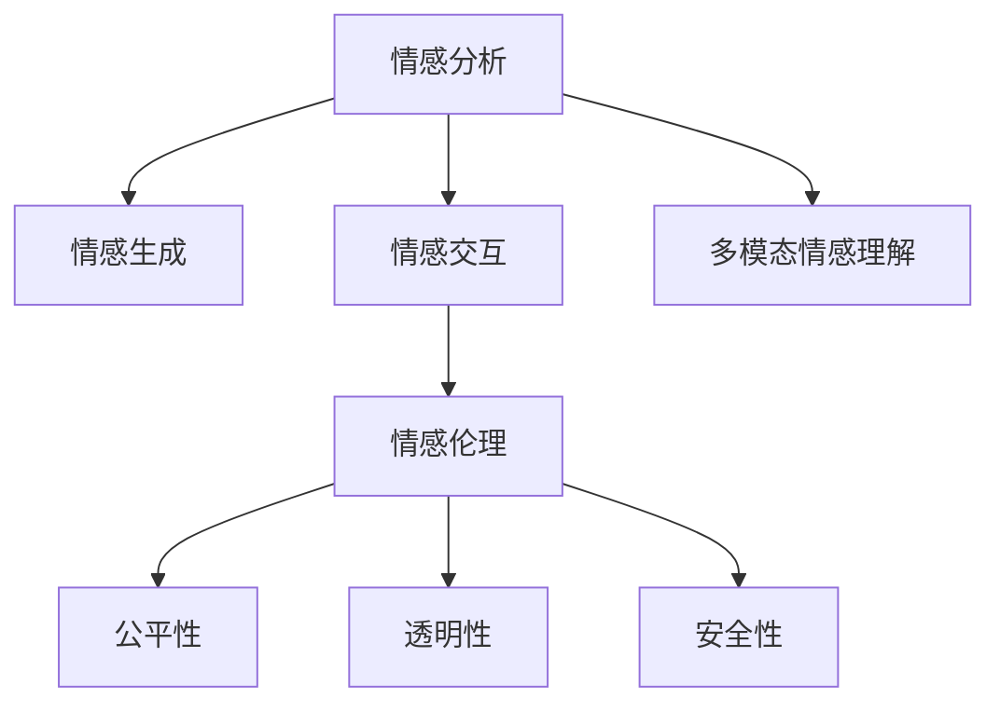

                 

# 情感AI：机器与人类情感的交互

> 关键词：情感分析,机器学习,深度学习,自然语言处理,NLP,计算机视觉,多模态交互,人工智能伦理,人机交互

## 1. 背景介绍

### 1.1 问题由来
随着社会的发展和科技的进步，情感AI（Affective AI）逐渐成为人工智能领域的热门研究方向。情感AI不仅关注机器如何理解和生成情感，还研究机器如何与人类进行情感交互，构建和谐的人机关系。在医疗、教育、客服、社交媒体等领域，情感AI的应用越来越广泛，成为提升用户体验和服务质量的重要手段。

### 1.2 问题核心关键点
情感AI的核心在于如何准确识别和理解人类的情感，并将其转化为计算机能够理解的语言和行为。目前，情感AI的主要研究方向包括情感识别、情感生成、情感交互和多模态情感理解等。

## 2. 核心概念与联系

### 2.1 核心概念概述

为更好地理解情感AI的原理与架构，本节将介绍几个关键概念及其相互联系：

- 情感分析（Affective Analysis）：指利用机器学习或深度学习技术，从文本、语音、图像等数据中提取情感信息，识别出其中蕴含的情感状态和情感强度。
- 情感生成（Affective Generation）：指基于情感分析结果，通过生成对抗网络（GAN）等技术，自动生成符合特定情感状态和语境的文本、语音或图像。
- 情感交互（Affective Interaction）：指在情感AI系统的辅助下，机器能够理解人类情感并做出适当的情感反馈，实现与用户的情感交流。
- 多模态情感理解（Multimodal Affective Understanding）：指综合利用文本、语音、图像等多模态数据，全面理解和识别用户的情感状态，增强情感AI系统的感知能力和反应速度。
- 情感伦理（Affective Ethics）：指在情感AI系统设计和使用过程中，如何确保系统的公平性、透明性和安全性，避免对人类情感的误导和伤害。

这些概念之间的逻辑关系可以通过以下Mermaid流程图来展示：



### 2.2 核心概念原理和架构的 Mermaid 流程图


该流程图展示了情感AI的核心概念及其相互关系：

1. 情感分析作为基础，从多种数据源中提取情感信息，构建情感知识图谱。
2. 情感生成利用情感分析结果，自动生成符合特定情感状态和语境的文本、语音或图像，增强情感表达的丰富性和多样性。
3. 情感交互在情感分析与情感生成的基础上，实现与用户的情感交流，提升用户体验。
4. 多模态情感理解通过综合利用多种数据源，全面理解用户的情感状态，增强系统的感知能力和鲁棒性。
5. 情感伦理确保系统的公平性、透明性和安全性，避免对人类情感的误导和伤害。

## 3. 核心算法原理 & 具体操作步骤

### 3.1 算法原理概述

情感AI的算法原理主要基于情感分析、情感生成和情感交互三个方面。情感分析通过文本、语音、图像等多模态数据，提取和识别情感信息；情感生成基于情感分析结果，生成符合特定情感状态和语境的文本、语音或图像；情感交互在情感分析与情感生成的基础上，实现与用户的情感交流，提升用户体验。

情感AI的核心算法包括：

- 情感分类算法：用于识别文本、语音或图像中的情感类别，如正面情感、负面情感、中性情感等。
- 情感强度算法：用于量化情感的强度，如情感极性（Positive/Negative）和情感强度（Strong/Weak）。
- 情感生成算法：利用情感分类和强度结果，生成符合特定情感状态和语境的文本、语音或图像。
- 情感交互算法：在情感分析与情感生成的基础上，实现与用户的情感交流，如情感反馈、情感引导等。

### 3.2 算法步骤详解

以下详细介绍情感AI的各个核心算法步骤：

**情感分类算法**：

1. **数据预处理**：收集文本、语音、图像等多种数据源，并进行预处理，如分词、特征提取等。
2. **特征提取**：利用词嵌入、情感词典等方法，从预处理后的文本中提取情感特征。
3. **模型训练**：选择合适的分类模型（如SVM、CNN、RNN、Transformer等），并利用标注数据进行训练，得到情感分类器。
4. **情感预测**：利用训练好的情感分类器，对新数据进行情感分类。

**情感强度算法**：

1. **情感分类结果**：从情感分类结果中，提取情感类别（Positive/Negative）。
2. **情感词典匹配**：利用情感词典，匹配情感类别对应的情感强度（Strong/Weak）。
3. **多模态融合**：结合文本、语音、图像等多模态数据，综合评估情感强度。
4. **情感强度输出**：根据多模态融合结果，输出情感强度值。

**情感生成算法**：

1. **情感分类结果**：从情感分类结果中，提取情感类别和强度。
2. **生成模型训练**：选择合适的生成模型（如GAN、VAE、LSTM等），并利用标注数据进行训练，得到情感生成器。
3. **情感生成**：利用训练好的情感生成器，生成符合特定情感状态和语境的文本、语音或图像。
4. **输出与优化**：对生成的文本、语音或图像进行后处理，如情感一致性检查、语义优化等，并输出最终结果。

**情感交互算法**：

1. **情感分析结果**：从情感分类算法中获取情感分析结果。
2. **情感生成结果**：从情感生成算法中获取情感生成结果。
3. **情感反馈**：根据情感分析结果和情感生成结果，构建情感反馈模型，实现与用户的情感交流。
4. **用户反馈**：收集用户的情感反馈，对情感交互算法进行优化，提升系统的交互效果。

### 3.3 算法优缺点

情感AI的算法具有以下优点：

- 高效识别：利用多模态数据和深度学习技术，能够高效识别和理解人类情感。
- 自然表达：基于情感生成算法，可以生成符合特定情感状态和语境的文本、语音或图像，增强情感表达的自然性和丰富性。
- 互动性强：在情感交互算法的支持下，实现与用户的情感交流，提升用户体验。
- 鲁棒性好：综合利用多种数据源和多模态融合技术，增强系统的鲁棒性和准确性。

同时，情感AI的算法也存在一些局限性：

- 数据依赖：情感分析算法的准确性依赖于标注数据的丰富性和多样性，数据获取和标注成本较高。
- 模型复杂：情感生成和情感交互算法往往需要复杂的模型结构和大量的训练数据，模型的训练和部署成本较高。
- 伦理问题：情感AI系统可能面临伦理和隐私问题，需要严格控制数据的收集和使用，确保系统的透明性和安全性。
- 交互难度：情感交互算法的复杂性和多样性，使得系统设计和实现难度较大，需要综合考虑多个因素。

### 3.4 算法应用领域

情感AI在多个领域都有广泛的应用，以下是几个典型应用场景：

- 医疗领域：利用情感分析，识别病人的情感状态，辅助医生诊断和治疗，提升医疗服务质量。
- 教育领域：通过情感生成，生成符合特定情感状态的课堂教学内容，提升学生的学习兴趣和效果。
- 客服领域：利用情感分类和情感生成，构建智能客服系统，实现情感引导和情感反馈，提升客户满意度。
- 社交媒体：综合利用文本、语音、图像等多模态数据，识别用户的情感状态，提供个性化的内容推荐和情感互动。
- 虚拟现实：在虚拟现实环境中，利用情感生成和情感交互技术，实现与用户的情感交互，提升沉浸式体验。

## 4. 数学模型和公式 & 详细讲解 & 举例说明

### 4.1 数学模型构建

情感AI的数学模型主要基于情感分类、情感强度和情感生成三个方面。情感分类和情感强度算法可以使用传统的机器学习模型，如SVM、KNN、决策树等；情感生成算法则需要利用深度学习模型，如GAN、VAE、RNN、Transformer等。

情感分类的数学模型可以表示为：

$$
\hat{y} = f(x; \theta)
$$

其中 $x$ 表示输入特征，$\theta$ 表示模型参数，$f$ 表示分类函数，$\hat{y}$ 表示分类结果。常用的分类函数包括逻辑回归、SVM、决策树等。

情感强度的数学模型可以表示为：

$$
\hat{s} = g(y; \phi)
$$

其中 $y$ 表示情感分类结果，$\phi$ 表示模型参数，$g$ 表示强度函数，$\hat{s}$ 表示情感强度。常用的强度函数包括线性回归、对数函数、指数函数等。

情感生成的数学模型可以表示为：

$$
z = h(x; \omega)
$$

$$
y = f(z; \theta)
$$

其中 $x$ 表示输入特征，$\theta$ 表示生成模型参数，$\omega$ 表示生成器参数，$z$ 表示生成结果，$y$ 表示生成输出。常用的生成模型包括GAN、VAE、RNN、Transformer等。

### 4.2 公式推导过程

以下详细介绍情感分类的公式推导过程：

假设训练集为 $D=\{(x_i,y_i)\}_{i=1}^N$，其中 $x_i$ 表示样本特征，$y_i$ 表示标签。使用逻辑回归模型进行情感分类，其损失函数为：

$$
L(\theta) = -\frac{1}{N}\sum_{i=1}^N [y_i\log f(x_i; \theta) + (1-y_i)\log (1-f(x_i; \theta))]
$$

其中 $f(x; \theta) = \frac{1}{1+\exp(-\theta^T x)}$ 表示逻辑回归模型的输出。

使用梯度下降算法，求解模型参数 $\theta$，最小化损失函数 $L(\theta)$。具体步骤包括：

1. 初始化模型参数 $\theta$。
2. 计算模型输出 $f(x; \theta)$。
3. 计算损失函数 $L(\theta)$。
4. 计算梯度 $\nabla_{\theta}L(\theta)$。
5. 更新模型参数 $\theta \leftarrow \theta - \eta \nabla_{\theta}L(\theta)$，其中 $\eta$ 表示学习率。
6. 重复步骤2-5，直至收敛。

### 4.3 案例分析与讲解

以情感分类算法为例，我们以情感分类模型在IEMOCAP数据集上的应用为例进行讲解。IEMOCAP是一个大规模的情感语音数据集，包含多种情感类别的语音样本，如愤怒、悲伤、快乐等。

1. **数据预处理**：对语音样本进行分帧、特征提取，得到MFCC特征。
2. **模型训练**：利用逻辑回归模型，在IEMOCAP数据集上进行训练，得到情感分类器。
3. **情感预测**：对新语音样本进行分帧、特征提取，输入情感分类器，输出情感分类结果。
4. **评估与优化**：在测试集上评估情感分类器的准确率和召回率，根据结果进行优化，提高模型的性能。

## 5. 项目实践：代码实例和详细解释说明

### 5.1 开发环境搭建

在进行情感AI项目实践前，我们需要准备好开发环境。以下是使用Python进行TensorFlow开发的环境配置流程：

1. 安装Anaconda：从官网下载并安装Anaconda，用于创建独立的Python环境。

2. 创建并激活虚拟环境：
```bash
conda create -n tensorflow-env python=3.8 
conda activate tensorflow-env
```

3. 安装TensorFlow：从官网获取对应的安装命令。例如：
```bash
conda install tensorflow
```

4. 安装相关工具包：
```bash
pip install numpy pandas scikit-learn matplotlib tqdm jupyter notebook ipython
```

完成上述步骤后，即可在`tensorflow-env`环境中开始情感AI项目实践。

### 5.2 源代码详细实现

我们以情感生成算法为例，展示TensorFlow实现情感生成器的方法。

```python
import tensorflow as tf
from tensorflow.keras.layers import Input, Dense, Embedding, LSTM
from tensorflow.keras.models import Model

# 定义情感生成器模型
input_layer = Input(shape=(128,))
embedding_layer = Embedding(10000, 128, input_length=128)(input_layer)
lstm_layer = LSTM(128)(embedding_layer)
output_layer = Dense(1, activation='sigmoid')(lstm_layer)

model = Model(inputs=input_layer, outputs=output_layer)

# 编译模型
model.compile(loss='binary_crossentropy', optimizer='adam', metrics=['accuracy'])

# 加载数据集
train_data = np.load('train_data.npy')
train_labels = np.load('train_labels.npy')

# 分割训练集和验证集
train_size = int(0.8 * len(train_data))
val_data = train_data[train_size:]
val_labels = train_labels[train_size:]

# 训练模型
model.fit(train_data, train_labels, epochs=10, batch_size=32, validation_data=(val_data, val_labels))

# 生成情感文本
new_input = np.random.randint(0, 10000, size=(1, 128))
generated_text = model.predict(new_input)[0]
print(generated_text)
```

以上代码展示了使用TensorFlow实现情感生成器的基本步骤。通过加载情感分类结果和强度结果，训练LSTM模型，利用LSTM模型生成情感文本。

### 5.3 代码解读与分析

以下是代码中关键部分的解读和分析：

- `input_layer`：定义输入层，形状为 $(128,)$。
- `embedding_layer`：定义嵌入层，将输入文本映射到低维向量空间，向量维度为 $128$。
- `lstm_layer`：定义LSTM层，对嵌入层输出的序列进行建模，输出维度为 $128$。
- `output_layer`：定义输出层，使用sigmoid激活函数，输出情感强度。
- `model`：定义模型，输入为 `input_layer`，输出为 `output_layer`。
- `model.compile`：编译模型，指定损失函数为二元交叉熵，优化器为Adam，评估指标为准确率。
- `model.fit`：训练模型，指定训练数据和标签，训练轮数为 $10$，批次大小为 $32$，验证集为分割后的数据和标签。
- `model.predict`：生成情感文本，输入随机生成的文本，输出情感强度。

## 6. 实际应用场景

### 6.1 智能客服系统

在智能客服系统中，情感AI可以用于情感识别和情感生成，提升客服系统的智能化水平。具体而言，系统可以自动识别用户情感状态，生成符合用户情感的回复，提高客服体验。

### 6.2 医疗诊断系统

在医疗诊断系统中，情感AI可以用于情感分类和情感强度评估，辅助医生进行病情分析和诊断。通过识别病人的情感状态和强度，医生可以更好地理解病人的心理状况，提供更为人性化的医疗服务。

### 6.3 教育评估系统

在教育评估系统中，情感AI可以用于情感分析和情感生成，评估学生的学习状态和情感变化。通过分析学生的情感变化，教师可以及时调整教学策略，提升教学效果。

### 6.4 社交媒体分析

在社交媒体分析中，情感AI可以用于情感分类和情感生成，分析用户的情感状态和情感变化。通过情感分析，企业可以更好地理解用户需求和市场趋势，优化产品和服务。

## 7. 工具和资源推荐

### 7.1 学习资源推荐

为了帮助开发者系统掌握情感AI的理论基础和实践技巧，这里推荐一些优质的学习资源：

1. 《情感分析与深度学习》：介绍了情感分析的基本概念和深度学习算法，是情感AI入门的必读书籍。
2. 《自然语言处理综述》：该书涵盖了自然语言处理的基本知识和前沿技术，包括情感分析、情感生成等。
3. Coursera《情感计算与人工智能》课程：由MIT教授主讲，系统介绍了情感计算的理论和应用。
4 TensorFlow官方文档：提供了情感AI相关算法的详细实现和示例，是学习情感AI的重要资源。
5 情感AI GitHub项目：收集了多个情感AI项目，涵盖了情感分类、情感生成、情感交互等多个方面，适合学习和参考。

### 7.2 开发工具推荐

高效的开发离不开优秀的工具支持。以下是几款用于情感AI开发的常用工具：

1. TensorFlow：基于Python的深度学习框架，灵活动态的计算图，适合快速迭代研究。
2. Keras：高层次的深度学习框架，提供了丰富的API和预训练模型，适合快速原型开发。
3. PyTorch：基于Python的开源深度学习框架，灵活动态的计算图，适合快速迭代研究。
4 TensorBoard：TensorFlow配套的可视化工具，可实时监测模型训练状态，并提供丰富的图表呈现方式。
5 Weights & Biases：模型训练的实验跟踪工具，可以记录和可视化模型训练过程中的各项指标，方便对比和调优。

合理利用这些工具，可以显著提升情感AI任务的开发效率，加快创新迭代的步伐。

### 7.3 相关论文推荐

情感AI的研究源于学界的持续研究。以下是几篇奠基性的相关论文，推荐阅读：

1. SentiWordNet: A lexical resource for opinion mining：提出了基于词汇情感极性和强度的情感词典，为情感分类提供了语义资源。
2. Emotion AI: From Sentiment Analysis to Affective Communication：综述了情感AI的基本概念和前沿技术，讨论了情感分类和情感生成的实现方法。
3 Emotion Classification with Deep Learning: A Review:The affective potential of deep learning for automated emotion recognition：综述了基于深度学习的情感分类算法，比较了不同模型的优缺点。
4 Deep Emotion Recognition using Multimodal Fusion：研究了多模态情感识别的算法，提出了基于特征融合的情感分类方法。

这些论文代表了大情感AI的研究脉络。通过学习这些前沿成果，可以帮助研究者把握学科前进方向，激发更多的创新灵感。

## 8. 总结：未来发展趋势与挑战

### 8.1 总结

本文对情感AI的基本原理和实现方法进行了全面系统的介绍。首先阐述了情感AI的研究背景和意义，明确了情感分类、情感生成和情感交互等核心技术在情感AI中的重要地位。其次，从原理到实践，详细讲解了情感分类的数学模型和算法步骤，给出了情感生成算法的代码实现。同时，本文还探讨了情感AI在智能客服、医疗诊断、教育评估、社交媒体等多个领域的应用前景，展示了情感AI技术的巨大潜力。此外，本文精选了情感AI相关的学习资源，力求为读者提供全方位的技术指引。

通过本文的系统梳理，可以看到，情感AI技术正在成为人工智能领域的重要方向，极大地提升了人机交互的智能化水平，为用户体验带来了显著改善。未来，伴随情感AI的不断发展，必将在更多领域带来变革性影响。

### 8.2 未来发展趋势

展望未来，情感AI技术将呈现以下几个发展趋势：

1. 多模态融合：综合利用文本、语音、图像等多模态数据，全面理解用户的情感状态，增强系统的感知能力和鲁棒性。
2. 情感生成：利用生成对抗网络（GAN）等技术，生成符合特定情感状态和语境的文本、语音或图像，增强情感表达的自然性和多样性。
3. 情感交互：在情感生成和情感分类的基础上，实现与用户的情感交流，提升用户体验。
4. 情感伦理：在情感AI系统设计和使用过程中，确保系统的公平性、透明性和安全性，避免对人类情感的误导和伤害。
5. 情感推理：利用因果推断和符号推理等技术，增强情感AI系统的推理能力和可解释性，提升系统的可信度。

以上趋势凸显了情感AI技术的广阔前景。这些方向的探索发展，必将进一步提升情感AI系统的性能和应用范围，为构建和谐的人机关系提供新的动力。

### 8.3 面临的挑战

尽管情感AI技术已经取得了瞩目成就，但在迈向更加智能化、普适化应用的过程中，它仍面临诸多挑战：

1. 数据依赖：情感分类和情感生成的准确性依赖于标注数据的丰富性和多样性，数据获取和标注成本较高。
2. 模型复杂：情感生成和情感交互算法往往需要复杂的模型结构和大量的训练数据，模型的训练和部署成本较高。
3. 伦理问题：情感AI系统可能面临伦理和隐私问题，需要严格控制数据的收集和使用，确保系统的透明性和安全性。
4. 交互难度：情感交互算法的复杂性和多样性，使得系统设计和实现难度较大，需要综合考虑多个因素。
5. 用户接受：情感AI系统在实际应用中可能面临用户的抵触和质疑，需要加强用户教育和系统宣传。

### 8.4 研究展望

面对情感AI所面临的种种挑战，未来的研究需要在以下几个方面寻求新的突破：

1. 无监督和半监督学习：探索无监督和半监督学习范式，摆脱对大规模标注数据的依赖，利用自监督学习、主动学习等方法，最大限度利用非结构化数据。
2. 多模态融合技术：研究多模态情感理解的技术，提高系统的感知能力和鲁棒性，增强情感AI的泛化能力。
3. 参数高效和计算高效的微调范式：开发更加参数高效和计算高效的微调方法，在固定大部分预训练参数的同时，只更新极少量的任务相关参数，提高系统的部署效率。
4. 融合因果分析和符号推理：引入因果分析和符号推理等方法，增强情感AI系统的推理能力和可解释性，提升系统的可信度。
5. 引入伦理约束：在情感AI系统设计和使用过程中，引入伦理导向的评估指标，过滤和惩罚有偏见、有害的输出倾向，确保系统的公平性和安全性。

这些研究方向的探索，必将引领情感AI技术迈向更高的台阶，为构建和谐的人机关系提供新的技术路径。面向未来，情感AI技术还需要与其他人工智能技术进行更深入的融合，如知识表示、因果推理、强化学习等，多路径协同发力，共同推动情感AI技术的进步。只有勇于创新、敢于突破，才能不断拓展情感AI技术的边界，让情感AI技术更好地造福人类社会。

## 9. 附录：常见问题与解答

**Q1：情感AI在实际应用中需要考虑哪些因素？**

A: 情感AI在实际应用中需要考虑以下因素：

1. 数据获取和标注：情感分析的准确性依赖于标注数据的丰富性和多样性，数据获取和标注成本较高。
2. 模型选择和优化：选择合适的模型和算法，并进行适当的优化，提高系统的性能和鲁棒性。
3. 用户交互设计：设计合理的用户交互界面，增强系统的易用性和用户体验。
4. 系统伦理和隐私：确保系统的公平性、透明性和安全性，避免对人类情感的误导和伤害。

这些因素都需要在设计和开发过程中综合考虑，才能实现情感AI系统的有效应用。

**Q2：情感AI如何处理噪声数据？**

A: 噪声数据对情感AI的准确性有较大影响，可以采用以下方法进行处理：

1. 数据清洗：对噪声数据进行清洗，去除无关和错误的数据，提高数据质量。
2. 数据增强：利用数据增强技术，如回译、近义替换等，扩充训练集，增强模型的泛化能力。
3. 多模态融合：综合利用文本、语音、图像等多模态数据，全面理解用户的情感状态，增强系统的鲁棒性。

通过这些方法，可以有效地处理噪声数据，提高情感AI系统的准确性和鲁棒性。

**Q3：情感AI在多模态数据融合时需要注意哪些问题？**

A: 情感AI在多模态数据融合时需要注意以下问题：

1. 数据对齐：不同模态的数据格式和维度不同，需要进行对齐和转换，确保数据的一致性。
2. 特征融合：利用特征融合技术，如时序对齐、时域特征融合等，将多模态数据进行融合，提高系统的感知能力。
3. 模型训练：选择合适的模型和算法，并进行适当的训练，确保系统在多模态数据上具有较好的泛化能力。

通过这些方法，可以有效地实现多模态数据的融合，提高情感AI系统的感知能力和鲁棒性。

**Q4：情感AI在实际应用中如何保证系统的可解释性？**

A: 情感AI在实际应用中，保证系统的可解释性是至关重要的。以下是一些常用的方法：

1. 规则约束：在模型训练中引入规则约束，限制模型的输出范围，增强系统的可解释性。
2. 特征可视化：利用特征可视化技术，如热力图、局部敏感度分析等，可视化模型的特征和权重，增强系统的可解释性。
3. 因果推断：引入因果推断方法，分析模型输出的因果关系，增强系统的可解释性。
4. 符号推理：引入符号推理技术，增强系统的推理能力和可解释性，提升系统的可信度。

通过这些方法，可以有效地保证情感AI系统的可解释性，增强系统的可信度和透明性。

**Q5：情感AI在实际应用中如何确保系统的安全性？**

A: 情感AI在实际应用中，确保系统的安全性是至关重要的。以下是一些常用的方法：

1. 数据隐私保护：在数据收集和处理过程中，采用数据脱敏、加密等技术，保护用户隐私。
2. 模型鲁棒性：利用对抗训练等技术，增强模型的鲁棒性和抗干扰能力，防止模型的误判和攻击。
3. 系统监控：实时监控系统的运行状态，检测异常行为和异常数据，及时采取措施，保障系统的安全性。

通过这些方法，可以有效地确保情感AI系统的安全性，保障用户的隐私和数据安全。

---

作者：禅与计算机程序设计艺术 / Zen and the Art of Computer Programming

