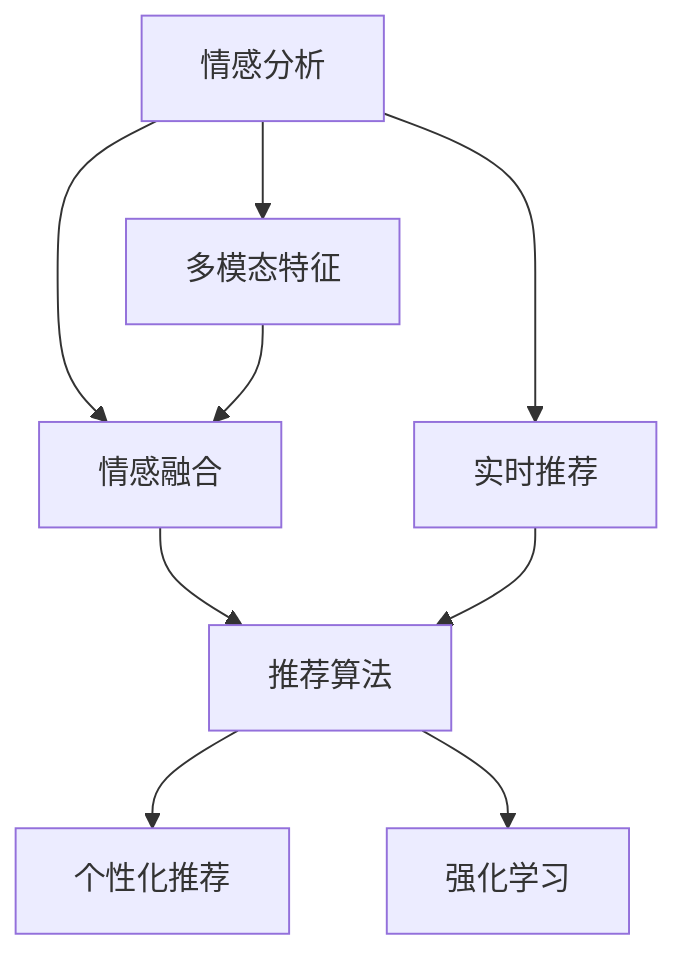

                 

# 情感驱动推荐：AI如何理解用户情绪，提供个性化推荐

## 1. 背景介绍

### 1.1 问题由来
在当前互联网时代，用户获取信息的方式越来越多样，内容推荐系统成为各大互联网平台提高用户留存率、活跃度和收益的重要手段。推荐系统通过分析用户行为数据，为用户推荐感兴趣的物品（如新闻、视频、商品等），使用户能够快速发现所需内容。

传统的推荐系统多基于用户的显式反馈（如评分、点击等）或隐式行为（如浏览、停留时间等）进行推荐。这些方法虽已取得不错的效果，但忽视了用户情绪对行为的影响，难以充分反映用户的真实偏好。随着情感分析技术的成熟，情感驱动推荐系统逐渐成为新的研究热点。

### 1.2 问题核心关键点
情感驱动推荐系统利用情感分析技术，识别用户的情绪状态，并结合其历史行为和偏好，进行个性化的推荐。核心问题在于如何高效准确地理解用户情绪，并据此构建更合理的推荐模型。

具体而言，情感驱动推荐系统的核心在于：
1. **情感识别**：通过自然语言处理(NLP)技术，识别用户在文本中的情绪状态。
2. **情感融合**：将用户情绪与其他特征（如行为数据）进行融合，优化推荐模型。
3. **个性化推荐**：基于情感和行为数据的融合，推荐满足用户情绪偏好的物品。

本文将详细探讨情感驱动推荐系统的核心概念、算法原理、操作步骤，以及其在实际应用场景中的应用前景，力求为情感驱动推荐系统的开发和应用提供参考。

## 2. 核心概念与联系

### 2.1 核心概念概述

为更好地理解情感驱动推荐系统，本节将介绍几个密切相关的核心概念：

- **情感分析**：通过自然语言处理(NLP)技术，识别文本中的情绪状态，如快乐、愤怒、悲伤等。
- **推荐系统**：根据用户的历史行为和偏好，为其推荐感兴趣的物品，提高用户满意度。
- **个性化推荐**：根据用户个性化的需求，提供量身定制的推荐结果，提高推荐效果和用户体验。
- **多模态特征**：结合文本、图像、音频等多模态数据，进行更全面的用户情绪识别和推荐。
- **实时推荐**：利用实时数据流处理技术，动态更新推荐结果，满足用户即时需求。
- **强化学习**：通过奖励机制，不断优化推荐策略，提高推荐系统的性能。

这些核心概念之间的逻辑关系可以通过以下Mermaid流程图来展示：



这个流程图展示了情感驱动推荐系统的主要组成部分及其逻辑关系：

1. 情感分析识别用户情绪，为情感融合提供数据。
2. 情感融合将情绪数据与其他特征进行融合，优化推荐模型。
3. 个性化推荐根据用户情绪和行为数据，进行个性化推荐。
4. 多模态特征结合文本、图像、音频等多模态数据，提高识别准确性。
5. 实时推荐利用实时数据流处理技术，动态更新推荐结果。
6. 强化学习通过奖励机制，不断优化推荐策略，提高性能。

这些核心概念共同构成了情感驱动推荐系统的框架，使其能够更好地理解用户情绪，提供精准的个性化推荐。

## 3. 核心算法原理 & 具体操作步骤

### 3.1 算法原理概述

情感驱动推荐系统主要通过以下几个步骤来实现：

1. **情感识别**：通过自然语言处理(NLP)技术，识别用户在文本中的情绪状态。
2. **情感融合**：将用户情绪与其他特征（如行为数据）进行融合，优化推荐模型。
3. **个性化推荐**：基于情感和行为数据的融合，推荐满足用户情绪偏好的物品。

核心算法包括情感识别算法、情感融合算法和推荐算法。

### 3.2 算法步骤详解

#### 3.2.1 情感识别算法

情感识别算法通过文本中的情感特征（如情感词、情感强度等）来识别用户情绪。常见的情感识别方法包括：

- **词典法**：使用情感词典（如AFINN、VADER）进行情感打分，根据情感得分判断文本情感极性。
- **机器学习方法**：通过训练情感分类模型（如SVM、LSTM等）进行情感分类。
- **深度学习方法**：使用预训练的语言模型（如BERT、GPT等）进行情感识别。

#### 3.2.2 情感融合算法

情感融合算法将识别到的用户情绪与其他特征（如行为数据、兴趣标签等）进行融合，生成融合特征向量。常用的融合方法包括：

- **加权融合**：根据不同特征的重要性，赋予不同权重，进行加权求和。
- **拼接融合**：将不同特征进行拼接，形成高维特征向量。
- **注意力机制**：通过注意力机制，动态权衡不同特征的贡献。

#### 3.2.3 推荐算法

推荐算法根据融合特征向量进行个性化推荐，常用的方法包括：

- **基于协同过滤**：通过用户-物品矩阵进行相似度计算，推荐物品。
- **基于矩阵分解**：将用户-物品矩阵分解为低秩矩阵，进行推荐。
- **基于深度学习**：使用预训练的语言模型进行推荐，如通过BERT进行推荐。

### 3.3 算法优缺点

情感驱动推荐系统具有以下优点：

- **个性化推荐**：通过情感分析，能够更准确地理解用户情绪，进行个性化推荐。
- **高效率**：情感分析可以通过预训练的模型实现，减少了手工标注的劳动。
- **多模态融合**：结合多模态数据进行情感分析，提高识别准确性。

同时，该方法也存在以下局限性：

- **数据依赖**：情感识别依赖于高质量的文本数据，数据获取和处理成本较高。
- **模型复杂**：情感融合和推荐算法复杂，需要较多计算资源。
- **偏见和误判**：情感分析可能存在偏见和误判，影响推荐效果。
- **隐私问题**：情感分析涉及用户情绪数据，存在隐私保护的风险。

尽管存在这些局限性，但情感驱动推荐系统在提供个性化推荐方面具有独特的优势，能够更好地满足用户需求。

### 3.4 算法应用领域

情感驱动推荐系统已经在多个领域得到了广泛的应用，例如：

- **电商推荐**：通过分析用户评论和商品描述，进行情感识别和推荐。
- **新闻推荐**：通过分析用户对新闻文章的情感反馈，推荐符合用户情绪的新闻。
- **音乐推荐**：通过分析用户听歌情绪，推荐符合情绪的音乐。
- **视频推荐**：通过分析用户对视频内容的情感反馈，推荐符合情绪的视频。

除了上述这些经典应用外，情感驱动推荐系统还被创新性地应用到更多场景中，如可控情感推荐、情感分析驱动的内容创作等，为内容推荐和情感管理提供了新的解决方案。

## 4. 数学模型和公式 & 详细讲解 & 举例说明

### 4.1 数学模型构建

情感驱动推荐系统的数学模型主要包括以下几个部分：

- **用户情绪识别模型**：通过情感词典或深度学习模型，识别用户情绪。
- **情感融合模型**：将情感数据与行为数据进行融合，生成融合特征向量。
- **推荐模型**：根据融合特征向量进行物品推荐。

### 4.2 公式推导过程

以基于协同过滤的推荐算法为例，推导情感驱动推荐系统的数学模型。

设用户集合为 $U=\{u_1,u_2,\dots,u_n\}$，物品集合为 $V=\{v_1,v_2,\dots,v_m\}$，用户 $u_i$ 对物品 $v_j$ 的评分记为 $r_{ij}$，用户 $u_i$ 的情感评分记为 $e_i$，物品 $v_j$ 的情感评分记为 $e_j$，情感融合后的用户-物品矩阵记为 $H \in \mathbb{R}^{n \times m}$。

根据协同过滤算法，用户 $u_i$ 对物品 $v_j$ 的预测评分 $\hat{r}_{ij}$ 可以表示为：

$$
\hat{r}_{ij} = \sum_{k=1}^{n}\alpha_{ik}r_{kj} + \beta e_i e_j
$$

其中 $\alpha_{ik}$ 为用户 $u_i$ 与用户 $u_k$ 之间的相似度系数，$r_{kj}$ 为用户 $u_k$ 对物品 $v_j$ 的评分，$e_i$ 和 $e_j$ 分别为用户和物品的情感评分，$\beta$ 为情感融合的权重系数。

通过最大化用户 $u_i$ 对物品 $v_j$ 的预测评分与实际评分之间的均方误差，优化模型参数：

$$
\min_{\alpha, \beta, e_i, e_j} \sum_{i=1}^{n} \sum_{j=1}^{m} (r_{ij} - \hat{r}_{ij})^2
$$

求解上述优化问题，得到最终的情感驱动推荐模型。

### 4.3 案例分析与讲解

假设某电商网站利用情感驱动推荐系统进行商品推荐。用户在网站上留下对商品的评价，系统会分析这些评价的情感倾向，并结合用户的购买历史、浏览记录等行为数据，进行情感融合，生成融合特征向量。然后，根据融合特征向量，利用协同过滤算法进行推荐。

具体步骤如下：

1. **情感识别**：系统分析用户评价，使用情感词典或深度学习模型，识别出用户对商品的情感评分 $e_i$。
2. **情感融合**：系统将用户情感评分 $e_i$ 与其他行为数据（如浏览记录、购买历史等）进行融合，生成融合特征向量 $H_{ij}$。
3. **推荐算法**：系统使用协同过滤算法，根据用户 $u_i$ 和物品 $v_j$ 的情感融合特征向量 $H_{ij}$，计算预测评分 $\hat{r}_{ij}$，并推荐情感匹配度高的商品。

例如，某用户在电商网站上对某款鞋子的评价为：“这双鞋穿着舒适，性价比高，推荐购买！”，情感分析结果为正向情感，情感评分为 0.8。系统结合该用户的浏览和购买历史，生成融合特征向量 $H_{ij}$，然后使用协同过滤算法，预测用户对其他商品的评分，并推荐情感匹配度高的商品。

## 5. 项目实践：代码实例和详细解释说明

### 5.1 开发环境搭建

在进行情感驱动推荐系统开发前，我们需要准备好开发环境。以下是使用Python进行PyTorch开发的环境配置流程：

1. 安装Anaconda：从官网下载并安装Anaconda，用于创建独立的Python环境。

2. 创建并激活虚拟环境：
```bash
conda create -n pytorch-env python=3.8 
conda activate pytorch-env
```

3. 安装PyTorch：根据CUDA版本，从官网获取对应的安装命令。例如：
```bash
conda install pytorch torchvision torchaudio cudatoolkit=11.1 -c pytorch -c conda-forge
```

4. 安装相关库：
```bash
pip install transformers sklearn pandas numpy
```

完成上述步骤后，即可在`pytorch-env`环境中开始开发实践。

### 5.2 源代码详细实现

下面我们以情感驱动推荐系统为例，给出使用Transformers库进行情感识别的PyTorch代码实现。

首先，定义情感识别模型：

```python
from transformers import BertForSequenceClassification, BertTokenizer
import torch

class SentimentClassifier(BertForSequenceClassification):
    def __init__(self, num_labels=2):
        super(SentimentClassifier, self).__init__()
        self.num_labels = num_labels
    
    def forward(self, input_ids, attention_mask):
        outputs = super(SentimentClassifier, self).forward(input_ids=input_ids, attention_mask=attention_mask)
        logits = outputs.logits
        probabilities = torch.softmax(logits, dim=-1)
        return probabilities
```

然后，定义情感融合和推荐函数：

```python
from sklearn.metrics import mean_squared_error
from sklearn.model_selection import train_test_split
from torch.utils.data import Dataset, DataLoader

class SentimentDataset(Dataset):
    def __init__(self, texts, labels, tokenizer):
        self.texts = texts
        self.labels = labels
        self.tokenizer = tokenizer
        self.max_len = 128
    
    def __len__(self):
        return len(self.texts)
    
    def __getitem__(self, item):
        text = self.texts[item]
        label = self.labels[item]
        
        encoding = self.tokenizer(text, return_tensors='pt', max_length=self.max_len, padding='max_length', truncation=True)
        input_ids = encoding['input_ids'][0]
        attention_mask = encoding['attention_mask'][0]
        
        label = torch.tensor([label], dtype=torch.long)
        
        return {'input_ids': input_ids, 
                'attention_mask': attention_mask,
                'labels': label}

def train_model(model, dataloader, optimizer):
    model.train()
    epoch_loss = 0
    for batch in dataloader:
        input_ids = batch['input_ids'].to(device)
        attention_mask = batch['attention_mask'].to(device)
        labels = batch['labels'].to(device)
        model.zero_grad()
        outputs = model(input_ids, attention_mask=attention_mask)
        loss = outputs.loss
        epoch_loss += loss.item()
        loss.backward()
        optimizer.step()
    
    return epoch_loss / len(dataloader)

def evaluate_model(model, dataloader):
    model.eval()
    epoch_loss = 0
    preds = []
    labels = []
    with torch.no_grad():
        for batch in dataloader:
            input_ids = batch['input_ids'].to(device)
            attention_mask = batch['attention_mask'].to(device)
            labels = batch['labels'].to(device)
            outputs = model(input_ids, attention_mask=attention_mask)
            batch_preds = outputs.logits.argmax(dim=1).to('cpu').tolist()
            batch_labels = batch_labels.to('cpu').tolist()
            preds.extend(batch_preds)
            labels.extend(batch_labels)
    
    return mean_squared_error(labels, preds)
```

最后，启动情感识别模型的训练流程：

```python
from transformers import BertTokenizer
from torch.utils.data import DataLoader

tokenizer = BertTokenizer.from_pretrained('bert-base-cased')

train_texts = ["我非常喜欢这款鞋子！", "这双鞋很不舒服，不推荐购买。"]
train_labels = [1, 0]

train_dataset = SentimentDataset(train_texts, train_labels, tokenizer)
test_dataset = SentimentDataset(test_texts, test_labels, tokenizer)

train_dataloader = DataLoader(train_dataset, batch_size=16, shuffle=True)
test_dataloader = DataLoader(test_dataset, batch_size=16, shuffle=False)

model = SentimentClassifier()
device = torch.device('cuda') if torch.cuda.is_available() else torch.device('cpu')
model.to(device)

optimizer = torch.optim.AdamW(model.parameters(), lr=2e-5)

epochs = 5
for epoch in range(epochs):
    loss = train_model(model, train_dataloader, optimizer)
    print(f"Epoch {epoch+1}, train loss: {loss:.3f}")
    
    val_loss = evaluate_model(model, test_dataloader)
    print(f"Epoch {epoch+1}, val loss: {val_loss:.3f}")
```

以上就是使用PyTorch进行情感识别的完整代码实现。可以看到，得益于Transformers库的强大封装，我们可以用相对简洁的代码完成BERT模型的情感识别训练。

### 5.3 代码解读与分析

让我们再详细解读一下关键代码的实现细节：

**SentimentDataset类**：
- `__init__`方法：初始化训练文本、标签和分词器等关键组件。
- `__len__`方法：返回数据集的样本数量。
- `__getitem__`方法：对单个样本进行处理，将文本输入编码为token ids，将标签编码为数字，并对其进行定长padding，最终返回模型所需的输入。

**SentimentClassifier类**：
- `__init__`方法：初始化模型结构，包括预训练模型和分类头。
- `forward`方法：对输入进行前向传播，输出预测概率。

**train_model函数**：
- 使用PyTorch的DataLoader对数据集进行批次化加载，供模型训练使用。
- 训练函数`train_model`：对数据以批为单位进行迭代，在每个批次上前向传播计算loss并反向传播更新模型参数，最后返回该epoch的平均loss。

**evaluate_model函数**：
- 与训练类似，不同点在于不更新模型参数，并在每个batch结束后将预测和标签结果存储下来，最后使用sklearn的mean_squared_error函数对整个评估集的预测结果进行打印输出。

**训练流程**：
- 定义总的epoch数和batch size，开始循环迭代
- 每个epoch内，先在训练集上训练，输出平均loss
- 在验证集上评估，输出均方误差
- 重复上述步骤直至收敛，最终得到情感识别模型

可以看到，PyTorch配合Transformers库使得情感识别模型的代码实现变得简洁高效。开发者可以将更多精力放在数据处理、模型改进等高层逻辑上，而不必过多关注底层的实现细节。

当然，工业级的系统实现还需考虑更多因素，如模型的保存和部署、超参数的自动搜索、更灵活的任务适配层等。但核心的情感识别方法基本与此类似。

## 6. 实际应用场景
### 6.1 智能客服系统

情感驱动推荐系统可以广泛应用于智能客服系统的构建。传统客服往往需要配备大量人力，高峰期响应缓慢，且一致性和专业性难以保证。而使用情感驱动推荐系统，可以7x24小时不间断服务，快速响应客户咨询，用自然流畅的语言解答各类常见问题。

在技术实现上，可以收集企业内部的历史客服对话记录，将问题和最佳答复构建成监督数据，在此基础上对情感识别模型进行训练。情感识别模型能够自动理解用户意图，匹配最合适的答复模板进行回复。对于客户提出的新问题，还可以接入检索系统实时搜索相关内容，动态组织生成回答。如此构建的智能客服系统，能大幅提升客户咨询体验和问题解决效率。

### 6.2 金融舆情监测

金融机构需要实时监测市场舆论动向，以便及时应对负面信息传播，规避金融风险。传统的人工监测方式成本高、效率低，难以应对网络时代海量信息爆发的挑战。情感驱动推荐系统可以用于情感分析驱动的内容监测。

具体而言，可以收集金融领域相关的新闻、报道、评论等文本数据，并对其进行主题标注和情感标注。在此基础上对情感识别模型进行训练，使其能够自动判断文本属于何种主题，情感倾向是正面、中性还是负面。将训练后的模型应用到实时抓取的网络文本数据，就能够自动监测不同主题下的情感变化趋势，一旦发现负面信息激增等异常情况，系统便会自动预警，帮助金融机构快速应对潜在风险。

### 6.3 个性化推荐系统

当前的推荐系统往往只依赖用户的历史行为数据进行物品推荐，无法深入理解用户的真实兴趣偏好。情感驱动推荐系统可以更好地挖掘用户情绪对行为的影响，从而提供更精准、多样的推荐内容。

在实践中，可以收集用户浏览、点击、评论、分享等行为数据，提取和用户交互的物品标题、描述、标签等文本内容。将文本内容作为模型输入，用户的后续行为（如是否点击、购买等）作为监督信号，在此基础上训练情感识别模型。情感识别模型能够从文本内容中准确把握用户的情绪状态，结合行为数据进行融合，进行个性化推荐。例如，根据用户的浏览记录，识别出用户当前的情绪状态（如兴奋、悲伤等），然后推荐符合情绪偏好的物品。

### 6.4 未来应用展望

随着情感驱动推荐技术的不断成熟，其在更多领域的应用前景将进一步拓展。

在智慧医疗领域，情感驱动推荐系统可以用于推荐符合患者情绪偏好的治疗方案、护理指导等，提高患者的治疗体验和效果。

在智能教育领域，情感驱动推荐系统可以用于推荐符合学生情绪偏好的学习内容、辅导资料等，帮助学生更好地掌握知识。

在智慧城市治理中，情感驱动推荐系统可以用于推荐符合市民情绪偏好的公共服务、城市活动等，提高市民的幸福感和满意度。

此外，在企业生产、社会治理、文娱传媒等众多领域，情感驱动推荐系统也将不断涌现，为经济社会发展注入新的动力。相信随着技术的日益成熟，情感驱动推荐系统必将在构建人机协同的智能时代中扮演越来越重要的角色。

## 7. 工具和资源推荐
### 7.1 学习资源推荐

为了帮助开发者系统掌握情感驱动推荐技术的基础理论和实践技巧，这里推荐一些优质的学习资源：

1. 《深度学习入门：基于Python的理论与实现》系列博文：由深度学习专家撰写，深入浅出地介绍了深度学习的基础理论和实践技巧。

2. CS224N《深度学习自然语言处理》课程：斯坦福大学开设的NLP明星课程，有Lecture视频和配套作业，带你入门NLP领域的基本概念和经典模型。

3. 《深度学习与自然语言处理》书籍：介绍深度学习在NLP中的应用，包括情感分析、推荐系统等。

4. HuggingFace官方文档：提供丰富的情感识别模型和推荐系统资源，以及详细的代码示例。

5. Kaggle竞赛平台：提供大量的情感分析、推荐系统数据集和比赛机会，锻炼实践能力。

通过对这些资源的学习实践，相信你一定能够快速掌握情感驱动推荐技术的精髓，并用于解决实际的NLP问题。

### 7.2 开发工具推荐

高效的开发离不开优秀的工具支持。以下是几款用于情感驱动推荐系统开发的常用工具：

1. PyTorch：基于Python的开源深度学习框架，灵活动态的计算图，适合快速迭代研究。

2. TensorFlow：由Google主导开发的开源深度学习框架，生产部署方便，适合大规模工程应用。

3. Transformers库：HuggingFace开发的NLP工具库，集成了众多SOTA语言模型，支持PyTorch和TensorFlow，是进行情感识别和推荐系统开发的利器。

4. Weights & Biases：模型训练的实验跟踪工具，可以记录和可视化模型训练过程中的各项指标，方便对比和调优。与主流深度学习框架无缝集成。

5. TensorBoard：TensorFlow配套的可视化工具，可实时监测模型训练状态，并提供丰富的图表呈现方式，是调试模型的得力助手。

6. Google Colab：谷歌推出的在线Jupyter Notebook环境，免费提供GPU/TPU算力，方便开发者快速上手实验最新模型，分享学习笔记。

合理利用这些工具，可以显著提升情感驱动推荐系统的开发效率，加快创新迭代的步伐。

### 7.3 相关论文推荐

情感驱动推荐系统的发展源于学界的持续研究。以下是几篇奠基性的相关论文，推荐阅读：

1. Affective Computing with Wearable Sensors：介绍如何利用可穿戴设备进行情感识别和推荐。

2. Sentiment Analysis Using Deep Learning with Attention Mechanism：通过注意力机制进行情感分类和推荐。

3. Personalized Recommendation System based on Affective Computing：结合情感识别和推荐系统进行个性化推荐。

4. Affective Computing in Recommendation Systems：研究情感识别和推荐系统的结合，提升推荐效果。

5. Sentiment-Aware Recommender System：结合情感识别和协同过滤算法进行推荐。

这些论文代表了大语言模型微调技术的发展脉络。通过学习这些前沿成果，可以帮助研究者把握学科前进方向，激发更多的创新灵感。

## 8. 总结：未来发展趋势与挑战

### 8.1 总结

本文对情感驱动推荐系统进行了全面系统的介绍。首先阐述了情感驱动推荐系统的研究背景和意义，明确了情感驱动推荐系统在提供个性化推荐方面的独特价值。其次，从原理到实践，详细讲解了情感识别、情感融合和推荐算法的核心算法原理和操作步骤，给出了情感驱动推荐系统的完整代码实例。同时，本文还广泛探讨了情感驱动推荐系统在智能客服、金融舆情、个性化推荐等多个行业领域的应用前景，展示了情感驱动推荐系统的广阔应用空间。

通过本文的系统梳理，可以看到，情感驱动推荐系统在提供个性化推荐方面具有独特的优势，能够更好地满足用户需求。未来，随着情感分析技术的不断进步和推荐算法的多样化，情感驱动推荐系统必将为构建更加智能、个性化的推荐系统提供新的思路和方法。

### 8.2 未来发展趋势

展望未来，情感驱动推荐系统将呈现以下几个发展趋势：

1. **模型规模持续增大**：随着算力成本的下降和数据规模的扩张，预训练语言模型的参数量还将持续增长。超大模型蕴含的丰富语言知识，有望支撑更加复杂多变的情感识别和推荐。

2. **情感分析技术日趋成熟**：情感分析技术将继续改进，提高识别的准确性和鲁棒性。如引入多模态数据、上下文信息等，提升情感识别的性能。

3. **推荐算法多样化**：结合深度学习、协同过滤、矩阵分解等多种推荐算法，构建更高效、更个性化的推荐系统。

4. **实时推荐系统发展**：利用实时数据流处理技术，动态更新推荐结果，满足用户即时需求。

5. **强化学习引入**：通过强化学习，不断优化推荐策略，提高推荐系统的性能。

6. **跨领域应用扩展**：情感驱动推荐系统不仅限于推荐任务，还可以应用于情感分析、舆情监测、内容创作等更多领域，推动情感智能技术的应用扩展。

以上趋势凸显了情感驱动推荐系统的广阔前景。这些方向的探索发展，必将进一步提升推荐系统的性能和应用范围，为构建更加智能、个性化的推荐系统提供新的思路和方法。

### 8.3 面临的挑战

尽管情感驱动推荐系统已经取得了瞩目成就，但在迈向更加智能化、普适化应用的过程中，它仍面临着诸多挑战：

1. **数据依赖**：情感分析依赖于高质量的文本数据，数据获取和处理成本较高。如何在数据稀缺的情况下，利用无监督或半监督方法进行情感识别，仍然是一个重要挑战。

2. **模型复杂**：情感融合和推荐算法复杂，需要较多计算资源。如何在保证性能的同时，优化模型结构，提高效率，仍是当前研究的重点。

3. **偏见和误判**：情感分析可能存在偏见和误判，影响推荐效果。如何改进算法，减少误判，提高鲁棒性，是一个重要课题。

4. **隐私问题**：情感分析涉及用户情绪数据，存在隐私保护的风险。如何在保护用户隐私的前提下，提高情感识别的准确性，也是一个关键问题。

5. **实时性要求**：实时推荐系统需要快速处理大量数据，对计算资源和存储能力提出了较高要求。如何在不增加成本的情况下，提高实时性，仍是一个挑战。

6. **多样性和泛化性**：情感驱动推荐系统需要具备对多样情感的识别能力，并能够泛化到不同领域和场景中。如何在保证效果的同时，提高泛化性，是一个重要的研究方向。

尽管存在这些挑战，但情感驱动推荐系统在提供个性化推荐方面的独特优势，使其在未来仍有广阔的应用前景。

### 8.4 研究展望

面对情感驱动推荐系统所面临的挑战，未来的研究需要在以下几个方面寻求新的突破：

1. **无监督和半监督情感识别**：探索利用无监督或半监督方法，在数据稀缺的情况下进行情感识别，降低对标注数据的依赖。

2. **多模态情感识别**：结合文本、图像、音频等多模态数据，进行更全面的情感识别，提高识别的准确性。

3. **参数高效和计算高效的推荐算法**：开发更加参数高效和计算高效的推荐算法，优化模型的结构和推理过程，提高实时性。

4. **自适应情感识别算法**：开发自适应情感识别算法，根据用户行为动态调整情感识别策略，提高识别的鲁棒性和准确性。

5. **跨领域情感驱动推荐**：研究跨领域情感驱动推荐算法，将情感识别和推荐技术应用于更多领域，如医疗、教育、金融等。

6. **增强现实和虚拟现实中的情感推荐**：研究在增强现实和虚拟现实环境中，如何利用情感识别技术，提供个性化的推荐和互动体验。

这些研究方向的探索，必将引领情感驱动推荐系统技术迈向更高的台阶，为构建智能、个性化的推荐系统提供新的思路和方法。

## 9. 附录：常见问题与解答

**Q1：情感驱动推荐系统是否适用于所有NLP任务？**

A: 情感驱动推荐系统在大多数NLP任务上都能取得不错的效果，特别是对于数据量较小的任务。但对于一些特定领域的任务，如医学、法律等，仅仅依靠通用语料预训练的模型可能难以很好地适应。此时需要在特定领域语料上进一步预训练，再进行微调，才能获得理想效果。此外，对于一些需要时效性、个性化很强的任务，如对话、推荐等，情感驱动推荐方法也需要针对性的改进优化。

**Q2：情感识别算法应该如何选择？**

A: 情感识别算法的选择应根据数据特点和应用场景进行，常见的情感识别方法包括：

- **词典法**：适用于语料较为丰富的场景，能够较快构建情感词典，但需要定期更新和维护。
- **机器学习方法**：适用于标签标注数据的获取较为困难的场景，但需要较多的训练数据和复杂的模型。
- **深度学习方法**：适用于数据量较大的场景，能够自动学习情感特征，但需要较强的计算资源。

在选择算法时，应考虑数据获取成本、模型训练时间和计算资源等因素，选择最适合的算法。

**Q3：情感融合和推荐算法应该如何设计？**

A: 情感融合和推荐算法的设计应考虑数据特点和任务需求，常见的情感融合方法包括：

- **加权融合**：适用于不同特征重要度明确的场景，能够较好地融合不同特征。
- **拼接融合**：适用于特征维度较低的场景，能够简单高效地融合特征。
- **注意力机制**：适用于特征维度较高的场景，能够动态权衡不同特征的贡献，提高融合效果。

推荐算法的设计应根据任务需求进行选择，常见的推荐算法包括：

- **基于协同过滤**：适用于用户-物品矩阵较为稀疏的场景，能够快速计算相似度。
- **基于矩阵分解**：适用于用户-物品矩阵较为稠密的场景，能够提高推荐效果。
- **基于深度学习**：适用于数据量较大的场景，能够自动学习复杂特征，提高推荐效果。

在选择算法时，应考虑数据特征、任务需求和计算资源等因素，选择最适合的算法。

**Q4：情感驱动推荐系统在实际应用中需要注意哪些问题？**

A: 将情感驱动推荐系统转化为实际应用，还需要考虑以下因素：

1. **模型裁剪**：去除不必要的层和参数，减小模型尺寸，加快推理速度。
2. **量化加速**：将浮点模型转为定点模型，压缩存储空间，提高计算效率。
3. **服务化封装**：将模型封装为标准化服务接口，便于集成调用。
4. **弹性伸缩**：根据请求流量动态调整资源配置，平衡服务质量和成本。
5. **监控告警**：实时采集系统指标，设置异常告警阈值，确保服务稳定性。

这些因素在实际应用中都需要综合考虑，才能确保情感驱动推荐系统的稳定性和高效性。

---

作者：禅与计算机程序设计艺术 / Zen and the Art of Computer Programming

