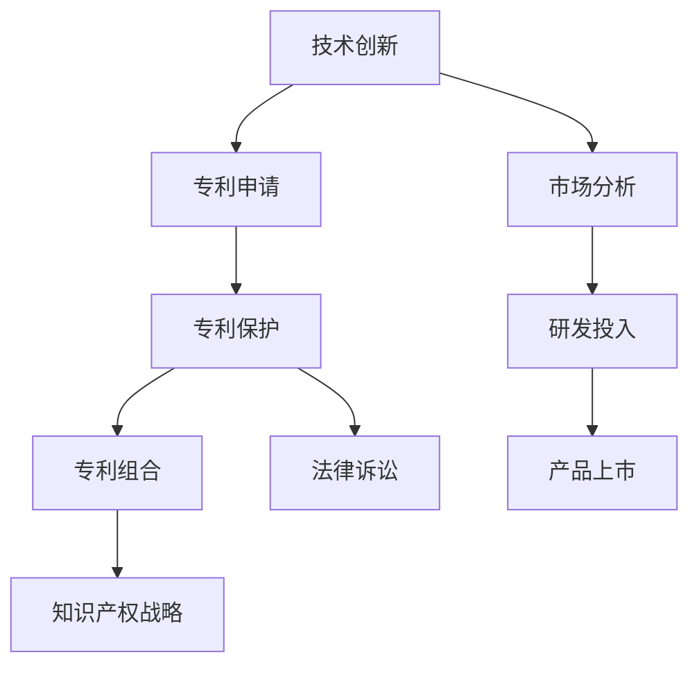

                 

# 技术创新与专利组合：构建知识产权帝国

> 关键词：技术创新,专利组合,知识产权,企业战略,法律保护,市场竞争

## 1. 背景介绍

在信息化时代，技术的快速迭代和创新成为企业持续发展的动力。而伴随着技术的发展，知识产权的保护和战略性运用，成为了企业竞争力的重要组成部分。本篇文章将深入探讨技术创新与专利组合策略，解释如何通过知识产权的构建，为企业的长期发展奠定坚实的法律基础。

### 1.1 技术创新对企业的意义

技术的快速迭代和创新是推动企业发展、提升市场竞争力的关键因素。创新可以带来新产品、新服务，改善生产效率，开辟新的市场领域。因此，企业应该持续投入研发，关注前沿技术，寻找创新的突破点。

### 1.2 专利保护的重要性

专利作为技术创新的法律保护手段，能够为企业提供一种长期和明确的法律权益，防止他人在未经许可的情况下使用、制造、销售或公开企业的新技术。通过专利保护，企业可以获得长期的经济利益，保持技术领先地位，有效防范竞争对手的侵犯。

## 2. 核心概念与联系

### 2.1 核心概念概述

在探讨技术创新与专利组合时，我们需要理解以下几个核心概念：

- **技术创新**：是指开发出新工艺、新技术、新产品的过程。创新可以是原创的，也可以是改进现有技术的创新。
- **专利**：是法律认可的一种技术发明，企业或个人通过向国家知识产权局提交专利申请，获得该项技术在一定时间内的独家使用权。
- **专利组合**：是企业拥有的多个专利之间的组合和关联，通过系统性的专利布局，可以构建起一个综合性的知识产权体系。
- **知识产权战略**：是指企业在技术创新和专利保护方面，通过战略性的布局和管理，获取最大化的经济和法律利益。

这些概念之间的关系可以通过以下Mermaid流程图来展示：



这个流程图展示了技术创新和专利保护从研发、申请到运用的全流程，以及它们与市场分析、法律诉讼、研发投入等环节的联系。

## 3. 核心算法原理 & 具体操作步骤

### 3.1 算法原理概述

基于技术创新与专利组合的策略，企业的核心目标是通过不断创新，获得排他性的技术优势，并利用法律手段，确保这些技术的长期独占权。该策略可以分为以下几个步骤：

1. **市场分析**：对市场需求和竞争态势进行深入分析，确定技术创新的方向。
2. **研发投入**：根据市场需求和竞争态势，投入资源进行技术创新和产品开发。
3. **专利申请**：在技术创新完成后，向国家知识产权局提交专利申请，获得专利权。
4. **专利保护**：在专利权获得批准后，利用法律手段保护专利权益，防止他人侵权。
5. **专利组合**：将多个专利进行组合，构建起一个系统的知识产权布局，形成全面的保护体系。
6. **知识产权战略**：根据企业发展战略，制定专利组合策略，有效利用知识产权，获取最大化的经济利益。

### 3.2 算法步骤详解

#### 3.2.1 市场分析

市场分析是技术创新与专利组合策略的第一步。通过市场调研、趋势分析、竞争对手分析等手段，企业可以了解市场对新技术的需求，评估潜在的市场机会。市场分析的步骤如下：

1. **调研**：收集市场信息，分析市场需求和技术趋势。
2. **竞争分析**：了解主要竞争对手的技术优势和专利布局。
3. **机会评估**：确定技术创新的方向和潜在市场机会。

#### 3.2.2 研发投入

研发投入是技术创新的关键环节。企业需要投入大量资源进行新技术的开发，包括资金、人才、设备等。以下是具体的研发投入步骤：

1. **需求确定**：根据市场分析结果，确定技术创新的具体需求和目标。
2. **资源配置**：合理配置研发资源，组建高效的研发团队。
3. **技术创新**：利用先进的研发工具和设备，进行新技术的开发和试验。
4. **产品化**：将新技术转化为实际的产品或服务，进行市场验证。

#### 3.2.3 专利申请

在技术创新完成后，企业需要向国家知识产权局提交专利申请。专利申请是获取法律保护的关键步骤，具体步骤如下：

1. **撰写专利申请文件**：撰写详细的专利申请文件，包括技术细节、创新点、实施方案等。
2. **提交申请**：将申请文件提交至国家知识产权局，进行审核。
3. **授权批准**：经过审核，如果符合专利标准，则获得专利权。

#### 3.2.4 专利保护

专利保护是确保技术创新的法律权益的重要手段。通过法律手段，企业可以防止他人侵犯专利权。具体步骤包括：

1. **监控侵权**：实时监控市场，发现侵犯专利权的行为。
2. **法律诉讼**：提起法律诉讼，维护专利权益。
3. **和解谈判**：与侵权方进行谈判，达成和解协议。

#### 3.2.5 专利组合

专利组合是构建全面的知识产权布局的关键步骤。通过多个专利的组合和关联，企业可以形成强大的知识产权防御体系，具体步骤如下：

1. **专利筛选**：从已申请的专利中筛选出具有战略意义的专利。
2. **专利布局**：将这些专利进行合理的布局，形成防御体系。
3. **关联整合**：将相关专利进行关联整合，形成协同效应。

#### 3.2.6 知识产权战略

知识产权战略是企业利用专利组合获取最大化的经济利益的重要手段。企业需要根据发展战略，制定专利组合策略，具体步骤包括：

1. **战略规划**：制定长远的技术创新和专利战略。
2. **策略实施**：根据战略规划，实施专利组合策略。
3. **效果评估**：定期评估专利组合策略的效果，进行优化调整。

### 3.3 算法优缺点

#### 3.3.1 优点

技术创新与专利组合策略有以下几个优点：

1. **法律保障**：通过专利保护，企业能够获得长期的技术垄断权，防止竞争对手的侵权。
2. **市场领先**：通过不断的技术创新和专利申请，企业可以保持技术领先地位，开拓新的市场。
3. **投资回报**：专利权的独占使用权，可以带来显著的经济回报，提升企业价值。

#### 3.3.2 缺点

同时，技术创新与专利组合策略也存在以下缺点：

1. **成本高昂**：专利申请、研发投入、法律诉讼等成本较高，需要大量资金投入。
2. **复杂繁琐**：专利申请和维护过程复杂繁琐，需要专业的法律和技术人员支持。
3. **风险较大**：专利申请结果不确定，有可能面临被驳回或无效的风险。

### 3.4 算法应用领域

技术创新与专利组合策略在多个领域具有广泛的应用，包括但不限于以下几个方面：

1. **高科技产业**：如电子、通信、互联网等领域，企业通过专利组合构建技术壁垒，保持市场领先地位。
2. **传统制造业**：如汽车、化工、机械等领域，企业通过专利保护新产品和新工艺，提升产品竞争力。
3. **生物医药**：如制药、医疗设备等领域，企业通过专利保护新产品和新疗法，获取巨大利益。
4. **环境保护**：如环保设备、新能源等领域，企业通过专利保护新技术，推动环保事业发展。

## 4. 数学模型和公式 & 详细讲解 & 举例说明

### 4.1 数学模型构建

在技术创新与专利组合策略中，可以通过以下数学模型来量化技术创新和专利申请的决策过程：

假设企业当前的研发投入为 $X$，专利申请数量为 $N$，市场增长率为 $r$，专利权保护期限为 $t$，单位专利权的价值为 $V$。则企业通过专利组合获得的总收益 $R$ 可以表示为：

$$
R = N \times V \times (1 - r^t) - X
$$

其中，$1 - r^t$ 表示专利权的保护期限内市场增长带来的额外收益。

### 4.2 公式推导过程

假设企业进行一项新技术的研发，研发投入为 $X$，专利申请数量为 $N$，专利权保护期限为 $t$，市场增长率为 $r$，单位专利权的价值为 $V$。则企业通过专利组合获得的总收益 $R$ 可以表示为：

1. **研发投入**：$X$
2. **专利申请**：$N$
3. **专利权保护**：$N \times V \times (1 - r^t)$
4. **市场增长**：$N \times V \times r \times t$
5. **总收益**：$R = N \times V \times (1 - r^t) - X$

### 4.3 案例分析与讲解

以一家电子企业为例，分析其技术创新与专利组合策略的决策过程。

假设该企业当前研发投入为 $X = 1000$ 万美元，专利申请数量为 $N = 10$，专利权保护期限为 $t = 20$ 年，市场增长率为 $r = 5\%$，单位专利权的价值为 $V = 100$ 万美元。则企业通过专利组合获得的总收益 $R$ 可以计算如下：

1. **研发投入**：$X = 1000$ 万美元
2. **专利申请**：$N = 10$
3. **专利权保护**：$N \times V \times (1 - r^t) = 10 \times 100 \times (1 - (1+0.05)^{20}) = 10 \times 100 \times (1 - 2.653) = -165.3$ 万美元
4. **市场增长**：$N \times V \times r \times t = 10 \times 100 \times 0.05 \times 20 = 1000$ 万美元
5. **总收益**：$R = N \times V \times (1 - r^t) - X = -165.3 - 1000 = -1165.3$ 万美元

由于总收益为负，说明该企业的专利组合策略存在问题。需要调整专利申请数量或提高单位专利权的价值，以优化专利组合策略。

## 5. 项目实践：代码实例和详细解释说明

### 5.1 开发环境搭建

要进行技术创新与专利组合策略的实践，需要搭建一个完整的技术开发环境。以下是具体步骤：

1. **安装开发工具**：安装Python、Jupyter Notebook、Git等开发工具。
2. **设置数据仓库**：搭建数据仓库，存储专利数据、市场数据等相关信息。
3. **部署数据库**：部署SQL数据库，存储专利申请信息、专利权保护信息等。

### 5.2 源代码详细实现

以下是一个简单的Python代码示例，用于模拟专利组合策略的决策过程：

```python
import numpy as np

# 定义变量
X = 1000  # 研发投入
N = 10    # 专利申请数量
t = 20    # 专利权保护期限
r = 0.05  # 市场增长率
V = 100   # 单位专利权的价值

# 计算总收益
R = N * V * (1 - (1 + r)**t) - X

# 输出结果
print(f"总收益: {R} 万美元")
```

### 5.3 代码解读与分析

上述代码中，我们通过Python计算了专利组合策略的总收益。通过调整变量N、V、X等，可以模拟不同的专利组合策略，并评估其经济效果。

## 6. 实际应用场景

### 6.1 高科技产业

在高科技产业中，技术创新与专利组合策略是企业保持市场领先地位的关键。例如，苹果公司通过不断创新，并申请大量专利，构建了强大的知识产权体系，形成了强大的市场壁垒。

### 6.2 传统制造业

在传统制造业中，企业通过专利保护新产品和新工艺，提升产品竞争力。例如，宝马公司通过申请发动机和自动驾驶技术的专利，保持了市场领先地位。

### 6.3 生物医药

在生物医药领域，企业通过专利保护新产品和新疗法，获取巨大利益。例如，辉瑞公司通过专利保护其药物阿伐他汀，获取了巨大的经济回报。

### 6.4 环境保护

在环境保护领域，企业通过专利保护新技术，推动环保事业发展。例如，美国太阳能公司申请了大量太阳能电池技术的专利，推动了全球太阳能产业的发展。

## 7. 工具和资源推荐

### 7.1 学习资源推荐

要进行技术创新与专利组合策略的学习，可以参考以下资源：

1. **《知识产权法》**：深入理解专利申请、保护、侵权等相关法律知识。
2. **《专利组合策略》**：介绍专利组合和知识产权战略的详细方法和案例。
3. **《技术创新与知识产权管理》**：探讨技术创新与知识产权管理的最佳实践。

### 7.2 开发工具推荐

以下是一些常用的技术创新与专利组合策略开发工具：

1. **Git**：版本控制工具，用于管理开发过程中的代码变更和文档。
2. **Jupyter Notebook**：Python编程环境，用于编写和运行代码。
3. **SQL**：关系型数据库，用于存储和管理专利申请、保护信息等数据。

### 7.3 相关论文推荐

以下是几篇有影响力的相关论文，推荐阅读：

1. **《技术创新与专利策略的优化》**：介绍了技术创新与专利策略的优化方法。
2. **《专利组合与知识产权战略》**：探讨了专利组合和知识产权战略的实施细节。
3. **《知识产权保护与市场竞争》**：分析了知识产权保护对市场竞争的影响。

## 8. 总结：未来发展趋势与挑战

### 8.1 研究成果总结

技术创新与专利组合策略是企业知识产权管理的重要组成部分，具有重要的应用价值和研究意义。通过本文的探讨，我们可以看到：

1. 技术创新和专利保护是企业保持市场竞争力的关键手段。
2. 专利组合策略可以通过多个专利的组合和关联，构建起一个综合性的知识产权体系。
3. 知识产权战略是企业利用专利组合获取最大化的经济利益的重要手段。

### 8.2 未来发展趋势

未来，技术创新与专利组合策略将呈现以下几个发展趋势：

1. **智能化**：随着人工智能技术的发展，企业的技术创新和专利组合策略将更加智能化。例如，通过AI辅助专利筛选和组合，提高决策效率和精准度。
2. **全球化**：随着全球经济一体化，企业的专利组合策略将更加全球化。企业需要考虑不同国家和地区的专利法律和市场环境，制定全球化的知识产权战略。
3. **多样化**：企业的技术创新和专利组合策略将更加多样化。企业可以同时申请多种类型的专利，如发明专利、实用新型专利、外观设计专利等，形成多样化的知识产权体系。

### 8.3 面临的挑战

尽管技术创新与专利组合策略具有重要的应用价值，但在实施过程中仍面临以下挑战：

1. **成本高昂**：专利申请、研发投入、法律诉讼等成本较高，需要大量资金投入。
2. **复杂繁琐**：专利申请和维护过程复杂繁琐，需要专业的法律和技术人员支持。
3. **风险较大**：专利申请结果不确定，有可能面临被驳回或无效的风险。

### 8.4 研究展望

未来，技术创新与专利组合策略的研究需要关注以下几个方面：

1. **智能化方法**：研究AI技术在专利组合中的应用，提高决策效率和精准度。
2. **全球化策略**：研究全球化背景下的专利组合策略，制定全球化的知识产权战略。
3. **多样化保护**：研究多种类型的专利组合策略，形成多样化的知识产权体系。

## 9. 附录：常见问题与解答

**Q1：专利保护期限有多长？**

A: 专利保护期限因国家、技术类型和法律规定而异。通常，发明专利保护期限为20年，实用新型和外观设计专利保护期限为10年。

**Q2：专利申请流程有哪些步骤？**

A: 专利申请流程包括撰写申请文件、提交申请、初步审查、公布、实质审查、授权等步骤。具体流程根据国家知识产权局规定执行。

**Q3：如何判断专利是否有效？**

A: 专利是否有效需要根据国家知识产权局的审查结果和专利信息进行判断。一般可以通过专利查询和法律咨询等方式进行评估。

**Q4：专利组合策略如何实施？**

A: 专利组合策略的实施需要企业根据技术创新和市场需求，合理选择专利申请和布局，形成综合性的知识产权体系。

**Q5：专利组合策略需要哪些资源？**

A: 专利组合策略需要投入研发资源、法律资源、管理资源等，以确保专利申请和维护的有效性和全面性。

---

作者：禅与计算机程序设计艺术 / Zen and the Art of Computer Programming

