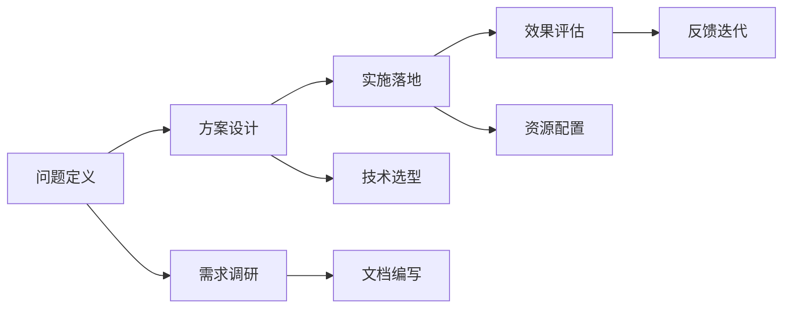

                 

# 技术咨询：高价值服务的提供

在信息技术飞速发展的今天，技术咨询作为一项高价值的知识密集型服务，其重要性愈发凸显。无论是在企业信息化建设，还是在国家战略决策过程中，高水平的技术咨询都能提供科学合理的技术支撑，推动各行各业的数字化转型和创新。本文将从背景介绍、核心概念、算法原理、操作步骤、应用领域、学习资源等多个方面，系统阐述如何提供高质量的技术咨询服务，以期为技术咨询行业的发展提供参考。

## 1. 背景介绍

### 1.1 问题由来

随着信息技术的快速演进，各行各业对技术咨询的需求日益增长。然而，技术咨询不仅仅是技术问题的解决，更是技术理解、方案设计和项目管理的高价值服务。高水平的技术咨询服务不仅能助力企业决策，还能推动行业技术标准的制定，促进技术创新和应用。

当前，技术咨询行业面临诸多挑战：技术多样化和复杂性加剧，传统咨询服务方式无法满足需求；客户需求日益个性化，通用型咨询难以满足多样化要求；市场竞争激烈，提升服务质量和创新能力成为致胜关键。

### 1.2 问题核心关键点

技术咨询的核心关键点在于其高附加值的服务特性，即咨询过程中提供的专业知识和分析能力。为此，技术咨询需要深度理解客户需求，掌握多种技术技能，具备系统化的思维能力。

具体而言，技术咨询的三个关键点包括：
1. **专业性**：咨询师需具备深厚技术背景和行业经验，理解客户需求和技术难点。
2. **系统性**：具备系统化思维能力，能够整合多种技术解决方案，提供整体性方案。
3. **创新性**：不断创新咨询方法和技术手段，提升服务质量和效率。

## 2. 核心概念与联系

### 2.1 核心概念概述

为深入理解技术咨询的原理和架构，我们首先梳理几个核心概念：

- **技术咨询**：一种高价值的知识密集型服务，通过对客户需求的深度理解和技术方案的精心设计，提供科学合理的技术支持。
- **问题定义**：明确客户面临的业务和技术问题，提炼核心需求。
- **方案设计**：基于问题定义，设计可行的技术方案，并对方案进行详细阐述和评估。
- **实施落地**：将技术方案转化为具体的实施计划，并进行项目管理。
- **效果评估**：对方案实施效果进行评估，提供反馈和改进建议。

### 2.2 核心概念原理和架构的 Mermaid 流程图



这个流程图展示了技术咨询的完整流程，从需求调研、方案设计、实施落地到效果评估，各个环节紧密衔接，形成一个闭环的系统。

## 3. 核心算法原理 & 具体操作步骤

### 3.1 算法原理概述

技术咨询的算法原理基于系统化的方法论和项目管理工具，通过科学合理的步骤，逐步解决问题。其核心是咨询师的专业知识和经验，以及系统化的思维能力。

### 3.2 算法步骤详解

技术咨询的算法步骤主要包括以下几个关键环节：

1. **需求调研**：通过问卷、访谈等方式，深入了解客户需求和痛点，明确问题的本质。
2. **问题定义**：将客户需求转化为具体的问题描述，包括业务背景、技术难点和解决方案的需求。
3. **方案设计**：基于问题定义，提出多种可能的解决方案，进行技术选型和方案评估，选择最优方案。
4. **实施落地**：将方案转化为具体的实施计划，包括技术选型、资源配置、项目进度安排等。
5. **效果评估**：对方案实施效果进行评估，根据反馈不断改进方案。

### 3.3 算法优缺点

技术咨询算法的优点在于其系统性和灵活性：系统性体现在通过严格的步骤，确保咨询过程的科学性和完整性；灵活性在于能够根据不同客户和项目的具体情况进行调整和优化。

其缺点在于对咨询师的要求较高，需要具备广泛的技术背景和丰富的行业经验，同时对咨询师的系统化思维和项目管理能力有较高要求。

### 3.4 算法应用领域

技术咨询的应用领域非常广泛，涵盖信息技术、金融、医疗、制造等多个行业。以下是几个典型的应用领域：

- **信息化建设咨询**：帮助企业设计和管理信息系统，提升信息化水平。
- **数据治理咨询**：解决企业数据孤岛问题，提升数据质量和应用效率。
- **数字化转型咨询**：指导企业实现数字化转型，提升竞争力和创新能力。
- **安全与合规咨询**：提供网络安全、隐私保护和数据合规的解决方案。

## 4. 数学模型和公式 & 详细讲解 & 举例说明

### 4.1 数学模型构建

技术咨询的数学模型构建主要基于项目管理的方法论和统计分析技术。常见的模型包括风险评估模型、成本效益分析模型等。

以成本效益分析模型为例，其基本公式为：

$$
\text{Cost-Benefit Ratio} = \frac{\text{Total Benefits}}{\text{Total Costs}}
$$

其中，总收益包括直接收益和间接收益，总成本包括直接成本和间接成本。

### 4.2 公式推导过程

以风险评估模型为例，其推导过程如下：

假设风险事件的发生概率为 $p$，风险损失为 $L$，则风险价值 $V$ 可表示为：

$$
V = p \times L
$$

对于多维度风险，可以采用矩阵形式表示：

$$
R = \begin{bmatrix}
p_{11} & p_{12} \\
p_{21} & p_{22}
\end{bmatrix}
L = \begin{bmatrix}
L_{1} \\
L_{2}
\end{bmatrix}
V = R \times L
$$

### 4.3 案例分析与讲解

以一个企业信息化建设项目为例，进行风险评估模型的应用。项目成本为 100 万元，预期收益为 200 万元，风险事件的发生概率为 0.1，风险损失为 50 万元。

首先计算预期收益与成本的比率：

$$
\text{Cost-Benefit Ratio} = \frac{200}{100} = 2
$$

然后计算风险价值：

$$
V = 0.1 \times 50 = 5
$$

最终的风险效益比为：

$$
\text{Total Costs} + V = 100 + 5 = 105
$$

这意味着，项目整体的风险效益比为 2.05，项目在考虑风险后仍然具有较高的经济效益。

## 5. 项目实践：代码实例和详细解释说明

### 5.1 开发环境搭建

技术咨询的实践通常需要借助多种工具和技术平台，以下是一个典型的开发环境搭建流程：

1. **项目管理工具**：如JIRA、Trello等，用于项目管理和进度跟踪。
2. **数据管理工具**：如Excel、Tableau等，用于数据分析和可视化。
3. **代码编写工具**：如Visual Studio、PyCharm等，用于编写和调试代码。
4. **文档编写工具**：如Confluence、Word等，用于编写文档和报告。

### 5.2 源代码详细实现

以一个数据治理项目的风险评估模型为例，其Python代码实现如下：

```python
import numpy as np

def risk_evaluation(p, L):
    """
    风险评估函数
    """
    return p * L

# 设定风险事件的概率和损失
p = 0.1
L = 50

# 计算风险价值
V = risk_evaluation(p, L)
print(f"风险价值：{V}")
```

### 5.3 代码解读与分析

这段代码非常简单，只有一行计算风险价值的函数调用。但通过扩展和优化，可以构建更加复杂的风险评估模型，用于处理多维度风险和不确定性。

### 5.4 运行结果展示

运行上述代码，输出结果为：

```
风险价值：5.0
```

这表明，风险事件发生的概率为 0.1，风险损失为 50 万元，风险价值为 5 万元。

## 6. 实际应用场景

### 6.1 金融行业

金融行业对技术咨询的需求非常旺盛。银行、证券、保险等行业对信息系统、数据治理和数字化转型的需求不断增加。技术咨询师需要具备丰富的金融知识和行业经验，提供定制化的解决方案。

例如，为一家银行设计客户关系管理系统（CRM），通过系统化的方法论，明确客户需求，设计解决方案，实施落地，并进行效果评估。该CRM系统通过整合客户数据，提升客户服务质量，提高了银行的运营效率和市场竞争力。

### 6.2 医疗行业

医疗行业对技术咨询的需求同样迫切。医院、诊所和医疗机构对信息化建设、数据治理和远程医疗解决方案的需求日益增长。技术咨询师需要具备医学知识和信息技术技能，提供符合医疗行业特点的解决方案。

例如，为一家医院设计远程医疗平台，通过系统化的方法论，明确需求，设计解决方案，实施落地，并进行效果评估。该平台通过远程医疗服务，提高了医疗资源的利用效率，提升了患者的就医体验。

### 6.3 制造行业

制造行业对技术咨询的需求也在不断增加。制造企业对生产自动化、供应链管理和信息化建设的需求日益增长。技术咨询师需要具备制造业知识和信息技术技能，提供符合制造业特点的解决方案。

例如，为一家制造企业设计生产自动化系统，通过系统化的方法论，明确需求，设计解决方案，实施落地，并进行效果评估。该系统通过生产自动化，提高了生产效率和产品质量，降低了生产成本。

## 7. 工具和资源推荐

### 7.1 学习资源推荐

为了帮助咨询师提升技术咨询服务的专业水平，以下是一些推荐的学习资源：

1. **《项目管理知识体系指南》**：由PMI发布的权威指南，涵盖项目管理的各个方面，是技术咨询师必备的知识储备。
2. **《数据科学导论》**：由斯坦福大学公开课《Machine Learning》的讲义整理而成，涵盖了数据科学和机器学习的核心内容。
3. **《敏捷开发实践指南》**：介绍敏捷开发的方法和工具，帮助咨询师提升项目管理能力。
4. **《数据治理与数据质量管理》**：介绍数据治理的原理和实践，帮助咨询师提升数据管理能力。

### 7.2 开发工具推荐

技术咨询的开发工具需要具备灵活性和可扩展性，以下是一些推荐的工具：

1. **JIRA**：强大的项目管理工具，支持任务分配、进度跟踪和报告生成。
2. **Tableau**：强大的数据可视化工具，支持复杂的数据分析和报表生成。
3. **Visual Studio**：综合性的代码编写工具，支持多种编程语言和框架。
4. **Confluence**：协作文档编写工具，支持多人协同编辑和文档管理。

### 7.3 相关论文推荐

技术咨询领域的理论研究和实践经验不断积累，以下是一些推荐的相关论文：

1. **《项目管理中的风险评估模型研究》**：介绍风险评估模型的构建和应用，帮助咨询师评估项目风险。
2. **《数据治理的实践与挑战》**：介绍数据治理的原理和实践，帮助咨询师提升数据管理能力。
3. **《敏捷开发方法在技术咨询中的应用》**：介绍敏捷开发方法在技术咨询中的应用，帮助咨询师提升项目管理能力。

## 8. 总结：未来发展趋势与挑战

### 8.1 研究成果总结

技术咨询作为高价值服务，其核心在于咨询师的专业知识和经验，以及系统化的思维能力。通过系统化的项目管理方法论和数据分析技术，技术咨询师能够为客户提供科学合理的技术支持。

### 8.2 未来发展趋势

技术咨询的未来发展趋势主要体现在以下几个方面：

1. **数字化转型咨询**：随着数字化转型的加速，技术咨询将更多地关注企业的数字化战略和转型路径。
2. **人工智能和机器学习**：AI和ML技术的应用将为技术咨询带来新的工具和方法，提升咨询效率和质量。
3. **跨行业应用**：技术咨询将更多地跨行业应用，提升咨询师的多行业知识和技能。

### 8.3 面临的挑战

技术咨询面临的挑战主要体现在以下几个方面：

1. **市场竞争激烈**：随着市场竞争的加剧，如何提升咨询质量和创新能力成为致胜关键。
2. **客户需求变化**：客户需求日益多样化，如何灵活应对客户需求变化是技术咨询师面临的重要挑战。
3. **技术更新快速**：信息技术发展迅速，如何持续学习和掌握新技术是技术咨询师必须解决的问题。

### 8.4 研究展望

技术咨询的研究展望主要体现在以下几个方面：

1. **多行业知识融合**：技术咨询将更多地跨行业应用，提升咨询师的多行业知识和技能。
2. **人工智能和机器学习**：AI和ML技术的应用将为技术咨询带来新的工具和方法，提升咨询效率和质量。
3. **项目管理的系统化**：系统化的方法论和项目管理工具的应用，将进一步提升技术咨询的专业性和可靠性。

## 9. 附录：常见问题与解答

### Q1：技术咨询和普通咨询服务有什么区别？

**A**：技术咨询是一种高价值的知识密集型服务，基于专业知识和系统化的方法论，提供科学合理的技术支持。普通咨询服务则更侧重于具体的执行和操作，缺乏系统化的技术指导。

### Q2：如何提升技术咨询的服务质量？

**A**：提升技术咨询的服务质量需要从多个方面入手，包括：
1. **专业知识**：咨询师需要具备深厚的技术背景和行业经验。
2. **系统化方法**：通过系统化的方法论和项目管理工具，确保咨询过程的科学性和完整性。
3. **客户沟通**：与客户建立良好的沟通机制，理解客户需求和痛点。
4. **持续学习**：不断学习和掌握新技术和新方法，提升自身能力。

### Q3：技术咨询师需要哪些技能？

**A**：技术咨询师需要具备以下技能：
1. **技术背景**：具备深厚的技术背景和行业经验。
2. **系统化思维**：具备系统化思维能力，能够整合多种技术解决方案。
3. **项目管理**：具备项目管理能力，能够设计和管理项目。
4. **数据分析**：具备数据分析能力，能够进行风险评估和效果评估。
5. **沟通能力**：具备良好的沟通能力，能够与客户和团队成员有效沟通。

---

作者：禅与计算机程序设计艺术 / Zen and the Art of Computer Programming

