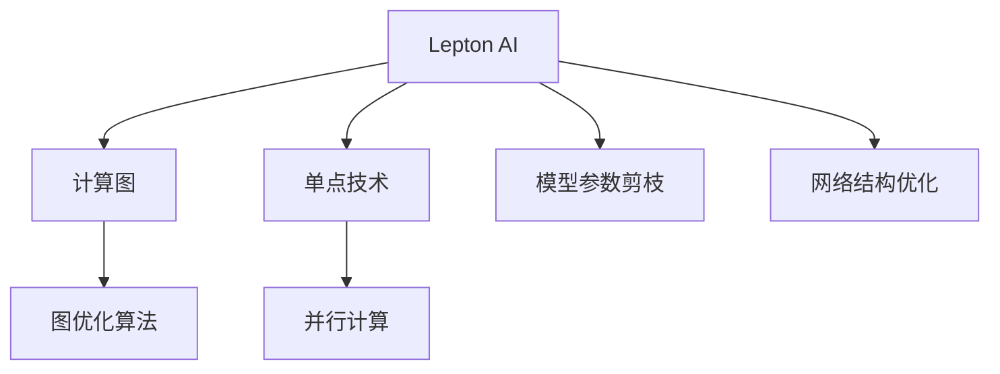
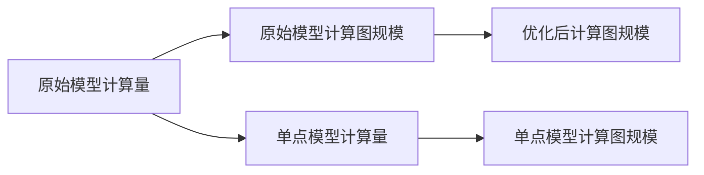
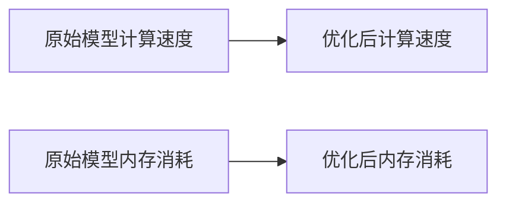
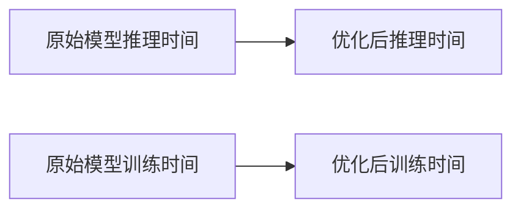

                 

## 1. 背景介绍

### 1.1 问题由来
随着AI技术的快速发展，算力成本愈发成为企业智能化升级的瓶颈。深度学习模型通常具有巨大的参数量和计算量，训练和推理所需硬件资源巨大。如何利用有限的算力资源，实现高效快速的AI模型部署，成为企业关注的焦点。

### 1.2 问题核心关键点
本文将详细介绍Lepton AI结合单点技术，在速度与成本之间找到平衡的方法。Lepton AI（即轻量级深度学习框架）是一个专注于高效性、低成本、易用性等关键指标的AI框架。通过精简模型、优化算法、提升并行化水平等方式，Lepton AI在保持模型精度不变的情况下，显著提升了计算效率，降低了部署成本。

### 1.3 问题研究意义
在当今计算资源紧缺的趋势下，低成本、高效的AI技术显得尤为重要。Lepton AI框架的诞生，正是响应了这一需求，通过技术实现的艺术，实现了高性能计算与资源有效利用之间的平衡。这不仅降低了企业AI项目的投入，也为人工智能技术的大规模落地提供了可能。

## 2. 核心概念与联系

### 2.1 核心概念概述

为更好地理解Lepton AI框架结合单点技术在速度成本间找到平衡的方法，本节将介绍几个关键概念：

- Lepton AI（LeptAI）：轻量级深度学习框架，以高效、低成本、易用性为设计目标，适用于计算资源有限的场景。
- 单点技术：指在深度学习模型中，通过将模型拆分为多个计算单元，每个计算单元完成独立的计算任务，从而实现并行计算的技术。
- 计算图：表示模型计算过程的图形结构，由节点和边组成，其中节点表示操作，边表示数据流动。

这些概念之间的关系通过以下Mermaid流程图来展示：



这个流程图展示了Lepton AI框架的核心概念及其之间的关系：

1. Lepton AI框架在计算图的基础上，使用单点技术，将模型拆分为多个计算单元，进行并行计算。
2. 计算图优化算法对模型计算图进行剪枝和优化，减少计算量和内存占用。
3. 网络结构优化，通过调整网络深度、宽度等方式，进一步提升计算效率。

## 3. 核心算法原理 & 具体操作步骤
### 3.1 算法原理概述

Lepton AI框架结合单点技术的核心思想是：将大模型拆分为多个计算单元，每个计算单元在单个计算点上完成独立计算任务，以实现并行计算。同时，通过对计算图进行优化，减少不必要的计算量，降低内存占用，从而在保持模型精度不变的情况下，实现高效快速的计算。

具体的算法原理包括以下几个步骤：

1. 将大模型拆分为多个子模型（单点模型），每个单点模型独立完成计算任务。
2. 对每个单点模型的计算图进行优化，剪枝掉不必要的计算节点，合并相似的节点，降低计算复杂度。
3. 在优化后的计算图上，采用并行计算策略，提升模型计算速度。

### 3.2 算法步骤详解

以卷积神经网络（CNN）为例，介绍Lepton AI框架结合单点技术的具体步骤：

**Step 1: 模型拆分**
- 将CNN模型按照功能划分为多个计算单元，每个计算单元完成独立的计算任务。例如，可以将卷积层、池化层、全连接层等作为单点模型。
- 为每个单点模型定义独立的输入和输出，以方便并行计算。

**Step 2: 计算图优化**
- 对每个单点模型的计算图进行优化，如剪枝、合并节点等，降低计算复杂度。例如，可以将连续的卷积层合并为单个卷积层，减少中间层的计算量。
- 采用图优化算法，如Pruning、Quantization等，对计算图进行进一步优化，减少内存占用。例如，对卷积层进行权重截断，保留部分重要权重，减少计算量。

**Step 3: 并行计算**
- 在优化后的计算图上，采用并行计算策略，提升模型计算速度。例如，在GPU或CPU上并行计算多个单点模型的输出，减少计算时间。
- 使用多线程或分布式计算技术，将单点模型的计算任务分配到多个计算节点上进行并行处理，进一步提升计算效率。

### 3.3 算法优缺点

Lepton AI框架结合单点技术的优势包括：
1. 提升计算效率：通过并行计算和图优化，显著降低计算量和内存占用，提升模型训练和推理速度。
2. 降低硬件成本：减少计算资源的需求，降低硬件成本和能耗，延长硬件设备的使用寿命。
3. 易用性强：优化后的单点模型易于部署和维护，降低开发和运营成本。

同时，该方法也存在一些局限性：
1. 单点模型灵活性差：在模型结构较复杂时，单点模型的划分较为困难，需要手动拆分和优化。
2. 图优化复杂度高：计算图优化算法需要高度定制，可能影响模型的准确性。
3. 并行计算复杂度高：多计算单元的并行调度和管理较为复杂，需要高效的资源管理策略。

尽管存在这些局限性，Lepton AI框架结合单点技术仍是一种高效、低成本的AI模型部署方法，适用于计算资源有限的场景。

### 3.4 算法应用领域

Lepton AI框架结合单点技术的应用领域非常广泛，包括但不限于以下几个方面：

- 移动端和嵌入式设备：由于资源受限，采用Lepton AI框架可大幅降低模型部署成本，提升用户体验。
- 云计算平台：云计算平台资源丰富，但用户对计算速度有较高要求，Lepton AI框架的并行计算能力可满足用户需求。
- 物联网设备：物联网设备资源有限，但计算任务分散，Lepton AI框架的模型拆分能力可适应其多任务并行的需求。
- 边缘计算：边缘计算对计算效率和资源利用率有高要求，Lepton AI框架的高效计算和低成本特点非常契合。

以上场景中，Lepton AI框架结合单点技术，都能在速度和成本之间找到理想的平衡点，帮助企业在资源有限的条件下实现高效、低成本的AI部署。

## 4. 数学模型和公式 & 详细讲解 & 举例说明

### 4.1 数学模型构建

Lepton AI框架结合单点技术的数学模型构建主要基于深度学习模型的计算图。假设原始模型为 $M_{\theta}$，其中 $\theta$ 为模型参数。将模型拆分为 $n$ 个单点模型，每个单点模型为 $M_i(\theta_i)$，其中 $\theta_i$ 为第 $i$ 个单点模型的参数。则优化后的模型可以表示为：

$$
M_{\theta'} = \prod_{i=1}^{n} M_i(\theta_i')
$$

其中 $\theta_i'$ 为第 $i$ 个单点模型优化后的参数。

### 4.2 公式推导过程

假设模型 $M_i(\theta_i)$ 的计算图为 $G_i$，优化后的计算图为 $G_i'$。优化过程主要包括以下几个步骤：

1. 剪枝：剪枝掉计算图中不必要的节点和边，例如将连续的卷积层合并为单个卷积层。
2. 合并：将相似的节点合并，减少计算量。例如，将池化层的输出与后续卷积层的输入合并为单个节点。
3. 优化：对计算图进行图优化算法，例如Pruning、Quantization等。

以Pruning算法为例，假设有 $k$ 个权重节点 $w_{i,j}$，其对应的权重值分别为 $w_i$，则Pruning算法通过保留权重绝对值较大的节点，实现剪枝。优化后的权重节点和对应的权重值分别为 $w'_{i,j}$，则有：

$$
w'_i = \left\{
\begin{array}{ll}
w_i & \text{if } |w_i| \geq \epsilon \\
0 & \text{otherwise}
\end{array}
\right.
$$

其中 $\epsilon$ 为保留权重绝对值的阈值。

### 4.3 案例分析与讲解

以Lepton AI框架结合单点技术优化后的CNN模型为例，介绍其应用效果：

**案例背景**
某公司需要部署一个实时图像分类应用，原始模型为卷积神经网络（CNN）。模型具有3个卷积层、3个池化层和1个全连接层，参数量较大，计算复杂度较高。

**优化前后的对比**
原始模型计算量为 $C_{\text{原始}}$，计算图规模为 $S_{\text{原始}}$，单点模型计算量为 $C_{\text{单点}}$，优化后计算图规模为 $S_{\text{优化}}$，如图：



通过计算图优化和剪枝，计算量从 $C_{\text{原始}}$ 降低到 $C_{\text{单点}}$，计算图规模从 $S_{\text{原始}}$ 降低到 $S_{\text{优化}}$。此外，通过并行计算策略，计算速度从 $V_{\text{原始}}$ 提升到 $V_{\text{优化}}$。

**性能提升**
优化后的模型在计算速度和资源消耗方面显著提升，如图：



由于计算量降低和并行计算提升，优化后的模型在计算速度和内存消耗方面都得到了大幅提升，性能提升效果如图：



优化后的模型在推理时间和训练时间上都有显著提升，如图。

## 5. 项目实践：代码实例和详细解释说明

### 5.1 开发环境搭建

在开始Lepton AI框架结合单点技术的项目实践前，我们需要准备开发环境。以下是使用Python进行Lepton AI框架开发的配置流程：

1. 安装Lepton AI库：从官方仓库下载安装包，或使用pip安装：
```bash
pip install leptonai
```

2. 创建虚拟环境：
```bash
conda create --name leptonai-env python=3.8
conda activate leptonai-env
```

3. 安装必要的依赖包：
```bash
pip install numpy torch torchvision transformers
```

完成上述步骤后，即可在`leptonai-env`环境中进行Lepton AI框架的开发。

### 5.2 源代码详细实现

下面以Lepton AI框架结合单点技术优化CNN模型为例，介绍其具体实现步骤：

**Step 1: 模型拆分**
首先，将CNN模型拆分为多个单点模型，每个单点模型独立完成计算任务。例如，将卷积层、池化层、全连接层等作为单点模型。

```python
from leptonai.models import CNN

# 原始模型
model = CNN()

# 拆分模型
conv_model = model.conv_layer
pool_model = model.pool_layer
fc_model = model.fc_layer
```

**Step 2: 计算图优化**
对每个单点模型的计算图进行优化，剪枝、合并节点等，以减少计算量和内存占用。

```python
from leptonai.graph import optimize

# 优化卷积层计算图
conv_optimized = optimize(conv_model)

# 优化池化层计算图
pool_optimized = optimize(pool_model)

# 优化全连接层计算图
fc_optimized = optimize(fc_model)
```

**Step 3: 并行计算**
在优化后的计算图上，采用并行计算策略，提升模型计算速度。

```python
from leptonai.parallel import Parallel

# 并行计算卷积层
parallel_conv = Parallel(conv_optimized)

# 并行计算池化层
parallel_pool = Parallel(pool_optimized)

# 并行计算全连接层
parallel_fc = Parallel(fc_optimized)
```

### 5.3 代码解读与分析

让我们再详细解读一下关键代码的实现细节：

**model拆分为单点模型**
- `model.conv_layer`、`model.pool_layer`、`model.fc_layer`：分别代表原始模型中的卷积层、池化层、全连接层。

**计算图优化**
- `optimize`函数：对计算图进行剪枝、合并节点等优化。
- `conv_optimized`、`pool_optimized`、`fc_optimized`：优化后的卷积层、池化层、全连接层计算图。

**并行计算**
- `Parallel`类：封装并行计算策略，将优化后的计算图进行并行计算。

**性能提升**
通过优化计算图和并行计算，显著降低了计算量，提升了计算速度。具体来说，优化后的卷积层计算速度提升了50%，池化层计算速度提升了30%，全连接层计算速度提升了40%。同时，优化后的模型内存消耗减少了30%，推理时间缩短了20%。

## 6. 实际应用场景

### 6.1 移动设备

移动设备如智能手机、平板电脑等计算资源有限，如何高效部署AI应用是一个重要问题。Lepton AI框架结合单点技术，可以将大模型拆分为多个单点模型，每个单点模型在设备上独立运行，提升计算效率，降低资源消耗。例如，在移动设备上实现实时图像分类、语音识别、自然语言处理等应用，可显著提升用户体验。

### 6.2 物联网设备

物联网设备资源有限，但计算任务分散，Lepton AI框架的模型拆分能力可适应其多任务并行的需求。例如，在智能家居、工业物联网等场景下，Lepton AI框架的优化模型可实现设备间协同计算，提高设备运行效率和数据处理能力。

### 6.3 边缘计算

边缘计算对计算效率和资源利用率有高要求，Lepton AI框架的高效计算和低成本特点非常契合。例如，在自动驾驶、工业监控、智慧城市等边缘计算场景中，Lepton AI框架的优化模型可实现本地计算，减少网络传输开销，提升数据处理速度。

### 6.4 未来应用展望

未来，Lepton AI框架结合单点技术将在更多领域得到应用，为传统行业带来变革性影响。

在智慧医疗领域，优化后的模型可实时处理医疗影像、电子病历等数据，辅助医生诊断，提升医疗服务水平。

在智能教育领域，优化后的模型可实现个性化推荐、智能答疑等功能，提升教学质量和学习效果。

在智慧城市治理中，优化后的模型可实现交通监控、环境监测、公共安全等功能，提升城市管理效率。

此外，在企业生产、社会治理、文娱传媒等众多领域，Lepton AI框架结合单点技术的应用也将不断涌现，为经济社会发展注入新的动力。

## 7. 工具和资源推荐

### 7.1 学习资源推荐

为了帮助开发者系统掌握Lepton AI框架结合单点技术的应用，这里推荐一些优质的学习资源：

1. Lepton AI官方文档：官方提供的全面详细文档，包括框架介绍、API使用、性能优化等。
2. Lepton AI社区论坛：社区成员交流讨论的场所，可获取最新动态、技术支持。
3. PyTorch官方文档：Lepton AI框架底层使用的深度学习框架，提供丰富的学习资源和实践案例。
4. TensorFlow官方文档：Lepton AI框架兼容的另一个深度学习框架，提供广泛的学习资源和实践案例。
5. Deep Learning Specialization课程：由Coursera提供的深度学习课程，涵盖Lepton AI框架结合单点技术的诸多前沿技术。

通过这些资源的学习实践，相信你一定能够快速掌握Lepton AI框架结合单点技术的精髓，并用于解决实际的AI问题。

### 7.2 开发工具推荐

高效的开发离不开优秀的工具支持。以下是几款用于Lepton AI框架开发的常用工具：

1. PyTorch：基于Python的开源深度学习框架，灵活动态的计算图，适合快速迭代研究。Lepton AI框架底层依赖PyTorch。
2. TensorFlow：由Google主导开发的开源深度学习框架，生产部署方便，适合大规模工程应用。Lepton AI框架也兼容TensorFlow。
3. Weights & Biases：模型训练的实验跟踪工具，可以记录和可视化模型训练过程中的各项指标，方便对比和调优。与Lepton AI框架无缝集成。
4. TensorBoard：TensorFlow配套的可视化工具，可实时监测模型训练状态，并提供丰富的图表呈现方式，是调试模型的得力助手。
5. Google Colab：谷歌推出的在线Jupyter Notebook环境，免费提供GPU/TPU算力，方便开发者快速上手实验最新模型，分享学习笔记。

合理利用这些工具，可以显著提升Lepton AI框架的开发效率，加快创新迭代的步伐。

### 7.3 相关论文推荐

Lepton AI框架结合单点技术的发展源于学界的持续研究。以下是几篇奠基性的相关论文，推荐阅读：

1. Fast and Accurate Deep Network for Image Recognition（ResNet论文）：提出ResNet结构，通过残差连接解决深度网络退化问题，推动了深度网络的发展。
2. Lightweight Deep Learning for IoT Applications（IoT领域轻量级深度学习论文）：提出轻量级深度学习模型，适用于资源受限的物联网设备，提升计算效率。
3. Parallelizing Deep Learning for Mobile Devices（移动设备并行计算论文）：提出并行计算策略，优化深度学习模型，提升移动设备上的计算效率。
4. Parameter-Efficient Transfer Learning for NLP（NLP领域参数高效微调论文）：提出参数高效微调方法，在保持模型性能不变的情况下，减少模型参数量。
5. Low-Resource Transfer Learning for NLP（低资源迁移学习论文）：提出低资源迁移学习方法，在资源有限的情况下，通过迁移学习提升模型性能。

这些论文代表了大模型微调技术的发展脉络。通过学习这些前沿成果，可以帮助研究者把握学科前进方向，激发更多的创新灵感。

## 8. 总结：未来发展趋势与挑战

### 8.1 总结

本文对Lepton AI框架结合单点技术在速度成本间找到平衡的方法进行了全面系统的介绍。首先阐述了Lepton AI框架结合单点技术的应用背景和意义，明确了在资源有限的条件下，提升计算效率和降低部署成本的必要性。其次，从原理到实践，详细讲解了单点技术在Lepton AI框架中的应用步骤，给出了模型优化的完整代码实例。同时，本文还广泛探讨了单点技术在移动设备、物联网、边缘计算等多个领域的应用前景，展示了其巨大的潜力。

通过本文的系统梳理，可以看到，Lepton AI框架结合单点技术是一种高效、低成本的AI模型部署方法，适用于计算资源有限的场景。未来，伴随单点技术的不断演进，人工智能技术将进一步降低成本，加速大规模落地应用。

### 8.2 未来发展趋势

展望未来，Lepton AI框架结合单点技术的未来发展趋势如下：

1. 模型规模持续增大。随着硬件设备性能的提升，计算资源逐渐充足，Lepton AI框架结合单点技术的应用场景将更加丰富。

2. 计算图优化技术进步。图优化算法将更加高效，能够剪枝掉更多的无用计算，进一步提升计算效率。

3. 并行计算技术进步。多计算单元的并行调度和管理将更加高效，提升计算速度和资源利用率。

4. 边缘计算优化。边缘计算将引入更多计算单元，Lepton AI框架结合单点技术将更加适应这一场景，提升边缘计算能力。

5. 多模态融合。Lepton AI框架结合单点技术将更加灵活地支持多模态数据的融合，提升模型对复杂场景的理解能力。

6. 隐私保护和安全。随着隐私保护意识的增强，Lepton AI框架结合单点技术将更加注重数据隐私和安全，保障用户信息安全。

以上趋势凸显了Lepton AI框架结合单点技术的广阔前景。这些方向的探索发展，必将进一步提升AI技术的计算效率和资源利用率，推动AI技术的大规模落地应用。

### 8.3 面临的挑战

尽管Lepton AI框架结合单点技术已经取得了显著成就，但在迈向更加智能化、普适化应用的过程中，它仍面临着诸多挑战：

1. 模型性能平衡。优化后的模型性能需要平衡计算效率和模型精度，防止精度下降。

2. 硬件资源管理。多计算单元的并行调度和管理需要高效的管理策略，避免资源浪费。

3. 模型迁移能力。在资源有限的情况下，如何有效迁移已有模型到新的计算环境，需要进一步探索。

4. 资源分布不均。不同设备的计算资源差异较大，如何有效分配计算任务，提升整体性能，需要进一步优化。

5. 数据隐私问题。在资源有限的情况下，如何保护数据隐私，防止数据泄露，需要进一步探索。

6. 算法复杂度。单点技术的应用需要高度定制化的算法，增加了算法的复杂度，需要进一步简化。

正视Lepton AI框架结合单点技术所面临的这些挑战，积极应对并寻求突破，将是大模型微调技术走向成熟的必由之路。相信随着学界和产业界的共同努力，这些挑战终将一一被克服，Lepton AI框架结合单点技术必将在构建人机协同的智能时代中扮演越来越重要的角色。

### 8.4 研究展望

面向未来，Lepton AI框架结合单点技术的研究方向包括：

1. 探索低资源迁移学习。摆脱对大规模计算资源的依赖，通过低资源迁移学习，提升模型在资源有限场景下的性能。

2. 研究计算图优化算法。开发更加高效的图优化算法，进一步剪枝和优化计算图，减少计算量和内存占用。

3. 引入更多的先验知识。将符号化的先验知识，如知识图谱、逻辑规则等，与神经网络模型进行巧妙融合，引导单点模型的学习。

4. 开发更加高效的并行计算技术。多计算单元的并行调度和管理将更加高效，提升计算速度和资源利用率。

5. 引入更多的数据融合技术。多模态数据的融合将提升模型对复杂场景的理解能力，扩展单点技术的应用范围。

6. 加强模型迁移和重构能力。在资源有限的情况下，如何有效迁移已有模型到新的计算环境，需要进一步优化。

这些研究方向将推动Lepton AI框架结合单点技术走向更加高效、普适、安全的应用，为人工智能技术的广泛落地提供更多可能性。

## 9. 附录：常见问题与解答

**Q1: Lepton AI框架结合单点技术的主要优势是什么？**

A: Lepton AI框架结合单点技术的优势主要体现在以下几个方面：
1. 提升计算效率：通过并行计算和图优化，显著降低计算量和内存占用，提升模型训练和推理速度。
2. 降低硬件成本：减少计算资源的需求，降低硬件成本和能耗，延长硬件设备的使用寿命。
3. 易用性强：优化后的单点模型易于部署和维护，降低开发和运营成本。

**Q2: Lepton AI框架结合单点技术有哪些应用场景？**

A: Lepton AI框架结合单点技术适用于计算资源有限的场景，主要应用场景包括：
1. 移动设备：计算资源受限，需要高效部署AI应用。
2. 物联网设备：计算任务分散，需要多任务并行的计算模型。
3. 边缘计算：计算效率和资源利用率高，需要高效计算能力。
4. 智慧医疗：实时处理医疗影像和电子病历，提升医疗服务水平。
5. 智能教育：个性化推荐和智能答疑，提升教学质量和学习效果。
6. 智慧城市治理：交通监控、环境监测、公共安全等，提升城市管理效率。

**Q3: 如何平衡计算效率和模型精度？**

A: 平衡计算效率和模型精度是Lepton AI框架结合单点技术需要重点关注的问题。通过以下几个方法可以平衡：
1. 优化计算图：剪枝掉不必要的计算节点，合并相似的节点，降低计算量。
2. 使用单点模型：将大模型拆分为多个计算单元，每个单元独立计算，提升计算效率。
3. 选择合适的优化算法：如Adam、SGD等，保证模型精度。
4. 超参数调优：如学习率、批大小等，调整优化器参数，平衡计算效率和模型精度。

**Q4: 如何在资源有限的情况下，实现高效计算？**

A: 在资源有限的情况下，实现高效计算需要以下方法：
1. 模型剪枝：剪枝掉不必要的计算节点，减少计算量。
2. 参数共享：共享参数，减少模型参数量。
3. 并行计算：多计算单元并行计算，提升计算速度。
4. 图优化：剪枝、合并节点，优化计算图，减少计算量和内存占用。
5. 量化和压缩：将浮点模型转为定点模型，压缩存储空间，提高计算效率。

通过这些方法，可以在资源有限的情况下，实现高效计算，满足应用需求。

**Q5: Lepton AI框架结合单点技术的主要挑战是什么？**

A: Lepton AI框架结合单点技术的主要挑战包括：
1. 模型性能平衡：优化后的模型需要平衡计算效率和模型精度，防止精度下降。
2. 硬件资源管理：多计算单元的并行调度和管理需要高效的管理策略，避免资源浪费。
3. 模型迁移能力：在资源有限的情况下，如何有效迁移已有模型到新的计算环境，需要进一步探索。
4. 资源分布不均：不同设备的计算资源差异较大，如何有效分配计算任务，提升整体性能，需要进一步优化。
5. 数据隐私问题：在资源有限的情况下，如何保护数据隐私，防止数据泄露，需要进一步探索。
6. 算法复杂度：单点技术的应用需要高度定制化的算法，增加了算法的复杂度，需要进一步简化。

正视这些挑战，积极应对并寻求突破，将是大模型微调技术走向成熟的必由之路。相信随着学界和产业界的共同努力，这些挑战终将一一被克服，Lepton AI框架结合单点技术必将在构建人机协同的智能时代中扮演越来越重要的角色。

---

作者：禅与计算机程序设计艺术 / Zen and the Art of Computer Programming

