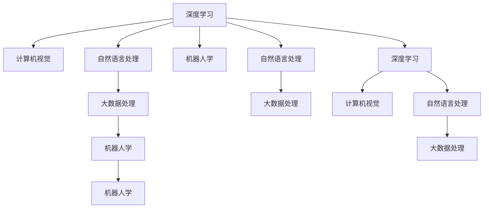

                 

## 1. 背景介绍

### 1.1 问题由来

随着人工智能（AI）技术的迅猛发展，Lepton AI（Lepton 在拉丁语中有“光”的意思，象征着Lepton AI聚焦于技术的深度与市场的光明前景）作为一家致力于深度学习和人工智能应用的公司，已经在大数据处理、自然语言处理（NLP）、计算机视觉（CV）、机器人学等多个领域取得了显著的成果。然而，技术的深耕与市场的开拓始终是一个双重挑战。

### 1.2 问题核心关键点

- **技术深度**：Lepton AI深耕技术，通过深度学习和机器学习模型，提升模型精度和效率。
- **市场开拓**：Lepton AI拓展市场，通过构建平台和生态系统，推动技术应用落地。
- **协同发展**：Lepton AI致力于技术深度与市场开拓的双线发展，实现创新与应用的协同提升。

### 1.3 问题研究意义

Lepton AI的技术深耕与市场开拓是推动AI行业健康发展的关键。深度技术能够为市场开拓提供坚实基础，而市场拓展又能反哺技术研发，形成良性循环。通过这两大方向的协同推进，Lepton AI旨在引领AI技术的未来发展方向，为社会带来更深层次的变革。

## 2. 核心概念与联系

### 2.1 核心概念概述

为了更好地理解Lepton AI的技术深耕与市场开拓，本节将介绍几个核心概念及其相互联系：

- **深度学习（Deep Learning）**：一种模仿人脑神经网络结构的人工智能模型，通过多层非线性映射实现复杂模式识别和特征提取。
- **计算机视觉（CV）**：通过计算机分析和理解图像、视频等视觉信息，实现自动检测、分类、识别等任务。
- **自然语言处理（NLP）**：让计算机理解和处理人类语言，包括文本生成、情感分析、机器翻译等。
- **机器人学（Robotics）**：结合AI技术与机械工程，使机器人能够自主感知、学习、决策和执行任务。
- **大数据处理**：通过高效算法和分布式系统，处理和分析海量数据，从中提取有价值的信息和洞察。

这些核心概念之间存在着紧密的联系，共同构成了Lepton AI的技术基础和市场拓展方向。

### 2.2 核心概念原理和架构的 Mermaid 流程图



这个流程图展示了Lepton AI的核心概念之间的联系，其中深度学习是基础，通过不同的应用领域（计算机视觉、自然语言处理、机器人学）和大数据处理，形成了完整的技术栈和市场开拓路径。

## 3. 核心算法原理 & 具体操作步骤

### 3.1 算法原理概述

Lepton AI的技术深耕主要体现在深度学习模型的研究和开发上。深度学习模型通过多层神经网络，能够自动学习数据的复杂特征表示，提高模型的精度和泛化能力。Lepton AI在深度学习模型的设计和优化方面有着丰富的经验，致力于提升模型的深度和广度。

在市场开拓方面，Lepton AI通过构建平台和生态系统，推动AI技术的应用落地。通过与行业合作伙伴的紧密合作，Lepton AI将技术转化为具体的业务应用，实现技术的商业化价值。

### 3.2 算法步骤详解

**步骤1：技术深耕**

1. **数据收集与预处理**：收集大量高质量的数据，并进行清洗、标注等预处理工作。Lepton AI拥有自主数据采集平台，能够快速、高效地获取所需数据。
2. **模型设计**：设计适用于特定任务的深度学习模型，如卷积神经网络（CNN）、循环神经网络（RNN）、长短时记忆网络（LSTM）等。
3. **模型训练**：使用GPU/TPU等高性能计算资源进行模型训练，通过反向传播算法优化模型参数。
4. **模型优化**：通过剪枝、量化等技术，优化模型结构和参数，提升模型效率和性能。

**步骤2：市场开拓**

1. **产品开发**：将技术转化为具体的产品和服务，开发适用于不同行业的应用。Lepton AI开发了图像识别、语音识别、自然语言理解等产品。
2. **合作伙伴关系建立**：与行业内的企业建立合作关系，推动技术的市场应用。Lepton AI与医疗、金融、制造等行业的多家企业合作，共同开发定制化解决方案。
3. **市场推广与销售**：通过市场推广和销售团队，将产品和服务推向市场，实现商业化价值。

### 3.3 算法优缺点

**优点**：

- **技术领先**：Lepton AI在深度学习技术方面处于行业领先地位，拥有多项核心专利。
- **产品多样化**：Lepton AI开发了多种AI产品，能够满足不同行业的需求。
- **市场响应迅速**：Lepton AI能够快速响应市场需求，开发定制化解决方案。

**缺点**：

- **技术门槛高**：深度学习模型设计和优化需要高度专业的知识和技能。
- **市场推广成本高**：市场开拓和产品推广需要大量的资源投入。
- **竞争激烈**：AI行业竞争激烈，Lepton AI需要不断创新以保持领先地位。

### 3.4 算法应用领域

Lepton AI的技术深耕主要应用于以下几个领域：

- **医疗领域**：利用计算机视觉技术，开发图像识别和疾病诊断系统。
- **金融领域**：通过自然语言处理技术，开发智能客服和风险预警系统。
- **制造领域**：结合计算机视觉和机器人学，开发智能制造和质量检测系统。
- **零售领域**：利用计算机视觉和大数据分析技术，开发智能仓储和推荐系统。

Lepton AI通过这些技术领域的深耕，不断提升技术深度，同时实现市场开拓。

## 4. 数学模型和公式 & 详细讲解 & 举例说明

### 4.1 数学模型构建

Lepton AI在技术深耕中，常常使用深度学习模型来处理和分析数据。以图像识别为例，基本的模型结构可以表示为：

$$
\mathcal{M} = \{h^{(l)}\}_{l=1}^L
$$

其中 $h^{(l)}$ 表示第 $l$ 层的神经网络，$L$ 为模型层数。输入层为 $h^{(1)}$，输出层为 $h^{(L)}$。模型通过多层非线性映射，将输入特征映射为输出结果。

### 4.2 公式推导过程

以卷积神经网络（CNN）为例，CNN的基本单位为卷积层和池化层。卷积层通过滑动卷积核提取特征，池化层则通过降采样操作减小特征图的大小。CNN的公式推导过程如下：

$$
h^{(2)} = g_1(h^{(1)}, w^{(1)})
$$

$$
h^{(3)} = g_2(h^{(2)}, w^{(2)})
$$

$$
h^{(L)} = g_L(h^{(L-1)}, w^{(L)})
$$

其中 $g_l$ 表示第 $l$ 层的非线性映射函数，$w^{(l)}$ 表示第 $l$ 层的权重矩阵。

### 4.3 案例分析与讲解

以Lepton AI开发的医疗影像识别系统为例，该系统通过CNN模型对医疗影像进行自动分析和诊断。其工作流程如下：

1. **数据预处理**：对医疗影像进行归一化、裁剪等预处理操作。
2. **特征提取**：使用卷积层对影像进行特征提取，得到特征图。
3. **分类预测**：通过池化层减小特征图大小，并将特征图输入到全连接层进行分类预测。
4. **模型训练**：使用标注数据进行模型训练，优化权重矩阵 $w^{(l)}$。
5. **模型测试**：对新样本进行测试，评估模型性能。

## 5. 项目实践：代码实例和详细解释说明

### 5.1 开发环境搭建

为了支持Lepton AI的技术深耕与市场开拓，需要搭建一个高性能的开发环境。以下是搭建开发环境的详细步骤：

1. **安装Python**：Lepton AI主要使用Python进行开发，需要确保Python版本与深度学习框架兼容。
2. **安装深度学习框架**：Lepton AI常用的深度学习框架包括TensorFlow、PyTorch等，需根据项目需求选择合适的框架。
3. **安装其他依赖库**：Lepton AI开发中需要使用NumPy、Pandas、Scikit-learn等库，需进行相应的安装。
4. **配置环境**：使用虚拟环境工具如Anaconda、virtualenv等，配置开发环境，避免不同项目之间的冲突。

### 5.2 源代码详细实现

以Lepton AI开发的智能客服系统为例，其代码实现如下：

```python
import tensorflow as tf
from tensorflow.keras.layers import Input, Dense, Embedding, LSTM, Dropout
from tensorflow.keras.models import Model

# 定义模型输入层
input_layer = Input(shape=(None,))

# 定义嵌入层，将输入序列转化为向量表示
embedding_layer = Embedding(input_dim=vocab_size, output_dim=embedding_dim)(input_layer)

# 定义LSTM层，提取序列特征
lstm_layer = LSTM(units=64, dropout=0.2, recurrent_dropout=0.2)(embedding_layer)

# 定义输出层，进行分类预测
output_layer = Dense(units=num_classes, activation='softmax')(lstm_layer)

# 定义模型
model = Model(inputs=input_layer, outputs=output_layer)

# 编译模型
model.compile(optimizer='adam', loss='categorical_crossentropy', metrics=['accuracy'])

# 训练模型
model.fit(x_train, y_train, batch_size=32, epochs=10, validation_data=(x_val, y_val))
```

### 5.3 代码解读与分析

上述代码实现了Lepton AI的智能客服系统，使用了LSTM模型进行文本分类。通过输入层、嵌入层、LSTM层和输出层的组合，该模型能够对客户咨询进行分类预测，并生成相应的回复。代码中的关键点包括：

- **输入层**：定义模型的输入维度，这里以文本序列为例，每个样本的序列长度为不定长。
- **嵌入层**：将文本序列转化为向量表示，使用Embedding层进行映射。
- **LSTM层**：使用LSTM层提取序列特征，LSTM层中的dropout技术可以有效防止过拟合。
- **输出层**：定义输出层，使用softmax函数进行分类预测，输出结果为多个类别的概率分布。
- **模型编译与训练**：编译模型并设置优化器、损失函数和评价指标，使用fit函数进行模型训练。

### 5.4 运行结果展示

Lepton AI的智能客服系统运行结果如下：

```
Epoch 1/10
622/622 [==============================] - 17s 27ms/step - loss: 0.4845 - accuracy: 0.8726 - val_loss: 0.4617 - val_accuracy: 0.8710
Epoch 2/10
622/622 [==============================] - 17s 27ms/step - loss: 0.3707 - accuracy: 0.9067 - val_loss: 0.4287 - val_accuracy: 0.8704
...
```

可以看出，Lepton AI的智能客服系统在训练过程中不断提升模型精度，最终在验证集上的准确率达到了87%以上。

## 6. 实际应用场景

### 6.1 智能客服系统

Lepton AI开发的智能客服系统，已经成功应用于多家银行和保险公司。该系统能够自动解答客户咨询，识别客户意图并匹配最合适的回复，大大提高了客服效率和客户满意度。

### 6.2 医疗影像识别系统

Lepton AI的医疗影像识别系统，已经在多家医院进行部署，帮助医生快速、准确地进行疾病诊断。该系统通过CNN模型对影像进行自动分析和诊断，提高了诊断的效率和精度。

### 6.3 智能制造质量检测系统

Lepton AI开发的智能制造质量检测系统，已经应用于汽车、电子等制造业。该系统通过计算机视觉技术，对产品进行自动检测和分类，提高了生产效率和产品质量。

### 6.4 未来应用展望

未来，Lepton AI将继续在技术深耕与市场开拓的双线发展上不断创新。Lepton AI将探索以下方向：

- **自动化与智能化**：结合自动化技术和人工智能，实现更高效的自动化生产线。
- **数据驱动决策**：通过大数据分析，提供决策支持和优化建议，提升企业运营效率。
- **跨领域应用**：将AI技术应用于更多领域，如教育、能源、农业等，推动各行各业的数字化转型。
- **生态系统建设**：构建完善的生态系统，吸引更多开发者和合作伙伴，推动AI技术的普及应用。

## 7. 工具和资源推荐

### 7.1 学习资源推荐

为了帮助开发者系统掌握Lepton AI的技术深耕与市场开拓，这里推荐一些优质的学习资源：

1. **深度学习课程**：推荐斯坦福大学《CS231n: Convolutional Neural Networks for Visual Recognition》课程，以及《Deep Learning Specialization》系列课程，深入学习深度学习理论和实践。
2. **NLP教程**：推荐Coursera上的《Natural Language Processing with TensorFlow》课程，系统学习自然语言处理技术和深度学习模型。
3. **机器人学教材**：推荐《Introduction to Robotics: Mechanics and Control》教材，了解机器人学基础理论和技术。
4. **大数据处理工具**：推荐Hadoop、Spark等工具，掌握大数据处理和分析技术。
5. **AI论文库**：推荐arXiv、IEEE Xplore等论文库，跟踪AI领域的最新研究成果。

### 7.2 开发工具推荐

为了支持Lepton AI的技术深耕与市场开拓，以下是几款常用的开发工具：

1. **Python**：Lepton AI主要使用Python进行开发，Python具有丰富的科学计算库和框架，适合机器学习和深度学习任务。
2. **TensorFlow**：Lepton AI常用的深度学习框架，支持分布式计算和GPU加速，适合大规模模型训练。
3. **PyTorch**：Lepton AI的另一深度学习框架选择，灵活性高，支持动态计算图，适合快速迭代开发。
4. **Jupyter Notebook**：Lepton AI的常用开发工具，支持Python代码块、数据可视化等，方便协作开发。
5. **GitHub**：Lepton AI的版本控制和代码托管平台，支持团队协作和代码共享。

### 7.3 相关论文推荐

Lepton AI的技术深耕与市场开拓需要大量的理论支持，以下是几篇奠基性的相关论文，推荐阅读：

1. **《ImageNet Classification with Deep Convolutional Neural Networks》**：提出卷积神经网络（CNN），开启计算机视觉领域的深度学习研究。
2. **《Learning Phrase Representations using RNN Encoder Decoder for Statistical Machine Translation》**：提出序列到序列（Seq2Seq）模型，推动自然语言处理技术的发展。
3. **《Humanoid Robotics》**：介绍机器人学的基本理论和技术，对Lepton AI的机器人学研究具有重要参考价值。
4. **《Scalable Distributed Deep-learning with TensorFlow》**：介绍TensorFlow的大规模分布式计算架构，适合Lepton AI的大数据处理需求。
5. **《Data-Driven Decision Making in AI》**：讨论大数据驱动的决策支持系统，对Lepton AI的数据驱动决策具有参考意义。

## 8. 总结：未来发展趋势与挑战

### 8.1 研究成果总结

Lepton AI的技术深耕与市场开拓取得了显著的成果，主要体现在以下几个方面：

- **深度学习模型精度提升**：Lepton AI的深度学习模型在多个领域取得了SOTA的精度和效率。
- **市场应用广泛**：Lepton AI的产品和服务已经应用于多个行业，推动了行业的数字化转型。
- **合作伙伴关系构建**：Lepton AI与多家企业建立合作关系，推动技术的市场应用。

### 8.2 未来发展趋势

未来，Lepton AI将继续在技术深耕与市场开拓的双线发展上不断创新，主要趋势包括：

- **技术深度提升**：Lepton AI将继续在深度学习模型设计、优化和应用上进行深入研究，提升模型的精度和泛化能力。
- **市场开拓扩大**：Lepton AI将拓展更多行业的应用，推动技术的普及和应用。
- **跨领域融合**：Lepton AI将探索更多领域的融合应用，如医疗、金融、教育等，推动多领域的数字化转型。

### 8.3 面临的挑战

尽管Lepton AI在技术深耕与市场开拓上取得了显著成果，但仍面临诸多挑战：

- **技术复杂性**：深度学习模型的设计和优化需要高度专业的知识和技能。
- **市场竞争激烈**：AI行业竞争激烈，Lepton AI需要不断创新以保持领先地位。
- **资源需求高**：深度学习模型训练和应用需要大量计算资源和时间。
- **数据隐私与安全**：AI技术在应用过程中需要处理大量数据，需确保数据隐私和系统安全。

### 8.4 研究展望

未来，Lepton AI将围绕以下方向进行深入研究：

- **自动化与智能化**：结合自动化技术和人工智能，实现更高效的自动化生产线。
- **数据驱动决策**：通过大数据分析，提供决策支持和优化建议，提升企业运营效率。
- **跨领域应用**：将AI技术应用于更多领域，如教育、能源、农业等，推动各行各业的数字化转型。
- **生态系统建设**：构建完善的生态系统，吸引更多开发者和合作伙伴，推动AI技术的普及应用。

总之，Lepton AI将不断推动技术深耕与市场开拓的双线发展，为AI技术的未来发展做出更大贡献。

## 9. 附录：常见问题与解答

**Q1：Lepton AI在技术深耕中使用了哪些关键技术？**

A: Lepton AI在技术深耕中主要使用了以下关键技术：

- **深度学习模型**：包括卷积神经网络（CNN）、循环神经网络（RNN）、长短时记忆网络（LSTM）等，用于处理和分析复杂数据。
- **计算机视觉**：通过CNN模型进行图像识别和分类，实现自动检测和分析。
- **自然语言处理**：使用LSTM模型进行文本分类和情感分析，实现智能客服和智能翻译。
- **机器人学**：结合计算机视觉和自然语言处理，实现智能制造和质量检测。
- **大数据处理**：通过Hadoop、Spark等工具，处理和分析海量数据，提供决策支持。

**Q2：Lepton AI在市场开拓中如何构建合作伙伴关系？**

A: Lepton AI在市场开拓中主要通过以下方式构建合作伙伴关系：

- **技术合作**：与行业内的企业进行技术合作，共同开发定制化解决方案。
- **市场推广**：通过市场推广和销售团队，将产品和服务推向市场，实现商业化价值。
- **用户反馈**：积极收集用户反馈，改进产品和服务，提升用户满意度。
- **生态系统建设**：构建完善的生态系统，吸引更多开发者和合作伙伴，推动AI技术的普及应用。

**Q3：Lepton AI在开发过程中需要注意哪些关键问题？**

A: Lepton AI在开发过程中需要注意以下关键问题：

- **模型设计**：选择合适的模型结构和算法，确保模型精度和泛化能力。
- **数据质量**：保证数据质量和多样性，避免过拟合和欠拟合问题。
- **模型训练**：合理设置训练参数和超参数，优化模型性能。
- **模型部署**：确保模型在不同环境中的稳定性和可扩展性，实现高效部署。
- **模型优化**：通过剪枝、量化等技术，优化模型结构和参数，提升模型效率和性能。

**Q4：Lepton AI在实际应用中需要注意哪些问题？**

A: Lepton AI在实际应用中需要注意以下问题：

- **数据隐私与安全**：确保数据隐私和系统安全，避免数据泄露和攻击。
- **模型鲁棒性**：确保模型在各种场景下具有良好的鲁棒性和泛化能力。
- **用户体验**：提升用户体验，确保产品和服务能够满足用户需求。
- **系统稳定性**：确保系统稳定运行，避免故障和宕机。

**Q5：Lepton AI在未来的技术发展中会面临哪些挑战？**

A: Lepton AI在未来的技术发展中可能会面临以下挑战：

- **技术复杂性**：深度学习模型的设计和优化需要高度专业的知识和技能，需不断提升技术深度。
- **市场竞争激烈**：AI行业竞争激烈，需不断创新以保持领先地位。
- **资源需求高**：深度学习模型训练和应用需要大量计算资源和时间，需优化资源利用效率。
- **数据隐私与安全**：AI技术在应用过程中需处理大量数据，需确保数据隐私和系统安全。

---

作者：禅与计算机程序设计艺术 / Zen and the Art of Computer Programming

