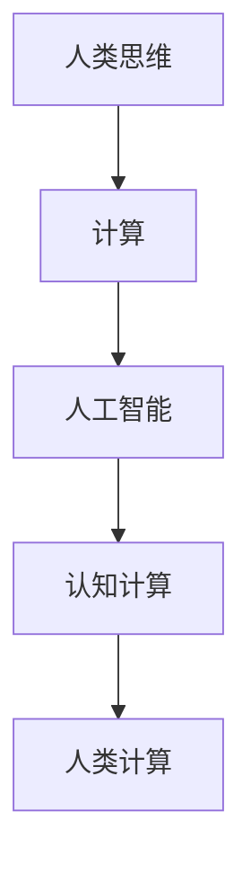

                 

# 探索人类思维的奥秘：人类计算的认知价值

## 1. 背景介绍

### 1.1 问题由来
随着计算机技术的飞速发展，人工智能(AI)已逐渐成为社会发展的核心驱动力。AI 不仅仅在于其技术创新，更重要的是其所承载的认知价值。探索人类思维的奥秘，通过计算来实现，是现代科技与人类智慧结合的桥梁。

AI 的目标是赋予机器“智能”，使机器能像人类一样进行感知、理解、推理和决策。然而，机器的智能源自何处？它如何理解和模拟人类思维？这些问题一直以来困扰着计算机科学和人工智能领域的专家。

### 1.2 问题核心关键点
通过深入探讨人类思维与计算之间的关系，理解人类计算的认知价值，不仅有助于推动AI技术的发展，更可以指导AI系统的设计，提升其智能化水平。关键点包括：

- 人类思维的认知机制
- 计算机如何模仿和模拟人类思维
- AI系统的认知价值与设计原则
- 人类计算对AI的贡献与未来展望

## 2. 核心概念与联系

### 2.1 核心概念概述

为更好地理解人类计算的认知价值，本节将介绍几个密切相关的核心概念：

- 人类思维（Human Mind）：人类大脑的认知过程，包括感知、记忆、学习、理解、推理等。
- 计算（Computation）：通过逻辑、规则和算法处理信息的过程，计算机实现了这一过程。
- 人工智能（Artificial Intelligence, AI）：使机器模拟人类思维，实现智能化的系统。
- 认知计算（Cognitive Computing）：结合心理学、神经科学、认知科学等学科，模拟人类认知过程的计算。
- 人类计算（Human Computing）：利用人类智能与计算技术结合，实现更高效的信息处理。

这些核心概念之间的逻辑关系可以通过以下Mermaid流程图来展示：



这个流程图展示了一些核心概念及其之间的逻辑关系：

1. 人类思维通过计算得以表达和模拟。
2. AI系统基于计算实现智能，从而模拟人类思维。
3. 认知计算结合了心理学、神经科学等学科知识，为AI系统的设计提供理论基础。
4. 人类计算利用了人类智能，提升了计算效率和效果。

这些概念共同构成了AI与人类计算之间的桥梁，为理解和设计AI系统提供了理论指导。

## 3. 核心算法原理 & 具体操作步骤

### 3.1 算法原理概述

人类计算与AI系统设计的核心在于对人类认知机制的模拟和应用。认知计算的核心算法包括：

- 符号逻辑（Symbolic Logic）：通过符号和规则进行推理和决策。
- 神经网络（Neural Networks）：模仿人类神经元之间的连接方式，实现分布式计算。
- 进化算法（Evolutionary Algorithms）：模拟自然选择过程，通过变异、交叉和选择不断优化问题求解。
- 集成学习（Ensemble Learning）：结合多个模型提高预测准确率。

这些算法在AI系统中得到广泛应用，但它们的认知价值在于如何更好地模拟人类思维的某些方面。

### 3.2 算法步骤详解

基于认知计算的核心算法，AI系统的设计步骤如下：

**Step 1: 选择算法与框架**
- 根据任务需求，选择合适的认知计算算法，如符号逻辑、神经网络、进化算法等。
- 利用现成的AI框架，如TensorFlow、PyTorch等，进行模型搭建和训练。

**Step 2: 定义问题与模型**
- 明确问题的认知特征，如是否需要符号推理、概率计算、分布式决策等。
- 设计AI模型结构，确定输入、输出和中间层节点。

**Step 3: 数据准备与预处理**
- 收集和标注与问题相关的数据集。
- 对数据进行清洗、归一化、特征工程等预处理，确保模型训练的准确性和稳定性。

**Step 4: 模型训练与优化**
- 使用选定的算法和框架，对模型进行训练，优化参数。
- 应用正则化、Dropout等技术，防止过拟合。

**Step 5: 模型评估与部署**
- 在测试集上评估模型性能，对比训练集和验证集的效果。
- 将训练好的模型部署到实际应用中，进行实时推理和决策。

### 3.3 算法优缺点

认知计算的核心算法具有以下优点：
1. 高度可解释性。符号逻辑、神经网络的每一步计算过程都可被追踪和解释。
2. 强大的泛化能力。进化算法、集成学习可从大量数据中发现规律，提高模型的泛化性能。
3. 灵活适应性。算法可通过超参数调整，适应不同类型的问题。

但这些算法也存在一些局限性：
1. 计算复杂度高。神经网络、进化算法的计算复杂度较高，对硬件要求高。
2. 难以处理非结构化数据。符号逻辑、进化算法对数据结构有较高要求。
3. 缺乏灵活性。部分算法（如符号逻辑）无法处理连续性变量。

尽管存在这些局限性，但就目前而言，认知计算仍然是构建智能AI系统的基础。未来相关研究的方向，仍在于如何进一步提升算法的效率和灵活性，同时保证可解释性和泛化性能。

### 3.4 算法应用领域

基于认知计算的核心算法，AI系统在以下领域得到了广泛应用：

- 医疗诊断：利用符号逻辑和神经网络，模拟医生的诊断推理过程。
- 自动驾驶：通过进化算法、集成学习，实现车辆对环境变化的智能决策。
- 金融预测：使用神经网络、进化算法，分析历史数据，预测市场走势。
- 自然语言处理：结合符号逻辑和神经网络，实现对文本的理解和生成。
- 机器人控制：采用符号逻辑、神经网络，实现机器人的智能行为。

除了这些经典应用外，AI系统还被创新性地应用到更多领域中，如天气预测、灾害预警、供应链优化等，为各行各业带来变革性影响。

## 4. 数学模型和公式 & 详细讲解  
### 4.1 数学模型构建

认知计算中的数学模型构建，涉及符号逻辑、神经网络、进化算法等。以神经网络为例，其核心数学模型为多层感知机（Multi-Layer Perceptron, MLP）：

$$
y = \sigma(\boldsymbol{W}^1 \boldsymbol{x} + \boldsymbol{b}^1)
$$

其中 $\boldsymbol{x}$ 为输入，$\boldsymbol{y}$ 为输出，$\boldsymbol{W}^1$ 和 $\boldsymbol{b}^1$ 为参数，$\sigma$ 为激活函数。

### 4.2 公式推导过程

以一个简单的三层感知机为例，其公式推导如下：

**输入层**：
- 记 $\boldsymbol{x} = [x_1, x_2]$ 为输入，激活函数为线性函数 $\sigma(x) = x$。

**隐藏层**：
- 记 $\boldsymbol{z} = \boldsymbol{W} \boldsymbol{x} + \boldsymbol{b}$，其中 $\boldsymbol{W} = \begin{bmatrix} w_1 & w_2 \\ w_3 & w_4 \end{bmatrix}$，$\boldsymbol{b} = [b_1, b_2]$，激活函数为 $\sigma(z) = \frac{1}{1+e^{-z}}$。

**输出层**：
- 记 $\boldsymbol{y} = \boldsymbol{W}^1 \boldsymbol{z} + \boldsymbol{b}^1$，其中 $\boldsymbol{W}^1 = \begin{bmatrix} w_5 & w_6 \\ w_7 & w_8 \end{bmatrix}$，$\boldsymbol{b}^1 = [b_3, b_4]$。

将上述公式组合，得到完整的神经网络计算过程：

$$
\boldsymbol{z} = \begin{bmatrix} w_1 & w_2 \\ w_3 & w_4 \end{bmatrix} \begin{bmatrix} x_1 \\ x_2 \end{bmatrix} + \begin{bmatrix} b_1 \\ b_2 \end{bmatrix}
$$

$$
\boldsymbol{y} = \begin{bmatrix} w_5 & w_6 \\ w_7 & w_8 \end{bmatrix} \begin{bmatrix} \frac{1}{1+e^{-z_1}} \\ \frac{1}{1+e^{-z_2}} \end{bmatrix} + \begin{bmatrix} b_3 \\ b_4 \end{bmatrix}
$$

### 4.3 案例分析与讲解

以医疗诊断系统为例，神经网络被广泛应用于病理图像分类、疾病预测等任务中。

- 输入：患者的血液检查结果、症状描述等文本或图像数据。
- 隐藏层：利用神经网络进行特征提取，学习病理特征和症状之间的关联。
- 输出层：判断疾病类型，输出诊断结果。

例如，基于神经网络的肺结节分类模型，输入为肺CT图像，输出为病理类型（良性或恶性）。模型训练过程中，通过反向传播算法，调整参数以最小化预测结果与真实标签之间的误差。

## 5. 项目实践：代码实例和详细解释说明

### 5.1 开发环境搭建

在进行认知计算项目实践前，我们需要准备好开发环境。以下是使用Python进行TensorFlow开发的环境配置流程：

1. 安装Anaconda：从官网下载并安装Anaconda，用于创建独立的Python环境。

2. 创建并激活虚拟环境：
```bash
conda create -n tf-env python=3.8 
conda activate tf-env
```

3. 安装TensorFlow：根据CUDA版本，从官网获取对应的安装命令。例如：
```bash
conda install tensorflow tensorflow-gpu=2.6 -c conda-forge
```

4. 安装必要的第三方库：
```bash
pip install numpy scipy matplotlib seaborn
```

完成上述步骤后，即可在`tf-env`环境中开始认知计算项目的开发。

### 5.2 源代码详细实现

下面以肺结节分类为例，给出使用TensorFlow实现神经网络的代码实现。

```python
import tensorflow as tf
from tensorflow.keras import layers

# 定义模型结构
model = tf.keras.Sequential([
    layers.Conv2D(32, (3, 3), activation='relu', input_shape=(128, 128, 1)),
    layers.MaxPooling2D((2, 2)),
    layers.Conv2D(64, (3, 3), activation='relu'),
    layers.MaxPooling2D((2, 2)),
    layers.Conv2D(128, (3, 3), activation='relu'),
    layers.MaxPooling2D((2, 2)),
    layers.Flatten(),
    layers.Dense(128, activation='relu'),
    layers.Dense(2, activation='softmax')
])

# 编译模型
model.compile(optimizer='adam', loss='categorical_crossentropy', metrics=['accuracy'])

# 加载数据集
train_data = tf.keras.datasets.mnist.load_data()
(x_train, y_train), (x_test, y_test) = train_data

# 数据预处理
x_train = x_train.reshape(-1, 128, 128, 1) / 255.0
x_test = x_test.reshape(-1, 128, 128, 1) / 255.0
y_train = tf.keras.utils.to_categorical(y_train, num_classes=2)

# 训练模型
model.fit(x_train, y_train, epochs=10, batch_size=32, validation_data=(x_test, y_test))

# 评估模型
model.evaluate(x_test, y_test)
```

以上就是使用TensorFlow实现肺结节分类模型的完整代码实现。可以看到，TensorFlow提供了简单易用的API，方便开发者快速搭建和训练神经网络。

### 5.3 代码解读与分析

让我们再详细解读一下关键代码的实现细节：

**定义模型结构**：
- 使用`Sequential`模型，依次添加卷积层、池化层、全连接层。卷积层用于提取图像特征，池化层用于降低特征维度，全连接层用于分类。

**编译模型**：
- 使用`adam`优化器，交叉熵损失函数，准确率作为评价指标。

**加载数据集**：
- 使用MNIST数据集，包含手写数字图像和标签。

**数据预处理**：
- 将图像数据归一化到[0, 1]区间，标签进行one-hot编码。

**训练模型**：
- 使用`fit`函数进行模型训练，指定训练轮数和批次大小。

**评估模型**：
- 使用`evaluate`函数在测试集上评估模型性能，输出损失和准确率。

## 6. 实际应用场景

### 6.1 医疗诊断

基于认知计算的神经网络，可以应用于医疗领域的病理图像分类、疾病预测等任务中。例如，肺结节分类模型可以通过分析CT图像，预测结节是否为恶性，从而辅助医生进行诊断决策。

在技术实现上，收集患者的CT图像和病理结果，作为监督数据，训练神经网络模型。模型通过学习病理特征和症状之间的关联，从而实现自动分类。在实际应用中，医生可以利用模型对新患者的CT图像进行分类，提高诊断的准确性和效率。

### 6.2 自动驾驶

自动驾驶系统需要高度精确的决策机制，以确保行车安全。基于认知计算的进化算法和集成学习，可以实现车辆对环境变化的智能决策。

例如，利用进化算法优化驾驶策略，通过交叉、变异等操作，不断优化车辆的行驶路线和速度控制。利用集成学习结合多个传感器的数据，提高系统的鲁棒性和可靠性。如此构建的自动驾驶系统，能够更智能地处理复杂的交通环境，提升行车的安全性。

### 6.3 金融预测

金融市场数据量大、变化快，传统的统计方法难以有效预测市场走势。基于认知计算的神经网络，可以从历史数据中发现规律，预测市场走势。

例如，利用神经网络对历史交易数据进行分析，提取价格变化、交易量等特征，训练模型进行股票价格预测。模型通过学习历史数据的模式，预测未来股票的涨跌趋势。金融分析师可以利用模型进行投资决策，减少风险，提高收益。

### 6.4 未来应用展望

随着认知计算技术的不断发展，基于神经网络、进化算法等方法的AI系统将逐步深入各个领域。例如：

1. **智慧医疗**：基于神经网络的诊断模型、病理分析、药物研发等应用将提升医疗服务的智能化水平，辅助医生诊疗，加速新药开发进程。
2. **智能教育**：利用神经网络进行作业批改、学情分析、知识推荐等方面，因材施教，促进教育公平，提高教学质量。
3. **智慧城市治理**：基于神经网络的城事件监测、舆情分析、应急指挥等环节，提高城市管理的自动化和智能化水平，构建更安全、高效的未来城市。
4. **个性化推荐系统**：基于神经网络的推荐模型，利用用户行为数据，进行个性化推荐，提升用户体验。

此外，在企业生产、社会治理、文娱传媒等众多领域，基于认知计算的AI应用也将不断涌现，为经济社会发展注入新的动力。相信随着技术的日益成熟，认知计算方法必将在构建智能系统方面发挥更大的作用。

## 7. 工具和资源推荐

### 7.1 学习资源推荐

为了帮助开发者系统掌握认知计算的理论基础和实践技巧，这里推荐一些优质的学习资源：

1. **《深度学习》课程**：斯坦福大学开设的深度学习课程，涵盖深度学习的基础理论和实际应用，适合入门和进阶学习。
2. **《神经网络与深度学习》书籍**：该书详细介绍了神经网络的基本原理和实际应用，是深度学习领域的经典之作。
3. **TensorFlow官方文档**：TensorFlow的官方文档，提供了详尽的API参考和案例实践，适合快速上手TensorFlow。
4. **深度学习社区**：如Kaggle、GitHub等，提供了大量的深度学习项目和数据集，适合实践和交流。
5. **深度学习实验室**：如Google Colab、DeepLab等，提供了免费的GPU资源，适合进行大规模深度学习实验。

通过对这些资源的学习实践，相信你一定能够快速掌握认知计算的核心算法和应用方法，并用于解决实际的AI问题。

### 7.2 开发工具推荐

高效的开发离不开优秀的工具支持。以下是几款用于认知计算开发的常用工具：

1. **TensorFlow**：由Google主导开发的深度学习框架，生产部署方便，适合大规模工程应用。
2. **PyTorch**：由Facebook开发的深度学习框架，灵活高效，适合快速迭代研究。
3. **Keras**：基于TensorFlow和Theano的高级深度学习框架，提供了简单易用的API，适合快速原型开发。
4. **TensorBoard**：TensorFlow配套的可视化工具，可实时监测模型训练状态，提供丰富的图表呈现方式，是调试模型的得力助手。
5. **Weights & Biases**：模型训练的实验跟踪工具，可以记录和可视化模型训练过程中的各项指标，方便对比和调优。

合理利用这些工具，可以显著提升认知计算项目的开发效率，加快创新迭代的步伐。

### 7.3 相关论文推荐

认知计算领域的研究始于学界的持续探索，以下是几篇奠基性的相关论文，推荐阅读：

1. **《深度学习》**：Yoshua Bengio等人发表的深度学习综述论文，全面介绍了深度学习的基本原理和最新进展。
2. **《理解深度学习》**：Ian Goodfellow等人撰写的深度学习教材，深入浅出地介绍了深度学习的核心概念和实际应用。
3. **《神经网络与深度学习》**：Michael Nielsen撰写的神经网络入门教材，详细介绍了神经网络的基本原理和实际应用。
4. **《深度学习入门》**：斋藤康毅撰写的深度学习教材，适合入门学习。

这些论文代表了大规模计算模型的发展脉络，通过学习这些前沿成果，可以帮助研究者把握学科前进方向，激发更多的创新灵感。

## 8. 总结：未来发展趋势与挑战

### 8.1 总结

本文对认知计算的核心算法和实际应用进行了全面系统的介绍。首先阐述了人类思维与计算之间的关系，明确了认知计算在模拟人类思维、提升AI系统智能方面的价值。其次，从原理到实践，详细讲解了认知计算的数学模型和算法步骤，给出了认知计算任务开发的完整代码实例。同时，本文还广泛探讨了认知计算在医疗、自动驾驶、金融预测等领域的实际应用，展示了认知计算方法的巨大潜力。此外，本文精选了认知计算技术的各类学习资源，力求为读者提供全方位的技术指引。

通过本文的系统梳理，可以看到，认知计算方法正在成为AI系统设计的重要基础，极大地拓展了AI系统的应用边界，推动了AI技术的发展。未来，伴随认知计算技术的不断演进，AI系统将在更多领域展现其强大的应用价值，深刻影响人类的生产生活方式。

### 8.2 未来发展趋势

展望未来，认知计算技术将呈现以下几个发展趋势：

1. **模型的多样化和高效化**：未来的认知计算模型将更加多样化，涵盖神经网络、符号逻辑、进化算法等多种形式，以适应不同类型的问题。同时，高效化也是未来发展方向，通过参数共享、模块化设计等技术，提升模型的计算效率和可解释性。
2. **跨学科融合**：认知计算将与心理学、神经科学、计算机科学等学科深度融合，进一步提升对人类认知过程的理解和模拟。例如，利用心理学理论优化神经网络的训练过程，提升模型的鲁棒性和泛化性能。
3. **数据驱动与知识驱动结合**：未来的认知计算系统将不仅依赖数据驱动，还将结合专家知识和领域经验，形成知识驱动的认知模型。例如，结合知识图谱、逻辑规则等先验知识，提升模型的准确性和鲁棒性。
4. **实时性与交互性**：认知计算系统将逐步实现实时性，通过分布式计算、异构系统融合等技术，提升系统的响应速度和稳定性。同时，交互性也将成为重要发展方向，通过自然语言处理等技术，提升人机交互体验。
5. **伦理与安全**：认知计算系统将更多地考虑伦理和安全问题，通过引入隐私保护、公平性评估等机制，保障数据和模型的安全，避免有害信息传播。

以上趋势凸显了认知计算技术的广阔前景，这些方向的探索发展，必将进一步提升AI系统的智能化水平，为人类认知智能的进化带来深远影响。

### 8.3 面临的挑战

尽管认知计算技术已经取得了瞩目成就，但在迈向更加智能化、普适化应用的过程中，它仍面临着诸多挑战：

1. **计算资源限制**：当前的深度学习模型对硬件资源要求较高，计算复杂度高，需要强大的GPU/TPU支持。如何降低计算资源消耗，提升模型的效率，仍是一个重要课题。
2. **数据质量和标注成本**：高质量标注数据的获取成本高，数据质量和标注一致性难以保障。如何通过无监督学习和迁移学习，降低对标注数据的依赖，是未来的研究方向。
3. **模型的可解释性和鲁棒性**：深度学习模型的黑盒特性，导致其决策过程难以解释，缺乏鲁棒性。如何提高模型的可解释性和鲁棒性，是提升AI系统可靠性的关键。
4. **伦理和安全问题**：深度学习模型可能学习到有害信息，传播虚假信息，对社会造成负面影响。如何保障模型的伦理和安全，确保其输出符合人类价值观，是未来的重要课题。
5. **模型泛化与公平性**：深度学习模型可能存在偏见，对特定群体不公平。如何提升模型的泛化性能和公平性，确保其对不同群体公平对待，是未来的研究方向。

### 8.4 研究展望

面对认知计算面临的挑战，未来的研究需要在以下几个方面寻求新的突破：

1. **无监督学习与迁移学习**：通过无监督学习，从非结构化数据中发现模式，降低对标注数据的依赖。通过迁移学习，将已有知识应用到新领域，提升模型的泛化能力。
2. **参数共享与模块化设计**：通过参数共享和模块化设计，提高模型的效率和可解释性。例如，利用适配器技术，只更新部分参数，保留大部分预训练权重。
3. **跨学科融合与知识整合**：与心理学、神经科学等学科深度融合，提升对人类认知过程的理解。利用知识图谱、逻辑规则等先验知识，提升模型的准确性和鲁棒性。
4. **实时性与交互性优化**：通过分布式计算、异构系统融合等技术，提升系统的实时性和交互性。例如，利用边缘计算，降低系统延迟，提升响应速度。
5. **伦理与安全保障**：引入隐私保护、公平性评估等机制，保障数据和模型的安全，确保其输出符合人类价值观。例如，利用对抗训练等技术，提升模型的鲁棒性和安全性。

这些研究方向的探索，必将引领认知计算技术迈向更高的台阶，为构建安全、可靠、可解释、可控的智能系统铺平道路。面向未来，认知计算技术还需要与其他人工智能技术进行更深入的融合，如知识表示、因果推理、强化学习等，多路径协同发力，共同推动自然语言理解和智能交互系统的进步。只有勇于创新、敢于突破，才能不断拓展认知计算的边界，让智能技术更好地造福人类社会。

## 9. 附录：常见问题与解答

**Q1：认知计算的核心算法有哪些？**

A: 认知计算的核心算法包括符号逻辑、神经网络、进化算法等。其中，神经网络是最广泛应用的认知计算算法，可以模拟人类大脑的神经元连接方式，实现分布式计算。

**Q2：认知计算的应用场景有哪些？**

A: 认知计算的应用场景包括医疗诊断、自动驾驶、金融预测、自然语言处理、机器人控制等。例如，在医疗领域，可以利用神经网络进行病理图像分类和疾病预测，辅助医生进行诊断决策。在自动驾驶领域，可以结合进化算法和集成学习，实现车辆对环境变化的智能决策。

**Q3：认知计算的优势和劣势是什么？**

A: 认知计算的优势在于能够模拟人类认知过程，具有高度的灵活性和可解释性。但同时，计算复杂度高，对硬件资源要求高，数据标注成本高，模型的可解释性和鲁棒性仍需提升。

**Q4：如何提高认知计算的鲁棒性和安全性？**

A: 提高认知计算的鲁棒性和安全性，需要从模型设计和训练过程中入手。例如，利用对抗训练技术，提升模型的鲁棒性，避免过拟合。引入伦理导向的评价指标，避免模型输出有害信息。

**Q5：认知计算的未来发展方向是什么？**

A: 未来的认知计算将朝着模型的多样化、高效化、跨学科融合、实时性与交互性提升、伦理与安全保障等方向发展。例如，未来的认知计算模型将涵盖神经网络、符号逻辑、进化算法等多种形式，通过跨学科融合，提升对人类认知过程的理解。同时，实时性与交互性也将成为重要发展方向，利用分布式计算和边缘计算技术，提升系统的响应速度和稳定性。

综上所述，认知计算技术的未来发展潜力巨大，但面临的挑战也不少。只有在技术、应用、伦理等多个维度协同发力，才能真正实现AI系统的智能化和普适化，为人类认知智能的进化带来深远影响。

