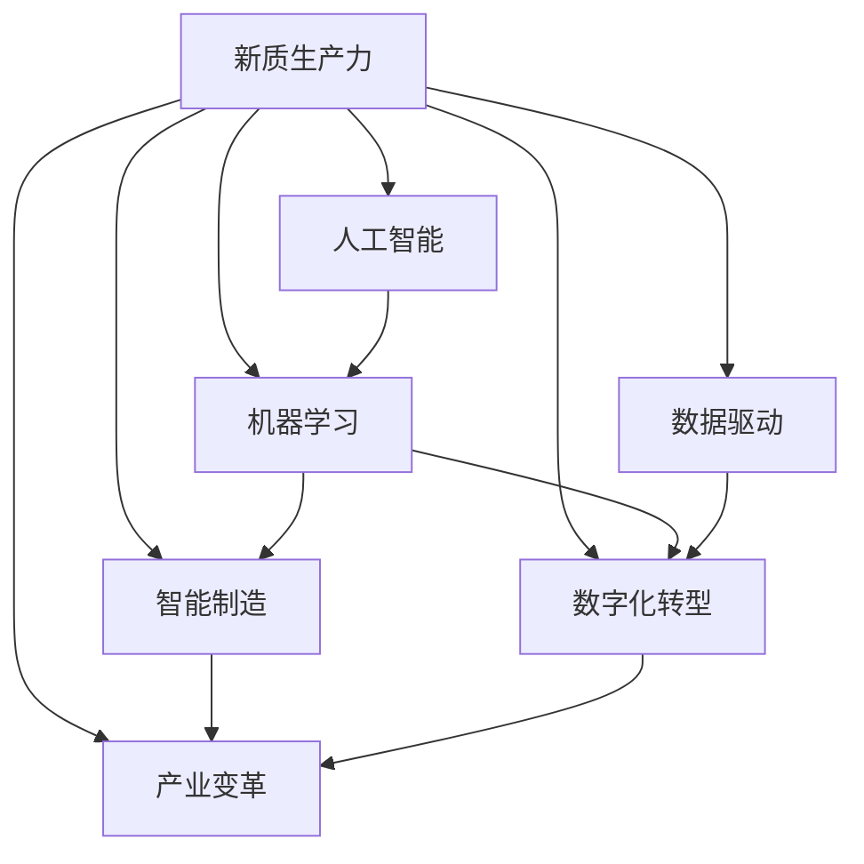

                 

# 提升竞争力的新质生产力策略

> 关键词：新质生产力,人工智能,生产力提升,数字经济,智能制造,产业变革,创新驱动,数字化转型,数据驱动

## 1. 背景介绍

### 1.1 问题由来

近年来，全球经济结构正在经历深刻变革。传统基于物质资源的生产力模式已无法满足日益增长的市场需求和环境保护压力。新的生产力模式必须依靠智能化的手段，通过数字化转型和技术创新，实现高效、环保、可持续的发展。

智能技术尤其是人工智能（AI）和机器学习（ML）技术的飞速发展，为各行各业带来了新的生产力形态，即新质生产力（New-Quality Productivity）。新质生产力以数据为核心，通过智能算法和计算能力，大幅提升生产效率、产品质量和创新能力，开辟了生产力的新境界。

然而，企业在推进新质生产力转型时，面临技术能力不足、数据管理困难、组织变革阻力等诸多挑战。本文旨在系统梳理新质生产力的理论基础和实践方法，提供全面的策略指导，帮助企业在数字化转型的浪潮中提升竞争力。

## 2. 核心概念与联系

### 2.1 核心概念概述

为更好地理解新质生产力的内涵和实现路径，本节将介绍几个密切相关的核心概念：

- **新质生产力(New-Quality Productivity)**：依托智能算法和数据驱动的新型生产力模式，通过自动化、智能化手段，提升生产效率和创新能力，实现可持续的经济发展。

- **人工智能(Artificial Intelligence)**：利用机器学习和深度学习技术，构建智能化的决策和执行系统，助力企业实现生产自动化和智能化。

- **机器学习(Machine Learning)**：通过数据训练模型，使机器具备对数据进行自主学习和优化能力，提升企业运营效率和决策精度。

- **数据驱动(Data-Driven)**：以数据为核心，利用数据洞察发现规律，优化决策过程，驱动企业实现科学化、精准化的管理。

- **智能制造(Intelligent Manufacturing)**：融合AI、ML等智能技术，实现生产过程的智能化，提升产品质量、降低生产成本。

- **数字化转型(Digital Transformation)**：通过数字化手段重构企业价值链，实现业务模式、流程和组织架构的变革，提升企业竞争力。

- **产业变革(Industrial Revolution)**：由AI、ML等智能技术驱动的第四次工业革命，重塑生产方式、商业模式和产业结构，推动全球经济向智能经济转型。

这些核心概念之间的逻辑关系可以通过以下Mermaid流程图来展示：



这个流程图展示了一系列相关概念之间的联系：

1. 新质生产力依赖于人工智能和机器学习技术，通过数据驱动实现智能化决策和执行。
2. 智能制造和数字化转型是新质生产力的重要实践领域，推动生产方式和业务模式的变革。
3. 产业变革是最终目标，旨在通过新质生产力实现经济结构的升级和可持续发展。

## 3. 核心算法原理 & 具体操作步骤
### 3.1 算法原理概述

新质生产力是基于数据和算法的新型生产力模式。其核心思想是利用智能算法和大数据，对生产流程和业务流程进行优化和自动化，实现效率提升和创新驱动。新质生产力的主要算法包括：

- **数据采集与预处理**：从生产设备和业务系统中采集数据，通过清洗、归一化等步骤，转换为算法可用的输入格式。
- **特征工程**：从原始数据中提取关键特征，生成算法可训练的数据集。
- **模型训练与优化**：利用机器学习算法训练模型，并通过调参等技术优化模型性能。
- **模型部署与监控**：将训练好的模型部署到生产环境中，并实时监控模型表现，根据反馈进行迭代优化。

新质生产力的算法原理本质上是数据科学和人工智能的交叉应用。通过数据驱动的智能化决策，实现生产流程和业务流程的优化，最终提升企业的整体竞争力。

### 3.2 算法步骤详解

新质生产力的实施步骤通常包括以下几个关键环节：

**Step 1: 数据采集与预处理**
- 确定数据源：从生产设备、传感器、业务系统等采集生产数据。
- 数据清洗与归一化：去除异常值、填补缺失值、归一化数据范围，确保数据质量。
- 特征工程：选择合适的特征，生成可用于模型训练的数据集。

**Step 2: 模型训练与优化**
- 选择合适的算法：如回归、分类、聚类等，根据任务需求选择模型。
- 训练模型：利用采集和预处理后的数据集，训练模型。
- 模型调参：通过网格搜索、随机搜索等方法，寻找最优的模型参数。

**Step 3: 模型部署与监控**
- 模型部署：将训练好的模型部署到生产环境，供生产系统调用。
- 模型监控：实时监控模型表现，及时发现和修正问题。
- 反馈优化：根据监控结果，对模型进行迭代优化，提升性能。

### 3.3 算法优缺点

新质生产力算法具有以下优点：
1. 高效自动化：通过智能化算法自动化生产流程，大幅提升生产效率。
2. 精准决策：利用数据驱动决策，提高决策的准确性和科学性。
3. 创新驱动：通过机器学习算法发现生产流程中的新模式，推动技术创新。
4. 灵活性高：算法模型可以根据数据变化进行动态调整，适应不同生产场景。

同时，该方法也存在一些局限性：
1. 依赖高质量数据：新质生产力的效果很大程度上取决于数据的质量和完整性，数据采集和管理难度较大。
2. 技术门槛高：需要具备数据科学和机器学习的专业知识，企业内部培训成本较高。
3. 初期投入大：前期需要进行数据采集和模型训练，初期投入较大。
4. 模型风险：算法模型可能存在预测偏差或过拟合问题，需要持续监控和优化。

尽管存在这些局限性，但就目前而言，基于新质生产力的算法方法在生产效率提升和创新驱动方面表现出色，成为制造业和数字化转型中的重要工具。

### 3.4 算法应用领域

新质生产力算法已在多个领域得到了广泛应用，例如：

- 智能制造：通过机器视觉、自动化控制等技术，实现生产流程的智能化和自动化。
- 能源管理：利用数据驱动的算法优化能源使用，提升能源利用效率。
- 供应链管理：通过大数据分析和智能算法，优化供应链流程，降低成本、提升效率。
- 金融风控：利用机器学习算法预测信用风险，防范金融诈骗，提升金融安全。
- 医疗诊断：利用AI算法分析医学影像和数据，辅助医生进行精准诊断。
- 智慧城市：通过数据驱动的智能系统，提升城市管理的智能化和效率。

除了上述这些经典领域，新质生产力算法还在更多行业领域得到了创新应用，如智慧农业、智能交通、智能物流等，为各行业带来了显著的提升和变革。

## 4. 数学模型和公式 & 详细讲解 & 举例说明

### 4.1 数学模型构建

新质生产力的实现通常依赖于数学模型的构建和优化。以下是几个常见的数学模型及其构建过程：

**回归模型**：用于预测数值型数据，公式如下：
$$ y = f(x) = \beta_0 + \beta_1x_1 + \beta_2x_2 + ... + \beta_nx_n + \epsilon $$
其中 $y$ 为预测值，$x$ 为输入特征，$\beta$ 为模型参数，$\epsilon$ 为误差项。

**分类模型**：用于预测类别型数据，如决策树、支持向量机等，公式如下：
$$ \hat{y} = f(x) = \sum_{i=1}^n \theta_i \phi_i(x) + b $$
其中 $\hat{y}$ 为预测类别，$\phi_i(x)$ 为特征函数，$\theta_i$ 为模型参数，$b$ 为偏置项。

**聚类模型**：用于发现数据中的自然分组，如K-Means、层次聚类等，公式如下：
$$ \min_{K,C} \sum_{i=1}^N \sum_{j=1}^K (x_i - C_j)^2 $$
其中 $K$ 为聚类数目，$C$ 为聚类中心，$N$ 为数据样本数量。

这些模型在新质生产力的实施中都有广泛的应用，例如在预测生产设备故障、优化供应链管理、分类客户群体等方面。

### 4.2 公式推导过程

以回归模型为例，解释其构建和优化过程：

**模型构建**：
- 假设已知 $n$ 个样本数据 $(x_1, y_1), (x_2, y_2), ..., (x_n, y_n)$。
- 通过最小二乘法，寻找线性回归模型 $f(x) = \beta_0 + \beta_1x_1 + \beta_2x_2 + ... + \beta_nx_n$，使得模型预测值与实际值尽可能接近，即最小化均方误差 $MSE$。
- 均方误差 $MSE$ 定义为：
$$ MSE = \frac{1}{N} \sum_{i=1}^N (y_i - f(x_i))^2 $$

**模型优化**：
- 利用梯度下降算法，计算损失函数的梯度，更新模型参数。
- 梯度下降算法的更新公式为：
$$ \theta_{k+1} = \theta_k - \alpha \nabla f(x_k) $$
其中 $\alpha$ 为学习率，$\nabla f(x_k)$ 为损失函数的梯度。
- 通过反复迭代，直到模型收敛，即梯度为0或达到预设的迭代次数。

### 4.3 案例分析与讲解

以智能制造中的生产设备故障预测为例，展示新质生产力算法的应用：

**数据采集**：
- 从生产设备的传感器和监控系统中采集运行数据，如温度、压力、振动等。
- 将采集到的数据清洗、归一化，生成可用于模型训练的数据集。

**模型构建**：
- 利用回归模型 $y = f(x) = \beta_0 + \beta_1x_1 + \beta_2x_2 + ... + \beta_nx_n$，预测设备故障概率。
- 选择适合的生产特征 $x_1, x_2, ..., x_n$，构建模型。

**模型优化**：
- 通过梯度下降算法优化模型参数，确保预测准确性。
- 模型优化过程中，需要对超参数进行调参，如学习率、迭代次数等，以找到最佳模型。

**模型部署**：
- 将训练好的模型部署到生产环境中的监控系统中。
- 实时监测设备运行数据，预测故障概率，提前进行维护。

## 5. 项目实践：代码实例和详细解释说明

### 5.1 开发环境搭建

在进行新质生产力实践前，我们需要准备好开发环境。以下是使用Python进行Pandas、Scikit-learn等库的开发环境配置流程：

1. 安装Anaconda：从官网下载并安装Anaconda，用于创建独立的Python环境。

2. 创建并激活虚拟环境：
```bash
conda create -n productivity-env python=3.8 
conda activate productivity-env
```

3. 安装必要的库：
```bash
conda install pandas scikit-learn matplotlib seaborn jupyter notebook
```

4. 启动Jupyter Notebook：
```bash
jupyter notebook
```

完成上述步骤后，即可在`productivity-env`环境中开始新质生产力实践。

### 5.2 源代码详细实现

下面我们以智能制造中设备故障预测为例，给出使用Pandas和Scikit-learn库的代码实现。

```python
import pandas as pd
import numpy as np
from sklearn.model_selection import train_test_split
from sklearn.linear_model import LinearRegression
from sklearn.metrics import mean_squared_error

# 读取数据
data = pd.read_csv('device_data.csv')

# 数据预处理
X = data[['temp', 'pressure', 'vibration']]  # 选择特征
y = data['fault_probability']  # 目标变量

# 划分训练集和测试集
X_train, X_test, y_train, y_test = train_test_split(X, y, test_size=0.2, random_state=42)

# 模型训练
model = LinearRegression()
model.fit(X_train, y_train)

# 模型评估
y_pred = model.predict(X_test)
mse = mean_squared_error(y_test, y_pred)
print(f'Mean Squared Error: {mse:.2f}')

# 模型部署
# 在实际生产环境中，将模型部署到设备监控系统中
# 实时监测设备运行数据，预测故障概率，提前进行维护
```

以上就是使用Pandas和Scikit-learn库进行设备故障预测的完整代码实现。可以看到，Pandas库提供了便捷的数据处理和分析功能，Scikit-learn库则提供了丰富的机器学习算法，适合快速原型开发和模型评估。

### 5.3 代码解读与分析

让我们再详细解读一下关键代码的实现细节：

**数据读取与预处理**：
- 使用Pandas库读取数据文件，进行初步的数据处理。
- 选择生产特征和目标变量，用于构建回归模型。

**模型训练**：
- 利用Scikit-learn库中的LinearRegression模型，对训练集进行拟合。
- 通过train_test_split函数将数据集划分为训练集和测试集，进行模型训练。

**模型评估**：
- 利用测试集进行模型评估，计算均方误差(MSE)指标，评估模型预测性能。
- MSE用于衡量模型预测与实际值之间的差异，越小表示预测越准确。

**模型部署**：
- 在实际生产环境中，将训练好的模型部署到设备监控系统中。
- 实时监测设备运行数据，预测故障概率，提前进行维护。

## 6. 实际应用场景

### 6.1 智能制造

在新质生产力的推动下，智能制造实现了从人机协同到智能化的转型，极大地提升了生产效率和产品质量。智能制造的典型应用包括：

- **生产设备监控与维护**：利用传感器数据和机器学习算法，实时监控设备运行状态，预测故障，提前进行维护。
- **质量控制**：通过图像识别和数据挖掘技术，检测产品缺陷，提升产品质量。
- **生产调度优化**：利用算法优化生产流程，平衡生产资源，降低生产成本。
- **供应链管理**：通过数据驱动的算法优化供应链流程，降低库存成本，提升供货效率。

### 6.2 智慧城市

智慧城市是新质生产力的重要应用领域，通过大数据和智能算法，提升城市管理和居民生活质量。智慧城市的典型应用包括：

- **智能交通**：利用AI算法分析交通数据，优化交通流量，提升通行效率。
- **智慧能源**：通过智能算法优化能源使用，降低能耗，提升能源利用效率。
- **公共安全**：利用AI算法分析视频和图像数据，提升公共安全管理能力。
- **智慧环保**：通过大数据分析环境数据，提升环境监测和治理能力。

### 6.3 金融风控

金融领域通过新质生产力，实现了风险预测和智能决策，提升了金融安全和客户体验。金融风控的典型应用包括：

- **信用评分**：利用机器学习算法分析客户数据，预测信用风险。
- **欺诈检测**：通过AI算法分析交易数据，检测和防范欺诈行为。
- **投资组合优化**：利用算法优化投资组合，提升投资回报率。
- **风险预警**：通过实时数据监测，及时发现和应对金融风险。

### 6.4 医疗健康

新质生产力在医疗健康领域也有广泛应用，通过大数据和智能算法，提升了医疗服务的质量和效率。医疗健康的典型应用包括：

- **疾病预测**：利用AI算法分析医疗数据，预测疾病风险。
- **精准诊断**：通过图像识别和自然语言处理技术，辅助医生进行精准诊断。
- **药物研发**：利用AI算法优化药物设计，加速新药研发进程。
- **健康管理**：通过大数据分析健康数据，提供个性化健康管理方案。

## 7. 工具和资源推荐

### 7.1 学习资源推荐

为帮助开发者掌握新质生产力的理论和实践，推荐以下学习资源：

1. 《深度学习》系列书籍：如《深度学习》(周志华)、《Deep Learning》(Ian Goodfellow)，系统讲解深度学习和机器学习的原理和算法。
2. Kaggle竞赛平台：提供大量公开的数据集和竞赛，通过实践学习数据处理和模型训练技能。
3. Coursera在线课程：如《机器学习》(Andrew Ng)、《深度学习专项》(DeepLearning.AI)，提供高质量的在线学习资源。
4. GitHub开源项目：如TensorFlow、PyTorch等，提供丰富的代码示例和社区支持，方便学习实践。
5. 技术博客和论文：如Towards Data Science、ArXiv等，提供最新的技术进展和实践经验。

通过这些资源的学习，可以全面掌握新质生产力的理论和实践，为开发实际项目打下坚实基础。

### 7.2 开发工具推荐

高效的开发离不开优秀的工具支持。以下是几款用于新质生产力开发常用的工具：

1. Python编程语言：Python具有丰富的机器学习库和数据分析工具，适合快速迭代和原型开发。
2. Pandas库：用于数据处理和分析，提供便捷的数据操作功能。
3. Scikit-learn库：提供多种机器学习算法和工具，适合模型训练和评估。
4. TensorFlow和PyTorch：两大深度学习框架，支持大规模模型训练和部署。
5. Jupyter Notebook：提供交互式编程环境，方便快速迭代和模型测试。

合理利用这些工具，可以显著提升新质生产力任务的开发效率，加快创新迭代的步伐。

### 7.3 相关论文推荐

新质生产力的发展源于学界的持续研究。以下是几篇奠基性的相关论文，推荐阅读：

1. 《深度学习》(周志华)：介绍深度学习的基本概念和算法，适合初学者入门。
2. 《机器学习实战》(Peter Harrington)：提供大量代码示例，适合实践学习。
3. 《机器学习》(Andrew Ng)：系统讲解机器学习的原理和应用，适合深入学习。
4. 《深度学习框架TensorFlow实战》(Francois Chollet)：详细讲解TensorFlow的使用，适合框架学习。
5. 《深度学习入门：基于Python的理论与实现》(NielsRogge)：结合理论讲解和代码实现，适合系统学习。

这些论文代表了大规模新质生产力的研究进展，通过学习这些前沿成果，可以帮助研究者把握学科前进方向，激发更多的创新灵感。

## 8. 总结：未来发展趋势与挑战

### 8.1 总结

本文对新质生产力的理论基础和实践方法进行了系统梳理。首先阐述了新质生产力的内涵和实现路径，明确了智能算法和大数据在新质生产力中的核心作用。其次，从原理到实践，详细讲解了新质生产力的数学模型和算法步骤，给出了典型应用场景的代码实现。最后，提出了新质生产力在各行业领域的广泛应用前景，并推荐了相关的学习资源和工具。

通过本文的系统梳理，可以看到，新质生产力依托智能算法和大数据，正在成为各行各业实现数字化转型的重要工具。其通过自动化和智能化手段，大幅提升生产效率和创新能力，为全球经济结构升级提供了新的动力。

### 8.2 未来发展趋势

展望未来，新质生产力将呈现以下几个发展趋势：

1. **智能化水平提升**：随着AI和ML技术的发展，新质生产力的智能化水平将进一步提升，实现更高程度的自动化和智能化。
2. **跨领域融合**：新质生产力将与其他智能技术如物联网(IoT)、区块链、边缘计算等深度融合，构建更全面的智能生态系统。
3. **数据驱动决策**：大数据和新质生产力将进一步深入结合，实现决策的科学化和精准化。
4. **人机协同**：新质生产力将进一步提升人机协作的效率和质量，实现生产力和人力的有机结合。
5. **开放与共享**：新质生产力将促进数据和算法的开放共享，推动全球知识创新和共享。

这些趋势凸显了新质生产力的广阔前景和巨大潜力。通过持续的技术创新和应用实践，新质生产力必将引领全球经济的智能转型，推动可持续发展。

### 8.3 面临的挑战

尽管新质生产力在各行业领域取得了显著成果，但在迈向更加智能化、普适化应用的过程中，仍面临诸多挑战：

1. **技术门槛高**：新质生产力涉及复杂的算法和数据处理，对技术能力的要求较高。
2. **数据安全与隐私**：数据驱动的决策需要处理大量敏感数据，数据安全和隐私保护成为重要课题。
3. **成本与收益**：新质生产力的初期投入较大，需要平衡成本和收益，避免盲目投入。
4. **标准与规范**：新质生产力需要制定统一的标准和规范，避免技术壁垒和信息孤岛。
5. **人才培养**：新质生产力需要跨学科的人才，对现有教育体系提出了挑战。

这些挑战需要各方共同努力，通过技术创新、政策引导和人才培养，推动新质生产力的健康发展。

### 8.4 研究展望

面对新质生产力面临的挑战，未来的研究需要在以下几个方面寻求新的突破：

1. **降低技术门槛**：开发更加易用、高效的算法和工具，降低技术应用门槛。
2. **提升数据安全**：研究数据隐私保护技术，开发数据安全评估工具，确保数据安全。
3. **优化成本收益**：探索更加经济高效的数据采集和处理方式，提升新质生产力的经济效益。
4. **制定统一标准**：推动制定统一的行业标准和规范，促进新质生产力的标准化应用。
5. **培养跨学科人才**：在教育体系中引入跨学科课程，培养具备新质生产力能力的复合型人才。

这些研究方向将推动新质生产力技术的成熟和应用，为全球经济结构的智能化升级提供新的动力。

## 9. 附录：常见问题与解答

**Q1: 什么是新质生产力？**

A: 新质生产力是基于智能算法和大数据的新型生产力模式，通过自动化、智能化手段，提升生产效率和创新能力，实现可持续发展。

**Q2: 新质生产力在实际应用中面临哪些挑战？**

A: 新质生产力在实际应用中面临的主要挑战包括技术门槛高、数据安全与隐私、成本与收益、标准与规范等。

**Q3: 新质生产力如何提升企业的竞争力？**

A: 新质生产力通过智能化手段提升生产效率和创新能力，降低生产成本，提升产品质量，优化供应链管理，从而提升企业的整体竞争力。

**Q4: 新质生产力在不同行业的具体应用有哪些？**

A: 新质生产力在智能制造、智慧城市、金融风控、医疗健康等多个领域都有广泛应用，提升各行业的智能化水平和运营效率。

**Q5: 新质生产力的未来发展趋势有哪些？**

A: 新质生产力的未来发展趋势包括智能化水平提升、跨领域融合、数据驱动决策、人机协同、开放与共享等。

---

作者：禅与计算机程序设计艺术 / Zen and the Art of Computer Programming

