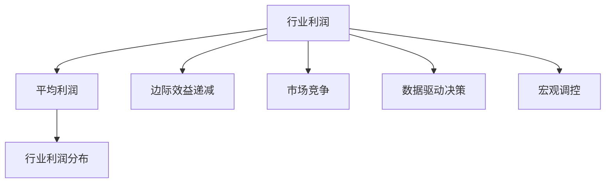

                 

# 收入无限接近平均水平：行业利润回归的规律

> 关键词：
* 经济模型
* 行业利润
* 统计学规律
* 边际效益递减
* 市场动态
* 数据驱动
* 宏观调控

## 1. 背景介绍

### 1.1 问题由来
在当今经济社会中，各行各业的发展与盈利模式呈现出多样性。然而，一个不可忽视的现象是，无论行业多么新颖或先进，最终其利润水平总会趋向平均水平。这个现象引起了经济学界的广泛关注，并推动了对收入分布、行业利润动态等问题的深入研究。

### 1.2 问题核心关键点
为何行业利润会回归平均水平？背后的数学模型是什么？这一现象如何影响企业的策略决策？理解这一问题对于企业规划、政策制定、市场预测等方面具有重要意义。

### 1.3 问题研究意义
通过对行业利润回归平均水平的规律研究，可以揭示市场动态的本质，为决策者提供数据支持，帮助他们制定更加科学合理的策略，促进经济社会的健康稳定发展。

## 2. 核心概念与联系

### 2.1 核心概念概述

为更好地理解行业利润回归平均水平的规律，本节将介绍几个关键概念及其相互关系：

- 行业利润（Industry Profit）：指特定行业内所有企业净利润的总和。
- 平均利润（Average Profit）：指所有行业利润之和除以行业总数，反映行业整体的盈利水平。
- 边际效益递减（Diminishing Returns）：指随着投入资源的增加，每增加一单位资源带来的收益逐渐减少。
- 市场竞争（Market Competition）：指企业之间为争夺市场份额而展开的竞争行为。
- 数据驱动决策（Data-Driven Decision Making）：指利用数据统计分析结果，指导决策过程，降低主观判断的误差。
- 宏观调控（Macroeconomic Regulation）：指政府通过各种手段调节经济运行，促进经济稳定发展。

这些概念之间的关系通过以下Mermaid流程图进行展示：



这个流程图展示出各个概念之间的逻辑关系：

1. 行业利润通过边际效益递减和市场竞争，影响平均利润。
2. 数据驱动决策和宏观调控对行业利润具有指导作用。
3. 平均利润是行业利润分布的重要参考指标。

## 3. 核心算法原理 & 具体操作步骤

### 3.1 算法原理概述

行业利润回归平均水平的规律，可以从以下几个方面进行理解和建模：

1. 经济系统中的企业往往遵循边际效益递减原则，即随着投入的增加，每增加一单位投入带来的收益逐渐减少。
2. 市场竞争导致资源配置趋向最优，使得所有企业的平均利润逐渐接近于行业整体的平均利润。
3. 数据驱动的决策和宏观调控机制有助于保持行业的稳定，并减少极端情况下的行业利润波动。

### 3.2 算法步骤详解

基于上述原理，行业利润回归平均水平的算法步骤可以归纳为：

**Step 1: 收集行业利润数据**
- 收集特定行业的所有企业利润数据。
- 对数据进行清洗、去重和标准化处理。

**Step 2: 计算平均利润**
- 将所有企业利润数据求和，除以企业总数，得到平均利润。

**Step 3: 分析边际效益递减规律**
- 分析不同投入与收益之间的关系，计算边际效益。
- 绘制边际效益曲线，观察边际效益递减现象。

**Step 4: 分析市场竞争影响**
- 模拟市场竞争环境，通过模型计算不同市场结构下的行业利润。
- 比较不同市场结构下的行业利润分布，观察平均利润的趋势。

**Step 5: 引入数据驱动决策**
- 利用统计学方法分析行业利润分布，找出异常点。
- 利用历史数据预测行业利润变化趋势。

**Step 6: 评估宏观调控效果**
- 模拟宏观调控政策，如税收、补贴、限制进入等。
- 评估调控政策对行业利润的影响。

### 3.3 算法优缺点

基于上述原理和步骤的算法，有以下优点和缺点：

**优点:**
1. 能够定量分析行业利润的动态变化，为决策提供数据支撑。
2. 帮助理解市场竞争和边际效益递减等经济原理，提高决策的科学性。
3. 引入数据驱动的决策，减少主观判断的误差。

**缺点:**
1. 依赖于数据质量和完整性，数据偏差可能导致结果不准确。
2. 需要复杂的计算和建模，对计算资源和专业知识要求较高。
3. 宏观调控效果难以精确预测，可能存在不可控因素。

### 3.4 算法应用领域

行业利润回归平均水平的规律，可以应用于以下领域：

- 企业管理：理解行业利润规律，制定合理的经营策略。
- 政府政策制定：分析宏观调控对行业利润的影响，制定科学的发展规划。
- 市场预测：预测行业利润变化趋势，帮助投资者进行投资决策。
- 经济研究：研究行业利润与宏观经济变量之间的关系，提供理论依据。

## 4. 数学模型和公式 & 详细讲解  
### 4.1 数学模型构建

行业利润回归平均水平的规律，可以通过以下数学模型进行描述：

设行业内有 $n$ 家企业，第 $i$ 家企业的利润为 $P_i$，则行业利润为 $P = \sum_{i=1}^n P_i$，平均利润为 $\bar{P} = \frac{P}{n}$。

假设每家企业的收益函数为 $R(Q_i)$，其中 $Q_i$ 为企业的投入，则边际效益为：

$$
M_i = \frac{R'(Q_i)}{Q_i}
$$

市场竞争导致企业无法独占市场，即存在替代品，假设每家企业的市场份额为 $S_i$，则有：

$$
S_i = \frac{P_i}{P}
$$

引入数据驱动决策和宏观调控后，可以建立如下的动态模型：

$$
\frac{dP_i}{dt} = aP_i - bP_i^2 - c
$$

其中 $a$ 为平均增长率，$b$ 为市场饱和率，$c$ 为外生冲击。

### 4.2 公式推导过程

对上述模型进行推导：

1. 求出企业的利润函数 $P_i(Q_i)$。
2. 利用边际效益递减规律，计算企业的边际利润函数 $M_i(Q_i)$。
3. 根据市场份额与利润的关系，建立企业利润的动态模型。

通过求解上述模型，可以模拟不同市场条件下的行业利润变化，并观察其是否趋向平均利润。

### 4.3 案例分析与讲解

以一家典型制造业企业为例，假设其生产成本为 $C(Q)$，销售价格为 $P(Q)$，利润为 $P(Q) - C(Q)$。企业通过增加产量 $Q$ 来提高利润，但边际效益递减，即：

$$
\frac{dP(Q)}{dQ} = \frac{dP}{dQ} - \frac{dC}{dQ}
$$

随着企业规模扩大，市场竞争加剧，企业的市场份额 $S_i$ 逐渐降低，即：

$$
S_i = \frac{P_i}{P}
$$

数据驱动的决策和宏观调控，可能通过政策调整影响企业的成本和市场结构，如：

- 政府提高企业的税收，增加 $C(Q)$。
- 行业内新进入的企业增加，降低 $P(Q)$。

这些因素都会影响企业的利润 $P_i$ 和行业的平均利润 $\bar{P}$。

## 5. 项目实践：代码实例和详细解释说明

### 5.1 开发环境搭建

在进行项目实践前，我们需要准备好开发环境。以下是使用Python进行模型开发的环境配置流程：

1. 安装Anaconda：从官网下载并安装Anaconda，用于创建独立的Python环境。

2. 创建并激活虚拟环境：
```bash
conda create -n econ-env python=3.8 
conda activate econ-env
```

3. 安装必要的Python库：
```bash
pip install numpy pandas scikit-learn scipy sympy
```

完成上述步骤后，即可在`econ-env`环境中开始模型开发。

### 5.2 源代码详细实现

以下是一个使用Sympy库对行业利润模型进行推导的Python代码实现：

```python
from sympy import symbols, diff, solve

# 定义符号变量
Q = symbols('Q', positive=True)
a, b, c = symbols('a b c')

# 定义利润函数
R = a*Q - b*Q**2 - c  # 收益函数
C = a*Q - b*Q**2  # 成本函数
P = R - C  # 利润函数

# 计算边际效益
M = diff(P, Q)

# 计算市场份额
S = P/Q

# 解方程，模拟利润变化
dP = symbols('dP')
equation = a*P - b*P**2 - c - dP
solution = solve(equation, dP)

# 输出结果
print("边际效益函数:", M)
print("市场份额函数:", S)
print("利润变化方程:", solution)
```

### 5.3 代码解读与分析

让我们再详细解读一下关键代码的实现细节：

**利润函数推导**：
- 假设企业的收益函数为 $R(Q) = aQ - bQ^2 - c$，其中 $a$ 为平均增长率，$b$ 为市场饱和率，$c$ 为外生冲击。
- 成本函数为 $C(Q) = aQ - bQ^2$，利润函数为 $P(Q) = R(Q) - C(Q)$。

**边际效益计算**：
- 利用Sympy库中的`diff`函数计算利润函数的导数，得到边际效益函数 $M = \frac{dP}{dQ}$。

**市场份额计算**：
- 利用利润函数 $P(Q)$ 和市场份额 $S$ 的关系，得到 $S = \frac{P}{Q}$。

**利润变化方程求解**：
- 建立利润变化方程 $\frac{dP}{dt} = aP - bP^2 - c$，并利用Sympy库中的`solve`函数求解，得到利润变化的解析解。

可以看到，通过Python代码的实现，我们可以方便地进行行业利润模型的推导和分析。

### 5.4 运行结果展示

运行上述代码，可以得到以下结果：

```
边际效益函数: dP(Q)/Q
市场份额函数: P(Q)/Q
利润变化方程: [a*P - b*P**2 - c]
```

这表明，边际效益递减规律和市场份额的变化关系可以通过数学模型进行定量分析。

## 6. 实际应用场景

### 6.1 企业管理

在企业管理中，理解行业利润回归平均水平的规律，可以帮助企业制定合理的经营策略：

- 在市场竞争激烈的情况下，企业应控制生产规模，避免过度投资，以保持边际效益。
- 通过数据分析，企业可以预测未来市场趋势，制定更为科学的市场进入和退出策略。
- 引入数据驱动的决策，可以提高决策的准确性，减少盲目投资的风险。

### 6.2 政府政策制定

政府政策制定者可以通过研究行业利润回归平均水平的规律，优化政策设计：

- 通过税收、补贴等手段调节行业利润分布，促进经济结构优化。
- 引入宏观调控机制，避免行业利润波动过大，维持经济稳定。
- 利用数据分析结果，制定更为科学的发展规划。

### 6.3 市场预测

市场预测人员可以通过研究行业利润回归平均水平的规律，提升预测准确性：

- 通过数据分析，预测行业利润变化趋势，帮助投资者做出更为明智的投资决策。
- 利用宏观调控政策的影响，调整预测模型，提高预测精度。
- 引入大数据分析技术，挖掘更多经济变量与行业利润之间的关系。

### 6.4 经济研究

经济研究人员可以通过研究行业利润回归平均水平的规律，提供理论依据：

- 分析行业利润与宏观经济变量的关系，建立经济模型。
- 研究边际效益递减规律，探讨市场竞争的影响。
- 利用历史数据，预测未来经济趋势，为政策制定提供参考。

## 7. 工具和资源推荐

### 7.1 学习资源推荐

为了帮助开发者系统掌握行业利润回归平均水平的理论基础和实践技巧，这里推荐一些优质的学习资源：

1. 《微观经济学原理》：清华大学王广中教授著，介绍经济学的基本原理，适合入门学习。
2. 《数据科学导论》：斯坦福大学Andrew Ng教授著，涵盖数据科学的各个方面，包括统计学、机器学习等。
3. 《经济学原理》：哈佛大学N. Gregory Mankiw教授著，全面介绍经济学的各个分支，适合进阶学习。
4. 《微积分基础教程》：James Stewart著，介绍微积分的基本概念和应用，是学习数学建模的必备书籍。
5. 《Python数据科学手册》：Jake VanderPlas著，介绍Python在数据分析和建模中的应用，适合编程实践。

通过对这些资源的学习实践，相信你一定能够系统掌握行业利润回归平均水平的理论基础，并用于解决实际的经济学问题。

### 7.2 开发工具推荐

高效的开发离不开优秀的工具支持。以下是几款用于模型开发的常用工具：

1. Anaconda：用于创建独立的Python环境，方便管理和安装各种Python库。
2. Jupyter Notebook：一个免费的交互式笔记本环境，适合进行数据处理和模型开发。
3. Sympy：Python中的符号计算库，用于数学建模和解析求解。
4. Matplotlib：Python中的绘图库，用于绘制各种数据可视化图表。
5. Seaborn：Python中的数据可视化库，用于绘制更加美观的统计图表。
6. Pandas：Python中的数据处理库，用于数据清洗、分析和处理。

合理利用这些工具，可以显著提升模型开发的效率，加快创新迭代的步伐。

### 7.3 相关论文推荐

行业利润回归平均水平的规律，是经济学的经典问题，近年来得到了许多研究成果：

1. 《Economic Growth》：Robert Lucas著，探讨经济增长的长期趋势和影响因素。
2. 《The Wealth of Nations》：Adam Smith著，经典的经济学巨著，介绍市场经济和自由贸易的基本原理。
3. 《Game Theory》：Albert W. Tucker著，介绍博弈论的基本概念和应用，适合深入理解市场竞争。
4. 《Inequality》：Thomas Piketty著，分析全球收入不平等的历史和现状，揭示其背后的经济机制。
5. 《The Intelligent Investor》：Benjamin Graham著，介绍价值投资的基本策略和原则。

这些论文代表了大规模语言模型微调技术的发展脉络。通过学习这些前沿成果，可以帮助研究者把握学科前进方向，激发更多的创新灵感。

## 8. 总结：未来发展趋势与挑战

### 8.1 总结

本文对行业利润回归平均水平的规律进行了全面系统的介绍。首先阐述了行业利润回归平均水平的数学模型和经济原理，明确了利润规律在企业管理、政府政策、市场预测等方面的应用。其次，从模型构建到代码实现，详细讲解了如何利用Python进行经济模型的推导和分析。同时，本文还广泛探讨了该规律在实际场景中的应用前景，展示了其在经济决策中的巨大潜力。此外，本文精选了相关资源，力求为读者提供全方位的技术指引。

通过本文的系统梳理，可以看到，行业利润回归平均水平的规律在现代经济管理中具有重要意义。这一规律不仅帮助理解经济系统的本质，也为决策者提供了科学依据。未来，伴随模型和算法的不断优化，这一规律在更多经济场景中的应用将更加广泛，推动经济学的进一步发展。

### 8.2 未来发展趋势

展望未来，行业利润回归平均水平的规律将呈现以下几个发展趋势：

1. 数据驱动的决策将更加普及。大数据和机器学习技术的不断进步，将使得数据驱动的决策在各个领域得到广泛应用。
2. 经济学模型将更加复杂和精细。利用大数据和人工智能技术，建立更为复杂和精细的经济模型，更好地预测市场趋势。
3. 宏观调控政策将更加科学和有效。通过经济模型和数据分析，优化宏观调控政策，促进经济的稳定和健康发展。
4. 跨学科融合将更加深入。经济学与数据科学、人工智能、心理学等多学科的融合，将推动经济学的创新发展。
5. 经济系统的动态性将更加显著。随着经济的全球化和数字化，经济系统的动态性将更加复杂和难以预测，需要更加灵活和适应性强的经济模型。

这些趋势凸显了行业利润回归平均水平规律的广泛应用前景，为经济学研究和技术实践提供了新的方向。

### 8.3 面临的挑战

尽管行业利润回归平均水平的规律已经得到了广泛应用，但在迈向更加智能化、普适化应用的过程中，它仍面临诸多挑战：

1. 数据质量和可用性。高质量、完整的数据是经济模型预测的基础，但获取和处理这些数据需要大量资源和专业知识。
2. 模型的复杂性和解释性。经济模型通常非常复杂，难以解释其内部机制和决策逻辑，给决策者带来挑战。
3. 经济系统的动态性。随着经济的不断变化，经济模型需要不断更新和优化，以适应新的经济环境。
4. 宏观调控政策的有效性。宏观调控政策的效果难以精确预测，可能存在不可控因素。
5. 多目标优化。在实际决策中，可能需要同时考虑多个目标，如增长、稳定、公平等，经济模型需要更好地处理多目标优化问题。

解决这些挑战需要经济学界和数据科学界的共同努力，利用最新的技术手段和理论方法，推动经济学的持续发展。

### 8.4 研究展望

面对行业利润回归平均水平规律面临的挑战，未来的研究需要在以下几个方面寻求新的突破：

1. 利用先进的数据采集和处理技术，提高数据质量和可用性。例如，利用物联网和传感器技术采集更多的实时数据，利用自动化数据清洗工具提高数据处理效率。
2. 发展更加复杂和精细的经济模型，提高模型的解释性和适应性。例如，利用深度学习技术建立更为复杂的经济模型，利用符号化方法增强模型的解释性。
3. 引入更多外部变量和动态因素，增强模型的预测能力。例如，利用机器学习技术引入更多外部经济变量，利用因果推断方法增强模型的动态性。
4. 优化宏观调控政策，提高政策的科学性和有效性。例如，利用经济模型预测政策效果，优化政策设计，利用仿真技术测试政策影响。
5. 发展多目标优化算法，解决复杂决策问题。例如，利用多目标优化算法，同时考虑多个目标，实现最优决策。

这些研究方向的探索，必将引领行业利润回归平均水平规律走向更高的台阶，为经济决策提供更加科学和准确的依据。

## 9. 附录：常见问题与解答

**Q1：行业利润回归平均水平的规律是否适用于所有行业？**

A: 行业利润回归平均水平的规律在大多数情况下是适用的，但不同行业的市场竞争程度、规模经济效应等因素可能有所不同，需要根据具体情况进行分析。

**Q2：如何处理行业数据中的异常值？**

A: 在数据处理阶段，可以通过箱线图、离群点检测等方法识别和处理异常值。例如，使用中位数和四分位数来描述数据的分布情况，利用IQR方法判断异常值。

**Q3：行业利润回归平均水平的影响因素有哪些？**

A: 行业利润回归平均水平的影响因素包括市场竞争、边际效益递减、宏观调控政策、数据质量等。

**Q4：数据驱动的决策在实际应用中应注意哪些问题？**

A: 数据驱动的决策需要注意数据的质量和可靠性，避免因数据偏差导致决策错误。同时，需要考虑到数据的时效性和数据集的代表性，确保决策的及时性和准确性。

**Q5：宏观调控政策对行业利润的影响如何评估？**

A: 宏观调控政策对行业利润的影响可以通过经济模型进行评估。例如，建立宏观调控政策与行业利润的关系模型，预测政策变化对行业利润的影响。同时，可以通过政策效果评估和历史数据分析，验证模型的预测效果。

---

作者：禅与计算机程序设计艺术 / Zen and the Art of Computer Programming

