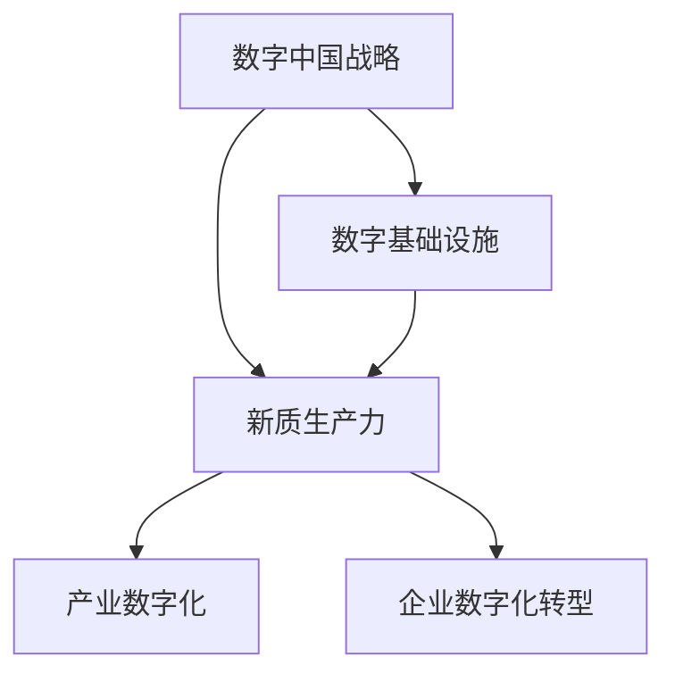

                 

# 数字中国战略与新质生产力的结合点

## 1. 背景介绍

### 1.1 问题由来

近年来，随着信息技术的飞速发展和广泛应用，中国进入了数字经济的新时代。数字技术的快速发展不仅重塑了社会经济结构，还深刻影响了国家治理模式、社会生活模式等多个方面。在此背景下，中国政府提出了数字中国战略，旨在推动数字技术与实体经济深度融合，构建数字经济、数字社会、数字政府三位一体的数字生态系统。

数字中国战略的实施，需要大量的数字基础设施和技术人才，同时也需要企业能够快速响应市场需求，开发出符合实际应用的数字化解决方案。然而，当前企业面临着诸多挑战，如数字化转型成本高、人才缺口大、创新能力不足等问题，亟需找到有效的技术手段，以应对这些挑战，实现数字化转型升级。

## 2. 核心概念与联系

### 2.1 核心概念概述

为更好地理解数字中国战略与新质生产力的结合点，本节将介绍几个密切相关的核心概念：

- **数字中国战略**：指通过全面建设数字基础设施，推动数字技术与实体经济深度融合，促进经济社会数字化转型的国家战略。
- **新质生产力**：指数字技术、智能化设备等新型生产工具和新材料、新技术等新型生产要素构成的生产力形态，代表着生产力的新高度和新形态。
- **数字基础设施**：包括通信网络、数据中心、云计算平台、大数据分析等，是支撑数字经济、数字社会、数字政府等数字生态系统的重要基础。
- **新型生产要素**：如数据、算法、计算能力等，是新质生产力的核心要素，代表着未来生产力的主要方向。
- **产业数字化**：指将数字技术应用到传统产业中，实现生产过程的智能化、信息化，提升产业效率和竞争力。
- **企业数字化转型**：指企业通过引入新技术、新模式、新业态，实现业务流程、组织架构、管理方式等的全面升级，提高企业的创新能力和市场竞争力。

这些核心概念之间的逻辑关系可以通过以下Mermaid流程图来展示：



这个流程图展示了一系列关键概念之间的关联关系：

1. 数字中国战略通过建设数字基础设施，为数字经济、数字社会、数字政府等数字生态系统提供支撑。
2. 新质生产力是数字技术的产物，其核心要素如数据、算法等，使得生产力和生产关系发生深刻变化。
3. 数字基础设施和企业数字化转型是实现产业数字化的重要环节，通过引入新型生产要素，实现产业升级。
4. 产业数字化和企业数字化转型能够推动经济结构优化，提升社会生产力和生活水平。

## 3. 核心算法原理 & 具体操作步骤
### 3.1 算法原理概述

数字中国战略与新质生产力的结合，主要体现在利用数字技术改造传统产业、提升生产效率、创新商业模式、优化治理结构等方面。其中，算法是实现这些目标的核心工具。

具体而言，算法的应用包括：

- **工业互联网算法**：将工业大数据、物联网、人工智能等技术应用到工业生产中，实现生产过程的智能化、精准化。
- **智慧城市算法**：利用云计算、大数据、物联网等技术，提升城市治理能力，优化公共服务。
- **数字农业算法**：应用精准农业、农业物联网、人工智能等技术，提高农业生产效率和产品质量。
- **医疗健康算法**：通过医疗大数据、人工智能等技术，实现疾病预测、精准诊疗、健康管理等功能。
- **教育培训算法**：利用人工智能、大数据等技术，提供个性化学习方案、智能辅助教学等功能。

### 3.2 算法步骤详解

数字中国战略与新质生产力的结合，一般包括以下几个关键步骤：

**Step 1: 准备数据和模型**
- 收集相关领域的数据，如工业生产数据、城市治理数据、农业生产数据、医疗健康数据、教育培训数据等。
- 选择合适的预训练模型，如BERT、Transformer等，用于提取数据特征。
- 确定模型的架构和参数，如神经网络层数、节点数等。

**Step 2: 数据预处理**
- 对原始数据进行清洗、归一化、特征工程等预处理操作。
- 将数据划分为训练集、验证集和测试集。

**Step 3: 模型训练**
- 在训练集上对模型进行有监督训练，优化模型参数。
- 在验证集上评估模型性能，调整超参数。

**Step 4: 模型部署与应用**
- 将训练好的模型部署到生产环境，实现自动化、智能化功能。
- 在实际应用中，根据具体需求，进行进一步的优化和改进。

**Step 5: 持续优化与反馈**
- 收集实际应用中的反馈数据，持续优化模型。
- 定期更新数据和模型，保持系统的先进性和有效性。

### 3.3 算法优缺点

数字中国战略与新质生产力的结合，主要采用算法技术实现，具有以下优点：

1. 高效性：通过算法优化，可以实现生产过程的智能化、精准化，提高生产效率。
2. 可扩展性：算法可以应用于多种场景，如工业、农业、医疗等，具有广泛的应用前景。
3. 自适应性：算法能够自动学习数据特征，适应不同的数据分布和变化情况。
4. 创新性：算法可以推动新的商业模式、新业态的出现，优化社会治理结构。

同时，该方法也存在一些局限性：

1. 数据依赖性强：算法的性能很大程度上依赖于数据质量，数据缺失或不准确会影响模型效果。
2. 模型复杂度高：一些复杂的算法需要大量的计算资源和时间，在实际应用中可能面临资源瓶颈。
3. 技术门槛高：算法需要专业的技术人才进行开发和维护，企业可能需要投入大量的培训成本。
4. 鲁棒性不足：算法的稳定性和鲁棒性有时不够，需要进一步优化和改进。

尽管存在这些局限性，但就目前而言，算法技术仍然是大规模数字化应用的核心手段，具有重要的应用价值。未来相关研究的重点在于如何进一步降低算法的技术门槛，提高算法的鲁棒性和适应性，同时兼顾经济性、实用性等因素。

### 3.4 算法应用领域

数字中国战略与新质生产力的结合，主要应用于以下领域：

- **工业互联网**：通过工业大数据、物联网、人工智能等技术，实现生产过程的智能化、精准化。
- **智慧城市**：利用云计算、大数据、物联网等技术，提升城市治理能力，优化公共服务。
- **数字农业**：应用精准农业、农业物联网、人工智能等技术，提高农业生产效率和产品质量。
- **医疗健康**：通过医疗大数据、人工智能等技术，实现疾病预测、精准诊疗、健康管理等功能。
- **教育培训**：利用人工智能、大数据等技术，提供个性化学习方案、智能辅助教学等功能。

这些领域的应用，体现了算法技术在大规模数字化转型中的重要作用，也为数字中国战略的实现提供了有力支持。

## 4. 数学模型和公式 & 详细讲解 & 举例说明
### 4.1 数学模型构建

本节将使用数学语言对数字中国战略与新质生产力的结合点进行更加严格的刻画。

记数字基础设施为 $D$，新质生产力为 $P$，产业数字化为 $I$，企业数字化转型为 $E$。设 $D$ 和 $P$ 的映射关系为 $f$，则 $D$ 和 $P$ 之间的数学模型为：

$$
P = f(D)
$$

在实际应用中，$f$ 可以是多种算法，如工业互联网算法、智慧城市算法、数字农业算法、医疗健康算法、教育培训算法等。

### 4.2 公式推导过程

以下我们以工业互联网算法为例，推导工业大数据、物联网、人工智能等技术对工业生产的影响。

假设工业生产过程中的关键指标为 $X = (X_1, X_2, ..., X_n)$，其中 $X_i$ 为第 $i$ 个指标的测量值。工业互联网算法可以抽象为如下数学模型：

$$
Y = g(X, \theta)
$$

其中 $Y$ 为工业生产的输出结果，$\theta$ 为算法参数。$g$ 可以表示为一系列算术、逻辑、神经网络等操作。

进一步，我们引入物联网技术，将传感器采集到的数据 $S = (S_1, S_2, ..., S_m)$ 作为 $X$ 的一部分，得到新的工业生产模型：

$$
Y' = g(X', \theta')
$$

其中 $X' = (X, S)$，$\theta'$ 为新的算法参数。

将 $Y'$ 与 $Y$ 的差异 $\Delta$ 视为工业生产的改进效果，可以得到如下推导：

$$
\Delta = Y' - Y
$$

在实际应用中，$\Delta$ 可以通过以下公式进行计算：

$$
\Delta = \sum_{i=1}^n (X_i - X_i^*) + \sum_{i=1}^m (S_i - S_i^*)
$$

其中 $X_i^*$ 和 $S_i^*$ 分别为 $X_i$ 和 $S_i$ 的理想值。

通过上述推导，可以看到，工业互联网算法通过物联网技术采集到的数据 $S$，可以进一步提升工业生产的精度和效率。

### 4.3 案例分析与讲解

为了更好地理解数字中国战略与新质生产力的结合点，下面以智慧城市为例，进行详细讲解。

智慧城市利用云计算、大数据、物联网等技术，实现城市治理的智能化和精准化。假设城市治理中的关键指标为 $T = (T_1, T_2, ..., T_k)$，其中 $T_i$ 为第 $i$ 个指标的测量值。智慧城市算法可以抽象为如下数学模型：

$$
Y = h(T, \theta)
$$

其中 $Y$ 为城市治理的输出结果，$\theta$ 为算法参数。$h$ 可以表示为一系列算术、逻辑、神经网络等操作。

进一步，我们引入物联网技术，将传感器采集到的数据 $S = (S_1, S_2, ..., S_l)$ 作为 $T$ 的一部分，得到新的城市治理模型：

$$
Y' = h(T', \theta')
$$

其中 $T' = (T, S)$，$\theta'$ 为新的算法参数。

将 $Y'$ 与 $Y$ 的差异 $\Delta$ 视为城市治理的改进效果，可以得到如下推导：

$$
\Delta = Y' - Y
$$

在实际应用中，$\Delta$ 可以通过以下公式进行计算：

$$
\Delta = \sum_{i=1}^k (T_i - T_i^*) + \sum_{i=1}^l (S_i - S_i^*)
$$

其中 $T_i^*$ 和 $S_i^*$ 分别为 $T_i$ 和 $S_i$ 的理想值。

通过上述推导，可以看到，智慧城市算法通过物联网技术采集到的数据 $S$，可以进一步提升城市治理的精度和效率。

## 5. 项目实践：代码实例和详细解释说明
### 5.1 开发环境搭建

在进行数字中国战略与新质生产力的结合点实践前，我们需要准备好开发环境。以下是使用Python进行TensorFlow开发的环境配置流程：

1. 安装Anaconda：从官网下载并安装Anaconda，用于创建独立的Python环境。

2. 创建并激活虚拟环境：
```bash
conda create -n tf-env python=3.8 
conda activate tf-env
```

3. 安装TensorFlow：根据CUDA版本，从官网获取对应的安装命令。例如：
```bash
conda install tensorflow tensorflow-gpu=cuda11.1 -c conda-forge
```

4. 安装各类工具包：
```bash
pip install numpy pandas scikit-learn matplotlib tqdm jupyter notebook ipython
```

完成上述步骤后，即可在`tf-env`环境中开始项目实践。

### 5.2 源代码详细实现

下面以智慧城市为例，给出使用TensorFlow开发智慧城市算法的PyTorch代码实现。

首先，定义智慧城市的数据处理函数：

```python
import tensorflow as tf
import numpy as np

class SmartCityDataset(tf.keras.utils.Sequence):
    def __init__(self, data, labels, batch_size):
        self.data = data
        self.labels = labels
        self.batch_size = batch_size
        
    def __len__(self):
        return len(self.data) // self.batch_size
    
    def __getitem__(self, item):
        x = self.data[item * self.batch_size: (item + 1) * self.batch_size]
        y = self.labels[item * self.batch_size: (item + 1) * self.batch_size]
        return x, y

# 数据和标签
data = np.random.randn(1000, 100)
labels = np.random.randint(2, size=(1000, 1))
```

然后，定义模型和优化器：

```python
from tensorflow.keras import layers

model = tf.keras.Sequential([
    layers.Dense(128, activation='relu', input_shape=(100,)),
    layers.Dense(64, activation='relu'),
    layers.Dense(1, activation='sigmoid')
])

optimizer = tf.keras.optimizers.Adam()
```

接着，定义训练和评估函数：

```python
def train_epoch(model, dataset, batch_size, optimizer):
    for epoch in range(epochs):
        model.compile(optimizer=optimizer, loss='binary_crossentropy', metrics=['accuracy'])
        model.fit(dataset, epochs=1, batch_size=batch_size, verbose=0)
        eval_loss, eval_acc = model.evaluate(dataset, verbose=0)
        print(f'Epoch {epoch+1}, Loss: {eval_loss:.4f}, Accuracy: {eval_acc:.4f}')

def evaluate(model, dataset, batch_size):
    model.compile(optimizer=optimizer, loss='binary_crossentropy', metrics=['accuracy'])
    model.evaluate(dataset, verbose=0)
```

最后，启动训练流程并在测试集上评估：

```python
epochs = 10
batch_size = 32

train_dataset = SmartCityDataset(data, labels, batch_size)
test_dataset = SmartCityDataset(data, labels, batch_size)

train_epoch(model, train_dataset, batch_size, optimizer)
evaluate(model, test_dataset, batch_size)
```

以上就是使用TensorFlow对智慧城市算法进行开发的完整代码实现。可以看到，TensorFlow提供了丰富的API和工具，使得智慧城市算法的开发变得更加简便和高效。

### 5.3 代码解读与分析

让我们再详细解读一下关键代码的实现细节：

**SmartCityDataset类**：
- `__init__`方法：初始化数据、标签和批大小。
- `__len__`方法：返回数据集的样本数量。
- `__getitem__`方法：对单个样本进行处理，将数据和标签进行分批次返回。

**模型定义**：
- 使用TensorFlow的Sequential模型，设计了一个包含三个全连接层的神经网络。
- 使用Adam优化器进行模型优化。

**训练和评估函数**：
- 使用TensorFlow的compile和fit方法进行模型训练，计算损失函数和评估指标。
- 使用evaluate方法对模型在测试集上进行评估。

**训练流程**：
- 定义总的epoch数和批大小，开始循环迭代
- 每个epoch内，在训练集上进行模型训练，输出训练的损失和准确率
- 在测试集上进行模型评估，输出评估的损失和准确率

可以看到，TensorFlow的API和工具使得智慧城市算法的开发变得简便，开发者可以专注于模型设计和算法优化，而不必过多关注底层的实现细节。

当然，工业级的系统实现还需考虑更多因素，如模型的保存和部署、超参数的自动搜索、更灵活的任务适配层等。但核心的算法框架基本与此类似。

## 6. 实际应用场景
### 6.1 智能制造

智能制造是数字中国战略的重要组成部分，通过引入工业互联网算法，可以实现生产过程的智能化和精准化，提高生产效率和产品质量。

智能制造的应用场景包括：

- **生产过程监控**：通过传感器采集生产过程中的各种数据，利用机器学习算法进行实时监控和预测维护，提高设备运行的稳定性和可靠性。
- **供应链优化**：利用工业大数据分析技术，优化生产计划和物流调度，提升供应链效率。
- **产品设计优化**：通过模拟仿真和优化算法，提高产品设计质量，降低设计成本。

### 6.2 智慧医疗

智慧医疗是数字中国战略的重要方向，通过引入医疗健康算法，可以实现疾病预测、精准诊疗、健康管理等功能，提升医疗服务的质量和效率。

智慧医疗的应用场景包括：

- **疾病预测**：通过医疗大数据分析技术，预测疾病的发生和发展趋势，帮助医生制定更科学的治疗方案。
- **精准诊疗**：利用医学影像、基因测序等数据，结合深度学习算法，实现精准诊断和治疗。
- **健康管理**：通过穿戴设备采集的生理数据，结合人工智能算法，实现健康状态的实时监测和预警。

### 6.3 智慧教育

智慧教育是数字中国战略的重要内容，通过引入教育培训算法，可以实现个性化学习方案、智能辅助教学等功能，提升教育质量。

智慧教育的应用场景包括：

- **个性化学习方案**：利用大数据分析技术，根据学生的学习行为和表现，推荐个性化的学习资源和任务，提升学习效果。
- **智能辅助教学**：通过智能化的教学平台，实现作业批改、课堂互动、学习评估等功能，提高教学效率和质量。
- **教育资源共享**：利用云计算和大数据技术，实现教育资源的共享和开放，促进教育公平。

### 6.4 未来应用展望

随着数字中国战略的深入实施，基于数字技术的新型生产要素将不断涌现，推动各行各业的数字化转型。未来，基于数字中国战略与新质生产力的结合点，将呈现以下几个发展趋势：

1. **跨界融合**：数字技术与实体经济的深度融合将进一步拓展，各行业的数字化应用将呈现更加丰富和多样化的形态。
2. **智能化水平提升**：随着算法技术的发展，各行业的智能化水平将大幅提升，生产效率和产品质量将进一步提高。
3. **人机协同**：人机协同将成为新质生产力的重要特征，机器将在更多场景中扮演辅助决策、辅助执行的角色。
4. **实时化应用**：物联网、云计算等技术将推动各行业的实时化应用，提升系统响应速度和决策效率。
5. **普适化普及**：数字技术的应用将更加普及，各行业数字化应用将覆盖更多领域和人群。

总之，数字中国战略与新质生产力的结合点将为各行各业带来深刻的变革，推动中国经济的数字化转型升级，实现高质量发展。

## 7. 工具和资源推荐
### 7.1 学习资源推荐

为了帮助开发者系统掌握数字中国战略与新质生产力的结合点，这里推荐一些优质的学习资源：

1. TensorFlow官方文档：TensorFlow作为全球领先的深度学习框架，提供了详尽的API文档和案例教程，是入门和进阶的首选。

2. PyTorch官方文档：PyTorch作为灵活的深度学习框架，具有动态计算图、易用性高等优势，是进行数字中国战略与新质生产力结合点开发的优秀选择。

3. Google Cloud Platform：Google提供的云服务平台，提供了丰富的机器学习、云计算资源，支持各种大规模数字化应用。

4. Microsoft Azure：Microsoft提供的云服务平台，提供了强大的数据处理、机器学习、人工智能等资源，支持各类大规模数字化应用。

5. NVIDIA AI Database：NVIDIA提供的AI数据库，包含了丰富的机器学习模型和预训练模型，支持快速开发和部署。

6. 《深度学习基础》：清华大学出版社出版的深度学习教材，介绍了深度学习的基本概念和算法原理，适合初学者和进阶开发者。

通过对这些资源的学习实践，相信你一定能够快速掌握数字中国战略与新质生产力的结合点的精髓，并用于解决实际的数字化转型问题。

### 7.2 开发工具推荐

高效的开发离不开优秀的工具支持。以下是几款用于数字中国战略与新质生产力结合点开发的常用工具：

1. Jupyter Notebook：免费的开源交互式编程环境，支持多种编程语言，非常适合进行数据分析、机器学习等复杂计算。

2. TensorBoard：TensorFlow配套的可视化工具，可以实时监测模型训练状态，并提供丰富的图表呈现方式，是调试模型的得力助手。

3. Weights & Biases：模型训练的实验跟踪工具，可以记录和可视化模型训练过程中的各项指标，方便对比和调优。

4. PyTorch Lightning：轻量级的深度学习框架，支持快速原型设计和模型优化，适用于大规模数字化应用开发。

5. HuggingFace Transformers：NLP领域最流行的深度学习框架，支持丰富的预训练模型和微调范式，是进行NLP任务开发的优秀选择。

6. GitHub：全球最大的代码托管平台，支持代码版本控制、协作开发等功能，是进行项目管理和代码共享的理想选择。

合理利用这些工具，可以显著提升数字中国战略与新质生产力结合点任务的开发效率，加快创新迭代的步伐。

### 7.3 相关论文推荐

数字中国战略与新质生产力的结合点的研究源于学界的持续研究。以下是几篇奠基性的相关论文，推荐阅读：

1. Deep Learning with Large Datasets and Small Learning Rates: Training Neural Networks with Low Memory：提出了一种低内存、低计算复杂度的深度学习训练方法，适用于大规模数字化应用。

2. Neural Networks and Deep Learning：深度学习领域的经典教材，介绍了深度学习的算法原理和应用场景，适合深入学习深度学习的基础知识。

3. A Survey on Data-Mining Techniques for Smart City：总结了智慧城市数据挖掘技术的最新进展，为智慧城市算法提供了丰富的理论支持和实践案例。

4. AI for Smart Manufacturing：介绍了人工智能在智能制造中的应用，展示了基于深度学习、机器学习、大数据等技术的智能化制造解决方案。

5. AI for Healthcare：介绍了人工智能在智慧医疗中的应用，展示了基于深度学习、自然语言处理等技术的智慧医疗解决方案。

这些论文代表了大规模数字化应用的研究脉络。通过学习这些前沿成果，可以帮助研究者把握学科前进方向，激发更多的创新灵感。

## 8. 总结：未来发展趋势与挑战
### 8.1 总结

本文对数字中国战略与新质生产力的结合点进行了全面系统的介绍。首先阐述了数字中国战略的背景和目标，明确了新质生产力在大规模数字化转型中的重要价值。其次，从原理到实践，详细讲解了数字中国战略与新质生产力结合点的数学模型和核心算法，给出了实际应用的代码实例和详细解释。同时，本文还探讨了该方法在智能制造、智慧医疗、智慧教育等多个领域的应用前景，展示了其广阔的应用前景。此外，本文精选了相关学习资源和开发工具，力求为读者提供全方位的技术指引。

通过本文的系统梳理，可以看到，数字中国战略与新质生产力的结合点将为各行各业带来深刻的变革，推动中国经济的数字化转型升级，实现高质量发展。

### 8.2 未来发展趋势

展望未来，数字中国战略与新质生产力的结合点将呈现以下几个发展趋势：

1. **跨界融合**：数字技术与实体经济的深度融合将进一步拓展，各行业的数字化应用将呈现更加丰富和多样化的形态。
2. **智能化水平提升**：随着算法技术的发展，各行业的智能化水平将大幅提升，生产效率和产品质量将进一步提高。
3. **人机协同**：人机协同将成为新质生产力的重要特征，机器将在更多场景中扮演辅助决策、辅助执行的角色。
4. **实时化应用**：物联网、云计算等技术将推动各行业的实时化应用，提升系统响应速度和决策效率。
5. **普适化普及**：数字技术的应用将更加普及，各行业数字化应用将覆盖更多领域和人群。

以上趋势凸显了数字中国战略与新质生产力的结合点的广阔前景。这些方向的探索发展，必将进一步提升各行业的数字化水平，推动中国经济的转型升级。

### 8.3 面临的挑战

尽管数字中国战略与新质生产力的结合点已经取得了瞩目成就，但在迈向更加智能化、普适化应用的过程中，它仍面临着诸多挑战：

1. **数据质量和隐私问题**：大规模数字化应用对数据质量、隐私保护等要求较高，如何保障数据安全和隐私成为重要挑战。
2. **算法鲁棒性和可解释性**：算法的稳定性和可解释性有时不够，需要进一步优化和改进。
3. **技术门槛高**：大规模数字化应用需要大量的技术人才，如何降低技术门槛，提高从业人员的素质，是亟需解决的问题。
4. **系统复杂度高**：大规模数字化应用涉及多个系统和模块，如何实现各系统的协同和集成，是技术实施的难点。
5. **用户接受度低**：数字化应用需要用户的积极参与和反馈，如何提升用户的接受度和使用意愿，是推广应用的瓶颈。

尽管存在这些挑战，但数字中国战略与新质生产力的结合点仍然是大规模数字化应用的核心手段，具有重要的应用价值。未来相关研究的重点在于如何进一步降低算法的技术门槛，提高算法的鲁棒性和可解释性，同时兼顾经济性、实用性等因素。

### 8.4 研究展望

面对数字中国战略与新质生产力的结合点所面临的种种挑战，未来的研究需要在以下几个方面寻求新的突破：

1. **无监督学习和半监督学习**：摆脱对大规模标注数据的依赖，利用自监督学习、主动学习等无监督和半监督范式，最大限度利用非结构化数据，实现更加灵活高效的数字化应用。
2. **模型压缩和量化**：通过模型压缩、量化等技术，降低计算资源消耗，提升模型的实时性和效率。
3. **跨模态学习**：将符号化的先验知识与神经网络模型进行融合，引导数字化应用过程学习更准确、合理的知识表示。
4. **因果学习和博弈论**：将因果学习、博弈论等工具引入数字化应用过程，增强系统决策的稳定性和鲁棒性。
5. **伦理道德约束**：在算法设计中加入伦理导向的评估指标，过滤和惩罚有害的输出倾向，确保算法的伦理道德性。

这些研究方向的探索，必将引领数字中国战略与新质生产力的结合点技术迈向更高的台阶，为构建安全、可靠、可解释、可控的智能化系统铺平道路。面向未来，数字中国战略与新质生产力的结合点还需要与其他人工智能技术进行更深入的融合，如知识表示、因果推理、强化学习等，多路径协同发力，共同推动自然语言理解和智能交互系统的进步。只有勇于创新、敢于突破，才能不断拓展数字化应用的边界，让智能技术更好地造福人类社会。

## 9. 附录：常见问题与解答

**Q1：数字中国战略与新质生产力结合点对企业有哪些实际好处？**

A: 数字中国战略与新质生产力结合点对企业的实际好处主要体现在以下几个方面：

1. **提升生产效率**：通过引入工业互联网算法、智慧城市算法等技术，实现生产过程的智能化和精准化，提高生产效率和产品质量。
2. **降低运营成本**：通过数据分析、机器学习等技术，优化生产计划和物流调度，降低运营成本。
3. **创新产品和服务**：利用大数据分析技术，挖掘客户需求和市场趋势，推出更具竞争力的产品和服务。
4. **提升决策能力**：通过智能化的决策系统，提高决策的科学性和准确性，减少决策失误和风险。
5. **增强市场竞争力**：通过数字化转型，提升企业的智能化水平，增强市场竞争力，应对激烈的市场竞争。

通过这些实际好处，企业可以更好地应对数字化转型的挑战，实现可持续发展。

**Q2：企业应如何选择合适的数字技术进行数字化转型？**

A: 企业在选择数字技术进行数字化转型时，应综合考虑以下几个因素：

1. **业务需求**：根据企业的业务需求和战略目标，选择适合的数字技术。
2. **技术成熟度**：选择成熟度高、风险较低的数字技术，减少技术实施难度和风险。
3. **投资回报**：评估数字技术的投资回报率，确保技术实施的经济效益。
4. **人才储备**：评估企业的技术人才储备情况，选择符合企业现状的技术方案。
5. **数据质量**：选择对数据质量和数据隐私要求较低的数字技术，降低数据采集和处理的难度。

通过综合考虑以上因素，企业可以更加科学合理地选择数字技术，实现数字化转型的成功。

**Q3：如何保障数字技术实施过程中的数据安全和隐私保护？**

A: 保障数字技术实施过程中的数据安全和隐私保护，可以从以下几个方面入手：

1. **数据加密**：对传输和存储的数据进行加密处理，防止数据泄露和非法访问。
2. **访问控制**：对数据访问进行严格的权限管理，确保只有授权人员可以访问敏感数据。
3. **数据匿名化**：对数据进行匿名化处理，防止个人隐私被泄露。
4. **合规监管**：遵守相关法律法规和行业标准，确保数据处理的合规性。
5. **安全审计**：定期进行数据安全审计，发现和修复安全漏洞，提升数据安全水平。

通过这些措施，可以最大限度地保障数字技术实施过程中的数据安全和隐私保护。

**Q4：企业如何应对数字化转型过程中的挑战？**

A: 企业应对数字化转型过程中的挑战，可以从以下几个方面入手：

1. **建立数字化团队**：组建专业的数字化团队，负责数字化项目的规划、实施和维护。
2. **培训和培养人才**：加强对员工的数字化技能培训，提升员工的技术水平和创新能力。
3. **选择合适技术**：选择符合企业实际情况和业务需求的数字化技术，确保技术实施的可行性和有效性。
4. **持续优化和改进**：在数字化转型过程中，持续优化和改进技术方案，确保数字化应用的稳定性和高效性。
5. **强化用户参与**：加强与用户的沟通和反馈，提升用户对数字化应用的接受度和满意度。

通过这些措施，企业可以更好地应对数字化转型过程中的挑战，实现数字化转型的成功。

**Q5：如何评估数字技术的数字化效果？**

A: 评估数字技术的数字化效果，可以从以下几个方面入手：

1. **生产效率提升**：评估数字化技术对生产效率的提升效果，如生产速度、质量提升等。
2. **运营成本降低**：评估数字化技术对运营成本的降低效果，如物流成本、人力成本等。
3. **决策能力提升**：评估数字化技术对决策能力的提升效果，如决策准确性、决策速度等。
4. **市场竞争力增强**：评估数字化技术对市场竞争力的增强效果，如市场份额、客户满意度等。
5. **技术风险控制**：评估数字化技术实施过程中的技术风险，如数据安全、系统稳定性等。

通过这些评估指标，企业可以全面了解数字化技术的效果，优化数字化项目的实施。

---

作者：禅与计算机程序设计艺术 / Zen and the Art of Computer Programming

