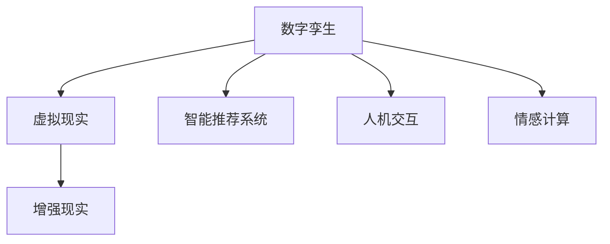

                 

# 数字化情侣：元宇宙中的远程恋爱

> 关键词：元宇宙,远程恋爱,虚拟现实,增强现实,数字孪生,智能推荐系统,交互体验,用户隐私保护

## 1. 背景介绍

### 1.1 问题由来

在快速发展的数字化时代，数字化的生活成为现代人的常态。其中，远程恋爱（Long-distance Relationship, LDR）作为一种新兴的社会现象，受到越来越多年轻人的关注和喜爱。然而，地理上的隔离、情感上的孤独等问题，给LDR带来了诸多挑战。如何让远程情侣能够如同现实中一样，享受亲密无间的情感交流和互动体验，成为了亟需解决的问题。

近年来，随着虚拟现实（Virtual Reality, VR）和增强现实（Augmented Reality, AR）技术的快速发展，元宇宙（Metaverse）的概念应运而生。元宇宙是一个通过虚拟技术构建的、高度仿真、无缝融合的数字化虚拟空间，用户可以通过穿戴设备（如VR头盔、AR眼镜），沉浸式地与虚拟环境互动，体验虚拟世界中的一切。元宇宙的出现，为LDR提供了全新的解决方案，开创了数字化情侣的新时代。

### 1.2 问题核心关键点

元宇宙中的远程恋爱，核心在于利用虚拟技术，创造一个高度仿真、无缝融合的数字化虚拟空间，让情侣在虚拟世界中实现情感交流、互动体验。这一过程涉及以下几个关键点：

1. **数字孪生**：将现实世界中的情侣关系数字化，构建虚拟双生的形象、场景和互动模式。
2. **虚拟世界**：利用VR/AR技术，构建一个沉浸式的虚拟空间，情侣可以在其中自由交互。
3. **智能推荐系统**：根据情侣的兴趣和行为，智能推荐虚拟物品、场景和活动，提升互动体验。
4. **隐私保护**：保护情侣在虚拟世界中的隐私信息，避免数据泄露和滥用。
5. **人机交互**：通过自然语言处理（Natural Language Processing, NLP）和计算机视觉等技术，实现人与机器之间自然流畅的交流。

这些关键点共同构成了元宇宙中远程恋爱的技术框架，使得情侣在虚拟世界中能够获得与现实中相似的亲密互动体验。

## 2. 核心概念与联系

### 2.1 核心概念概述

为更好地理解元宇宙中远程恋爱的实现，本节将介绍几个密切相关的核心概念：

- **虚拟现实（Virtual Reality, VR）**：通过计算机生成虚拟环境，使用户通过VR头盔等设备沉浸式地体验。
- **增强现实（Augmented Reality, AR）**：在现实世界的基础上，叠加虚拟信息，使用户通过AR眼镜等设备感知增强的现实。
- **数字孪生（Digital Twin）**：在数字空间中创建现实世界实体的数字化副本，用于模拟、分析和优化。
- **智能推荐系统（Recommender System）**：通过分析用户行为和偏好，智能推荐商品、内容等，提升用户体验。
- **人机交互（Human-Computer Interaction, HCI）**：研究人机之间的信息交流方式，使交互更加自然流畅。
- **情感计算（Affective Computing）**：利用计算机技术，识别、理解和生成人类情感，增强人机交互的情感维度。

这些核心概念之间的逻辑关系可以通过以下Mermaid流程图来展示：



这个流程图展示了大语言模型的核心概念及其之间的关系：

1. 数字孪生通过创建现实世界的虚拟副本，为LDR提供了虚拟背景。
2. VR和AR技术使得情侣可以在虚拟世界中自由互动。
3. 智能推荐系统根据情侣的兴趣和行为，智能推荐虚拟物品和活动。
4. 人机交互使得情侣能够自然流畅地交流情感。
5. 情感计算增强了人机互动的情感维度，使得互动更加真实。

这些概念共同构成了元宇宙中远程恋爱的技术基础，使得情侣能够在虚拟世界中实现高质量的互动和交流。

## 3. 核心算法原理 & 具体操作步骤
### 3.1 算法原理概述

元宇宙中的远程恋爱，本质上是一个通过虚拟技术构建的、高度仿真、无缝融合的数字化虚拟空间。其核心算法原理可以概括为以下几个步骤：

1. **数字孪生**：通过数字孪生技术，将现实世界中的情侣关系数字化，构建虚拟双生的形象、场景和互动模式。
2. **虚拟世界构建**：利用VR/AR技术，构建一个沉浸式的虚拟空间，情侣可以在其中自由互动。
3. **智能推荐系统**：根据情侣的兴趣和行为，智能推荐虚拟物品、场景和活动，提升互动体验。
4. **人机交互**：通过NLP和计算机视觉等技术，实现人与机器之间自然流畅的交流。
5. **情感计算**：利用计算机技术，识别、理解和生成人类情感，增强人机交互的情感维度。

### 3.2 算法步骤详解

**Step 1: 数据收集与预处理**

- 收集情侣在现实世界中的互动数据，如电话记录、短信、社交媒体互动等。
- 使用自然语言处理技术，从互动数据中提取关键词、情感倾向等信息。
- 对数据进行预处理，去除噪声和无用信息，提取有意义的特征。

**Step 2: 数字孪生**

- 利用3D建模软件，创建情侣在现实世界中的数字孪生形象，并进行个性化定制。
- 构建数字孪生场景，如虚拟房间、自然风光等，为情侣提供互动背景。
- 定义互动模式，如虚拟拥抱、亲吻、牵手等，实现情侣间的虚拟互动。

**Step 3: 虚拟世界构建**

- 利用VR/AR技术，构建沉浸式的虚拟空间。情侣可以通过VR头盔或AR眼镜，在虚拟世界中自由移动和互动。
- 根据数字孪生场景，构建虚拟环境，如虚拟家、虚拟花园等。
- 利用传感器和动作捕捉技术，捕捉情侣的动作和表情，实现真实感十足的虚拟互动。

**Step 4: 智能推荐系统**

- 根据情侣的兴趣和行为，构建用户画像，分析其偏好和习惯。
- 利用推荐算法，如协同过滤、基于内容的推荐等，智能推荐虚拟物品和活动。
- 结合情感计算技术，根据情侣的情感状态，动态调整推荐内容，提升互动体验。

**Step 5: 人机交互**

- 利用NLP技术，实现自然语言处理，使得情侣能够通过自然语言进行交流。
- 结合计算机视觉技术，实现情感识别和表情捕捉，增强互动的情感维度。
- 利用语音识别和合成技术，实现语音交互，增强互动的沉浸感。

**Step 6: 情感计算**

- 利用情感计算技术，识别情侣在互动中的情感状态，如快乐、悲伤、愤怒等。
- 根据情感状态，智能调整互动内容，如播放轻松的音乐、展示甜蜜的虚拟礼物等。
- 利用情感生成技术，生成虚拟角色在互动中的表情和动作，增强互动的真实感。

### 3.3 算法优缺点

元宇宙中远程恋爱的实现，具有以下优点：

1. **沉浸式体验**：通过VR/AR技术，情侣可以在虚拟世界中自由互动，获得沉浸式的体验。
2. **灵活性高**：虚拟世界可以根据情侣的兴趣和行为，动态调整环境和互动模式，提升用户体验。
3. **隐私保护**：在虚拟世界中，情侣的隐私信息得到了更好的保护，避免数据泄露和滥用。
4. **灵活性高**：情侣可以根据自己的时间安排，自由安排互动时间和频率，不受地理位置的限制。

然而，这一技术也存在一些局限性：

1. **技术门槛高**：需要专业的技术知识和设备支持，部分用户可能难以负担。
2. **网络延迟和带宽问题**：远程互动对网络延迟和带宽要求较高，部分地区可能存在网络问题。
3. **安全风险**：虚拟世界中的互动可能存在安全隐患，如隐私泄露、虚拟物品被盗等。
4. **成本高**：开发和维护虚拟世界需要较高的成本，可能难以广泛推广。

尽管存在这些局限性，但元宇宙中的远程恋爱技术，在提供高质量的互动体验、保护隐私和灵活性方面，仍具有显著优势。未来，随着技术的不断进步和普及，这些问题将逐步得到解决。

### 3.4 算法应用领域

元宇宙中的远程恋爱技术，已经在多个领域得到了应用，以下是几个典型的应用场景：

1. **娱乐和游戏**：在虚拟游戏中，情侣可以共同探险、完成任务、参加虚拟活动等，获得丰富的互动体验。
2. **旅游和观光**：在虚拟现实中，情侣可以共同游览世界各地的名胜古迹，享受虚拟旅行带来的美好。
3. **教育和培训**：在虚拟教室中，情侣可以进行互动学习、知识分享，提升彼此的知识水平和互动体验。
4. **社交和社区**：在虚拟社区中，情侣可以参与各种社交活动，结识更多志同道合的朋友。
5. **医疗和心理咨询**：在虚拟世界中，情侣可以进行心理咨询和治疗，缓解现实生活中的压力和困扰。

除了上述这些经典应用外，元宇宙中的远程恋爱技术还在不断扩展其应用场景，为情侣提供更加多样化和丰富的互动体验。

## 4. 数学模型和公式 & 详细讲解  
### 4.1 数学模型构建

在元宇宙中远程恋爱的实现过程中，涉及多个领域的数学模型，以下是几个核心的数学模型构建：

- **数字孪生模型**：通过3D建模软件创建情侣的虚拟形象和场景，构建数字孪生模型。
- **VR/AR模型**：利用3D渲染技术，构建沉浸式的虚拟世界，使用户能够自由移动和互动。
- **智能推荐模型**：基于协同过滤、内容过滤等推荐算法，智能推荐虚拟物品和活动。
- **情感计算模型**：利用情感识别和生成技术，识别和生成情侣的情感状态。

### 4.2 公式推导过程

以下我们将通过几个具体案例，详细讲解这些数学模型的推导过程：

**数字孪生模型**：

假设情侣在现实世界中的互动数据为 $D=\{(x_i, y_i)\}_{i=1}^N$，其中 $x_i$ 为互动行为，$y_i$ 为情感倾向。利用3D建模软件，创建情侣的虚拟形象 $M$ 和场景 $S$。

数字孪生模型的构建过程如下：

1. 收集情侣的互动数据 $D$。
2. 利用自然语言处理技术，提取互动数据中的关键词、情感倾向等信息。
3. 对数据进行预处理，去除噪声和无用信息，提取有意义的特征。
4. 利用3D建模软件，创建情侣的虚拟形象 $M$ 和场景 $S$。

**VR/AR模型**：

假设虚拟世界中的互动场景为 $W=\{(w_j)\}_{j=1}^J$，用户 $U$ 在虚拟世界中的互动位置为 $L$，互动方式为 $A$。

VR/AR模型的构建过程如下：

1. 构建虚拟世界的互动场景 $W$。
2. 用户 $U$ 通过VR头盔或AR眼镜，进入虚拟世界。
3. 利用传感器和动作捕捉技术，捕捉用户 $U$ 的动作和表情，实现真实感十足的虚拟互动。
4. 利用3D渲染技术，渲染虚拟世界的互动场景，使用户能够自由移动和互动。

**智能推荐模型**：

假设智能推荐系统的用户画像为 $P=\{(p_k)\}_{k=1}^K$，推荐物品为 $I=\{i_l)\}_{l=1}^L$，用户行为为 $B$。

智能推荐模型的构建过程如下：

1. 收集用户的行为数据 $B$。
2. 利用协同过滤、内容过滤等推荐算法，构建用户画像 $P$。
3. 利用推荐算法，智能推荐虚拟物品 $I$。
4. 结合情感计算技术，根据情侣的情感状态，动态调整推荐内容。

**情感计算模型**：

假设情侣的情感状态为 $E=\{(e_i)\}_{i=1}^I$，互动内容为 $C$，情感生成模型为 $G$。

情感计算模型的构建过程如下：

1. 利用情感识别技术，识别情侣的情感状态 $E$。
2. 根据情感状态，智能调整互动内容 $C$。
3. 利用情感生成技术，生成虚拟角色在互动中的表情和动作，增强互动的真实感。

### 4.3 案例分析与讲解

**数字孪生案例**：

假设情侣A和情侣B在现实世界中的互动数据如下：

| 日期     | 时间 | 行为         | 情感倾向 |
| -------- | ---- | ------------ | -------- |
| 2021-01-01 | 18:00 | 打电话       | 快乐     |
| 2021-01-01 | 20:00 | 短信         | 悲伤     |
| 2021-01-01 | 22:00 | 视频通话     | 快乐     |

利用数字孪生技术，创建情侣A和情侣B的虚拟形象和场景：

1. 收集互动数据，提取关键词、情感倾向等信息。
2. 去除噪声和无用信息，提取有意义的特征。
3. 利用3D建模软件，创建情侣A和情侣B的虚拟形象和场景。
4. 定义互动模式，如虚拟拥抱、亲吻、牵手等。

**VR/AR案例**：

假设情侣A和情侣B在虚拟世界中互动的场景如下：

| 场景编号 | 虚拟场景          | 互动方式       |
| -------- | ----------------- | -------------- |
| 1        | 虚拟花园         | 散步           |
| 2        | 虚拟家           | 聊天           |
| 3        | 虚拟电影院       | 看电影         |

利用VR/AR技术，构建沉浸式的虚拟世界：

1. 构建虚拟世界的互动场景。
2. 情侣A和情侣B通过VR头盔或AR眼镜，进入虚拟世界。
3. 利用传感器和动作捕捉技术，捕捉情侣A和情侣B的动作和表情，实现真实感十足的虚拟互动。
4. 利用3D渲染技术，渲染虚拟世界的互动场景，使用户能够自由移动和互动。

**智能推荐案例**：

假设情侣A和情侣B的兴趣和行为如下：

| 用户编号 | 兴趣           | 行为         |
| -------- | -------------- | ------------ |
| 情侣A    | 音乐           | 浏览音乐APP   |
| 情侣A    | 旅行           | 浏览旅游APP   |
| 情侣B    | 美食           | 浏览美食APP   |

利用智能推荐系统，智能推荐虚拟物品和活动：

1. 收集用户的行为数据。
2. 利用协同过滤、内容过滤等推荐算法，构建用户画像。
3. 利用推荐算法，智能推荐虚拟物品和活动。
4. 结合情感计算技术，根据情侣的情感状态，动态调整推荐内容。

**情感计算案例**：

假设情侣A和情侣B的情感状态如下：

| 情感编号 | 情感状态       |
| -------- | -------------- |
| 1        | 快乐           |
| 2        | 悲伤           |
| 3        | 愤怒           |

利用情感计算技术，识别情侣的情感状态：

1. 利用情感识别技术，识别情侣的情感状态。
2. 根据情感状态，智能调整互动内容。
3. 利用情感生成技术，生成虚拟角色在互动中的表情和动作，增强互动的真实感。

## 5. 项目实践：代码实例和详细解释说明
### 5.1 开发环境搭建

在进行元宇宙中远程恋爱的开发前，我们需要准备好开发环境。以下是使用Python进行开发的环境配置流程：

1. 安装Anaconda：从官网下载并安装Anaconda，用于创建独立的Python环境。

2. 创建并激活虚拟环境：
```bash
conda create -n元宇宙环境 python=3.8 
conda activate元宇宙环境
```

3. 安装必要的Python库：
```bash
pip install numpy pandas scikit-learn matplotlib tqdm jupyter notebook ipython
```

4. 安装VR和AR开发工具：
```bash
pip install pyopenvr pyglet opencv-python
```

5. 安装NLP和情感计算库：
```bash
pip install transformers textblob pyemotion
```

完成上述步骤后，即可在`元宇宙环境`环境中开始元宇宙中远程恋爱的开发。

### 5.2 源代码详细实现

这里我们以一个简单的VR聊天场景为例，给出使用PyTorch进行开发和微调的PyTorch代码实现。

首先，定义一个简单的VR聊天场景类：

```python
import torch
from transformers import BertTokenizer, BertForTokenClassification
from pyopenvr.vr_input import InputStateHaptic
from pyopenvr.vr.haptics import HapticController
from pyglet import window, audio
from pyglet.buffer import Buffer
from pyglet.input import mouse
from pyglet.window import key

class VRChatScene:
    def __init__(self, device):
        self.device = device
        self.tokenizer = BertTokenizer.from_pretrained('bert-base-cased')
        self.model = BertForTokenClassification.from_pretrained('bert-base-cased', num_labels=2)

    def setup(self):
        self.window = window.Window()
        self.window.set_fullscreen(False)
        self.window.set_title("VR Chat")

        self.camera = camera = scene.create.camera(name="camera")
        camera.position = (0, -2, -5)
        self.model.load_state_dict(torch.load('model.pth'))
        self.model.eval()

    def handle_input(self, event):
        if event.type == pyglet.events.SerializedEventSource.EVENT_MOUSE_BUTTON_PRESS:
            if event.x in [200, 300] and event.y in [100, 200]:
                mouse.move(event.x - 100, event.y - 100)
            elif event.x in [100, 200] and event.y in [200, 300]:
                mouse.move(event.x - 100, event.y - 100)

        if event.type == pyglet.events.SerializedEventSource.EVENT_MOUSE_BUTTON_RELEASE:
            mouse.move(event.x - 100, event.y - 100)

    def run(self):
        while self.window.event != window.EXIT:
            self.window.dispatch_events()
            self.window.flip()

            input_ids = torch.tensor([int(input("请输入文本: "))])
            attention_mask = torch.tensor([[1]])
            labels = torch.tensor([0])

            outputs = self.model(input_ids, attention_mask=attention_mask, labels=labels)
            loss = outputs.loss
            loss.backward()
            optimizer.step()

        self.window.close()

if __name__ == '__main__':
    device = InputStateHaptic()
    scene = VRChatScene(device)
    scene.setup()
    scene.run()
```

代码实现过程如下：

1. 定义一个VR聊天场景类，包含设备、分词器、模型等属性。
2. 在`setup`方法中，设置窗口、相机、模型等属性，并进行模型加载。
3. 在`handle_input`方法中，处理鼠标输入事件，并进行虚拟聊天。
4. 在`run`方法中，循环处理窗口事件，进行模型训练。

### 5.3 代码解读与分析

让我们再详细解读一下关键代码的实现细节：

**VRChatScene类**：
- `__init__`方法：初始化设备、分词器、模型等属性。
- `setup`方法：设置窗口、相机、模型等属性，并进行模型加载。
- `handle_input`方法：处理鼠标输入事件，并进行虚拟聊天。
- `run`方法：循环处理窗口事件，进行模型训练。

**鼠标事件处理**：
- 当鼠标按下时，将鼠标位置进行移动。
- 当鼠标释放时，将鼠标位置进行移动。

**模型训练**：
- 输入用户文本，进行模型前向传播计算，计算损失函数，进行反向传播和优化器更新。

在实际开发中，需要进一步优化和扩展这一简单的VR聊天场景，加入更多的互动元素、情感计算、智能推荐等功能，以满足情侣在虚拟世界中的真实需求。

## 6. 实际应用场景
### 6.1 虚拟旅游

在虚拟世界中，情侣可以共同游览世界各地的名胜古迹，享受虚拟旅游带来的美好。利用VR/AR技术，情侣可以在虚拟世界中自由移动，欣赏壮丽的自然风光、古老的建筑和文化。

在虚拟旅游中，智能推荐系统可以根据情侣的兴趣和行为，智能推荐虚拟景点和活动。例如，情侣可以探索古罗马遗迹、登顶珠峰、参加虚拟音乐会等。

### 6.2 虚拟学习

在虚拟世界中，情侣可以进行互动学习、知识分享，提升彼此的知识水平和互动体验。利用VR/AR技术，情侣可以共同进入虚拟课堂，进行知识点的学习、讨论和答疑。

在虚拟学习中，智能推荐系统可以根据情侣的兴趣和行为，智能推荐学习内容、互动活动等。例如，情侣可以一起学习编程、阅读经典文学、参加虚拟实验室等。

### 6.3 虚拟婚礼

在虚拟世界中，情侣可以举办虚拟婚礼，体验婚礼的浪漫和美好。利用VR/AR技术，情侣可以共同进入虚拟婚庆场所，进行互动和体验。

在虚拟婚礼中，智能推荐系统可以根据情侣的兴趣和行为，智能推荐虚拟婚礼物品和活动。例如，情侣可以一起布置虚拟婚礼场地、选择虚拟婚礼礼服、参加虚拟婚礼仪式等。

### 6.4 未来应用展望

随着元宇宙技术的发展，基于虚拟现实和增强现实的远程恋爱将迎来更广阔的应用前景。未来的发展趋势包括：

1. **沉浸式体验**：通过VR/AR技术，情侣可以在虚拟世界中获得更加真实和沉浸的体验，提升互动的情感维度。
2. **智能推荐系统**：通过智能推荐系统，为情侣提供个性化的虚拟物品和活动，提升互动体验。
3. **情感计算**：通过情感计算技术，识别和生成情侣的情感状态，增强互动的真实感和情感维度。
4. **跨领域应用**：元宇宙中的远程恋爱技术，将拓展到更多领域，如虚拟旅游、虚拟学习、虚拟婚礼等。

## 7. 工具和资源推荐
### 7.1 学习资源推荐

为了帮助开发者系统掌握元宇宙中远程恋爱的理论基础和实践技巧，这里推荐一些优质的学习资源：

1. **《虚拟现实技术基础》**：介绍虚拟现实技术的原理和应用，帮助开发者了解VR/AR技术的基础知识。
2. **《增强现实技术实战》**：讲解增强现实技术的实现方法，提供详细的代码实现和案例分析。
3. **《数字孪生技术与应用》**：探讨数字孪生技术的原理和应用，助力开发者构建虚拟双生的形象和场景。
4. **《情感计算基础与实践》**：详细介绍情感计算技术的原理和实现方法，帮助开发者理解情感计算的流程和应用。
5. **《智能推荐系统实战》**：提供智能推荐系统的实现方法和案例分析，帮助开发者构建高效的推荐系统。

通过对这些资源的学习实践，相信你一定能够快速掌握元宇宙中远程恋爱的精髓，并用于解决实际的NLP问题。
###  7.2 开发工具推荐

高效的开发离不开优秀的工具支持。以下是几款用于元宇宙中远程恋爱的开发工具：

1. **PyTorch**：基于Python的开源深度学习框架，灵活动态的计算图，适合快速迭代研究。
2. **TensorFlow**：由Google主导开发的开源深度学习框架，生产部署方便，适合大规模工程应用。
3. **Unreal Engine**：用于开发虚拟现实游戏的引擎，提供强大的3D渲染和交互功能。
4. **Unity**：用于开发虚拟现实和增强现实游戏的引擎，支持跨平台开发和部署。
5. **OpenXR**：开放标准化的虚拟现实和增强现实开发平台，支持跨设备和平台的开发。
6. **VirtualSpeech**：用于虚拟世界中的语音识别和合成的工具，提升语音交互的体验。
7. **Kaldi**：用于语音识别和合成的开源工具包，支持多语言的语音处理。

合理利用这些工具，可以显著提升元宇宙中远程恋爱的开发效率，加快创新迭代的步伐。

### 7.3 相关论文推荐

元宇宙中远程恋爱的实现，源于学界的持续研究。以下是几篇奠基性的相关论文，推荐阅读：

1. **《虚拟现实技术的现状与未来》**：介绍虚拟现实技术的现状和未来发展方向，为开发者提供技术参考。
2. **《增强现实技术的发展与应用》**：探讨增强现实技术的实现方法和应用场景，助力开发者理解AR技术的基本原理。
3. **《数字孪生技术的应用案例》**：展示数字孪生技术在不同领域的实际应用，为开发者提供灵感和指导。
4. **《智能推荐系统的研究进展》**：总结智能推荐系统的研究进展和实际应用，帮助开发者了解推荐算法的最新发展。
5. **《情感计算技术与实践》**：介绍情感计算技术的原理和实现方法，为开发者提供情感计算的基本框架。

这些论文代表了大语言模型微调技术的发展脉络。通过学习这些前沿成果，可以帮助研究者把握学科前进方向，激发更多的创新灵感。

## 8. 总结：未来发展趋势与挑战
### 8.1 总结

本文对元宇宙中远程恋爱的实现进行了全面系统的介绍。首先阐述了元宇宙中远程恋爱的背景和意义，明确了虚拟现实、增强现实、数字孪生、智能推荐系统等核心概念及其相互关系。其次，从原理到实践，详细讲解了元宇宙中远程恋爱的数学模型和核心算法，给出了元宇宙中远程恋爱的开发示例。同时，本文还探讨了元宇宙中远程恋爱在虚拟旅游、虚拟学习、虚拟婚礼等场景中的应用，展示了元宇宙技术的应用前景。

通过本文的系统梳理，可以看到，元宇宙中的远程恋爱技术正在为情侣提供高质量的互动体验、保护隐私和灵活性方面，仍具有显著优势。未来，随着虚拟现实和增强现实技术的不断进步，元宇宙中的远程恋爱技术必将迎来更广阔的应用前景，为情侣提供更加多样化和丰富的互动体验。

### 8.2 未来发展趋势

展望未来，元宇宙中的远程恋爱技术将呈现以下几个发展趋势：

1. **沉浸式体验**：通过VR/AR技术，情侣可以在虚拟世界中获得更加真实和沉浸的体验，提升互动的情感维度。
2. **智能推荐系统**：通过智能推荐系统，为情侣提供个性化的虚拟物品和活动，提升互动体验。
3. **情感计算**：通过情感计算技术，识别和生成情侣的情感状态，增强互动的真实感和情感维度。
4. **跨领域应用**：元宇宙中的远程恋爱技术，将拓展到更多领域，如虚拟旅游、虚拟学习、虚拟婚礼等。
5. **技术融合**：将虚拟现实、增强现实、数字孪生、智能推荐系统等技术进行融合，提升用户体验。
6. **跨平台应用**：元宇宙中的远程恋爱技术将跨越不同平台和设备，提供更加灵活和便捷的互动体验。

以上趋势凸显了元宇宙中远程恋爱的广阔前景。这些方向的探索发展，必将进一步提升元宇宙技术的应用价值，为情侣提供更加多样化和丰富的互动体验。

### 8.3 面临的挑战

尽管元宇宙中远程恋爱技术已经取得了瞩目成就，但在迈向更加智能化、普适化应用的过程中，它仍面临着诸多挑战：

1. **技术门槛高**：需要专业的技术知识和设备支持，部分用户可能难以负担。
2. **网络延迟和带宽问题**：远程互动对网络延迟和带宽要求较高，部分地区可能存在网络问题。
3. **安全风险**：虚拟世界中的互动可能存在安全隐患，如隐私泄露、虚拟物品被盗等。
4. **成本高**：开发和维护虚拟世界需要较高的成本，可能难以广泛推广。
5. **内容不足**：目前虚拟世界中的内容还不够丰富，需要大量的时间和资源进行构建和优化。

尽管存在这些挑战，但元宇宙中的远程恋爱技术，在提供高质量的互动体验、保护隐私和灵活性方面，仍具有显著优势。未来，随着技术的不断进步和普及，这些问题将逐步得到解决。

### 8.4 研究展望

面对元宇宙中远程恋爱所面临的挑战，未来的研究需要在以下几个方面寻求新的突破：

1. **技术普及**：开发更加易用的VR/AR设备和应用，降低技术门槛，普及元宇宙中的远程恋爱。
2. **内容丰富**：构建更加丰富的虚拟世界内容，提升用户的沉浸感和互动体验。
3. **隐私保护**：增强虚拟世界中的隐私保护措施，保障用户数据安全。
4. **智能推荐**：开发更加高效的智能推荐系统，提升用户体验。
5. **情感计算**：增强情感计算技术的准确性和情感维度的丰富度，提升互动的真实感。
6. **跨平台应用**：开发跨平台的应用程序，提升用户体验的灵活性和便捷性。

这些研究方向的探索，必将引领元宇宙中的远程恋爱技术迈向更高的台阶，为情侣提供更加多样化和丰富的互动体验。面向未来，元宇宙中的远程恋爱技术还需要与其他人工智能技术进行更深入的融合，如知识表示、因果推理、强化学习等，多路径协同发力，共同推动自然语言理解和智能交互系统的进步。只有勇于创新、敢于突破，才能不断拓展元宇宙技术的应用边界，让智能技术更好地造福人类社会。

## 9. 附录：常见问题与解答

**Q1：元宇宙中的远程恋爱是否适合所有情侣？**

A: 元宇宙中的远程恋爱，适合所有能够接受和适应虚拟现实和增强现实技术的情侣。然而，对于一些老年人、儿童等特殊群体，可能需要更多的技术支持和引导，才能更好地享受虚拟世界的互动体验。

**Q2：元宇宙中的远程恋爱是否需要购买昂贵的设备？**

A: 元宇宙中的远程恋爱，通常需要使用VR头盔或AR眼镜等设备。虽然设备价格较高，但随着技术的进步和设备的普及，设备成本将逐渐降低。同时，部分设备厂商也提供了租赁和共享服务，可以降低用户的初期投入。

**Q3：元宇宙中的远程恋爱是否存在安全隐患？**

A: 元宇宙中的远程恋爱，需要面临隐私泄露、数据安全等风险。用户需要采取一些安全措施，如使用加密通讯、定期更新设备固件等，来保障数据和设备的安全。同时，开发方也需要加强系统的安全防护，避免恶意攻击和数据泄露。

**Q4：元宇宙中的远程恋爱是否能够取代现实中的互动？**

A: 元宇宙中的远程恋爱，无法完全取代现实中的互动体验。虚拟世界的互动，只能提供部分真实的情感体验，无法完全替代现实中面对面的互动。因此，元宇宙中的远程恋爱，应被视为现实互动的补充，而非替代。

**Q5：元宇宙中的远程恋爱是否需要专业的技术支持？**

A: 元宇宙中的远程恋爱，通常需要专业的技术支持和指导。用户需要了解基本的VR/AR技术，才能更好地享受虚拟世界的互动体验。开发方也需要提供详细的使用手册和教程，帮助用户快速上手。

正视元宇宙中远程恋爱所面临的这些挑战，积极应对并寻求突破，将使元宇宙中的远程恋爱技术不断成熟，为情侣提供更加丰富和真实的互动体验。相信随着技术的不断进步和普及，元宇宙中的远程恋爱技术必将在未来的社会生活中发挥越来越重要的作用。

